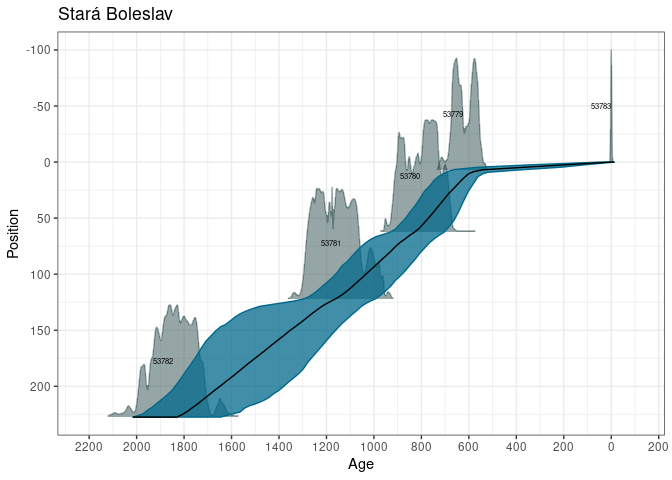
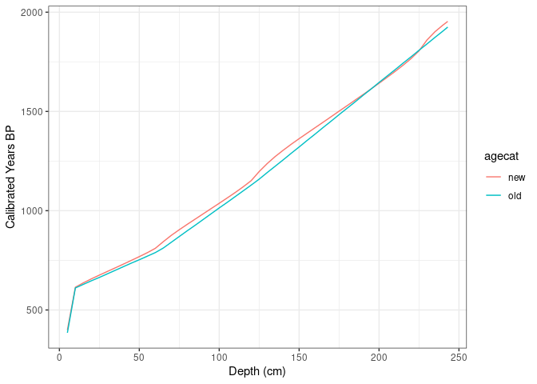

## Building New Chronologies

This RMarkdown document will walk you through the process of:

1.  Downloading a single record
2.  Examining the chronologies for that record and associated chronological controls
3.  Creating a new chronology for the record
4.  Adding the chronology to the record
5.  Switching between default chronologies

This approach is focused on a single record, but much of what is done here can be extended to multiple records using functions.

## Load Libraries

For this workshop element we only need four packages, `neotoma2`, `dplyr`, `ggplot2` and `Bchron`. We'll be loading a record from Neotoma, building a new chronology for the record, and then adding the chronology back to the record.

We'll be using the R package `pacman` here (so really, we need five packages), to automatically load and install packages:


```r
pacman::p_load(neotoma2, dplyr, ggplot2, Bchron)
```

## Loading Datasets

We worked through the process for finding and downloading records using `neotoma2` in the [previous workshop](https://open.neotomadb.org/Current_Workshop/simple_workflow.html). Assuming we found a record that we were interested in, we can go back and pull a single record using its `datasetid`. In this case, the dataset is for [Lago Grande di Monticchio](https://data.neotomadb.org/4275). Let's start by pulling in the record and using the `chronologies()` helper function to look at the chronologies associated with the record:


```r
# We could also search for Lago Monticchio:
# monticchio <- get_sites(sitename = "Lago Grande di Monticchio", datasettype = "pollen") %>%
#   get_downloads()
# But we know the datasetid so we can directly call get_downloads with the datasetid:
monticchio <- get_downloads(4275)
monticchio_chron <- chronologies(monticchio)
monticchio_chron %>% as.data.frame()
```


```
## .
```

```{=html}
<div class="datatables html-widget html-fill-item-overflow-hidden html-fill-item" id="htmlwidget-48517c3ef348ddb8ff5d" style="width:100%;height:auto;"></div>
<script type="application/json" data-for="htmlwidget-48517c3ef348ddb8ff5d">{"x":{"filter":"none","vertical":false,"data":[["1","2","3"],["25746","25747","25748"],["C14 dates at 1180 cm (21290 BP) and at 1204 cm (31800 BP) are not taken into account in this interpolation.","The earlier chronology uses discredited dates. This chronology is based on pollen correlation with the MF-93 core for the Holocene and LGM-90-D core for the pre-Holocene (both based on the 1999 tephra/lamination chronologies).","Linear age model. Based on IntCal09 calibration curve."],["Power interpolation","Linear interpolation","clam"],[46200,69810,16640],[0,0,-40],[1,0,1],["1996-05-13","2001-01-01","2011-01-01"],["Radiocarbon years BP","Radiocarbon years BP","Calibrated radiocarbon years BP"],["EPD","Fossilva","Giesecke et al. 2014 (MADCAP)"]],"container":"<table class=\"display\">\n  <thead>\n    <tr>\n      <th> <\/th>\n      <th>chronologyid<\/th>\n      <th>notes<\/th>\n      <th>agemodel<\/th>\n      <th>ageboundolder<\/th>\n      <th>ageboundyounger<\/th>\n      <th>isdefault<\/th>\n      <th>dateprepared<\/th>\n      <th>modelagetype<\/th>\n      <th>chronologyname<\/th>\n    <\/tr>\n  <\/thead>\n<\/table>","options":{"scrollX":"100%","columnDefs":[{"className":"dt-right","targets":[4,5,6]},{"orderable":false,"targets":0}],"order":[],"autoWidth":false,"orderClasses":false}},"evals":[],"jsHooks":[]}</script>
```

Lago Monticchio has three chronologies and we've decided not to use them because we want to standardize our methods. We want to build a new one with the function `Bchronology()` from the [`Bchron` package](https://cran.r-project.org/web/packages/Bchron/vignettes/Bchron.html).

It's worth pointing out the `isdefault` column here. Neotoma provides the opportunity to link multiple chronologies to a single record. This lets researchers add their chronologies when they publish new studies. For example, the **Wang *et al.*** chronology comes from a set of Bayesian chronologies published by Yue Wang ([Wang *et al*., 2019](https://doi.org/10.1038/s41597-019-0182-7)). For each age type (Radiocarbon years BP, Calendar years BP, &cetera) there is a default chronology that defines the model for the date interpolation. There is also a hierarchy for the default chronologies. By default Neotoma assigns the age model using *calendar years* the highest priority, then *calibrated radiocarbon years*, then *radiocarbon years*. You can see the order in practice if we look at the content of `get_table("age types")`.

### Extract `chroncontrols`

We're going to select chronology `25746` as our template. This is a Power interpolation model that _____ generated. To generate a new chronology for this record we want to see which chronological control points were used for the record. We will extract all the chroncontrols, filter by the chronologyid, and then arrange them by depth:


```r
# Extract the chronological controls used in the original chronology:
controls <- chroncontrols(monticchio) %>% 
  dplyr::filter(chronologyid == 25746) %>% 
  arrange(depth)
```


```{=html}
<div class="datatables html-widget html-fill-item-overflow-hidden html-fill-item" id="htmlwidget-b4376323de37cf4e0df5" style="width:100%;height:auto;"></div>
<script type="application/json" data-for="htmlwidget-b4376323de37cf4e0df5">{"x":{"filter":"none","vertical":false,"data":[["1","2","3","4","5","6"],["3295","3295","3295","3295","3295","3295"],[25746,25746,25746,25746,25746,25746],[675,732,747.5,970,1720,2179],[10,12,15,20,20,10],[18570,21700,24400,33700,38100,41100],[84890,84891,84892,84893,84894,84895],[18010,20700,23280,32980,35700,36900],[18290,21200,23840,33340,36900,39000],["Radiocarbon","Radiocarbon","Radiocarbon","Radiocarbon","Radiocarbon","Radiocarbon"]],"container":"<table class=\"display\">\n  <thead>\n    <tr>\n      <th> <\/th>\n      <th>siteid<\/th>\n      <th>chronologyid<\/th>\n      <th>depth<\/th>\n      <th>thickness<\/th>\n      <th>agelimitolder<\/th>\n      <th>chroncontrolid<\/th>\n      <th>agelimityounger<\/th>\n      <th>chroncontrolage<\/th>\n      <th>chroncontroltype<\/th>\n    <\/tr>\n  <\/thead>\n<\/table>","options":{"scrollX":"100%","columnDefs":[{"className":"dt-right","targets":[2,3,4,5,6,7,8]},{"orderable":false,"targets":0}],"order":[],"autoWidth":false,"orderClasses":false}},"evals":[],"jsHooks":[]}</script>
```

We can look at other tools to decided how we want to manage the chroncontrols, for example, saving them and editing them using Excel or another spreadsheet program. We could add a new date by adding a new row. In this example we're just going to modify the existing ages to provide better constraints at the core top. We are setting the core top to *-55 calibrated years BP*, and assuming an uncertainty of 2 years, and a thickness of 2cm.

This generally won't change too much, and I have no real basis for doing this explicitly, but this is simply for illustration.

To do these assignments we're just directly modifying cells within the `controls` `data.frame`:


```r
# Directly assign the values
controls$chroncontrolage[1] <- 20000	
controls$agelimityounger[1] <- 15000
controls$agelimitolder[1] <- 29000
controls$thickness[1] <- 16
```


```{=html}
<div class="datatables html-widget html-fill-item-overflow-hidden html-fill-item" id="htmlwidget-1c2443bad2332cae24d7" style="width:100%;height:auto;"></div>
<script type="application/json" data-for="htmlwidget-1c2443bad2332cae24d7">{"x":{"filter":"none","vertical":false,"data":[["1","2","3","4","5","6"],["3295","3295","3295","3295","3295","3295"],[25746,25746,25746,25746,25746,25746],[675,732,747.5,970,1720,2179],[16,12,15,20,20,10],[29000,21700,24400,33700,38100,41100],[84890,84891,84892,84893,84894,84895],[15000,20700,23280,32980,35700,36900],[20000,21200,23840,33340,36900,39000],["Radiocarbon","Radiocarbon","Radiocarbon","Radiocarbon","Radiocarbon","Radiocarbon"]],"container":"<table class=\"display\">\n  <thead>\n    <tr>\n      <th> <\/th>\n      <th>siteid<\/th>\n      <th>chronologyid<\/th>\n      <th>depth<\/th>\n      <th>thickness<\/th>\n      <th>agelimitolder<\/th>\n      <th>chroncontrolid<\/th>\n      <th>agelimityounger<\/th>\n      <th>chroncontrolage<\/th>\n      <th>chroncontroltype<\/th>\n    <\/tr>\n  <\/thead>\n<\/table>","options":{"scrollX":"100%","columnDefs":[{"className":"dt-right","targets":[2,3,4,5,6,7,8]},{"orderable":false,"targets":0}],"order":[],"autoWidth":false,"orderClasses":false}},"evals":[],"jsHooks":[]}</script>
```

### Extract Depth & Analysis Unit IDs

Once our `chroncontrols` table is updated, we extract the `depth`s and `analysisunitid`s from the dataset `samples()`. Pulling in both `depth`s and `analysisunitid`s is important because a single collection unit may have multiple datasets, which may have non-overlapping depth sequences. So, when adding sample ages back to a record we use the `analysisunitid` to make sure we are providing the correct assignment since depth may be specific to a single dataset.


```r
# Get a two column data.frame with columns depth and analysisunitid.
# Sort the table by depth from top to bottom for "Bchronology"
predictDepths <- samples(monticchio) %>%
  select(depth, analysisunitid) %>% 
  unique() %>% 
  arrange(depth)

# Pass the values from `controls`. We're assuming the difference between
# chroncontrolage and the agelimityounger is 1 SD.
# Note that for the parameter 'calCurves' we are using a "normal" 
# distribution for the modern sample (core top) and choosing the
# IntCal20 curve for the other two radiocarbon dates.

newChron <- Bchron::Bchronology(ages = controls$chroncontrolage,
                                ageSds = abs(controls$agelimityounger - 
                                               controls$chroncontrolage),
                                calCurves = c("normal", rep("intcal20", 5)),
                                positionThicknesses = controls$thickness,
                                positions = controls$depth,
                                predictPositions = predictDepths$depth,
                                allowOutside = TRUE,
                                ids = controls$chroncontrolid)

# Predict ages at each depth for which we have samples.  Returns a matrix.
newpredictions <- predict(newChron, predictDepths$depth)
```


```r
plot(newChron) +
  ggplot2::labs(
    xlab = "Age (cal years BP)",
    ylab = "Depth (cm)"
  )
```



### Creating the New `chronology` and `contact` objects

Given the new chronology, we want to add it to the `sites` object so that it becomes the default for any calls to `samples()`. To create the metadata for the new chronology, we use `set_chronology()` using the properties from the [`chronology` table in Neotoma](https://open.neotomadb.org/dbschema/tables/chronologies.html):


```r
# Add information about the people who generated the new chronology:
creators <- c(set_contact(givennames = "Simon James",
                          familyname = "Goring",
                          ORCID = "0000-0002-2700-4605"),
              set_contact(givennames = "Socorro",
                          familyname = "Dominguez Vidaña",
                          ORCID = "0000-0002-7926-4935"))

# Add information about the chronology:
newChronmonticchio <- set_chronology(agemodel = "Bchron model",
                                contact = creators,
                                isdefault = 1,
                                ageboundolder = max(newpredictions),
                                ageboundyounger = min(newpredictions),
                                dateprepared = lubridate::today(),
                                modelagetype = "Calendar years BP",
                                chronologyname = "Simon's example chronology",
                                chroncontrols = controls)


newChronmonticchio$notes <- 'newChron <- Bchron::Bchronology(ages = controls$chroncontrolage,
                                ageSds = abs(controls$agelimityounger - 
                                               controls$chroncontrolage),
                                calCurves = c("normal", rep("intcal20", 2)),
                                positionThicknesses = controls$thickness,
                                positions = controls$depth,
                                allowOutside = TRUE,
                                ids = controls$chroncontrolid,
                                predictPositions = predictDepths)'
```

### Adding the `chronology` to the `collectionunit`

Once we've created the chronology we need to apply it back to the collectionunit. We also need to add the predicted dates into the samples for each dataset associated with the collectionunit.

So:

1.  we have a collectionunit in `monticchio` that is accessible at `monticchio[[1]]$collunits`.
2.  We can use the function `add_chronology()`, which takes the chronology object and a `data.frame()` of sample ages.
3.  The predicted dates associated with the new chronology need to be transferred to each `samples` object within the `collectionunit`.

This is all bound up in the `add_chronology()` function, which takes the `collectionunit`, modifys it, and returns the newly updated `collectionunit`.


```r
newSampleAges <- data.frame(predictDepths,
                            age = colMeans(newpredictions),
                            ageolder = colMeans(newpredictions) + 
                              apply(newpredictions, 2, sd),
                            ageyounger = colMeans(newpredictions) - 
                              apply(newpredictions, 2, sd),
                            agetype = "Calendar years")

monticchio[[1]]$collunits[[1]] <- add_chronology(monticchio[[1]]$collunits[[1]], 
                                            newChronmonticchio, 
                                            newSampleAges)
```

With this, we now have the updated collectionunit. Lets take a look at how this affects the age model overal. To pull the ages from the prior chronologies, we use the `set_default()` function to change the default chronology, and then extract ages, depths & analysisunits:


```r
# The new chronology is currently the default chronology.
newages <- samples(monticchio) %>%
  select(depth, analysisunitid, age) %>% 
  unique() %>% 
  arrange(depth) %>% 
  mutate(agecat = "new")

monticchio[[1]]$collunits[[1]]$chronologies <- set_default(monticchio[[1]]$collunits[[1]]$chronologies,
                                                      25746)
plotforages <- samples(monticchio) %>%
  select(depth, analysisunitid, age) %>% 
  unique() %>% 
  arrange(depth) %>% 
  mutate(agecat = "old") %>% 
  bind_rows(newages)
```

And we can look at the difference visually:


```r
ggplot(plotforages, aes(x = depth, y = age)) +
  geom_path(aes(color = agecat)) +
  theme_bw() +
  xlab("Depth (cm)") +
  ylab("Calibrated Years BP")
```



So we can see the impact of the new chronology on the age model for the record, and we can make choices as to which model we want to use going forward. We can use this approach to create multiple new chronologies for a single record, tuning parameters within `Bchronology()`, or using Bacon and different parameters. Because the `chronology` is an R object we can save the objects for use in future sessions, and associate them with existin records, or we can re-run the models again.

## Summary

From this notebook we have learned how to:

1.  Download a single record (the monticchio record using `get_downloads()`)
2.  Examining the chronologies for the record (using `chronologies()` and associated chronological controls (using `chroncontrols()`)
3.  Creating a new chronology for the record (using `set_chronology()`)
4.  Adding the chronology to the record (using `add_chronology()`)
5.  Switching between default chronologies (using `set_default()`)

This approach is focused on a single record, but much of what is done here can be extended to multiple records using functions. We hope it's been helpful!
