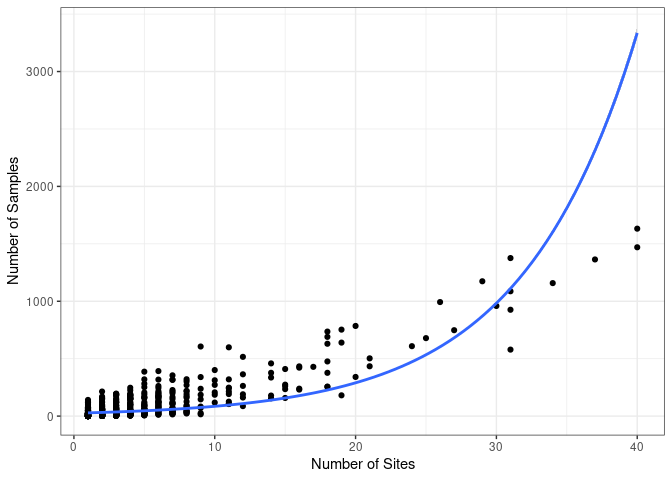
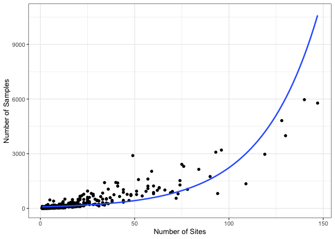
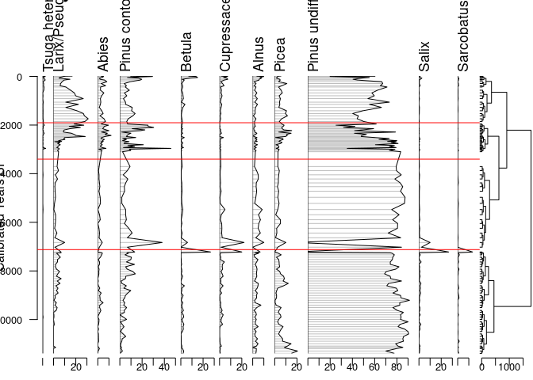
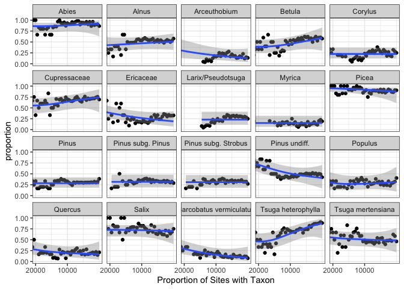
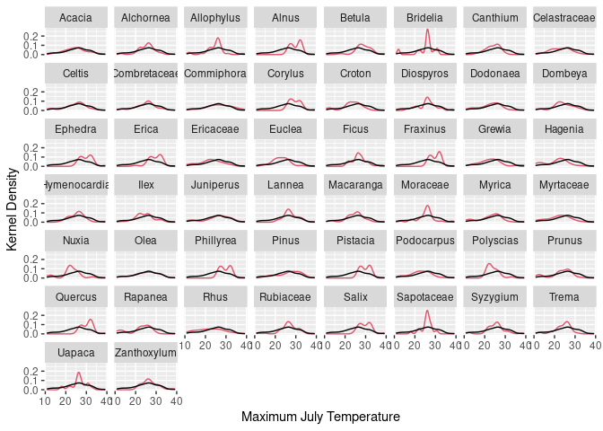

## 1. Introduction

This document is intended to act as a primer for the use of the new Neotoma R package, `neotoma2`.  Some users may be working with this document as part of a workshop for which there is a Binder instance. The Binder instance will run RStudio in your browser, with all the required packages installed.

If you are using this workflow on its own, or want to use the package directly, [the `neotoma2` package](https://github.com/NeotomaDB/neotoma2) is available from GitHub and can be installed in R using the `devtools` package by running:

```r
devtools::install_github('NeotomaDB/neotoma2')
library(neotoma2)
```

This workshop will also require other packages. To maintain the flow of this document we've placed instructions at the end of the document in the section labelled "[Installing packages on your own](#localinstall)".

## 2. Learning Goals

In this tutorial you will learn how to:

* Search for sites using site names and geographic parameters -- [Site Searches](#3-site-searches)
* Filter results using temporal and spatial parameters -- [Filter Results](#33-filter-records-tabset)
* Obtain sample information for the selected datasets -- [Sample Information](#34-pulling-in-sample-data)
* Perform basic analysis including the use of climate data from rasters -- [Basic Analysis](#4-simple-analytics)

### 2.1. Getting Help with Neotoma

If you're planning on working with Neotoma, please join us on [Slack](https://join.slack.com/t/neotomadb/shared_invite/zt-cvsv53ep-wjGeCTkq7IhP6eUNA9NxYQ) where we manage a channel specifically for questions about the R package. You may also wish to join our Google Groups mailing list, please [contact us](mailto:neotoma-contact@googlegroups.com) to be added.

### 2.2 Understanding Data Structures in Neotoma

Data in the Neotoma database itself is structured as a set of linked relationships to express the different elements of paleoecological analysis: space and time, raw data, scientific methods and data models. Because paleoecology is such a broad discipline these relationships can be complex, and as such, the database itself is highly structured. If you want to better understand concepts within the database, you can read the [Neotoma Database Manual](https://open.neotomadb.org/manual), or take a look at [the database schema itself](https://open.neotomadb.org/dbschema).

In this workshop we want to highlight two key structural concepts:
  
  1. The way data is structured conceptually within Neotoma (Sites, Collection Units and Datasets).
  2. The way that this structure is adapted within the `neotoma2` R package.

### 2.2.1 Data Structure in the Neotoma Database

{width=50%}

Data in Neotoma is associated with sites -- specific locations with lat/long coordinates.

Within a **site**, there may be one or more [**collection units**](https://open.neotomadb.org/manual/dataset-collection-related-tables-1.html#CollectionUnits) -- locations at which samples are physically collected within the site. For example, an archaeological **site** may have one or more **collection units**, pits within a broader dig site; a pollen sampling **site** on a lake may have multiple **collection units** -- core sites within the lake basin. Collection units may have higher resolution GPS locations than the site location, but are considered to be part of the broader site.\

Within a **collection unit** data is collected at various [**analysis units**]. Any data sampled within an analysis unit is grouped by data type and aggregated into a sample. The set of samples for a collection unit of a particular data type is then assigned to a dataset.

### 2.2.2 Data Structures in `neotoma2`


If we look at the [UML diagram](https://en.wikipedia.org/wiki/Unified_Modeling_Language) for the objects in the `neotoma2` R package we can see that the data structure generally mimics the structure within the database itself.  As we will see in the [Site Searches section](#3-site-searches), we can search for these objects, and begin to manipulate them (in the [Simple Analysis section](#4-simple-analytics)).

It is important to note: *within the `neotoma2` R package, most objects are `sites` objects, they just contain more or less data*.  There are a set of functions that can operate on `sites`.  As we add to `sites` objects, using `get_datasets()` or `get_downloads()`, we are able to use more of these helper functions.

### 2.2.3 Piping in `R` {.tabset}

Piping is a technique that simplifies the process of chaining multiple operations on a data object. It involves using either of these operators: `|>` or `%>%`. `|>` is a base R operator while `%>%` comes from the `tidyverse` ecosystem in R. In `neotoma2` we use `%>%`.

The pipe operator works as a real-life pipe, which carries water from one location to another. In programming, the output of the function on the left-hand side of the pipe is taken as the initial argument for the function on the right-hand side of the pipe. It helps by making code easier to write and read. Additionally, it reduces the number of intermediate objects created during data processing, which can make code more memory-efficient and faster.

You can retrieve a site and then plot it by doing:
```
# Retrieve the site
plot_site <- neotoma2::get_sites(sitename = "%Swamp%")
# Plot the site
neotoma2::plotLeaflet(plot_site)
```

This would create a variable `plot_site` that maybe we will not need any more but was necessary so that we could pass it to the `plotLeaflet` function.

When we pipe using `%>%`, we do not need to create the variable that we need to pass:

#### 2.2.3.1. Code


```r
# get_sites and pipe
get_sites(sitename = "%Swamp%") %>%
  # Notice that the next function does not need the first argument 
  # because the response of `get_sites(sitename = "%Swamp%") will be used
  # as the argument.
  plotLeaflet()
```
#### 2.2.3.2. Result


```{=html}
<div class="leaflet html-widget html-fill-item-overflow-hidden html-fill-item" id="htmlwidget-c7d5692730ef673d9ee4" style="width:672px;height:480px;"></div>
<script type="application/json" data-for="htmlwidget-c7d5692730ef673d9ee4">{"x":{"options":{"crs":{"crsClass":"L.CRS.EPSG3857","code":null,"proj4def":null,"projectedBounds":null,"options":{}}},"calls":[{"method":"addProviderTiles","args":["Stamen.TerrainBackground",null,null,{"errorTileUrl":"","noWrap":false,"detectRetina":false}]},{"method":"addTiles","args":["https://{s}.tile.openstreetmap.org/{z}/{x}/{y}.png",null,null,{"minZoom":0,"maxZoom":18,"tileSize":256,"subdomains":"abc","errorTileUrl":"","tms":false,"noWrap":false,"zoomOffset":0,"zoomReverse":false,"opacity":1,"zIndex":1,"detectRetina":false,"attribution":"&copy; <a href=\"https://openstreetmap.org\">OpenStreetMap<\/a> contributors, <a href=\"https://creativecommons.org/licenses/by-sa/2.0/\">CC-BY-SA<\/a>"}]},{"method":"addCircleMarkers","args":[[-36.51667,42.51667,36.65,36.66667,36.58333,48.75,46.51667,40.48333,44.18,-3.43333,44.89167,37.95,41.95,46.36139,40.11667,-41.12666,-40.529062,-35.7077,41.933788,43.095992,43.095252,42.5372,42.2384,39.535,42.3272],[149.5,-72.2125,-76.47917,-76.36667,-76.45,28.25,32.61667,-75.66667,-79.44,29.61667,-93.69167,-119.81667,-71.03333,19.99417,-83.25,144.67463,144.749224,148.885604,-70.761514,-78.01244,-78.021982,-72.18356,-73.4206,-79.5388,-73.4964],10,null,null,{"interactive":true,"draggable":false,"keyboard":true,"title":"","alt":"","zIndexOffset":0,"opacity":1,"riseOnHover":true,"riseOffset":250,"stroke":true,"color":"#03F","weight":5,"opacity.1":0.5,"fill":true,"fillColor":"#03F","fillOpacity":0.2},{"showCoverageOnHover":true,"zoomToBoundsOnClick":true,"spiderfyOnMaxZoom":true,"removeOutsideVisibleBounds":true,"spiderLegPolylineOptions":{"weight":1.5,"color":"#222","opacity":0.5},"freezeAtZoom":false},null,["<b>Bega Swamp<\/b><br><b>Description:<\/b> NA<br><a href=http://apps.neotomadb.org/explorer/?siteids=247>Explorer Link<\/a>","<b>Tom Swamp<\/b><br><b>Description:<\/b> Larix-Picea mariana-Sphagnum bog. Physiography: rolling topog.- valley between ridges. Surrounding vegetation: oak with mixed hardwd/hemlock/white pine.<br><a href=http://apps.neotomadb.org/explorer/?siteids=562>Explorer Link<\/a>","<b>Dismal Swamp (4)<\/b><br><b>Description:<\/b> NA<br><a href=http://apps.neotomadb.org/explorer/?siteids=676>Explorer Link<\/a>","<b>Dismal Swamp (6)<\/b><br><b>Description:<\/b> NA<br><a href=http://apps.neotomadb.org/explorer/?siteids=678>Explorer Link<\/a>","<b>Dismal Swamp (91)<\/b><br><b>Description:<\/b> NA<br><a href=http://apps.neotomadb.org/explorer/?siteids=679>Explorer Link<\/a>","<b>Dovjok Swamp<\/b><br><b>Description:<\/b> Floodplain Phragmites fen. Physiography: floodplain in Murafa Basin. Surrounding vegetation: herb steppe, Quercus/Carpinus forest.<br><a href=http://apps.neotomadb.org/explorer/?siteids=703>Explorer Link<\/a>","<b>Kardashinski Swamp<\/b><br><b>Description:<\/b> Phragmites fen. Physiography: Floodplain of Dniepr River. Vegetation formation: Steppe.<br><a href=http://apps.neotomadb.org/explorer/?siteids=1403>Explorer Link<\/a>","<b>Longswamp<\/b><br><b>Description:<\/b> NA<br><a href=http://apps.neotomadb.org/explorer/?siteids=1610>Explorer Link<\/a>","<b>Rose Swamp<\/b><br><b>Description:<\/b> Swamp in drumlin field. Physiography: Newmarket till plain. Surrounding vegetation: Pinus/Tsuga/Juniperus/Acer/Fagus/Ulmus.<br><a href=http://apps.neotomadb.org/explorer/?siteids=2210>Explorer Link<\/a>","<b>Rusaka Swamp<\/b><br><b>Description:<\/b> Raised mire, drained for agriculture. Physiography: Burundi highlands. Surrounding vegetation: sweet potato, bean, and manihot fields.<br><a href=http://apps.neotomadb.org/explorer/?siteids=2233>Explorer Link<\/a>","<b>Stone Lake Tamarack Swamp<\/b><br><b>Description:<\/b> Larix swamp. Physiography: low rolling relief. Surrounding vegetation: Larix/Salix/Cornus/Typha.<br><a href=http://apps.neotomadb.org/explorer/?siteids=2519>Explorer Link<\/a>","<b>Swamp Lake<\/b><br><b>Description:<\/b> Small lake. Physiography: Sierra Nevada Mountain Range. Surrounding vegetation: Pinus ponderosa, Pinus jeffreyi.<br><a href=http://apps.neotomadb.org/explorer/?siteids=2529>Explorer Link<\/a>","<b>Titicut Swamp<\/b><br><b>Description:<\/b> Kettle lake. Physiography: glaciated Tauton River Valley. Surrounding vegetation: Acer/Ilex/Clethra/Vaccinium.<br><a href=http://apps.neotomadb.org/explorer/?siteids=2554>Explorer Link<\/a>","<b>Zsombó Swamp<\/b><br><b>Description:<\/b> Swamp area formed between drift sand dun. Surrounding vegetation: fragments of riparian forest.<br><a href=http://apps.neotomadb.org/explorer/?siteids=3523>Explorer Link<\/a>","<b>Wild Cat Swamp [OSU-14925]<\/b><br><b>Description:<\/b> NA<br><a href=http://apps.neotomadb.org/explorer/?siteids=6385>Explorer Link<\/a>","<b>Sundown Swamp<\/b><br><b>Description:<\/b> Interdunal Melaleuca ericifolia swamp. Physiography: Coastal plateau with dunes. Surrounding vegetation: Epacris- Leptospermum heath.<br><a href=http://apps.neotomadb.org/explorer/?siteids=10009>Explorer Link<\/a>","<b>Stockyard Swamp<\/b><br><b>Description:<\/b> Seasonally inundated interdunal pond on Hunter Island. Tall Melaleuca ericifolia thicket occur on northern and eastern sides. Physiography: stabilised coastal dunefield. Surrounding vegetation: sedge fen, Eucalyptus woodland, and pasture.<br><a href=http://apps.neotomadb.org/explorer/?siteids=10016>Explorer Link<\/a>","<b>Rotten Swamp<\/b><br><b>Description:<\/b> Subalpine Sphagnum–Epacris shrub bog with Empodisma fen and Carex fen. Surrounding vegetation: Eucalyptus open forest.<br><a href=http://apps.neotomadb.org/explorer/?siteids=10024>Explorer Link<\/a>","<b>Makepeace Cedar Swamp<\/b><br><b>Description:<\/b> Closed basin mire located in sandy outwash along the margin of the Monk's Hill recessional moraine. Surrounding vegetation: Quercus, Pinus strobus, Betula, Acer rubrum, Tsuga canadensis, and Fagus grandifolia. Grass with cedar immediately at site.<br><a href=http://apps.neotomadb.org/explorer/?siteids=10076>Explorer Link<\/a>","<b>Byron-Bergen Swamp (Site 2)<\/b><br><b>Description:<\/b> Open marl fen. Surrounding vegetation -- Sedges: Eleocharis rostellata. Trees: Thuja occidentalis, Larix laricina, Pinus strobus. Shrubs: Myrica pensylvanica, Rhamnus alnifolia, Ledum groenlandicum.<br><a href=http://apps.neotomadb.org/explorer/?siteids=10155>Explorer Link<\/a>","<b>Byron-Bergen Swamp (Site 1)<\/b><br><b>Description:<\/b> Closed-canopy swamp forest. Surrounding vegetation: Pinus strobus, Acer rubrum, Tsuga canadensis, Acer saccharum, Thuja occidentalis, Betua alleghaniensis, Fraxinus sp., Zanthoxylum americanum.<br><a href=http://apps.neotomadb.org/explorer/?siteids=10157>Explorer Link<\/a>","<b>Black Gum Swamp<\/b><br><b>Description:<\/b> Swamp that occupies an irregularly shaped basin that drains to the southwest through an intermittent stream. Surrounding vegetation: Picea rubens, Nyssa sylvatica, and Acer rubrum in the overstory. Ilex, Nemopanthus, Vaccinium, and Viburnum in the understory. Ground layer of Sphagnum, Osmunda, and herbs.<br><a href=http://apps.neotomadb.org/explorer/?siteids=10172>Explorer Link<\/a>","<b>Alford Swamp<\/b><br><b>Description:<\/b> Elongate swampy area in glacial drift. Red maple trees and juneberry with a ground cover of sedge, Sphagnum, marsh marigold, Osmunda, and other fern types.<br><a href=http://apps.neotomadb.org/explorer/?siteids=10177>Explorer Link<\/a>","<b>Cranesville Pine Swamp<\/b><br><b>Description:<\/b> Swamp in an elongate depression on the Appalachian Plateau, Allegheny Mountains Section. . . . . . Surrounding vegetation: Ground cover is hummock sedge and Sphagnum moss interspersed with Osmunda, cattail, skunk cabbage, Rhododendron, and alder in the wetter sites. Tree cover is predominantly spruce with tamarack and red maple of secondary importance.<br><a href=http://apps.neotomadb.org/explorer/?siteids=10179>Explorer Link<\/a>","<b>State Line Swamp<\/b><br><b>Description:<\/b> Swamp in glacial drift. Surrounding vegetation: White pine, hemlock, and red maple with a substratum of Sphagnum and Osmunda.<br><a href=http://apps.neotomadb.org/explorer/?siteids=10182>Explorer Link<\/a>"],null,null,{"interactive":false,"permanent":false,"direction":"auto","opacity":1,"offset":[0,0],"textsize":"10px","textOnly":false,"className":"","sticky":true},null]}],"limits":{"lat":[-41.12666,48.75],"lng":[-119.81667,149.5]}},"evals":[],"jsHooks":[]}</script>
```


## 3. Site Searches

### 3.1. `get_sites()`

There are several ways to find sites in `neotoma2`, but we think of `sites` as being spatial objects primarily. They have names, locations, and are found within the context of geopolitical units, but within the API and the package, the site itself does not have associated information about taxa, dataset types or ages.  It is simply the container into which we add that information.  So, when we search for sites we can search by:

| Parameter | Description |
| --------- | ----------- |
| sitename | A valid site name (case insensitive) using `%` as a wildcard. |
| siteid | A unique numeric site id from the Neotoma Database |
| loc | A bounding box vector, geoJSON or WKT string. |
| altmin | Lower altitude bound for sites. |
| altmax | Upper altitude bound for site locations. |
| database | The constituent database from which the records are pulled. |
| datasettype | The kind of dataset (see `get_tables(datasettypes)`) |
| datasetid | Unique numeric dataset identifier in Neotoma |
| doi | A valid dataset DOI in Neotoma |
| gpid | A unique numeric identifier, or text string identifying a geopolitical unit in Neotoma |
| keywords | Unique sample keywords for records in Neotoma. |
| contacts | A name or numeric id for individuals associuated with sites. |
| taxa | Unique numeric identifiers or taxon names associated with sites. |

All sites in Neotoma contain one or more datasets. It's worth noting that the results of these search parameters may be slightly unexpected. For example, searching for sites by sitename, latitude, or altitude will return all of the datasets for the particular site. Searching for terms such as datasettype, datasetid or taxa will return the site, but the only datasets returned will be those matching the dataset-specific search terms. We'll see this later.

#### 3.1.1. Site names: `sitename="%Swamp%"` {.tabset}

We may know exactly what site we're looking for ("Mubwindi Swamp"), or have an approximate guess for the site name (for example, we know it's something like "Swamp of Mubwindi", or "Swampy Marsh Mubwindi", but we're not sure how it was entered specifically), or we may want to search all sites that have a specific term, for example, *Swamp*.

We use the general format: `get_sites(sitename="XXXXX")` for searching by name.

PostgreSQL (and the API) uses the percent sign as a wildcard.  So `"%Swamp%"` would pick up ["Tamsaa Swamp"](https://data.neotomadb.org/52520) for us (and would pick up "Misery Swamp" and "Swamp of Unending Mosquitoes" if records for these locations existed).  Note that the search query is also case insensitive, so you could simply write `"%SWAMP%"`.

##### 3.1.1.1. Code


```r
swamp_sites <- neotoma2::get_sites(sitename = "%Swamp%")
plotLeaflet(swamp_sites)
```

##### 3.1.1.2. Result


```{=html}
<div class="leaflet html-widget html-fill-item-overflow-hidden html-fill-item" id="htmlwidget-cb6f2a96a8b447c86382" style="width:672px;height:480px;"></div>
<script type="application/json" data-for="htmlwidget-cb6f2a96a8b447c86382">{"x":{"options":{"crs":{"crsClass":"L.CRS.EPSG3857","code":null,"proj4def":null,"projectedBounds":null,"options":{}}},"calls":[{"method":"addProviderTiles","args":["Stamen.TerrainBackground",null,null,{"errorTileUrl":"","noWrap":false,"detectRetina":false}]},{"method":"addTiles","args":["https://{s}.tile.openstreetmap.org/{z}/{x}/{y}.png",null,null,{"minZoom":0,"maxZoom":18,"tileSize":256,"subdomains":"abc","errorTileUrl":"","tms":false,"noWrap":false,"zoomOffset":0,"zoomReverse":false,"opacity":1,"zIndex":1,"detectRetina":false,"attribution":"&copy; <a href=\"https://openstreetmap.org\">OpenStreetMap<\/a> contributors, <a href=\"https://creativecommons.org/licenses/by-sa/2.0/\">CC-BY-SA<\/a>"}]},{"method":"addCircleMarkers","args":[[-36.51667,42.51667,36.65,36.66667,36.58333,48.75,46.51667,40.48333,44.18,-3.43333,44.89167,37.95,41.95,46.36139,40.11667,-41.12666,-40.529062,-35.7077,41.933788,43.095992,43.095252,42.5372,42.2384,39.535,42.3272],[149.5,-72.2125,-76.47917,-76.36667,-76.45,28.25,32.61667,-75.66667,-79.44,29.61667,-93.69167,-119.81667,-71.03333,19.99417,-83.25,144.67463,144.749224,148.885604,-70.761514,-78.01244,-78.021982,-72.18356,-73.4206,-79.5388,-73.4964],10,null,null,{"interactive":true,"draggable":false,"keyboard":true,"title":"","alt":"","zIndexOffset":0,"opacity":1,"riseOnHover":true,"riseOffset":250,"stroke":true,"color":"#03F","weight":5,"opacity.1":0.5,"fill":true,"fillColor":"#03F","fillOpacity":0.2},{"showCoverageOnHover":true,"zoomToBoundsOnClick":true,"spiderfyOnMaxZoom":true,"removeOutsideVisibleBounds":true,"spiderLegPolylineOptions":{"weight":1.5,"color":"#222","opacity":0.5},"freezeAtZoom":false},null,["<b>Bega Swamp<\/b><br><b>Description:<\/b> NA<br><a href=http://apps.neotomadb.org/explorer/?siteids=247>Explorer Link<\/a>","<b>Tom Swamp<\/b><br><b>Description:<\/b> Larix-Picea mariana-Sphagnum bog. Physiography: rolling topog.- valley between ridges. Surrounding vegetation: oak with mixed hardwd/hemlock/white pine.<br><a href=http://apps.neotomadb.org/explorer/?siteids=562>Explorer Link<\/a>","<b>Dismal Swamp (4)<\/b><br><b>Description:<\/b> NA<br><a href=http://apps.neotomadb.org/explorer/?siteids=676>Explorer Link<\/a>","<b>Dismal Swamp (6)<\/b><br><b>Description:<\/b> NA<br><a href=http://apps.neotomadb.org/explorer/?siteids=678>Explorer Link<\/a>","<b>Dismal Swamp (91)<\/b><br><b>Description:<\/b> NA<br><a href=http://apps.neotomadb.org/explorer/?siteids=679>Explorer Link<\/a>","<b>Dovjok Swamp<\/b><br><b>Description:<\/b> Floodplain Phragmites fen. Physiography: floodplain in Murafa Basin. Surrounding vegetation: herb steppe, Quercus/Carpinus forest.<br><a href=http://apps.neotomadb.org/explorer/?siteids=703>Explorer Link<\/a>","<b>Kardashinski Swamp<\/b><br><b>Description:<\/b> Phragmites fen. Physiography: Floodplain of Dniepr River. Vegetation formation: Steppe.<br><a href=http://apps.neotomadb.org/explorer/?siteids=1403>Explorer Link<\/a>","<b>Longswamp<\/b><br><b>Description:<\/b> NA<br><a href=http://apps.neotomadb.org/explorer/?siteids=1610>Explorer Link<\/a>","<b>Rose Swamp<\/b><br><b>Description:<\/b> Swamp in drumlin field. Physiography: Newmarket till plain. Surrounding vegetation: Pinus/Tsuga/Juniperus/Acer/Fagus/Ulmus.<br><a href=http://apps.neotomadb.org/explorer/?siteids=2210>Explorer Link<\/a>","<b>Rusaka Swamp<\/b><br><b>Description:<\/b> Raised mire, drained for agriculture. Physiography: Burundi highlands. Surrounding vegetation: sweet potato, bean, and manihot fields.<br><a href=http://apps.neotomadb.org/explorer/?siteids=2233>Explorer Link<\/a>","<b>Stone Lake Tamarack Swamp<\/b><br><b>Description:<\/b> Larix swamp. Physiography: low rolling relief. Surrounding vegetation: Larix/Salix/Cornus/Typha.<br><a href=http://apps.neotomadb.org/explorer/?siteids=2519>Explorer Link<\/a>","<b>Swamp Lake<\/b><br><b>Description:<\/b> Small lake. Physiography: Sierra Nevada Mountain Range. Surrounding vegetation: Pinus ponderosa, Pinus jeffreyi.<br><a href=http://apps.neotomadb.org/explorer/?siteids=2529>Explorer Link<\/a>","<b>Titicut Swamp<\/b><br><b>Description:<\/b> Kettle lake. Physiography: glaciated Tauton River Valley. Surrounding vegetation: Acer/Ilex/Clethra/Vaccinium.<br><a href=http://apps.neotomadb.org/explorer/?siteids=2554>Explorer Link<\/a>","<b>Zsombó Swamp<\/b><br><b>Description:<\/b> Swamp area formed between drift sand dun. Surrounding vegetation: fragments of riparian forest.<br><a href=http://apps.neotomadb.org/explorer/?siteids=3523>Explorer Link<\/a>","<b>Wild Cat Swamp [OSU-14925]<\/b><br><b>Description:<\/b> NA<br><a href=http://apps.neotomadb.org/explorer/?siteids=6385>Explorer Link<\/a>","<b>Sundown Swamp<\/b><br><b>Description:<\/b> Interdunal Melaleuca ericifolia swamp. Physiography: Coastal plateau with dunes. Surrounding vegetation: Epacris- Leptospermum heath.<br><a href=http://apps.neotomadb.org/explorer/?siteids=10009>Explorer Link<\/a>","<b>Stockyard Swamp<\/b><br><b>Description:<\/b> Seasonally inundated interdunal pond on Hunter Island. Tall Melaleuca ericifolia thicket occur on northern and eastern sides. Physiography: stabilised coastal dunefield. Surrounding vegetation: sedge fen, Eucalyptus woodland, and pasture.<br><a href=http://apps.neotomadb.org/explorer/?siteids=10016>Explorer Link<\/a>","<b>Rotten Swamp<\/b><br><b>Description:<\/b> Subalpine Sphagnum–Epacris shrub bog with Empodisma fen and Carex fen. Surrounding vegetation: Eucalyptus open forest.<br><a href=http://apps.neotomadb.org/explorer/?siteids=10024>Explorer Link<\/a>","<b>Makepeace Cedar Swamp<\/b><br><b>Description:<\/b> Closed basin mire located in sandy outwash along the margin of the Monk's Hill recessional moraine. Surrounding vegetation: Quercus, Pinus strobus, Betula, Acer rubrum, Tsuga canadensis, and Fagus grandifolia. Grass with cedar immediately at site.<br><a href=http://apps.neotomadb.org/explorer/?siteids=10076>Explorer Link<\/a>","<b>Byron-Bergen Swamp (Site 2)<\/b><br><b>Description:<\/b> Open marl fen. Surrounding vegetation -- Sedges: Eleocharis rostellata. Trees: Thuja occidentalis, Larix laricina, Pinus strobus. Shrubs: Myrica pensylvanica, Rhamnus alnifolia, Ledum groenlandicum.<br><a href=http://apps.neotomadb.org/explorer/?siteids=10155>Explorer Link<\/a>","<b>Byron-Bergen Swamp (Site 1)<\/b><br><b>Description:<\/b> Closed-canopy swamp forest. Surrounding vegetation: Pinus strobus, Acer rubrum, Tsuga canadensis, Acer saccharum, Thuja occidentalis, Betua alleghaniensis, Fraxinus sp., Zanthoxylum americanum.<br><a href=http://apps.neotomadb.org/explorer/?siteids=10157>Explorer Link<\/a>","<b>Black Gum Swamp<\/b><br><b>Description:<\/b> Swamp that occupies an irregularly shaped basin that drains to the southwest through an intermittent stream. Surrounding vegetation: Picea rubens, Nyssa sylvatica, and Acer rubrum in the overstory. Ilex, Nemopanthus, Vaccinium, and Viburnum in the understory. Ground layer of Sphagnum, Osmunda, and herbs.<br><a href=http://apps.neotomadb.org/explorer/?siteids=10172>Explorer Link<\/a>","<b>Alford Swamp<\/b><br><b>Description:<\/b> Elongate swampy area in glacial drift. Red maple trees and juneberry with a ground cover of sedge, Sphagnum, marsh marigold, Osmunda, and other fern types.<br><a href=http://apps.neotomadb.org/explorer/?siteids=10177>Explorer Link<\/a>","<b>Cranesville Pine Swamp<\/b><br><b>Description:<\/b> Swamp in an elongate depression on the Appalachian Plateau, Allegheny Mountains Section. . . . . . Surrounding vegetation: Ground cover is hummock sedge and Sphagnum moss interspersed with Osmunda, cattail, skunk cabbage, Rhododendron, and alder in the wetter sites. Tree cover is predominantly spruce with tamarack and red maple of secondary importance.<br><a href=http://apps.neotomadb.org/explorer/?siteids=10179>Explorer Link<\/a>","<b>State Line Swamp<\/b><br><b>Description:<\/b> Swamp in glacial drift. Surrounding vegetation: White pine, hemlock, and red maple with a substratum of Sphagnum and Osmunda.<br><a href=http://apps.neotomadb.org/explorer/?siteids=10182>Explorer Link<\/a>"],null,null,{"interactive":false,"permanent":false,"direction":"auto","opacity":1,"offset":[0,0],"textsize":"10px","textOnly":false,"className":"","sticky":true},null]}],"limits":{"lat":[-41.12666,48.75],"lng":[-119.81667,149.5]}},"evals":[],"jsHooks":[]}</script>
```

#### 3.1.2. Location: `loc=c()` {.tabset}

The `neotoma` package used a bounding box for locations, structured as a vector of latitude and longitude values: `c(xmin, ymin, xmax, ymax)`.  The `neotoma2` R package supports both this simple bounding box, but also more complex spatial objects, using the [`sf` package](https://r-spatial.github.io/sf/). Using the `sf` package allows us to more easily work with raster and polygon data in R, and to select sites from more complex spatial objects.  The `loc` parameter works with the simple vector, [WKT](https://arthur-e.github.io/Wicket/sandbox-gmaps3.html), [geoJSON](http://geojson.io/#map=2/20.0/0.0) objects and native `sf` objects in R.

Looking for sites using a location. We're putting a rough representations of Africa.  To work with this spatial object in R we also transformed the `geoJSON` element to an object for the `sf` package.  There are many other tools to work with spatial objects in R. Regardless of how you get the data into R, `neotoma2` works with almost all objects in the `sf` package.


```r
geoJSON <- '{"coordinates": [[
            [-12.34, 30.37],
            [-18.67, 24.60],
            [-17.44, 8.32],
            [14.72, -37.64],
            [50.05, -29.15],
            [52.87, 11.60],
            [43.02, 21.20],
            [23.86, 39.43],
            [-5.83, 35.53],
            [-12.34, 30.37]
          ]], "type": "Polygon"}'

african_sf <- geojsonsf::geojson_sf(geoJSON)

# Note here we use the `all_data` flag to capture all the sites.
african_sites <- neotoma2::get_sites(loc = african_sf, all_data = TRUE)
```

You can always simply `plot()` the `sites` objects, but you will lose some of the geographic context.  The `plotLeaflet()` function returns a `leaflet()` map, and allows you to further customize it, or add additional spatial data (like our original bounding polygon, `sa_sf`, which works directly with the R `leaflet` package):

##### 3.1.2.1. Code


```r
neotoma2::plotLeaflet(african_sites) %>% 
  leaflet::addPolygons(map = ., 
                       data = african_sf, 
                       color = "green")
```

##### 3.1.2.2. Result


```{=html}
<div class="leaflet html-widget html-fill-item-overflow-hidden html-fill-item" id="htmlwidget-0ac8ffead15af0125c3e" style="width:672px;height:480px;"></div>
<script type="application/json" data-for="htmlwidget-0ac8ffead15af0125c3e">{"x":{"options":{"crs":{"crsClass":"L.CRS.EPSG3857","code":null,"proj4def":null,"projectedBounds":null,"options":{}}},"calls":[{"method":"addProviderTiles","args":["Stamen.TerrainBackground",null,null,{"errorTileUrl":"","noWrap":false,"detectRetina":false}]},{"method":"addTiles","args":["https://{s}.tile.openstreetmap.org/{z}/{x}/{y}.png",null,null,{"minZoom":0,"maxZoom":18,"tileSize":256,"subdomains":"abc","errorTileUrl":"","tms":false,"noWrap":false,"zoomOffset":0,"zoomReverse":false,"opacity":1,"zIndex":1,"detectRetina":false,"attribution":"&copy; <a href=\"https://openstreetmap.org\">OpenStreetMap<\/a> contributors, <a href=\"https://creativecommons.org/licenses/by-sa/2.0/\">CC-BY-SA<\/a>"}]},{"method":"addCircleMarkers","args":[[31.3,31.10833,31.125,31.21667,-3.43333,35.106616,39.160154,-3.30782,-3.31422,-3.32369,36.81825,36.72631,36.72595,36.601358,36.5975,36.6,37.15,37.148646,37.15294,37.13333,39.0585,38.569268,37.577542,37.416008,35.248806,38.86667,38.48333,0,5.934466,5.925018,15.26667,-0.43619,36.81833,16.20611,36.80333,35.08333,35.935,-3.229196,11.179412,32.9,35.21278,-23.66348,-23.58367,1.52,-23.66502,-23.67567,-23.67992,37.6,7.86667,37.01879,1.48667,6.958,0.343984,0.347692,0.376438,-28.53103,-28.490736,36.81689,35.17722,36.63389,37.61667,-23.05598,1.12096,0.5477,7.30114,7.30214,7.26164,5.26833,6.70417,-0.430246,-32.42389,-7.1222,-7.14533,-0.14531,-11.29433,14.652962,-0.470854,-34.013228,-34.35415,-4.292,-19.778756,-32.44,-32.44667,-22.88889,37.82361,37.85887,37.90101,37.90131,37.85262,37.90121,-3.45,-10.01833,-32.4007,-3.51385,-4.74201,-4.7662,-33.994446,-6.633748,-19.04167,7.31667,10.39556,7.25,-9.334488,-2.71667,-4.19,-16.03333,13.30694,-2.9,-1.11667,35.0175,35.02278,35.12833,33.47361,33.55056,33.06806,5.85,-3.15833,-19.16667,0.95,-34.648,13.30833,1.1,-1.28333,-25.83333,10.76,-22.89583,-6.417354,19.26,-1.2,15.86667,-32.14139,-29.18333,1.5,-32.31389,-24.43,6.87798,-27.84583,-27.6,29.47083,29.85278,37.03639,-32.1,-30.13333,-25.41667,-30.15,21.37,-32.32139,7.13333,-30.13472,-4.96667,-22.63333,-1.08194,-3.91667,-3.83556,18.16667,13.25278,13.21722,25.93333,15.95,-31.15,0.66639,-20,13.38333,1.13333,13.68,-22.95,7.81667,7.81667,7.61667,-31.15,-28.81667,-4.075,-1.43583,-1.41083,7.5,1.83333,15.35,4,-1.08,4.55,3.75222,3.80139,15.75,15.16667,-27.74167,-18.91667,1.38806,0.88333,-3.35833,0.04793,0.75,13.1,-2.55,0.41667,20.31667,18.01667,19.03,35.32972,7.6,7.7,-1.48333,-2.27111,-1.4,-2.5,-28.14861,13.31367,-4.27,-28.48671,-0.58,0.3,-2.53333,-19.78333,-30.15,6.44306,-12.87639,15.14913,-22.12513,-2.91667,-2.71191,16.52513,-27.66,14.5975,-3.48569,0.36642,60.15,16.3,-28.51667,3.7,4.45,-30.31202,-29.60083,-28.76667,37.972,38.10947,36.80778],[31.6,31.71667,31.86667,32.03333,29.61667,24.693726,22.837282,37.68392,37.71247,37.68653,8.77474,8.70971,8.70896,8.396094,8.39472,8.4,9.1,9.097978,9.0984,9.08333,22.24997,21.53437,22.727804,23.129258,24.277954,20.83333,23.06667,0,10.243308,10.242784,-16.8,35.799776,8.33333,-15.882124,8.25389,7.6,14.41444,36.89502,41.77536,-5.35,-3.25833,15.26802,15.06566,30.575,15.33466,15.36519,15.37752,12.65,39.36667,14.34455,30.715,39.788,29.96691,29.886226,29.893348,28.47147,28.415452,11.98704,-2.43861,5.34917,12.63333,43.58707,13.17029,12.85014,-1.16494,-1.18061,-1.15006,-2.69389,-1.31833,29.55015,18.49444,37.62053,37.63133,37.30171,34.43583,0.469446,37.493962,22.903354,21.53545,37.92283,46.918804,19.16,19.14861,31.0405,14.12722,14.12782,13.40842,13.41265,14.12767,14.39575,29.53333,34.18667,18.47406,15.35116,11.84659,11.86641,22.640128,29.926054,46.78333,13.73333,12.12972,13.58333,33.75559,29.96667,29.31026,45.85,10.94944,29.98333,29.9,-4.99278,-5.20694,-5.43861,-5.13861,-4.99472,-4.99833,10.05,30.58333,17.91667,34.56667,19.505,11.03694,34.56694,29.8,28.33333,47.3,30.32667,29.554718,26.18,29.81,46.88333,18.30917,25.75,36,18.36278,28.74333,39.86152,23.55528,24.61,30.63722,31.2375,22.07639,19.06667,25.01667,28.03333,25.08333,29.31,18.33,39.76667,25.01722,29.36667,17.08333,29.75833,29.68333,12.80417,26.65,11.56889,11.55083,-12.21667,18.45,25.06667,30.27583,23,14.75,34.6,16.55,29.4,39.33333,39.33333,38.61667,25.01667,17.23333,15.38333,31.59278,31.77611,38.5,31.16667,-16.71667,36.08333,29.75,6.43333,10.06861,10.75,-16.5,-16.86667,31.325,46.66667,31.71333,30.37778,30.38333,37.52887,36.33333,15.63333,29,30.26667,8.98333,27.15,20.31,24.27583,38.55,38.6,29.71667,28.66028,29.83333,28.55,32.51861,11.077,12,32.15885,33.27,33.33333,28.76667,46.91667,25.08333,2.57917,45.09028,-16.90928,43.40634,35.83333,37.55435,2.18726,23.01,13.0083,35.34819,36.7221,-2.1,18.55,28.41667,36.98333,9.2689,26.35529,29.265,26.06667,13.82494,14.3643,14.57944],10,null,null,{"interactive":true,"draggable":false,"keyboard":true,"title":"","alt":"","zIndexOffset":0,"opacity":1,"riseOnHover":true,"riseOffset":250,"stroke":true,"color":"#03F","weight":5,"opacity.1":0.5,"fill":true,"fillColor":"#03F","fillOpacity":0.2},{"showCoverageOnHover":true,"zoomToBoundsOnClick":true,"spiderfyOnMaxZoom":true,"removeOutsideVisibleBounds":true,"spiderLegPolylineOptions":{"weight":1.5,"color":"#222","opacity":0.5},"freezeAtZoom":false},null,["<b>Nile Delta S2<\/b><br><b>Description:<\/b> Physiography: Nile Delta.<br><a href=http://apps.neotomadb.org/explorer/?siteids=1744>Explorer Link<\/a>","<b>Nile Delta S6<\/b><br><b>Description:<\/b> Physiography: Nile Delta.<br><a href=http://apps.neotomadb.org/explorer/?siteids=1745>Explorer Link<\/a>","<b>Nile Delta S7<\/b><br><b>Description:<\/b> Physiography: Nile Delta.<br><a href=http://apps.neotomadb.org/explorer/?siteids=1746>Explorer Link<\/a>","<b>Nile Delta S8<\/b><br><b>Description:<\/b> Physiography: Nile Delta.<br><a href=http://apps.neotomadb.org/explorer/?siteids=1747>Explorer Link<\/a>","<b>Rusaka Swamp<\/b><br><b>Description:<\/b> Raised mire, drained for agriculture. Physiography: Burundi highlands. Surrounding vegetation: sweet potato, bean, and manihot fields.<br><a href=http://apps.neotomadb.org/explorer/?siteids=2233>Explorer Link<\/a>","<b>Aghia Galini<\/b><br><b>Description:<\/b> NA<br><a href=http://apps.neotomadb.org/explorer/?siteids=3119>Explorer Link<\/a>","<b>Halos I<\/b><br><b>Description:<\/b> NA<br><a href=http://apps.neotomadb.org/explorer/?siteids=3139>Explorer Link<\/a>","<b>Lake Challa Savannah<\/b><br><b>Description:<\/b> Savanna dominated by Acacia nilotica and A. senegal. Site is located ~500 m northwest of Lake Challa.<br><a href=http://apps.neotomadb.org/explorer/?siteids=13802>Explorer Link<\/a>","<b>Lake Challa Lakeshore<\/b><br><b>Description:<\/b> Evergreen forest along east shore of Lake Challa with Sorindeia madagascariensis, Ficus sycomorus, and Trichilia emetica.<br><a href=http://apps.neotomadb.org/explorer/?siteids=13814>Explorer Link<\/a>","<b>Lake Challa Crater Rim<\/b><br><b>Description:<\/b> Site is located on the crater rim. The upper part of the inner crater slope is dry forest occurs with succulents such as Euphorbia quinquecostata and deciduous species such as Commiphora baluensis and Haplocoelum foliolosum dominating the tree layer. The outer crater slopes are covered with dry savanna woodlands, with a lower and more open canopy dominated by stunted, fruit tree-like appearance of the woody species mainly belonging to Combretaceae, Burseraceae and Anacardiaceae.<br><a href=http://apps.neotomadb.org/explorer/?siteids=13815>Explorer Link<\/a>","<b>Dar Fatma<\/b><br><b>Description:<\/b> Peaty marsh. Physiography: Several bowls in peak area. Surrounding vegetation: Oakwood Q.suber Erica Agrimonia Calycoto.<br><a href=http://apps.neotomadb.org/explorer/?siteids=15750>Explorer Link<\/a>","<b>Beni M'tir<\/b><br><b>Description:<\/b> Marsh. Physiography: Depression. Surrounding vegetation: Mixed oakwood Quercus Erica Arbutus Cist.<br><a href=http://apps.neotomadb.org/explorer/?siteids=15751>Explorer Link<\/a>","<b>Beni M'tir<\/b><br><b>Description:<\/b> Marsh. Physiography: Depression. Surrounding vegetation: Mixed oakwood Quercus Erica Arbutus Cist.<br><a href=http://apps.neotomadb.org/explorer/?siteids=15752>Explorer Link<\/a>","<b>Kef Eddbaâ<\/b><br><b>Description:<\/b> Little bog. Surrounding vegetation: Grove of Zeen oak (Quercus canariensis Willd).<br><a href=http://apps.neotomadb.org/explorer/?siteids=15756>Explorer Link<\/a>","<b>Djebel El Ghorra<\/b><br><b>Description:<\/b> Vegetation formation: Humid.<br><a href=http://apps.neotomadb.org/explorer/?siteids=15757>Explorer Link<\/a>","<b>Ouinet Ennessours<\/b><br><b>Description:<\/b> Little bog on a mountain crest. Physiography: Peak area. Surrounding vegetation: Degraded oakwood with pasture.<br><a href=http://apps.neotomadb.org/explorer/?siteids=15758>Explorer Link<\/a>","<b>Abiare<\/b><br><b>Description:<\/b> Bog. Surrounding vegetation: Matorral with cultivated Pinus pinea.<br><a href=http://apps.neotomadb.org/explorer/?siteids=15759>Explorer Link<\/a>","<b>Majen El Orbi<\/b><br><b>Description:<\/b> Marsh with peaty border. Physiography: Depression. Surrounding vegetation: Myrtus Erica Pistacia Phillyrea Arbutus.<br><a href=http://apps.neotomadb.org/explorer/?siteids=15761>Explorer Link<\/a>","<b>Majen El Orbi<\/b><br><b>Description:<\/b> Marsh with peaty border. Physiography: Depression. Surrounding vegetation: Myrtus Erica Pistacia Phillyrea Arbutus.<br><a href=http://apps.neotomadb.org/explorer/?siteids=15762>Explorer Link<\/a>","<b>Majen Ben H'mida<\/b><br><b>Description:<\/b> Peaty zone. Physiography: Clearing dominated by Pteridium aquilinum. Surrounding vegetation: Quercus Erica Arbutus Myrtus Pistacia.<br><a href=http://apps.neotomadb.org/explorer/?siteids=15811>Explorer Link<\/a>","<b>Lake Xinias<\/b><br><b>Description:<\/b> Drained lake 3km west of village Xinias. Now agricultural land.<br><a href=http://apps.neotomadb.org/explorer/?siteids=15838>Explorer Link<\/a>","<b>Trikhonis 5<\/b><br><b>Description:<\/b> NA<br><a href=http://apps.neotomadb.org/explorer/?siteids=15839>Explorer Link<\/a>","<b>Lake Lerna<\/b><br><b>Description:<\/b> Ancient lake in wetland. Physiography: Coastal plain in tectonic depression. Surrounding vegetation: Olea, Pistacia, Quercus coccifera.<br><a href=http://apps.neotomadb.org/explorer/?siteids=15841>Explorer Link<\/a>","<b>Koiladha<\/b><br><b>Description:<\/b> Bay, sea.<br><a href=http://apps.neotomadb.org/explorer/?siteids=15842>Explorer Link<\/a>","<b>Asi Gonia<\/b><br><b>Description:<\/b> Peat bog. Physiography: White' mountains (Central Crete). Surrounding vegetation: Mosaic of phrygana and steppe.<br><a href=http://apps.neotomadb.org/explorer/?siteids=15846>Explorer Link<\/a>","<b>Lake Voulkaria<\/b><br><b>Description:<\/b> Lake. Physiography: Coastal lake connected to the sea. Surrounding vegetation: Cultivated fields. Vegetation formation: Quercion ilicis alliance.<br><a href=http://apps.neotomadb.org/explorer/?siteids=15847>Explorer Link<\/a>","<b>Kopais<\/b><br><b>Description:<\/b> Drained (from 1886 onwards) marsh. The lake has now been fully drained via Limni Yliki and Paralimni to the sea and the dried-out surface is intensively cultivated. Cotton is the major crop.<br><a href=http://apps.neotomadb.org/explorer/?siteids=16615>Explorer Link<\/a>","<b>Cat Track Cave<\/b><br><b>Description:<\/b> cave in south-central Missouri<br><a href=http://apps.neotomadb.org/explorer/?siteids=16764>Explorer Link<\/a>","<b>Bambili 1<\/b><br><b>Description:<\/b> Crater lake<br><a href=http://apps.neotomadb.org/explorer/?siteids=23662>Explorer Link<\/a>","<b>Bambili 2<\/b><br><b>Description:<\/b> Bambili upper crater (swamp)<br><a href=http://apps.neotomadb.org/explorer/?siteids=23664>Explorer Link<\/a>","<b>Diogo<\/b><br><b>Description:<\/b> Niayes interdune depression. Physiography: Sand and red dunes. Surrounding vegetation: Hygrophile vegetation in interdune.<br><a href=http://apps.neotomadb.org/explorer/?siteids=23750>Explorer Link<\/a>","<b>Enapuiyapui Swamp<\/b><br><b>Description:<\/b> Site is a high elevation fen covered by Cyperaceae and Poaceae with patches of Juncaceae. Indiginous forest was dominated by Croton, Dombeya, Ficus, Juniperus, Olea, Podocarpus, Polyscias, Prunus, and Schefflea, of which minor pockets remain. Area is now dominated by plantaions with Juniperus procera, Pinus patula, Cupressus lusitanica, and Corymbia maculata. Site is situated on the Mau Escarpment that forms part of the western face of the Great Rift Valley.<br><a href=http://apps.neotomadb.org/explorer/?siteids=23773>Explorer Link<\/a>","<b>Garaat El-Ouez<\/b><br><b>Description:<\/b> Marsh. Physiography: Depression. Vegetation formation: Thermo-mediterranean climate.<br><a href=http://apps.neotomadb.org/explorer/?siteids=23779>Explorer Link<\/a>","<b>Lake Guiers<\/b><br><b>Description:<\/b> Lake Guiers is located in a depression between Pleistocene dunes of Ogolian age at the mouth of the Ferlo River, a former tributary of the Senegal River, which current feeds the lake via the Taoué channel. The lake is natural, but today is highly controlled by dams. An initial dam was built in 1916 to prevent saltwater inflow. Currently, water level is regulated by the Richard-Toll dam on the north and Keur Momar Sarr's Dike on the south. The upland vegetation is Sahelian savanna with Acacia raddiana, A. seyal, A. senegal, Balanites aegyptiaca, species of the Capparidaceae, Combretaceae, and Poaceae. Shoreline floodplain vegetation includes Tamarix senegalensis, Typha australis, Jussiaea repens, Phragmites vulgaris, Pycreus mudtii, Vetiveria nigritana. Nymphaea lotus and Pistia stratiotes grow in oopen water.<br><a href=http://apps.neotomadb.org/explorer/?siteids=23782>Explorer Link<\/a>","<b>Bourdim<\/b><br><b>Description:<\/b> Marsh. Physiography: Littoral wetland complex. Vegetation formation: Thermo-mediterranean climate.<br><a href=http://apps.neotomadb.org/explorer/?siteids=23784>Explorer Link<\/a>","<b>Oumm el-Khaled<\/b><br><b>Description:<\/b> Marsh. Physiography: Calcareous rang: synclinal valley. Surrounding vegetation: Alfa steppe. Vegetation formation: Saharan sub-dersert.<br><a href=http://apps.neotomadb.org/explorer/?siteids=23785>Explorer Link<\/a>","<b>Burmarrad ria<\/b><br><b>Description:<\/b> Mire. Physiography: Floodplain. Surrounding vegetation: Cultivated fields. Vegetation formation: Thermo-Mediteranean belt.<br><a href=http://apps.neotomadb.org/explorer/?siteids=23788>Explorer Link<\/a>","<b>Small Momela Lake<\/b><br><b>Description:<\/b> Alkaline lake located on the eastern flank of Mt. Meru (Mt. Ujamaa) formed by a lahar ~8000 cal yr BP. Vegetation immediatly surrounding the lake is evergreen forest with Olea hochstetteri and Diospyros abysinnica. Regional vegetation is grassland and mixed scrub.<br><a href=http://apps.neotomadb.org/explorer/?siteids=23814>Explorer Link<\/a>","<b>Lake Abhé<\/b><br><b>Description:<\/b> Large hypersaline lake lying on the Ethiopia-Djibouti border. Lake surface area has decreased by two thirds since 1940, forming 11,500 ha of salt flats to the southwest.<br><a href=http://apps.neotomadb.org/explorer/?siteids=23815>Explorer Link<\/a>","<b>Tigalmamine<\/b><br><b>Description:<\/b> Lake in a cedar forest.\r\nPhysiography: Middle Atlas.\r\nSurrounding vegetation: Cedar forest. Vegetation formation: Cedar forest.<br><a href=http://apps.neotomadb.org/explorer/?siteids=23816>Explorer Link<\/a>","<b>Ifri Oudadane<\/b><br><b>Description:<\/b> Rock shelter. Physiography: Coastal shelter. Surrounding vegetation: Small Pinus, Juniperus, Quercus, wild Olea.\r\nVegetation formation: Mediterranean climate, maquiaforest.<br><a href=http://apps.neotomadb.org/explorer/?siteids=23817>Explorer Link<\/a>","<b>Albitrunca Cliff<\/b><br><b>Description:<\/b> Site is located in the Kuiseb River valley in the Namib Desert. Surrounding vegetation: Dense woodland along the river composed of Acacia erioloba and A. albida, Tamarix usneoides, Salvadora persica, Euclea pseudobenus, and Ziziphus mucronata.<br><a href=http://apps.neotomadb.org/explorer/?siteids=23821>Explorer Link<\/a>","<b>Dassie Rock [Whale Rock]<\/b><br><b>Description:<\/b> Whale rock shelter located in the Kuiseb River valley in the Namib Desert. Surrounding vegetation: Dense woodland along the river composed of Acacia erioloba and A. albida, Tamarix usneoides, Salvadora persica, Euclea pseudobenus, and Ziziphus mucronata.<br><a href=http://apps.neotomadb.org/explorer/?siteids=23827>Explorer Link<\/a>","<b>Lake Albert WHOI core 3PC<\/b><br><b>Description:<\/b> Exoreic Lake. Surrounding vegetation: Savanna.<br><a href=http://apps.neotomadb.org/explorer/?siteids=23828>Explorer Link<\/a>","<b>Harubes<\/b><br><b>Description:<\/b> Site is located in the Kuiseb River valley in the Namib Desert. Surrounding vegetation: Dense woodland along the river composed of Acacia erioloba and A. albida, Tamarix usneoides, Salvadora persica, Euclea pseudobenus, and Ziziphus mucronata.<br><a href=http://apps.neotomadb.org/explorer/?siteids=23835>Explorer Link<\/a>","<b>Sling Cliff<\/b><br><b>Description:<\/b> Site is located in the Kuiseb River valley in the Namib Desert. Surrounding vegetation: Dense woodland along the river composed of Acacia erioloba and A. albida, Tamarix usneoides, Salvadora persica, Euclea pseudobenus, and Ziziphus mucronata.<br><a href=http://apps.neotomadb.org/explorer/?siteids=23836>Explorer Link<\/a>","<b>Stone Age Site<\/b><br><b>Description:<\/b> Site is located in the Kuiseb River valley in the Namib Desert. Surrounding vegetation: Dense woodland along the river composed of Acacia erioloba and A. albida, Tamarix usneoides, Salvadora persica, Euclea pseudobenus, and Ziziphus mucronata.<br><a href=http://apps.neotomadb.org/explorer/?siteids=23837>Explorer Link<\/a>","<b>Gorgo Basso<\/b><br><b>Description:<\/b> Lake. Physiography: Chain of karstic depressions. Surrounding vegetation: Cultivated fields.<br><a href=http://apps.neotomadb.org/explorer/?siteids=23928>Explorer Link<\/a>","<b>Badda bog<\/b><br><b>Description:<\/b> High altitude mire dominated by tussock-forming species (probably Cyperaceae) lying within a formerly glaciated valley on Mt. Badda in the Arussi Mountains. Site surrounded by Alchemilla scrub.<br><a href=http://apps.neotomadb.org/explorer/?siteids=23931>Explorer Link<\/a>","<b>Biviere di Gela<\/b><br><b>Description:<\/b> Freshwater lake separated from the Mediterranean Sea by a fossil sand dune system. Originally it was a lagoon connected to the sea. There is one small inlet and no outlet.\r\n\r\nSubmerged vegetation: Potamogeton pectinatus, P. crispus, Myriophyllum verticillatum, Ceratophyllum submersum.\r\n\r\nShore vegetation: Schoenoplectus litoralis, S. tabernaemontani, Bolboschoenus maritimus, Phragmites australis, Carex otrubae, Cyperus laevigatus, Cyperus alopecuroides, Typha latifolia, T. angustifolia, Juncus acutus. Tamarix africana, T. arborea, T. gallica, main tree species on the shore.\r\n\r\nSome remnants of Mediterranean scrub with Ceratonia siliqua, Olea europaea var. sylvestris, Pistacia lentiscus, Chamaerops humilis, Cistus spp., Rosmarinus officinalis, Corydothymus capitatus.<br><a href=http://apps.neotomadb.org/explorer/?siteids=23933>Explorer Link<\/a>","<b>Lake Albert WHOI core 2PC<\/b><br><b>Description:<\/b> Exoreic Lake. Surrounding vegetation: Savanna.<br><a href=http://apps.neotomadb.org/explorer/?siteids=23936>Explorer Link<\/a>","<b>Danka Valley Bog<\/b><br><b>Description:<\/b> High altitude mire dominated by tussock-forming species (probably Cyperaceae) lying within a formerly glaciated Danka Valley in the Bale Mountains. Site surrounded by Ericaceous scrub.<br><a href=http://apps.neotomadb.org/explorer/?siteids=23937>Explorer Link<\/a>","<b>Mahoma Lake<\/b><br><b>Description:<\/b> Kettle lake in the lower Mubuku-Bujuku Valley situated in a complex of termino-lateral Mahoma moraines. Physiography: Glacial lake. Surrounding vegetation: Arundinacea forest at the boundary of the bamboo zone of the montaine forest belt and the ericaceous belt. Smaller numbers of Podocarpus and Rapanea trees are prominant in the local vegetation.<br><a href=http://apps.neotomadb.org/explorer/?siteids=23946>Explorer Link<\/a>","<b>Kitandara Lake<\/b><br><b>Description:<\/b> Moraine dammed or rock depression lake in the Ruwenzori Mountains, formed during the Omurubaho glaciation. The lake lies just below the upper tree heather. Most of the catchment is alpine vegetation. <br><a href=http://apps.neotomadb.org/explorer/?siteids=23947>Explorer Link<\/a>","<b>Bujuku Lake<\/b><br><b>Description:<\/b> Lake possibly dammed by a landslide in the upper Bujuku valley in the Ruwenzori Mountains. Lake lies just above the upper limit of tree heather. Vegetation around the lake dominated by Alchemilla, Helichrysum and aborescent Dendrosenecio.<br><a href=http://apps.neotomadb.org/explorer/?siteids=23949>Explorer Link<\/a>","<b>Craigrossie<\/b><br><b>Description:<\/b> Site is an anomalously wet, organic sequence of sediments belonging to a +10-m terrace on the north side of the Little Caledon River. Sediments derived from local swamps, floods, or slack water. Surrounding vegetation is grassland.<br><a href=http://apps.neotomadb.org/explorer/?siteids=23950>Explorer Link<\/a>","<b>Elim Swamp<\/b><br><b>Description:<\/b> Swamp deposits in a small north-bacin basin, 80 cm below the top of the slope. Surrounding vegetation: grassland.<br><a href=http://apps.neotomadb.org/explorer/?siteids=23951>Explorer Link<\/a>","<b>Lago di Venere<\/b><br><b>Description:<\/b> Endorheic saline basin within a calderic depression. No inlet, fed with rainfall and hydrothermal springs. No outlet. Maquis around the site.<br><a href=http://apps.neotomadb.org/explorer/?siteids=24034>Explorer Link<\/a>","<b>El Zafrín<\/b><br><b>Description:<\/b> Archaeological site. Physiography: Little mediterranean island.<br><a href=http://apps.neotomadb.org/explorer/?siteids=24180>Explorer Link<\/a>","<b>Afalou Bou Rhummel<\/b><br><b>Description:<\/b> Coastal shelter. Physiography: Filling cave. Surrounding vegetation: Mediterranean shrubs.<br><a href=http://apps.neotomadb.org/explorer/?siteids=26011>Explorer Link<\/a>","<b>Lago Preola<\/b><br><b>Description:<\/b> Lake. Physiography: Chain of karstic depressions. Surrounding vegetation: Cultivated fields.<br><a href=http://apps.neotomadb.org/explorer/?siteids=26121>Explorer Link<\/a>","<b>Lake Andolonomby<\/b><br><b>Description:<\/b> Hypersaline pond behind a continuous dune ridge. Surrounding vegetation: Arid bushland and short grassland, with a few Fabaceae trees. Located about 1 km inland from the seacoast.<br><a href=http://apps.neotomadb.org/explorer/?siteids=26573>Explorer Link<\/a>","<b>Belinga<\/b><br><b>Description:<\/b> Rain forest.<br><a href=http://apps.neotomadb.org/explorer/?siteids=26584>Explorer Link<\/a>","<b>Makokou<\/b><br><b>Description:<\/b> Rain forest near the Ivindo river.<br><a href=http://apps.neotomadb.org/explorer/?siteids=26585>Explorer Link<\/a>","<b>Kogyae Plot 3 (Savannah plot)<\/b><br><b>Description:<\/b> 1 ha plot in savannah vegetation. Dominated by Bridelia ferruginea, Pterocarpus erinaceus,and Uapaca togoensis. Vegetation types following White (1983) are Sudanian woodland, Guineo-Congolian secondary grassland, and wooded grassland. Understory comprises tall (>1 m) grasses and forbs (Asteraceae).<br><a href=http://apps.neotomadb.org/explorer/?siteids=26635>Explorer Link<\/a>","<b>Kogyae Plot 2 (Transition plot)<\/b><br><b>Description:<\/b> 1 ha plot in savannah-forest transition vegetation. Dominated by Sterculia tragacantha, Pterocarpus erinaceus, and Maranthes polyandra. Vegetation types following White (1983) are Guineo–Congolian transition woodland and Sudanian Woodland, with some secondary Guineo–Congolian secondary grassland and wooded grassland.<br><a href=http://apps.neotomadb.org/explorer/?siteids=26636>Explorer Link<\/a>","<b>Kogyae Plot 1 (Forest plot)<\/b><br><b>Description:<\/b> 1 ha plot in forest vegetation. Dominated by Cola gigantea, Sterculia tragacantha, and Dacryodes klaineana. Understory of Zingiberaceae, Costaceae, and Marantaceae. Vegetation types following White (1983) are drier peripheral semi-evergreen rainforest and Guineo-Congolian transition woodland, with some Sudanian transitional woodland elements, including Ceiba pentandra.<br><a href=http://apps.neotomadb.org/explorer/?siteids=26637>Explorer Link<\/a>","<b>Ankasa (ANK02)<\/b><br><b>Description:<\/b> 1 ha plot in the Ankasa Nature Preserve. Wet evergreen rainforest. Most abundant taxa are Drypetes aylmeri and Cynometra anata. Herbaceous plants include Psychotria, Zingiberaceae, Orchidaceae, and Commelinaceae.<br><a href=http://apps.neotomadb.org/explorer/?siteids=26639>Explorer Link<\/a>","<b>Bobiri (BOB01)<\/b><br><b>Description:<\/b> 1 ha plot in the in the Bobiri Strict Nature Preserve. Vegetation is moist semi-deciduous rainforest. Vegetation type following White (1983) is Drier peripheral semi-evergreen Guineo-Congolian rain forest. Dominated by Celtis mildbraedii and Funtumia elastica.<br><a href=http://apps.neotomadb.org/explorer/?siteids=26640>Explorer Link<\/a>","<b>Lake Edward<\/b><br><b>Description:<\/b> Open water offshore of coast, Lake Edward is permanently anoxic below 80 m depth and periodically anoxic below 40 m depth, and is considered a eutrophic system<br><a href=http://apps.neotomadb.org/explorer/?siteids=26660>Explorer Link<\/a>","<b>Klaarfontein Springs<\/b><br><b>Description:<\/b> Following field reconnaissance, a series of artesian springs on the farm Klaarfontein was identified as a potential source of organic sediments. Located approximately 3 km upstream from the key Velorenvlei coring site at Grootdrift, the Klaarfontein Springs are located in an inconspicuous valley alcove among the rolling hills on the northeastern shore of Verlorenvlei. The principal spring feeds a small perennial\r\nstream and marsh system that drains perpendicularly to the Verlorenvlei River. Somewhat below the elevation of the main road to Elands Bay, three supplementary springs breach the surface and contribute to the boggy colluvial-alluvial marsh that protrudes towards an indistinct junction with the Verlorenvlei River. The lobe-shaped marsh remains perched above the river and is mantled by reeds and sedges including: Typha latifolia, Juncus\r\nkraussii, Cyperus fastigiatus, Cyperus marginatus and Scirpus fluvitans, while Phragmites australis occupies the deeper standing water along the vlei transition itself at the southern end of the site.<br><a href=http://apps.neotomadb.org/explorer/?siteids=26661>Explorer Link<\/a>","<b>Deva-Deva<\/b><br><b>Description:<\/b> Deva-Deva is central to the Lukwangule Plateau, being situated within a longitudinal valley dominated by grassland and small forest patches.<br><a href=http://apps.neotomadb.org/explorer/?siteids=26662>Explorer Link<\/a>","<b>Kitumbako<\/b><br><b>Description:<\/b> Kitumbako is located within a small valley, relatively close to the forest margin, while Deva-Deva is more central to the plateau, being situated within a longi- tudinal valley dominated by grassland and small forest patches.<br><a href=http://apps.neotomadb.org/explorer/?siteids=26663>Explorer Link<\/a>","<b>Oblong Tarn, Mt Kenya, Kenya<\/b><br><b>Description:<\/b> Afroalpine periglacial lake<br><a href=http://apps.neotomadb.org/explorer/?siteids=26664>Explorer Link<\/a>","<b>Lake Malawi MAL05-1<\/b><br><b>Description:<\/b> Rift lake that borders Mozambique, Malawi, and Tanzania.  Surrounded mostly by miombo woodland as well as Afromontane forest and grassland in the higher elevations above 1500 masl.<br><a href=http://apps.neotomadb.org/explorer/?siteids=26665>Explorer Link<\/a>","<b>Mare d'Oursi<\/b><br><b>Description:<\/b> NA<br><a href=http://apps.neotomadb.org/explorer/?siteids=26666>Explorer Link<\/a>","<b>RUMUIKU<\/b><br><b>Description:<\/b> Swamp located within the montane zone of Mt. Kenya<br><a href=http://apps.neotomadb.org/explorer/?siteids=26667>Explorer Link<\/a>","<b>Vankervelsvlei<\/b><br><b>Description:<\/b> Vankervelsvlei is situated on the landward edge of the Wilderness embayment.\r\nThe wetland is a ~0.5 km2 irregularshaped depression surrounded by a lithified aeolian barrier dune. Vankervelsvlei most probably originated as an openwater nearcoastal\r\nback barrier lake formed behind the Landward barrier at some point after the dune's stabilisation within MIS 9 e MIS7 and persisted as a doline in response to solution of interstitial calcium carbonate (Irving and Meadows, 1997). The  epression filled over time with the  ccumulation of organic material and variations in the amount and type of aquatic vegetation growing in and around the water body. There is no open water currently present as the surface of the wetland is completely covered by a dense mat of Cyperaceous vegetation extending to a depth of roughly two metres below the surface (Irving, 1998). Vankervelsvlei is an ombrotrophic system with no surface inflows or outlets and is fed exclusively by rainfall. As the wetland is currently located within the year round rainfall zone and receives a total average amount of 900 mm y-1, it is continually recharged.<br><a href=http://apps.neotomadb.org/explorer/?siteids=26668>Explorer Link<\/a>","<b>Rietvlei-Still Bay<\/b><br><b>Description:<\/b> The sediment core analysed for this study was extracted from Rietvlei, an elongated\r\nwetland (approximately 3.5km long and 100m wide) situated on the Riversdale Plain about 8 km east of the town of Still Bay.<br><a href=http://apps.neotomadb.org/explorer/?siteids=26669>Explorer Link<\/a>","<b>Mt Shengena<\/b><br><b>Description:<\/b> Kwasebuge is a small (~1 ha) peat bog on the Chomesuji Plateau, ~400 m from the western slopes of Mt Shengena. The vertically accumulating peat bog is fed hydrologically by a small stream channel and drainage from surrounding slopes (perched). Kwasebuge is situated within a mosaic of 1–2.5 m tall Erica spp. heath and Sporobolus grassland, in close proximity to the current lower montane forest boundary.<br><a href=http://apps.neotomadb.org/explorer/?siteids=26670>Explorer Link<\/a>","<b>Lake Tritrivakely<\/b><br><b>Description:<\/b> Maar occupied by a marshy lake. Physiography: trachyte and rhyolite domes.\r\nDepending on the seasonal and interannual climatic fluctuations, its varies from a small lake with circumneutral water to an acidic bog with Cyperaceae hummocks and water holes. Water level fluctuations ranged over 1.8 m during 1995–1997.<br><a href=http://apps.neotomadb.org/explorer/?siteids=26677>Explorer Link<\/a>","<b>Driehoek Vlei<\/b><br><b>Description:<\/b> Upland wetland site within the Driehoek Valley in the central Cederberg Mountain range, southwestern Cape, South Africa. Vegetation is mountain fynbos.<br><a href=http://apps.neotomadb.org/explorer/?siteids=26737>Explorer Link<\/a>","<b>Sneeuberg Vlei<\/b><br><b>Description:<\/b> Sneeuberg Vlei is situated on the upper Sneeuberg plateau (below Sneeuberg peak), in the central Cederberg, southwestern Cape.<br><a href=http://apps.neotomadb.org/explorer/?siteids=26739>Explorer Link<\/a>","<b>Malahlapanga<\/b><br><b>Description:<\/b> Spring-fed sediment basins, smaller than 50 m in diameter. Spring-fed.<br><a href=http://apps.neotomadb.org/explorer/?siteids=26755>Explorer Link<\/a>","<b>Gorgo Pollicino<\/b><br><b>Description:<\/b> Small pond located in the Oro-mediterranean belt surrounded by xerophilous to mesophilous grasslands and shrublands<br><a href=http://apps.neotomadb.org/explorer/?siteids=27012>Explorer Link<\/a>","<b>Marcato Cixé<\/b><br><b>Description:<\/b> Mire in the oro-mediterranean belt within a mosaic of open and heavily browsed Ilex aquifolium shrubland and grasslands<br><a href=http://apps.neotomadb.org/explorer/?siteids=27013>Explorer Link<\/a>","<b>Gorgo Lungo<\/b><br><b>Description:<\/b> Small pond in the meso-mediterranean belt surrounded by an Ulmus canescens stand and pine (Pinus pinea) afforestations<br><a href=http://apps.neotomadb.org/explorer/?siteids=27014>Explorer Link<\/a>","<b>Gorgo Tondo<\/b><br><b>Description:<\/b> Small pond in the meso-mediterranean belt surrounded by pine afforestations (Pinus pinea).<br><a href=http://apps.neotomadb.org/explorer/?siteids=27016>Explorer Link<\/a>","<b>Urgo Pietra Giordano<\/b><br><b>Description:<\/b> Mire in the oro-mediterranean belt within a Fagus sylvatica forest<br><a href=http://apps.neotomadb.org/explorer/?siteids=27017>Explorer Link<\/a>","<b>Urio Quattrocchi<\/b><br><b>Description:<\/b> Small lake fed by precipitation and groundwater discharge. Hydrophytes: Utricularia australis, Potamogeton natans, Myriophyllum verticillatum. Wetland plants: Eleocharis palustris, Alisma lanceolatum, Dactylorhiza saccifera, Juncus effusus and Orchis laxiflora. Upland vegetation: mosaic of Quercus cerris woodlands, pasturelands and shrublands (Prunus spinosa, Rubus canescens, Crataegus orientalis, Ilex aquifolium, Calicotome infesta).<br><a href=http://apps.neotomadb.org/explorer/?siteids=27018>Explorer Link<\/a>","<b>Kashiru Swamp<\/b><br><b>Description:<\/b> High altitude peat bog. Physiography: Swamp valley. Local vegetation: Xyris, Sphagnum, Eriocaulon, Drosera, Cyperus denudatus, Juncus, Helichrysum, and Alchemilla. It lies in the humid montane forest belt. Most of the area today is agricultural with sweet potatoes, beans, manihot, bananas, coffee, and tea.<br><a href=http://apps.neotomadb.org/explorer/?siteids=27021>Explorer Link<\/a>","<b>Lake Malawi MAL05-2<\/b><br><b>Description:<\/b> Rift lake that borders Mozambique, Malawi, and Tanzania.  Surrounded mostly by miombo woodland as well as Afromontane forest and grassland in the higher elevations above 1500 masl.<br><a href=http://apps.neotomadb.org/explorer/?siteids=27027>Explorer Link<\/a>","<b>Grootdrift - Verlorenvlei<\/b><br><b>Description:<\/b> Grootdrift is located ~15 km inland of the coast, within the Verlorenvlei catchment, west coast South Africa.\r\n\r\nSeven sediment cores were extracted from a shore to shore transect across the riverine-lacustrine transition at Grootdrift.\r\nThe south bank core, demarcated as GDV1 and two cores derived from within the shallow-waters of the marsh, GDV2 and GDV4 were subsampled for radiocarbon dating and pollen analysis.<br><a href=http://apps.neotomadb.org/explorer/?siteids=27148>Explorer Link<\/a>","<b>Bois de Bilanko<\/b><br><b>Description:<\/b> Depression on Plateaux Batéké ~2 km in diameter, occupied by swamp forest. Surrounding vegetation is shrub savanna. The main herbaceous species are Loudetia simplex, Trachypogon thollonii, Loudetia demeusii, and Andropogon schirensis. Common tree species are Bridelia ferrugain, Hymenocardia acida, and Annana arenaria. Forest of Millelia laurentii, Pentaclethra eetveldeana and Parinari excelsa occupy the bottom of the valleys, swamps, and river borders. The center of the depression is occupied by hydromorphic forest of Syzygium with rafts of Poaceae and Cyperaceae.<br><a href=http://apps.neotomadb.org/explorer/?siteids=27149>Explorer Link<\/a>","<b>CORAF<\/b><br><b>Description:<\/b> Coastal plain of Pointe Noire, a sandy formation 3-6 km wide, with an altitude of 20-25 m.  The Coraf-t deposit consists of a peat layer, the top of which, located approximately at sea level, is usually buried under the beach sand. Surrounding vegetation: Savanna with Loudetia arundinacea and thickets of Manilkara lacera. Locally, Symphonia globulifera swamp forests are present along rivcrs and in flooded areas.<br><a href=http://apps.neotomadb.org/explorer/?siteids=27159>Explorer Link<\/a>","<b>Songolo<\/b><br><b>Description:<\/b> Valley. Physiography: Estuarian valley, right bank of the Songolo River. Surrounding vegetation: Swampy herbaceous dominated by Cyperus. Trees include Raphia, Alstonia and especially Mangifera indica and Elaeis guineensis.<br><a href=http://apps.neotomadb.org/explorer/?siteids=27167>Explorer Link<\/a>","<b>Eilandvlei<\/b><br><b>Description:<\/b> Eilandvlei is the westernmost lake within the Wilderness Embayment and owes its name to the aeolianite island near the centre.<br><a href=http://apps.neotomadb.org/explorer/?siteids=27168>Explorer Link<\/a>","<b>Lake Tanganyika<\/b><br><b>Description:<\/b> Open water offshore of coast, Lake Tanganyika is permanently anoxic below 150 m depth and is considered an oligotrophic system.<br><a href=http://apps.neotomadb.org/explorer/?siteids=27348>Explorer Link<\/a>","<b>Lake Kavitaha<\/b><br><b>Description:<\/b> Lava-barrier lake. Physiography: Volcanic highlands. Surrounding vegetation: Wooded grassland. Maximum depth of 16 m. Located below the outlet of Lake Itasy and lies 13 km southeast of Ampasanbarzimba, an site containing fossils.<br><a href=http://apps.neotomadb.org/explorer/?siteids=27409>Explorer Link<\/a>","<b>Mbalang [M4]<\/b><br><b>Description:<\/b> Lake Mbalang is located 15 km east of the town of Ngaundéré in Central Cameroon.\r\nThe lake lies today in the wooded Sudanian savannah zone, characterized by the presence of two main trees: Daniella oliveri (Caesalpiniaceae) and Lophira lanceolata (Ochnaceae).<br><a href=http://apps.neotomadb.org/explorer/?siteids=27416>Explorer Link<\/a>","<b>Lake Tilla<\/b><br><b>Description:<\/b> Lake Tilla is located in the Biu Plateau, 10 km south-west of the town of Biu. The inside walls are partly composed of massive columnar-jointed basalt and overlying tephra rings. Lake is fed by groundwater. Vegetation dominated by Poaceae, Asteraceae, Amaranthaceae, and Fabaceae<br><a href=http://apps.neotomadb.org/explorer/?siteids=27424>Explorer Link<\/a>","<b>Tizong [T2]<\/b><br><b>Description:<\/b> Lake Tizong is locates 8 km south of Ngaoundere. It extends over 0.8 km2 and has a maximum water depth of 48 m. Its watershed extends to about 1.8 km2 and is an ancient volcanic crater reaching 1260 m asl.<br><a href=http://apps.neotomadb.org/explorer/?siteids=27428>Explorer Link<\/a>","<b>Lake Masoko<\/b><br><b>Description:<\/b> Volcanic crater lake. Surrounding vegetation: wetter Zambezian miombo woodlands.<br><a href=http://apps.neotomadb.org/explorer/?siteids=27499>Explorer Link<\/a>","<b>Ndurumu Swamp<\/b><br><b>Description:<\/b> Swamp. Surrounding vegetation: Cultural vegetation.<br><a href=http://apps.neotomadb.org/explorer/?siteids=27508>Explorer Link<\/a>","<b>Lake Tanganyika [north basin]<\/b><br><b>Description:<\/b> Rift lake. Physiography: Surrounding by high altitude landscape. Surrounding vegetation: deciduous bushland.<br><a href=http://apps.neotomadb.org/explorer/?siteids=27509>Explorer Link<\/a>","<b>Lake Mitsinjo<\/b><br><b>Description:<\/b> Lake Mitsinjo is a shallow dendritic lake south of Mitsinjo village, located in a drowned valley.\r\nSurrounding vegetation: Grasslands intermixed with the palm Medemia nobilis. Small patches of gallery forest occur locally along shallow\r\nrivers.<br><a href=http://apps.neotomadb.org/explorer/?siteids=27515>Explorer Link<\/a>","<b>Bal Lake<\/b><br><b>Description:<\/b> Manga Grasslands are located to the north\r\nof the Yobe river complex in the border\r\nregion of Nigeria and Niger.\r\nBal lake is a permanent  waterbody - fringing marginal. Physiography: Interdune Depression. Surrounding vegetation: Reedswamp (Phragmites sp.) and palm woodland dominated by Hyphaene thebaica and Phoenix dactylifera.<br><a href=http://apps.neotomadb.org/explorer/?siteids=27528>Explorer Link<\/a>","<b>Nyamuswaga Valley<\/b><br><b>Description:<\/b> Valley occupied by Cyperus papyrus. Physiography: Swamp valley. Surrounding vegetation: Anthropogenic vegetation.<br><a href=http://apps.neotomadb.org/explorer/?siteids=27551>Explorer Link<\/a>","<b>Ahakagyezi Swamp<\/b><br><b>Description:<\/b> Swamp valley. Set within a\r\npatchwork of cleared, cultivated and terraced fields in which taxa locally associated with infertile and degraded soils, Surrounding natural vegetation: Syzygium forest marginal zone of sedges.\r\n\r\nPublication does not list any substantial hiatuses, no hiatuses were inferred from chronology<br><a href=http://apps.neotomadb.org/explorer/?siteids=27552>Explorer Link<\/a>","<b>Aansser peat bog<\/b><br><b>Description:<\/b> Floating bog. Physiography: foot of mountain Jbel Tirizene. Surrounding vegetation: cultivated land and poplars.<br><a href=http://apps.neotomadb.org/explorer/?siteids=27556>Explorer Link<\/a>","<b>Bab El Karn<\/b><br><b>Description:<\/b> Mire. Physiography: mountain. Surrounding vegetation: forest.<br><a href=http://apps.neotomadb.org/explorer/?siteids=27557>Explorer Link<\/a>","<b>Dayet M'Had<\/b><br><b>Description:<\/b> Marsh. Physiography: west part of Rif Mountains. Surrounding vegetation: forest Pinus halepensis.<br><a href=http://apps.neotomadb.org/explorer/?siteids=27558>Explorer Link<\/a>","<b>Ras El Ma<\/b><br><b>Description:<\/b> Marsh in wetland. Physiography: Mountain. Surrounding vegetation: Cedrus atl. forest, Olea,Quercus,Pinus.<br><a href=http://apps.neotomadb.org/explorer/?siteids=27561>Explorer Link<\/a>","<b>Lake Hachlaf<\/b><br><b>Description:<\/b> Lake. Physiography: Mountain. Surrounding vegetation: holm oak forest with Cedrus and Pinus.<br><a href=http://apps.neotomadb.org/explorer/?siteids=27562>Explorer Link<\/a>","<b>Lake Sidi Ali<\/b><br><b>Description:<\/b> Karstic lake. Physiography: Basin in a polje along a fault-line. Surrounding vegetation: Cedrus atl, Quercus rot, Juniperus thu..<br><a href=http://apps.neotomadb.org/explorer/?siteids=27563>Explorer Link<\/a>","<b>Shum Laka<\/b><br><b>Description:<\/b> rockshelter<br><a href=http://apps.neotomadb.org/explorer/?siteids=27676>Explorer Link<\/a>","<b>Mukibongo Valley<\/b><br><b>Description:<\/b> Large valley with Cyperus papyrus. Surrounding vegetation: Anthropogenic forest.<br><a href=http://apps.neotomadb.org/explorer/?siteids=27684>Explorer Link<\/a>","<b>Lake Otjikoto<\/b><br><b>Description:<\/b> Large sinkhole in dolomite. Surrounding vegetation: Montane savanna and karsveld.<br><a href=http://apps.neotomadb.org/explorer/?siteids=27685>Explorer Link<\/a>","<b>Laboot Swamp<\/b><br><b>Description:<\/b> Swamp on southern side of Mt Elgon<br><a href=http://apps.neotomadb.org/explorer/?siteids=27697>Explorer Link<\/a>","<b>Pearly Beach<\/b><br><b>Description:<\/b> The Pearly Beach wetland complex is situated on a low-lying undulating coastal plain that is bounded to the north by Bredasdorp Group limestone (calcarenite) ridges and Table Mountain Group sandstone outcrops of the Peninsula Formation (Malan 1990)\r\n\r\nIn 2007, a sediment core (Pearly Beach 1 -PB1), was extracted from wetlands 2 km north of the coastal town of Pearly Beach, ~200 km southeast of Cape Town.\r\n\r\n - taken from Quick et al. (2021).<br><a href=http://apps.neotomadb.org/explorer/?siteids=27699>Explorer Link<\/a>","<b>Kajemarum Oasis<\/b><br><b>Description:<\/b> Seasonal (playa) waterbody. Physiography: Interdune depression. Surrounding vegetation: Reedswamp and palm woodland (depression).<br><a href=http://apps.neotomadb.org/explorer/?siteids=27707>Explorer Link<\/a>","<b>Lake Kimili<\/b><br><b>Description:<\/b> Lake.<br><a href=http://apps.neotomadb.org/explorer/?siteids=27757>Explorer Link<\/a>","<b>Muchoya Swamp<\/b><br><b>Description:<\/b> Tussock-forming sedge Pycreus nigricans. Physiography: Swamp Valley. Surrounding vegetation: Woodland with Erica, Lobelia, Myrica. Set within Echuya bamboo forest<br><a href=http://apps.neotomadb.org/explorer/?siteids=27813>Explorer Link<\/a>","<b>Rietvlei<\/b><br><b>Description:<\/b> swamp<br><a href=http://apps.neotomadb.org/explorer/?siteids=27815>Explorer Link<\/a>","<b>Hayla Cave<\/b><br><b>Description:<\/b> Limestone Cave. Physiography: Karst highlands. Surrounding vegetation: Evergreen scrub.<br><a href=http://apps.neotomadb.org/explorer/?siteids=27841>Explorer Link<\/a>","<b>Tate Vondo<\/b><br><b>Description:<\/b> Surrounding vegetation: Exotic Pinus plantations.<br><a href=http://apps.neotomadb.org/explorer/?siteids=27842>Explorer Link<\/a>","<b>Lake Tanganyika [LTBP cores]<\/b><br><b>Description:<\/b> Open water offshore of coast, Lake Tanganyika is permanently anoxic below 150 m depth and is considered an oligotrophic system.<br><a href=http://apps.neotomadb.org/explorer/?siteids=27849>Explorer Link<\/a>","<b>Oyo<\/b><br><b>Description:<\/b> Deflationary depression. Physiography: Evaporite basin. Surrounding vegetation: absent.<br><a href=http://apps.neotomadb.org/explorer/?siteids=28030>Explorer Link<\/a>","<b>Katenga Swamp<\/b><br><b>Description:<\/b> Surrounding vegetation: Woodland and dry pasture.<br><a href=http://apps.neotomadb.org/explorer/?siteids=28032>Explorer Link<\/a>","<b>al-Hawa<\/b><br><b>Description:<\/b> Holocene lacustrine sediments in outcrop in interdune depressions. Modern desert vegetation mainly herbaceous taxa (Panicum turgidum, Leptadenia\r\npyrotechnica, Calligonum comosum, Zygophyllum simplex, Aristida plumosa associated with Dipterygium glaucum,\r\nCyperus conglomeratus, Plantago ciliata\r\nAnastatica hierochuntia) and isolated trees (Acacia tortilis, A. oerfota, A. hamulosa associated with Commiphora myrrha and Tamarix nilotica). Vegetation in saline environments mainly Salsola\r\nimbricata and Suaeda aegyptiaca.<br><a href=http://apps.neotomadb.org/explorer/?siteids=28033>Explorer Link<\/a>","<b>Muisbosskerm se Groot Sloot section<\/b><br><b>Description:<\/b> Sparsely vegetated dune cordon, Seaward Dune Sandveld type vegetation (mainly succulents). Native vegetation cleared for agricultural crops. Agricultural trench revealed peat layer of Typha fibers in sediments below.<br><a href=http://apps.neotomadb.org/explorer/?siteids=28034>Explorer Link<\/a>","<b>Deelpan Meriba 1<\/b><br><b>Description:<\/b> Pan.<br><a href=http://apps.neotomadb.org/explorer/?siteids=28062>Explorer Link<\/a>","<b>Matupi cave<\/b><br><b>Description:<\/b> Limestone Cave. Physiography: Mountainous Horst Formation. Surrounding vegetation: Equatorial rain forest.<br><a href=http://apps.neotomadb.org/explorer/?siteids=28099>Explorer Link<\/a>","<b>Elands Bay Cave<\/b><br><b>Description:<\/b> Cave 42-45 m asml, nearby vegetation characterized as Seaward Dune Sanveld vegetation (halophytic species and woody shrubs)<br><a href=http://apps.neotomadb.org/explorer/?siteids=28125>Explorer Link<\/a>","<b>Wonderkrater<\/b><br><b>Description:<\/b> Spring. Surrounding vegetation: Plain Bushveld.\r\n\r\nPublication does not list any substantial hiatuses, but a potential hiatus could be inferred from the chronology between 23,000 and 20,000 BP<br><a href=http://apps.neotomadb.org/explorer/?siteids=28126>Explorer Link<\/a>","<b>Garba Guracha Lake<\/b><br><b>Description:<\/b> NA<br><a href=http://apps.neotomadb.org/explorer/?siteids=28156>Explorer Link<\/a>","<b>Wonderwerk Cave<\/b><br><b>Description:<\/b> Cave. Surrounding vegetation: Open shrub-bushveld.<br><a href=http://apps.neotomadb.org/explorer/?siteids=28161>Explorer Link<\/a>","<b>Equus Cave (coprolites)<\/b><br><b>Description:<\/b> Cave. Surrounding vegetation: Low savanna.<br><a href=http://apps.neotomadb.org/explorer/?siteids=28162>Explorer Link<\/a>","<b>Lake Qarun<\/b><br><b>Description:<\/b> Saline lake. Physiography: depression. Surrounding vegetation: cultivated fields.<br><a href=http://apps.neotomadb.org/explorer/?siteids=28166>Explorer Link<\/a>","<b>Saqqara<\/b><br><b>Description:<\/b> Floodplain. Physiography: Nile valley. Surrounding vegetation: cultivated fields.<br><a href=http://apps.neotomadb.org/explorer/?siteids=28167>Explorer Link<\/a>","<b>Akotivika<\/b><br><b>Description:<\/b> Archaeological site. Physiography: Former marshland in coastal plain. Surrounding vegetation: cultivated fields, olive agriculture.<br><a href=http://apps.neotomadb.org/explorer/?siteids=28170>Explorer Link<\/a>","<b>Pakhuis Pass<\/b><br><b>Description:<\/b> Hyrax middens. Surrounding vegetation: Xeric shrubland.<br><a href=http://apps.neotomadb.org/explorer/?siteids=28191>Explorer Link<\/a>","<b>Upper Section Pond<\/b><br><b>Description:<\/b> Terrace.<br><a href=http://apps.neotomadb.org/explorer/?siteids=28195>Explorer Link<\/a>","<b>Pretoria Saltpan<\/b><br><b>Description:<\/b> Crater lake. Physiography: Crater in the Bushveld complex. Surrounding vegetation: Sourish mixed Bushveld.<br><a href=http://apps.neotomadb.org/explorer/?siteids=28196>Explorer Link<\/a>","<b>Gutter<\/b><br><b>Description:<\/b> Terrace<br><a href=http://apps.neotomadb.org/explorer/?siteids=28199>Explorer Link<\/a>","<b>Selima<\/b><br><b>Description:<\/b> Desert oasis. Partly vegetated depression extending NW-SE for 7 km along the base of a 90 m high escarpement of Mesozoic sandstone. Two tree species (Hyphaene thebaica and introduced Phoenix dactylifera), one shrub (Tamarix nilotica) and a few grasses and rushes occur in the oasis.<br><a href=http://apps.neotomadb.org/explorer/?siteids=28203>Explorer Link<\/a>","<b>Spring Cave shelter<\/b><br><b>Description:<\/b> inconspicuous archaeological shelter situated at the base of a series of steep sandstone cliffs on Bobbejaansberg.<br><a href=http://apps.neotomadb.org/explorer/?siteids=28219>Explorer Link<\/a>","<b>Tamsaa Swamp<\/b><br><b>Description:<\/b> Small swamp. Surrounding vegetation: forest upper limit.The area is located near the upper forest limit dominated by Juniperus, Hagenia and Hypericum. The swamp vegetation contains Cyperaceae, Juncus and Alchemilla.<br><a href=http://apps.neotomadb.org/explorer/?siteids=28220>Explorer Link<\/a>","<b>Channel 2<\/b><br><b>Description:<\/b> Terrace.<br><a href=http://apps.neotomadb.org/explorer/?siteids=28221>Explorer Link<\/a>","<b>Lake Tanganyika [SD cores]<\/b><br><b>Description:<\/b> Rift lake. Surrounding vegetation: Miombo Woodland.<br><a href=http://apps.neotomadb.org/explorer/?siteids=28222>Explorer Link<\/a>","<b>Windhoek<\/b><br><b>Description:<\/b> Spring deposit. Physiography: Towards the present day busness district.<br><a href=http://apps.neotomadb.org/explorer/?siteids=28223>Explorer Link<\/a>","<b>Mubwindi swamp<\/b><br><b>Description:<\/b> Swamp at the confluence of 4 valleys. Physiography: Forest and Cyperus on the margin. Surrounding vegetation: Swamp forest.<br><a href=http://apps.neotomadb.org/explorer/?siteids=28224>Explorer Link<\/a>","<b>Kuruyange 1<\/b><br><b>Description:<\/b> Peatbog. Physiography: Watershed of the White Nile System. Surrounding vegetation: Pasture.<br><a href=http://apps.neotomadb.org/explorer/?siteids=28226>Explorer Link<\/a>","<b>Lake Sinnda<\/b><br><b>Description:<\/b> Lake with marginal vegetation. Physiography: Probably Karstic lake. Surrounding vegetation: Antropic vegetation is dominant.<br><a href=http://apps.neotomadb.org/explorer/?siteids=28227>Explorer Link<\/a>","<b>Bir Atrun<\/b><br><b>Description:<\/b> Lake surrounded by low bedrock hills. Physiography: The surrounging landscape is dune fields. Surrounding vegetation: desert (isolated tree:Acacia or Tamarix).<br><a href=http://apps.neotomadb.org/explorer/?siteids=28238>Explorer Link<\/a>","<b>Kaigama<\/b><br><b>Description:<\/b> Semipermanent lake in dune depression. Physiography: dunefield /erg. Surrounding vegetation: grassland with scattered trees.<br><a href=http://apps.neotomadb.org/explorer/?siteids=28247>Explorer Link<\/a>","<b>Kuluwu Oasis<\/b><br><b>Description:<\/b> Semipermanent lake in dune depression. Physiography: dunefield /erg. Surrounding vegetation: grassland with scattered trees.<br><a href=http://apps.neotomadb.org/explorer/?siteids=28248>Explorer Link<\/a>","<b>Chemchane Sebkha 1<\/b><br><b>Description:<\/b> Depression bounded in the north by erg. Physiography: Inconsilidated sands and silts. Surrounding vegetation: Desert-type.<br><a href=http://apps.neotomadb.org/explorer/?siteids=28249>Explorer Link<\/a>","<b>South-west Fourtchiak<\/b><br><b>Description:<\/b> NA<br><a href=http://apps.neotomadb.org/explorer/?siteids=28251>Explorer Link<\/a>","<b>Hughdale Farm<\/b><br><b>Description:<\/b> This vegetation community comprises a mixture\r\nof grasses and small shrubs that include Asteraceae.\r\nTypical grass species include Themeda triandra, Festuca\r\ncosta, F. scabra and Elionurus mutica. Along streams,\r\nCyperus marginatus and Phragmites australis occur.\r\nO’Connor and Bredenkamp (1997) places the vegetation\r\nof the Blydefontein area into the Monocymbium\r\nceresiiforme—Tristachya leucothrix grassland. On higher slopes karroid and fynbos taxa are found, e.g.\r\nElytropappus rhinocerotis, Erica caffra, Cliffortia species, Restionaceae species, Passerina montana, Pentzia\r\ncooperi, Anthospermum spathulatum, and Clutia polifolia.<br><a href=http://apps.neotomadb.org/explorer/?siteids=28252>Explorer Link<\/a>","<b>Fort Portal<\/b><br><b>Description:<\/b> NA<br><a href=http://apps.neotomadb.org/explorer/?siteids=28286>Explorer Link<\/a>","<b>DROTSKY'S CAVE<\/b><br><b>Description:<\/b> Dolomite marble Cave. Physiography: Marble Hills with sand dunes. Surrounding vegetation: Xerophytic Thorn scrub.<br><a href=http://apps.neotomadb.org/explorer/?siteids=28289>Explorer Link<\/a>","<b>Lake Chad Basin<\/b><br><b>Description:<\/b> Lake Chad basin -- not within the modern lake<br><a href=http://apps.neotomadb.org/explorer/?siteids=28291>Explorer Link<\/a>","<b>Koitoboss Bog<\/b><br><b>Description:<\/b> Bog.<br><a href=http://apps.neotomadb.org/explorer/?siteids=28292>Explorer Link<\/a>","<b>Lodoba<\/b><br><b>Description:<\/b> Surrounding vegetation: Acacia thicket.<br><a href=http://apps.neotomadb.org/explorer/?siteids=28293>Explorer Link<\/a>","<b>Scot<\/b><br><b>Description:<\/b> Swampy basin. Surrounding vegetation: Bushveld.<br><a href=http://apps.neotomadb.org/explorer/?siteids=28294>Explorer Link<\/a>","<b>Dega Sala swamp<\/b><br><b>Description:<\/b> Swamp. Surrounding vegetation: Ericaceous belt (Ericaceae shrub ).\r\n\r\nPaper states a hiatus occurs at 100 cm depth, with the hiatus lasting between 1800 to 950 yrs BP. Ages extrapolated from sedimentation rates.<br><a href=http://apps.neotomadb.org/explorer/?siteids=28295>Explorer Link<\/a>","<b>Dega Sala swamp<\/b><br><b>Description:<\/b> Swamp. Surrounding vegetation: Ericaceous belt (Ericaceae shrub ).\r\n\r\nPaper states a hiatus occurs at 100 cm depth, with the hiatus lasting between 1800 to 950 yrs BP. Ages extrapolated from sedimentation rates.<br><a href=http://apps.neotomadb.org/explorer/?siteids=28296>Explorer Link<\/a>","<b>Lake Abiyata II<\/b><br><b>Description:<\/b> Small, closed, saline-alkaline lake. Surrounding vegetation: Acacia combretum degraded open woodland.<br><a href=http://apps.neotomadb.org/explorer/?siteids=28298>Explorer Link<\/a>","<b>Base Section<\/b><br><b>Description:<\/b> Karroid Merxmuellera Mountain Veld is the vegetation type covering the Blydefontein basin. The vegetation community comprises a mixture of grasses and small shrubs that include Asteraceae.<br><a href=http://apps.neotomadb.org/explorer/?siteids=28299>Explorer Link<\/a>","<b>Eksteenfontein<\/b><br><b>Description:<\/b> Spring deposit. Surrounding vegetation: Succulent Karoo.<br><a href=http://apps.neotomadb.org/explorer/?siteids=28300>Explorer Link<\/a>","<b>Ngamakala Pound<\/b><br><b>Description:<\/b> Swampy depression covered by Sphagnum. Physiography: Swampy depression. Surrounding vegetation: Swampy vegetation.\r\nGuineo-Congolian lowland rain forest and\r\nsecondary grassland<br><a href=http://apps.neotomadb.org/explorer/?siteids=28301>Explorer Link<\/a>","<b>Lake Ikimba<\/b><br><b>Description:<\/b> NA<br><a href=http://apps.neotomadb.org/explorer/?siteids=28302>Explorer Link<\/a>","<b>Kiizi Marsh<\/b><br><b>Description:<\/b> NA<br><a href=http://apps.neotomadb.org/explorer/?siteids=28304>Explorer Link<\/a>","<b>Lake Langeno<\/b><br><b>Description:<\/b> Lake. Physiography: Ethiopian rift. Surrounding vegetation: semi-evergreen bushland.<br><a href=http://apps.neotomadb.org/explorer/?siteids=28305>Explorer Link<\/a>","<b>Lake Albert (ou Lake Mobutu Sese Seko)<\/b><br><b>Description:<\/b> Fresh-water lake. Surrounding vegetation: Lakeshore in Victoria regional mosaic.<br><a href=http://apps.neotomadb.org/explorer/?siteids=28306>Explorer Link<\/a>","<b>Lompoul<\/b><br><b>Description:<\/b> Niayes interdune depression. Physiography: Sand and red dunes. Surrounding vegetation: Guinean gallery forest.<br><a href=http://apps.neotomadb.org/explorer/?siteids=28307>Explorer Link<\/a>","<b>Lake Turkana<\/b><br><b>Description:<\/b> Closed lake. Physiography: Located in the East African Rift valley. Surrounding vegetation: Subdesertic steppe with Acacia.<br><a href=http://apps.neotomadb.org/explorer/?siteids=28308>Explorer Link<\/a>","<b>Mubwindi swamp II<\/b><br><b>Description:<\/b> Swamp at the confluence of 4 valleys. Physiography: Forest and Cyperus on the margin. Surrounding vegetation: Swamp forest.<br><a href=http://apps.neotomadb.org/explorer/?siteids=28309>Explorer Link<\/a>","<b>Eastern Niger Delta<\/b><br><b>Description:<\/b> Creek in the salt water mangrove swamp. Physiography: Estuarine creek. Surrounding vegetation: Secondary forest and magrove swamp forest.<br><a href=http://apps.neotomadb.org/explorer/?siteids=28310>Explorer Link<\/a>","<b>Lake Ossa<\/b><br><b>Description:<\/b> Lake with Echinochloa floating belt. Surrounding vegetation: Atlantical coastal rain forest.<br><a href=http://apps.neotomadb.org/explorer/?siteids=28311>Explorer Link<\/a>","<b>Lake Ossa 2<\/b><br><b>Description:<\/b> Lake with echinochloa floating belt. Surrounding vegetation: Atlantic coastal rain forest.<br><a href=http://apps.neotomadb.org/explorer/?siteids=28312>Explorer Link<\/a>","<b>Potou<\/b><br><b>Description:<\/b> Peat bog. Surrounding vegetation: guinean gallery forest.<br><a href=http://apps.neotomadb.org/explorer/?siteids=28313>Explorer Link<\/a>","<b>Touba N'Diaye<\/b><br><b>Description:<\/b> Surrounding vegetation: Guinean gallery forest.<br><a href=http://apps.neotomadb.org/explorer/?siteids=28314>Explorer Link<\/a>","<b>Voordrag<\/b><br><b>Description:<\/b> Colluvial succession. Surrounding vegetation: Patchwork of grassland and woodland.<br><a href=http://apps.neotomadb.org/explorer/?siteids=28315>Explorer Link<\/a>","<b>Ampasambazimba<\/b><br><b>Description:<\/b> Wet meadow, formerly a lava-barrier lake. Physiography: volcanic highlands. Surrounding vegetation: Aristida grasslands and cultivated fields (mango and eucalyptus)<br><a href=http://apps.neotomadb.org/explorer/?siteids=28316>Explorer Link<\/a>","<b>Matembe Marsh<\/b><br><b>Description:<\/b> Valley.<br><a href=http://apps.neotomadb.org/explorer/?siteids=28319>Explorer Link<\/a>","<b>Hima - Kibale<\/b><br><b>Description:<\/b> NA<br><a href=http://apps.neotomadb.org/explorer/?siteids=28322>Explorer Link<\/a>","<b>Sanzu Swamp<\/b><br><b>Description:<\/b> Swamp valley. Surrounding vegetation: Anthropogenic vegetation.<br><a href=http://apps.neotomadb.org/explorer/?siteids=28323>Explorer Link<\/a>","<b>Sacred Lake<\/b><br><b>Description:<\/b> northeast flank of Mt Kenya, in montane rainforest<br><a href=http://apps.neotomadb.org/explorer/?siteids=28326>Explorer Link<\/a>","<b>Crescent Island Crater Lake<\/b><br><b>Description:<\/b> Dense bushland dominated by Rhus natalensis and open vegetation dominated by Senecio hadiensis and Cynodon dactylon. Riparian\r\nvegetation is dominated by Acacia xanthophloea<br><a href=http://apps.neotomadb.org/explorer/?siteids=28344>Explorer Link<\/a>","<b>Kouka<\/b><br><b>Description:<\/b> Steppe-like savanna with a low density of trees. Hyphaene thebatca ocasionally forms dense stands. Surrounding vegetation: Acacia thicket.<br><a href=http://apps.neotomadb.org/explorer/?siteids=28346>Explorer Link<\/a>","<b>Kamiranzovu swamp<\/b><br><b>Description:<\/b> Large flat swamp. Surrounding vegetation: Forest with Syzygium cordatum.<br><a href=http://apps.neotomadb.org/explorer/?siteids=28349>Explorer Link<\/a>","<b>Lake Wandakara<\/b><br><b>Description:<\/b> Volcanic crater lake<br><a href=http://apps.neotomadb.org/explorer/?siteids=28350>Explorer Link<\/a>","<b>Adrar Bous<\/b><br><b>Description:<\/b> NA<br><a href=http://apps.neotomadb.org/explorer/?siteids=28351>Explorer Link<\/a>","<b>El Atrun<\/b><br><b>Description:<\/b> Surrounding vegetation: Isolated Capparis, Acacia, Tamarix.<br><a href=http://apps.neotomadb.org/explorer/?siteids=28352>Explorer Link<\/a>","<b>Lake Yoa<\/b><br><b>Description:<\/b> between Tibesti and Ennedi massifs, Sahara<br><a href=http://apps.neotomadb.org/explorer/?siteids=28360>Explorer Link<\/a>","<b>Lake Kournas<\/b><br><b>Description:<\/b> Lake. Physiography: basin. Surrounding vegetation: Garrigue,patches of sclerophyllus lands.<br><a href=http://apps.neotomadb.org/explorer/?siteids=28365>Explorer Link<\/a>","<b>Lake Abijata<\/b><br><b>Description:<\/b> NA<br><a href=http://apps.neotomadb.org/explorer/?siteids=28384>Explorer Link<\/a>","<b>Lake Abiyata I<\/b><br><b>Description:<\/b> Rift Lake. Physiography: East african rift. Surrounding vegetation: herbaceous cover.<br><a href=http://apps.neotomadb.org/explorer/?siteids=28385>Explorer Link<\/a>","<b>Kiguhu<\/b><br><b>Description:<\/b> Swamp.<br><a href=http://apps.neotomadb.org/explorer/?siteids=28389>Explorer Link<\/a>","<b>Musisi-Karashoma<\/b><br><b>Description:<\/b> Surrounding vegetation: Forest (Parc national de Kahuzi-Biéga).<br><a href=http://apps.neotomadb.org/explorer/?siteids=28390>Explorer Link<\/a>","<b>Rugezi<\/b><br><b>Description:<\/b> Swamp.<br><a href=http://apps.neotomadb.org/explorer/?siteids=28391>Explorer Link<\/a>","<b>Mukukwe<\/b><br><b>Description:<\/b> Swamp in alluvial valley. Physiography: swampy valley. Surrounding vegetation: Savanna.<br><a href=http://apps.neotomadb.org/explorer/?siteids=28392>Explorer Link<\/a>","<b>Mfabeni swamp<\/b><br><b>Description:<\/b> NA<br><a href=http://apps.neotomadb.org/explorer/?siteids=28398>Explorer Link<\/a>","<b>Jikariya<\/b><br><b>Description:<\/b> Jikariya Lake in Manga Grasslands in interdune depression<br><a href=http://apps.neotomadb.org/explorer/?siteids=28404>Explorer Link<\/a>","<b>Kitina Lake<\/b><br><b>Description:<\/b> Lake. Surrounding vegetation: Swamp forest with papyrus on the margin.<br><a href=http://apps.neotomadb.org/explorer/?siteids=28406>Explorer Link<\/a>","<b>Lake Eteza<\/b><br><b>Description:<\/b> Lake dessicated during season of coring<br><a href=http://apps.neotomadb.org/explorer/?siteids=28407>Explorer Link<\/a>","<b>Lake Victoria I<\/b><br><b>Description:<\/b> Lake in a cristal sag.<br><a href=http://apps.neotomadb.org/explorer/?siteids=28497>Explorer Link<\/a>","<b>Pilkington Bay<\/b><br><b>Description:<\/b> Lake Victoria, Pilkington Bay<br><a href=http://apps.neotomadb.org/explorer/?siteids=28509>Explorer Link<\/a>","<b>Kalwira<\/b><br><b>Description:<\/b> Swamp closely located to Lake Kivu. Secondary vegetation dominated  by savannahs or forest regrowth at various stages (groves). \r\nAfromontane relict forest remains on a narrow strip of the ridge<br><a href=http://apps.neotomadb.org/explorer/?siteids=28522>Explorer Link<\/a>","<b>Lake Tritrivakely I<\/b><br><b>Description:<\/b> Volcanic crater lake. Physiography: Rolling volcanic terrain. Surrounding vegetation: Grassland and cultivation. Local vegetation: Cyperus and Juncus.<br><a href=http://apps.neotomadb.org/explorer/?siteids=28523>Explorer Link<\/a>","<b>Blydefontein Stream Mouth 97<\/b><br><b>Description:<\/b> Terrace.\r\nGrasslands dominated by Themeda triandra, Festuca costa, F. scabra and Elionurus mutica. Along streams, Cyperus marginatus and Phragmites australis occur.\r\nMonocymbium ceresiiforme—Tristachya leucothrix grassland.<br><a href=http://apps.neotomadb.org/explorer/?siteids=28524>Explorer Link<\/a>","<b>Goho<\/b><br><b>Description:<\/b> Lagoon of Porto-Novo<br><a href=http://apps.neotomadb.org/explorer/?siteids=28525>Explorer Link<\/a>","<b>Bounei<\/b><br><b>Description:<\/b> Baie de Bouéni. Xerophilic forests. The northern regions are covered by dense forests with Leguminosae, Bignoniaceae. The forests of the south are characterized by the presence of  xerophites such as Albizzia and Commiphora. In the protected bays, extends a mangrove with the presence Sonneratia, Rhizophora, Ceriops, Bruguiera and Avicennia<br><a href=http://apps.neotomadb.org/explorer/?siteids=28526>Explorer Link<\/a>","<b>MBORO<\/b><br><b>Description:<\/b> Sahelian wooded grassland. Interdunal depression. Array of plant communities that include an azonal extension north of Guinean humid forests and Sudanian dry\r\nforests and wooded grasslands<br><a href=http://apps.neotomadb.org/explorer/?siteids=28527>Explorer Link<\/a>","<b>Namonte<\/b><br><b>Description:<\/b> Mosaic of wooded grasslands, dry deciduous and riverine forests, and mangroves that grow near estuaries. Dry deciduous forest dominated by Didiereaceae, Adansonia fony, Euphorbia spp., and Pachypodium geayi<br><a href=http://apps.neotomadb.org/explorer/?siteids=28541>Explorer Link<\/a>","<b>Lake Emakat<\/b><br><b>Description:<\/b> Remnant forest and woodland is present, representing climax forest types, Hagenia abyssinica, Pittosporum goetzei, Juniperus\r\nprocea, Teclea simplicifolia and Nuxia congesta. Fire-resistant pioneering species, such as Crotalaria agatiflora and Gnidia glauca, are found in distubed areas<br><a href=http://apps.neotomadb.org/explorer/?siteids=28796>Explorer Link<\/a>","<b>Esambu<\/b><br><b>Description:<\/b> Amboseli basin, north of Kilimanjaro. Massive organic silty gyttja, low organic content at base<br><a href=http://apps.neotomadb.org/explorer/?siteids=28809>Explorer Link<\/a>","<b>Bemba Yanga<\/b><br><b>Description:<\/b> Monodominant forest occurs that is characterized by the high abundance of the shade‐tolerant tree Gilbertiodendron dewevrei<br><a href=http://apps.neotomadb.org/explorer/?siteids=28938>Explorer Link<\/a>","<b>Khatu<\/b><br><b>Description:<\/b> Savanna biome, regionally recognized as the semi-arid Eastern Kalahari Busheveld bioregion and locally classified as the Kathu Bushveld<br><a href=http://apps.neotomadb.org/explorer/?siteids=28939>Explorer Link<\/a>","<b>Lake Chad<\/b><br><b>Description:<\/b> Sahel Acacia wooded grassland zone. woody spiny species of Mimosaceae (A. seyal, A. sieberiana, A. nilotica, Faidherbia albida) and Capparidaceae (Maerua crassifolia, Boscia senegalensis, Capparis decidua), associated with Leptadenia pyrotechnica, Salvadora persica, Commiphora africana and Balanites aegyptiaca.<br><a href=http://apps.neotomadb.org/explorer/?siteids=28941>Explorer Link<\/a>","<b>Kisima Ngeda<\/b><br><b>Description:<\/b>  Palm woodland, near the edge of a saline/alkaline lake. A dense wooded vegetation belt with tall Acacia xantophloea and Hyphaene petersiana palm trees.<br><a href=http://apps.neotomadb.org/explorer/?siteids=28951>Explorer Link<\/a>","<b>Marura<\/b><br><b>Description:<\/b> Wetland surrounded by Acacia drepanolobium, Asteraceae, Brassicaceae, Casuarina, Cyperus, Euclea divinorium, Eucalyptus, Gravellea and Zea Mays<br><a href=http://apps.neotomadb.org/explorer/?siteids=28970>Explorer Link<\/a>","<b>Fleck's Loch Bog<\/b><br><b>Description:<\/b> NA<br><a href=http://apps.neotomadb.org/explorer/?siteids=29054>Explorer Link<\/a>","<b>Nemra<\/b><br><b>Description:<\/b> Surrounding vegetation: Acacia woodland.<br><a href=http://apps.neotomadb.org/explorer/?siteids=29060>Explorer Link<\/a>","<b>Rooiberg Shelter I<\/b><br><b>Description:<\/b> Moutane woodland  with shrubs and trees (Buddleiea salviifolia, Leucosidea sericea, Clutia pulchella, Maytenus heteropylla). Fynbos with small sclerophyllous shrubs.<br><a href=http://apps.neotomadb.org/explorer/?siteids=29063>Explorer Link<\/a>","<b>Galana Boi Beds<\/b><br><b>Description:<\/b> The area is within the phytogeographic region called the Somalia-Masai.Deciduous bushlands and thickets with Acacia and Commiphora.<br><a href=http://apps.neotomadb.org/explorer/?siteids=29064>Explorer Link<\/a>","<b>Mboadong<\/b><br><b>Description:<\/b> Patches of high forest with emergent trees occurred in a mosaic, together with gaps with less tall trees and climbing plants, t including both primary and secondary forest elements. Most distinctive were Musanga cecropioides, Raphia hookeri and Ceiba pentandra<br><a href=http://apps.neotomadb.org/explorer/?siteids=29066>Explorer Link<\/a>","<b>AliwalN<\/b><br><b>Description:<\/b> Dry Cymbopogon-Themeda Veld. Dominated by grasslands, including Chrysocoma tenuifolia, Pentzia globosa, Walafrida saxatilis, Lycium cf. echinatu. Original vegetation consists on shrubs and small trees, including Diospyros lycioides, D. austro-africana, Rhus erosa, and Celtis africana.<br><a href=http://apps.neotomadb.org/explorer/?siteids=29091>Explorer Link<\/a>","<b>SEK<\/b><br><b>Description:<\/b> Located in the Sekhokong Range in the high Drakensberg, above the treeline where tussock/meadow grasses, sedges and dwarf shrubs dominate.<br><a href=http://apps.neotomadb.org/explorer/?siteids=29166>Explorer Link<\/a>","<b>Florisbad<\/b><br><b>Description:<\/b> Clustered spring deposits at Florisbad; situated at the edge of a large pan (playa), Soutpan, in the central South African grassland within the Dry Western floristic region.<br><a href=http://apps.neotomadb.org/explorer/?siteids=29205>Explorer Link<\/a>","<b>Himera<\/b><br><b>Description:<\/b> The Greek city of Himera was founded on Sicily’s northern coast around 648 BCE by culturally Greek settlers from the colony of Zankle, modern day Messina, and political exiles from Syracuse (Thuc 6.5.1) [21]. Due to its strategic location (Fig 1), Himera commanded the sea routes along Sicily’s Tyrrhenian coast, as well as major land routes across the island. Himera was divided into an upper city, with evidence of agricultural processing and stables [22] and a lower city, housing merchants and craftsmen with ready access to the port and agora [19, 22]. While the first Battle of Himera was aPunic attack of Himera, itismore appropriately thought of as the culmination of multiple political skirmishes and alliances between the tyrants of Agrigento, Syracuse, and Himera, and of Sicilian Greek poleis’ differing relationships to the Phoenician world, ranging from friendly to hostile [23]. Political unrest in Sicily inspired Carthage to attack Himera in 480 BCE (Hdt. 7.165) and Gelon, the tyrant ruling Syracuse, came to Himera’s aid to protect his economic and political interests (Diod. 11.20). The Battle of 409 BCE at Himera continued the conflict between Greek hegemony and the personal and economic interests of Punic rulers who had family connections to soldiers killed in 480 BCE (Diod. 13.61). At the beginning of the battle, allied forces from Agrigento and Syracuse rallied to assist Himera, but upon perceiving the threat Carthage posed to their own cities, they departed, evacuating many Himeran citizens in the process as they left (Diod. 13.61). Unaided, relying on all available men, young and old, and fighting “with no thought for their lives” (Diod. 13.61–62) Himera fell and the Carthaginians razed the city and killed remaining citizens who had not already fled. Archaeological excavations at Himera revealed eight mass graves containing 132 individuals, all adult males [24]. Seven graves date to 480 BCE (FC, fossa comune, 1–7) and one to 409 BCE (FC 8+9, originally numbered as separate mass graves but now thought to represent asingle mass grave [25]) based on associated pottery and stratigraphy [22]. Their location on the documented battlefield site, stratigraphic position, dates, adult age, osteological male sex identification [26], and presence of weapons and violent trauma on several of the skeletons suggest they were soldiers [22, 24, 25, 27].<br><a href=http://apps.neotomadb.org/explorer/?siteids=29437>Explorer Link<\/a>","<b>Grotta di San Teodoro<\/b><br><b>Description:<\/b> Grotta di San Teodoro is a cave in NE Sicily, situated between the cities of Palermo and Messina (Fig. 1). The cave opens on the northern reaches of the Nebrodi mountain range and is about 2 km south of the present-day shoreline. Excavations at the cave started in 1859, while in 1937 G. Bonafede unearthed a burial (San Teodoro 1) at a depth of 2 m, below an ochre-rich lens (Maviglia, 1940). At the same level, Maviglia recovered human bones of five individuals, including two crania (San Teodoro 2 and 7). The first systematic excavations at the site took place in 1942, under the direction of Paolo Graziosi (1947), with the aim to investigate the stratigraphy of the deposit. Six layers were identified, the first five of which (AeE) are associated with humans. Layer C corresponds to the period of most intense occupation and contained lithics of Late Epigravettian culture (Vigliardi, 1968). The faunal assemblage was dominated by red deer, throughout the sequence, followed by wild boar (Graziosi, 1947; Martini et al., 2007). Aurochs and fox were represented by a few remains, with the former being absent from the top layers (A, B). A small surviving baulk of Layer C, excavated in 1998 (Mangano, 2005), yielded remains of red deer (76% NISP), wild boar (23%), fox (1%) and aurochs (<1%). At the bottom of layer D, there was the lens of ochre, which, as mentioned above, overlaid the Upper Palaeolithic burials (Layer E). The lowermost layer (F) did not contain traces of human occupation, but bones of Pleistocene mammals, including elephant (Elephas mnaidriensis) and hyena (Crocuta spelaea).The faunal remains recovered by Maviglia in the Upper Palaeolithic deposits of Grotta di San Teodoro, stored at the Museo di Storia Naturale in Milan, include a few shells of marine molluscs, such as intertidal limpets (Patella ferruginea, Patella caerulea) and cockles (Cerastoderma glaucum). These molluscs are intact, and it is therefore unlikely that they were taken back to the site by animals, such as seabirds, which leave diagnostic taphonomic signatures on shells (Zuschin et al., 2003). The most likely agent responsible for the introduction of these sub-fossil molluscs were humans, who might have taken them back to the cave for consumption, as at contemporary sites in Sicily and southern Italy (Colonese et al., 2011). Independently of the agent responsible for the introduction of the cockle shells, their presence indicates that lagoons probably existed in the vicinity of the cave, when at the lower sea levels of the Late-glacial the shore would have been around 7.0e8.0 km away (these figures have been estimated using the sea level curve published by Lambeck et al., 2004). No information exists on the presence of fish bones and so it is not known whether the occupants of the cave practiced fishing. Grotta di San Teodoro contained the remains of seven prehistoric humans, six of which (i.e. San Teodoro 1e4 and 6e7) have been attributed to the Upper Palaeolithic (D’Amore et al., 2009). All the individuals are adults, three being female (San Teodoro 1, 4 and 6) and four male (San Teodoro 2, 3, 5 and 7). The craniofacial morphology of the San Teodoro individuals is typical of Upper Palaeolithic West European modern humans and their morphometric characters are most similar to those of coeval humans from southern Italy (D’Amore et al., 2009). It has, therefore, been hypothesized that the San Teodoro individuals descended from modern humans who migrated to Sicily from Italy at some stage after the Last Glacial Maximum. Dental microwear suggests that the diet of the San Teodoro individuals was rich in plant foods, while trace element analyses indicate that it was meat-based. Carnieri and Mallegni (2006) interpret this seemingly contradictory evidence as indicating a mixed, well-balanced diet.<br><a href=http://apps.neotomadb.org/explorer/?siteids=29439>Explorer Link<\/a>","<b>Riparo di Fontana Nuova<\/b><br><b>Description:<\/b> The main outcome of our study is to have clarified the chronology of Fontana Nuova, demonstrating that the faunal and human remains, used by Chilardi and colleagues to back up their attribution of the site to the Aurignacian [12], actually date to the Holocene (9900–8500 cal. BP), when Sicily was occupied by Mesolithic hunter-gatherers. An attribution of the lithic assemblage to the Aurignacian can now be rejected, not only due to the results of our radiocarbon dating, but also given that the lithic assemblage from this site has been re-assigned to the Late Epigravettian by Lo Vetro and Martini [13]. In fact, the finds only include 2strangulated blades (both not intact, which makes their typological attribution more speculative) and 6 Aurignacian blades [7], representing asmall fraction of the overall complex (ca. 6%), and do not include any animal bone tools, typical of the early Upper Palaeolithic culture in question. Given the similarity between Late Epigravettian and Mesolithic (‘Undifferentiated Epigravetian’) industries in Sicily (where some of the techno-typological features of the latter are rooted in the Epigravettian tradition) [13,55] and in the absence of anew study of the lithic assemblage, itisnot possible to exclude that the site of Riparo di Fontana Nuova, as many others on the island, was occupied by hunter-gatherers of both cultures. However, this hypothetical possibility isnot the most parsimonious interpretation of the radiocarbon data available for the site, because itwould imply that: (1) its small and seemingly discrete assemblage ismixed, and that (2) collagen ispreserved by chance only on bones of Holocene/Mesolithic age, whilst the remains that did not yield collagen are Late Pleistocene/Palaeolithic, or that (3) the lithics are mixed, but the fauna is not.<br><a href=http://apps.neotomadb.org/explorer/?siteids=29441>Explorer Link<\/a>"],null,null,{"interactive":false,"permanent":false,"direction":"auto","opacity":1,"offset":[0,0],"textsize":"10px","textOnly":false,"className":"","sticky":true},null]},{"method":"addPolygons","args":[[[[{"lng":[-12.34,-18.67,-17.44,14.72,50.05,52.87,43.02,23.86,-5.83,-12.34],"lat":[30.37,24.6,8.32,-37.64,-29.15,11.6,21.2,39.43,35.53,30.37]}]]],null,null,{"interactive":true,"className":"","stroke":true,"color":"green","weight":5,"opacity":0.5,"fill":true,"fillColor":"green","fillOpacity":0.2,"smoothFactor":1,"noClip":false},null,null,null,{"interactive":false,"permanent":false,"direction":"auto","opacity":1,"offset":[0,0],"textsize":"10px","textOnly":false,"className":"","sticky":true},null]}],"limits":{"lat":[-37.64,60.15],"lng":[-18.67,52.87]}},"evals":[],"jsHooks":[]}</script>
```

#### 3.1.3. Site Helpers {.tabset}

If we look at the [data structure diagram](#222-data-structures-in-neotoma2) for the objects in the `neotoma2` R package we can see that there are a set of functions that can operate on `sites`.  As we add to `sites` objects, using `get_datasets()` or `get_downloads()`, we are able to use more of these helper functions.

As it is, we can take advantage of functions like `summary()` to get a more complete sense of the types of data we have in `african_sites`.  The following code gives the summary table. We do some R magic here to change the way the data is displayed (turning it into a `datatable()` object), but the main piece is the `summary()` call.

##### 3.1.3.1. Code


```r
# Give information about the sites themselves, site names &cetera.
neotoma2::summary(african_sites)
# Give the unique identifiers for sites, collection units and datasets found at those sites.
neotoma2::getids(african_sites)
```

##### 3.1.3.2. Result


```{=html}
<div class="datatables html-widget html-fill-item-overflow-hidden html-fill-item" id="htmlwidget-e9f14659390d8aac3c53" style="width:100%;height:auto;"></div>
<script type="application/json" data-for="htmlwidget-e9f14659390d8aac3c53">{"x":{"filter":"none","vertical":false,"data":[["1744","1744","1745","1745","1746","1746","1747","1747","2233","2233","3119","3119","3139","3139","13802","13814","13815","15750","15750","15751","15751","15752","15752","15756","15757","15757","15757","15758","15758","15759","15759","15761","15761","15761","15762","15762","15811","15811","15838","15838","15839","15841","15841","15841","15841","15842","15846","15846","15846","15846","15846","15846","15846","15847","15847","16615","16615","16764","23662","23662","23664","23664","23750","23750","23750","23750","23773","23773","23773","23779","23779","23782","23782","23782","23782","23784","23784","23785","23785","23788","23788","23814","23814","23815","23815","23816","23816","23817","23821","23821","23821","23821","23827","23827","23827","23827","23828","23828","23835","23835","23835","23835","23836","23836","23837","23837","23928","23928","23928","23928","23928","23931","23931","23933","23933","23936","23937","23937","23946","23946","23947","23947","23947","23949","23949","23950","23950","23951","23951","24034","24034","24180","26011","26121","26121","26573","26573","26584","26585","26585","26585","26585","26585","26585","26585","26585","26585","26585","26585","26585","26585","26585","26585","26635","26635","26635","26635","26635","26636","26636","26636","26636","26636","26637","26637","26637","26637","26637","26639","26639","26639","26639","26639","26639","26640","26640","26640","26640","26640","26640","26660","26660","26660","26660","26660","26660","26661","26661","26662","26662","26663","26663","26664","26664","26665","26665","26665","26665","26666","26666","26667","26667","26668","26668","26668","26668","26668","26668","26668","26668","26668","26668","26669","26669","26669","26670","26670","26677","26677","26737","26737","26739","26739","26755","26755","26755","27012","27012","27012","27013","27013","27014","27014","27014","27016","27016","27016","27017","27017","27017","27018","27018","27018","27021","27021","27021","27021","27027","27027","27148","27148","27148","27148","27149","27149","27149","27149","27149","27149","27159","27159","27159","27159","27167","27167","27168","27168","27168","27168","27168","27348","27348","27348","27348","27348","27348","27348","27348","27348","27348","27409","27409","27416","27416","27424","27424","27428","27428","27499","27499","27508","27508","27508","27508","27509","27509","27509","27509","27515","27515","27528","27528","27551","27551","27552","27552","27552","27552","27556","27556","27557","27557","27558","27558","27561","27561","27562","27562","27563","27563","27676","27676","27684","27684","27685","27685","27697","27697","27697","27697","27699","27699","27699","27707","27707","27757","27757","27757","27757","27813","27813","27813","27813","27815","27815","27841","27841","27842","27842","27849","27849","27849","27849","27849","27849","28030","28030","28032","28033","28033","28034","28034","28062","28062","28099","28099","28125","28125","28126","28126","28126","28126","28156","28156","28156","28161","28161","28162","28162","28166","28167","28167","28170","28170","28170","28170","28170","28170","28170","28170","28191","28191","28191","28191","28191","28191","28191","28191","28195","28195","28196","28196","28199","28199","28203","28203","28219","28219","28220","28220","28221","28221","28222","28222","28223","28223","28224","28224","28226","28227","28227","28227","28227","28238","28238","28247","28247","28248","28248","28249","28249","28251","28251","28252","28252","28286","28286","28286","28289","28289","28291","28291","28292","28292","28293","28294","28294","28295","28296","28296","28298","28298","28299","28299","28300","28300","28301","28301","28301","28301","28302","28302","28304","28305","28305","28306","28306","28307","28307","28308","28308","28309","28309","28310","28310","28311","28311","28312","28312","28313","28313","28314","28314","28315","28315","28316","28316","28319","28322","28322","28323","28323","28326","28326","28344","28344","28346","28346","28349","28349","28350","28350","28351","28352","28352","28360","28360","28365","28365","28384","28384","28385","28385","28389","28389","28390","28390","28391","28391","28392","28392","28398","28398","28404","28404","28406","28406","28407","28407","28497","28497","28509","28509","28522","28522","28523","28523","28524","28524","28525","28525","28526","28526","28527","28527","28541","28541","28796","28796","28809","28809","28938","28938","28939","28941","28951","28951","28970","28970","29054","29054","29060","29060","29063","29063","29064","29064","29066","29066","29091","29091","29166","29166","29205","29205","29437","29437","29437","29437","29439","29439","29441","29441"],["Nile Delta S2","Nile Delta S2","Nile Delta S6","Nile Delta S6","Nile Delta S7","Nile Delta S7","Nile Delta S8","Nile Delta S8","Rusaka Swamp","Rusaka Swamp","Aghia Galini","Aghia Galini","Halos I","Halos I","Lake Challa Savannah","Lake Challa Lakeshore","Lake Challa Crater Rim","Dar Fatma","Dar Fatma","Beni M'tir","Beni M'tir","Beni M'tir","Beni M'tir","Kef Eddbaâ","Djebel El Ghorra","Djebel El Ghorra","Djebel El Ghorra","Ouinet Ennessours","Ouinet Ennessours","Abiare","Abiare","Majen El Orbi","Majen El Orbi","Majen El Orbi","Majen El Orbi","Majen El Orbi","Majen Ben H'mida","Majen Ben H'mida","Lake Xinias","Lake Xinias","Trikhonis 5","Lake Lerna","Lake Lerna","Lake Lerna","Lake Lerna","Koiladha","Asi Gonia","Asi Gonia","Asi Gonia","Asi Gonia","Asi Gonia","Asi Gonia","Asi Gonia","Lake Voulkaria","Lake Voulkaria","Kopais","Kopais","Cat Track Cave","Bambili 1","Bambili 1","Bambili 2","Bambili 2","Diogo","Diogo","Diogo","Diogo","Enapuiyapui Swamp","Enapuiyapui Swamp","Enapuiyapui Swamp","Garaat El-Ouez","Garaat El-Ouez","Lake Guiers","Lake Guiers","Lake Guiers","Lake Guiers","Bourdim","Bourdim","Oumm el-Khaled","Oumm el-Khaled","Burmarrad ria","Burmarrad ria","Small Momela Lake","Small Momela Lake","Lake Abhé","Lake Abhé","Tigalmamine","Tigalmamine","Ifri Oudadane","Albitrunca Cliff","Albitrunca Cliff","Albitrunca Cliff","Albitrunca Cliff","Dassie Rock [Whale Rock]","Dassie Rock [Whale Rock]","Dassie Rock [Whale Rock]","Dassie Rock [Whale Rock]","Lake Albert WHOI core 3PC","Lake Albert WHOI core 3PC","Harubes","Harubes","Harubes","Harubes","Sling Cliff","Sling Cliff","Stone Age Site","Stone Age Site","Gorgo Basso","Gorgo Basso","Gorgo Basso","Gorgo Basso","Gorgo Basso","Badda bog","Badda bog","Biviere di Gela","Biviere di Gela","Lake Albert WHOI core 2PC","Danka Valley Bog","Danka Valley Bog","Mahoma Lake","Mahoma Lake","Kitandara Lake","Kitandara Lake","Kitandara Lake","Bujuku Lake","Bujuku Lake","Craigrossie","Craigrossie","Elim Swamp","Elim Swamp","Lago di Venere","Lago di Venere","El Zafrín","Afalou Bou Rhummel","Lago Preola","Lago Preola","Lake Andolonomby","Lake Andolonomby","Belinga","Makokou","Makokou","Makokou","Makokou","Makokou","Makokou","Makokou","Makokou","Makokou","Makokou","Makokou","Makokou","Makokou","Makokou","Makokou","Kogyae Plot 3 (Savannah plot)","Kogyae Plot 3 (Savannah plot)","Kogyae Plot 3 (Savannah plot)","Kogyae Plot 3 (Savannah plot)","Kogyae Plot 3 (Savannah plot)","Kogyae Plot 2 (Transition plot)","Kogyae Plot 2 (Transition plot)","Kogyae Plot 2 (Transition plot)","Kogyae Plot 2 (Transition plot)","Kogyae Plot 2 (Transition plot)","Kogyae Plot 1 (Forest plot)","Kogyae Plot 1 (Forest plot)","Kogyae Plot 1 (Forest plot)","Kogyae Plot 1 (Forest plot)","Kogyae Plot 1 (Forest plot)","Ankasa (ANK02)","Ankasa (ANK02)","Ankasa (ANK02)","Ankasa (ANK02)","Ankasa (ANK02)","Ankasa (ANK02)","Bobiri (BOB01)","Bobiri (BOB01)","Bobiri (BOB01)","Bobiri (BOB01)","Bobiri (BOB01)","Bobiri (BOB01)","Lake Edward","Lake Edward","Lake Edward","Lake Edward","Lake Edward","Lake Edward","Klaarfontein Springs","Klaarfontein Springs","Deva-Deva","Deva-Deva","Kitumbako","Kitumbako","Oblong Tarn, Mt Kenya, Kenya","Oblong Tarn, Mt Kenya, Kenya","Lake Malawi MAL05-1","Lake Malawi MAL05-1","Lake Malawi MAL05-1","Lake Malawi MAL05-1","Mare d'Oursi","Mare d'Oursi","RUMUIKU","RUMUIKU","Vankervelsvlei","Vankervelsvlei","Vankervelsvlei","Vankervelsvlei","Vankervelsvlei","Vankervelsvlei","Vankervelsvlei","Vankervelsvlei","Vankervelsvlei","Vankervelsvlei","Rietvlei-Still Bay","Rietvlei-Still Bay","Rietvlei-Still Bay","Mt Shengena","Mt Shengena","Lake Tritrivakely","Lake Tritrivakely","Driehoek Vlei","Driehoek Vlei","Sneeuberg Vlei","Sneeuberg Vlei","Malahlapanga","Malahlapanga","Malahlapanga","Gorgo Pollicino","Gorgo Pollicino","Gorgo Pollicino","Marcato Cixé","Marcato Cixé","Gorgo Lungo","Gorgo Lungo","Gorgo Lungo","Gorgo Tondo","Gorgo Tondo","Gorgo Tondo","Urgo Pietra Giordano","Urgo Pietra Giordano","Urgo Pietra Giordano","Urio Quattrocchi","Urio Quattrocchi","Urio Quattrocchi","Kashiru Swamp","Kashiru Swamp","Kashiru Swamp","Kashiru Swamp","Lake Malawi MAL05-2","Lake Malawi MAL05-2","Grootdrift - Verlorenvlei","Grootdrift - Verlorenvlei","Grootdrift - Verlorenvlei","Grootdrift - Verlorenvlei","Bois de Bilanko","Bois de Bilanko","Bois de Bilanko","Bois de Bilanko","Bois de Bilanko","Bois de Bilanko","CORAF","CORAF","CORAF","CORAF","Songolo","Songolo","Eilandvlei","Eilandvlei","Eilandvlei","Eilandvlei","Eilandvlei","Lake Tanganyika","Lake Tanganyika","Lake Tanganyika","Lake Tanganyika","Lake Tanganyika","Lake Tanganyika","Lake Tanganyika","Lake Tanganyika","Lake Tanganyika","Lake Tanganyika","Lake Kavitaha","Lake Kavitaha","Mbalang [M4]","Mbalang [M4]","Lake Tilla","Lake Tilla","Tizong [T2]","Tizong [T2]","Lake Masoko","Lake Masoko","Ndurumu Swamp","Ndurumu Swamp","Ndurumu Swamp","Ndurumu Swamp","Lake Tanganyika [north basin]","Lake Tanganyika [north basin]","Lake Tanganyika [north basin]","Lake Tanganyika [north basin]","Lake Mitsinjo","Lake Mitsinjo","Bal Lake","Bal Lake","Nyamuswaga Valley","Nyamuswaga Valley","Ahakagyezi Swamp","Ahakagyezi Swamp","Ahakagyezi Swamp","Ahakagyezi Swamp","Aansser peat bog","Aansser peat bog","Bab El Karn","Bab El Karn","Dayet M'Had","Dayet M'Had","Ras El Ma","Ras El Ma","Lake Hachlaf","Lake Hachlaf","Lake Sidi Ali","Lake Sidi Ali","Shum Laka","Shum Laka","Mukibongo Valley","Mukibongo Valley","Lake Otjikoto","Lake Otjikoto","Laboot Swamp","Laboot Swamp","Laboot Swamp","Laboot Swamp","Pearly Beach","Pearly Beach","Pearly Beach","Kajemarum Oasis","Kajemarum Oasis","Lake Kimili","Lake Kimili","Lake Kimili","Lake Kimili","Muchoya Swamp","Muchoya Swamp","Muchoya Swamp","Muchoya Swamp","Rietvlei","Rietvlei","Hayla Cave","Hayla Cave","Tate Vondo","Tate Vondo","Lake Tanganyika [LTBP cores]","Lake Tanganyika [LTBP cores]","Lake Tanganyika [LTBP cores]","Lake Tanganyika [LTBP cores]","Lake Tanganyika [LTBP cores]","Lake Tanganyika [LTBP cores]","Oyo","Oyo","Katenga Swamp","al-Hawa","al-Hawa","Muisbosskerm se Groot Sloot section","Muisbosskerm se Groot Sloot section","Deelpan Meriba 1","Deelpan Meriba 1","Matupi cave","Matupi cave","Elands Bay Cave","Elands Bay Cave","Wonderkrater","Wonderkrater","Wonderkrater","Wonderkrater","Garba Guracha Lake","Garba Guracha Lake","Garba Guracha Lake","Wonderwerk Cave","Wonderwerk Cave","Equus Cave (coprolites)","Equus Cave (coprolites)","Lake Qarun","Saqqara","Saqqara","Akotivika","Akotivika","Akotivika","Akotivika","Akotivika","Akotivika","Akotivika","Akotivika","Pakhuis Pass","Pakhuis Pass","Pakhuis Pass","Pakhuis Pass","Pakhuis Pass","Pakhuis Pass","Pakhuis Pass","Pakhuis Pass","Upper Section Pond","Upper Section Pond","Pretoria Saltpan","Pretoria Saltpan","Gutter","Gutter","Selima","Selima","Spring Cave shelter","Spring Cave shelter","Tamsaa Swamp","Tamsaa Swamp","Channel 2","Channel 2","Lake Tanganyika [SD cores]","Lake Tanganyika [SD cores]","Windhoek","Windhoek","Mubwindi swamp","Mubwindi swamp","Kuruyange 1","Lake Sinnda","Lake Sinnda","Lake Sinnda","Lake Sinnda","Bir Atrun","Bir Atrun","Kaigama","Kaigama","Kuluwu Oasis","Kuluwu Oasis","Chemchane Sebkha 1","Chemchane Sebkha 1","South-west Fourtchiak","South-west Fourtchiak","Hughdale Farm","Hughdale Farm","Fort Portal","Fort Portal","Fort Portal","DROTSKY'S CAVE","DROTSKY'S CAVE","Lake Chad Basin","Lake Chad Basin","Koitoboss Bog","Koitoboss Bog","Lodoba","Scot","Scot","Dega Sala swamp","Dega Sala swamp","Dega Sala swamp","Lake Abiyata II","Lake Abiyata II","Base Section","Base Section","Eksteenfontein","Eksteenfontein","Ngamakala Pound","Ngamakala Pound","Ngamakala Pound","Ngamakala Pound","Lake Ikimba","Lake Ikimba","Kiizi Marsh","Lake Langeno","Lake Langeno","Lake Albert (ou Lake Mobutu Sese Seko)","Lake Albert (ou Lake Mobutu Sese Seko)","Lompoul","Lompoul","Lake Turkana","Lake Turkana","Mubwindi swamp II","Mubwindi swamp II","Eastern Niger Delta","Eastern Niger Delta","Lake Ossa","Lake Ossa","Lake Ossa 2","Lake Ossa 2","Potou","Potou","Touba N'Diaye","Touba N'Diaye","Voordrag","Voordrag","Ampasambazimba","Ampasambazimba","Matembe Marsh","Hima - Kibale","Hima - Kibale","Sanzu Swamp","Sanzu Swamp","Sacred Lake","Sacred Lake","Crescent Island Crater Lake","Crescent Island Crater Lake","Kouka","Kouka","Kamiranzovu swamp","Kamiranzovu swamp","Lake Wandakara","Lake Wandakara","Adrar Bous","El Atrun","El Atrun","Lake Yoa","Lake Yoa","Lake Kournas","Lake Kournas","Lake Abijata","Lake Abijata","Lake Abiyata I","Lake Abiyata I","Kiguhu","Kiguhu","Musisi-Karashoma","Musisi-Karashoma","Rugezi","Rugezi","Mukukwe","Mukukwe","Mfabeni swamp","Mfabeni swamp","Jikariya","Jikariya","Kitina Lake","Kitina Lake","Lake Eteza","Lake Eteza","Lake Victoria I","Lake Victoria I","Pilkington Bay","Pilkington Bay","Kalwira","Kalwira","Lake Tritrivakely I","Lake Tritrivakely I","Blydefontein Stream Mouth 97","Blydefontein Stream Mouth 97","Goho","Goho","Bounei","Bounei","MBORO","MBORO","Namonte","Namonte","Lake Emakat","Lake Emakat","Esambu","Esambu","Bemba Yanga","Bemba Yanga","Khatu","Lake Chad","Kisima Ngeda","Kisima Ngeda","Marura","Marura","Fleck's Loch Bog","Fleck's Loch Bog","Nemra","Nemra","Rooiberg Shelter I","Rooiberg Shelter I","Galana Boi Beds","Galana Boi Beds","Mboadong","Mboadong","AliwalN","AliwalN","SEK","SEK","Florisbad","Florisbad","Himera","Himera","Himera","Himera","Grotta di San Teodoro","Grotta di San Teodoro","Riparo di Fontana Nuova","Riparo di Fontana Nuova"],["NILEDS2","NILEDS2","NILEDS6","NILEDS6","NILEDS7","NILEDS7","NILEDS8","NILEDS8","RUSAKA","RUSAKA","GALINI","GALINI","HALOS","HALOS","CHALLASV","CHALLALS","CHALLACR","DARFATMA","DARFATMA","BMTIRBOG","BMTIRBOG","BMTIRMAR","BMTIRMAR","KEFEDDBA","GHORRA01","GHORRA01","GHORRA04","OUINETEN","OUINETEN","ABIARE","ABIARE","MAJORBOG","MAJORBOG","ORBI1","MAJORMAR","MAJORMAR","MAJENHMI","MAJENHMI","XINIAS","XINIAS","TRIKHON5","LERNA","LERNA","LERNA16","LERNA16","KOILADHA","AG11","AG11","ASIG1","ASIG1","ASIG1","ASIG2","ASIG2","VOULKARI","VOULKARI","KOPAIS","KOPAIS","FM4941","BAMBILI1","BAMBILI1","BAMBILI2","BAMBILI2","01DIOGO","01DIOGO","02DIOGO","02DIOGO","ENAPUI","ENAPUI","ENAPUI","GARATOUE","GARATOUE","02GUIERS","02GUIERS","03GUIERS","03GUIERS","BOURDIM","BOURDIM","ELKHALED","ELKHALED","BM1","BM1","SMOM","SMOM","ABHE","ABHE","TIGAL","TIGAL","IFRIOUD","ALBITR1","ALBITR1","ALBITR2","ALBITR2","DASEAST","DASEAST","DASSIER","DASSIER","ALB3PC","ALB3PC","HARUB1","HARUB1","HARUB2","HARUB2","SLINGCL","SLINGCL","STONEAS","STONEAS","GBASSO","GBASSO","GBASSO","GORGOBAS","GORGOBAS","BADDA","BADDA","BIVGELA","BIVGELA","ALB2PC","DANKA","DANKA","MAHOMA","MAHOMA","KITANDA2","KITANDA2","KITANDRA","BUJUKU","BUJUKU","CRAIG","CRAIG","ELIMSEQ","ELIMSEQ","VENERE","VENERE","ZAFRIN","AFALOU","LPBC","LPBC","ANDOLO","ANDOLO","APD0575","APD0576","APD0577","APD0578","APD0579","APD0580","APD0581","APD0582","APD0583","APD0584","APD0585","APD0586","APD0587","APD0588","APD0589","APD0590","KOG05-T51","KOG05-T53","KOG05-T55","KOG05-T57","KOG05-T59","KOG04-T61","KOG04-T63","KOG04-T65","KOG04-T67","KOG04-T69","KOG02-T71","KOG02-T73","KOG02-T76","KOG02-T77","KOG02-T79","ANK02-T24","ANK02-T25","ANK02-T26","ANK02-T28","ANK02-T31","ANK02-T33","BOBIRI11","BOBIRI13","BOBIRI15","BOBIRI17","BOBIRI18","BOBIRI20","E96-1P","E96-1P","E96-1P","E96-5M","E96-5M","E96-5M","KLAARFONT","KLAARFONT","DEVA-DEVA","DEVA-DEVA","KITUMBAKO","KITUMBAKO","OBLONG","OBLONG","MAL05-1B","MAL05-1B","MAL05-1C","MAL05-1C","OURSI","OURSI","RUMUIKU","RUMUIKU","VVV","VVV","VVV","VVV16","VVV16","VVV16","VVV16","VVV16","VVV16","VVV16","RVSB","RVSB","RVSB","SHENGENA","SHENGENA","TRIVA","TRIVA","DRIEHOEK","DRIEHOEK","SNEEUBERG","SNEEUBERG","MALAHLAPAN","MALAHLAPAN","MALAHLAPAN","GORGPOLLI","GORGPOLLI","GORGPOLLI","MARCIXE","MARCIXE","GORGLUNG","GORGLUNG","GORGLUNG","GORGTOND","GORGTOND","GORGTOND","PIETGIOR","PIETGIOR","PIETGIOR","QUATTROC","QUATTROC","QUATTROC","KA1","KA1","KA3","KA3","MAL05-2A","MAL05-2A","GDV4","GDV4","GROOTDRIFT","GROOTDRIFT","LH1","LH1","LH3","LH3","LS3","LS3","CORAF2","CORAF2","CORAFT","CORAFT","SONGOLO","SONGOLO","EV11","EV11","EV13","EV13","EV13","KH3","KH3","KH3","KH4","KH4","KH4","MPU11TAN","MPU11TAN","MPU12TAN","MPU12TAN","KAVITAHA","KAVITAHA","MBALA","MBALA","TILLA","TILLA","TIZONG","TIZONG","MASOKO","MASOKO","NDU1","NDU1","NDU2","NDU2","SD14TAN","SD14TAN","SD24TAN","SD24TAN","MITSINLA","MITSINLA","BAL","BAL","NW1","NW1","AH1","AH1","AH2","AH2","ANS","ANS","BEK","BEK","MHD","MHD","REM","REM","HACHLAF1","HACHLAF1","SALI0110","SALI0110","SHUM","SHUM","MK1","MK1","OTJIKOTO","OTJIKOTO","LABOOTA","LABOOTA","LABOOTB","LABOOTB","PB1","PB1","PB1","KAJ","KAJ","KIMILIA","KIMILIA","KIMILIB","KIMILIB","MC2[MC2]","MC2[MC2]","MC4[MC4]","MC4[MC4]","RIETV2A","RIETV2A","HL","HL","VENDA","VENDA","LT9812M","LT9812M","LT9837M","LT9837M","LT9858M","LT9858M","OYO","OYO","KATENGA","HAWA","HAWA","MBS","MBS","DEELMER1","DEELMER1","MATUPI","MATUPI","ELANDSBA","ELANDSBA","WKRB3","WKRB3","WKRB4","WKRB4","GGSU","GGSU","GGSU","WWPORC","WWPORC","EQUUSCO","EQUUSCO","QARU09","SAQA22","SAQA22","AKO11","AKO11","AKO14","AKO14","AKO24","AKO24","AKO25","AKO25","PAK1160","PAK1160","PAK1166","PAK1166","PAK1168","PAK1168","PAK1173","PAK1173","USP","USP","SALTPAN","SALTPAN","GUTTER","GUTTER","SELIMA","SELIMA","SPC","SPC","TAMSAA","TAMSAA","CH2","CH2","SD36TAN","SD36TAN","WINDHOEK","WINDHOEK","MB3","MB3","KU1","SN2","SN2","SN3","SN3","BIRATRUN","BIRATRUN","KAI","KAI","KUL","KUL","CHEM1","CHEM1","FOURTCHI","FOURTCHI","HUGDA","HUGDA","FPORTAL1","FPORTAL2","FPORTAL2","DROTSKY","DROTSKY","MANDI","MANDI","KOITOBOS","KOITOBOS","LODOBA","SCOTBOR1","SCOTBOR1","DEGASALA","DEGASALA","DEGASALA","AB5CV","AB5CV","BASESECT","BASESECT","EKSTEENF","EKSTEENF","GAMA2","GAMA2","GAMA4","GAMA4","IKIMBA2","IKIMBA2","KIIZI2","LC","LC","LKMBTU5","LKMBTU5","LPOUL","LPOUL","LT84-8P","LT84-8P","MB6","MB6","NIGERDC2","NIGERDC2","OSSA1","OSSA1","OW4","OW4","POTOU","POTOU","TND2","TND2","VOORDRAG","VOORDRAG","AMPASAMB","AMPASAMB","MATEMBE3","HIMAKIBA","HIMAKIBA","SA1","SA1","SACRED","SACRED","NAIVASHA","NAIVASHA","KOUKA","KOUKA","KAMI","KAMI","WANDAK","WANDAK","BOUS","ELATRUN","ELATRUN","YOA","YOA","KOU1112","KOU1112","ABIJATA","ABIJATA","ABIYATA","ABIYATA","KIG2","KIG2","MUSISI","MUSISI","RUG1","RUG1","MUKUKWE","MUKUKWE","MFABENI","MFABENI","JIKARIYA","JIKARIYA","KT3","KT3","ETEZA","ETEZA","V95-2P","V95-2P","PB-P2","PB-P2","KALWIRA","KALWIRA","TRITRIVA","TRITRIVA","BSM97","BSM97","GOHO","GOHO","BOUNEI","BOUNEI","MBORO","MBORO","NAMONTE","NAMONTE","E4","E4","ESAMBU","ESAMBU","BEMBA","BEMBA","KHATU","LT1","KN1A","KN1A","MARURA","MARURA","FLECK","FLECK","NEMRA","NEMRA","ROOIBG1","ROOIBG1","GALANA","GALANA","MBOADONG","MBOADONG","ALIWAL","ALIWAL","SEK","SEK","FLORIS","FLORIS","Himera","Himera","Himera","Himera","GROTST","GROTST","FONTANA","FONTANA"],[0,0,0,0,0,0,0,0,0,0,0,0,0,0,0,0,0,0,0,0,0,0,0,0,0,0,0,0,0,0,0,0,0,0,0,0,0,0,0,0,0,0,0,0,0,0,0,0,0,0,0,0,0,0,0,0,0,0,0,0,0,0,0,0,0,0,0,0,0,0,0,0,0,0,0,0,0,0,0,0,0,0,0,0,0,0,0,0,0,0,0,0,0,0,0,0,0,0,0,0,0,0,0,0,0,0,0,0,0,0,0,0,0,0,0,0,0,0,0,0,0,0,0,0,0,0,0,0,0,0,0,0,0,0,0,0,0,0,0,0,0,0,0,0,0,0,0,0,0,0,0,0,0,0,0,0,0,0,0,0,0,0,0,0,0,0,0,0,0,0,0,0,0,0,0,0,0,0,0,0,0,0,0,0,0,0,0,0,0,0,0,0,0,0,0,0,0,0,0,0,0,0,0,0,0,0,0,0,0,0,0,0,0,0,0,0,0,0,0,0,0,0,0,0,0,0,0,0,0,0,0,0,0,0,0,0,0,0,0,0,0,0,0,0,0,0,0,0,0,0,0,0,0,0,0,0,0,0,0,0,0,0,0,0,0,0,0,0,0,0,0,0,0,0,0,0,0,0,0,0,0,0,0,0,0,0,0,0,0,0,0,0,0,0,0,0,0,0,0,0,0,0,0,0,0,0,0,0,0,0,0,0,0,0,0,0,0,0,0,0,0,0,0,0,0,0,0,0,0,0,0,0,0,0,0,0,0,0,0,0,0,0,0,0,0,0,0,0,0,0,0,0,0,0,0,0,0,0,0,0,0,0,0,0,0,0,0,0,0,0,0,0,0,0,0,0,0,0,0,0,0,0,0,0,0,0,0,0,0,0,0,0,0,0,0,0,0,0,0,0,0,0,0,0,0,0,0,0,0,0,0,0,0,0,0,0,0,0,0,0,0,0,0,0,0,0,0,0,0,0,0,0,0,0,0,0,0,0,0,0,0,0,0,0,0,0,0,0,0,0,0,0,0,0,0,0,0,0,0,0,0,0,0,0,0,0,0,0,0,0,0,0,0,0,0,0,0,0,0,0,0,0,0,0,0,0,0,0,0,0,0,0,0,0,0,0,0,0,0,0,0,0,0,0,0,0,0,0,0,0,0,0,0,0,0,0,0,0,0,0,0,0,0,0,0,0,0,0,0,0,0,0,0,0,0,0,0,0,0,0,0,0,0,0,0,0,0,0,0,0,0,0,0,0,0,0,0,0,0,0,0,0,0,0,0,0,0,0,0,0,0,0,0,0,0,0,0,0,0,0,0,0,0],[1,1,1,1,1,1,1,1,1,1,1,1,1,1,1,1,1,1,1,1,1,1,1,1,1,1,1,1,1,1,1,1,1,1,1,1,1,1,1,1,1,1,1,1,1,1,1,1,1,1,1,1,1,1,1,1,1,1,1,1,1,1,1,1,1,1,1,1,1,1,1,1,1,1,1,1,1,1,1,1,1,1,1,1,1,1,1,1,1,1,1,1,1,1,1,1,1,1,1,1,1,1,1,1,1,1,1,1,1,1,1,1,1,1,1,1,1,1,1,1,1,1,1,1,1,1,1,1,1,1,1,1,1,1,1,1,1,1,1,1,1,1,1,1,1,1,1,1,1,1,1,1,1,1,1,1,1,1,1,1,1,1,1,1,1,1,1,1,1,1,1,1,1,1,1,1,1,1,1,1,1,1,1,1,1,1,1,1,1,1,1,1,1,1,1,1,1,1,1,1,1,1,1,1,1,1,1,1,1,1,1,1,1,1,1,1,1,1,1,1,1,1,1,1,1,1,1,1,1,1,1,1,1,1,1,1,1,1,1,1,1,1,1,1,1,1,1,1,1,1,1,1,1,1,1,1,1,1,1,1,1,1,1,1,1,1,1,1,1,1,1,1,1,1,1,1,1,1,1,1,1,1,1,1,1,1,1,1,1,1,1,1,1,1,1,1,1,1,1,1,1,1,1,1,1,1,1,1,1,1,1,1,1,1,1,1,1,1,1,1,1,1,1,1,1,1,1,1,1,1,1,1,1,1,1,1,1,1,1,1,1,1,1,1,1,1,1,1,1,1,1,1,1,1,1,1,1,1,1,1,1,1,1,1,1,1,1,1,1,1,1,1,1,1,1,1,1,1,1,1,1,1,1,1,1,1,1,1,1,1,1,1,1,1,1,1,1,1,1,1,1,1,1,1,1,1,1,1,1,1,1,1,1,1,1,1,1,1,1,1,1,1,1,1,1,1,1,1,1,1,1,1,1,1,1,1,1,1,1,1,1,1,1,1,1,1,1,1,1,1,1,1,1,1,1,1,1,1,1,1,1,1,1,1,1,1,1,1,1,1,1,1,1,1,1,1,1,1,1,1,1,1,1,1,1,1,1,1,1,1,1,1,1,1,1,1,1,1,1,1,1,1,1,1,1,1,1,1,1,1,1,1,1,1,1,1,1,1,1,1,1,1,1,1,1,1,1,1,1,1,1,1,1,1,1,1,1,1,1,1,1,1,1,1,1,1,1,1,1,1,1,1,1,1,1,1,1,1,1,1,1,1,1,1,1,1,1,1,1,1,1,1,1,1,1,1,1,1,1,1,1,1,1],["pollen","geochronologic","pollen","geochronologic","pollen","geochronologic","pollen","geochronologic","pollen","geochronologic","pollen","geochronologic","pollen","geochronologic","modern biochemistry","modern biochemistry","modern biochemistry","geochronologic","pollen","geochronologic","pollen","geochronologic","pollen","pollen","geochronologic","pollen","pollen","geochronologic","pollen","geochronologic","pollen","geochronologic","pollen","pollen","geochronologic","pollen","geochronologic","pollen","geochronologic","pollen","pollen","geochronologic","pollen","geochronologic","pollen","pollen","geochronologic","pollen","geochronologic","charcoal","pollen","geochronologic","pollen","geochronologic","pollen","geochronologic","pollen","vertebrate fauna","geochronologic","pollen","geochronologic","pollen","geochronologic","pollen","geochronologic","pollen","geochronologic","macroinvertebrate","paleomagnetic","geochronologic","pollen","geochronologic","pollen","geochronologic","pollen","geochronologic","pollen","geochronologic","pollen","geochronologic","pollen","geochronologic","pollen","geochronologic","pollen","geochronologic","pollen","pollen","geochronologic","pollen","geochronologic","pollen","geochronologic","pollen","geochronologic","pollen","geochronologic","pollen","geochronologic","pollen","geochronologic","pollen","geochronologic","pollen","geochronologic","pollen","geochronologic","pollen","charcoal","geochronologic","pollen","geochronologic","pollen","geochronologic","pollen","pollen","geochronologic","pollen","geochronologic","pollen","geochronologic","pollen","pollen","geochronologic","pollen","geochronologic","pollen","geochronologic","pollen","geochronologic","pollen","pollen","pollen","geochronologic","pollen","geochronologic","pollen","pollen surface sample","pollen surface sample","pollen surface sample","pollen surface sample","pollen surface sample","pollen surface sample","pollen surface sample","pollen surface sample","pollen surface sample","pollen surface sample","pollen surface sample","pollen surface sample","pollen surface sample","pollen surface sample","pollen surface sample","pollen surface sample","pollen surface sample","pollen surface sample","pollen surface sample","pollen surface sample","pollen surface sample","pollen surface sample","pollen surface sample","pollen surface sample","pollen surface sample","pollen surface sample","pollen surface sample","pollen surface sample","pollen surface sample","pollen surface sample","pollen surface sample","pollen trap","pollen trap","pollen trap","pollen trap","pollen trap","pollen trap","pollen surface sample","pollen surface sample","pollen trap","pollen trap","pollen surface sample","pollen trap","geochronologic","microcharcoal","pollen","geochronologic","microcharcoal","pollen","geochronologic","pollen","geochronologic","pollen","geochronologic","pollen","geochronologic","pollen","geochronologic","pollen","geochronologic","pollen","geochronologic","pollen","geochronologic","pollen","geochronologic","microcharcoal","pollen","geochronologic","microcharcoal","pollen","geochronologic","geochronologic","microcharcoal","pollen","geochronologic","pollen","microcharcoal","geochronologic","pollen","geochronologic","pollen","geochronologic","pollen","geochronologic","pollen","geochronologic","microcharcoal","pollen","geochronologic","pollen","charcoal","geochronologic","pollen","geochronologic","pollen","charcoal","geochronologic","pollen","charcoal","geochronologic","pollen","charcoal","geochronologic","pollen","charcoal","geochronologic","pollen","geochronologic","pollen","geochronologic","pollen","geochronologic","pollen","geochronologic","pollen","geochronologic","pollen","geochronologic","pollen","geochronologic","pollen","geochronologic","pollen","geochronologic","pollen","geochronologic","pollen","geochronologic","pollen","geochronologic","microcharcoal","pollen","geochronologic","microcharcoal","pollen","geochronologic","microcharcoal","pollen","geochronologic","pollen","geochronologic","pollen","geochronologic","pollen","geochronologic","pollen","geochronologic","pollen","geochronologic","pollen","geochronologic","pollen","geochronologic","pollen","geochronologic","pollen","geochronologic","pollen","geochronologic","pollen","geochronologic","pollen","geochronologic","pollen","geochronologic","pollen","geochronologic","pollen","geochronologic","pollen","geochronologic","pollen","geochronologic","pollen","geochronologic","pollen","geochronologic","pollen","geochronologic","pollen","geochronologic","pollen","geochronologic","pollen","geochronologic","pollen","geochronologic","pollen","geochronologic","pollen","geochronologic","pollen","geochronologic","charcoal","pollen","geochronologic","pollen","geochronologic","pollen","geochronologic","pollen","geochronologic","pollen","geochronologic","pollen","geochronologic","pollen","geochronologic","pollen","geochronologic","pollen","geochronologic","pollen","geochronologic","pollen","geochronologic","pollen","geochronologic","pollen","pollen","geochronologic","pollen","geochronologic","pollen","geochronologic","pollen","geochronologic","pollen","geochronologic","pollen","geochronologic","pollen","geochronologic","pollen","geochronologic","pollen","pollen","geochronologic","pollen","geochronologic","pollen","pollen","geochronologic","pollen","geochronologic","pollen","geochronologic","pollen","geochronologic","pollen","geochronologic","pollen","geochronologic","pollen","geochronologic","pollen","geochronologic","pollen","geochronologic","pollen","geochronologic","pollen","geochronologic","pollen","geochronologic","pollen","geochronologic","pollen","geochronologic","pollen","geochronologic","pollen","geochronologic","pollen","geochronologic","pollen","geochronologic","pollen","geochronologic","pollen","geochronologic","geochronologic","pollen","geochronologic","pollen","geochronologic","pollen","geochronologic","pollen","geochronologic","pollen","geochronologic","pollen","geochronologic","pollen","geochronologic","pollen","pollen","geochronologic","pollen","geochronologic","pollen","geochronologic","pollen","geochronologic","pollen","pollen","geochronologic","pollen","geochronologic","geochronologic","pollen","geochronologic","pollen","geochronologic","pollen","geochronologic","pollen","geochronologic","pollen","geochronologic","pollen","geochronologic","pollen","pollen","geochronologic","pollen","geochronologic","pollen","geochronologic","pollen","geochronologic","pollen","geochronologic","pollen","geochronologic","pollen","geochronologic","pollen","geochronologic","pollen","geochronologic","pollen","geochronologic","pollen","geochronologic","pollen","geochronologic","pollen","pollen","geochronologic","pollen","geochronologic","pollen","geochronologic","pollen","geochronologic","pollen","geochronologic","pollen","geochronologic","pollen","geochronologic","pollen","pollen","geochronologic","pollen","geochronologic","pollen","geochronologic","pollen","geochronologic","pollen","geochronologic","pollen","geochronologic","pollen","geochronologic","pollen","geochronologic","pollen","geochronologic","pollen","geochronologic","pollen","geochronologic","pollen","geochronologic","pollen","geochronologic","pollen","geochronologic","pollen","geochronologic","pollen","geochronologic","pollen","geochronologic","pollen","geochronologic","pollen","geochronologic","pollen","geochronologic","pollen","geochronologic","pollen","geochronologic","pollen","geochronologic","pollen","geochronologic","pollen","geochronologic","pollen","pollen","pollen","geochronologic","pollen","geochronologic","pollen","geochronologic","pollen","geochronologic","pollen","geochronologic","pollen","geochronologic","pollen","geochronologic","pollen","geochronologic","pollen","geochronologic","pollen","geochronologic","pollen","specimen stable isotope","vertebrate fauna","specimen stable isotope","vertebrate fauna","specimen stable isotope","vertebrate fauna","specimen stable isotope","vertebrate fauna"]],"container":"<table class=\"display\">\n  <thead>\n    <tr>\n      <th>siteid<\/th>\n      <th>sitename<\/th>\n      <th>collectionunit<\/th>\n      <th>chronolgies<\/th>\n      <th>datasets<\/th>\n      <th>types<\/th>\n    <\/tr>\n  <\/thead>\n<\/table>","options":{"scrollX":"100%","dom":"t","columnDefs":[{"className":"dt-right","targets":[3,4]}],"order":[],"autoWidth":false,"orderClasses":false}},"evals":[],"jsHooks":[]}</script>
```

In this document we list only the first 10 records (there are more, you can use `length(african_sites)` to see how many datasets you've got). We can see that there are no chronologies associated with the `site` objects. This is because, at present, we have not pulled in the `dataset` information we need. In Neotoma, a chronology is associated with a collection unit (and that metadata is pulled by `get_datasets()` or `get_downloads()`). All we know from `get_sites()` are the kinds of datasets we have and the location of the sites that contain the datasets.

### 3.2. Searching for datasets: {.tabset}

We know that within Neotoma, collection units and datasets are contained within sites.  Similarly, a `sites` object contains `collectionunits` which contain `datasets`. From the table above we can see that some of the sites we've looked at contain pollen records, some contain geochronologic data and some contain other dataset types. We could write something like this: `table(summary(african_sites)$types)` to see the different datasettypes and their counts.

With a `sites` object we can directly call `get_datasets()`, to pull in more metadata about the datasets.  The `get_datasets()` method also supports any of the search terms listed above in the [Site Search](#3-site-searches) section. At any time we can use `datasets()` to get more information about any datasets that a `sites` object may contain.  Compare the output of `datasets(african_sites)` to the output of a similar call using the following:

#### 3.2.1. Code


```r
african_datasets <- neotoma2::get_datasets(african_sites, all_data = TRUE)

datasets(african_datasets)
```

#### 3.2.2. Result


```{=html}
<div class="datatables html-widget html-fill-item-overflow-hidden html-fill-item" id="htmlwidget-ed6e7a1311caa50a7c6c" style="width:100%;height:auto;"></div>
<script type="application/json" data-for="htmlwidget-ed6e7a1311caa50a7c6c">{"x":{"filter":"none","vertical":false,"data":[["1","2","3","4","5","6","7","8","9","10","11","12","13","14","15","16","17","18","19","20","21","22","23","24","25","26","27","28","29","30","31","32","33","34","35","36","37","38","39","40","41","42","43","44","45","46","47","48","49","50","51","52","53","54","55","56","57","58","59","60","61","62","63","64","65","66","67","68","69","70","71","72","73","74","75","76","77","78","79","80","81","82","83","84","85","86","87","88","89","90","91","92","93","94","95","96","97","98","99","100","101","102","103","104","105","106","107","108","109","110","111","112","113","114","115","116","117","118","119","120","121","122","123","124","125","126","127","128","129","130","131","132","133","134","135","136","137","138","139","140","141","142","143","144","145","146","147","148","149","150","151","152","153","154","155","156","157","158","159","160","161","162","163","164","165","166","167","168","169","170","171","172","173","174","175","176","177","178","179","180","181","182","183","184","185","186","187","188","189","190","191","192","193","194","195","196","197","198","199","200","201","202","203","204","205","206","207","208","209","210","211","212","213","214","215","216","217","218","219","220","221","222","223","224","225","226","227","228","229","230","231","232","233","234","235","236","237","238","239","240","241","242","243","244","245","246","247","248","249","250","251","252","253","254","255","256","257","258","259","260","261","262","263","264","265","266","267","268","269","270","271","272","273","274","275","276","277","278","279","280","281","282","283","284","285","286","287","288","289","290","291","292","293","294","295","296","297","298","299","300","301","302","303","304","305","306","307","308","309","310","311","312","313","314","315","316","317","318","319","320","321","322","323","324","325","326","327","328","329","330","331","332","333","334","335","336","337","338","339","340","341","342","343","344","345","346","347","348","349","350","351","352","353","354","355","356","357","358","359","360","361","362","363","364","365","366","367","368","369","370","371","372","373","374","375","376","377","378","379","380","381","382","383","384","385","386","387","388","389","390","391","392","393","394","395","396","397","398","399","400","401","402","403","404","405","406","407","408","409","410","411","412","413","414","415","416","417","418","419","420","421","422","423","424","425","426","427","428","429","430","431","432","433","434","435","436","437","438","439","440","441","442","443","444","445","446","447","448","449","450","451","452","453","454","455","456","457","458","459","460","461","462","463","464","465","466","467","468","469","470","471","472","473","474","475","476","477","478","479","480","481","482","483","484","485","486","487","488","489","490","491","492","493","494","495","496","497","498","499","500","501","502","503","504","505","506","507","508","509","510","511","512","513","514","515","516","517","518","519","520","521","522","523","524","525","526","527","528","529","530","531","532","533","534","535","536","537","538","539","540","541","542","543","544","545","546","547","548","549","550","551","552","553","554","555","556","557","558","559","560","561","562","563","564","565","566","567","568","569","570","571","572","573","574","575","576","577","578","579","580","581","582","583"],["8435","1802","1803","8436","8437","1804","1805","8438","8575","2312","4061","8979","4083","8990","21119","21147","21148","24197","24196","24198","24199","24201","24200","24205","24210","24209","24212","24211","24217","24218","24323","24322","24372","24373","24374","24377","24390","24389","26317","26316","26670","40939","40940","40945","40944","41169","41164","41165","41184","41185","41196","41197","41199","41198","41205","41204","41268","41269","41271","41270","41272","41273","41274","41298","41297","41316","41315","41318","41317","41582","41581","41586","41587","41596","41598","41597","41618","41619","41625","41624","41627","41626","41629","41628","41749","41750","42540","45082","45321","45322","46470","46471","46493","46689","46688","46691","46690","46692","46693","46694","46695","46702","46701","46704","46703","46709","46708","46712","46710","46711","46727","46728","46797","46798","46806","46805","46841","46840","46839","47575","47574","47576","47577","47578","47581","47580","47579","47584","47585","47583","47586","47588","47587","47590","47589","47591","47608","47607","47968","47967","49215","49216","49237","49238","49260","49261","49268","49269","49375","49376","49428","49427","49447","49446","49494","49495","49504","49505","49506","49507","49508","49509","49515","49514","49516","49517","49518","49519","49912","49913","49923","49922","49925","49924","49978","49976","49977","50063","50062","50192","50191","50244","50245","50246","50247","51971","51972","51975","51977","51976","51978","51979","52060","52059","52138","52137","52164","52165","52406","52252","52253","52262","52261","52264","52263","52287","52288","52289","52467","52466","52469","52468","52474","52475","52482","52483","52517","52518","52519","52520","52521","52522","52523","52524","52527","52528","52529","52530","52551","52577","52578","52605","52604","52606","52607","52610","52609","52614","52613","52616","52615","52714","52715","52718","52719","52720","52721","52722","52724","52723","52725","52726","52727","52730","52731","52733","52732","52734","52735","52739","52738","52740","52742","52741","52743","52744","52746","52745","52747","52748","52749","52750","52751","52752","52753","52754","52757","52756","52758","52759","52761","52760","52763","52762","52765","52764","52771","52773","52774","52778","52777","52786","52785","52828","52829","52833","52832","52841","52842","52843","52844","52845","52847","52846","52873","52872","52900","52901","52932","52933","52935","52934","52954","52953","52956","52955","52958","52957","52960","52959","52970","52971","52986","52987","52991","52990","52993","52992","53269","53270","53291","53292","53319","53318","53320","53321","53322","53323","53325","53324","53327","53326","53329","53328","53354","53355","53744","53745","53763","53764","54265","54266","54279","54284","54286","54285","54313","54314","54494","54495","54504","54503","54508","54507","54510","54509","54513","54514","54627","54626","55054","55055","55598","55599","56029","56028","56032","56033","24207","24206","24208","24215","24216","24219","24375","24376","53188","53187","24385","24386","24384","24388","24387","52236","52235","41100","41099","41180","41181","41190","41191","41193","41192","41283","41282","41285","41284","41293","41294","41296","41295","41311","41312","41314","41313","41543","41583","41542","45323","45324","41620","41621","41622","46494","46495","46496","46497","46498","46499","46500","46501","46502","46503","46504","46505","46506","46507","46508","46614","46615","46616","46617","46618","46619","46620","46621","46622","46623","46624","46625","46626","46627","46628","46631","46632","46633","46634","46635","46636","46637","46638","46639","46640","46641","46642","46685","46687","46686","46696","46698","46697","46700","46699","48634","48635","46706","46705","46707","48874","48864","48866","48865","48875","48867","48870","47595","47594","47596","47597","47767","47766","47771","47770","47768","47769","47810","47811","47814","47813","47863","47864","47866","47865","47973","47972","47971","48876","48877","48994","48996","48995","48998","49000","48999","49378","49377","49408","49407","49405","49406","52776","52775","49410","49409","52525","52526","49496","49497","50215","50216","49972","49973","52465","52464","50147","50146","52911","52912","50188","50189","52924","52923","50421","50422","50423","50424","50426","50425","52168","52167","53151","53152","52295","52294","52296","52297","52298","52299","52300","52301","52457","52458","52599","52598","52600","52601","52602","52603","52552","52553","52941","52942","52688","52689","52755","52737","52736","52926","52925","56023","56022","56024","56025"],["African Pollen Database","African Pollen Database","African Pollen Database","African Pollen Database","African Pollen Database","African Pollen Database","African Pollen Database","African Pollen Database","African Pollen Database","African Pollen Database","European Pollen Database","European Pollen Database","European Pollen Database","European Pollen Database","Neotoma","Neotoma","Neotoma","European Pollen Database","European Pollen Database","European Pollen Database","European Pollen Database","European Pollen Database","European Pollen Database","European Pollen Database","European Pollen Database","European Pollen Database","European Pollen Database","European Pollen Database","European Pollen Database","European Pollen Database","European Pollen Database","European Pollen Database","European Pollen Database","European Pollen Database","European Pollen Database","European Pollen Database","European Pollen Database","European Pollen Database","European Pollen Database","European Pollen Database","FAUNMAP","African Pollen Database","African Pollen Database","African Pollen Database","African Pollen Database","Neotoma","Neotoma","Neotoma","European Pollen Database","European Pollen Database","European Pollen Database","European Pollen Database","European Pollen Database","European Pollen Database","European Pollen Database","European Pollen Database","African Pollen Database","African Pollen Database","African Pollen Database","African Pollen Database","European Pollen Database","European Pollen Database","European Pollen Database","African Pollen Database","African Pollen Database","African Pollen Database","African Pollen Database","African Pollen Database","African Pollen Database","African Pollen Database","African Pollen Database","Alpine Palynological Database","Alpine Palynological Database","African Pollen Database","African Pollen Database","African Pollen Database","African Pollen Database","African Pollen Database","African Pollen Database","African Pollen Database","African Pollen Database","African Pollen Database","African Pollen Database","African Pollen Database","Alpine Palynological Database","Alpine Palynological Database","European Pollen Database","European Pollen Database","European Pollen Database","European Pollen Database","African Pollen Database","African Pollen Database","African Pollen Database","African Pollen Database","African Pollen Database","African Pollen Database","African Pollen Database","African Pollen Database","African Pollen Database","African Pollen Database","African Pollen Database","African Pollen Database","African Pollen Database","African Pollen Database","African Pollen Database","African Pollen Database","African Pollen Database","African Pollen Database","African Pollen Database","African Pollen Database","African Pollen Database","African Pollen Database","African Pollen Database","African Pollen Database","African Pollen Database","African Pollen Database","African Pollen Database","African Pollen Database","African Pollen Database","Alpine Palynological Database","Alpine Palynological Database","Alpine Palynological Database","Alpine Palynological Database","Alpine Palynological Database","Alpine Palynological Database","Alpine Palynological Database","Alpine Palynological Database","Alpine Palynological Database","Alpine Palynological Database","Alpine Palynological Database","Alpine Palynological Database","Alpine Palynological Database","Alpine Palynological Database","Alpine Palynological Database","Alpine Palynological Database","Alpine Palynological Database","African Pollen Database","African Pollen Database","African Pollen Database","African Pollen Database","African Pollen Database","African Pollen Database","African Pollen Database","African Pollen Database","African Pollen Database","African Pollen Database","African Pollen Database","African Pollen Database","African Pollen Database","African Pollen Database","African Pollen Database","African Pollen Database","Alaskan Archaeofaunas","African Pollen Database","African Pollen Database","African Pollen Database","European Pollen Database","European Pollen Database","European Pollen Database","European Pollen Database","European Pollen Database","European Pollen Database","European Pollen Database","European Pollen Database","European Pollen Database","European Pollen Database","European Pollen Database","European Pollen Database","African Pollen Database","African Pollen Database","African Pollen Database","African Pollen Database","African Pollen Database","African Pollen Database","African Pollen Database","African Pollen Database","African Pollen Database","African Pollen Database","African Pollen Database","African Pollen Database","African Pollen Database","African Pollen Database","African Pollen Database","African Pollen Database","African Pollen Database","African Pollen Database","African Pollen Database","African Pollen Database","African Pollen Database","African Pollen Database","African Pollen Database","African Pollen Database","African Pollen Database","African Pollen Database","African Pollen Database","African Pollen Database","African Pollen Database","African Pollen Database","African Pollen Database","African Pollen Database","African Pollen Database","African Pollen Database","African Pollen Database","African Pollen Database","African Pollen Database","European Pollen Database","European Pollen Database","European Pollen Database","African Pollen Database","African Pollen Database","African Pollen Database","African Pollen Database","African Pollen Database","African Pollen Database","African Pollen Database","African Pollen Database","African Pollen Database","African Pollen Database","African Pollen Database","African Pollen Database","African Pollen Database","African Pollen Database","African Pollen Database","African Pollen Database","African Pollen Database","African Pollen Database","African Pollen Database","African Pollen Database","African Pollen Database","African Pollen Database","African Pollen Database","African Pollen Database","African Pollen Database","African Pollen Database","African Pollen Database","African Pollen Database","African Pollen Database","African Pollen Database","African Pollen Database","African Pollen Database","African Pollen Database","African Pollen Database","African Pollen Database","African Pollen Database","African Pollen Database","African Pollen Database","African Pollen Database","African Pollen Database","African Pollen Database","African Pollen Database","African Pollen Database","African Pollen Database","African Pollen Database","African Pollen Database","African Pollen Database","African Pollen Database","African Pollen Database","African Pollen Database","African Pollen Database","African Pollen Database","African Pollen Database","African Pollen Database","African Pollen Database","African Pollen Database","African Pollen Database","African Pollen Database","African Pollen Database","African Pollen Database","African Pollen Database","African Pollen Database","African Pollen Database","African Pollen Database","African Pollen Database","African Pollen Database","African Pollen Database","African Pollen Database","African Pollen Database","African Pollen Database","African Pollen Database","African Pollen Database","African Pollen Database","African Pollen Database","African Pollen Database","African Pollen Database","African Pollen Database","African Pollen Database","African Pollen Database","African Pollen Database","African Pollen Database","African Pollen Database","African Pollen Database","African Pollen Database","African Pollen Database","African Pollen Database","African Pollen Database","African Pollen Database","African Pollen Database","African Pollen Database","African Pollen Database","African Pollen Database","African Pollen Database","African Pollen Database","African Pollen Database","African Pollen Database","African Pollen Database","African Pollen Database","European Pollen Database","European Pollen Database","African Pollen Database","African Pollen Database","African Pollen Database","African Pollen Database","African Pollen Database","African Pollen Database","African Pollen Database","African Pollen Database","African Pollen Database","African Pollen Database","African Pollen Database","African Pollen Database","African Pollen Database","African Pollen Database","African Pollen Database","African Pollen Database","African Pollen Database","African Pollen Database","African Pollen Database","African Pollen Database","African Pollen Database","African Pollen Database","African Pollen Database","African Pollen Database","African Pollen Database","African Pollen Database","African Pollen Database","African Pollen Database","African Pollen Database","African Pollen Database","African Pollen Database","African Pollen Database","African Pollen Database","African Pollen Database","African Pollen Database","African Pollen Database","African Pollen Database","African Pollen Database","African Pollen Database","African Pollen Database","African Pollen Database","African Pollen Database","African Pollen Database","African Pollen Database","African Pollen Database","African Pollen Database","African Pollen Database","African Pollen Database","African Pollen Database","African Pollen Database","Neotoma","Neotoma","African Pollen Database","African Pollen Database","African Pollen Database","African Pollen Database","African Pollen Database","African Pollen Database","African Pollen Database","African Pollen Database","African Pollen Database","African Pollen Database","African Pollen Database","African Pollen Database","African Pollen Database","African Pollen Database","FAUNMAP","Faunal Isotope Database","Faunal Isotope Database","FAUNMAP","European Pollen Database","European Pollen Database","European Pollen Database","European Pollen Database","European Pollen Database","European Pollen Database","European Pollen Database","European Pollen Database","European Pollen Database","European Pollen Database","European Pollen Database","European Pollen Database","European Pollen Database","European Pollen Database","European Pollen Database","European Pollen Database","European Pollen Database","African Pollen Database","African Pollen Database","African Pollen Database","African Pollen Database","African Pollen Database","African Pollen Database","African Pollen Database","African Pollen Database","African Pollen Database","African Pollen Database","African Pollen Database","African Pollen Database","African Pollen Database","African Pollen Database","African Pollen Database","African Pollen Database","African Pollen Database","African Pollen Database","African Pollen Database","African Pollen Database","Alpine Palynological Database","Alpine Palynological Database","Alpine Palynological Database","European Pollen Database","European Pollen Database","African Pollen Database","African Pollen Database","African Pollen Database","African Pollen Database","African Pollen Database","African Pollen Database","African Pollen Database","African Pollen Database","African Pollen Database","African Pollen Database","African Pollen Database","African Pollen Database","African Pollen Database","African Pollen Database","African Pollen Database","African Pollen Database","African Pollen Database","African Pollen Database","African Pollen Database","African Pollen Database","African Pollen Database","African Pollen Database","African Pollen Database","African Pollen Database","African Pollen Database","African Pollen Database","African Pollen Database","African Pollen Database","African Pollen Database","African Pollen Database","African Pollen Database","African Pollen Database","African Pollen Database","African Pollen Database","African Pollen Database","African Pollen Database","African Pollen Database","African Pollen Database","African Pollen Database","African Pollen Database","African Pollen Database","African Pollen Database","African Pollen Database","African Pollen Database","African Pollen Database","African Pollen Database","African Pollen Database","African Pollen Database","African Pollen Database","African Pollen Database","African Pollen Database","African Pollen Database","African Pollen Database","African Pollen Database","African Pollen Database","African Pollen Database","African Pollen Database","African Pollen Database","African Pollen Database","African Pollen Database","African Pollen Database","African Pollen Database","African Pollen Database","Alpine Palynological Database","African Pollen Database","African Pollen Database","African Pollen Database","African Pollen Database","African Pollen Database","African Pollen Database","African Pollen Database","African Pollen Database","African Pollen Database","African Pollen Database","African Pollen Database","African Pollen Database","African Pollen Database","African Pollen Database","African Pollen Database","African Pollen Database","African Pollen Database","African Pollen Database","African Pollen Database","African Pollen Database","African Pollen Database","African Pollen Database","African Pollen Database","African Pollen Database","African Pollen Database","African Pollen Database","Alaskan Archaeofaunas","African Pollen Database","African Pollen Database","African Pollen Database","African Pollen Database","African Pollen Database","African Pollen Database","African Pollen Database","African Pollen Database","African Pollen Database","African Pollen Database","African Pollen Database","African Pollen Database","African Pollen Database","African Pollen Database","African Pollen Database","African Pollen Database","African Pollen Database","African Pollen Database","African Pollen Database","African Pollen Database","African Pollen Database","African Pollen Database","African Pollen Database","African Pollen Database","African Pollen Database","African Pollen Database","African Pollen Database","African Pollen Database","African Pollen Database","African Pollen Database","African Pollen Database","African Pollen Database","African Pollen Database","African Pollen Database","African Pollen Database","African Pollen Database","African Pollen Database","African Pollen Database","African Pollen Database","African Pollen Database","African Pollen Database","European Pollen Database","European Pollen Database","European Pollen Database","European Pollen Database","European Pollen Database","European Pollen Database","European Pollen Database","European Pollen Database","African Pollen Database","African Pollen Database","African Pollen Database","African Pollen Database","African Pollen Database","Alaskan Archaeofaunas","African Pollen Database","African Pollen Database","African Pollen Database","African Pollen Database","African Pollen Database","African Pollen Database","African Pollen Database","African Pollen Database","African Pollen Database","African Pollen Database","African Pollen Database","African Pollen Database","African Pollen Database","FAUNMAP","Faunal Isotope Database","Faunal Isotope Database","FAUNMAP"],["geochronologic","pollen","pollen","geochronologic","geochronologic","pollen","pollen","geochronologic","geochronologic","pollen","pollen","geochronologic","pollen","geochronologic","modern biochemistry","modern biochemistry","modern biochemistry","pollen","geochronologic","geochronologic","pollen","pollen","geochronologic","pollen","pollen","geochronologic","pollen","geochronologic","geochronologic","pollen","pollen","geochronologic","geochronologic","pollen","pollen","pollen","pollen","geochronologic","pollen","geochronologic","vertebrate fauna","geochronologic","pollen","pollen","geochronologic","paleomagnetic","geochronologic","macroinvertebrate","geochronologic","pollen","geochronologic","pollen","pollen","geochronologic","pollen","geochronologic","geochronologic","pollen","pollen","geochronologic","geochronologic","pollen","pollen","pollen","geochronologic","pollen","geochronologic","pollen","geochronologic","pollen","geochronologic","geochronologic","pollen","pollen","pollen","geochronologic","geochronologic","pollen","pollen","geochronologic","pollen","geochronologic","pollen","geochronologic","geochronologic","pollen","pollen","pollen","geochronologic","pollen","geochronologic","pollen","pollen surface sample","pollen","geochronologic","pollen","geochronologic","geochronologic","pollen","geochronologic","pollen","pollen","geochronologic","pollen","geochronologic","pollen","geochronologic","microcharcoal","geochronologic","pollen","geochronologic","pollen","geochronologic","pollen","pollen","geochronologic","pollen","microcharcoal","geochronologic","pollen","geochronologic","charcoal","geochronologic","pollen","charcoal","pollen","geochronologic","pollen","charcoal","geochronologic","geochronologic","charcoal","pollen","pollen","geochronologic","charcoal","pollen","geochronologic","pollen","geochronologic","geochronologic","pollen","geochronologic","pollen","geochronologic","pollen","geochronologic","pollen","geochronologic","pollen","pollen","geochronologic","pollen","geochronologic","geochronologic","pollen","geochronologic","pollen","geochronologic","pollen","geochronologic","pollen","pollen","geochronologic","geochronologic","pollen","geochronologic","pollen","geochronologic","pollen","pollen","geochronologic","pollen","geochronologic","pollen","geochronologic","charcoal","pollen","geochronologic","pollen","geochronologic","geochronologic","pollen","geochronologic","pollen","geochronologic","pollen","pollen","pollen","geochronologic","geochronologic","pollen","pollen","geochronologic","pollen","geochronologic","geochronologic","pollen","pollen","geochronologic","pollen","pollen","geochronologic","pollen","geochronologic","pollen","geochronologic","pollen","pollen","geochronologic","pollen","geochronologic","geochronologic","pollen","geochronologic","pollen","geochronologic","pollen","geochronologic","pollen","geochronologic","pollen","geochronologic","pollen","geochronologic","pollen","geochronologic","pollen","geochronologic","geochronologic","pollen","pollen","geochronologic","geochronologic","pollen","pollen","geochronologic","pollen","geochronologic","pollen","geochronologic","geochronologic","pollen","geochronologic","pollen","geochronologic","pollen","pollen","pollen","geochronologic","geochronologic","geochronologic","pollen","geochronologic","pollen","pollen","geochronologic","geochronologic","pollen","pollen","geochronologic","pollen","pollen","geochronologic","geochronologic","pollen","pollen","geochronologic","geochronologic","pollen","geochronologic","pollen","geochronologic","pollen","geochronologic","pollen","pollen","geochronologic","geochronologic","pollen","pollen","geochronologic","pollen","geochronologic","pollen","geochronologic","pollen","geochronologic","pollen","pollen","geochronologic","pollen","geochronologic","geochronologic","pollen","pollen","geochronologic","geochronologic","pollen","geochronologic","pollen","pollen","pollen","geochronologic","pollen","geochronologic","geochronologic","pollen","geochronologic","pollen","pollen","geochronologic","pollen","geochronologic","pollen","geochronologic","pollen","geochronologic","pollen","geochronologic","geochronologic","pollen","geochronologic","pollen","pollen","geochronologic","pollen","geochronologic","geochronologic","pollen","geochronologic","pollen","pollen","geochronologic","geochronologic","pollen","geochronologic","pollen","pollen","geochronologic","pollen","geochronologic","pollen","geochronologic","geochronologic","pollen","geochronologic","pollen","geochronologic","pollen","geochronologic","pollen","pollen","pollen","pollen","geochronologic","geochronologic","pollen","geochronologic","pollen","pollen","geochronologic","pollen","geochronologic","pollen","geochronologic","geochronologic","pollen","pollen","geochronologic","geochronologic","pollen","geochronologic","pollen","vertebrate fauna","specimen stable isotope","specimen stable isotope","vertebrate fauna","pollen","geochronologic","pollen","geochronologic","pollen","pollen","geochronologic","pollen","pollen","geochronologic","charcoal","pollen","geochronologic","pollen","geochronologic","pollen","geochronologic","pollen","geochronologic","geochronologic","pollen","geochronologic","pollen","pollen","geochronologic","pollen","geochronologic","pollen","geochronologic","geochronologic","pollen","pollen","geochronologic","geochronologic","pollen","pollen","geochronologic","pollen","charcoal","geochronologic","geochronologic","pollen","pollen","geochronologic","pollen","pollen surface sample","pollen surface sample","pollen surface sample","pollen surface sample","pollen surface sample","pollen surface sample","pollen surface sample","pollen surface sample","pollen surface sample","pollen surface sample","pollen surface sample","pollen surface sample","pollen surface sample","pollen surface sample","pollen surface sample","pollen surface sample","pollen surface sample","pollen surface sample","pollen surface sample","pollen surface sample","pollen surface sample","pollen surface sample","pollen surface sample","pollen surface sample","pollen surface sample","pollen surface sample","pollen surface sample","pollen surface sample","pollen surface sample","pollen surface sample","pollen trap","pollen trap","pollen trap","pollen trap","pollen trap","pollen trap","pollen surface sample","pollen surface sample","pollen trap","pollen trap","pollen surface sample","pollen trap","geochronologic","pollen","microcharcoal","geochronologic","pollen","microcharcoal","pollen","geochronologic","geochronologic","pollen","microcharcoal","geochronologic","pollen","microcharcoal","geochronologic","pollen","microcharcoal","pollen","geochronologic","geochronologic","pollen","geochronologic","geochronologic","pollen","pollen","geochronologic","pollen","geochronologic","geochronologic","pollen","geochronologic","pollen","pollen","geochronologic","geochronologic","pollen","pollen","geochronologic","pollen","microcharcoal","geochronologic","geochronologic","pollen","geochronologic","pollen","microcharcoal","geochronologic","pollen","microcharcoal","pollen","geochronologic","pollen","geochronologic","geochronologic","pollen","pollen","geochronologic","pollen","geochronologic","geochronologic","pollen","geochronologic","pollen","geochronologic","pollen","geochronologic","pollen","pollen","geochronologic","pollen","geochronologic","geochronologic","pollen","geochronologic","pollen","pollen","geochronologic","geochronologic","pollen","geochronologic","pollen","pollen","geochronologic","pollen","geochronologic","geochronologic","pollen","pollen","geochronologic","geochronologic","pollen","geochronologic","pollen","geochronologic","pollen","geochronologic","pollen","pollen","geochronologic","geochronologic","pollen","geochronologic","pollen","geochronologic","pollen","geochronologic","pollen","geochronologic","pollen","pollen","pollen","geochronologic","pollen","geochronologic","vertebrate fauna","specimen stable isotope","specimen stable isotope","vertebrate fauna"],[null,2935,3944,null,null,5280,7457,null,null,46666,12918,null,8072,null,2014,2014,2014,44370,null,null,null,null,null,null,null,null,null,null,null,5850,11638,null,null,41796,7837,null,10328,null,33065,null,150000,null,20109,88932,null,16338.1,null,17173.6,null,19706,null,3057,5899,null,7345,null,null,8619,45000,null,null,12197,10860,16731,null,278,null,2451,null,13953,null,null,7334,5760,9137,null,null,20576,3578,null,15215,null,28429,null,null,1155.3,null,null,null,10299,null,6596,-37,8425,null,47125,null,null,13117,null,5878,4559,null,27500,null,16490,null,16490,null,1275,null,40545,null,15451,11347,null,6107,6107,null,3702.09,null,3702.09,null,869.8,3772.7,3772.7,null,5597.1,5597.1,null,null,6993.3,6993.3,10238.04,null,10238.04,18103.2,null,8715,null,null,1392.5,null,7053,null,13063.98,null,3962.981245,null,4477.683,3540,null,10205.17,null,null,12909.06,null,3550,null,9163,null,5741,18359,null,null,6227,null,11999.6,null,32420.44,8649.667,null,3677.865,null,25322,null,25322,11027.33,null,11863.06,null,null,176500,null,9626.5,null,10287.03,7052.631,11318.5,null,null,2229,4492.413,null,14820,null,null,24561,14609.68652,null,8815081055,12297.54,null,25752.75,null,9828.6,null,4651.9,1957,null,37487.33,null,null,null,null,9720,null,4330,null,18698.24,null,8214.909,null,15234.68,null,7952.5,null,47508.27,null,null,10228.53,9724.615,null,null,11405.57,9102.929,null,24516.5,null,4434,null,null,null,null,11352,null,832.725,null,3982,null,null,null,3411,null,1996.7,5426.151,null,null,13749.5,1622.859,null,1970,2329,null,null,29900,15012.62,null,null,2468.428,null,41756,null,35000,null,615,5406.933,null,null,8168,9369,null,39900,null,9240.5,null,1431,null,null,792,null,34881,null,null,1141.894,11002,null,null,38761.35,null,null,null,10334,null,6033.5,null,null,9554,null,1624.289,11870.41,null,13507.61,null,10411.75,null,13066.98,null,14326.8,null,null,33479.12,null,11541,6283,null,10274,null,null,16570,null,17474,959,null,null,12784.83,null,5993.271,7560.034,null,12030.5,null,4299,null,null,977,null,20361.63,null,4744,null,2722,4749,6697,1106,null,null,2095,null,736.5,27000,null,142,null,11451,null,null,6800,15928,null,null,16996,null,7724.384,-15232,null,null,-8793,6726,null,null,null,5585,null,null,7929,4762,null,1404,1453,null,1242,null,2013,null,10232,null,null,18717,null,11284,22077,null,1705,null,968,null,null,923,1875,null,null,268,673,null,10186.84,10186.84,null,null,10187,5742,null,9324,-37,-37,-37,-37,-37,-37,-37,-37,-37,-37,-37,-37,-37,-37,-37,-63.75,-63.75,-63.75,-63.75,-63.75,-63.75,-63.75,-63.75,-63.75,-63.75,-63.75,-63.75,-63.75,-63.75,-63.75,-61.75,-61.75,-61.75,-61.75,-61.75,-61.75,-61.75,-61.75,-61.75,-62.75,-61.75,-61.75,null,6568.5,6568.5,null,2576.8093,2576.8093,143777.8412,null,null,636473,122885,null,122885,789,null,789,789,789,null,null,52393,null,null,49096,6373,null,695,null,null,5884,null,16059,63272,null,null,3834,3502,null,9066,9066,null,null,3142,null,59671,59671,null,31777,31777,30041.08,null,33541,null,null,7348.702,1576,null,40634.06,null,null,13507,null,5393,null,24897,null,18076.43,null,null,13056.06,null,null,13434.72,null,30747.86,23756.18,null,null,1901.45,null,2031.4261,1981.3298,null,36510,null,null,12442,425.5,null,null,null,null,856.3,null,6395,null,null,null,null,null,null,null,null,null,4714.069,null,6027.026,null,2467.077,915.5385,24225.81,null,23908.67,null,-480,null,null,-674],[null,1398,3605,null,null,2889,3972,null,null,796,4957,null,528,null,2013,2013,2013,106,null,null,null,null,null,null,null,null,null,null,null,103,103,null,null,79,-283,null,736,null,1738,null,14000,null,-1,20312,null,-64.2,null,-64.6,null,303,null,70,190,null,5554,null,null,69,25408,null,null,-44,6145,-31,null,0,null,1385,null,-32,null,null,-53,-22,-23,null,null,75,10,null,185,null,21307,null,null,-47.3,null,null,null,-58,null,-97,-37,-41,null,-55,null,null,-31,null,-39,0,null,-1,null,-33,null,-33,null,-58,null,50,null,-50,-49,null,-13,-13,null,-4.52,null,-4.52,null,-50,-53.1,-53.1,null,-56,-56,null,null,-56,-56,-48.82,null,-48.82,9546.7,null,2567,null,null,0,null,2,null,247.8519,null,150.92067,null,321.9706,0,null,0,null,null,0,null,43,null,102,null,0,201,null,null,173,null,-52.4,null,464,197.3333,null,707.5833,null,295,null,295,2844.677,null,1694.5,null,null,0,null,0,null,5159.475,210.5263,7747.744,null,null,0,0,null,0,null,null,0,0,null,0,12106,null,0,null,5336.7,null,2685.3,807.25,null,2275.556,null,null,null,null,6772.105,null,184.7143,null,0,null,4799,null,6835.5,null,2873,null,905.3173,null,null,6469.471,3327.358,null,null,4703.335,7577.214,null,24516.5,null,2615.5,null,null,null,null,11352,null,10.28056,null,1630,null,null,null,-593,null,1806,4986,null,null,9226.297,9.87551,null,18,1127,null,null,2920,2250,null,null,595.697,null,188,null,0,null,17,28.72136,null,null,588,2835,null,0,null,7329.333,null,5,null,null,792,null,1067,null,null,0,11002,null,null,0,null,null,null,10334,null,-56.5,null,null,-62,null,8.985208,6805.991,null,301.8333,null,6.560976,null,184.6923,null,59.36111,null,null,307.1273,null,70,200.8889,null,-19,null,null,759,null,-40,959,null,null,271.8605,null,1126.121,887.4304,null,924.4,null,-48,null,null,-50,null,9005,null,-56,null,205,2560,5040,-61,null,null,43,null,-28.3,27000,null,11,null,11451,null,null,100,10965,null,null,14310,null,1586.733,-14126,null,null,-7775,100,null,null,null,585,null,null,-97,-41,null,-39,-39,null,-21,null,-11,null,-15,null,null,430,null,-9,7,null,947,null,431,null,null,732,1579,null,null,0,36,null,-50.9875,-50.9875,null,null,-50,18,null,3247,-37,-37,-37,-37,-37,-37,-37,-37,-37,-37,-37,-37,-37,-37,-37,-64.75,-64.75,-64.75,-64.75,-64.75,-64.75,-64.75,-64.75,-64.75,-64.75,-64.75,-64.75,-64.75,-64.75,-64.75,-64.75,-62.75,-64.75,-64.75,-64.75,-64.75,-64.75,-64.75,-64.75,-64.75,-62.75,-64.75,null,557.4,557.4,null,1518.1894,1518.1894,20749.88384,null,null,93563,567,null,567,-136,null,-136,-136,-136,null,null,-34,null,null,-901,-49,null,-56,null,null,663,null,-45,348,null,null,-68,15,null,-6,-6,null,null,-48,null,1313,1313,null,17816,17816,12358.19,null,7636,null,null,0,1576,null,0,null,null,3656.769,null,-70,null,2963,null,2019.519,null,null,8746.403,null,null,282.84,null,4822.795,0,null,null,1401.157,null,1446.4207,1761.4706,null,3731,null,null,-49,132.2,null,null,null,null,630.8,null,5215.8,null,null,null,null,null,null,null,null,null,0,null,467.6313,null,217.3462,0,0,null,494.96,null,-480,null,null,-409],[null,null,null,null,null,null,null,null,null,null,"Data contributed by Bottema Sytze.",null,"Data contributed by Bottema Sytze.",null,"The δ18O and δD values were determined using Cavity Ringdown 150 Spectrometry (WS-CRDS, L2120-i, Picarro, USA). The reference scale for δ18O and δD is VSMOW.","The δ18O and δD values were determined using Cavity Ringdown 150 Spectrometry (WS-CRDS, L2120-i, Picarro, USA). The reference scale for δ18O and δD is VSMOW.","The δ18O and δD values were determined using Cavity Ringdown 150 Spectrometry (WS-CRDS, L2120-i, Picarro, USA). The reference scale for δ18O and δD is VSMOW.","Data contributed by de Beaulieu Jacques Louis.",null,null,"Data contributed by de Beaulieu Jacques Louis.","Data contributed by de Beaulieu Jacques Louis.",null,"Data contributed by de Beaulieu Jacques Louis.","Data contributed by de Beaulieu Jacques Louis.",null,"Data contributed by de Beaulieu Jacques Louis.",null,null,"Data contributed by de Beaulieu Jacques Louis.","Data contributed by de Beaulieu Jacques Louis.",null,null,"Data contributed by Bottema Sytze.","Data contributed by Bottema Sytze.","Data contributed by Bottema Sytze.","Data contributed by PANGAEA (doi:10.1594/PANGAEA.728701).",null,"Data contributed by Turner Judith.",null,"Initially coded by Bart Weis on 18 Jan 2002. Tracks assigned to the extinct American lion based on comparison of casts of its fossl tracks with casts of other fossil tracks and zoo felids.",null,null,"Pollen was counted by Louis Février and Kévin Lemonnier.",null,"Magnetic susceptibility was measured with a Bartington MS2E sensor at continuous 1 cm intervals and air corrected between measurements.","Depths are top depths of sections.","Depths are the bottoms of the 1-cm-thick analysis units.",null,"Data contributed by de Beaulieu Jacques Louis to the EPD.",null,"Data contributed by de Beaulieu Jacques Louis to the EPD.","Data contributed by APD via Lezine Anne Marie to the EPD.",null,"Data contributed by Djamali Morteza to the EPD.",null,null,null,null,null,null,"Data contributed by APD via Lezine Anne Marie to the EPD.","Data contributed by López-Sáez, J.A. to the EPD.",null,null,null,null,null,null,null,null,null,null,null,null,null,"The depths have been adjusted to match the publications and differ from those imported from APD.","Dataset imported from APD had several samples with all zero values, and the depths did not agree with those in the published pollen diagram in Livingstone (1967). The bottommost sample in the pollen diagram is at 570 cm, while in the APD data it was 590 cm. Removal of the all-zero samples left the same number of samples as in the published pollen diagram, which indicates a sample every 10 cm except at 190 and 490 cm. Depths were adjusted to match the pollen diagram.",null,null,null,null,null,null,null,null,"Data contributed by López-Sáez José Antonio to the EPD.","Data contributed by Fellag, H.",null,"Data contributed by van der Knaap, W.O. to the EPD.",null,null,null,null,"Depths reported here averages from Table 1 Meadows and Baxter 2001\r\n[different depths reported in Baxter 1996 Appendix F and in thesis body]",null,null,null,null,"These age determinations were used to build new age-depth models using BACON version 2.2 in the statistical programming language R version 3.0.2. Radiocarbon ages (14C year BP) were calibrated using the IntCal13 calibration curve. Ages were interpolated using the weighted mean within a 95% confidence envelope of the densities of ~8 million Markov Chain Monte Carlo random walk iterations through the probability densities of the calibrated radiocarbon dates.","Data for this study are available through the Harvard Dataverse data archive.",null,"Radiocarbon dates are not in the publication of Ballouche and Neumann","Slides stored at the National Museums of Kenya, Palynology &amp; Paleobotany section.",null,null,null,null,null,null,null,"This dataset encompasses the pollen results of Core LT4, only.",null,"Only percentage data is presented in the original thesis (Sugden, 1989).","Only percentage data is presented in the original thesis (Sugden, 1989).",null,null,null,null,null,null,null,null,"Also charcoal data",null,null,null,null,null,null,null,null,null,null,null,null,null,null,null,null,null,"x",null,null,null,null,null,"The following taxa were deleted because they contained empty values: Cucurbitaceae undiff., Myrtaceae undiff., Sterculia-type, Triplochiton scleroxylon-type",null,null,null,null,null,null,null,"Local vegetation: Cyperaceae, Gramineae, Nymphaea.  Analysis thickness = 2cm",null,"Data submitted by Cheddadi, R. to the EPD.",null,"Data submitted by Cheddadi, R. to tye EPD.",null,"Data ssubmitted by Cheddadi, R. to the EPD.","Data contributed by Cheddadi, R. to the EPD.",null,null,"Data contributrd by Cheddadi, R. to the EPD.",null,"Data contributed by Fletcher, W.J. to the EPD.",null,null,"Local vegetation: Cyperus papyrus.",null,null,null,null,null,null,"Local vegetation: Reedswamp and palm woodland.",null,"Local vegetation: Grasses like Cymbopogon plurinodis.",null,null,"Local vegetation: Speleothems.\r\nEntity is an section, 5 = sample HL1\r\nEntity is an section, 10 = sample HL13\r\nEntity is an section, 15 = sample HL8\r\nEntity is an section, 20 = sample HL9\r\n",null,"Local vegetation: Exotic Pinus plantations.",null,"Local vegetation: Absent.","Local vegetation: Typha sp., Alchemilla and Hydrocotyle.",null,null,null,null,null,null,"Local vegetation: Speleothems.",null,null,null,null,null,null,null,null,null,null,"Data contibuted by Leroy, S.A.G. to the EPD.",null,"Data contributed by Leroy, S.A.G. to the EPD.",null,null,null,null,null,null,null,null,null,null,null,"Local vegetation: Cyperaceae, Alchemilla, Juncus.",null,null,null,null,null,null,null,"Local vegetation: Swamp forest and aquatic shrubs.",null,null,"Local vegetation: none (evaporite, trona, Sodium).","Local vegetation: Palm swamp forest (Hyphaene thebaica).",null,null,"Local vegetation: Palm swamp forest (Hyphaene thebaica).","Local vegetation: Chenopodiaceae,Tamarix, Acacia,Capparix.",null,null,null,null,null,null,"Local vegetation: SPELEOTHEM.",null,null,null,null,null,"Local vegetation: Grasses and sedges.",null,null,null,"Local vegetation: Ericaceae shrub dominant.",null,null,null,null,null,null,null,null,null,null,null,null,null,"Local vegetation: Elaeis, Phoenix.",null,null,null,null,"Local vegetation: Swamp forest and aquatic shrubs.",null,null,null,null,null,null,null,null,null,null,null,null,null,null,null,null,null,"Local vegetation: Cyperus papyrus.",null,"This dataset was taken from the LiPD version hosted on the IPSL APD database site.  The raw dataset has been considered lost for years and on APD is marked as SACRED*, which likely means that this was digitized from from recovered notes or figures.",null,null,null,null,null,null,"Local vegetation: Abundant Lobelia.",null,null,null,"Local vegetation: Tamarix,Capparis.",null,null,null,null,"Data contributed by Jouffroy-Bapicot, I. to the EPD/Neotoma.",null,null,null,null,null,null,"Local vegetation: Cyperus spp..",null,null,null,"Local vegetation: Cyperus latifolius.",null,null,null,null,null,null,null,null,null,null,null,null,null,"Local vegetation: Savanna.",null,null,null,null,null,null,null,null,null,null,null,null,null,null,null,null,null,null,null,null,null,null,null,null,null,null,null,null,null,null,null,null,null,null,null,null,null,null,"Data corresponds to pollen percentages, not pollen total","Dating done by CSIR Quaternary Dating Research Unit in Pretoria (QUADRU)",null,null,null,null,null,"Data contributed by de Beaulieu Jacques Louis.",null,"Data contributed by de Beaulieu Jacques Louis.",null,"Data contributed by de Beaulieu Jacques Louis.","Data contributed by de Beaulieu Jacques Louis.",null,"Data contributed by Jahns Suzanne.","Data contributed by Vignola, C. to the EPD/Neotoma.",null,"Data contributed by Neil Roberts.","Data contributed by Roberts Neil.",null,"Data contributed by Roberts Neil.",null,"Data contributed by Jouffroy-Bapicot, I. to the EPD.",null,"Local vegetation: Elaeis, Phoenix, Syzygium.",null,null,"Local vegetation: Elaeis, Phoenix, Syzygium.",null,null,null,null,null,null,null,null,null,"Samples are from separate deposts within the rock shelter; depths do not comprise a stratigraphic sequence.",null,null,null,null,null,null,null,null,null,null,"Data contributed by van der Knaap, W.O. to the EPD.",null,null,null,null,null,null,null,null,null,null,null,null,null,null,null,null,null,null,null,null,null,null,null,null,null,null,null,null,null,null,null,null,null,null,null,null,null,null,null,null,null,null,null,null,null,null,"depth in cmblf","depth in cmblf",null,"depth in cmblf",null,"depths in meters below lake floor",null,null,"depths in meters below lake floor",null,null,null,null,null,null,null,null,null,null,null,null,null,null,"The dataset presented here is the composite pollen sequence from two stratigraphically-aligned cores within the transect (GDV1 and GDV2). ",null,null,null,null,null,null,null,null,null,null,null,null,null,null,null,null,null,null,null,null,null,null,null,null,null,null,null,null,null,"Local vegetation: Cyperus.","Local vegetation: Cyperus, Dryopteris.",null,null,null,null,null,null,"Local vegetation: Sedges and Typha.",null,"Local vegetation: Aquatic herbs.",null,null,null,null,null,null,null,null,null,"Local vegetation: Grasses.","Local vegetation: Grasses.",null,null,null,null,null,null,null,"Local vegetation: Phragmites australis.",null,null,"Local vegetation: Phragmites australis.","Data contributed by Woodbridge, J. to the EPD.",null,null,"Data contributed by Woodbridge, J. to the EPD.",null,"Data contributed by Woodbridge, J. to the EPD.",null,"Data contributed by Woodbridge, J. to the EPD.",null,null,null,null,null,null,null,null,null,null,null,null,null,null,null,"Local vegetation: Sphagnum.",null,"Local vegetation: Xyris, Stipularia.",null,null,null,null,null]],"container":"<table class=\"display\">\n  <thead>\n    <tr>\n      <th> <\/th>\n      <th>datasetid<\/th>\n      <th>database<\/th>\n      <th>datasettype<\/th>\n      <th>age_range_old<\/th>\n      <th>age_range_young<\/th>\n      <th>notes<\/th>\n    <\/tr>\n  <\/thead>\n<\/table>","options":{"scrollX":"100%","dom":"t","columnDefs":[{"className":"dt-right","targets":[4,5]},{"orderable":false,"targets":0}],"order":[],"autoWidth":false,"orderClasses":false}},"evals":[],"jsHooks":[]}</script>
```

You can see that this provides information only about the specific dataset, not the site! For a more complete record we can join site information from `summary()` to dataset information using `datasets()` using the `getids()` function which links sites, and all the collection units and datasets they contain.

### 3.3. Filter Records {.tabset}
  
If we choose to pull in information about only a single dataset type, or if there is additional filtering we want to do before we download the data, we can use the `filter()` function.  For example, if we only want sedimentary pollen records (as opposed to pollen surface samples), and want records with known chronologies, we can filter by `datasettype` and by the presence of an `age_range_young`, which would indicate that there is a chronology that defines bounds for ages within the record.

#### 3.3.1. Code


```r
african_records <- african_datasets %>% 
  neotoma2::filter(datasettype == "pollen" & !is.na(age_range_young))

neotoma2::summary(african_records)

# We've removed records, so the new object should be shorter than the original.
length(african_records) < length(african_datasets)
```

#### 3.3.2. Result


```{=html}
<div class="datatables html-widget html-fill-item-overflow-hidden html-fill-item" id="htmlwidget-a43d7140f8db4da4287e" style="width:100%;height:auto;"></div>
<script type="application/json" data-for="htmlwidget-a43d7140f8db4da4287e">{"x":{"filter":"none","vertical":false,"data":[["1","2","3","4","5","6","7","8","9","10","11","12","13","14","15","16","17","18","19","20","21","22","23","24","25","26","27","28","29","30","31","32","33","34","35","36","37","38","39","40","41","42","43","44","45","46","47","48","49","50","51","52","53","54","55","56","57","58","59","60","61","62","63","64","65","66","67","68","69","70","71","72","73","74","75","76","77","78","79","80","81","82","83","84","85","86","87","88","89","90","91","92","93","94","95","96","97","98","99","100","101","102","103","104","105","106","107","108","109","110","111","112","113","114","115","116","117","118","119","120","121","122","123","124","125","126","127","128","129","130","131","132","133","134","135","136","137","138","139","140","141","142","143","144","145","146","147","148","149","150","151","152","153","154","155","156","157","158","159","160","161","162","163","164","165","166","167","168","169","170","171","172","173","174","175","176","177","178","179","180","181","182","183","184","185","186","187","188","189","190","191","192","193","194","195","196","197","198","199","200","201","202","203","204","205","206","207","208","209","210","211","212","213","214","215","216","217","218","219","220","221","222","223","224","225","226","227","228","229","230","231","232","233","234","235","236","237","238"],["1744","1745","1746","1747","2233","3119","3139","15750","15762","15811","15838","15839","15847","16615","23662","23664","23779","23784","23785","23788","23814","23815","23816","23817","23828","23836","23837","23931","23933","23936","23937","23946","23949","23950","23951","24034","26121","26573","26661","26662","26663","26664","26666","26667","26669","26670","26677","26737","26739","26755","27012","27013","27014","27016","27017","27018","27027","27167","27409","27416","27424","27428","27499","27515","27528","27551","27556","27557","27558","27561","27562","27563","27676","27684","27685","27699","27707","27815","27841","27842","28030","28032","28033","28034","28062","28099","28125","28156","28161","28162","28166","28167","28195","28196","28203","28219","28220","28221","28222","28223","28224","28238","28247","28248","28249","28251","28252","28291","28292","28294","28296","28298","28299","28300","28302","28304","28305","28306","28307","28308","28309","28310","28311","28312","28313","28314","28315","28316","28319","28323","28326","28344","28346","28349","28352","28360","28365","28384","28385","28389","28390","28391","28392","28398","28404","28406","28407","28497","28509","28522","28523","28524","28525","28526","28527","28541","28796","28809","28938","28939","28941","28951","28970","29054","29060","29063","29064","29066","29091","29166","29205","15757","15761","15841","15841","15846","15846","15846","23750","23750","23782","23782","23821","23821","23827","23827","23835","23835","23928","23928","23947","23947","26660","26660","26665","26665","26668","26668","27021","27021","27148","27148","27149","27149","27149","27159","27159","27168","27168","27348","27348","27348","27348","27508","27508","27509","27509","27552","27552","27697","27757","27757","27813","27813","27849","27849","27849","28126","28126","28170","28170","28170","28227","28227","28286","28286","28301","28301"],["Nile Delta S2","Nile Delta S6","Nile Delta S7","Nile Delta S8","Rusaka Swamp","Aghia Galini","Halos I","Dar Fatma","Majen El Orbi","Majen Ben H'mida","Lake Xinias","Trikhonis 5","Lake Voulkaria","Kopais","Bambili 1","Bambili 2","Garaat El-Ouez","Bourdim","Oumm el-Khaled","Burmarrad ria","Small Momela Lake","Lake Abhé","Tigalmamine","Ifri Oudadane","Lake Albert WHOI core 3PC","Sling Cliff","Stone Age Site","Badda bog","Biviere di Gela","Lake Albert WHOI core 2PC","Danka Valley Bog","Mahoma Lake","Bujuku Lake","Craigrossie","Elim Swamp","Lago di Venere","Lago Preola","Lake Andolonomby","Klaarfontein Springs","Deva-Deva","Kitumbako","Oblong Tarn, Mt Kenya, Kenya","Mare d'Oursi","RUMUIKU","Rietvlei-Still Bay","Mt Shengena","Lake Tritrivakely","Driehoek Vlei","Sneeuberg Vlei","Malahlapanga","Gorgo Pollicino","Marcato Cixé","Gorgo Lungo","Gorgo Tondo","Urgo Pietra Giordano","Urio Quattrocchi","Lake Malawi MAL05-2","Songolo","Lake Kavitaha","Mbalang [M4]","Lake Tilla","Tizong [T2]","Lake Masoko","Lake Mitsinjo","Bal Lake","Nyamuswaga Valley","Aansser peat bog","Bab El Karn","Dayet M'Had","Ras El Ma","Lake Hachlaf","Lake Sidi Ali","Shum Laka","Mukibongo Valley","Lake Otjikoto","Pearly Beach","Kajemarum Oasis","Rietvlei","Hayla Cave","Tate Vondo","Oyo","Katenga Swamp","al-Hawa","Muisbosskerm se Groot Sloot section","Deelpan Meriba 1","Matupi cave","Elands Bay Cave","Garba Guracha Lake","Wonderwerk Cave","Equus Cave (coprolites)","Lake Qarun","Saqqara","Upper Section Pond","Pretoria Saltpan","Selima","Spring Cave shelter","Tamsaa Swamp","Channel 2","Lake Tanganyika [SD cores]","Windhoek","Mubwindi swamp","Bir Atrun","Kaigama","Kuluwu Oasis","Chemchane Sebkha 1","South-west Fourtchiak","Hughdale Farm","Lake Chad Basin","Koitoboss Bog","Scot","Dega Sala swamp","Lake Abiyata II","Base Section","Eksteenfontein","Lake Ikimba","Kiizi Marsh","Lake Langeno","Lake Albert (ou Lake Mobutu Sese Seko)","Lompoul","Lake Turkana","Mubwindi swamp II","Eastern Niger Delta","Lake Ossa","Lake Ossa 2","Potou","Touba N'Diaye","Voordrag","Ampasambazimba","Matembe Marsh","Sanzu Swamp","Sacred Lake","Crescent Island Crater Lake","Kouka","Kamiranzovu swamp","El Atrun","Lake Yoa","Lake Kournas","Lake Abijata","Lake Abiyata I","Kiguhu","Musisi-Karashoma","Rugezi","Mukukwe","Mfabeni swamp","Jikariya","Kitina Lake","Lake Eteza","Lake Victoria I","Pilkington Bay","Kalwira","Lake Tritrivakely I","Blydefontein Stream Mouth 97","Goho","Bounei","MBORO","Namonte","Lake Emakat","Esambu","Bemba Yanga","Khatu","Lake Chad","Kisima Ngeda","Marura","Fleck's Loch Bog","Nemra","Rooiberg Shelter I","Galana Boi Beds","Mboadong","AliwalN","SEK","Florisbad","Djebel El Ghorra","Majen El Orbi","Lake Lerna","Lake Lerna","Asi Gonia","Asi Gonia","Asi Gonia","Diogo","Diogo","Lake Guiers","Lake Guiers","Albitrunca Cliff","Albitrunca Cliff","Dassie Rock [Whale Rock]","Dassie Rock [Whale Rock]","Harubes","Harubes","Gorgo Basso","Gorgo Basso","Kitandara Lake","Kitandara Lake","Lake Edward","Lake Edward","Lake Malawi MAL05-1","Lake Malawi MAL05-1","Vankervelsvlei","Vankervelsvlei","Kashiru Swamp","Kashiru Swamp","Grootdrift - Verlorenvlei","Grootdrift - Verlorenvlei","Bois de Bilanko","Bois de Bilanko","Bois de Bilanko","CORAF","CORAF","Eilandvlei","Eilandvlei","Lake Tanganyika","Lake Tanganyika","Lake Tanganyika","Lake Tanganyika","Ndurumu Swamp","Ndurumu Swamp","Lake Tanganyika [north basin]","Lake Tanganyika [north basin]","Ahakagyezi Swamp","Ahakagyezi Swamp","Laboot Swamp","Lake Kimili","Lake Kimili","Muchoya Swamp","Muchoya Swamp","Lake Tanganyika [LTBP cores]","Lake Tanganyika [LTBP cores]","Lake Tanganyika [LTBP cores]","Wonderkrater","Wonderkrater","Akotivika","Akotivika","Akotivika","Lake Sinnda","Lake Sinnda","Fort Portal","Fort Portal","Ngamakala Pound","Ngamakala Pound"],["NILEDS2","NILEDS6","NILEDS7","NILEDS8","RUSAKA","GALINI","HALOS","DARFATMA","MAJORMAR","MAJENHMI","XINIAS","TRIKHON5","VOULKARI","KOPAIS","BAMBILI1","BAMBILI2","GARATOUE","BOURDIM","ELKHALED","BM1","SMOM","ABHE","TIGAL","IFRIOUD","ALB3PC","SLINGCL","STONEAS","BADDA","BIVGELA","ALB2PC","DANKA","MAHOMA","BUJUKU","CRAIG","ELIMSEQ","VENERE","LPBC","ANDOLO","KLAARFONT","DEVA-DEVA","KITUMBAKO","OBLONG","OURSI","RUMUIKU","RVSB","SHENGENA","TRIVA","DRIEHOEK","SNEEUBERG","MALAHLAPAN","GORGPOLLI","MARCIXE","GORGLUNG","GORGTOND","PIETGIOR","QUATTROC","MAL05-2A","SONGOLO","KAVITAHA","MBALA","TILLA","TIZONG","MASOKO","MITSINLA","BAL","NW1","ANS","BEK","MHD","REM","HACHLAF1","SALI0110","SHUM","MK1","OTJIKOTO","PB1","KAJ","RIETV2A","HL","VENDA","OYO","KATENGA","HAWA","MBS","DEELMER1","MATUPI","ELANDSBA","GGSU","WWPORC","EQUUSCO","QARU09","SAQA22","USP","SALTPAN","SELIMA","SPC","TAMSAA","CH2","SD36TAN","WINDHOEK","MB3","BIRATRUN","KAI","KUL","CHEM1","FOURTCHI","HUGDA","MANDI","KOITOBOS","SCOTBOR1","DEGASALA","AB5CV","BASESECT","EKSTEENF","IKIMBA2","KIIZI2","LC","LKMBTU5","LPOUL","LT84-8P","MB6","NIGERDC2","OSSA1","OW4","POTOU","TND2","VOORDRAG","AMPASAMB","MATEMBE3","SA1","SACRED","NAIVASHA","KOUKA","KAMI","ELATRUN","YOA","KOU1112","ABIJATA","ABIYATA","KIG2","MUSISI","RUG1","MUKUKWE","MFABENI","JIKARIYA","KT3","ETEZA","V95-2P","PB-P2","KALWIRA","TRITRIVA","BSM97","GOHO","BOUNEI","MBORO","NAMONTE","E4","ESAMBU","BEMBA","KHATU","LT1","KN1A","MARURA","FLECK","NEMRA","ROOIBG1","GALANA","MBOADONG","ALIWAL","SEK","FLORIS","GHORRA01","MAJORBOG","LERNA","LERNA16","ASIG1","ASIG2","AG11","01DIOGO","02DIOGO","02GUIERS","03GUIERS","ALBITR1","ALBITR2","DASSIER","DASEAST","HARUB1","HARUB2","GBASSO","GORGOBAS","KITANDRA","KITANDA2","E96-5M","E96-1P","MAL05-1C","MAL05-1B","VVV","VVV16","KA1","KA3","GROOTDRIFT","GDV4","LH1","LS3","LH3","CORAFT","CORAF2","EV13","EV11","KH3","KH4","MPU12TAN","MPU11TAN","NDU2","NDU1","SD24TAN","SD14TAN","AH1","AH2","LABOOTA","KIMILIB","KIMILIA","MC4[MC4]","MC2[MC2]","LT9812M","LT9837M","LT9858M","WKRB4","WKRB3","AKO11","AKO14","AKO24","SN3","SN2","FPORTAL2","FPORTAL1","GAMA4","GAMA2"],[0,0,0,0,0,0,0,0,0,0,0,0,0,0,0,0,0,0,0,0,0,0,0,0,0,0,0,0,0,0,0,0,0,0,0,0,0,0,0,0,0,0,0,0,0,0,0,0,0,0,0,0,0,0,0,0,0,0,0,0,0,0,0,0,0,0,0,0,0,0,0,0,0,0,0,0,0,0,0,0,0,0,0,0,0,0,0,0,0,0,0,0,0,0,0,0,0,0,0,0,0,0,0,0,0,0,0,0,0,0,0,0,0,0,0,0,0,0,0,0,0,0,0,0,0,0,0,0,0,0,0,0,0,0,0,0,0,0,0,0,0,0,0,0,0,0,0,0,0,0,0,0,0,0,0,0,0,0,0,0,0,0,0,0,0,0,0,0,0,0,0,0,0,0,0,0,0,0,0,0,0,0,0,0,0,0,0,0,0,0,0,0,0,0,0,0,0,0,0,0,0,0,0,0,0,0,0,0,0,0,0,0,0,0,0,0,0,0,0,0,0,0,0,0,0,0,0,0,0,0,0,0,0,0,0,0,0,0],[1,1,1,1,1,1,1,1,1,1,1,1,1,1,1,1,1,1,1,1,1,1,1,1,1,1,1,1,1,1,1,1,1,1,1,1,1,1,1,1,1,1,1,1,1,1,1,1,1,1,1,1,1,1,1,1,1,1,1,1,1,1,1,1,1,1,1,1,1,1,1,1,1,1,1,1,1,1,1,1,1,1,1,1,1,1,1,2,1,1,1,1,1,1,1,1,1,1,1,1,1,1,1,1,1,1,1,1,1,1,1,1,1,1,1,1,1,1,1,1,1,1,1,1,1,1,1,1,1,1,1,1,1,1,1,1,1,1,1,1,1,1,1,1,1,1,1,1,1,1,1,1,1,1,1,1,1,1,1,1,1,1,1,1,1,1,1,1,1,1,1,1,1,1,1,1,1,1,1,1,1,1,1,1,1,1,1,1,1,1,1,1,1,1,1,1,1,2,1,1,1,1,1,1,1,1,1,1,1,1,1,1,1,1,1,1,1,1,1,1,1,1,1,1,1,1,1,1,1,1,1,1,1,1,1,1,1,1],["pollen","pollen","pollen","pollen","pollen","pollen","pollen","pollen","pollen","pollen","pollen","pollen","pollen","pollen","pollen","pollen","pollen","pollen","pollen","pollen","pollen","pollen","pollen","pollen","pollen","pollen","pollen","pollen","pollen","pollen","pollen","pollen","pollen","pollen","pollen","pollen","pollen","pollen","pollen","pollen","pollen","pollen","pollen","pollen","pollen","pollen","pollen","pollen","pollen","pollen","pollen","pollen","pollen","pollen","pollen","pollen","pollen","pollen","pollen","pollen","pollen","pollen","pollen","pollen","pollen","pollen","pollen","pollen","pollen","pollen","pollen","pollen","pollen","pollen","pollen","pollen","pollen","pollen","pollen","pollen","pollen","pollen","pollen","pollen","pollen","pollen","pollen","pollen,pollen","pollen","pollen","pollen","pollen","pollen","pollen","pollen","pollen","pollen","pollen","pollen","pollen","pollen","pollen","pollen","pollen","pollen","pollen","pollen","pollen","pollen","pollen","pollen","pollen","pollen","pollen","pollen","pollen","pollen","pollen","pollen","pollen","pollen","pollen","pollen","pollen","pollen","pollen","pollen","pollen","pollen","pollen","pollen","pollen","pollen","pollen","pollen","pollen","pollen","pollen","pollen","pollen","pollen","pollen","pollen","pollen","pollen","pollen","pollen","pollen","pollen","pollen","pollen","pollen","pollen","pollen","pollen","pollen","pollen","pollen","pollen","pollen","pollen","pollen","pollen","pollen","pollen","pollen","pollen","pollen","pollen","pollen","pollen","pollen","pollen","pollen","pollen","pollen","pollen","pollen","pollen","pollen","pollen","pollen","pollen","pollen","pollen","pollen","pollen","pollen","pollen","pollen","pollen","pollen","pollen","pollen","pollen","pollen","pollen","pollen,pollen","pollen","pollen","pollen","pollen","pollen","pollen","pollen","pollen","pollen","pollen","pollen","pollen","pollen","pollen","pollen","pollen","pollen","pollen","pollen","pollen","pollen","pollen","pollen","pollen","pollen","pollen","pollen","pollen","pollen","pollen","pollen","pollen","pollen","pollen","pollen","pollen","pollen","pollen","pollen","pollen"]],"container":"<table class=\"display\">\n  <thead>\n    <tr>\n      <th> <\/th>\n      <th>siteid<\/th>\n      <th>sitename<\/th>\n      <th>collectionunit<\/th>\n      <th>chronolgies<\/th>\n      <th>datasets<\/th>\n      <th>types<\/th>\n    <\/tr>\n  <\/thead>\n<\/table>","options":{"scrollX":"100%","dom":"t","columnDefs":[{"className":"dt-right","targets":[4,5]},{"orderable":false,"targets":0}],"order":[],"autoWidth":false,"orderClasses":false}},"evals":[],"jsHooks":[]}</script>
```

We can see now that the data table looks different (comparing it to the [table above](#322-result)), and there are fewer total sites. Again, there is no explicit chronology for these records, we need to pull down the complete download for these records, but we begin to get a sense of what kind of data we have.

### 3.4. Pulling in `sample()` data

Because sample data adds a lot of overhead (for this pollen data, the object that includes the dataset with samples is 20 times larger than the `dataset` alone), we try to call `get_downloads()` after we've done our preliminary filtering. After `get_datasets()` you have enough information to filter based on location, time bounds and dataset type. When we move to `get_download()` we can do more fine-tuned filtering at the analysis unit or taxon level.

The following call can take some time, but we've frozen the object as an RDS data file. You can run this command on your own, and let it run for a bit, or you can just load the object in.


```r
## This line is commented out because we've already run it for you.
## african_dl <- african_records %>% get_downloads(all_data = TRUE)
## saveRDS(african_dl, "data/afDownload.RDS")
african_dl <- readRDS("data/afDownload.RDS")
```

Once we've downloaded, we now have information for each site about all the associated collection units, the datasets, and, for each dataset, all the samples associated with the datasets.  To extract all the samples we can call:


```r
allSamp <- samples(african_dl)
```

When we've done this, we get a `data.frame` that is 327276 rows long and 37 columns wide.  The reason the table is so wide is that we are returning data in a **long** format.  Each row contains all the information you should need to properly interpret it:


```
##  [1] "age"             "agetype"         "ageolder"        "ageyounger"     
##  [5] "chronologyid"    "chronologyname"  "units"           "value"          
##  [9] "context"         "element"         "taxonid"         "symmetry"       
## [13] "taxongroup"      "elementtype"     "variablename"    "ecologicalgroup"
## [17] "analysisunitid"  "sampleanalyst"   "sampleid"        "depth"          
## [21] "thickness"       "samplename"      "datasetid"       "database"       
## [25] "datasettype"     "age_range_old"   "age_range_young" "datasetnotes"   
## [29] "siteid"          "sitename"        "lat"             "long"           
## [33] "area"            "sitenotes"       "description"     "elev"           
## [37] "collunitid"
```

For some dataset types, or analyses some of these columns may not be needed, however, for other dataset types they may be critically important.  To allow the `neotoma2` package to be as useful as possible for the community we've included as many as we can.

#### 3.4.1. Extracting Taxa {.tabset}

If you want to know what taxa we have in the record you can use the helper function `taxa()` on the sites object. The `taxa()` function gives us, not only the unique taxa, but two additional columns, `sites` and `samples` that tell us how many sites the taxa appear in, and how many samples the taxa appear in, to help us better understand how common individual taxa are.

##### 3.4.1.1. Code


```r
neotomatx <- neotoma2::taxa(african_dl)
```

##### 3.4.1.2. Results


```{=html}
<div class="datatables html-widget html-fill-item-overflow-hidden html-fill-item" id="htmlwidget-eb0552f780455e78e747" style="width:100%;height:auto;"></div>
<script type="application/json" data-for="htmlwidget-eb0552f780455e78e747">{"x":{"filter":"none","vertical":false,"data":[["NISP","NISP","NISP","NISP","NISP","NISP","NISP","NISP","NISP","NISP","NISP","NISP","NISP","NISP","NISP","NISP","NISP","NISP","NISP","NISP"],["reworked",null,null,null,null,null,null,null,null,null,null,null,null,null,null,null,null,null,null,null],["pollen/spore","0-50 µm","50-125 µm","&gt;10 µm","&gt;125 µm","&gt;125 µm","&gt;125 µm","&gt;25 µm","ascospore","ascospore","ascospore","ascospore","ascospore","ascospore","chlamydospore","colony","colony","colony","colony","colony"],[312,1062,1062,1062,1062,39380,39382,1062,1489,5415,27591,27598,27614,39265,34404,202,326,685,690,2818],[null,null,null,null,null,null,null,null,null,null,null,null,null,null,null,null,null,null,null,null],["Unidentified palynomorphs","Charcoal","Charcoal","Charcoal","Charcoal","Charcoal","Charcoal","Charcoal","Fungi","Fungi","Fungi","Fungi","Fungi","Fungi","Fungi","Algae","Algae","Algae","Algae","Algae"],["pollen/spore",null,null,"&gt;10 µm","&gt;125 µm","&gt;125 µm","&gt;125 µm","&gt;25 µm","ascospore","ascospore","ascospore","ascospore","ascospore","ascospore","chlamydospore","colony","colony","colony","colony","colony"],["Indeterminable","Charcoal","Charcoal","Charcoal","Charcoal","Charcoal (dark)","Charcoal (graminoid)","Charcoal","Sporormiella","Diporotheca","Cercophora-type","Podospora-type","Ustulina deusta","Cirrenalia","Fungi (type 11, HdV)","Pediastrum","Botryococcus","Pediastrum angulosum","Pediastrum duplex","Botryococcus braunii"],["UNID","CHAR","CHAR","CHAR","CHAR","CHAR","CHAR","CHAR","FUNG","FUNG","FUNG","FUNG","FUNG","FUNG","FUNG","ALGA","ALGA","ALGA","ALGA","ALGA"],[4,67,67,87,67,34,34,4,18,2,15,3,1,29,5,154,34,6,201,65],[1,1,1,1,1,1,1,1,2,1,1,1,1,1,1,5,3,1,3,1]],"container":"<table class=\"c(&quot;NISP&quot;, &quot;NISP&quot;, &quot;NISP&quot;, &quot;NISP&quot;, &quot;NISP&quot;, &quot;NISP&quot;, &quot;NISP&quot;, &quot;NISP&quot;, &quot;NISP&quot;, &quot;NISP&quot;, &quot;NISP&quot;, &quot;NISP&quot;, &quot;NISP&quot;, &quot;NISP&quot;, &quot;NISP&quot;, &quot;NISP&quot;, &quot;NISP&quot;, &quot;NISP&quot;, &quot;NISP&quot;, &quot;NISP&quot;, &quot;NISP&quot;, &quot;NISP&quot;, &quot;NISP&quot;, &quot;NISP&quot;, &quot;NISP&quot;, &quot;NISP&quot;, &quot;NISP&quot;, &quot;NISP&quot;, &quot;NISP&quot;, &quot;NISP&quot;, &quot;NISP&quot;, &quot;NISP&quot;, &quot;NISP&quot;, &quot;NISP&quot;, &quot;NISP&quot;, &quot;NISP&quot;, &quot;NISP&quot;, &quot;NISP&quot;, &quot;NISP&quot;, &quot;NISP&quot;, &quot;NISP&quot;, &quot;NISP&quot;, &quot;NISP&quot;, &quot;NISP&quot;, &quot;NISP&quot;, &quot;NISP&quot;, &quot;NISP&quot;, &quot;NISP&quot;, &quot;NISP&quot;, &quot;NISP&quot;, &quot;NISP&quot;, &quot;NISP&quot;, &quot;NISP&quot;, &quot;NISP&quot;, &quot;NISP&quot;, &quot;NISP&quot;, &quot;NISP&quot;, &quot;NISP&quot;, &quot;NISP&quot;, &quot;NISP&quot;, &quot;NISP&quot;, &quot;NISP&quot;, &quot;NISP&quot;, &#10;&quot;NISP&quot;, &quot;NISP&quot;, &quot;NISP&quot;, &quot;NISP&quot;, &quot;NISP&quot;, &quot;NISP&quot;, &quot;NISP&quot;, &quot;NISP&quot;, &quot;NISP&quot;, &quot;NISP&quot;, &quot;NISP&quot;, &quot;NISP&quot;, &quot;NISP&quot;, &quot;NISP&quot;, &quot;NISP&quot;, &quot;NISP&quot;, &quot;NISP&quot;, &quot;NISP&quot;, &quot;NISP&quot;, &quot;NISP&quot;, &quot;NISP&quot;, &quot;NISP&quot;, &quot;NISP&quot;, &quot;NISP&quot;, &quot;NISP&quot;, &quot;NISP&quot;, &quot;NISP&quot;, &quot;NISP&quot;, &quot;NISP&quot;, &quot;NISP&quot;, &quot;NISP&quot;, &quot;NISP&quot;, &quot;NISP&quot;, &quot;NISP&quot;, &quot;NISP&quot;, &quot;NISP&quot;, &quot;NISP&quot;, &quot;NISP&quot;, &quot;NISP&quot;, &quot;NISP&quot;, &quot;NISP&quot;, &quot;NISP&quot;, &quot;NISP&quot;, &quot;NISP&quot;, &quot;NISP&quot;, &quot;NISP&quot;, &quot;NISP&quot;, &quot;NISP&quot;, &quot;NISP&quot;, &quot;NISP&quot;, &quot;NISP&quot;, &quot;NISP&quot;, &quot;NISP&quot;, &quot;NISP&quot;, &quot;NISP&quot;, &quot;NISP&quot;, &quot;NISP&quot;, &quot;NISP&quot;, &quot;NISP&quot;, &quot;NISP&quot;, &quot;NISP&quot;, &quot;NISP&quot;, &quot;NISP&quot;, &#10;&quot;NISP&quot;, &quot;NISP&quot;, &quot;NISP&quot;, &quot;NISP&quot;, &quot;NISP&quot;, &quot;NISP&quot;, &quot;NISP&quot;, &quot;NISP&quot;, &quot;NISP&quot;, &quot;NISP&quot;, &quot;NISP&quot;, &quot;NISP&quot;, &quot;NISP&quot;, &quot;NISP&quot;, &quot;NISP&quot;, &quot;NISP&quot;, &quot;NISP&quot;, &quot;NISP&quot;, &quot;NISP&quot;, &quot;NISP&quot;, &quot;NISP&quot;, &quot;NISP&quot;, &quot;NISP&quot;, &quot;NISP&quot;, &quot;NISP&quot;, &quot;NISP&quot;, &quot;NISP&quot;, &quot;NISP&quot;, &quot;NISP&quot;, &quot;NISP&quot;, &quot;NISP&quot;, &quot;NISP&quot;, &quot;NISP&quot;, &quot;NISP&quot;, &quot;NISP&quot;, &quot;NISP&quot;, &quot;NISP&quot;, &quot;NISP&quot;, &quot;NISP&quot;, &quot;NISP&quot;, &quot;NISP&quot;, &quot;NISP&quot;, &quot;NISP&quot;, &quot;NISP&quot;, &quot;NISP&quot;, &quot;NISP&quot;, &quot;NISP&quot;, &quot;NISP&quot;, &quot;NISP&quot;, &quot;NISP&quot;, &quot;NISP&quot;, &quot;NISP&quot;, &quot;NISP&quot;, &quot;NISP&quot;, &quot;NISP&quot;, &quot;NISP&quot;, &quot;NISP&quot;, &quot;NISP&quot;, &quot;NISP&quot;, &quot;NISP&quot;, &quot;NISP&quot;, &quot;NISP&quot;, &quot;NISP&quot;, &#10;&quot;NISP&quot;, &quot;NISP&quot;, &quot;NISP&quot;, &quot;NISP&quot;, &quot;NISP&quot;, &quot;NISP&quot;, &quot;NISP&quot;, &quot;NISP&quot;, &quot;NISP&quot;, &quot;NISP&quot;, &quot;NISP&quot;, &quot;NISP&quot;, &quot;NISP&quot;, &quot;NISP&quot;, &quot;NISP&quot;, &quot;NISP&quot;, &quot;NISP&quot;, &quot;NISP&quot;, &quot;NISP&quot;, &quot;NISP&quot;, &quot;NISP&quot;, &quot;NISP&quot;, &quot;NISP&quot;, &quot;NISP&quot;, &quot;NISP&quot;, &quot;NISP&quot;, &quot;NISP&quot;, &quot;NISP&quot;, &quot;NISP&quot;, &quot;NISP&quot;, &quot;NISP&quot;, &quot;NISP&quot;, &quot;NISP&quot;, &quot;NISP&quot;, &quot;NISP&quot;, &quot;NISP&quot;, &quot;NISP&quot;, &quot;NISP&quot;, &quot;NISP&quot;, &quot;NISP&quot;, &quot;NISP&quot;, &quot;NISP&quot;, &quot;NISP&quot;, &quot;NISP&quot;, &quot;NISP&quot;, &quot;NISP&quot;, &quot;NISP&quot;, &quot;NISP&quot;, &quot;NISP&quot;, &quot;NISP&quot;, &quot;NISP&quot;, &quot;NISP&quot;, &quot;NISP&quot;, &quot;NISP&quot;, &quot;NISP&quot;, &quot;NISP&quot;, &quot;NISP&quot;, &quot;NISP&quot;, &quot;NISP&quot;, &quot;NISP&quot;, &quot;NISP&quot;, &quot;NISP&quot;, &quot;NISP&quot;, &#10;&quot;NISP&quot;, &quot;NISP&quot;, &quot;NISP&quot;, &quot;NISP&quot;, &quot;NISP&quot;, &quot;NISP&quot;, &quot;NISP&quot;, &quot;NISP&quot;, &quot;NISP&quot;, &quot;NISP&quot;, &quot;NISP&quot;, &quot;NISP&quot;, &quot;NISP&quot;, &quot;NISP&quot;, &quot;NISP&quot;, &quot;NISP&quot;, &quot;NISP&quot;, &quot;NISP&quot;, &quot;NISP&quot;, &quot;NISP&quot;, &quot;NISP&quot;, &quot;NISP&quot;, &quot;NISP&quot;, &quot;NISP&quot;, &quot;NISP&quot;, &quot;NISP&quot;, &quot;NISP&quot;, &quot;NISP&quot;, &quot;NISP&quot;, &quot;NISP&quot;, &quot;NISP&quot;, &quot;NISP&quot;, &quot;NISP&quot;, &quot;NISP&quot;, &quot;NISP&quot;, &quot;NISP&quot;, &quot;NISP&quot;, &quot;NISP&quot;, &quot;NISP&quot;, &quot;NISP&quot;, &quot;NISP&quot;, &quot;NISP&quot;, &quot;NISP&quot;, &quot;NISP&quot;, &quot;NISP&quot;, &quot;NISP&quot;, &quot;NISP&quot;, &quot;NISP&quot;, &quot;NISP&quot;, &quot;NISP&quot;, &quot;NISP&quot;, &quot;NISP&quot;, &quot;NISP&quot;, &quot;NISP&quot;, &quot;NISP&quot;, &quot;NISP&quot;, &quot;NISP&quot;, &quot;NISP&quot;, &quot;NISP&quot;, &quot;NISP&quot;, &quot;NISP&quot;, &quot;NISP&quot;, &quot;NISP&quot;, &#10;&quot;NISP&quot;, &quot;NISP&quot;, &quot;NISP&quot;, &quot;NISP&quot;, &quot;NISP&quot;, &quot;NISP&quot;, &quot;NISP&quot;, &quot;NISP&quot;, &quot;NISP&quot;, &quot;NISP&quot;, &quot;NISP&quot;, &quot;NISP&quot;, &quot;NISP&quot;, &quot;NISP&quot;, &quot;NISP&quot;, &quot;NISP&quot;, &quot;NISP&quot;, &quot;NISP&quot;, &quot;NISP&quot;, &quot;NISP&quot;, &quot;NISP&quot;, &quot;NISP&quot;, &quot;NISP&quot;, &quot;NISP&quot;, &quot;NISP&quot;, &quot;NISP&quot;, &quot;NISP&quot;, &quot;NISP&quot;, &quot;NISP&quot;, &quot;NISP&quot;, &quot;NISP&quot;, &quot;NISP&quot;, &quot;NISP&quot;, &quot;NISP&quot;, &quot;NISP&quot;, &quot;NISP&quot;, &quot;NISP&quot;, &quot;NISP&quot;, &quot;NISP&quot;, &quot;NISP&quot;, &quot;NISP&quot;, &quot;NISP&quot;, &quot;NISP&quot;, &quot;NISP&quot;, &quot;NISP&quot;, &quot;NISP&quot;, &quot;NISP&quot;, &quot;NISP&quot;, &quot;NISP&quot;, &quot;NISP&quot;, &quot;NISP&quot;, &quot;NISP&quot;, &quot;NISP&quot;, &quot;NISP&quot;, &quot;NISP&quot;, &quot;NISP&quot;, &quot;NISP&quot;, &quot;NISP&quot;, &quot;NISP&quot;, &quot;NISP&quot;, &quot;NISP&quot;, &quot;NISP&quot;, &quot;NISP&quot;, &#10;&quot;NISP&quot;, &quot;NISP&quot;, &quot;NISP&quot;, &quot;NISP&quot;, &quot;NISP&quot;, &quot;NISP&quot;, &quot;NISP&quot;, &quot;NISP&quot;, &quot;NISP&quot;, &quot;NISP&quot;, &quot;NISP&quot;, &quot;NISP&quot;, &quot;NISP&quot;, &quot;NISP&quot;, &quot;NISP&quot;, &quot;NISP&quot;, &quot;NISP&quot;, &quot;NISP&quot;, &quot;NISP&quot;, &quot;NISP&quot;, &quot;NISP&quot;, &quot;NISP&quot;, &quot;NISP&quot;, &quot;NISP&quot;, &quot;NISP&quot;, &quot;NISP&quot;, &quot;NISP&quot;, &quot;NISP&quot;, &quot;NISP&quot;, &quot;NISP&quot;, &quot;NISP&quot;, &quot;NISP&quot;, &quot;NISP&quot;, &quot;NISP&quot;, &quot;NISP&quot;, &quot;NISP&quot;, &quot;NISP&quot;, &quot;NISP&quot;, &quot;NISP&quot;, &quot;NISP&quot;, &quot;NISP&quot;, &quot;NISP&quot;, &quot;NISP&quot;, &quot;NISP&quot;, &quot;NISP&quot;, &quot;NISP&quot;, &quot;NISP&quot;, &quot;NISP&quot;, &quot;NISP&quot;, &quot;NISP&quot;, &quot;NISP&quot;, &quot;NISP&quot;, &quot;NISP&quot;, &quot;NISP&quot;, &quot;NISP&quot;, &quot;NISP&quot;, &quot;NISP&quot;, &quot;NISP&quot;, &quot;NISP&quot;, &quot;NISP&quot;, &quot;NISP&quot;, &quot;NISP&quot;, &quot;NISP&quot;, &#10;&quot;NISP&quot;, &quot;NISP&quot;, &quot;NISP&quot;, &quot;NISP&quot;, &quot;NISP&quot;, &quot;NISP&quot;, &quot;NISP&quot;, &quot;NISP&quot;, &quot;NISP&quot;, &quot;NISP&quot;, &quot;NISP&quot;, &quot;NISP&quot;, &quot;NISP&quot;, &quot;NISP&quot;, &quot;NISP&quot;, &quot;NISP&quot;, &quot;NISP&quot;, &quot;NISP&quot;, &quot;NISP&quot;, &quot;NISP&quot;, &quot;NISP&quot;, &quot;NISP&quot;, &quot;NISP&quot;, &quot;NISP&quot;, &quot;NISP&quot;, &quot;NISP&quot;, &quot;NISP&quot;, &quot;NISP&quot;, &quot;NISP&quot;, &quot;NISP&quot;, &quot;NISP&quot;, &quot;NISP&quot;, &quot;NISP&quot;, &quot;NISP&quot;, &quot;NISP&quot;, &quot;NISP&quot;, &quot;NISP&quot;, &quot;NISP&quot;, &quot;NISP&quot;, &quot;NISP&quot;, &quot;NISP&quot;, &quot;NISP&quot;, &quot;NISP&quot;, &quot;NISP&quot;, &quot;NISP&quot;, &quot;NISP&quot;, &quot;NISP&quot;, &quot;NISP&quot;, &quot;NISP&quot;, &quot;NISP&quot;, &quot;NISP&quot;, &quot;NISP&quot;, &quot;NISP&quot;, &quot;NISP&quot;, &quot;NISP&quot;, &quot;NISP&quot;, &quot;NISP&quot;, &quot;NISP&quot;, &quot;NISP&quot;, &quot;NISP&quot;, &quot;NISP&quot;, &quot;NISP&quot;, &quot;NISP&quot;, &#10;&quot;NISP&quot;, &quot;NISP&quot;, &quot;NISP&quot;, &quot;NISP&quot;, &quot;NISP&quot;, &quot;NISP&quot;, &quot;NISP&quot;, &quot;NISP&quot;, &quot;NISP&quot;, &quot;NISP&quot;, &quot;NISP&quot;, &quot;NISP&quot;, &quot;NISP&quot;, &quot;NISP&quot;, &quot;NISP&quot;, &quot;NISP&quot;, &quot;NISP&quot;, &quot;NISP&quot;, &quot;NISP&quot;, &quot;NISP&quot;, &quot;NISP&quot;, &quot;NISP&quot;, &quot;NISP&quot;, &quot;NISP&quot;, &quot;NISP&quot;, &quot;NISP&quot;, &quot;NISP&quot;, &quot;NISP&quot;, &quot;NISP&quot;, &quot;NISP&quot;, &quot;NISP&quot;, &quot;NISP&quot;, &quot;NISP&quot;, &quot;NISP&quot;, &quot;NISP&quot;, &quot;NISP&quot;, &quot;NISP&quot;, &quot;NISP&quot;, &quot;NISP&quot;, &quot;NISP&quot;, &quot;NISP&quot;, &quot;NISP&quot;, &quot;NISP&quot;, &quot;NISP&quot;, &quot;NISP&quot;, &quot;NISP&quot;, &quot;NISP&quot;, &quot;NISP&quot;, &quot;NISP&quot;, &quot;NISP&quot;, &quot;NISP&quot;, &quot;NISP&quot;, &quot;NISP&quot;, &quot;NISP&quot;, &quot;NISP&quot;, &quot;NISP&quot;, &quot;NISP&quot;, &quot;NISP&quot;, &quot;NISP&quot;, &quot;NISP&quot;, &quot;NISP&quot;, &quot;NISP&quot;, &quot;NISP&quot;, &#10;&quot;NISP&quot;, &quot;NISP&quot;, &quot;NISP&quot;, &quot;NISP&quot;, &quot;NISP&quot;, &quot;NISP&quot;, &quot;NISP&quot;, &quot;NISP&quot;, &quot;NISP&quot;, &quot;NISP&quot;, &quot;NISP&quot;, &quot;NISP&quot;, &quot;NISP&quot;, &quot;NISP&quot;, &quot;NISP&quot;, &quot;NISP&quot;, &quot;NISP&quot;, &quot;NISP&quot;, &quot;NISP&quot;, &quot;NISP&quot;, &quot;NISP&quot;, &quot;NISP&quot;, &quot;NISP&quot;, &quot;NISP&quot;, &quot;NISP&quot;, &quot;NISP&quot;, &quot;NISP&quot;, &quot;NISP&quot;, &quot;NISP&quot;, &quot;NISP&quot;, &quot;NISP&quot;, &quot;NISP&quot;, &quot;NISP&quot;, &quot;NISP&quot;, &quot;NISP&quot;, &quot;NISP&quot;, &quot;NISP&quot;, &quot;NISP&quot;, &quot;NISP&quot;, &quot;NISP&quot;, &quot;NISP&quot;, &quot;NISP&quot;, &quot;NISP&quot;, &quot;NISP&quot;, &quot;NISP&quot;, &quot;NISP&quot;, &quot;NISP&quot;, &quot;NISP&quot;, &quot;NISP&quot;, &quot;NISP&quot;, &quot;NISP&quot;, &quot;NISP&quot;, &quot;NISP&quot;, &quot;NISP&quot;, &quot;NISP&quot;, &quot;NISP&quot;, &quot;NISP&quot;, &quot;NISP&quot;, &quot;NISP&quot;, &quot;NISP&quot;, &quot;NISP&quot;, &quot;NISP&quot;, &quot;NISP&quot;, &#10;&quot;NISP&quot;, &quot;NISP&quot;, &quot;NISP&quot;, &quot;NISP&quot;, &quot;NISP&quot;, &quot;NISP&quot;, &quot;NISP&quot;, &quot;NISP&quot;, &quot;NISP&quot;, &quot;NISP&quot;, &quot;NISP&quot;, &quot;NISP&quot;, &quot;NISP&quot;, &quot;NISP&quot;, &quot;NISP&quot;, &quot;NISP&quot;, &quot;NISP&quot;, &quot;NISP&quot;, &quot;NISP&quot;, &quot;NISP&quot;, &quot;NISP&quot;, &quot;NISP&quot;, &quot;NISP&quot;, &quot;NISP&quot;, &quot;NISP&quot;, &quot;NISP&quot;, &quot;NISP&quot;, &quot;NISP&quot;, &quot;NISP&quot;, &quot;NISP&quot;, &quot;NISP&quot;, &quot;NISP&quot;, &quot;NISP&quot;, &quot;NISP&quot;, &quot;NISP&quot;, &quot;NISP&quot;, &quot;NISP&quot;, &quot;NISP&quot;, &quot;NISP&quot;, &quot;NISP&quot;, &quot;NISP&quot;, &quot;NISP&quot;, &quot;NISP&quot;, &quot;NISP&quot;, &quot;NISP&quot;, &quot;NISP&quot;, &quot;NISP&quot;, &quot;NISP&quot;, &quot;NISP&quot;, &quot;NISP&quot;, &quot;NISP&quot;, &quot;NISP&quot;, &quot;NISP&quot;, &quot;NISP&quot;, &quot;NISP&quot;, &quot;NISP&quot;, &quot;NISP&quot;, &quot;NISP&quot;, &quot;NISP&quot;, &quot;NISP&quot;, &quot;NISP&quot;, &quot;NISP&quot;, &quot;NISP&quot;, &#10;&quot;NISP&quot;, &quot;NISP&quot;, &quot;NISP&quot;, &quot;NISP&quot;, &quot;NISP&quot;, &quot;NISP&quot;, &quot;NISP&quot;, &quot;NISP&quot;, &quot;NISP&quot;, &quot;NISP&quot;, &quot;NISP&quot;, &quot;NISP&quot;, &quot;NISP&quot;, &quot;NISP&quot;, &quot;NISP&quot;, &quot;NISP&quot;, &quot;NISP&quot;, &quot;NISP&quot;, &quot;NISP&quot;, &quot;NISP&quot;, &quot;NISP&quot;, &quot;NISP&quot;, &quot;NISP&quot;, &quot;NISP&quot;, &quot;NISP&quot;, &quot;NISP&quot;, &quot;NISP&quot;, &quot;NISP&quot;, &quot;NISP&quot;, &quot;NISP&quot;, &quot;NISP&quot;, &quot;NISP&quot;, &quot;NISP&quot;, &quot;NISP&quot;, &quot;NISP&quot;, &quot;NISP&quot;, &quot;NISP&quot;, &quot;NISP&quot;, &quot;NISP&quot;, &quot;NISP&quot;, &quot;NISP&quot;, &quot;NISP&quot;, &quot;NISP&quot;, &quot;NISP&quot;, &quot;NISP&quot;, &quot;NISP&quot;, &quot;NISP&quot;, &quot;NISP&quot;, &quot;NISP&quot;, &quot;NISP&quot;, &quot;NISP&quot;, &quot;NISP&quot;, &quot;NISP&quot;, &quot;NISP&quot;, &quot;NISP&quot;, &quot;NISP&quot;, &quot;NISP&quot;, &quot;NISP&quot;, &quot;NISP&quot;, &quot;NISP&quot;, &quot;NISP&quot;, &quot;NISP&quot;, &quot;NISP&quot;, &#10;&quot;NISP&quot;, &quot;NISP&quot;, &quot;NISP&quot;, &quot;NISP&quot;, &quot;NISP&quot;, &quot;NISP&quot;, &quot;NISP&quot;, &quot;NISP&quot;, &quot;NISP&quot;, &quot;NISP&quot;, &quot;NISP&quot;, &quot;NISP&quot;, &quot;NISP&quot;, &quot;NISP&quot;, &quot;NISP&quot;, &quot;NISP&quot;, &quot;NISP&quot;, &quot;NISP&quot;, &quot;NISP&quot;, &quot;NISP&quot;, &quot;NISP&quot;, &quot;NISP&quot;, &quot;NISP&quot;, &quot;NISP&quot;, &quot;NISP&quot;, &quot;NISP&quot;, &quot;NISP&quot;, &quot;NISP&quot;, &quot;NISP&quot;, &quot;NISP&quot;, &quot;NISP&quot;, &quot;NISP&quot;, &quot;NISP&quot;, &quot;NISP&quot;, &quot;NISP&quot;, &quot;NISP&quot;, &quot;NISP&quot;, &quot;NISP&quot;, &quot;NISP&quot;, &quot;NISP&quot;, &quot;NISP&quot;, &quot;NISP&quot;, &quot;NISP&quot;, &quot;NISP&quot;, &quot;NISP&quot;, &quot;NISP&quot;, &quot;NISP&quot;, &quot;NISP&quot;, &quot;NISP&quot;, &quot;NISP&quot;, &quot;NISP&quot;, &quot;NISP&quot;, &quot;NISP&quot;, &quot;NISP&quot;, &quot;NISP&quot;, &quot;NISP&quot;, &quot;NISP&quot;, &quot;NISP&quot;, &quot;NISP&quot;, &quot;NISP&quot;, &quot;NISP&quot;, &quot;NISP&quot;, &quot;NISP&quot;, &#10;&quot;NISP&quot;, &quot;NISP&quot;, &quot;NISP&quot;, &quot;NISP&quot;, &quot;NISP&quot;, &quot;NISP&quot;, &quot;NISP&quot;, &quot;NISP&quot;, &quot;NISP&quot;, &quot;NISP&quot;, &quot;NISP&quot;, &quot;NISP&quot;, &quot;NISP&quot;, &quot;NISP&quot;, &quot;NISP&quot;, &quot;NISP&quot;, &quot;NISP&quot;, &quot;NISP&quot;, &quot;NISP&quot;, &quot;NISP&quot;, &quot;NISP&quot;, &quot;NISP&quot;, &quot;NISP&quot;, &quot;NISP&quot;, &quot;NISP&quot;, &quot;NISP&quot;, &quot;NISP&quot;, &quot;NISP&quot;, &quot;NISP&quot;, &quot;NISP&quot;, &quot;NISP&quot;, &quot;NISP&quot;, &quot;NISP&quot;, &quot;NISP&quot;, &quot;NISP&quot;, &quot;NISP&quot;, &quot;NISP&quot;, &quot;NISP&quot;, &quot;NISP&quot;, &quot;NISP&quot;, &quot;NISP&quot;, &quot;NISP&quot;, &quot;NISP&quot;, &quot;NISP&quot;, &quot;NISP&quot;, &quot;NISP&quot;, &quot;NISP&quot;, &quot;NISP&quot;, &quot;NISP&quot;, &quot;NISP&quot;, &quot;NISP&quot;, &quot;NISP&quot;, &quot;NISP&quot;, &quot;NISP&quot;, &quot;NISP&quot;, &quot;NISP&quot;, &quot;NISP&quot;, &quot;NISP&quot;, &quot;NISP&quot;, &quot;NISP&quot;, &quot;NISP&quot;, &quot;NISP&quot;, &quot;NISP&quot;, &#10;&quot;NISP&quot;, &quot;NISP&quot;, &quot;NISP&quot;, &quot;NISP&quot;, &quot;NISP&quot;, &quot;NISP&quot;, &quot;NISP&quot;, &quot;NISP&quot;, &quot;NISP&quot;, &quot;NISP&quot;, &quot;NISP&quot;, &quot;NISP&quot;, &quot;NISP&quot;, &quot;NISP&quot;, &quot;NISP&quot;, &quot;NISP&quot;, &quot;NISP&quot;, &quot;NISP&quot;, &quot;NISP&quot;, &quot;NISP&quot;, &quot;NISP&quot;, &quot;NISP&quot;, &quot;NISP&quot;, &quot;NISP&quot;, &quot;NISP&quot;, &quot;NISP&quot;, &quot;NISP&quot;, &quot;NISP&quot;, &quot;NISP&quot;, &quot;NISP&quot;, &quot;NISP&quot;, &quot;NISP&quot;, &quot;NISP&quot;, &quot;NISP&quot;, &quot;NISP&quot;, &quot;NISP&quot;, &quot;NISP&quot;, &quot;NISP&quot;, &quot;NISP&quot;, &quot;NISP&quot;, &quot;NISP&quot;, &quot;NISP&quot;, &quot;NISP&quot;, &quot;NISP&quot;, &quot;NISP&quot;, &quot;NISP&quot;, &quot;NISP&quot;, &quot;NISP&quot;, &quot;NISP&quot;, &quot;NISP&quot;, &quot;NISP&quot;, &quot;NISP&quot;, &quot;NISP&quot;, &quot;NISP&quot;, &quot;NISP&quot;, &quot;NISP&quot;, &quot;NISP&quot;, &quot;NISP&quot;, &quot;NISP&quot;, &quot;NISP&quot;, &quot;NISP&quot;, &quot;NISP&quot;, &quot;NISP&quot;, &#10;&quot;NISP&quot;, &quot;NISP&quot;, &quot;NISP&quot;, &quot;NISP&quot;, &quot;NISP&quot;, &quot;NISP&quot;, &quot;NISP&quot;, &quot;NISP&quot;, &quot;NISP&quot;, &quot;NISP&quot;, &quot;NISP&quot;, &quot;NISP&quot;, &quot;NISP&quot;, &quot;NISP&quot;, &quot;NISP&quot;, &quot;NISP&quot;, &quot;NISP&quot;, &quot;NISP&quot;, &quot;NISP&quot;, &quot;NISP&quot;, &quot;NISP&quot;, &quot;NISP&quot;, &quot;NISP&quot;, &quot;NISP&quot;, &quot;NISP&quot;, &quot;NISP&quot;, &quot;NISP&quot;, &quot;NISP&quot;, &quot;NISP&quot;, &quot;NISP&quot;, &quot;NISP&quot;, &quot;NISP&quot;, &quot;NISP&quot;, &quot;NISP&quot;, &quot;NISP&quot;, &quot;NISP&quot;, &quot;NISP&quot;, &quot;NISP&quot;, &quot;NISP&quot;, &quot;NISP&quot;, &quot;NISP&quot;, &quot;NISP&quot;, &quot;NISP&quot;, &quot;NISP&quot;, &quot;NISP&quot;, &quot;NISP&quot;, &quot;NISP&quot;, &quot;NISP&quot;, &quot;NISP&quot;, &quot;NISP&quot;, &quot;NISP&quot;, &quot;NISP&quot;, &quot;NISP&quot;, &quot;NISP&quot;, &quot;NISP&quot;, &quot;NISP&quot;, &quot;NISP&quot;, &quot;NISP&quot;, &quot;NISP&quot;, &quot;NISP&quot;, &quot;NISP&quot;, &quot;NISP&quot;, &quot;NISP&quot;, &#10;&quot;NISP&quot;, &quot;NISP&quot;, &quot;NISP&quot;, &quot;NISP&quot;, &quot;NISP&quot;, &quot;NISP&quot;, &quot;NISP&quot;, &quot;NISP&quot;, &quot;NISP&quot;, &quot;NISP&quot;, &quot;NISP&quot;, &quot;NISP&quot;, &quot;NISP&quot;, &quot;NISP&quot;, &quot;NISP&quot;, &quot;NISP&quot;, &quot;NISP&quot;, &quot;NISP&quot;, &quot;NISP&quot;, &quot;NISP&quot;, &quot;NISP&quot;, &quot;NISP&quot;, &quot;NISP&quot;, &quot;NISP&quot;, &quot;NISP&quot;, &quot;NISP&quot;, &quot;NISP&quot;, &quot;NISP&quot;, &quot;NISP&quot;, &quot;NISP&quot;, &quot;NISP&quot;, &quot;NISP&quot;, &quot;NISP&quot;, &quot;NISP&quot;, &quot;NISP&quot;, &quot;NISP&quot;, &quot;NISP&quot;, &quot;NISP&quot;, &quot;NISP&quot;, &quot;NISP&quot;, &quot;NISP&quot;, &quot;NISP&quot;, &quot;NISP&quot;, &quot;NISP&quot;, &quot;NISP&quot;, &quot;NISP&quot;, &quot;NISP&quot;, &quot;NISP&quot;, &quot;NISP&quot;, &quot;NISP&quot;, &quot;NISP&quot;, &quot;NISP&quot;, &quot;NISP&quot;, &quot;NISP&quot;, &quot;NISP&quot;, &quot;NISP&quot;, &quot;NISP&quot;, &quot;NISP&quot;, &quot;NISP&quot;, &quot;NISP&quot;, &quot;NISP&quot;, &quot;NISP&quot;, &quot;NISP&quot;, &#10;&quot;NISP&quot;, &quot;NISP&quot;, &quot;NISP&quot;, &quot;NISP&quot;, &quot;NISP&quot;, &quot;NISP&quot;, &quot;NISP&quot;, &quot;NISP&quot;, &quot;NISP&quot;, &quot;NISP&quot;, &quot;NISP&quot;, &quot;NISP&quot;, &quot;NISP&quot;, &quot;NISP&quot;, &quot;NISP&quot;, &quot;NISP&quot;, &quot;NISP&quot;, &quot;NISP&quot;, &quot;NISP&quot;, &quot;NISP&quot;, &quot;NISP&quot;, &quot;NISP&quot;, &quot;NISP&quot;, &quot;NISP&quot;, &quot;NISP&quot;, &quot;NISP&quot;, &quot;NISP&quot;, &quot;NISP&quot;, &quot;NISP&quot;, &quot;NISP&quot;, &quot;NISP&quot;, &quot;NISP&quot;, &quot;NISP&quot;, &quot;NISP&quot;, &quot;NISP&quot;, &quot;NISP&quot;, &quot;NISP&quot;, &quot;NISP&quot;, &quot;NISP&quot;, &quot;NISP&quot;, &quot;NISP&quot;, &quot;NISP&quot;, &quot;NISP&quot;, &quot;NISP&quot;, &quot;NISP&quot;, &quot;NISP&quot;, &quot;NISP&quot;, &quot;NISP&quot;, &quot;NISP&quot;, &quot;NISP&quot;, &quot;NISP&quot;, &quot;NISP&quot;, &quot;NISP&quot;, &quot;NISP&quot;, &quot;NISP&quot;, &quot;NISP&quot;, &quot;NISP&quot;, &quot;NISP&quot;, &quot;NISP&quot;, &quot;NISP&quot;, &quot;NISP&quot;, &quot;NISP&quot;, &quot;NISP&quot;, &#10;&quot;NISP&quot;, &quot;NISP&quot;, &quot;NISP&quot;, &quot;NISP&quot;, &quot;NISP&quot;, &quot;NISP&quot;, &quot;NISP&quot;, &quot;NISP&quot;, &quot;NISP&quot;, &quot;NISP&quot;, &quot;NISP&quot;, &quot;NISP&quot;, &quot;NISP&quot;, &quot;NISP&quot;, &quot;NISP&quot;, &quot;NISP&quot;, &quot;NISP&quot;, &quot;NISP&quot;, &quot;NISP&quot;, &quot;NISP&quot;, &quot;NISP&quot;, &quot;NISP&quot;, &quot;NISP&quot;, &quot;NISP&quot;, &quot;NISP&quot;, &quot;NISP&quot;, &quot;NISP&quot;, &quot;NISP&quot;, &quot;NISP&quot;, &quot;NISP&quot;, &quot;NISP&quot;, &quot;NISP&quot;, &quot;NISP&quot;, &quot;NISP&quot;, &quot;NISP&quot;, &quot;NISP&quot;, &quot;NISP&quot;, &quot;NISP&quot;, &quot;NISP&quot;, &quot;NISP&quot;, &quot;NISP&quot;, &quot;NISP&quot;, &quot;NISP&quot;, &quot;NISP&quot;, &quot;NISP&quot;, &quot;NISP&quot;, &quot;NISP&quot;, &quot;NISP&quot;, &quot;NISP&quot;, &quot;NISP&quot;, &quot;NISP&quot;, &quot;NISP&quot;, &quot;NISP&quot;, &quot;NISP&quot;, &quot;NISP&quot;, &quot;NISP&quot;, &quot;NISP&quot;, &quot;NISP&quot;, &quot;NISP&quot;, &quot;NISP&quot;, &quot;NISP&quot;, &quot;NISP&quot;, &quot;NISP&quot;, &#10;&quot;NISP&quot;, &quot;NISP&quot;, &quot;NISP&quot;, &quot;NISP&quot;, &quot;NISP&quot;, &quot;NISP&quot;, &quot;NISP&quot;, &quot;NISP&quot;, &quot;NISP&quot;, &quot;NISP&quot;, &quot;NISP&quot;, &quot;NISP&quot;, &quot;NISP&quot;, &quot;NISP&quot;, &quot;NISP&quot;, &quot;NISP&quot;, &quot;NISP&quot;, &quot;NISP&quot;, &quot;NISP&quot;, &quot;NISP&quot;, &quot;NISP&quot;, &quot;NISP&quot;, &quot;NISP&quot;, &quot;NISP&quot;, &quot;NISP&quot;, &quot;NISP&quot;, &quot;NISP&quot;, &quot;NISP&quot;, &quot;NISP&quot;, &quot;NISP&quot;, &quot;NISP&quot;, &quot;NISP&quot;, &quot;NISP&quot;, &quot;NISP&quot;, &quot;NISP&quot;, &quot;NISP&quot;, &quot;NISP&quot;, &quot;NISP&quot;, &quot;NISP&quot;, &quot;NISP&quot;, &quot;NISP&quot;, &quot;NISP&quot;, &quot;NISP&quot;, &quot;NISP&quot;, &quot;NISP&quot;, &quot;NISP&quot;, &quot;NISP&quot;, &quot;NISP&quot;, &quot;NISP&quot;, &quot;NISP&quot;, &quot;NISP&quot;, &quot;NISP&quot;, &quot;NISP&quot;, &quot;NISP&quot;, &quot;NISP&quot;, &quot;NISP&quot;, &quot;NISP&quot;, &quot;NISP&quot;, &quot;NISP&quot;, &quot;NISP&quot;, &quot;NISP&quot;, &quot;NISP&quot;, &quot;NISP&quot;, &#10;&quot;NISP&quot;, &quot;NISP&quot;, &quot;NISP&quot;, &quot;NISP&quot;, &quot;NISP&quot;, &quot;NISP&quot;, &quot;NISP&quot;, &quot;NISP&quot;, &quot;NISP&quot;, &quot;NISP&quot;, &quot;NISP&quot;, &quot;NISP&quot;, &quot;NISP&quot;, &quot;NISP&quot;, &quot;NISP&quot;, &quot;NISP&quot;, &quot;NISP&quot;, &quot;NISP&quot;, &quot;NISP&quot;, &quot;NISP&quot;, &quot;NISP&quot;, &quot;NISP&quot;, &quot;NISP&quot;, &quot;NISP&quot;, &quot;NISP&quot;, &quot;NISP&quot;, &quot;NISP&quot;, &quot;NISP&quot;, &quot;NISP&quot;, &quot;NISP&quot;, &quot;NISP&quot;, &quot;NISP&quot;, &quot;NISP&quot;, &quot;NISP&quot;, &quot;NISP&quot;, &quot;NISP&quot;, &quot;NISP&quot;, &quot;NISP&quot;, &quot;NISP&quot;, &quot;NISP&quot;, &quot;NISP&quot;, &quot;NISP&quot;, &quot;NISP&quot;, &quot;NISP&quot;, &quot;NISP&quot;, &quot;NISP&quot;, &quot;NISP&quot;, &quot;NISP&quot;, &quot;NISP&quot;, &quot;NISP&quot;, &quot;NISP&quot;, &quot;NISP&quot;, &quot;NISP&quot;, &quot;NISP&quot;, &quot;NISP&quot;, &quot;NISP&quot;, &quot;NISP&quot;, &quot;NISP&quot;, &quot;NISP&quot;, &quot;NISP&quot;, &quot;NISP&quot;, &quot;NISP&quot;, &quot;NISP&quot;, &#10;&quot;NISP&quot;, &quot;NISP&quot;, &quot;NISP&quot;, &quot;NISP&quot;, &quot;NISP&quot;, &quot;NISP&quot;, &quot;NISP&quot;, &quot;NISP&quot;, &quot;NISP&quot;, &quot;NISP&quot;, &quot;NISP&quot;, &quot;NISP&quot;, &quot;NISP&quot;, &quot;NISP&quot;, &quot;NISP&quot;, &quot;NISP&quot;, &quot;NISP&quot;, &quot;NISP&quot;, &quot;NISP&quot;, &quot;NISP&quot;, &quot;NISP&quot;, &quot;NISP&quot;, &quot;NISP&quot;, &quot;NISP&quot;, &quot;NISP&quot;, &quot;NISP&quot;, &quot;NISP&quot;, &quot;NISP&quot;, &quot;NISP&quot;, &quot;NISP&quot;, &quot;NISP&quot;, &quot;NISP&quot;, &quot;NISP&quot;, &quot;NISP&quot;, &quot;NISP&quot;, &quot;NISP&quot;, &quot;NISP&quot;, &quot;NISP&quot;, &quot;NISP&quot;, &quot;NISP&quot;, &quot;NISP&quot;, &quot;NISP&quot;, &quot;NISP&quot;, &quot;NISP&quot;, &quot;NISP&quot;, &quot;NISP&quot;, &quot;NISP&quot;, &quot;NISP&quot;, &quot;NISP&quot;, &quot;NISP&quot;, &quot;NISP&quot;, &quot;NISP&quot;, &quot;NISP&quot;, &quot;NISP&quot;, &quot;NISP&quot;, &quot;NISP&quot;, &quot;NISP&quot;, &quot;NISP&quot;, &quot;NISP&quot;, &quot;NISP&quot;, &quot;NISP&quot;, &quot;NISP&quot;, &quot;NISP&quot;, &#10;&quot;NISP&quot;, &quot;NISP&quot;, &quot;NISP&quot;, &quot;NISP&quot;, &quot;NISP&quot;, &quot;NISP&quot;, &quot;NISP&quot;, &quot;NISP&quot;, &quot;NISP&quot;, &quot;NISP&quot;, &quot;NISP&quot;, &quot;NISP&quot;, &quot;NISP&quot;, &quot;NISP&quot;, &quot;NISP&quot;, &quot;NISP&quot;, &quot;NISP&quot;, &quot;NISP&quot;, &quot;NISP&quot;, &quot;NISP&quot;, &quot;NISP&quot;, &quot;NISP&quot;, &quot;NISP&quot;, &quot;NISP&quot;, &quot;NISP&quot;, &quot;NISP&quot;, &quot;NISP&quot;, &quot;NISP&quot;, &quot;NISP&quot;, &quot;NISP&quot;, &quot;NISP&quot;, &quot;NISP&quot;, &quot;NISP&quot;, &quot;NISP&quot;, &quot;NISP&quot;, &quot;NISP&quot;, &quot;NISP&quot;, &quot;NISP&quot;, &quot;NISP&quot;, &quot;NISP&quot;, &quot;NISP&quot;, &quot;NISP&quot;, &quot;NISP&quot;, &quot;NISP&quot;, &quot;NISP&quot;, &quot;NISP&quot;, &quot;NISP&quot;, &quot;NISP&quot;, &quot;NISP&quot;, &quot;NISP&quot;, &quot;NISP&quot;, &quot;NISP&quot;, &quot;NISP&quot;, &quot;NISP&quot;, &quot;NISP&quot;, &quot;NISP&quot;, &quot;NISP&quot;, &quot;NISP&quot;, &quot;NISP&quot;, &quot;NISP&quot;, &quot;NISP&quot;, &quot;NISP&quot;, &quot;NISP&quot;, &#10;&quot;NISP&quot;, &quot;NISP&quot;, &quot;NISP&quot;, &quot;NISP&quot;, &quot;NISP&quot;, &quot;NISP&quot;, &quot;NISP&quot;, &quot;NISP&quot;, &quot;NISP&quot;, &quot;NISP&quot;, &quot;NISP&quot;, &quot;NISP&quot;, &quot;NISP&quot;, &quot;NISP&quot;, &quot;NISP&quot;, &quot;NISP&quot;, &quot;NISP&quot;, &quot;NISP&quot;, &quot;NISP&quot;, &quot;NISP&quot;, &quot;NISP&quot;, &quot;NISP&quot;, &quot;NISP&quot;, &quot;NISP&quot;, &quot;NISP&quot;, &quot;NISP&quot;, &quot;NISP&quot;, &quot;NISP&quot;, &quot;NISP&quot;, &quot;NISP&quot;, &quot;NISP&quot;, &quot;NISP&quot;, &quot;NISP&quot;, &quot;NISP&quot;, &quot;NISP&quot;, &quot;NISP&quot;, &quot;NISP&quot;, &quot;NISP&quot;, &quot;NISP&quot;, &quot;NISP&quot;, &quot;NISP&quot;, &quot;NISP&quot;, &quot;NISP&quot;, &quot;NISP&quot;, &quot;NISP&quot;, &quot;NISP&quot;, &quot;NISP&quot;, &quot;NISP&quot;, &quot;NISP&quot;, &quot;NISP&quot;, &quot;NISP&quot;, &quot;NISP&quot;, &quot;NISP&quot;, &quot;NISP&quot;, &quot;NISP&quot;, &quot;NISP&quot;, &quot;NISP&quot;, &quot;NISP&quot;, &quot;NISP&quot;, &quot;NISP&quot;, &quot;NISP&quot;, &quot;NISP&quot;, &quot;NISP&quot;, &#10;&quot;NISP&quot;, &quot;NISP&quot;, &quot;NISP&quot;, &quot;NISP&quot;, &quot;NISP&quot;, &quot;NISP&quot;, &quot;NISP&quot;, &quot;NISP&quot;, &quot;NISP&quot;, &quot;NISP&quot;, &quot;NISP&quot;, &quot;NISP&quot;, &quot;NISP&quot;, &quot;NISP&quot;, &quot;NISP&quot;, &quot;NISP&quot;, &quot;NISP&quot;, &quot;NISP&quot;, &quot;NISP&quot;, &quot;NISP&quot;, &quot;NISP&quot;, &quot;NISP&quot;, &quot;NISP&quot;, &quot;NISP&quot;, &quot;NISP&quot;, &quot;NISP&quot;, &quot;NISP&quot;, &quot;NISP&quot;, &quot;NISP&quot;, &quot;NISP&quot;, &quot;NISP&quot;, &quot;NISP&quot;, &quot;NISP&quot;, &quot;NISP&quot;, &quot;NISP&quot;, &quot;NISP&quot;, &quot;NISP&quot;, &quot;NISP&quot;, &quot;NISP&quot;, &quot;NISP&quot;, &quot;NISP&quot;, &quot;NISP&quot;, &quot;NISP&quot;, &quot;NISP&quot;, &quot;NISP&quot;, &quot;NISP&quot;, &quot;NISP&quot;, &quot;NISP&quot;, &quot;NISP&quot;, &quot;NISP&quot;, &quot;NISP&quot;, &quot;NISP&quot;, &quot;NISP&quot;, &quot;NISP&quot;, &quot;NISP&quot;, &quot;NISP&quot;, &quot;NISP&quot;, &quot;NISP&quot;, &quot;NISP&quot;, &quot;NISP&quot;, &quot;NISP&quot;, &quot;NISP&quot;, &quot;NISP&quot;, &#10;&quot;NISP&quot;, &quot;NISP&quot;, &quot;NISP&quot;, &quot;NISP&quot;, &quot;NISP&quot;, &quot;NISP&quot;, &quot;NISP&quot;, &quot;NISP&quot;, &quot;NISP&quot;, &quot;NISP&quot;, &quot;NISP&quot;, &quot;NISP&quot;, &quot;NISP&quot;, &quot;NISP&quot;, &quot;NISP&quot;, &quot;NISP&quot;, &quot;NISP&quot;, &quot;NISP&quot;, &quot;NISP&quot;, &quot;NISP&quot;, &quot;NISP&quot;, &quot;NISP&quot;, &quot;NISP&quot;, &quot;NISP&quot;, &quot;NISP&quot;, &quot;NISP&quot;, &quot;NISP&quot;, &quot;NISP&quot;, &quot;NISP&quot;, &quot;NISP&quot;, &quot;NISP&quot;, &quot;NISP&quot;, &quot;NISP&quot;, &quot;NISP&quot;, &quot;NISP&quot;, &quot;NISP&quot;, &quot;NISP&quot;, &quot;NISP&quot;, &quot;NISP&quot;, &quot;NISP&quot;, &quot;NISP&quot;, &quot;NISP&quot;, &quot;NISP&quot;, &quot;NISP&quot;, &quot;NISP&quot;, &quot;NISP&quot;, &quot;NISP&quot;, &quot;NISP&quot;, &quot;NISP&quot;, &quot;NISP&quot;, &quot;NISP&quot;, &quot;NISP&quot;, &quot;NISP&quot;, &quot;NISP&quot;, &quot;NISP&quot;, &quot;NISP&quot;, &quot;NISP&quot;, &quot;NISP&quot;, &quot;NISP&quot;, &quot;NISP&quot;, &quot;NISP&quot;, &quot;NISP&quot;, &quot;NISP&quot;, &#10;&quot;NISP&quot;, &quot;NISP&quot;, &quot;NISP&quot;, &quot;NISP&quot;, &quot;NISP&quot;, &quot;NISP&quot;, &quot;NISP&quot;, &quot;NISP&quot;, &quot;NISP&quot;, &quot;NISP&quot;, &quot;NISP&quot;, &quot;NISP&quot;, &quot;NISP&quot;, &quot;NISP&quot;, &quot;NISP&quot;, &quot;NISP&quot;, &quot;NISP&quot;, &quot;NISP&quot;, &quot;NISP&quot;, &quot;NISP&quot;, &quot;NISP&quot;, &quot;NISP&quot;, &quot;NISP&quot;, &quot;NISP&quot;, &quot;NISP&quot;, &quot;NISP&quot;, &quot;NISP&quot;, &quot;NISP&quot;, &quot;NISP&quot;, &quot;NISP&quot;, &quot;NISP&quot;, &quot;NISP&quot;, &quot;NISP&quot;, &quot;NISP&quot;, &quot;NISP&quot;, &quot;NISP&quot;, &quot;NISP&quot;, &quot;NISP&quot;, &quot;NISP&quot;, &quot;NISP&quot;, &quot;NISP&quot;, &quot;NISP&quot;, &quot;NISP&quot;, &quot;NISP&quot;, &quot;NISP&quot;, &quot;NISP&quot;, &quot;NISP&quot;, &quot;NISP&quot;, &quot;NISP&quot;, &quot;NISP&quot;, &quot;NISP&quot;, &quot;NISP&quot;, &quot;NISP&quot;, &quot;NISP&quot;, &quot;NISP&quot;, &quot;NISP&quot;, &quot;NISP&quot;, &quot;NISP&quot;, &quot;NISP&quot;, &quot;NISP&quot;, &quot;NISP&quot;, &quot;NISP&quot;, &quot;NISP&quot;, &#10;&quot;NISP&quot;, &quot;NISP&quot;, &quot;NISP&quot;, &quot;NISP&quot;, &quot;NISP&quot;, &quot;NISP&quot;, &quot;NISP&quot;, &quot;NISP&quot;, &quot;NISP&quot;, &quot;NISP&quot;, &quot;NISP&quot;, &quot;NISP&quot;, &quot;NISP&quot;, &quot;NISP&quot;, &quot;NISP&quot;, &quot;NISP&quot;, &quot;NISP&quot;, &quot;NISP&quot;, &quot;NISP&quot;, &quot;NISP&quot;, &quot;NISP&quot;, &quot;NISP&quot;, &quot;NISP&quot;, &quot;NISP&quot;, &quot;NISP&quot;, &quot;NISP&quot;, &quot;NISP&quot;, &quot;NISP&quot;, &quot;NISP&quot;, &quot;NISP&quot;, &quot;NISP&quot;, &quot;NISP&quot;, &quot;NISP&quot;, &quot;NISP&quot;, &quot;NISP&quot;, &quot;NISP&quot;, &quot;NISP&quot;, &quot;NISP&quot;, &quot;NISP&quot;, &quot;NISP&quot;, &quot;NISP&quot;, &quot;NISP&quot;, &quot;NISP&quot;, &quot;NISP&quot;, &quot;NISP&quot;, &quot;NISP&quot;, &quot;NISP&quot;, &quot;NISP&quot;, &quot;NISP&quot;, &quot;NISP&quot;, &quot;NISP&quot;, &quot;NISP&quot;, &quot;NISP&quot;, &quot;NISP&quot;, &quot;NISP&quot;, &quot;NISP&quot;, &quot;NISP&quot;, &quot;NISP&quot;, &quot;NISP&quot;, &quot;NISP&quot;, &quot;NISP&quot;, &quot;NISP&quot;, &quot;NISP&quot;, &#10;&quot;NISP&quot;, &quot;NISP&quot;, &quot;NISP&quot;, &quot;NISP&quot;, &quot;NISP&quot;, &quot;NISP&quot;, &quot;NISP&quot;, &quot;NISP&quot;, &quot;NISP&quot;, &quot;NISP&quot;, &quot;NISP&quot;, &quot;NISP&quot;, &quot;NISP&quot;, &quot;NISP&quot;, &quot;NISP&quot;, &quot;NISP&quot;, &quot;NISP&quot;, &quot;NISP&quot;, &quot;NISP&quot;, &quot;NISP&quot;, &quot;NISP&quot;, &quot;NISP&quot;, &quot;NISP&quot;, &quot;NISP&quot;, &quot;NISP&quot;, &quot;NISP&quot;, &quot;NISP&quot;, &quot;NISP&quot;, &quot;NISP&quot;, &quot;NISP&quot;, &quot;NISP&quot;, &quot;NISP&quot;, &quot;NISP&quot;, &quot;NISP&quot;, &quot;NISP&quot;, &quot;NISP&quot;, &quot;NISP&quot;, &quot;NISP&quot;, &quot;NISP&quot;, &quot;NISP&quot;, &quot;NISP&quot;, &quot;NISP&quot;, &quot;NISP&quot;, &quot;NISP&quot;, &quot;NISP&quot;, &quot;NISP&quot;, &quot;NISP&quot;, &quot;NISP&quot;, &quot;NISP&quot;, &quot;NISP&quot;, &quot;NISP&quot;, &quot;NISP&quot;, &quot;NISP&quot;, &quot;NISP&quot;, &quot;NISP&quot;, &quot;NISP&quot;, &quot;NISP&quot;, &quot;NISP&quot;, &quot;NISP&quot;, &quot;NISP&quot;, &quot;NISP&quot;, &quot;NISP&quot;, &quot;NISP&quot;, &#10;&quot;NISP&quot;, &quot;NISP&quot;, &quot;NISP&quot;, &quot;NISP&quot;, &quot;NISP&quot;, &quot;NISP&quot;, &quot;NISP&quot;, &quot;NISP&quot;, &quot;NISP&quot;, &quot;NISP&quot;, &quot;NISP&quot;, &quot;NISP&quot;, &quot;NISP&quot;, &quot;NISP&quot;, &quot;NISP&quot;, &quot;NISP&quot;, &quot;NISP&quot;, &quot;NISP&quot;, &quot;NISP&quot;, &quot;NISP&quot;, &quot;NISP&quot;, &quot;NISP&quot;, &quot;NISP&quot;, &quot;NISP&quot;, &quot;NISP&quot;, &quot;NISP&quot;, &quot;NISP&quot;, &quot;NISP&quot;, &quot;NISP&quot;, &quot;NISP&quot;, &quot;NISP&quot;, &quot;NISP&quot;, &quot;NISP&quot;, &quot;NISP&quot;, &quot;NISP&quot;, &quot;NISP&quot;, &quot;NISP&quot;, &quot;NISP&quot;, &quot;NISP&quot;, &quot;NISP&quot;, &quot;NISP&quot;, &quot;NISP&quot;, &quot;NISP&quot;, &quot;NISP&quot;, &quot;NISP&quot;, &quot;NISP&quot;, &quot;NISP&quot;, &quot;NISP&quot;, &quot;NISP&quot;, &quot;NISP&quot;, &quot;NISP&quot;, &quot;NISP&quot;, &quot;NISP&quot;, &quot;NISP&quot;, &quot;NISP&quot;, &quot;NISP&quot;, &quot;NISP&quot;, &quot;NISP&quot;, &quot;NISP&quot;, &quot;NISP&quot;, &quot;NISP&quot;, &quot;NISP&quot;, &quot;NISP&quot;, &#10;&quot;NISP&quot;, &quot;NISP&quot;, &quot;NISP&quot;, &quot;NISP&quot;, &quot;NISP&quot;, &quot;NISP&quot;, &quot;NISP&quot;, &quot;NISP&quot;, &quot;NISP&quot;, &quot;NISP&quot;, &quot;NISP&quot;, &quot;NISP&quot;, &quot;NISP&quot;, &quot;NISP&quot;, &quot;NISP&quot;, &quot;NISP&quot;, &quot;NISP&quot;, &quot;NISP&quot;, &quot;NISP&quot;, &quot;NISP&quot;, &quot;NISP&quot;, &quot;NISP&quot;, &quot;NISP&quot;, &quot;NISP&quot;, &quot;NISP&quot;, &quot;NISP&quot;, &quot;NISP&quot;, &quot;NISP&quot;, &quot;NISP&quot;, &quot;NISP&quot;, &quot;NISP&quot;, &quot;NISP&quot;, &quot;NISP&quot;, &quot;NISP&quot;, &quot;NISP&quot;, &quot;NISP&quot;, &quot;NISP&quot;, &quot;NISP&quot;, &quot;NISP&quot;, &quot;NISP&quot;, &quot;NISP&quot;, &quot;NISP&quot;, &quot;NISP&quot;, &quot;NISP&quot;, &quot;NISP&quot;, &quot;NISP&quot;, &quot;NISP&quot;, &quot;NISP&quot;, &quot;NISP&quot;, &quot;NISP&quot;, &quot;NISP&quot;, &quot;NISP&quot;, &quot;NISP&quot;, &quot;NISP&quot;, &quot;NISP&quot;, &quot;NISP&quot;, &quot;NISP&quot;, &quot;NISP&quot;, &quot;NISP&quot;, &quot;NISP&quot;, &quot;NISP&quot;, &quot;NISP&quot;, &quot;NISP&quot;, &#10;&quot;NISP&quot;, &quot;NISP&quot;, &quot;NISP&quot;, &quot;NISP&quot;, &quot;NISP&quot;, &quot;NISP&quot;, &quot;NISP&quot;, &quot;NISP&quot;, &quot;NISP&quot;, &quot;NISP&quot;, &quot;NISP&quot;, &quot;NISP&quot;, &quot;NISP&quot;, &quot;NISP&quot;, &quot;NISP&quot;, &quot;NISP&quot;, &quot;NISP&quot;, &quot;NISP&quot;, &quot;NISP&quot;, &quot;NISP&quot;, &quot;NISP&quot;, &quot;NISP&quot;, &quot;NISP&quot;, &quot;NISP&quot;, &quot;NISP&quot;, &quot;NISP&quot;, &quot;NISP&quot;, &quot;NISP&quot;, &quot;NISP&quot;, &quot;NISP&quot;, &quot;NISP&quot;, &quot;NISP&quot;, &quot;NISP&quot;, &quot;NISP&quot;, &quot;NISP&quot;, &quot;NISP&quot;, &quot;NISP&quot;, &quot;NISP&quot;, &quot;NISP&quot;, &quot;NISP&quot;, &quot;NISP&quot;, &quot;NISP&quot;, &quot;NISP&quot;, &quot;NISP&quot;, &quot;NISP&quot;, &quot;NISP&quot;, &quot;NISP&quot;, &quot;NISP&quot;, &quot;NISP&quot;, &quot;NISP&quot;, &quot;NISP&quot;, &quot;NISP&quot;, &quot;NISP&quot;, &quot;NISP&quot;, &quot;NISP&quot;, &quot;NISP&quot;, &quot;NISP&quot;, &quot;NISP&quot;, &quot;NISP&quot;, &quot;NISP&quot;, &quot;NISP&quot;, &quot;NISP&quot;, &quot;NISP&quot;, &#10;&quot;NISP&quot;, &quot;NISP&quot;, &quot;NISP&quot;, &quot;NISP&quot;, &quot;NISP&quot;, &quot;NISP&quot;, &quot;NISP&quot;, &quot;NISP&quot;, &quot;NISP&quot;, &quot;NISP&quot;, &quot;NISP&quot;, &quot;NISP&quot;, &quot;NISP&quot;, &quot;NISP&quot;, &quot;NISP&quot;, &quot;NISP&quot;, &quot;NISP&quot;, &quot;NISP&quot;, &quot;NISP&quot;, &quot;NISP&quot;, &quot;NISP&quot;, &quot;NISP&quot;, &quot;NISP&quot;, &quot;NISP&quot;, &quot;NISP&quot;, &quot;NISP&quot;, &quot;NISP&quot;, &quot;NISP&quot;, &quot;NISP&quot;, &quot;NISP&quot;, &quot;NISP&quot;, &quot;NISP&quot;, &quot;NISP&quot;, &quot;NISP&quot;, &quot;NISP&quot;, &quot;NISP&quot;, &quot;NISP&quot;, &quot;NISP&quot;, &quot;NISP&quot;, &quot;NISP&quot;, &quot;NISP&quot;, &quot;NISP&quot;, &quot;NISP&quot;, &quot;NISP&quot;, &quot;NISP&quot;, &quot;NISP&quot;, &quot;NISP&quot;, &quot;NISP&quot;, &quot;NISP&quot;, &quot;NISP&quot;, &quot;NISP&quot;, &quot;NISP&quot;, &quot;NISP&quot;, &quot;NISP&quot;, &quot;NISP&quot;, &quot;NISP&quot;, &quot;NISP&quot;, &quot;NISP&quot;, &quot;NISP&quot;, &quot;NISP&quot;, &quot;NISP&quot;, &quot;NISP&quot;, &quot;NISP&quot;, &#10;&quot;NISP&quot;, &quot;NISP&quot;, &quot;NISP&quot;, &quot;NISP&quot;, &quot;NISP&quot;, &quot;NISP&quot;, &quot;NISP&quot;, &quot;NISP&quot;, &quot;NISP&quot;, &quot;NISP&quot;, &quot;NISP&quot;, &quot;NISP&quot;, &quot;NISP&quot;, &quot;NISP&quot;, &quot;NISP&quot;, &quot;NISP&quot;, &quot;NISP&quot;, &quot;NISP&quot;, &quot;NISP&quot;, &quot;NISP&quot;, &quot;NISP&quot;, &quot;NISP&quot;, &quot;NISP&quot;, &quot;NISP&quot;, &quot;NISP&quot;, &quot;NISP&quot;, &quot;NISP&quot;, &quot;NISP&quot;, &quot;NISP&quot;, &quot;NISP&quot;, &quot;NISP&quot;, &quot;NISP&quot;, &quot;NISP&quot;, &quot;NISP&quot;, &quot;NISP&quot;, &quot;NISP&quot;, &quot;NISP&quot;, &quot;NISP&quot;, &quot;NISP&quot;, &quot;NISP&quot;, &quot;NISP&quot;, &quot;NISP&quot;, &quot;NISP&quot;, &quot;NISP&quot;, &quot;NISP&quot;, &quot;NISP&quot;, &quot;NISP&quot;, &quot;NISP&quot;, &quot;NISP&quot;, &quot;NISP&quot;, &quot;NISP&quot;, &quot;NISP&quot;, &quot;NISP&quot;, &quot;NISP&quot;, &quot;NISP&quot;, &quot;NISP&quot;, &quot;NISP&quot;, &quot;NISP&quot;, &quot;NISP&quot;, &quot;NISP&quot;, &quot;NISP&quot;, &quot;NISP&quot;, &quot;NISP&quot;, &#10;&quot;NISP&quot;, &quot;NISP&quot;, &quot;NISP&quot;, &quot;NISP&quot;, &quot;NISP&quot;, &quot;NISP&quot;, &quot;NISP&quot;, &quot;NISP&quot;, &quot;NISP&quot;, &quot;NISP&quot;, &quot;NISP&quot;, &quot;NISP&quot;, &quot;NISP&quot;, &quot;NISP&quot;, &quot;NISP&quot;, &quot;NISP&quot;, &quot;NISP&quot;, &quot;NISP&quot;, &quot;NISP&quot;, &quot;NISP&quot;, &quot;NISP&quot;, &quot;NISP&quot;, &quot;NISP&quot;, &quot;NISP&quot;, &quot;NISP&quot;, &quot;NISP&quot;, &quot;NISP&quot;, &quot;NISP&quot;, &quot;NISP&quot;, &quot;NISP&quot;, &quot;NISP&quot;, &quot;NISP&quot;, &quot;NISP&quot;, &quot;NISP&quot;, &quot;NISP&quot;, &quot;NISP&quot;, &quot;NISP&quot;, &quot;NISP&quot;, &quot;NISP&quot;, &quot;NISP&quot;, &quot;NISP&quot;, &quot;NISP&quot;, &quot;NISP&quot;, &quot;NISP&quot;, &quot;NISP&quot;, &quot;NISP&quot;, &quot;NISP&quot;, &quot;NISP&quot;, &quot;NISP&quot;, &quot;NISP&quot;, &quot;NISP&quot;, &quot;NISP&quot;, &quot;NISP&quot;, &quot;NISP&quot;, &quot;NISP&quot;, &quot;NISP&quot;, &quot;NISP&quot;, &quot;NISP&quot;, &quot;NISP&quot;, &quot;NISP&quot;, &quot;NISP&quot;, &quot;NISP&quot;, &quot;NISP&quot;, &#10;&quot;NISP&quot;, &quot;NISP&quot;, &quot;NISP&quot;, &quot;NISP&quot;, &quot;NISP&quot;, &quot;NISP&quot;, &quot;NISP&quot;, &quot;NISP&quot;, &quot;NISP&quot;, &quot;NISP&quot;, &quot;NISP&quot;, &quot;NISP&quot;, &quot;NISP&quot;, &quot;NISP&quot;, &quot;NISP&quot;, &quot;NISP&quot;, &quot;NISP&quot;, &quot;NISP&quot;, &quot;NISP&quot;, &quot;NISP&quot;, &quot;NISP&quot;, &quot;NISP&quot;, &quot;NISP&quot;, &quot;NISP&quot;, &quot;NISP&quot;, &quot;NISP&quot;, &quot;NISP&quot;, &quot;NISP&quot;, &quot;NISP&quot;, &quot;NISP&quot;, &quot;NISP&quot;, &quot;NISP&quot;, &quot;NISP&quot;, &quot;NISP&quot;, &quot;NISP&quot;, &quot;NISP&quot;, &quot;NISP&quot;, &quot;NISP&quot;, &quot;NISP&quot;, &quot;NISP&quot;, &quot;NISP&quot;, &quot;NISP&quot;, &quot;NISP&quot;, &quot;NISP&quot;, &quot;NISP&quot;, &quot;NISP&quot;, &quot;NISP&quot;, &quot;NISP&quot;, &quot;NISP&quot;, &quot;NISP&quot;, &quot;NISP&quot;, &quot;NISP&quot;, &quot;NISP&quot;, &quot;NISP&quot;, &quot;NISP&quot;, &quot;NISP&quot;, &quot;NISP&quot;, &quot;NISP&quot;, &quot;NISP&quot;, &quot;NISP&quot;, &quot;NISP&quot;, &quot;NISP&quot;, &quot;NISP&quot;, &#10;&quot;NISP&quot;, &quot;NISP&quot;, &quot;NISP&quot;, &quot;NISP&quot;, &quot;NISP&quot;, &quot;NISP&quot;, &quot;NISP&quot;, &quot;NISP&quot;, &quot;NISP&quot;, &quot;NISP&quot;, &quot;NISP&quot;, &quot;NISP&quot;, &quot;NISP&quot;, &quot;NISP&quot;, &quot;NISP&quot;, &quot;NISP&quot;, &quot;NISP&quot;, &quot;NISP&quot;, &quot;NISP&quot;, &quot;NISP&quot;, &quot;NISP&quot;, &quot;NISP&quot;, &quot;NISP&quot;, &quot;NISP&quot;, &quot;NISP&quot;, &quot;NISP&quot;, &quot;NISP&quot;, &quot;NISP&quot;, &quot;NISP&quot;, &quot;NISP&quot;, &quot;NISP&quot;, &quot;NISP&quot;, &quot;NISP&quot;, &quot;NISP&quot;, &quot;NISP&quot;, &quot;NISP&quot;, &quot;NISP&quot;, &quot;NISP&quot;, &quot;NISP&quot;, &quot;NISP&quot;, &quot;NISP&quot;, &quot;NISP&quot;, &quot;NISP&quot;, &quot;NISP&quot;, &quot;NISP&quot;, &quot;NISP&quot;, &quot;NISP&quot;, &quot;NISP&quot;, &quot;NISP&quot;, &quot;NISP&quot;, &quot;NISP&quot;, &quot;NISP&quot;, &quot;NISP&quot;, &quot;NISP&quot;, &quot;NISP&quot;, &quot;NISP&quot;, &quot;NISP&quot;, &quot;NISP&quot;, &quot;NISP&quot;, &quot;NISP&quot;, &quot;NISP&quot;, &quot;NISP&quot;, &quot;NISP&quot;, &#10;&quot;NISP&quot;, &quot;NISP&quot;, &quot;NISP&quot;, &quot;NISP&quot;, &quot;NISP&quot;, &quot;NISP&quot;, &quot;NISP&quot;, &quot;NISP&quot;, &quot;NISP&quot;, &quot;NISP&quot;, &quot;NISP&quot;, &quot;NISP&quot;, &quot;NISP&quot;, &quot;NISP&quot;, &quot;NISP&quot;, &quot;NISP&quot;, &quot;NISP&quot;, &quot;NISP&quot;, &quot;NISP&quot;, &quot;NISP&quot;, &quot;NISP&quot;, &quot;NISP&quot;, &quot;NISP&quot;, &quot;NISP&quot;, &quot;NISP&quot;, &quot;NISP&quot;, &quot;NISP&quot;, &quot;NISP&quot;, &quot;NISP&quot;, &quot;NISP&quot;, &quot;NISP&quot;, &quot;NISP&quot;, &quot;NISP&quot;, &quot;NISP&quot;, &quot;NISP&quot;, &quot;NISP&quot;, &quot;NISP&quot;, &quot;NISP&quot;, &quot;NISP&quot;, &quot;NISP&quot;, &quot;NISP&quot;, &quot;NISP&quot;, &quot;NISP&quot;, &quot;NISP&quot;, &quot;NISP&quot;, &quot;NISP&quot;, &quot;NISP&quot;, &quot;NISP&quot;, &quot;NISP&quot;, &quot;NISP&quot;, &quot;NISP&quot;, &quot;NISP&quot;, &quot;NISP&quot;, &quot;NISP&quot;, &quot;NISP&quot;, &quot;NISP&quot;, &quot;NISP&quot;, &quot;NISP&quot;, &quot;NISP&quot;, &quot;NISP&quot;, &quot;NISP&quot;, &quot;NISP&quot;, &quot;NISP&quot;, &#10;&quot;NISP&quot;, &quot;NISP&quot;, &quot;NISP&quot;, &quot;NISP&quot;, &quot;NISP&quot;, &quot;NISP&quot;, &quot;NISP&quot;, &quot;NISP&quot;, &quot;NISP&quot;, &quot;NISP&quot;, &quot;NISP&quot;, &quot;NISP&quot;, &quot;NISP&quot;, &quot;NISP&quot;, &quot;NISP&quot;, &quot;NISP&quot;, &quot;NISP&quot;, &quot;NISP&quot;, &quot;NISP&quot;, &quot;NISP&quot;, &quot;NISP&quot;, &quot;NISP&quot;, &quot;NISP&quot;, &quot;NISP&quot;, &quot;NISP&quot;, &quot;NISP&quot;, &quot;NISP&quot;, &quot;NISP&quot;, &quot;NISP&quot;, &quot;NISP&quot;, &quot;NISP&quot;, &quot;NISP&quot;, &quot;NISP&quot;, &quot;NISP&quot;, &quot;NISP&quot;, &quot;NISP&quot;, &quot;NISP&quot;, &quot;NISP&quot;, &quot;NISP&quot;, &quot;NISP&quot;, &quot;NISP&quot;, &quot;NISP&quot;, &quot;NISP&quot;, &quot;NISP&quot;, &quot;NISP&quot;, &quot;NISP&quot;, &quot;NISP&quot;, &quot;NISP&quot;, &quot;NISP&quot;, &quot;NISP&quot;, &quot;NISP&quot;, &quot;NISP&quot;, &quot;NISP&quot;, &quot;NISP&quot;, &quot;NISP&quot;, &quot;NISP&quot;, &quot;NISP&quot;, &quot;NISP&quot;, &quot;NISP&quot;, &quot;NISP&quot;, &quot;NISP&quot;, &quot;NISP&quot;, &quot;NISP&quot;, &#10;&quot;NISP&quot;, &quot;NISP&quot;, &quot;NISP&quot;, &quot;NISP&quot;, &quot;NISP&quot;, &quot;NISP&quot;, &quot;NISP&quot;, &quot;NISP&quot;, &quot;NISP&quot;, &quot;NISP&quot;, &quot;NISP&quot;, &quot;NISP&quot;, &quot;NISP&quot;, &quot;NISP&quot;, &quot;NISP&quot;, &quot;NISP&quot;, &quot;NISP&quot;, &quot;NISP&quot;, &quot;NISP&quot;, &quot;NISP&quot;, &quot;NISP&quot;, &quot;NISP&quot;, &quot;NISP&quot;, &quot;NISP&quot;, &quot;NISP&quot;, &quot;NISP&quot;, &quot;NISP&quot;, &quot;NISP&quot;, &quot;NISP&quot;, &quot;NISP&quot;, &quot;NISP&quot;, &quot;NISP&quot;, &quot;NISP&quot;, &quot;NISP&quot;, &quot;NISP&quot;, &quot;NISP&quot;, &quot;NISP&quot;, &quot;NISP&quot;, &quot;NISP&quot;, &quot;NISP&quot;, &quot;NISP&quot;, &quot;NISP&quot;, &quot;NISP&quot;, &quot;NISP&quot;, &quot;NISP&quot;, &quot;NISP&quot;, &quot;NISP&quot;, &quot;NISP&quot;, &quot;NISP&quot;, &quot;NISP&quot;, &quot;NISP&quot;, &quot;NISP&quot;, &quot;NISP&quot;, &quot;NISP&quot;, &quot;NISP&quot;, &quot;NISP&quot;, &quot;NISP&quot;, &quot;NISP&quot;, &quot;NISP&quot;, &quot;NISP&quot;, &quot;NISP&quot;, &quot;NISP&quot;, &quot;NISP&quot;, &#10;&quot;NISP&quot;, &quot;NISP&quot;, &quot;NISP&quot;, &quot;NISP&quot;, &quot;NISP&quot;, &quot;NISP&quot;, &quot;NISP&quot;, &quot;NISP&quot;, &quot;NISP&quot;, &quot;NISP&quot;, &quot;NISP&quot;, &quot;NISP&quot;, &quot;NISP&quot;, &quot;NISP&quot;, &quot;NISP&quot;, &quot;NISP&quot;, &quot;NISP&quot;, &quot;NISP&quot;, &quot;NISP&quot;, &quot;NISP&quot;, &quot;NISP&quot;, &quot;NISP&quot;, &quot;NISP&quot;, &quot;NISP&quot;, &quot;NISP&quot;, &quot;NISP&quot;, &quot;NISP&quot;, &quot;NISP&quot;, &quot;NISP&quot;, &quot;NISP&quot;, &quot;NISP&quot;, &quot;NISP&quot;, &quot;NISP&quot;, &quot;NISP&quot;, &quot;NISP&quot;, &quot;NISP&quot;, &quot;NISP&quot;, &quot;NISP&quot;, &quot;NISP&quot;, &quot;NISP&quot;, &quot;NISP&quot;, &quot;NISP&quot;, &quot;NISP&quot;, &quot;NISP&quot;, &quot;NISP&quot;, &quot;NISP&quot;, &quot;NISP&quot;, &quot;NISP&quot;, &quot;NISP&quot;, &quot;NISP&quot;, &quot;NISP&quot;, &quot;NISP&quot;, &quot;NISP&quot;, &quot;NISP&quot;, &quot;NISP&quot;, &quot;NISP&quot;, &quot;NISP&quot;, &quot;NISP&quot;, &quot;NISP&quot;, &quot;NISP&quot;, &quot;NISP&quot;, &quot;NISP&quot;, &quot;NISP&quot;, &#10;&quot;NISP&quot;, &quot;NISP&quot;, &quot;NISP&quot;, &quot;NISP&quot;, &quot;NISP&quot;, &quot;NISP&quot;, &quot;NISP&quot;, &quot;NISP&quot;, &quot;NISP&quot;, &quot;NISP&quot;, &quot;NISP&quot;, &quot;NISP&quot;, &quot;NISP&quot;, &quot;NISP&quot;, &quot;NISP&quot;, &quot;NISP&quot;, &quot;NISP&quot;, &quot;NISP&quot;, &quot;NISP&quot;, &quot;NISP&quot;, &quot;NISP&quot;, &quot;NISP&quot;, &quot;NISP&quot;, &quot;NISP&quot;, &quot;NISP&quot;, &quot;NISP&quot;, &quot;NISP&quot;, &quot;NISP&quot;, &quot;NISP&quot;, &quot;NISP&quot;, &quot;NISP&quot;, &quot;NISP&quot;, &quot;NISP&quot;, &quot;NISP&quot;, &quot;NISP&quot;, &quot;NISP&quot;, &quot;NISP&quot;, &quot;NISP&quot;, &quot;NISP&quot;, &quot;NISP&quot;, &quot;NISP&quot;, &quot;NISP&quot;, &quot;NISP&quot;, &quot;NISP&quot;, &quot;NISP&quot;, &quot;NISP&quot;, &quot;NISP&quot;, &quot;NISP&quot;, &quot;NISP&quot;, &quot;NISP&quot;, &quot;NISP&quot;, &quot;NISP&quot;, &quot;NISP&quot;, &quot;NISP&quot;, &quot;NISP&quot;, &quot;NISP&quot;, &quot;NISP&quot;, &quot;NISP&quot;, &quot;NISP&quot;, &quot;NISP&quot;, &quot;NISP&quot;, &quot;NISP&quot;, &quot;NISP&quot;, &#10;&quot;NISP&quot;, &quot;NISP&quot;, &quot;NISP&quot;, &quot;NISP&quot;, &quot;NISP&quot;, &quot;NISP&quot;, &quot;NISP&quot;, &quot;NISP&quot;, &quot;NISP&quot;, &quot;NISP&quot;, &quot;NISP&quot;, &quot;NISP&quot;, &quot;NISP&quot;, &quot;NISP&quot;, &quot;NISP&quot;, &quot;NISP&quot;, &quot;NISP&quot;, &quot;NISP&quot;, &quot;NISP&quot;, &quot;NISP&quot;, &quot;NISP&quot;, &quot;NISP&quot;, &quot;NISP&quot;, &quot;NISP&quot;, &quot;NISP&quot;, &quot;NISP&quot;, &quot;NISP&quot;, &quot;NISP&quot;, &quot;NISP&quot;, &quot;NISP&quot;, &quot;NISP&quot;, &quot;NISP&quot;, &quot;NISP&quot;, &quot;NISP&quot;, &quot;NISP&quot;, &quot;NISP&quot;, &quot;NISP&quot;, &quot;NISP&quot;, &quot;NISP&quot;, &quot;NISP&quot;, &quot;NISP&quot;, &quot;NISP&quot;, &quot;NISP&quot;, &quot;NISP&quot;, &quot;NISP&quot;, &quot;NISP&quot;, &quot;NISP&quot;, &quot;NISP&quot;, &quot;NISP&quot;, &quot;NISP&quot;, &quot;NISP&quot;, &quot;NISP&quot;, &quot;NISP&quot;, &quot;NISP&quot;, &quot;NISP&quot;, &quot;NISP&quot;, &quot;NISP&quot;, &quot;NISP&quot;, &quot;NISP&quot;, &quot;NISP&quot;, &quot;NISP&quot;, &quot;NISP&quot;, &quot;NISP&quot;, &#10;&quot;NISP&quot;, &quot;NISP&quot;, &quot;NISP&quot;, &quot;NISP&quot;, &quot;NISP&quot;, &quot;NISP&quot;, &quot;NISP&quot;, &quot;NISP&quot;, &quot;NISP&quot;, &quot;NISP&quot;, &quot;NISP&quot;, &quot;NISP&quot;, &quot;NISP&quot;, &quot;NISP&quot;, &quot;NISP&quot;, &quot;NISP&quot;, &quot;NISP&quot;, &quot;NISP&quot;, &quot;NISP&quot;, &quot;NISP&quot;, &quot;NISP&quot;, &quot;NISP&quot;, &quot;NISP&quot;, &quot;NISP&quot;, &quot;NISP&quot;, &quot;NISP&quot;, &quot;NISP&quot;, &quot;NISP&quot;, &quot;NISP&quot;, &quot;NISP&quot;, &quot;NISP&quot;, &quot;NISP&quot;, &quot;NISP&quot;, &quot;NISP&quot;, &quot;NISP&quot;, &quot;NISP&quot;, &quot;NISP&quot;, &quot;NISP&quot;, &quot;NISP&quot;, &quot;NISP&quot;, &quot;NISP&quot;, &quot;NISP&quot;, &quot;NISP&quot;, &quot;NISP&quot;, &quot;NISP&quot;, &quot;NISP&quot;, &quot;NISP&quot;, &quot;NISP&quot;, &quot;NISP&quot;, &quot;NISP&quot;, &quot;NISP&quot;, &quot;NISP&quot;, &quot;NISP&quot;, &quot;NISP&quot;, &quot;NISP&quot;, &quot;NISP&quot;, &quot;NISP&quot;, &quot;NISP&quot;, &quot;NISP&quot;, &quot;NISP&quot;, &quot;NISP&quot;, &quot;NISP&quot;, &quot;NISP&quot;, &#10;&quot;NISP&quot;, &quot;NISP&quot;, &quot;NISP&quot;, &quot;NISP&quot;, &quot;NISP&quot;, &quot;NISP&quot;, &quot;NISP&quot;, &quot;NISP&quot;, &quot;NISP&quot;, &quot;NISP&quot;, &quot;NISP&quot;, &quot;NISP&quot;, &quot;NISP&quot;, &quot;NISP&quot;, &quot;NISP&quot;, &quot;NISP&quot;, &quot;NISP&quot;, &quot;NISP&quot;, &quot;NISP&quot;, &quot;NISP&quot;, &quot;NISP&quot;, &quot;NISP&quot;, &quot;NISP&quot;, &quot;NISP&quot;, &quot;NISP&quot;, &quot;NISP&quot;, &quot;NISP&quot;, &quot;NISP&quot;, &quot;NISP&quot;, &quot;NISP&quot;, &quot;NISP&quot;, &quot;NISP&quot;, &quot;NISP&quot;, &quot;NISP&quot;, &quot;NISP&quot;, &quot;NISP&quot;, &quot;NISP&quot;, &quot;NISP&quot;, &quot;NISP&quot;, &quot;NISP&quot;, &quot;NISP&quot;, &quot;NISP&quot;, &quot;NISP&quot;, &quot;NISP&quot;, &quot;NISP&quot;, &quot;NISP&quot;, &quot;NISP&quot;, &quot;NISP&quot;, &quot;NISP&quot;, &quot;NISP&quot;, &quot;NISP&quot;, &quot;NISP&quot;, &quot;NISP&quot;, &quot;NISP&quot;, &quot;NISP&quot;, &quot;NISP&quot;, &quot;NISP&quot;, &quot;NISP&quot;, &quot;NISP&quot;, &quot;NISP&quot;, &quot;NISP&quot;, &quot;NISP&quot;, &quot;NISP&quot;, &#10;&quot;NISP&quot;, &quot;NISP&quot;, &quot;NISP&quot;, &quot;NISP&quot;, &quot;NISP&quot;, &quot;NISP&quot;, &quot;NISP&quot;, &quot;NISP&quot;, &quot;NISP&quot;, &quot;NISP&quot;, &quot;NISP&quot;, &quot;NISP&quot;, &quot;NISP&quot;, &quot;NISP&quot;, &quot;NISP&quot;, &quot;NISP&quot;, &quot;NISP&quot;, &quot;NISP&quot;, &quot;NISP&quot;, &quot;NISP&quot;, &quot;NISP&quot;, &quot;NISP&quot;, &quot;NISP&quot;, &quot;NISP&quot;, &quot;NISP&quot;, &quot;NISP&quot;, &quot;NISP&quot;, &quot;NISP&quot;, &quot;NISP&quot;, &quot;NISP&quot;, &quot;NISP&quot;, &quot;NISP&quot;, &quot;NISP&quot;, &quot;NISP&quot;, &quot;NISP&quot;, &quot;NISP&quot;, &quot;NISP&quot;, &quot;NISP&quot;, &quot;NISP&quot;, &quot;NISP&quot;, &quot;NISP&quot;, &quot;NISP&quot;, &quot;NISP&quot;, &quot;NISP&quot;, &quot;NISP&quot;, &quot;NISP&quot;, &quot;NISP&quot;, &quot;NISP&quot;, &quot;NISP&quot;, &quot;NISP&quot;, &quot;NISP&quot;, &quot;NISP&quot;, &quot;NISP&quot;, &quot;NISP&quot;, &quot;NISP&quot;, &quot;NISP&quot;, &quot;NISP&quot;, &quot;NISP&quot;, &quot;NISP&quot;, &quot;NISP&quot;, &quot;NISP&quot;, &quot;NISP&quot;, &quot;NISP&quot;, &#10;&quot;NISP&quot;, &quot;NISP&quot;, &quot;NISP&quot;, &quot;NISP&quot;, &quot;NISP&quot;, &quot;NISP&quot;, &quot;NISP&quot;, &quot;NISP&quot;, &quot;NISP&quot;, &quot;NISP&quot;, &quot;NISP&quot;, &quot;NISP&quot;, &quot;NISP&quot;, &quot;NISP&quot;, &quot;NISP&quot;, &quot;NISP&quot;, &quot;NISP&quot;, &quot;NISP&quot;, &quot;NISP&quot;, &quot;NISP&quot;, &quot;NISP&quot;, &quot;NISP&quot;, &quot;NISP&quot;, &quot;NISP&quot;, &quot;NISP&quot;, &quot;NISP&quot;, &quot;NISP&quot;, &quot;NISP&quot;, &quot;NISP&quot;, &quot;NISP&quot;, &quot;NISP&quot;, &quot;NISP&quot;, &quot;NISP&quot;, &quot;NISP&quot;, &quot;NISP&quot;, &quot;NISP&quot;, &quot;NISP&quot;, &quot;NISP&quot;, &quot;NISP&quot;, &quot;NISP&quot;, &quot;NISP&quot;, &quot;NISP&quot;, &quot;NISP&quot;, &quot;NISP&quot;, &quot;NISP&quot;, &quot;NISP&quot;, &quot;NISP&quot;, &quot;NISP&quot;, &quot;NISP&quot;, &quot;NISP&quot;, &quot;NISP&quot;, &quot;NISP&quot;, &quot;NISP&quot;, &quot;NISP&quot;, &quot;NISP&quot;, &quot;NISP&quot;, &quot;NISP&quot;, &quot;NISP&quot;, &quot;NISP&quot;, &quot;NISP&quot;, &quot;NISP&quot;, &quot;NISP&quot;, &quot;NISP&quot;, &#10;&quot;NISP&quot;, &quot;NISP&quot;, &quot;NISP&quot;, &quot;NISP&quot;, &quot;NISP&quot;, &quot;NISP&quot;, &quot;NISP&quot;, &quot;NISP&quot;, &quot;NISP&quot;, &quot;NISP&quot;, &quot;NISP&quot;, &quot;NISP&quot;, &quot;NISP&quot;, &quot;NISP&quot;, &quot;NISP&quot;, &quot;NISP&quot;, &quot;NISP&quot;, &quot;NISP&quot;, &quot;NISP&quot;, &quot;NISP&quot;, &quot;NISP&quot;, &quot;NISP&quot;, &quot;NISP&quot;, &quot;NISP&quot;, &quot;NISP&quot;, &quot;NISP&quot;, &quot;NISP&quot;, &quot;NISP&quot;, &quot;NISP&quot;, &quot;NISP&quot;, &quot;NISP&quot;, &quot;NISP&quot;, &quot;NISP&quot;, &quot;NISP&quot;, &quot;NISP&quot;, &quot;NISP&quot;, &quot;NISP&quot;, &quot;NISP&quot;, &quot;NISP&quot;, &quot;NISP&quot;, &quot;NISP&quot;, &quot;NISP&quot;, &quot;NISP&quot;, &quot;NISP&quot;, &quot;NISP&quot;, &quot;NISP&quot;, &quot;NISP&quot;, &quot;NISP&quot;, &quot;NISP&quot;, &quot;NISP&quot;, &quot;NISP&quot;, &quot;NISP&quot;, &quot;NISP&quot;, &quot;NISP&quot;, &quot;NISP&quot;, &quot;NISP&quot;, &quot;NISP&quot;, &quot;NISP&quot;, &quot;NISP&quot;, &quot;NISP&quot;, &quot;NISP&quot;, &quot;NISP&quot;, &quot;NISP&quot;, &#10;&quot;NISP&quot;, &quot;NISP&quot;, &quot;NISP&quot;, &quot;NISP&quot;, &quot;NISP&quot;, &quot;NISP&quot;, &quot;NISP&quot;, &quot;NISP&quot;, &quot;NISP&quot;, &quot;NISP&quot;, &quot;NISP&quot;, &quot;NISP&quot;, &quot;NISP&quot;, &quot;NISP&quot;, &quot;NISP&quot;, &quot;NISP&quot;, &quot;NISP&quot;, &quot;NISP&quot;, &quot;NISP&quot;, &quot;NISP&quot;, &quot;NISP&quot;, &quot;NISP&quot;, &quot;NISP&quot;, &quot;NISP&quot;, &quot;NISP&quot;, &quot;NISP&quot;, &quot;NISP&quot;, &quot;NISP&quot;, &quot;NISP&quot;, &quot;NISP&quot;, &quot;NISP&quot;, &quot;NISP&quot;, &quot;NISP&quot;, &quot;NISP&quot;, &quot;NISP&quot;, &quot;NISP&quot;, &quot;NISP&quot;, &quot;NISP&quot;, &quot;NISP&quot;, &quot;NISP&quot;, &quot;NISP&quot;, &quot;NISP&quot;, &quot;NISP&quot;, &quot;NISP&quot;, &quot;NISP&quot;, &quot;NISP&quot;, &quot;NISP&quot;, &quot;NISP&quot;, &quot;NISP&quot;, &quot;NISP&quot;, &quot;NISP&quot;, &quot;NISP&quot;, &quot;NISP&quot;, &quot;NISP&quot;, &quot;NISP&quot;, &quot;NISP&quot;, &quot;NISP&quot;, &quot;NISP&quot;, &quot;NISP&quot;, &quot;NISP&quot;, &quot;NISP&quot;, &quot;NISP&quot;, &quot;NISP&quot;, &#10;&quot;NISP&quot;, &quot;NISP&quot;, &quot;NISP&quot;, &quot;NISP&quot;, &quot;NISP&quot;, &quot;NISP&quot;, &quot;NISP&quot;, &quot;NISP&quot;, &quot;NISP&quot;, &quot;NISP&quot;, &quot;NISP&quot;, &quot;NISP&quot;, &quot;NISP&quot;, &quot;NISP&quot;, &quot;NISP&quot;, &quot;NISP&quot;, &quot;NISP&quot;, &quot;NISP&quot;, &quot;NISP&quot;, &quot;NISP&quot;, &quot;NISP&quot;, &quot;NISP&quot;, &quot;NISP&quot;, &quot;NISP&quot;, &quot;NISP&quot;, &quot;NISP&quot;, &quot;NISP&quot;, &quot;NISP&quot;, &quot;NISP&quot;, &quot;NISP&quot;, &quot;NISP&quot;, &quot;NISP&quot;, &quot;NISP&quot;, &quot;NISP&quot;, &quot;NISP&quot;, &quot;NISP&quot;, &quot;NISP&quot;, &quot;NISP&quot;, &quot;NISP&quot;, &quot;NISP&quot;, &quot;NISP&quot;, &quot;NISP&quot;, &quot;NISP&quot;, &quot;NISP&quot;, &quot;NISP&quot;, &quot;NISP&quot;, &quot;NISP&quot;, &quot;NISP&quot;, &quot;NISP&quot;, &quot;NISP&quot;, &quot;NISP&quot;, &quot;NISP&quot;, &quot;NISP&quot;, &quot;NISP&quot;, &quot;NISP&quot;, &quot;NISP&quot;, &quot;NISP&quot;, &quot;NISP&quot;, &quot;NISP&quot;, &quot;NISP&quot;, &quot;NISP&quot;, &quot;NISP&quot;, &quot;NISP&quot;, &#10;&quot;NISP&quot;, &quot;NISP&quot;, &quot;NISP&quot;, &quot;NISP&quot;, &quot;NISP&quot;, &quot;NISP&quot;, &quot;NISP&quot;, &quot;NISP&quot;, &quot;NISP&quot;, &quot;NISP&quot;, &quot;NISP&quot;, &quot;NISP&quot;, &quot;NISP&quot;, &quot;NISP&quot;, &quot;NISP&quot;, &quot;NISP&quot;, &quot;NISP&quot;, &quot;NISP&quot;, &quot;NISP&quot;, &quot;NISP&quot;, &quot;NISP&quot;, &quot;NISP&quot;, &quot;NISP&quot;, &quot;NISP&quot;, &quot;NISP&quot;, &quot;NISP&quot;, &quot;NISP&quot;, &quot;NISP&quot;, &quot;NISP&quot;, &quot;NISP&quot;, &quot;NISP&quot;, &quot;NISP&quot;, &quot;NISP&quot;, &quot;NISP&quot;, &quot;NISP&quot;, &quot;NISP&quot;, &quot;NISP&quot;, &quot;NISP&quot;, &quot;NISP&quot;, &quot;NISP&quot;, &quot;NISP&quot;, &quot;NISP&quot;, &quot;NISP&quot;, &quot;NISP&quot;, &quot;NISP&quot;, &quot;NISP&quot;, &quot;NISP&quot;, &quot;NISP&quot;, &quot;NISP&quot;, &quot;NISP&quot;, &quot;NISP&quot;, &quot;NISP&quot;, &quot;NISP&quot;, &quot;NISP&quot;, &quot;NISP&quot;, &quot;NISP&quot;, &quot;NISP&quot;, &quot;NISP&quot;, &quot;NISP&quot;, &quot;NISP&quot;, &quot;NISP&quot;, &quot;NISP&quot;, &quot;NISP&quot;, &#10;&quot;NISP&quot;, &quot;NISP&quot;, &quot;NISP&quot;, &quot;NISP&quot;, &quot;NISP&quot;, &quot;NISP&quot;, &quot;NISP&quot;, &quot;NISP&quot;, &quot;NISP&quot;, &quot;NISP&quot;, &quot;NISP&quot;, &quot;NISP&quot;, &quot;NISP&quot;, &quot;NISP&quot;, &quot;NISP&quot;, &quot;NISP&quot;, &quot;NISP&quot;, &quot;NISP&quot;, &quot;NISP&quot;, &quot;NISP&quot;, &quot;NISP&quot;, &quot;NISP&quot;, &quot;NISP&quot;, &quot;NISP&quot;, &quot;NISP&quot;, &quot;NISP&quot;, &quot;NISP&quot;, &quot;NISP&quot;, &quot;NISP&quot;, &quot;NISP&quot;, &quot;NISP&quot;, &quot;NISP&quot;, &quot;NISP&quot;, &quot;NISP&quot;, &quot;NISP&quot;, &quot;NISP&quot;, &quot;NISP&quot;, &quot;NISP&quot;, &quot;NISP&quot;, &quot;NISP&quot;, &quot;NISP&quot;, &quot;NISP&quot;, &quot;NISP&quot;, &quot;NISP&quot;, &quot;NISP&quot;, &quot;NISP&quot;, &quot;NISP&quot;, &quot;NISP&quot;, &quot;NISP&quot;, &quot;NISP&quot;, &quot;NISP&quot;, &quot;NISP&quot;, &quot;NISP&quot;, &quot;NISP&quot;, &quot;NISP&quot;, &quot;NISP&quot;, &quot;NISP&quot;, &quot;NISP&quot;, &quot;NISP&quot;, &quot;NISP&quot;, &quot;NISP&quot;, &quot;NISP&quot;, &quot;NISP&quot;, &#10;&quot;NISP&quot;, &quot;NISP&quot;, &quot;NISP&quot;, &quot;NISP&quot;, &quot;NISP&quot;, &quot;NISP&quot;, &quot;NISP&quot;, &quot;NISP&quot;, &quot;NISP&quot;, &quot;NISP&quot;, &quot;NISP&quot;, &quot;NISP&quot;, &quot;NISP&quot;, &quot;NISP&quot;, &quot;NISP&quot;, &quot;NISP&quot;, &quot;NISP&quot;, &quot;NISP&quot;, &quot;NISP&quot;, &quot;NISP&quot;, &quot;NISP&quot;, &quot;NISP&quot;, &quot;NISP&quot;, &quot;NISP&quot;, &quot;NISP&quot;, &quot;NISP&quot;, &quot;NISP&quot;, &quot;NISP&quot;, &quot;NISP&quot;, &quot;NISP&quot;, &quot;NISP&quot;, &quot;NISP&quot;, &quot;NISP&quot;, &quot;NISP&quot;, &quot;NISP&quot;, &quot;NISP&quot;, &quot;NISP&quot;, &quot;NISP&quot;, &quot;NISP&quot;, &quot;NISP&quot;, &quot;NISP&quot;, &quot;NISP&quot;, &quot;NISP&quot;, &quot;NISP&quot;, &quot;NISP&quot;, &quot;NISP&quot;, &quot;NISP&quot;, &quot;NISP&quot;, &quot;NISP&quot;, &quot;NISP&quot;, &quot;NISP&quot;, &quot;NISP&quot;, &quot;NISP&quot;, &quot;NISP&quot;, &quot;NISP&quot;, &quot;NISP&quot;, &quot;NISP&quot;, &quot;NISP&quot;, &quot;NISP&quot;, &quot;NISP&quot;, &quot;NISP&quot;, &quot;NISP&quot;, &quot;NISP&quot;, &#10;&quot;NISP&quot;, &quot;NISP&quot;, &quot;NISP&quot;, &quot;NISP&quot;, &quot;NISP&quot;, &quot;NISP&quot;, &quot;NISP&quot;, &quot;NISP&quot;, &quot;NISP&quot;, &quot;NISP&quot;, &quot;NISP&quot;, &quot;NISP&quot;, &quot;NISP&quot;, &quot;NISP&quot;, &quot;cm^3&quot;, &quot;g&quot;, &quot;grains/g&quot;, &quot;grains/tablet&quot;, &quot;ml&quot;, &quot;number&quot;, &quot;number&quot;, &quot;number&quot;, &quot;number&quot;, &quot;number&quot;, &quot;number&quot;, &quot;number&quot;, &quot;particles&quot;, &quot;particles/cm^2/yr&quot;, &quot;particles/ml&quot;, &quot;percent&quot;, &quot;percent&quot;, &quot;percent&quot;, &quot;percent&quot;, &quot;percent&quot;, &quot;percent&quot;, &quot;percent&quot;, &quot;percent&quot;, &quot;percent&quot;, &quot;percent&quot;, &quot;percent&quot;, &quot;percent&quot;, &quot;percent&quot;, &quot;percent&quot;, &quot;percent&quot;, &quot;percent&quot;, &quot;percent&quot;, &quot;percent&quot;, &quot;percent&quot;, &quot;percent&quot;, &quot;percent&quot;, &#10;&quot;percent&quot;, &quot;percent&quot;, &quot;percent&quot;, &quot;percent&quot;, &quot;percent&quot;, &quot;percent&quot;, &quot;percent&quot;, &quot;percent&quot;, &quot;percent&quot;, &quot;percent&quot;, &quot;percent&quot;, &quot;percent&quot;, &quot;percent&quot;, &quot;percent&quot;, &quot;percent&quot;, &quot;percent&quot;, &quot;percent&quot;, &quot;percent&quot;, NA) c(&quot;reworked&quot;, NA, NA, NA, NA, NA, NA, NA, NA, NA, NA, NA, NA, NA, NA, NA, NA, NA, NA, NA, NA, NA, NA, NA, NA, NA, NA, NA, NA, NA, NA, NA, NA, NA, NA, NA, NA, NA, NA, NA, NA, NA, NA, NA, NA, NA, NA, NA, NA, NA, NA, NA, NA, NA, NA, NA, NA, NA, NA, NA, NA, NA, NA, NA, NA, NA, NA, NA, NA, NA, NA, NA, NA, NA, NA, NA, NA, NA, NA, NA, NA, NA, NA, NA, NA, NA, NA, NA, NA, NA, NA, NA, NA, NA, NA, NA, NA, NA, NA, NA, NA, NA, NA, NA, NA, NA, NA, NA, NA, NA, NA, NA, NA, NA, NA, NA, NA, NA, NA, NA, NA, NA, NA, &#10;NA, NA, NA, NA, NA, NA, NA, NA, NA, NA, NA, NA, NA, NA, NA, NA, NA, NA, NA, NA, NA, NA, NA, NA, NA, NA, NA, NA, NA, NA, NA, NA, NA, NA, NA, NA, NA, NA, NA, NA, NA, NA, NA, NA, NA, NA, NA, NA, NA, NA, NA, NA, NA, NA, NA, NA, NA, NA, NA, NA, NA, NA, NA, NA, NA, NA, NA, NA, NA, NA, NA, NA, NA, NA, NA, NA, NA, NA, NA, NA, NA, NA, NA, NA, NA, NA, NA, NA, NA, NA, NA, NA, NA, NA, NA, NA, NA, NA, NA, NA, NA, NA, NA, NA, NA, NA, NA, NA, NA, NA, NA, NA, NA, NA, NA, NA, NA, NA, NA, NA, NA, NA, NA, NA, NA, NA, &#10;NA, NA, NA, NA, NA, NA, NA, NA, NA, NA, NA, NA, NA, NA, NA, NA, NA, NA, NA, NA, NA, NA, NA, NA, NA, NA, NA, NA, NA, NA, NA, NA, NA, NA, NA, NA, NA, NA, NA, NA, NA, NA, NA, NA, NA, NA, NA, NA, NA, NA, NA, NA, NA, NA, NA, NA, NA, NA, NA, NA, NA, NA, NA, NA, NA, NA, NA, NA, NA, NA, NA, NA, NA, NA, NA, NA, NA, NA, NA, NA, NA, NA, NA, NA, NA, NA, NA, NA, NA, NA, NA, NA, NA, NA, NA, NA, NA, NA, NA, NA, NA, NA, NA, NA, NA, NA, NA, NA, NA, NA, NA, NA, NA, NA, NA, NA, NA, NA, NA, NA, NA, NA, NA, NA, NA, NA, &#10;NA, NA, NA, NA, NA, NA, NA, NA, NA, NA, NA, NA, NA, NA, NA, NA, NA, NA, NA, NA, NA, NA, NA, NA, NA, NA, NA, NA, NA, NA, NA, NA, NA, NA, NA, NA, NA, NA, NA, NA, NA, NA, NA, NA, NA, NA, NA, NA, NA, NA, NA, NA, NA, NA, NA, NA, NA, NA, NA, NA, NA, NA, NA, NA, NA, NA, NA, NA, NA, NA, NA, NA, NA, NA, NA, NA, NA, NA, NA, NA, NA, NA, NA, NA, NA, NA, NA, NA, NA, NA, NA, NA, NA, NA, NA, NA, NA, NA, NA, NA, NA, NA, NA, NA, NA, NA, NA, NA, NA, NA, NA, NA, NA, NA, NA, NA, NA, NA, NA, NA, NA, NA, NA, NA, NA, NA, &#10;NA, NA, NA, NA, NA, NA, NA, NA, NA, NA, NA, NA, NA, NA, NA, NA, NA, NA, NA, NA, NA, NA, NA, NA, NA, NA, NA, NA, NA, NA, NA, NA, NA, NA, NA, NA, NA, NA, NA, NA, NA, NA, NA, NA, NA, NA, NA, NA, NA, NA, NA, NA, NA, NA, NA, NA, NA, NA, NA, NA, NA, NA, NA, NA, NA, NA, NA, NA, NA, NA, NA, NA, NA, NA, NA, NA, NA, NA, NA, NA, NA, NA, NA, NA, NA, NA, NA, NA, NA, NA, NA, NA, NA, NA, NA, NA, NA, NA, NA, NA, NA, NA, NA, NA, NA, NA, NA, NA, NA, NA, NA, NA, NA, NA, NA, NA, NA, NA, NA, NA, NA, NA, NA, NA, NA, NA, &#10;NA, NA, NA, NA, NA, NA, NA, NA, NA, NA, NA, NA, NA, NA, NA, NA, NA, NA, NA, NA, NA, NA, NA, NA, NA, NA, NA, NA, NA, NA, NA, NA, NA, NA, NA, NA, NA, NA, NA, NA, NA, NA, NA, NA, NA, NA, NA, NA, NA, NA, NA, NA, NA, NA, NA, NA, NA, NA, NA, NA, NA, NA, NA, NA, NA, NA, NA, NA, NA, NA, NA, NA, NA, NA, NA, NA, NA, NA, NA, NA, NA, NA, NA, NA, NA, NA, NA, NA, NA, NA, NA, NA, NA, NA, NA, NA, NA, NA, NA, NA, NA, NA, NA, NA, NA, NA, NA, NA, NA, NA, NA, NA, NA, NA, NA, NA, NA, NA, NA, NA, NA, NA, NA, NA, NA, NA, &#10;NA, NA, NA, NA, NA, NA, NA, NA, NA, NA, NA, NA, NA, NA, NA, NA, NA, NA, NA, NA, NA, NA, NA, NA, NA, NA, NA, NA, NA, NA, NA, NA, NA, NA, NA, NA, NA, NA, NA, NA, NA, NA, NA, NA, NA, NA, NA, NA, NA, NA, NA, NA, NA, NA, NA, NA, NA, NA, NA, NA, NA, NA, NA, NA, NA, NA, NA, NA, NA, NA, NA, NA, NA, NA, NA, NA, NA, NA, NA, NA, NA, NA, NA, NA, NA, NA, NA, NA, NA, NA, NA, NA, NA, NA, NA, NA, NA, NA, NA, NA, NA, NA, NA, NA, NA, NA, NA, NA, NA, NA, NA, NA, NA, NA, NA, NA, NA, NA, NA, NA, NA, NA, NA, NA, NA, NA, &#10;NA, NA, NA, NA, NA, NA, NA, NA, NA, NA, NA, NA, NA, NA, NA, NA, NA, NA, NA, NA, NA, NA, NA, NA, NA, NA, NA, NA, NA, NA, NA, NA, NA, NA, NA, NA, NA, NA, NA, NA, NA, NA, NA, NA, NA, NA, NA, NA, NA, NA, NA, NA, NA, NA, NA, NA, NA, NA, NA, NA, NA, NA, NA, NA, NA, NA, NA, NA, NA, NA, NA, NA, NA, NA, NA, NA, NA, NA, NA, NA, NA, NA, NA, NA, NA, NA, NA, NA, NA, NA, NA, NA, NA, NA, NA, NA, NA, NA, NA, NA, NA, NA, NA, NA, NA, NA, NA, NA, NA, NA, NA, NA, NA, NA, NA, NA, NA, NA, NA, NA, NA, NA, NA, NA, NA, NA, &#10;NA, NA, NA, NA, NA, NA, NA, NA, NA, NA, NA, NA, NA, NA, NA, NA, NA, NA, NA, NA, NA, NA, NA, NA, NA, NA, NA, NA, NA, NA, NA, NA, NA, NA, NA, NA, NA, NA, NA, NA, NA, NA, NA, NA, NA, NA, NA, NA, NA, NA, NA, NA, NA, NA, NA, NA, NA, NA, NA, NA, NA, NA, NA, NA, NA, NA, NA, NA, NA, NA, NA, NA, NA, NA, NA, NA, NA, NA, NA, NA, NA, NA, NA, NA, NA, NA, NA, NA, NA, NA, NA, NA, NA, NA, NA, NA, NA, NA, NA, NA, NA, NA, NA, NA, NA, NA, NA, NA, NA, NA, NA, NA, NA, NA, NA, NA, NA, NA, NA, NA, NA, NA, NA, NA, NA, NA, &#10;NA, NA, NA, NA, NA, NA, NA, NA, NA, NA, NA, NA, NA, NA, NA, NA, NA, NA, NA, NA, NA, NA, NA, NA, NA, NA, NA, NA, NA, NA, NA, NA, NA, NA, NA, NA, NA, NA, NA, NA, NA, NA, NA, NA, NA, NA, NA, NA, NA, NA, NA, NA, NA, NA, NA, NA, NA, NA, NA, NA, NA, NA, NA, NA, NA, NA, NA, NA, NA, NA, NA, NA, NA, NA, NA, NA, NA, NA, NA, NA, NA, NA, NA, NA, NA, NA, NA, NA, NA, NA, NA, NA, NA, NA, NA, NA, NA, NA, NA, NA, NA, NA, NA, NA, NA, NA, NA, NA, NA, NA, NA, NA, NA, NA, NA, NA, NA, NA, NA, NA, NA, NA, NA, NA, NA, NA, &#10;NA, NA, NA, NA, NA, NA, NA, NA, NA, NA, NA, NA, NA, NA, NA, NA, NA, NA, NA, NA, NA, NA, NA, NA, NA, NA, NA, NA, NA, NA, NA, NA, NA, NA, NA, NA, NA, NA, NA, NA, NA, NA, NA, NA, NA, NA, NA, NA, NA, NA, NA, NA, NA, NA, NA, NA, NA, NA, NA, NA, NA, NA, NA, NA, NA, NA, NA, NA, NA, NA, NA, NA, NA, NA, NA, NA, NA, NA, NA, NA, NA, NA, NA, NA, NA, NA, NA, NA, NA, NA, NA, NA, NA, NA, NA, NA, NA, NA, NA, NA, NA, NA, NA, NA, NA, NA, NA, NA, NA, NA, NA, NA, NA, NA, NA, NA, NA, NA, NA, NA, NA, NA, NA, NA, NA, NA, &#10;NA, NA, NA, NA, NA, NA, NA, NA, NA, NA, NA, NA, NA, NA, NA, NA, NA, NA, NA, NA, NA, NA, NA, NA, NA, NA, NA, NA, NA, NA, NA, NA, NA, NA, NA, NA, NA, NA, NA, NA, NA, NA, NA, NA, NA, NA, NA, NA, NA, NA, NA, NA, NA, NA, NA, NA, NA, NA, NA, NA, NA, NA, NA, NA, NA, NA, NA, NA, NA, NA, NA, NA, NA, NA, NA, NA, NA, NA, NA, NA, NA, NA, NA, NA, NA, NA, NA, NA, NA, NA, NA, NA, NA, NA, NA, NA, NA, NA, NA, NA, NA, NA, NA, NA, NA, NA, NA, NA, NA, NA, NA, NA, NA, NA, NA, NA, NA, NA, NA, NA, NA, NA, NA, NA, NA, NA, &#10;NA, NA, NA, NA, NA, NA, NA, NA, NA, NA, NA, NA, NA, NA, NA, NA, NA, NA, NA, NA, NA, NA, NA, NA, NA, NA, NA, NA, NA, NA, NA, NA, NA, NA, NA, NA, NA, NA, NA, NA, NA, NA, NA, NA, NA, NA, NA, NA, NA, NA, NA, NA, NA, NA, NA, NA, NA, NA, NA, NA, NA, NA, NA, NA, NA, NA, NA, NA, NA, NA, NA, NA, NA, NA, NA, NA, NA, NA, NA, NA, NA, NA, NA, NA, NA, NA, NA, NA, NA, NA, NA, NA, NA, NA, NA, NA, NA, NA, NA, NA, NA, NA, NA, NA, NA, NA, NA, NA, NA, NA, NA, NA, NA, NA, NA, NA, NA, NA, NA, NA, NA, NA, NA, NA, NA, NA, &#10;NA, NA, NA, NA, NA, NA, NA, NA, NA, NA, NA, NA, NA, NA, NA, NA, NA, NA, NA, NA, NA, NA, NA, NA, NA, NA, NA, NA, NA, NA, NA, NA, NA, NA, NA, NA, NA, NA, NA, NA, NA, NA, NA, NA, NA, NA, NA, NA, NA, NA, NA, NA, NA, NA, NA, NA, NA, NA, NA, NA, NA, NA, NA, NA, NA, NA, NA, NA, NA, NA, NA, NA, NA, NA, NA, NA, NA, NA, NA, NA, NA, NA, NA, NA, NA, NA, NA, NA, NA, NA, NA, NA, NA, NA, NA, NA, NA, NA, NA, NA, NA, NA, NA, NA, NA, NA, NA, NA, NA, NA, NA, NA, NA, NA, NA, NA, NA, NA, NA, NA, NA, NA, NA, NA, NA, NA, &#10;NA, NA, NA, NA, NA, NA, NA, NA, NA, NA, NA, NA, NA, NA, NA, NA, NA, NA, NA, NA, NA, NA, NA, NA, NA, NA, NA, NA, NA, NA, NA, NA, NA, NA, NA, NA, NA, NA, NA, NA, NA, NA, NA, NA, NA, NA, NA, NA, NA, NA, NA, NA, NA, NA, NA, NA, NA, NA, NA, NA, NA, NA, NA, NA, NA, NA, NA, NA, NA, NA, NA, NA, NA, NA, NA, NA, NA, NA, NA, NA, NA, NA, NA, NA, NA, NA, NA, NA, NA, NA, NA, NA, NA, NA, NA, NA, NA, NA, NA, NA, NA, NA, NA, NA, NA, NA, NA, NA, NA, NA, NA, NA, NA, NA, NA, NA, NA, NA, NA, NA, NA, NA, NA, NA, NA, NA, &#10;NA, NA, NA, NA, NA, NA, NA, NA, NA, NA, NA, NA, NA, NA, NA, NA, NA, NA, NA, NA, NA, NA, NA, NA, NA, NA, NA, NA, NA, NA, NA, NA, NA, NA, NA, NA, NA, NA, NA, NA, NA, NA, NA, NA, NA, NA, NA, NA, NA, NA, NA, NA, NA, NA, NA, NA, NA, NA, NA, NA, NA, NA, NA, NA, NA, NA, NA, NA, NA, NA, NA, NA, NA, NA, NA, NA, NA, NA, NA, NA, NA, NA, NA, NA, NA, NA, NA, NA, NA, NA, NA, NA, NA, NA, NA, NA, NA, NA, NA, NA, NA, NA, NA, NA, NA, NA, NA, NA, NA, NA, NA, NA, NA, NA, NA, NA, NA, NA, NA, NA, NA, NA, NA, NA, NA, NA, &#10;NA, NA, NA, NA, NA, NA, NA, NA, NA, NA, NA, NA, NA, NA, NA, NA, NA, NA, NA, NA, NA, NA, NA, NA, NA, NA, NA, NA, NA, NA, NA, NA, NA, NA, NA, NA, NA, NA, NA, NA, NA, NA, NA, NA, NA, NA, NA, NA, NA, NA, NA, NA, NA, NA, NA, NA, NA, NA, NA, NA, NA, NA, NA, NA, NA, NA, NA, NA, NA, NA, NA, NA, NA, NA, NA, NA, NA, NA, NA, NA, NA, NA, NA, NA, NA, NA, NA, NA, NA, NA, NA, NA, NA, NA, NA, NA, NA, NA, NA, NA, NA, NA, NA, NA, NA, NA, NA, NA, NA, NA, NA, NA, NA, NA, NA, NA, NA, NA, NA, NA, NA, NA, NA, NA, NA, NA, &#10;NA, NA, NA, NA, NA, NA, NA, NA, NA, NA, NA, NA, NA, NA, NA, NA, NA, NA, NA, NA, NA, NA, NA, NA, NA, NA, NA, NA, NA, NA, NA, NA, NA, NA, NA, NA, NA, NA, NA, NA, NA, NA, NA, NA, NA, NA, NA, NA, NA, NA, NA, NA, NA, NA, NA, NA, NA, NA, NA, NA, NA, NA, NA, NA, NA, NA, NA, NA, NA, NA, NA, NA, NA, NA, NA, NA, NA, NA, NA, NA, NA, NA, NA, NA, NA, NA, NA, NA, NA, NA, NA, NA, NA, NA, NA, NA, NA, NA, NA, NA, NA, NA, NA, NA, NA, NA, NA, NA, NA, NA, NA, NA, NA, NA, NA, NA, NA, NA, NA, NA, NA, NA, NA, NA, NA, NA, &#10;NA, NA, NA, NA, NA, NA, NA, NA, NA, NA, NA, NA, NA, NA, NA, NA, NA, NA, NA, NA, NA, NA, NA, NA, NA, NA, NA, NA, NA, NA, NA, NA, NA, NA, NA, NA, NA, NA, NA, NA, NA, NA, NA, NA, NA, NA, NA, NA, NA, NA, NA, NA, NA, NA, NA, NA, NA, NA, NA, NA, NA, NA, NA, NA, NA, NA, NA, NA, NA, NA, NA, NA, NA, NA, NA, NA, NA, NA, NA, NA, NA, NA, NA, NA, NA, NA, NA, NA, NA, NA, NA, NA, NA, NA, NA, NA, NA, NA, NA, NA, NA, NA, NA, NA, NA, NA, NA, NA, NA, NA, NA, NA, NA, NA, NA, NA, NA, NA, NA, NA, NA, NA, NA, NA, NA, NA, &#10;NA, NA, NA, NA, NA, NA, NA, NA, NA, NA, NA, NA, NA, NA, NA, NA, NA, NA, NA, NA, NA, NA, NA, NA, NA, NA, NA, NA, NA, NA, NA, NA, NA, NA, NA, NA, NA, NA, NA, NA, NA, NA, NA, NA, NA, NA, NA, NA, NA, NA, NA, NA, NA, NA, NA, NA, NA, NA, NA, NA, NA, NA, NA, NA, NA, NA, NA, NA, NA, NA, NA, NA, NA, NA, NA, NA, NA, NA, NA, NA, NA, NA, NA, NA, NA, NA, NA, NA, NA, NA, NA, NA, NA, NA, NA, NA, NA, NA, NA, NA, NA, NA, NA, NA, NA, NA, NA, NA, NA, NA, NA, NA, NA, NA, NA, NA, NA, NA, NA, NA, NA, NA, NA, NA, NA, NA, &#10;NA, NA, NA, NA, NA, NA, NA, NA, NA, NA, NA, NA, NA, NA, NA, NA, NA, NA, NA, NA, NA, NA, NA, NA, NA, NA, NA, NA, NA, NA, NA, NA, NA, NA, NA, NA, NA, NA, NA, NA, NA, NA, NA, NA, NA, NA, NA, NA, NA, NA, NA, NA, NA, NA, NA, NA, NA, NA, NA, NA, NA, NA, NA, NA, NA, NA, NA, NA, NA, NA, NA, NA, NA, NA, NA, NA, NA, NA, NA, NA, NA, NA, NA, NA, NA, NA, NA, NA, NA, NA, NA, NA, NA, NA, NA, NA, NA, NA, NA, NA, NA, NA, NA, NA, NA, NA, NA, NA, NA, NA, NA, NA, NA, NA, NA, NA, NA, NA, NA, NA, NA, NA, NA, NA, NA, NA, &#10;NA, NA, NA, NA, NA, NA, NA, NA, NA, NA, NA, NA, NA, NA, NA, NA, NA, NA, NA, NA, NA, NA, NA, NA, NA, NA, NA, NA, NA, NA, NA, NA, NA, NA, NA, NA, NA, NA, NA, NA, NA, NA, NA, NA, NA, NA, NA, NA, NA, NA, NA, NA, NA, NA, NA, NA, NA, NA, NA, NA, NA, NA, NA, NA, NA, NA, NA, NA, NA, NA, NA, NA, NA, NA, NA, NA, NA, NA, NA, NA, NA, NA, NA, NA, NA, NA, NA, NA, NA, NA, NA, NA, NA, NA, NA, NA, NA, NA, NA, NA, NA, NA, NA, NA, NA, NA, NA, NA, NA, NA, NA, NA, NA, NA, NA, NA, NA, NA, NA, NA, NA, NA, NA, NA, NA, NA, &#10;NA, NA, NA, NA, NA, NA, NA, NA, NA, NA, NA, NA, NA, NA, NA, NA, NA, NA, NA, NA, NA, NA, NA, NA, NA, NA, NA, NA, NA, NA, NA, NA, NA, NA, NA, NA, NA, NA, NA, NA, NA, NA, NA, NA, NA, NA, NA, NA, NA, NA, NA, NA, NA, NA, NA, NA, NA, NA, NA, NA, NA, NA, NA, NA, NA, NA, NA, NA, NA, NA, NA, NA, NA, NA, NA, NA, NA, NA, NA, NA, NA, NA, NA, NA, NA, NA, NA, NA, NA, NA, NA, NA, NA, NA, NA, NA, NA, NA, NA, NA, NA, NA, NA, NA, NA, NA, NA, NA, NA, NA, NA, NA, NA, NA, NA, NA, NA, NA, NA, NA, NA, NA, NA, NA, NA, NA, &#10;NA, NA, NA, NA, NA, NA, NA, NA, NA, NA, NA, NA, NA, NA, NA, NA, NA, NA, NA, NA, NA, NA, NA, NA, NA, NA, NA, NA, NA, NA, NA, NA, NA, NA, NA, NA, NA, NA, NA, NA, NA, NA, NA, NA, NA, NA, NA, NA, NA, NA, NA, NA, NA, NA, NA, NA, NA, NA, NA, NA, NA, NA, NA, NA, NA, NA, NA, NA, NA, NA, NA, NA, NA, NA, NA, NA, NA, NA, NA, NA, NA, NA, NA, NA, NA, NA, NA, NA, NA, NA, NA, NA, NA, NA, NA, NA, NA, NA, NA, NA, NA, NA, NA, NA, NA, NA, NA, NA, NA, NA, NA, NA, NA, NA, NA, NA, NA, NA, NA, NA, NA, NA, NA, NA, NA, NA, &#10;NA, NA, NA, NA, NA, NA, NA, NA, NA, NA, NA, NA, NA, NA, NA, NA, NA, NA, NA, NA, NA, NA, NA, NA, NA, NA, NA, NA, NA, NA, NA, NA, NA, NA, NA, NA, NA, NA, NA, NA, NA, NA, NA, NA, NA, NA, NA, NA, NA, NA, NA, NA, NA, NA, NA, NA, NA, NA, NA, NA, NA, NA, NA, NA, NA, NA, NA, NA, NA, NA, NA, NA, NA, NA, NA, NA, NA, NA, NA, NA, NA, NA, NA, NA, NA, NA, NA, NA, NA, NA, NA, NA, NA, NA, NA, NA, NA, NA, NA, NA, NA, NA, NA, NA, NA, NA, NA, NA, NA, NA, NA, NA, NA, NA, NA, NA, NA, NA, NA, NA, NA, NA, NA, NA, NA, NA, &#10;NA, NA, NA, NA, NA, NA, NA, NA, NA, NA, NA, NA, NA, NA, NA, NA, NA, NA, NA, NA, NA, NA, NA, NA, NA, NA, NA, NA, NA, NA, NA, NA, NA, NA, NA, NA, NA, NA, NA, NA, NA, NA, NA, NA, NA, NA, NA, NA, NA, NA, NA, NA, NA, NA, NA, NA, NA, NA, NA, NA, NA, NA, NA, NA, NA, NA, NA, NA, NA, NA, NA, NA, NA, NA, NA, NA, NA, NA, NA, NA, NA, NA, NA, NA, NA, NA, NA, NA, NA, NA, NA, NA, NA, NA, NA, NA, NA, NA, NA, NA, NA, NA, NA, NA, NA, NA, NA, NA, NA, NA, NA, NA, NA, NA, NA, NA, NA, NA, NA, NA, NA, NA, NA, NA, NA, NA, &#10;NA, NA, NA, NA, NA, NA, NA, NA, NA, NA, NA, NA, NA, NA, NA, NA, NA, NA, NA, NA, NA, NA, NA, NA, NA, NA, NA, NA, NA, NA, NA, NA, NA, NA, NA, NA, NA, NA, NA, NA, NA, NA, NA, NA, NA, NA, NA, NA, NA, NA, NA, NA, NA, NA, NA, NA, NA, NA, NA, NA, NA, NA, NA, NA, NA, NA, NA, NA, NA, NA, NA, NA, NA, NA, NA, NA, NA, NA, NA, NA, NA, NA, NA, NA, NA, NA, NA, NA, NA, NA, NA, NA, NA, NA, NA, NA, NA, NA, NA, NA, NA, NA, NA, NA, NA, NA, NA, NA, NA, NA, NA, NA, NA, NA, NA, NA, NA, NA, NA, NA, NA, NA, NA, NA, NA, NA, &#10;NA, NA, NA, NA, NA, NA, NA, NA, NA) c(&quot;pollen/spore&quot;, &quot;0-50 µm&quot;, &quot;50-125 µm&quot;, &quot;&gt;10 µm&quot;, &quot;&gt;125 µm&quot;, &quot;&gt;125 µm&quot;, &quot;&gt;125 µm&quot;, &quot;&gt;25 µm&quot;, &quot;ascospore&quot;, &quot;ascospore&quot;, &quot;ascospore&quot;, &quot;ascospore&quot;, &quot;ascospore&quot;, &quot;ascospore&quot;, &quot;chlamydospore&quot;, &quot;colony&quot;, &quot;colony&quot;, &quot;colony&quot;, &quot;colony&quot;, &quot;colony&quot;, &quot;colony&quot;, &quot;colony&quot;, &quot;colony&quot;, &quot;colony&quot;, &quot;colony&quot;, &quot;colony&quot;, &quot;colony&quot;, &quot;colony&quot;, &quot;colony&quot;, &quot;concentration&quot;, &quot;concentration&quot;, &quot;conidium&quot;, &quot;conidium/chlamydospore&quot;, &quot;counted&quot;, &quot;counted&quot;, &quot;counted&quot;, &quot;cyst&quot;, &quot;cyst&quot;, &quot;cyst&quot;, &quot;egg/remains&quot;, &quot;egg/remains&quot;, &quot;filament&quot;, &#10;&quot;filament/cell&quot;, &quot;filament/cell&quot;, &quot;filament/cell&quot;, &quot;filament/cell&quot;, &quot;filament/cell&quot;, &quot;filament/cell&quot;, &quot;filament/cell&quot;, &quot;filament/cell&quot;, &quot;filament/cell&quot;, &quot;filament/cell&quot;, &quot;filament/cell&quot;, &quot;fragment&quot;, &quot;fruit body&quot;, &quot;head capsule&quot;, &quot;labium&quot;, &quot;leaf spine&quot;, &quot;mass&quot;, &quot;non-pollen palynomorph&quot;, &quot;non-pollen palynomorph&quot;, &quot;non-pollen palynomorph&quot;, &quot;non-pollen palynomorph&quot;, &quot;non-pollen palynomorph&quot;, &quot;non-pollen palynomorph&quot;, &quot;non-pollen palynomorph&quot;, &quot;non-pollen palynomorph&quot;, &quot;oocyte&quot;, &quot;oocyte&quot;, &quot;palynomorph&quot;, &#10;&quot;palynomorph&quot;, &quot;palynomorph&quot;, &quot;palynomorph&quot;, &quot;palynomorph&quot;, &quot;palynomorph&quot;, &quot;palynomorph&quot;, &quot;palynomorph&quot;, &quot;palynomorph&quot;, &quot;palynomorph&quot;, &quot;palynomorph&quot;, &quot;palynomorph&quot;, &quot;palynomorph&quot;, &quot;palynomorph&quot;, &quot;palynomorph&quot;, &quot;palynomorph&quot;, &quot;palynomorph&quot;, &quot;palynomorph&quot;, &quot;palynomorph&quot;, &quot;palynomorph&quot;, &quot;palynomorph&quot;, &quot;pollen&quot;, &quot;pollen&quot;, &quot;pollen&quot;, &quot;pollen&quot;, &quot;pollen&quot;, &quot;pollen&quot;, &quot;pollen&quot;, &quot;pollen&quot;, &quot;pollen&quot;, &quot;pollen&quot;, &quot;pollen&quot;, &quot;pollen&quot;, &quot;pollen&quot;, &quot;pollen&quot;, &quot;pollen&quot;, &quot;pollen&quot;, &quot;pollen&quot;, &quot;pollen&quot;, &quot;pollen&quot;, &quot;pollen&quot;, &quot;pollen&quot;, &#10;&quot;pollen&quot;, &quot;pollen&quot;, &quot;pollen&quot;, &quot;pollen&quot;, &quot;pollen&quot;, &quot;pollen&quot;, &quot;pollen&quot;, &quot;pollen&quot;, &quot;pollen&quot;, &quot;pollen&quot;, &quot;pollen&quot;, &quot;pollen&quot;, &quot;pollen&quot;, &quot;pollen&quot;, &quot;pollen&quot;, &quot;pollen&quot;, &quot;pollen&quot;, &quot;pollen&quot;, &quot;pollen&quot;, &quot;pollen&quot;, &quot;pollen&quot;, &quot;pollen&quot;, &quot;pollen&quot;, &quot;pollen&quot;, &quot;pollen&quot;, &quot;pollen&quot;, &quot;pollen&quot;, &quot;pollen&quot;, &quot;pollen&quot;, &quot;pollen&quot;, &quot;pollen&quot;, &quot;pollen&quot;, &quot;pollen&quot;, &quot;pollen&quot;, &quot;pollen&quot;, &quot;pollen&quot;, &quot;pollen&quot;, &quot;pollen&quot;, &quot;pollen&quot;, &quot;pollen&quot;, &quot;pollen&quot;, &quot;pollen&quot;, &quot;pollen&quot;, &quot;pollen&quot;, &quot;pollen&quot;, &quot;pollen&quot;, &quot;pollen&quot;, &quot;pollen&quot;, &quot;pollen&quot;, &quot;pollen&quot;, &quot;pollen&quot;, &#10;&quot;pollen&quot;, &quot;pollen&quot;, &quot;pollen&quot;, &quot;pollen&quot;, &quot;pollen&quot;, &quot;pollen&quot;, &quot;pollen&quot;, &quot;pollen&quot;, &quot;pollen&quot;, &quot;pollen&quot;, &quot;pollen&quot;, &quot;pollen&quot;, &quot;pollen&quot;, &quot;pollen&quot;, &quot;pollen&quot;, &quot;pollen&quot;, &quot;pollen&quot;, &quot;pollen&quot;, &quot;pollen&quot;, &quot;pollen&quot;, &quot;pollen&quot;, &quot;pollen&quot;, &quot;pollen&quot;, &quot;pollen&quot;, &quot;pollen&quot;, &quot;pollen&quot;, &quot;pollen&quot;, &quot;pollen&quot;, &quot;pollen&quot;, &quot;pollen&quot;, &quot;pollen&quot;, &quot;pollen&quot;, &quot;pollen&quot;, &quot;pollen&quot;, &quot;pollen&quot;, &quot;pollen&quot;, &quot;pollen&quot;, &quot;pollen&quot;, &quot;pollen&quot;, &quot;pollen&quot;, &quot;pollen&quot;, &quot;pollen&quot;, &quot;pollen&quot;, &quot;pollen&quot;, &quot;pollen&quot;, &quot;pollen&quot;, &quot;pollen&quot;, &quot;pollen&quot;, &quot;pollen&quot;, &quot;pollen&quot;, &quot;pollen&quot;, &#10;&quot;pollen&quot;, &quot;pollen&quot;, &quot;pollen&quot;, &quot;pollen&quot;, &quot;pollen&quot;, &quot;pollen&quot;, &quot;pollen&quot;, &quot;pollen&quot;, &quot;pollen&quot;, &quot;pollen&quot;, &quot;pollen&quot;, &quot;pollen&quot;, &quot;pollen&quot;, &quot;pollen&quot;, &quot;pollen&quot;, &quot;pollen&quot;, &quot;pollen&quot;, &quot;pollen&quot;, &quot;pollen&quot;, &quot;pollen&quot;, &quot;pollen&quot;, &quot;pollen&quot;, &quot;pollen&quot;, &quot;pollen&quot;, &quot;pollen&quot;, &quot;pollen&quot;, &quot;pollen&quot;, &quot;pollen&quot;, &quot;pollen&quot;, &quot;pollen&quot;, &quot;pollen&quot;, &quot;pollen&quot;, &quot;pollen&quot;, &quot;pollen&quot;, &quot;pollen&quot;, &quot;pollen&quot;, &quot;pollen&quot;, &quot;pollen&quot;, &quot;pollen&quot;, &quot;pollen&quot;, &quot;pollen&quot;, &quot;pollen&quot;, &quot;pollen&quot;, &quot;pollen&quot;, &quot;pollen&quot;, &quot;pollen&quot;, &quot;pollen&quot;, &quot;pollen&quot;, &quot;pollen&quot;, &quot;pollen&quot;, &quot;pollen&quot;, &#10;&quot;pollen&quot;, &quot;pollen&quot;, &quot;pollen&quot;, &quot;pollen&quot;, &quot;pollen&quot;, &quot;pollen&quot;, &quot;pollen&quot;, &quot;pollen&quot;, &quot;pollen&quot;, &quot;pollen&quot;, &quot;pollen&quot;, &quot;pollen&quot;, &quot;pollen&quot;, &quot;pollen&quot;, &quot;pollen&quot;, &quot;pollen&quot;, &quot;pollen&quot;, &quot;pollen&quot;, &quot;pollen&quot;, &quot;pollen&quot;, &quot;pollen&quot;, &quot;pollen&quot;, &quot;pollen&quot;, &quot;pollen&quot;, &quot;pollen&quot;, &quot;pollen&quot;, &quot;pollen&quot;, &quot;pollen&quot;, &quot;pollen&quot;, &quot;pollen&quot;, &quot;pollen&quot;, &quot;pollen&quot;, &quot;pollen&quot;, &quot;pollen&quot;, &quot;pollen&quot;, &quot;pollen&quot;, &quot;pollen&quot;, &quot;pollen&quot;, &quot;pollen&quot;, &quot;pollen&quot;, &quot;pollen&quot;, &quot;pollen&quot;, &quot;pollen&quot;, &quot;pollen&quot;, &quot;pollen&quot;, &quot;pollen&quot;, &quot;pollen&quot;, &quot;pollen&quot;, &quot;pollen&quot;, &quot;pollen&quot;, &quot;pollen&quot;, &#10;&quot;pollen&quot;, &quot;pollen&quot;, &quot;pollen&quot;, &quot;pollen&quot;, &quot;pollen&quot;, &quot;pollen&quot;, &quot;pollen&quot;, &quot;pollen&quot;, &quot;pollen&quot;, &quot;pollen&quot;, &quot;pollen&quot;, &quot;pollen&quot;, &quot;pollen&quot;, &quot;pollen&quot;, &quot;pollen&quot;, &quot;pollen&quot;, &quot;pollen&quot;, &quot;pollen&quot;, &quot;pollen&quot;, &quot;pollen&quot;, &quot;pollen&quot;, &quot;pollen&quot;, &quot;pollen&quot;, &quot;pollen&quot;, &quot;pollen&quot;, &quot;pollen&quot;, &quot;pollen&quot;, &quot;pollen&quot;, &quot;pollen&quot;, &quot;pollen&quot;, &quot;pollen&quot;, &quot;pollen&quot;, &quot;pollen&quot;, &quot;pollen&quot;, &quot;pollen&quot;, &quot;pollen&quot;, &quot;pollen&quot;, &quot;pollen&quot;, &quot;pollen&quot;, &quot;pollen&quot;, &quot;pollen&quot;, &quot;pollen&quot;, &quot;pollen&quot;, &quot;pollen&quot;, &quot;pollen&quot;, &quot;pollen&quot;, &quot;pollen&quot;, &quot;pollen&quot;, &quot;pollen&quot;, &quot;pollen&quot;, &quot;pollen&quot;, &#10;&quot;pollen&quot;, &quot;pollen&quot;, &quot;pollen&quot;, &quot;pollen&quot;, &quot;pollen&quot;, &quot;pollen&quot;, &quot;pollen&quot;, &quot;pollen&quot;, &quot;pollen&quot;, &quot;pollen&quot;, &quot;pollen&quot;, &quot;pollen&quot;, &quot;pollen&quot;, &quot;pollen&quot;, &quot;pollen&quot;, &quot;pollen&quot;, &quot;pollen&quot;, &quot;pollen&quot;, &quot;pollen&quot;, &quot;pollen&quot;, &quot;pollen&quot;, &quot;pollen&quot;, &quot;pollen&quot;, &quot;pollen&quot;, &quot;pollen&quot;, &quot;pollen&quot;, &quot;pollen&quot;, &quot;pollen&quot;, &quot;pollen&quot;, &quot;pollen&quot;, &quot;pollen&quot;, &quot;pollen&quot;, &quot;pollen&quot;, &quot;pollen&quot;, &quot;pollen&quot;, &quot;pollen&quot;, &quot;pollen&quot;, &quot;pollen&quot;, &quot;pollen&quot;, &quot;pollen&quot;, &quot;pollen&quot;, &quot;pollen&quot;, &quot;pollen&quot;, &quot;pollen&quot;, &quot;pollen&quot;, &quot;pollen&quot;, &quot;pollen&quot;, &quot;pollen&quot;, &quot;pollen&quot;, &quot;pollen&quot;, &quot;pollen&quot;, &#10;&quot;pollen&quot;, &quot;pollen&quot;, &quot;pollen&quot;, &quot;pollen&quot;, &quot;pollen&quot;, &quot;pollen&quot;, &quot;pollen&quot;, &quot;pollen&quot;, &quot;pollen&quot;, &quot;pollen&quot;, &quot;pollen&quot;, &quot;pollen&quot;, &quot;pollen&quot;, &quot;pollen&quot;, &quot;pollen&quot;, &quot;pollen&quot;, &quot;pollen&quot;, &quot;pollen&quot;, &quot;pollen&quot;, &quot;pollen&quot;, &quot;pollen&quot;, &quot;pollen&quot;, &quot;pollen&quot;, &quot;pollen&quot;, &quot;pollen&quot;, &quot;pollen&quot;, &quot;pollen&quot;, &quot;pollen&quot;, &quot;pollen&quot;, &quot;pollen&quot;, &quot;pollen&quot;, &quot;pollen&quot;, &quot;pollen&quot;, &quot;pollen&quot;, &quot;pollen&quot;, &quot;pollen&quot;, &quot;pollen&quot;, &quot;pollen&quot;, &quot;pollen&quot;, &quot;pollen&quot;, &quot;pollen&quot;, &quot;pollen&quot;, &quot;pollen&quot;, &quot;pollen&quot;, &quot;pollen&quot;, &quot;pollen&quot;, &quot;pollen&quot;, &quot;pollen&quot;, &quot;pollen&quot;, &quot;pollen&quot;, &quot;pollen&quot;, &#10;&quot;pollen&quot;, &quot;pollen&quot;, &quot;pollen&quot;, &quot;pollen&quot;, &quot;pollen&quot;, &quot;pollen&quot;, &quot;pollen&quot;, &quot;pollen&quot;, &quot;pollen&quot;, &quot;pollen&quot;, &quot;pollen&quot;, &quot;pollen&quot;, &quot;pollen&quot;, &quot;pollen&quot;, &quot;pollen&quot;, &quot;pollen&quot;, &quot;pollen&quot;, &quot;pollen&quot;, &quot;pollen&quot;, &quot;pollen&quot;, &quot;pollen&quot;, &quot;pollen&quot;, &quot;pollen&quot;, &quot;pollen&quot;, &quot;pollen&quot;, &quot;pollen&quot;, &quot;pollen&quot;, &quot;pollen&quot;, &quot;pollen&quot;, &quot;pollen&quot;, &quot;pollen&quot;, &quot;pollen&quot;, &quot;pollen&quot;, &quot;pollen&quot;, &quot;pollen&quot;, &quot;pollen&quot;, &quot;pollen&quot;, &quot;pollen&quot;, &quot;pollen&quot;, &quot;pollen&quot;, &quot;pollen&quot;, &quot;pollen&quot;, &quot;pollen&quot;, &quot;pollen&quot;, &quot;pollen&quot;, &quot;pollen&quot;, &quot;pollen&quot;, &quot;pollen&quot;, &quot;pollen&quot;, &quot;pollen&quot;, &quot;pollen&quot;, &#10;&quot;pollen&quot;, &quot;pollen&quot;, &quot;pollen&quot;, &quot;pollen&quot;, &quot;pollen&quot;, &quot;pollen&quot;, &quot;pollen&quot;, &quot;pollen&quot;, &quot;pollen&quot;, &quot;pollen&quot;, &quot;pollen&quot;, &quot;pollen&quot;, &quot;pollen&quot;, &quot;pollen&quot;, &quot;pollen&quot;, &quot;pollen&quot;, &quot;pollen&quot;, &quot;pollen&quot;, &quot;pollen&quot;, &quot;pollen&quot;, &quot;pollen&quot;, &quot;pollen&quot;, &quot;pollen&quot;, &quot;pollen&quot;, &quot;pollen&quot;, &quot;pollen&quot;, &quot;pollen&quot;, &quot;pollen&quot;, &quot;pollen&quot;, &quot;pollen&quot;, &quot;pollen&quot;, &quot;pollen&quot;, &quot;pollen&quot;, &quot;pollen&quot;, &quot;pollen&quot;, &quot;pollen&quot;, &quot;pollen&quot;, &quot;pollen&quot;, &quot;pollen&quot;, &quot;pollen&quot;, &quot;pollen&quot;, &quot;pollen&quot;, &quot;pollen&quot;, &quot;pollen&quot;, &quot;pollen&quot;, &quot;pollen&quot;, &quot;pollen&quot;, &quot;pollen&quot;, &quot;pollen&quot;, &quot;pollen&quot;, &quot;pollen&quot;, &#10;&quot;pollen&quot;, &quot;pollen&quot;, &quot;pollen&quot;, &quot;pollen&quot;, &quot;pollen&quot;, &quot;pollen&quot;, &quot;pollen&quot;, &quot;pollen&quot;, &quot;pollen&quot;, &quot;pollen&quot;, &quot;pollen&quot;, &quot;pollen&quot;, &quot;pollen&quot;, &quot;pollen&quot;, &quot;pollen&quot;, &quot;pollen&quot;, &quot;pollen&quot;, &quot;pollen&quot;, &quot;pollen&quot;, &quot;pollen&quot;, &quot;pollen&quot;, &quot;pollen&quot;, &quot;pollen&quot;, &quot;pollen&quot;, &quot;pollen&quot;, &quot;pollen&quot;, &quot;pollen&quot;, &quot;pollen&quot;, &quot;pollen&quot;, &quot;pollen&quot;, &quot;pollen&quot;, &quot;pollen&quot;, &quot;pollen&quot;, &quot;pollen&quot;, &quot;pollen&quot;, &quot;pollen&quot;, &quot;pollen&quot;, &quot;pollen&quot;, &quot;pollen&quot;, &quot;pollen&quot;, &quot;pollen&quot;, &quot;pollen&quot;, &quot;pollen&quot;, &quot;pollen&quot;, &quot;pollen&quot;, &quot;pollen&quot;, &quot;pollen&quot;, &quot;pollen&quot;, &quot;pollen&quot;, &quot;pollen&quot;, &quot;pollen&quot;, &#10;&quot;pollen&quot;, &quot;pollen&quot;, &quot;pollen&quot;, &quot;pollen&quot;, &quot;pollen&quot;, &quot;pollen&quot;, &quot;pollen&quot;, &quot;pollen&quot;, &quot;pollen&quot;, &quot;pollen&quot;, &quot;pollen&quot;, &quot;pollen&quot;, &quot;pollen&quot;, &quot;pollen&quot;, &quot;pollen&quot;, &quot;pollen&quot;, &quot;pollen&quot;, &quot;pollen&quot;, &quot;pollen&quot;, &quot;pollen&quot;, &quot;pollen&quot;, &quot;pollen&quot;, &quot;pollen&quot;, &quot;pollen&quot;, &quot;pollen&quot;, &quot;pollen&quot;, &quot;pollen&quot;, &quot;pollen&quot;, &quot;pollen&quot;, &quot;pollen&quot;, &quot;pollen&quot;, &quot;pollen&quot;, &quot;pollen&quot;, &quot;pollen&quot;, &quot;pollen&quot;, &quot;pollen&quot;, &quot;pollen&quot;, &quot;pollen&quot;, &quot;pollen&quot;, &quot;pollen&quot;, &quot;pollen&quot;, &quot;pollen&quot;, &quot;pollen&quot;, &quot;pollen&quot;, &quot;pollen&quot;, &quot;pollen&quot;, &quot;pollen&quot;, &quot;pollen&quot;, &quot;pollen&quot;, &quot;pollen&quot;, &quot;pollen&quot;, &#10;&quot;pollen&quot;, &quot;pollen&quot;, &quot;pollen&quot;, &quot;pollen&quot;, &quot;pollen&quot;, &quot;pollen&quot;, &quot;pollen&quot;, &quot;pollen&quot;, &quot;pollen&quot;, &quot;pollen&quot;, &quot;pollen&quot;, &quot;pollen&quot;, &quot;pollen&quot;, &quot;pollen&quot;, &quot;pollen&quot;, &quot;pollen&quot;, &quot;pollen&quot;, &quot;pollen&quot;, &quot;pollen&quot;, &quot;pollen&quot;, &quot;pollen&quot;, &quot;pollen&quot;, &quot;pollen&quot;, &quot;pollen&quot;, &quot;pollen&quot;, &quot;pollen&quot;, &quot;pollen&quot;, &quot;pollen&quot;, &quot;pollen&quot;, &quot;pollen&quot;, &quot;pollen&quot;, &quot;pollen&quot;, &quot;pollen&quot;, &quot;pollen&quot;, &quot;pollen&quot;, &quot;pollen&quot;, &quot;pollen&quot;, &quot;pollen&quot;, &quot;pollen&quot;, &quot;pollen&quot;, &quot;pollen&quot;, &quot;pollen&quot;, &quot;pollen&quot;, &quot;pollen&quot;, &quot;pollen&quot;, &quot;pollen&quot;, &quot;pollen&quot;, &quot;pollen&quot;, &quot;pollen&quot;, &quot;pollen&quot;, &quot;pollen&quot;, &#10;&quot;pollen&quot;, &quot;pollen&quot;, &quot;pollen&quot;, &quot;pollen&quot;, &quot;pollen&quot;, &quot;pollen&quot;, &quot;pollen&quot;, &quot;pollen&quot;, &quot;pollen&quot;, &quot;pollen&quot;, &quot;pollen&quot;, &quot;pollen&quot;, &quot;pollen&quot;, &quot;pollen&quot;, &quot;pollen&quot;, &quot;pollen&quot;, &quot;pollen&quot;, &quot;pollen&quot;, &quot;pollen&quot;, &quot;pollen&quot;, &quot;pollen&quot;, &quot;pollen&quot;, &quot;pollen&quot;, &quot;pollen&quot;, &quot;pollen&quot;, &quot;pollen&quot;, &quot;pollen&quot;, &quot;pollen&quot;, &quot;pollen&quot;, &quot;pollen&quot;, &quot;pollen&quot;, &quot;pollen&quot;, &quot;pollen&quot;, &quot;pollen&quot;, &quot;pollen&quot;, &quot;pollen&quot;, &quot;pollen&quot;, &quot;pollen&quot;, &quot;pollen&quot;, &quot;pollen&quot;, &quot;pollen&quot;, &quot;pollen&quot;, &quot;pollen&quot;, &quot;pollen&quot;, &quot;pollen&quot;, &quot;pollen&quot;, &quot;pollen&quot;, &quot;pollen&quot;, &quot;pollen&quot;, &quot;pollen&quot;, &quot;pollen&quot;, &#10;&quot;pollen&quot;, &quot;pollen&quot;, &quot;pollen&quot;, &quot;pollen&quot;, &quot;pollen&quot;, &quot;pollen&quot;, &quot;pollen&quot;, &quot;pollen&quot;, &quot;pollen&quot;, &quot;pollen&quot;, &quot;pollen&quot;, &quot;pollen&quot;, &quot;pollen&quot;, &quot;pollen&quot;, &quot;pollen&quot;, &quot;pollen&quot;, &quot;pollen&quot;, &quot;pollen&quot;, &quot;pollen&quot;, &quot;pollen&quot;, &quot;pollen&quot;, &quot;pollen&quot;, &quot;pollen&quot;, &quot;pollen&quot;, &quot;pollen&quot;, &quot;pollen&quot;, &quot;pollen&quot;, &quot;pollen&quot;, &quot;pollen&quot;, &quot;pollen&quot;, &quot;pollen&quot;, &quot;pollen&quot;, &quot;pollen&quot;, &quot;pollen&quot;, &quot;pollen&quot;, &quot;pollen&quot;, &quot;pollen&quot;, &quot;pollen&quot;, &quot;pollen&quot;, &quot;pollen&quot;, &quot;pollen&quot;, &quot;pollen&quot;, &quot;pollen&quot;, &quot;pollen&quot;, &quot;pollen&quot;, &quot;pollen&quot;, &quot;pollen&quot;, &quot;pollen&quot;, &quot;pollen&quot;, &quot;pollen&quot;, &quot;pollen&quot;, &#10;&quot;pollen&quot;, &quot;pollen&quot;, &quot;pollen&quot;, &quot;pollen&quot;, &quot;pollen&quot;, &quot;pollen&quot;, &quot;pollen&quot;, &quot;pollen&quot;, &quot;pollen&quot;, &quot;pollen&quot;, &quot;pollen&quot;, &quot;pollen&quot;, &quot;pollen&quot;, &quot;pollen&quot;, &quot;pollen&quot;, &quot;pollen&quot;, &quot;pollen&quot;, &quot;pollen&quot;, &quot;pollen&quot;, &quot;pollen&quot;, &quot;pollen&quot;, &quot;pollen&quot;, &quot;pollen&quot;, &quot;pollen&quot;, &quot;pollen&quot;, &quot;pollen&quot;, &quot;pollen&quot;, &quot;pollen&quot;, &quot;pollen&quot;, &quot;pollen&quot;, &quot;pollen&quot;, &quot;pollen&quot;, &quot;pollen&quot;, &quot;pollen&quot;, &quot;pollen&quot;, &quot;pollen&quot;, &quot;pollen&quot;, &quot;pollen&quot;, &quot;pollen&quot;, &quot;pollen&quot;, &quot;pollen&quot;, &quot;pollen&quot;, &quot;pollen&quot;, &quot;pollen&quot;, &quot;pollen&quot;, &quot;pollen&quot;, &quot;pollen&quot;, &quot;pollen&quot;, &quot;pollen&quot;, &quot;pollen&quot;, &quot;pollen&quot;, &#10;&quot;pollen&quot;, &quot;pollen&quot;, &quot;pollen&quot;, &quot;pollen&quot;, &quot;pollen&quot;, &quot;pollen&quot;, &quot;pollen&quot;, &quot;pollen&quot;, &quot;pollen&quot;, &quot;pollen&quot;, &quot;pollen&quot;, &quot;pollen&quot;, &quot;pollen&quot;, &quot;pollen&quot;, &quot;pollen&quot;, &quot;pollen&quot;, &quot;pollen&quot;, &quot;pollen&quot;, &quot;pollen&quot;, &quot;pollen&quot;, &quot;pollen&quot;, &quot;pollen&quot;, &quot;pollen&quot;, &quot;pollen&quot;, &quot;pollen&quot;, &quot;pollen&quot;, &quot;pollen&quot;, &quot;pollen&quot;, &quot;pollen&quot;, &quot;pollen&quot;, &quot;pollen&quot;, &quot;pollen&quot;, &quot;pollen&quot;, &quot;pollen&quot;, &quot;pollen&quot;, &quot;pollen&quot;, &quot;pollen&quot;, &quot;pollen&quot;, &quot;pollen&quot;, &quot;pollen&quot;, &quot;pollen&quot;, &quot;pollen&quot;, &quot;pollen&quot;, &quot;pollen&quot;, &quot;pollen&quot;, &quot;pollen&quot;, &quot;pollen&quot;, &quot;pollen&quot;, &quot;pollen&quot;, &quot;pollen&quot;, &quot;pollen&quot;, &#10;&quot;pollen&quot;, &quot;pollen&quot;, &quot;pollen&quot;, &quot;pollen&quot;, &quot;pollen&quot;, &quot;pollen&quot;, &quot;pollen&quot;, &quot;pollen&quot;, &quot;pollen&quot;, &quot;pollen&quot;, &quot;pollen&quot;, &quot;pollen&quot;, &quot;pollen&quot;, &quot;pollen&quot;, &quot;pollen&quot;, &quot;pollen&quot;, &quot;pollen&quot;, &quot;pollen&quot;, &quot;pollen&quot;, &quot;pollen&quot;, &quot;pollen&quot;, &quot;pollen&quot;, &quot;pollen&quot;, &quot;pollen&quot;, &quot;pollen&quot;, &quot;pollen&quot;, &quot;pollen&quot;, &quot;pollen&quot;, &quot;pollen&quot;, &quot;pollen&quot;, &quot;pollen&quot;, &quot;pollen&quot;, &quot;pollen&quot;, &quot;pollen&quot;, &quot;pollen&quot;, &quot;pollen&quot;, &quot;pollen&quot;, &quot;pollen&quot;, &quot;pollen&quot;, &quot;pollen&quot;, &quot;pollen&quot;, &quot;pollen&quot;, &quot;pollen&quot;, &quot;pollen&quot;, &quot;pollen&quot;, &quot;pollen&quot;, &quot;pollen&quot;, &quot;pollen&quot;, &quot;pollen&quot;, &quot;pollen&quot;, &quot;pollen&quot;, &#10;&quot;pollen&quot;, &quot;pollen&quot;, &quot;pollen&quot;, &quot;pollen&quot;, &quot;pollen&quot;, &quot;pollen&quot;, &quot;pollen&quot;, &quot;pollen&quot;, &quot;pollen&quot;, &quot;pollen&quot;, &quot;pollen&quot;, &quot;pollen&quot;, &quot;pollen&quot;, &quot;pollen&quot;, &quot;pollen&quot;, &quot;pollen&quot;, &quot;pollen&quot;, &quot;pollen&quot;, &quot;pollen&quot;, &quot;pollen&quot;, &quot;pollen&quot;, &quot;pollen&quot;, &quot;pollen&quot;, &quot;pollen&quot;, &quot;pollen&quot;, &quot;pollen&quot;, &quot;pollen&quot;, &quot;pollen&quot;, &quot;pollen&quot;, &quot;pollen&quot;, &quot;pollen&quot;, &quot;pollen&quot;, &quot;pollen&quot;, &quot;pollen&quot;, &quot;pollen&quot;, &quot;pollen&quot;, &quot;pollen&quot;, &quot;pollen&quot;, &quot;pollen&quot;, &quot;pollen&quot;, &quot;pollen&quot;, &quot;pollen&quot;, &quot;pollen&quot;, &quot;pollen&quot;, &quot;pollen&quot;, &quot;pollen&quot;, &quot;pollen&quot;, &quot;pollen&quot;, &quot;pollen&quot;, &quot;pollen&quot;, &quot;pollen&quot;, &#10;&quot;pollen&quot;, &quot;pollen&quot;, &quot;pollen&quot;, &quot;pollen&quot;, &quot;pollen&quot;, &quot;pollen&quot;, &quot;pollen&quot;, &quot;pollen&quot;, &quot;pollen&quot;, &quot;pollen&quot;, &quot;pollen&quot;, &quot;pollen&quot;, &quot;pollen&quot;, &quot;pollen&quot;, &quot;pollen&quot;, &quot;pollen&quot;, &quot;pollen&quot;, &quot;pollen&quot;, &quot;pollen&quot;, &quot;pollen&quot;, &quot;pollen&quot;, &quot;pollen&quot;, &quot;pollen&quot;, &quot;pollen&quot;, &quot;pollen&quot;, &quot;pollen&quot;, &quot;pollen&quot;, &quot;pollen&quot;, &quot;pollen&quot;, &quot;pollen&quot;, &quot;pollen&quot;, &quot;pollen&quot;, &quot;pollen&quot;, &quot;pollen&quot;, &quot;pollen&quot;, &quot;pollen&quot;, &quot;pollen&quot;, &quot;pollen&quot;, &quot;pollen&quot;, &quot;pollen&quot;, &quot;pollen&quot;, &quot;pollen&quot;, &quot;pollen&quot;, &quot;pollen&quot;, &quot;pollen&quot;, &quot;pollen&quot;, &quot;pollen&quot;, &quot;pollen&quot;, &quot;pollen&quot;, &quot;pollen&quot;, &quot;pollen&quot;, &#10;&quot;pollen&quot;, &quot;pollen&quot;, &quot;pollen&quot;, &quot;pollen&quot;, &quot;pollen&quot;, &quot;pollen&quot;, &quot;pollen&quot;, &quot;pollen&quot;, &quot;pollen&quot;, &quot;pollen&quot;, &quot;pollen&quot;, &quot;pollen&quot;, &quot;pollen&quot;, &quot;pollen&quot;, &quot;pollen&quot;, &quot;pollen&quot;, &quot;pollen&quot;, &quot;pollen&quot;, &quot;pollen&quot;, &quot;pollen&quot;, &quot;pollen&quot;, &quot;pollen&quot;, &quot;pollen&quot;, &quot;pollen&quot;, &quot;pollen&quot;, &quot;pollen&quot;, &quot;pollen&quot;, &quot;pollen&quot;, &quot;pollen&quot;, &quot;pollen&quot;, &quot;pollen&quot;, &quot;pollen&quot;, &quot;pollen&quot;, &quot;pollen&quot;, &quot;pollen&quot;, &quot;pollen&quot;, &quot;pollen&quot;, &quot;pollen&quot;, &quot;pollen&quot;, &quot;pollen&quot;, &quot;pollen&quot;, &quot;pollen&quot;, &quot;pollen&quot;, &quot;pollen&quot;, &quot;pollen&quot;, &quot;pollen&quot;, &quot;pollen&quot;, &quot;pollen&quot;, &quot;pollen&quot;, &quot;pollen&quot;, &quot;pollen&quot;, &#10;&quot;pollen&quot;, &quot;pollen&quot;, &quot;pollen&quot;, &quot;pollen&quot;, &quot;pollen&quot;, &quot;pollen&quot;, &quot;pollen&quot;, &quot;pollen&quot;, &quot;pollen&quot;, &quot;pollen&quot;, &quot;pollen&quot;, &quot;pollen&quot;, &quot;pollen&quot;, &quot;pollen&quot;, &quot;pollen&quot;, &quot;pollen&quot;, &quot;pollen&quot;, &quot;pollen&quot;, &quot;pollen&quot;, &quot;pollen&quot;, &quot;pollen&quot;, &quot;pollen&quot;, &quot;pollen&quot;, &quot;pollen&quot;, &quot;pollen&quot;, &quot;pollen&quot;, &quot;pollen&quot;, &quot;pollen&quot;, &quot;pollen&quot;, &quot;pollen&quot;, &quot;pollen&quot;, &quot;pollen&quot;, &quot;pollen&quot;, &quot;pollen&quot;, &quot;pollen&quot;, &quot;pollen&quot;, &quot;pollen&quot;, &quot;pollen&quot;, &quot;pollen&quot;, &quot;pollen&quot;, &quot;pollen&quot;, &quot;pollen&quot;, &quot;pollen&quot;, &quot;pollen&quot;, &quot;pollen&quot;, &quot;pollen&quot;, &quot;pollen&quot;, &quot;pollen&quot;, &quot;pollen&quot;, &quot;pollen&quot;, &quot;pollen&quot;, &#10;&quot;pollen&quot;, &quot;pollen&quot;, &quot;pollen&quot;, &quot;pollen&quot;, &quot;pollen&quot;, &quot;pollen&quot;, &quot;pollen&quot;, &quot;pollen&quot;, &quot;pollen&quot;, &quot;pollen&quot;, &quot;pollen&quot;, &quot;pollen&quot;, &quot;pollen&quot;, &quot;pollen&quot;, &quot;pollen&quot;, &quot;pollen&quot;, &quot;pollen&quot;, &quot;pollen&quot;, &quot;pollen&quot;, &quot;pollen&quot;, &quot;pollen&quot;, &quot;pollen&quot;, &quot;pollen&quot;, &quot;pollen&quot;, &quot;pollen&quot;, &quot;pollen&quot;, &quot;pollen&quot;, &quot;pollen&quot;, &quot;pollen&quot;, &quot;pollen&quot;, &quot;pollen&quot;, &quot;pollen&quot;, &quot;pollen&quot;, &quot;pollen&quot;, &quot;pollen&quot;, &quot;pollen&quot;, &quot;pollen&quot;, &quot;pollen&quot;, &quot;pollen&quot;, &quot;pollen&quot;, &quot;pollen&quot;, &quot;pollen&quot;, &quot;pollen&quot;, &quot;pollen&quot;, &quot;pollen&quot;, &quot;pollen&quot;, &quot;pollen&quot;, &quot;pollen&quot;, &quot;pollen&quot;, &quot;pollen&quot;, &quot;pollen&quot;, &#10;&quot;pollen&quot;, &quot;pollen&quot;, &quot;pollen&quot;, &quot;pollen&quot;, &quot;pollen&quot;, &quot;pollen&quot;, &quot;pollen&quot;, &quot;pollen&quot;, &quot;pollen&quot;, &quot;pollen&quot;, &quot;pollen&quot;, &quot;pollen&quot;, &quot;pollen&quot;, &quot;pollen&quot;, &quot;pollen&quot;, &quot;pollen&quot;, &quot;pollen&quot;, &quot;pollen&quot;, &quot;pollen&quot;, &quot;pollen&quot;, &quot;pollen&quot;, &quot;pollen&quot;, &quot;pollen&quot;, &quot;pollen&quot;, &quot;pollen&quot;, &quot;pollen&quot;, &quot;pollen&quot;, &quot;pollen&quot;, &quot;pollen&quot;, &quot;pollen&quot;, &quot;pollen&quot;, &quot;pollen&quot;, &quot;pollen&quot;, &quot;pollen&quot;, &quot;pollen&quot;, &quot;pollen&quot;, &quot;pollen&quot;, &quot;pollen&quot;, &quot;pollen&quot;, &quot;pollen&quot;, &quot;pollen&quot;, &quot;pollen&quot;, &quot;pollen&quot;, &quot;pollen&quot;, &quot;pollen&quot;, &quot;pollen&quot;, &quot;pollen&quot;, &quot;pollen&quot;, &quot;pollen&quot;, &quot;pollen&quot;, &quot;pollen&quot;, &#10;&quot;pollen&quot;, &quot;pollen&quot;, &quot;pollen&quot;, &quot;pollen&quot;, &quot;pollen&quot;, &quot;pollen&quot;, &quot;pollen&quot;, &quot;pollen&quot;, &quot;pollen&quot;, &quot;pollen&quot;, &quot;pollen&quot;, &quot;pollen&quot;, &quot;pollen&quot;, &quot;pollen&quot;, &quot;pollen&quot;, &quot;pollen&quot;, &quot;pollen&quot;, &quot;pollen&quot;, &quot;pollen&quot;, &quot;pollen&quot;, &quot;pollen&quot;, &quot;pollen&quot;, &quot;pollen&quot;, &quot;pollen&quot;, &quot;pollen&quot;, &quot;pollen&quot;, &quot;pollen&quot;, &quot;pollen&quot;, &quot;pollen&quot;, &quot;pollen&quot;, &quot;pollen&quot;, &quot;pollen&quot;, &quot;pollen&quot;, &quot;pollen&quot;, &quot;pollen&quot;, &quot;pollen&quot;, &quot;pollen&quot;, &quot;pollen&quot;, &quot;pollen&quot;, &quot;pollen&quot;, &quot;pollen&quot;, &quot;pollen&quot;, &quot;pollen&quot;, &quot;pollen&quot;, &quot;pollen&quot;, &quot;pollen&quot;, &quot;pollen&quot;, &quot;pollen&quot;, &quot;pollen&quot;, &quot;pollen&quot;, &quot;pollen&quot;, &#10;&quot;pollen&quot;, &quot;pollen&quot;, &quot;pollen&quot;, &quot;pollen&quot;, &quot;pollen&quot;, &quot;pollen&quot;, &quot;pollen&quot;, &quot;pollen&quot;, &quot;pollen&quot;, &quot;pollen&quot;, &quot;pollen&quot;, &quot;pollen&quot;, &quot;pollen&quot;, &quot;pollen&quot;, &quot;pollen&quot;, &quot;pollen&quot;, &quot;pollen&quot;, &quot;pollen&quot;, &quot;pollen&quot;, &quot;pollen&quot;, &quot;pollen&quot;, &quot;pollen&quot;, &quot;pollen&quot;, &quot;pollen&quot;, &quot;pollen&quot;, &quot;pollen&quot;, &quot;pollen&quot;, &quot;pollen&quot;, &quot;pollen&quot;, &quot;pollen&quot;, &quot;pollen&quot;, &quot;pollen&quot;, &quot;pollen&quot;, &quot;pollen&quot;, &quot;pollen&quot;, &quot;pollen&quot;, &quot;pollen&quot;, &quot;pollen&quot;, &quot;pollen&quot;, &quot;pollen&quot;, &quot;pollen&quot;, &quot;pollen&quot;, &quot;pollen&quot;, &quot;pollen&quot;, &quot;pollen&quot;, &quot;pollen&quot;, &quot;pollen&quot;, &quot;pollen&quot;, &quot;pollen&quot;, &quot;pollen&quot;, &quot;pollen&quot;, &#10;&quot;pollen&quot;, &quot;pollen&quot;, &quot;pollen&quot;, &quot;pollen&quot;, &quot;pollen&quot;, &quot;pollen&quot;, &quot;pollen&quot;, &quot;pollen&quot;, &quot;pollen&quot;, &quot;pollen&quot;, &quot;pollen&quot;, &quot;pollen&quot;, &quot;pollen&quot;, &quot;pollen&quot;, &quot;pollen&quot;, &quot;pollen&quot;, &quot;pollen&quot;, &quot;pollen&quot;, &quot;pollen&quot;, &quot;pollen&quot;, &quot;pollen&quot;, &quot;pollen&quot;, &quot;pollen&quot;, &quot;pollen&quot;, &quot;pollen&quot;, &quot;pollen&quot;, &quot;pollen&quot;, &quot;pollen&quot;, &quot;pollen&quot;, &quot;pollen&quot;, &quot;pollen&quot;, &quot;pollen&quot;, &quot;pollen&quot;, &quot;pollen&quot;, &quot;pollen&quot;, &quot;pollen&quot;, &quot;pollen&quot;, &quot;pollen&quot;, &quot;pollen&quot;, &quot;pollen&quot;, &quot;pollen&quot;, &quot;pollen&quot;, &quot;pollen&quot;, &quot;pollen&quot;, &quot;pollen&quot;, &quot;pollen&quot;, &quot;pollen&quot;, &quot;pollen&quot;, &quot;pollen&quot;, &quot;pollen&quot;, &quot;pollen&quot;, &#10;&quot;pollen&quot;, &quot;pollen&quot;, &quot;pollen&quot;, &quot;pollen&quot;, &quot;pollen&quot;, &quot;pollen&quot;, &quot;pollen&quot;, &quot;pollen&quot;, &quot;pollen&quot;, &quot;pollen&quot;, &quot;pollen&quot;, &quot;pollen&quot;, &quot;pollen&quot;, &quot;pollen&quot;, &quot;pollen&quot;, &quot;pollen&quot;, &quot;pollen&quot;, &quot;pollen&quot;, &quot;pollen&quot;, &quot;pollen&quot;, &quot;pollen&quot;, &quot;pollen&quot;, &quot;pollen&quot;, &quot;pollen&quot;, &quot;pollen&quot;, &quot;pollen&quot;, &quot;pollen&quot;, &quot;pollen&quot;, &quot;pollen&quot;, &quot;pollen&quot;, &quot;pollen&quot;, &quot;pollen&quot;, &quot;pollen&quot;, &quot;pollen&quot;, &quot;pollen&quot;, &quot;pollen&quot;, &quot;pollen&quot;, &quot;pollen&quot;, &quot;pollen&quot;, &quot;pollen&quot;, &quot;pollen&quot;, &quot;pollen&quot;, &quot;pollen&quot;, &quot;pollen&quot;, &quot;pollen&quot;, &quot;pollen&quot;, &quot;pollen&quot;, &quot;pollen&quot;, &quot;pollen&quot;, &quot;pollen&quot;, &quot;pollen&quot;, &#10;&quot;pollen&quot;, &quot;pollen&quot;, &quot;pollen&quot;, &quot;pollen&quot;, &quot;pollen&quot;, &quot;pollen&quot;, &quot;pollen&quot;, &quot;pollen&quot;, &quot;pollen&quot;, &quot;pollen&quot;, &quot;pollen&quot;, &quot;pollen&quot;, &quot;pollen&quot;, &quot;pollen&quot;, &quot;pollen&quot;, &quot;pollen&quot;, &quot;pollen&quot;, &quot;pollen&quot;, &quot;pollen&quot;, &quot;pollen&quot;, &quot;pollen&quot;, &quot;pollen&quot;, &quot;pollen&quot;, &quot;pollen&quot;, &quot;pollen&quot;, &quot;pollen&quot;, &quot;pollen&quot;, &quot;pollen&quot;, &quot;pollen&quot;, &quot;pollen&quot;, &quot;pollen&quot;, &quot;pollen&quot;, &quot;pollen&quot;, &quot;pollen&quot;, &quot;pollen&quot;, &quot;pollen&quot;, &quot;pollen&quot;, &quot;pollen&quot;, &quot;pollen&quot;, &quot;pollen&quot;, &quot;pollen&quot;, &quot;pollen&quot;, &quot;pollen&quot;, &quot;pollen&quot;, &quot;pollen&quot;, &quot;pollen&quot;, &quot;pollen&quot;, &quot;pollen&quot;, &quot;pollen&quot;, &quot;pollen&quot;, &quot;pollen&quot;, &#10;&quot;pollen&quot;, &quot;pollen&quot;, &quot;pollen&quot;, &quot;pollen&quot;, &quot;pollen&quot;, &quot;pollen&quot;, &quot;pollen&quot;, &quot;pollen&quot;, &quot;pollen&quot;, &quot;pollen&quot;, &quot;pollen&quot;, &quot;pollen&quot;, &quot;pollen&quot;, &quot;pollen&quot;, &quot;pollen&quot;, &quot;pollen&quot;, &quot;pollen&quot;, &quot;pollen&quot;, &quot;pollen&quot;, &quot;pollen&quot;, &quot;pollen&quot;, &quot;pollen&quot;, &quot;pollen&quot;, &quot;pollen&quot;, &quot;pollen&quot;, &quot;pollen&quot;, &quot;pollen&quot;, &quot;pollen&quot;, &quot;pollen&quot;, &quot;pollen&quot;, &quot;pollen&quot;, &quot;pollen&quot;, &quot;pollen&quot;, &quot;pollen&quot;, &quot;pollen&quot;, &quot;pollen&quot;, &quot;pollen&quot;, &quot;pollen&quot;, &quot;pollen&quot;, &quot;pollen&quot;, &quot;pollen&quot;, &quot;pollen&quot;, &quot;pollen&quot;, &quot;pollen&quot;, &quot;pollen&quot;, &quot;pollen&quot;, &quot;pollen&quot;, &quot;pollen&quot;, &quot;pollen&quot;, &quot;pollen&quot;, &quot;pollen&quot;, &#10;&quot;pollen&quot;, &quot;pollen&quot;, &quot;pollen&quot;, &quot;pollen&quot;, &quot;pollen&quot;, &quot;pollen&quot;, &quot;pollen&quot;, &quot;pollen&quot;, &quot;pollen&quot;, &quot;pollen&quot;, &quot;pollen&quot;, &quot;pollen&quot;, &quot;pollen&quot;, &quot;pollen&quot;, &quot;pollen&quot;, &quot;pollen&quot;, &quot;pollen&quot;, &quot;pollen&quot;, &quot;pollen&quot;, &quot;pollen&quot;, &quot;pollen&quot;, &quot;pollen&quot;, &quot;pollen&quot;, &quot;pollen&quot;, &quot;pollen&quot;, &quot;pollen&quot;, &quot;pollen&quot;, &quot;pollen&quot;, &quot;pollen&quot;, &quot;pollen&quot;, &quot;pollen&quot;, &quot;pollen&quot;, &quot;pollen&quot;, &quot;pollen&quot;, &quot;pollen&quot;, &quot;pollen&quot;, &quot;pollen&quot;, &quot;pollen&quot;, &quot;pollen&quot;, &quot;pollen&quot;, &quot;pollen&quot;, &quot;pollen&quot;, &quot;pollen&quot;, &quot;pollen&quot;, &quot;pollen&quot;, &quot;pollen&quot;, &quot;pollen&quot;, &quot;pollen&quot;, &quot;pollen&quot;, &quot;pollen&quot;, &quot;pollen&quot;, &#10;&quot;pollen&quot;, &quot;pollen&quot;, &quot;pollen&quot;, &quot;pollen&quot;, &quot;pollen&quot;, &quot;pollen&quot;, &quot;pollen&quot;, &quot;pollen&quot;, &quot;pollen&quot;, &quot;pollen&quot;, &quot;pollen&quot;, &quot;pollen&quot;, &quot;pollen&quot;, &quot;pollen&quot;, &quot;pollen&quot;, &quot;pollen&quot;, &quot;pollen&quot;, &quot;pollen&quot;, &quot;pollen&quot;, &quot;pollen&quot;, &quot;pollen&quot;, &quot;pollen&quot;, &quot;pollen&quot;, &quot;pollen&quot;, &quot;pollen&quot;, &quot;pollen&quot;, &quot;pollen&quot;, &quot;pollen&quot;, &quot;pollen&quot;, &quot;pollen&quot;, &quot;pollen&quot;, &quot;pollen&quot;, &quot;pollen&quot;, &quot;pollen&quot;, &quot;pollen&quot;, &quot;pollen&quot;, &quot;pollen&quot;, &quot;pollen&quot;, &quot;pollen&quot;, &quot;pollen&quot;, &quot;pollen&quot;, &quot;pollen&quot;, &quot;pollen&quot;, &quot;pollen&quot;, &quot;pollen&quot;, &quot;pollen&quot;, &quot;pollen&quot;, &quot;pollen&quot;, &quot;pollen&quot;, &quot;pollen&quot;, &quot;pollen&quot;, &#10;&quot;pollen&quot;, &quot;pollen&quot;, &quot;pollen&quot;, &quot;pollen&quot;, &quot;pollen&quot;, &quot;pollen&quot;, &quot;pollen&quot;, &quot;pollen&quot;, &quot;pollen&quot;, &quot;pollen&quot;, &quot;pollen&quot;, &quot;pollen&quot;, &quot;pollen&quot;, &quot;pollen&quot;, &quot;pollen&quot;, &quot;pollen&quot;, &quot;pollen&quot;, &quot;pollen&quot;, &quot;pollen&quot;, &quot;pollen&quot;, &quot;pollen&quot;, &quot;pollen&quot;, &quot;pollen&quot;, &quot;pollen&quot;, &quot;pollen&quot;, &quot;pollen&quot;, &quot;pollen&quot;, &quot;pollen&quot;, &quot;pollen&quot;, &quot;pollen&quot;, &quot;pollen&quot;, &quot;pollen&quot;, &quot;pollen&quot;, &quot;pollen&quot;, &quot;pollen&quot;, &quot;pollen&quot;, &quot;pollen&quot;, &quot;pollen&quot;, &quot;pollen&quot;, &quot;pollen&quot;, &quot;pollen&quot;, &quot;pollen&quot;, &quot;pollen&quot;, &quot;pollen&quot;, &quot;pollen&quot;, &quot;pollen&quot;, &quot;pollen&quot;, &quot;pollen&quot;, &quot;pollen&quot;, &quot;pollen&quot;, &quot;pollen&quot;, &#10;&quot;pollen&quot;, &quot;pollen&quot;, &quot;pollen&quot;, &quot;pollen&quot;, &quot;pollen&quot;, &quot;pollen&quot;, &quot;pollen&quot;, &quot;pollen&quot;, &quot;pollen&quot;, &quot;pollen&quot;, &quot;pollen&quot;, &quot;pollen&quot;, &quot;pollen&quot;, &quot;pollen&quot;, &quot;pollen&quot;, &quot;pollen&quot;, &quot;pollen&quot;, &quot;pollen&quot;, &quot;pollen&quot;, &quot;pollen&quot;, &quot;pollen&quot;, &quot;pollen&quot;, &quot;pollen&quot;, &quot;pollen&quot;, &quot;pollen&quot;, &quot;pollen&quot;, &quot;pollen&quot;, &quot;pollen&quot;, &quot;pollen&quot;, &quot;pollen&quot;, &quot;pollen&quot;, &quot;pollen&quot;, &quot;pollen&quot;, &quot;pollen&quot;, &quot;pollen&quot;, &quot;pollen&quot;, &quot;pollen&quot;, &quot;pollen&quot;, &quot;pollen&quot;, &quot;pollen&quot;, &quot;pollen&quot;, &quot;pollen&quot;, &quot;pollen&quot;, &quot;pollen&quot;, &quot;pollen&quot;, &quot;pollen&quot;, &quot;pollen&quot;, &quot;pollen&quot;, &quot;pollen&quot;, &quot;pollen&quot;, &quot;pollen&quot;, &#10;&quot;pollen&quot;, &quot;pollen&quot;, &quot;pollen&quot;, &quot;pollen&quot;, &quot;pollen&quot;, &quot;pollen&quot;, &quot;pollen&quot;, &quot;pollen&quot;, &quot;pollen&quot;, &quot;pollen&quot;, &quot;pollen&quot;, &quot;pollen&quot;, &quot;pollen&quot;, &quot;pollen&quot;, &quot;pollen&quot;, &quot;pollen&quot;, &quot;pollen&quot;, &quot;pollen&quot;, &quot;pollen&quot;, &quot;pollen&quot;, &quot;pollen&quot;, &quot;pollen&quot;, &quot;pollen&quot;, &quot;pollen&quot;, &quot;pollen&quot;, &quot;pollen&quot;, &quot;pollen&quot;, &quot;pollen&quot;, &quot;pollen&quot;, &quot;pollen&quot;, &quot;pollen&quot;, &quot;pollen&quot;, &quot;pollen&quot;, &quot;pollen&quot;, &quot;pollen&quot;, &quot;pollen&quot;, &quot;pollen&quot;, &quot;pollen&quot;, &quot;pollen&quot;, &quot;pollen&quot;, &quot;pollen&quot;, &quot;pollen&quot;, &quot;pollen&quot;, &quot;pollen&quot;, &quot;pollen&quot;, &quot;pollen&quot;, &quot;pollen&quot;, &quot;pollen&quot;, &quot;pollen&quot;, &quot;pollen&quot;, &quot;pollen&quot;, &#10;&quot;pollen&quot;, &quot;pollen&quot;, &quot;pollen&quot;, &quot;pollen&quot;, &quot;pollen&quot;, &quot;pollen&quot;, &quot;pollen&quot;, &quot;pollen&quot;, &quot;pollen&quot;, &quot;pollen&quot;, &quot;pollen&quot;, &quot;pollen&quot;, &quot;pollen&quot;, &quot;pollen&quot;, &quot;pollen&quot;, &quot;pollen&quot;, &quot;pollen&quot;, &quot;pollen&quot;, &quot;pollen&quot;, &quot;pollen&quot;, &quot;pollen&quot;, &quot;pollen&quot;, &quot;pollen&quot;, &quot;pollen&quot;, &quot;pollen&quot;, &quot;pollen&quot;, &quot;pollen&quot;, &quot;pollen&quot;, &quot;pollen&quot;, &quot;pollen&quot;, &quot;pollen&quot;, &quot;pollen&quot;, &quot;pollen&quot;, &quot;pollen&quot;, &quot;pollen&quot;, &quot;pollen&quot;, &quot;pollen&quot;, &quot;pollen&quot;, &quot;pollen&quot;, &quot;pollen&quot;, &quot;pollen&quot;, &quot;pollen&quot;, &quot;pollen&quot;, &quot;pollen&quot;, &quot;pollen&quot;, &quot;pollen&quot;, &quot;pollen&quot;, &quot;pollen&quot;, &quot;pollen&quot;, &quot;pollen&quot;, &quot;pollen&quot;, &#10;&quot;pollen&quot;, &quot;pollen&quot;, &quot;pollen&quot;, &quot;pollen&quot;, &quot;pollen&quot;, &quot;pollen&quot;, &quot;pollen&quot;, &quot;pollen&quot;, &quot;pollen&quot;, &quot;pollen&quot;, &quot;pollen&quot;, &quot;pollen&quot;, &quot;pollen&quot;, &quot;pollen&quot;, &quot;pollen&quot;, &quot;pollen&quot;, &quot;pollen&quot;, &quot;pollen&quot;, &quot;pollen&quot;, &quot;pollen&quot;, &quot;pollen&quot;, &quot;pollen&quot;, &quot;pollen&quot;, &quot;pollen&quot;, &quot;pollen&quot;, &quot;pollen&quot;, &quot;pollen&quot;, &quot;pollen&quot;, &quot;pollen&quot;, &quot;pollen&quot;, &quot;pollen&quot;, &quot;pollen&quot;, &quot;pollen&quot;, &quot;pollen&quot;, &quot;pollen&quot;, &quot;pollen&quot;, &quot;pollen&quot;, &quot;pollen&quot;, &quot;pollen&quot;, &quot;pollen&quot;, &quot;pollen&quot;, &quot;pollen&quot;, &quot;pollen&quot;, &quot;pollen&quot;, &quot;pollen&quot;, &quot;pollen&quot;, &quot;pollen&quot;, &quot;pollen&quot;, &quot;pollen&quot;, &quot;pollen&quot;, &quot;pollen&quot;, &#10;&quot;pollen&quot;, &quot;pollen&quot;, &quot;pollen&quot;, &quot;pollen&quot;, &quot;pollen&quot;, &quot;pollen&quot;, &quot;pollen&quot;, &quot;pollen&quot;, &quot;pollen&quot;, &quot;pollen&quot;, &quot;pollen&quot;, &quot;pollen&quot;, &quot;pollen&quot;, &quot;pollen&quot;, &quot;pollen&quot;, &quot;pollen&quot;, &quot;pollen&quot;, &quot;pollen&quot;, &quot;pollen&quot;, &quot;pollen&quot;, &quot;pollen&quot;, &quot;pollen&quot;, &quot;pollen&quot;, &quot;pollen&quot;, &quot;pollen&quot;, &quot;pollen&quot;, &quot;pollen&quot;, &quot;pollen&quot;, &quot;pollen&quot;, &quot;pollen&quot;, &quot;pollen&quot;, &quot;pollen&quot;, &quot;pollen&quot;, &quot;pollen&quot;, &quot;pollen&quot;, &quot;pollen&quot;, &quot;pollen&quot;, &quot;pollen&quot;, &quot;pollen&quot;, &quot;pollen&quot;, &quot;pollen&quot;, &quot;pollen&quot;, &quot;pollen&quot;, &quot;pollen&quot;, &quot;pollen&quot;, &quot;pollen&quot;, &quot;pollen&quot;, &quot;pollen&quot;, &quot;pollen&quot;, &quot;pollen&quot;, &quot;pollen&quot;, &#10;&quot;pollen&quot;, &quot;pollen&quot;, &quot;pollen&quot;, &quot;pollen&quot;, &quot;pollen&quot;, &quot;pollen&quot;, &quot;pollen&quot;, &quot;pollen&quot;, &quot;pollen&quot;, &quot;pollen&quot;, &quot;pollen&quot;, &quot;pollen&quot;, &quot;pollen&quot;, &quot;pollen&quot;, &quot;pollen&quot;, &quot;pollen&quot;, &quot;pollen&quot;, &quot;pollen&quot;, &quot;pollen&quot;, &quot;pollen&quot;, &quot;pollen&quot;, &quot;pollen&quot;, &quot;pollen&quot;, &quot;pollen&quot;, &quot;pollen&quot;, &quot;pollen&quot;, &quot;pollen&quot;, &quot;pollen&quot;, &quot;pollen&quot;, &quot;pollen&quot;, &quot;pollen&quot;, &quot;pollen&quot;, &quot;pollen&quot;, &quot;pollen&quot;, &quot;pollen&quot;, &quot;pollen&quot;, &quot;pollen&quot;, &quot;pollen&quot;, &quot;pollen&quot;, &quot;pollen&quot;, &quot;pollen&quot;, &quot;pollen&quot;, &quot;pollen&quot;, &quot;pollen&quot;, &quot;pollen&quot;, &quot;pollen&quot;, &quot;pollen&quot;, &quot;pollen&quot;, &quot;pollen&quot;, &quot;pollen&quot;, &quot;pollen&quot;, &#10;&quot;pollen&quot;, &quot;pollen&quot;, &quot;pollen&quot;, &quot;pollen&quot;, &quot;pollen&quot;, &quot;pollen&quot;, &quot;pollen&quot;, &quot;pollen&quot;, &quot;pollen&quot;, &quot;pollen&quot;, &quot;pollen&quot;, &quot;pollen&quot;, &quot;pollen&quot;, &quot;pollen&quot;, &quot;pollen&quot;, &quot;pollen&quot;, &quot;pollen&quot;, &quot;pollen&quot;, &quot;pollen&quot;, &quot;pollen&quot;, &quot;pollen&quot;, &quot;pollen&quot;, &quot;pollen&quot;, &quot;pollen&quot;, &quot;pollen&quot;, &quot;pollen&quot;, &quot;pollen&quot;, &quot;pollen&quot;, &quot;pollen&quot;, &quot;pollen&quot;, &quot;pollen&quot;, &quot;pollen&quot;, &quot;pollen&quot;, &quot;pollen&quot;, &quot;pollen&quot;, &quot;pollen&quot;, &quot;pollen&quot;, &quot;pollen&quot;, &quot;pollen&quot;, &quot;pollen&quot;, &quot;pollen&quot;, &quot;pollen&quot;, &quot;pollen&quot;, &quot;pollen&quot;, &quot;pollen&quot;, &quot;pollen&quot;, &quot;pollen&quot;, &quot;pollen&quot;, &quot;pollen&quot;, &quot;pollen&quot;, &quot;pollen&quot;, &#10;&quot;pollen&quot;, &quot;pollen&quot;, &quot;pollen&quot;, &quot;pollen&quot;, &quot;pollen&quot;, &quot;pollen&quot;, &quot;pollen&quot;, &quot;pollen&quot;, &quot;pollen&quot;, &quot;pollen&quot;, &quot;pollen&quot;, &quot;pollen&quot;, &quot;pollen&quot;, &quot;pollen&quot;, &quot;pollen&quot;, &quot;pollen&quot;, &quot;pollen&quot;, &quot;pollen&quot;, &quot;pollen&quot;, &quot;pollen&quot;, &quot;pollen&quot;, &quot;pollen&quot;, &quot;pollen&quot;, &quot;pollen&quot;, &quot;pollen&quot;, &quot;pollen&quot;, &quot;pollen&quot;, &quot;pollen&quot;, &quot;pollen&quot;, &quot;pollen&quot;, &quot;pollen&quot;, &quot;pollen&quot;, &quot;pollen&quot;, &quot;pollen&quot;, &quot;pollen&quot;, &quot;pollen&quot;, &quot;pollen&quot;, &quot;pollen&quot;, &quot;pollen&quot;, &quot;pollen&quot;, &quot;pollen&quot;, &quot;pollen&quot;, &quot;pollen&quot;, &quot;pollen&quot;, &quot;pollen&quot;, &quot;pollen&quot;, &quot;pollen&quot;, &quot;pollen&quot;, &quot;pollen&quot;, &quot;pollen&quot;, &quot;pollen&quot;, &#10;&quot;pollen&quot;, &quot;pollen&quot;, &quot;pollen&quot;, &quot;pollen&quot;, &quot;pollen&quot;, &quot;pollen&quot;, &quot;pollen&quot;, &quot;pollen&quot;, &quot;pollen&quot;, &quot;pollen&quot;, &quot;pollen&quot;, &quot;pollen&quot;, &quot;pollen&quot;, &quot;pollen&quot;, &quot;pollen&quot;, &quot;pollen&quot;, &quot;pollen&quot;, &quot;pollen&quot;, &quot;pollen&quot;, &quot;pollen&quot;, &quot;pollen&quot;, &quot;pollen&quot;, &quot;pollen&quot;, &quot;pollen&quot;, &quot;pollen&quot;, &quot;pollen&quot;, &quot;pollen&quot;, &quot;pollen&quot;, &quot;pollen&quot;, &quot;pollen&quot;, &quot;pollen&quot;, &quot;pollen&quot;, &quot;pollen&quot;, &quot;pollen&quot;, &quot;pollen&quot;, &quot;pollen&quot;, &quot;pollen&quot;, &quot;pollen&quot;, &quot;pollen&quot;, &quot;pollen&quot;, &quot;pollen&quot;, &quot;pollen&quot;, &quot;pollen&quot;, &quot;pollen&quot;, &quot;pollen&quot;, &quot;pollen&quot;, &quot;pollen&quot;, &quot;pollen&quot;, &quot;pollen&quot;, &quot;pollen&quot;, &quot;pollen&quot;, &#10;&quot;pollen&quot;, &quot;pollen&quot;, &quot;pollen&quot;, &quot;pollen&quot;, &quot;pollen&quot;, &quot;pollen&quot;, &quot;pollen&quot;, &quot;pollen&quot;, &quot;pollen&quot;, &quot;pollen&quot;, &quot;pollen&quot;, &quot;pollen&quot;, &quot;pollen&quot;, &quot;pollen&quot;, &quot;pollen&quot;, &quot;pollen&quot;, &quot;pollen&quot;, &quot;pollen&quot;, &quot;pollen&quot;, &quot;pollen&quot;, &quot;pollen&quot;, &quot;pollen&quot;, &quot;pollen&quot;, &quot;pollen&quot;, &quot;pollen&quot;, &quot;pollen&quot;, &quot;pollen&quot;, &quot;pollen&quot;, &quot;pollen&quot;, &quot;pollen&quot;, &quot;pollen&quot;, &quot;pollen&quot;, &quot;pollen&quot;, &quot;pollen&quot;, &quot;pollen&quot;, &quot;pollen&quot;, &quot;pollen&quot;, &quot;pollen&quot;, &quot;pollen&quot;, &quot;pollen&quot;, &quot;pollen&quot;, &quot;pollen&quot;, &quot;pollen&quot;, &quot;pollen&quot;, &quot;pollen&quot;, &quot;pollen&quot;, &quot;pollen&quot;, &quot;pollen&quot;, &quot;pollen&quot;, &quot;pollen&quot;, &quot;pollen&quot;, &#10;&quot;pollen&quot;, &quot;pollen&quot;, &quot;pollen&quot;, &quot;pollen&quot;, &quot;pollen&quot;, &quot;pollen&quot;, &quot;pollen&quot;, &quot;pollen&quot;, &quot;pollen&quot;, &quot;pollen&quot;, &quot;pollen&quot;, &quot;pollen&quot;, &quot;pollen&quot;, &quot;pollen&quot;, &quot;pollen&quot;, &quot;pollen&quot;, &quot;pollen&quot;, &quot;pollen&quot;, &quot;pollen&quot;, &quot;pollen&quot;, &quot;pollen&quot;, &quot;pollen&quot;, &quot;pollen&quot;, &quot;pollen&quot;, &quot;pollen&quot;, &quot;pollen&quot;, &quot;pollen&quot;, &quot;pollen&quot;, &quot;pollen&quot;, &quot;pollen&quot;, &quot;pollen&quot;, &quot;pollen&quot;, &quot;pollen&quot;, &quot;pollen&quot;, &quot;pollen&quot;, &quot;pollen&quot;, &quot;pollen&quot;, &quot;pollen&quot;, &quot;pollen&quot;, &quot;pollen&quot;, &quot;pollen&quot;, &quot;pollen&quot;, &quot;pollen&quot;, &quot;pollen&quot;, &quot;pollen&quot;, &quot;pollen&quot;, &quot;pollen&quot;, &quot;pollen&quot;, &quot;pollen&quot;, &quot;pollen&quot;, &quot;pollen&quot;, &#10;&quot;pollen&quot;, &quot;pollen&quot;, &quot;pollen&quot;, &quot;pollen&quot;, &quot;pollen&quot;, &quot;pollen&quot;, &quot;pollen&quot;, &quot;pollen&quot;, &quot;pollen&quot;, &quot;pollen&quot;, &quot;pollen&quot;, &quot;pollen&quot;, &quot;pollen&quot;, &quot;pollen&quot;, &quot;pollen&quot;, &quot;pollen&quot;, &quot;pollen&quot;, &quot;pollen&quot;, &quot;pollen&quot;, &quot;pollen&quot;, &quot;pollen&quot;, &quot;pollen&quot;, &quot;pollen&quot;, &quot;pollen&quot;, &quot;pollen&quot;, &quot;pollen&quot;, &quot;pollen&quot;, &quot;pollen&quot;, &quot;pollen&quot;, &quot;pollen&quot;, &quot;pollen&quot;, &quot;pollen&quot;, &quot;pollen&quot;, &quot;pollen&quot;, &quot;pollen&quot;, &quot;pollen&quot;, &quot;pollen&quot;, &quot;pollen&quot;, &quot;pollen&quot;, &quot;pollen&quot;, &quot;pollen&quot;, &quot;pollen&quot;, &quot;pollen&quot;, &quot;pollen&quot;, &quot;pollen&quot;, &quot;pollen&quot;, &quot;pollen&quot;, &quot;pollen&quot;, &quot;pollen&quot;, &quot;pollen&quot;, &quot;pollen&quot;, &#10;&quot;pollen&quot;, &quot;pollen&quot;, &quot;pollen&quot;, &quot;pollen&quot;, &quot;pollen&quot;, &quot;pollen&quot;, &quot;pollen&quot;, &quot;pollen&quot;, &quot;pollen&quot;, &quot;pollen&quot;, &quot;pollen&quot;, &quot;pollen&quot;, &quot;pollen&quot;, &quot;pollen&quot;, &quot;pollen&quot;, &quot;pollen&quot;, &quot;pollen&quot;, &quot;pollen&quot;, &quot;pollen&quot;, &quot;pollen&quot;, &quot;pollen&quot;, &quot;pollen&quot;, &quot;pollen&quot;, &quot;pollen&quot;, &quot;pollen&quot;, &quot;pollen&quot;, &quot;pollen&quot;, &quot;pollen&quot;, &quot;pollen&quot;, &quot;pollen&quot;, &quot;pollen&quot;, &quot;pollen&quot;, &quot;pollen&quot;, &quot;pollen&quot;, &quot;pollen&quot;, &quot;pollen&quot;, &quot;pollen&quot;, &quot;pollen&quot;, &quot;pollen&quot;, &quot;pollen&quot;, &quot;pollen&quot;, &quot;pollen&quot;, &quot;pollen&quot;, &quot;pollen&quot;, &quot;pollen&quot;, &quot;pollen&quot;, &quot;pollen&quot;, &quot;pollen&quot;, &quot;pollen&quot;, &quot;pollen&quot;, &quot;pollen&quot;, &#10;&quot;pollen&quot;, &quot;pollen&quot;, &quot;pollen&quot;, &quot;pollen&quot;, &quot;pollen&quot;, &quot;pollen&quot;, &quot;pollen&quot;, &quot;pollen&quot;, &quot;pollen&quot;, &quot;pollen&quot;, &quot;pollen&quot;, &quot;pollen&quot;, &quot;pollen&quot;, &quot;pollen&quot;, &quot;pollen&quot;, &quot;pollen&quot;, &quot;pollen&quot;, &quot;pollen&quot;, &quot;pollen&quot;, &quot;pollen&quot;, &quot;pollen&quot;, &quot;pollen&quot;, &quot;pollen&quot;, &quot;pollen&quot;, &quot;pollen&quot;, &quot;pollen&quot;, &quot;pollen&quot;, &quot;pollen&quot;, &quot;pollen&quot;, &quot;pollen&quot;, &quot;pollen&quot;, &quot;pollen&quot;, &quot;pollen&quot;, &quot;pollen&quot;, &quot;pollen&quot;, &quot;pollen&quot;, &quot;pollen&quot;, &quot;pollen&quot;, &quot;pollen&quot;, &quot;pollen&quot;, &quot;pollen&quot;, &quot;pollen&quot;, &quot;pollen&quot;, &quot;pollen&quot;, &quot;pollen&quot;, &quot;pollen&quot;, &quot;pollen&quot;, &quot;pollen&quot;, &quot;pollen&quot;, &quot;pollen&quot;, &quot;pollen&quot;, &#10;&quot;pollen&quot;, &quot;pollen&quot;, &quot;pollen&quot;, &quot;pollen&quot;, &quot;pollen&quot;, &quot;pollen&quot;, &quot;pollen&quot;, &quot;pollen&quot;, &quot;pollen&quot;, &quot;pollen&quot;, &quot;pollen&quot;, &quot;pollen&quot;, &quot;pollen&quot;, &quot;pollen&quot;, &quot;pollen&quot;, &quot;pollen&quot;, &quot;pollen&quot;, &quot;pollen&quot;, &quot;pollen&quot;, &quot;pollen&quot;, &quot;pollen&quot;, &quot;pollen&quot;, &quot;pollen&quot;, &quot;pollen&quot;, &quot;pollen&quot;, &quot;pollen&quot;, &quot;pollen&quot;, &quot;pollen&quot;, &quot;pollen&quot;, &quot;pollen&quot;, &quot;pollen&quot;, &quot;pollen&quot;, &quot;pollen&quot;, &quot;pollen&quot;, &quot;pollen&quot;, &quot;pollen&quot;, &quot;pollen&quot;, &quot;pollen&quot;, &quot;pollen&quot;, &quot;pollen&quot;, &quot;pollen&quot;, &quot;pollen&quot;, &quot;pollen&quot;, &quot;pollen&quot;, &quot;pollen&quot;, &quot;pollen&quot;, &quot;pollen&quot;, &quot;pollen&quot;, &quot;pollen&quot;, &quot;pollen&quot;, &quot;pollen&quot;, &#10;&quot;pollen&quot;, &quot;pollen&quot;, &quot;pollen&quot;, &quot;pollen&quot;, &quot;pollen&quot;, &quot;pollen&quot;, &quot;pollen&quot;, &quot;pollen&quot;, &quot;pollen&quot;, &quot;pollen&quot;, &quot;pollen&quot;, &quot;pollen&quot;, &quot;pollen&quot;, &quot;pollen&quot;, &quot;pollen&quot;, &quot;pollen&quot;, &quot;pollen&quot;, &quot;pollen&quot;, &quot;pollen&quot;, &quot;pollen&quot;, &quot;pollen&quot;, &quot;pollen&quot;, &quot;pollen&quot;, &quot;pollen&quot;, &quot;pollen&quot;, &quot;pollen&quot;, &quot;pollen&quot;, &quot;pollen&quot;, &quot;pollen&quot;, &quot;pollen&quot;, &quot;pollen&quot;, &quot;pollen&quot;, &quot;pollen&quot;, &quot;pollen&quot;, &quot;pollen&quot;, &quot;pollen&quot;, &quot;pollen&quot;, &quot;pollen&quot;, &quot;pollen&quot;, &quot;pollen&quot;, &quot;pollen&quot;, &quot;pollen&quot;, &quot;pollen&quot;, &quot;pollen&quot;, &quot;pollen&quot;, &quot;pollen&quot;, &quot;pollen&quot;, &quot;pollen&quot;, &quot;pollen&quot;, &quot;pollen&quot;, &quot;pollen&quot;, &#10;&quot;pollen&quot;, &quot;pollen&quot;, &quot;pollen&quot;, &quot;pollen&quot;, &quot;pollen&quot;, &quot;pollen&quot;, &quot;pollen&quot;, &quot;pollen&quot;, &quot;pollen&quot;, &quot;pollen&quot;, &quot;pollen&quot;, &quot;pollen&quot;, &quot;pollen&quot;, &quot;pollen&quot;, &quot;pollen&quot;, &quot;pollen&quot;, &quot;pollen&quot;, &quot;pollen&quot;, &quot;pollen&quot;, &quot;pollen&quot;, &quot;pollen&quot;, &quot;pollen&quot;, &quot;pollen&quot;, &quot;pollen&quot;, &quot;pollen&quot;, &quot;pollen&quot;, &quot;pollen&quot;, &quot;pollen&quot;, &quot;pollen&quot;, &quot;pollen&quot;, &quot;pollen&quot;, &quot;pollen&quot;, &quot;pollen&quot;, &quot;pollen&quot;, &quot;pollen&quot;, &quot;pollen&quot;, &quot;pollen&quot;, &quot;pollen&quot;, &quot;pollen&quot;, &quot;pollen&quot;, &quot;pollen&quot;, &quot;pollen&quot;, &quot;pollen&quot;, &quot;pollen&quot;, &quot;pollen&quot;, &quot;pollen&quot;, &quot;pollen&quot;, &quot;pollen&quot;, &quot;pollen&quot;, &quot;pollen&quot;, &quot;pollen&quot;, &#10;&quot;pollen&quot;, &quot;pollen&quot;, &quot;pollen&quot;, &quot;pollen&quot;, &quot;pollen&quot;, &quot;pollen&quot;, &quot;pollen&quot;, &quot;pollen&quot;, &quot;pollen&quot;, &quot;pollen&quot;, &quot;pollen&quot;, &quot;pollen&quot;, &quot;pollen&quot;, &quot;pollen&quot;, &quot;pollen&quot;, &quot;pollen&quot;, &quot;pollen&quot;, &quot;pollen&quot;, &quot;pollen&quot;, &quot;pollen&quot;, &quot;pollen&quot;, &quot;pollen&quot;, &quot;pollen&quot;, &quot;pollen&quot;, &quot;pollen&quot;, &quot;pollen&quot;, &quot;pollen&quot;, &quot;pollen&quot;, &quot;pollen&quot;, &quot;pollen&quot;, &quot;pollen&quot;, &quot;pollen&quot;, &quot;pollen&quot;, &quot;pollen&quot;, &quot;pollen&quot;, &quot;pollen&quot;, &quot;pollen&quot;, &quot;pollen&quot;, &quot;pollen&quot;, &quot;pollen&quot;, &quot;pollen&quot;, &quot;pollen&quot;, &quot;pollen&quot;, &quot;pollen&quot;, &quot;pollen&quot;, &quot;pollen&quot;, &quot;pollen&quot;, &quot;pollen&quot;, &quot;pollen&quot;, &quot;pollen&quot;, &quot;pollen&quot;, &#10;&quot;pollen&quot;, &quot;pollen&quot;, &quot;pollen&quot;, &quot;pollen&quot;, &quot;pollen&quot;, &quot;pollen&quot;, &quot;pollen&quot;, &quot;pollen&quot;, &quot;pollen&quot;, &quot;pollen&quot;, &quot;pollen&quot;, &quot;pollen&quot;, &quot;pollen&quot;, &quot;pollen&quot;, &quot;pollen&quot;, &quot;pollen&quot;, &quot;pollen&quot;, &quot;pollen&quot;, &quot;pollen&quot;, &quot;pollen&quot;, &quot;pollen&quot;, &quot;pollen&quot;, &quot;pollen&quot;, &quot;pollen&quot;, &quot;pollen&quot;, &quot;pollen&quot;, &quot;pollen&quot;, &quot;pollen&quot;, &quot;pollen&quot;, &quot;pollen&quot;, &quot;pollen&quot;, &quot;pollen&quot;, &quot;pollen&quot;, &quot;pollen&quot;, &quot;pollen&quot;, &quot;pollen&quot;, &quot;pollen&quot;, &quot;pollen&quot;, &quot;pollen&quot;, &quot;pollen&quot;, &quot;pollen&quot;, &quot;pollen&quot;, &quot;pollen&quot;, &quot;pollen&quot;, &quot;pollen&quot;, &quot;pollen&quot;, &quot;pollen&quot;, &quot;pollen&quot;, &quot;pollen&quot;, &quot;pollen&quot;, &quot;pollen&quot;, &#10;&quot;pollen&quot;, &quot;pollen&quot;, &quot;pollen&quot;, &quot;pollen&quot;, &quot;pollen&quot;, &quot;pollen&quot;, &quot;pollen&quot;, &quot;pollen&quot;, &quot;pollen&quot;, &quot;pollen&quot;, &quot;pollen&quot;, &quot;pollen&quot;, &quot;pollen&quot;, &quot;pollen&quot;, &quot;pollen&quot;, &quot;pollen&quot;, &quot;pollen&quot;, &quot;pollen&quot;, &quot;pollen&quot;, &quot;pollen&quot;, &quot;pollen&quot;, &quot;pollen&quot;, &quot;pollen&quot;, &quot;pollen&quot;, &quot;pollen&quot;, &quot;pollen&quot;, &quot;pollen&quot;, &quot;pollen&quot;, &quot;pollen&quot;, &quot;pollen&quot;, &quot;pollen&quot;, &quot;pollen&quot;, &quot;pollen&quot;, &quot;pollen&quot;, &quot;pollen&quot;, &quot;pollen&quot;, &quot;pollen&quot;, &quot;pollen&quot;, &quot;pollen&quot;, &quot;pollen&quot;, &quot;pollen&quot;, &quot;pollen&quot;, &quot;pollen&quot;, &quot;pollen&quot;, &quot;pollen&quot;, &quot;pollen&quot;, &quot;pollen&quot;, &quot;pollen&quot;, &quot;pollen&quot;, &quot;pollen&quot;, &quot;pollen&quot;, &#10;&quot;pollen&quot;, &quot;pollen&quot;, &quot;pollen&quot;, &quot;pollen&quot;, &quot;pollen&quot;, &quot;pollen&quot;, &quot;pollen&quot;, &quot;pollen&quot;, &quot;pollen&quot;, &quot;pollen&quot;, &quot;pollen&quot;, &quot;pollen&quot;, &quot;pollen&quot;, &quot;pollen&quot;, &quot;pollen&quot;, &quot;pollen&quot;, &quot;pollen&quot;, &quot;pollen&quot;, &quot;pollen&quot;, &quot;pollen&quot;, &quot;pollen&quot;, &quot;pollen&quot;, &quot;pollen&quot;, &quot;pollen&quot;, &quot;pollen&quot;, &quot;pollen&quot;, &quot;pollen&quot;, &quot;pollen&quot;, &quot;pollen&quot;, &quot;pollen&quot;, &quot;pollen&quot;, &quot;pollen&quot;, &quot;pollen&quot;, &quot;pollen&quot;, &quot;pollen&quot;, &quot;pollen&quot;, &quot;pollen&quot;, &quot;pollen&quot;, &quot;pollen&quot;, &quot;pollen&quot;, &quot;pollen&quot;, &quot;pollen&quot;, &quot;pollen&quot;, &quot;pollen&quot;, &quot;pollen&quot;, &quot;pollen&quot;, &quot;pollen&quot;, &quot;pollen&quot;, &quot;pollen&quot;, &quot;pollen&quot;, &quot;pollen&quot;, &#10;&quot;pollen&quot;, &quot;pollen&quot;, &quot;pollen&quot;, &quot;pollen&quot;, &quot;pollen&quot;, &quot;pollen&quot;, &quot;pollen&quot;, &quot;pollen&quot;, &quot;pollen&quot;, &quot;pollen&quot;, &quot;pollen&quot;, &quot;pollen&quot;, &quot;pollen&quot;, &quot;pollen&quot;, &quot;pollen&quot;, &quot;pollen&quot;, &quot;pollen&quot;, &quot;pollen&quot;, &quot;pollen&quot;, &quot;pollen&quot;, &quot;pollen&quot;, &quot;pollen&quot;, &quot;pollen&quot;, &quot;pollen&quot;, &quot;pollen&quot;, &quot;pollen&quot;, &quot;pollen&quot;, &quot;pollen&quot;, &quot;pollen&quot;, &quot;pollen&quot;, &quot;pollen&quot;, &quot;pollen&quot;, &quot;pollen&quot;, &quot;pollen&quot;, &quot;pollen&quot;, &quot;pollen&quot;, &quot;pollen&quot;, &quot;pollen&quot;, &quot;pollen&quot;, &quot;pollen&quot;, &quot;pollen&quot;, &quot;pollen&quot;, &quot;pollen&quot;, &quot;pollen&quot;, &quot;pollen&quot;, &quot;pollen&quot;, &quot;pollen&quot;, &quot;pollen&quot;, &quot;pollen&quot;, &quot;pollen&quot;, &quot;pollen&quot;, &#10;&quot;pollen&quot;, &quot;pollen&quot;, &quot;pollen&quot;, &quot;pollen&quot;, &quot;pollen&quot;, &quot;pollen&quot;, &quot;pollen&quot;, &quot;pollen&quot;, &quot;pollen&quot;, &quot;pollen&quot;, &quot;pollen&quot;, &quot;pollen&quot;, &quot;pollen&quot;, &quot;pollen&quot;, &quot;pollen&quot;, &quot;pollen&quot;, &quot;pollen&quot;, &quot;pollen&quot;, &quot;pollen&quot;, &quot;pollen&quot;, &quot;pollen&quot;, &quot;pollen&quot;, &quot;pollen&quot;, &quot;pollen&quot;, &quot;pollen&quot;, &quot;pollen&quot;, &quot;pollen&quot;, &quot;pollen&quot;, &quot;pollen&quot;, &quot;pollen&quot;, &quot;pollen&quot;, &quot;pollen&quot;, &quot;pollen&quot;, &quot;pollen&quot;, &quot;pollen&quot;, &quot;pollen&quot;, &quot;pollen&quot;, &quot;pollen&quot;, &quot;pollen&quot;, &quot;pollen&quot;, &quot;pollen&quot;, &quot;pollen&quot;, &quot;pollen&quot;, &quot;pollen&quot;, &quot;pollen&quot;, &quot;pollen&quot;, &quot;pollen&quot;, &quot;pollen&quot;, &quot;pollen&quot;, &quot;pollen&quot;, &quot;pollen&quot;, &#10;&quot;pollen&quot;, &quot;pollen&quot;, &quot;pollen&quot;, &quot;pollen&quot;, &quot;pollen&quot;, &quot;pollen&quot;, &quot;pollen&quot;, &quot;pollen&quot;, &quot;pollen&quot;, &quot;pollen&quot;, &quot;pollen&quot;, &quot;pollen&quot;, &quot;pollen&quot;, &quot;pollen&quot;, &quot;pollen&quot;, &quot;pollen&quot;, &quot;pollen&quot;, &quot;pollen&quot;, &quot;pollen&quot;, &quot;pollen&quot;, &quot;pollen&quot;, &quot;pollen&quot;, &quot;pollen&quot;, &quot;pollen&quot;, &quot;pollen&quot;, &quot;pollen&quot;, &quot;pollen&quot;, &quot;pollen&quot;, &quot;pollen&quot;, &quot;pollen&quot;, &quot;pollen&quot;, &quot;pollen&quot;, &quot;pollen&quot;, &quot;pollen&quot;, &quot;pollen&quot;, &quot;pollen&quot;, &quot;pollen&quot;, &quot;pollen&quot;, &quot;pollen&quot;, &quot;pollen&quot;, &quot;pollen&quot;, &quot;pollen&quot;, &quot;pollen&quot;, &quot;pollen&quot;, &quot;pollen&quot;, &quot;pollen&quot;, &quot;pollen&quot;, &quot;pollen&quot;, &quot;pollen&quot;, &quot;pollen&quot;, &quot;pollen&quot;, &#10;&quot;pollen&quot;, &quot;pollen&quot;, &quot;pollen&quot;, &quot;pollen&quot;, &quot;pollen&quot;, &quot;pollen&quot;, &quot;pollen&quot;, &quot;pollen&quot;, &quot;pollen&quot;, &quot;pollen&quot;, &quot;pollen&quot;, &quot;pollen&quot;, &quot;pollen&quot;, &quot;pollen&quot;, &quot;pollen&quot;, &quot;pollen&quot;, &quot;pollen&quot;, &quot;pollen&quot;, &quot;pollen&quot;, &quot;pollen&quot;, &quot;pollen&quot;, &quot;pollen&quot;, &quot;pollen&quot;, &quot;pollen&quot;, &quot;pollen&quot;, &quot;pollen&quot;, &quot;pollen&quot;, &quot;pollen&quot;, &quot;pollen&quot;, &quot;pollen&quot;, &quot;pollen&quot;, &quot;pollen&quot;, &quot;pollen&quot;, &quot;pollen&quot;, &quot;pollen&quot;, &quot;pollen&quot;, &quot;pollen&quot;, &quot;pollen&quot;, &quot;pollen&quot;, &quot;pollen&quot;, &quot;pollen&quot;, &quot;pollen&quot;, &quot;pollen&quot;, &quot;pollen&quot;, &quot;pollen&quot;, &quot;pollen&quot;, &quot;pollen&quot;, &quot;pollen&quot;, &quot;pollen&quot;, &quot;pollen&quot;, &quot;pollen&quot;, &#10;&quot;pollen&quot;, &quot;pollen&quot;, &quot;pollen&quot;, &quot;pollen&quot;, &quot;pollen&quot;, &quot;pollen&quot;, &quot;pollen&quot;, &quot;pollen&quot;, &quot;pollen&quot;, &quot;pollen&quot;, &quot;pollen&quot;, &quot;pollen&quot;, &quot;pollen&quot;, &quot;pollen&quot;, &quot;pollen&quot;, &quot;pollen&quot;, &quot;pollen&quot;, &quot;pollen&quot;, &quot;pollen&quot;, &quot;pollen&quot;, &quot;pollen&quot;, &quot;pollen&quot;, &quot;pollen&quot;, &quot;pollen&quot;, &quot;pollen&quot;, &quot;pollen&quot;, &quot;pollen&quot;, &quot;pollen&quot;, &quot;pollen&quot;, &quot;pollen&quot;, &quot;pollen&quot;, &quot;pollen&quot;, &quot;pollen&quot;, &quot;pollen&quot;, &quot;pollen&quot;, &quot;pollen&quot;, &quot;pollen&quot;, &quot;pollen&quot;, &quot;pollen&quot;, &quot;pollen/spore&quot;, &quot;pollen/spore&quot;, &quot;pollen/spore&quot;, &quot;pollen/spore&quot;, &quot;pollen/spore&quot;, &quot;pollen/spore&quot;, &quot;pollen/spore&quot;, &#10;&quot;pollen/spore&quot;, &quot;pollen/spore&quot;, &quot;pollen/spore&quot;, &quot;pollen/spore&quot;, &quot;pollen/spore&quot;, &quot;pollen/spore&quot;, &quot;pollen/spore&quot;, &quot;pollen/spore&quot;, &quot;pollen/spore&quot;, &quot;pollen/spore&quot;, &quot;pollen/spore&quot;, &quot;pollen/spore&quot;, &quot;pollen/spore&quot;, &quot;pollen/spore&quot;, &quot;pollen/spore&quot;, &quot;pollen/spore&quot;, &quot;pollen/spore&quot;, &quot;pollen/spore&quot;, &quot;pollen/spore&quot;, &quot;pollen/spore&quot;, &quot;pollen/spore&quot;, &quot;pollen/spore&quot;, &quot;pollen/spore&quot;, &quot;pollen/spore&quot;, &quot;pollen/spore&quot;, &quot;pollen/spore&quot;, &quot;pollen/spore&quot;, &quot;pollen/spore&quot;, &quot;pollen/spore&quot;, &quot;pollen/spore&quot;, &quot;pollen/spore&quot;, &quot;pollen/spore&quot;, &#10;&quot;pollen/spore&quot;, &quot;pollen/spore&quot;, &quot;quantity added&quot;, &quot;quantity added&quot;, &quot;quantity added&quot;, &quot;spine&quot;, &quot;spine&quot;, &quot;spore&quot;, &quot;spore&quot;, &quot;spore&quot;, &quot;spore&quot;, &quot;spore&quot;, &quot;spore&quot;, &quot;spore&quot;, &quot;spore&quot;, &quot;spore&quot;, &quot;spore&quot;, &quot;spore&quot;, &quot;spore&quot;, &quot;spore&quot;, &quot;spore&quot;, &quot;spore&quot;, &quot;spore&quot;, &quot;spore&quot;, &quot;spore&quot;, &quot;spore&quot;, &quot;spore&quot;, &quot;spore&quot;, &quot;spore&quot;, &quot;spore&quot;, &quot;spore&quot;, &quot;spore&quot;, &quot;spore&quot;, &quot;spore&quot;, &quot;spore&quot;, &quot;spore&quot;, &quot;spore&quot;, &quot;spore&quot;, &quot;spore&quot;, &quot;spore&quot;, &quot;spore&quot;, &quot;spore&quot;, &quot;spore&quot;, &quot;spore&quot;, &quot;spore&quot;, &quot;spore&quot;, &quot;spore&quot;, &quot;spore&quot;, &quot;spore&quot;, &quot;spore&quot;, &quot;spore&quot;, &quot;spore&quot;, &#10;&quot;spore&quot;, &quot;spore&quot;, &quot;spore&quot;, &quot;spore&quot;, &quot;spore&quot;, &quot;spore&quot;, &quot;spore&quot;, &quot;spore&quot;, &quot;spore&quot;, &quot;spore&quot;, &quot;spore&quot;, &quot;spore&quot;, &quot;spore&quot;, &quot;spore&quot;, &quot;spore&quot;, &quot;spore&quot;, &quot;spore&quot;, &quot;spore&quot;, &quot;spore&quot;, &quot;spore&quot;, &quot;spore&quot;, &quot;spore&quot;, &quot;spore&quot;, &quot;spore&quot;, &quot;spore&quot;, &quot;spore&quot;, &quot;spore&quot;, &quot;spore&quot;, &quot;spore&quot;, &quot;spore&quot;, &quot;spore&quot;, &quot;spore&quot;, &quot;spore&quot;, &quot;spore&quot;, &quot;spore&quot;, &quot;spore&quot;, &quot;spore&quot;, &quot;spore&quot;, &quot;spore&quot;, &quot;spore&quot;, &quot;spore&quot;, &quot;spore&quot;, &quot;spore&quot;, &quot;spore&quot;, &quot;spore&quot;, &quot;spore&quot;, &quot;spore&quot;, &quot;spore&quot;, &quot;spore&quot;, &quot;spore&quot;, &quot;spore&quot;, &quot;spore&quot;, &quot;spore&quot;, &quot;spore&quot;, &quot;spore&quot;, &quot;spore&quot;, &#10;&quot;spore&quot;, &quot;spore&quot;, &quot;spore&quot;, &quot;spore&quot;, &quot;spore&quot;, &quot;spore&quot;, &quot;spore&quot;, &quot;spore&quot;, &quot;spore&quot;, &quot;spore&quot;, &quot;spore&quot;, &quot;spore&quot;, &quot;spore&quot;, &quot;spore&quot;, &quot;spore&quot;, &quot;spore&quot;, &quot;spore&quot;, &quot;spore&quot;, &quot;spore&quot;, &quot;spore&quot;, &quot;spore&quot;, &quot;spore&quot;, &quot;spore&quot;, &quot;spore&quot;, &quot;spore&quot;, &quot;spore&quot;, &quot;spore&quot;, &quot;spore&quot;, &quot;spore&quot;, &quot;spore&quot;, &quot;spore&quot;, &quot;spore&quot;, &quot;spore&quot;, &quot;spore&quot;, &quot;spore&quot;, &quot;spore&quot;, &quot;spore&quot;, &quot;spore&quot;, &quot;spore&quot;, &quot;spore&quot;, &quot;spore&quot;, &quot;spore&quot;, &quot;spore&quot;, &quot;spore&quot;, &quot;spore&quot;, &quot;spore&quot;, &quot;spore&quot;, &quot;spore&quot;, &quot;spore&quot;, &quot;spore&quot;, &quot;spore&quot;, &quot;spore&quot;, &quot;spore&quot;, &quot;spore&quot;, &quot;spore&quot;, &quot;spore&quot;, &#10;&quot;spore&quot;, &quot;spore&quot;, &quot;spore&quot;, &quot;spore&quot;, &quot;spore&quot;, &quot;spore&quot;, &quot;spore&quot;, &quot;spore&quot;, &quot;spore&quot;, &quot;spore&quot;, &quot;spore&quot;, &quot;spore&quot;, &quot;spore&quot;, &quot;spore&quot;, &quot;spore&quot;, &quot;spore&quot;, &quot;spore&quot;, &quot;spore&quot;, &quot;spore&quot;, &quot;spore&quot;, &quot;spore&quot;, &quot;spore&quot;, &quot;spore&quot;, &quot;spore&quot;, &quot;spore&quot;, &quot;spore&quot;, &quot;spore&quot;, &quot;spore&quot;, &quot;spore&quot;, &quot;spore&quot;, &quot;spore&quot;, &quot;spore&quot;, &quot;spore&quot;, &quot;spore&quot;, &quot;spore&quot;, &quot;spore&quot;, &quot;spore&quot;, &quot;spore&quot;, &quot;spore&quot;, &quot;spore&quot;, &quot;spore&quot;, &quot;spore&quot;, &quot;spore&quot;, &quot;spore&quot;, &quot;spore&quot;, &quot;spore&quot;, &quot;spore&quot;, &quot;spore&quot;, &quot;spore&quot;, &quot;spore&quot;, &quot;spore&quot;, &quot;spore&quot;, &quot;spore&quot;, &quot;spore&quot;, &quot;spore&quot;, &quot;spore&quot;, &#10;&quot;spore&quot;, &quot;spore&quot;, &quot;spore&quot;, &quot;spore&quot;, &quot;spore&quot;, &quot;spore&quot;, &quot;spore&quot;, &quot;spore&quot;, &quot;spore&quot;, &quot;spore&quot;, &quot;spore&quot;, &quot;spore&quot;, &quot;spore&quot;, &quot;spore&quot;, &quot;spore&quot;, &quot;spore&quot;, &quot;spore&quot;, &quot;spore&quot;, &quot;spore&quot;, &quot;spore&quot;, &quot;spore&quot;, &quot;spore&quot;, &quot;spore&quot;, &quot;stomate&quot;, &quot;stomate&quot;, &quot;test&quot;, &quot;test&quot;, &quot;test&quot;, &quot;test&quot;, &quot;test&quot;, &quot;wet mass&quot;, &quot;zygospore&quot;, &quot;zygospore/aplanospore&quot;, &quot;zygospore/aplanospore&quot;, &quot;zygospore/aplanospore&quot;, &quot;zygospore/aplanospore&quot;, NA, &quot;volume&quot;, &quot;mass&quot;, &quot;concentration&quot;, &quot;concentration&quot;, &quot;volume&quot;, &quot;10-100 μm&quot;, &quot;&gt;100 µm&quot;, &quot;counted&quot;, &quot;counted&quot;, &#10;&quot;counted&quot;, &quot;quantity added&quot;, &quot;quantity added&quot;, &quot;&gt;10 µm&quot;, &quot;&gt;10 µm&quot;, &quot;&gt;10 µm&quot;, &quot;pollen&quot;, &quot;pollen&quot;, &quot;pollen&quot;, &quot;pollen&quot;, &quot;pollen&quot;, &quot;pollen&quot;, &quot;pollen&quot;, &quot;pollen&quot;, &quot;pollen&quot;, &quot;pollen&quot;, &quot;pollen&quot;, &quot;pollen&quot;, &quot;pollen&quot;, &quot;pollen&quot;, &quot;pollen&quot;, &quot;pollen&quot;, &quot;pollen&quot;, &quot;pollen&quot;, &quot;pollen&quot;, &quot;pollen&quot;, &quot;pollen&quot;, &quot;pollen&quot;, &quot;pollen&quot;, &quot;pollen&quot;, &quot;pollen&quot;, &quot;pollen&quot;, &quot;pollen&quot;, &quot;pollen&quot;, &quot;pollen&quot;, &quot;pollen&quot;, &quot;pollen&quot;, &quot;pollen&quot;, &quot;pollen&quot;, &quot;pollen&quot;, &quot;pollen&quot;, &quot;pollen&quot;, &quot;pollen&quot;, &quot;pollen&quot;, &quot;spore&quot;, NA) c(312, 1062, 1062, 1062, 1062, 39380, 39382, 1062, 1489, 5415, 27591, 27598, 27614, 39265, 34404, 202, 326, 685, 690, 2818, 3498, 5052, 33383, 33384, 33387, 33392, 33398, 40762, 47822, 63, 1305, 42578, 34369, 324, 932, 1305, 634, 778, 5469, 34870, 38571, 33383, 326, 1704, 3498, 29123, 33383, 33398, 34577, 46354, 47746, 47747, 47748, 1062, 3698, 41781, 47749, 894, 276, 1200, 34372, 34875, 35432, 37488, 47750, 47751, 47752, 5418, 32999, 202, 313, 326, 1252, 1488, 2817, 2994, 3498, 5123, 5142, 5390, &#10;5418, 5469, 5555, 28878, 30435, 30748, 31308, 32660, 35429, 38547, 1, 2, 11, 12, 14, 16, 18, 22, 23, 24, 25, 29, 31, 32, 39, 40, 41, 42, 44, 45, 47, 49, 54, 55, 56, 57, 61, 64, 67, 68, 69, 70, 72, 73, 74, 79, 80, 81, 87, 90, 92, 93, 102, 104, 106, 107, 114, 116, 119, 120, 121, 125, 126, 132, 135, 136, 138, 147, 150, 152, 157, 159, 160, 161, 164, 180, 181, 182, 185, 186, 188, 190, 192, 194, 197, 199, 210, 212, 213, 218, 219, 220, 221, 222, 224, 225, 228, 230, 231, 240, 242, 244, 245, 251, 252, 253, &#10;254, 256, 257, 258, 260, 261, 262, 266, 267, 268, 270, 271, 275, 282, 284, 292, 293, 299, 300, 302, 304, 307, 308, 309, 310, 311, 314, 315, 316, 317, 318, 319, 320, 322, 323, 329, 330, 332, 336, 338, 341, 345, 346, 347, 349, 350, 351, 353, 355, 361, 363, 366, 369, 372, 379, 380, 381, 383, 384, 385, 388, 389, 390, 391, 394, 397, 400, 409, 414, 415, 416, 417, 418, 419, 420, 426, 427, 430, 445, 448, 449, 451, 452, 460, 464, 465, 470, 473, 475, 476, 479, 480, 483, 484, 487, 491, 492, 496, 497, 498, 500, &#10;513, 514, 515, 517, 525, 527, 534, 539, 540, 543, 546, 549, 557, 582, 585, 586, 592, 623, 636, 644, 647, 655, 656, 667, 673, 674, 684, 694, 698, 699, 702, 714, 715, 733, 735, 736, 737, 751, 752, 762, 776, 779, 785, 786, 797, 804, 806, 808, 809, 810, 813, 815, 819, 820, 838, 842, 843, 845, 852, 858, 859, 874, 876, 883, 884, 894, 902, 908, 909, 910, 912, 936, 942, 947, 966, 967, 968, 973, 980, 983, 988, 990, 996, 997, 999, 1012, 1013, 1023, 1026, 1028, 1066, 1069, 1072, 1073, 1074, 1078, 1081, 1087, &#10;1094, 1098, 1099, 1108, 1113, 1117, 1121, 1131, 1133, 1136, 1138, 1142, 1143, 1154, 1160, 1161, 1163, 1166, 1172, 1177, 1178, 1203, 1214, 1215, 1217, 1220, 1222, 1231, 1237, 1245, 1249, 1253, 1260, 1262, 1266, 1267, 1268, 1278, 1279, 1297, 1298, 1299, 1301, 1302, 1306, 1307, 1308, 1309, 1310, 1311, 1313, 1316, 1319, 1320, 1321, 1323, 1325, 1327, 1335, 1336, 1339, 1340, 1341, 1346, 1354, 1390, 1391, 1392, 1393, 1403, 1405, 1416, 1419, 1420, 1427, 1428, 1429, 1434, 1435, 1476, 1494, 1501, 1507, 1510, &#10;1517, 1530, 1532, 1533, 1562, 1563, 1571, 1572, 1580, 1583, 1587, 1598, 1601, 1605, 1621, 1622, 1628, 1630, 1631, 1633, 1657, 1667, 1699, 1701, 1707, 1708, 1711, 1714, 1716, 1720, 1721, 1724, 1726, 1727, 1729, 1732, 1733, 1746, 1747, 1748, 1749, 1750, 1751, 1760, 1764, 1770, 1778, 1783, 1812, 1816, 1818, 1822, 1833, 1840, 1845, 1847, 1876, 1877, 1880, 1885, 1897, 1910, 1915, 1925, 1931, 1932, 1947, 1950, 1957, 1958, 1959, 1968, 1969, 1972, 1987, 1989, 1991, 1997, 1998, 1999, 2001, 2003, 2007, 2009, &#10;2010, 2013, 2018, 2024, 2026, 2029, 2036, 2041, 2042, 2043, 2050, 2056, 2059, 2089, 2096, 2100, 2105, 2112, 2113, 2127, 2129, 2131, 2135, 2146, 2148, 2149, 2151, 2161, 2170, 2209, 2224, 2233, 2248, 2249, 2266, 2276, 2279, 2286, 2302, 2306, 2319, 2322, 2326, 2331, 2332, 2333, 2334, 2336, 2337, 2338, 2339, 2340, 2342, 2344, 2345, 2346, 2347, 2348, 2349, 2351, 2352, 2353, 2354, 2355, 2356, 2357, 2358, 2359, 2360, 2361, 2362, 2363, 2364, 2365, 2366, 2367, 2368, 2369, 2370, 2372, 2373, 2374, 2375, 2376, &#10;2377, 2378, 2379, 2380, 2385, 2386, 2387, 2388, 2389, 2390, 2391, 2393, 2394, 2395, 2397, 2398, 2399, 2400, 2401, 2402, 2403, 2404, 2406, 2407, 2408, 2409, 2410, 2411, 2412, 2413, 2414, 2415, 2416, 2417, 2418, 2419, 2422, 2423, 2424, 2425, 2426, 2427, 2428, 2429, 2430, 2431, 2432, 2433, 2434, 2435, 2436, 2437, 2438, 2439, 2440, 2441, 2442, 2443, 2444, 2445, 2446, 2447, 2448, 2450, 2451, 2452, 2453, 2454, 2455, 2457, 2458, 2459, 2460, 2462, 2464, 2465, 2466, 2467, 2468, 2469, 2470, 2471, 2472, 2473, &#10;2474, 2475, 2476, 2477, 2478, 2479, 2480, 2481, 2482, 2483, 2484, 2485, 2486, 2487, 2488, 2490, 2491, 2492, 2493, 2494, 2495, 2496, 2499, 2500, 2501, 2502, 2503, 2504, 2505, 2506, 2507, 2508, 2509, 2510, 2512, 2513, 2514, 2515, 2516, 2517, 2518, 2519, 2520, 2523, 2524, 2525, 2526, 2527, 2528, 2529, 2530, 2532, 2533, 2537, 2542, 2549, 2551, 2552, 2555, 2556, 2561, 2562, 2566, 2572, 2628, 2631, 2640, 2652, 2657, 2664, 2667, 2677, 2680, 2684, 2685, 2689, 2690, 2692, 2698, 2704, 2745, 2758, 2759, 2768, &#10;2784, 2795, 2796, 2797, 2828, 2864, 2866, 2882, 2893, 2895, 2897, 2903, 2904, 2905, 2907, 2910, 2912, 2918, 2919, 2923, 2927, 2928, 2929, 2930, 2931, 2932, 2933, 2934, 2935, 2938, 2943, 3031, 3035, 3052, 3058, 3067, 3068, 3072, 3079, 3090, 3110, 3111, 3117, 3124, 3125, 3167, 3172, 3179, 3180, 3187, 3194, 3195, 3234, 3253, 3254, 3255, 3256, 3257, 3287, 3288, 3290, 3291, 3293, 3315, 3325, 3329, 3340, 3347, 3392, 3399, 3407, 3408, 3409, 3410, 3411, 3417, 3418, 3419, 3420, 3421, 3422, 3424, 3425, 3427, &#10;3430, 3432, 3437, 3438, 3439, 3441, 3444, 3446, 3447, 3449, 3450, 3455, 3468, 3479, 3482, 3500, 3520, 3525, 3555, 3561, 3562, 3563, 3564, 3565, 3566, 3567, 3568, 3569, 3570, 3571, 3572, 3574, 3578, 3579, 3580, 3581, 3582, 3583, 3584, 3585, 3586, 3587, 3588, 3589, 3590, 3591, 3592, 3593, 3594, 3596, 3597, 3599, 3600, 3601, 3602, 3603, 3625, 3630, 3668, 3669, 3696, 3699, 3703, 3704, 3705, 3708, 3743, 3747, 3751, 3757, 3761, 3762, 3770, 3772, 3778, 3780, 3783, 3785, 3790, 3792, 3798, 3802, 3805, 3814, &#10;3815, 3832, 3834, 3835, 3840, 3856, 3875, 3880, 3882, 3883, 3885, 3887, 3956, 3957, 3965, 3970, 3971, 3980, 3988, 3990, 3994, 3995, 3998, 4000, 4001, 4004, 4005, 4011, 4022, 4045, 4064, 4077, 4079, 4080, 4085, 4089, 4090, 4092, 4098, 4102, 4115, 4123, 4136, 4137, 4140, 4141, 4144, 4145, 4152, 4162, 4165, 4166, 4180, 4193, 4194, 4200, 4201, 4202, 4210, 4214, 4218, 4219, 4222, 4223, 4227, 4230, 4238, 4240, 4250, 4255, 4261, 4273, 4274, 4286, 4289, 4290, 4294, 4298, 4301, 4305, 4312, 4316, 4324, 4341, &#10;4354, 4358, 4359, 4367, 4369, 4370, 4378, 4380, 4388, 4402, 4406, 4409, 4411, 4416, 4418, 4435, 4440, 4444, 4445, 4449, 4450, 4451, 4457, 4459, 4462, 4463, 4474, 4482, 4483, 4489, 4494, 4495, 4521, 4523, 4528, 4531, 4533, 4537, 4556, 4557, 4578, 4580, 4582, 4583, 4585, 4586, 4588, 4591, 4592, 4599, 4600, 4602, 4607, 4608, 4609, 4618, 4626, 4630, 4633, 4635, 4636, 4640, 4644, 4645, 4646, 4655, 4659, 4660, 4668, 4672, 4673, 4708, 4709, 4713, 4714, 4716, 4717, 4718, 4721, 4726, 4727, 4729, 4733, 4734, &#10;4736, 4747, 4752, 4759, 4770, 4782, 4783, 4785, 4796, 4798, 4799, 4802, 4803, 4827, 4828, 4847, 4848, 4853, 4854, 4859, 4861, 4863, 4867, 4870, 4872, 4880, 4902, 4906, 4912, 4923, 4933, 4938, 4942, 4944, 4945, 4948, 4956, 4964, 4965, 4966, 4970, 4979, 4980, 5070, 5092, 5093, 5094, 5097, 5146, 5149, 5154, 5158, 5160, 5161, 5166, 5170, 5179, 5181, 5189, 5192, 5193, 5196, 5201, 5203, 5204, 5209, 5211, 5213, 5214, 5215, 5218, 5220, 5221, 5225, 5229, 5233, 5239, 5247, 5248, 5249, 5250, 5251, 5252, 5253, &#10;5254, 5255, 5256, 5257, 5258, 5259, 5275, 5276, 5278, 5279, 5280, 5296, 5299, 5301, 5302, 5304, 5305, 5306, 5310, 5311, 5316, 5322, 5323, 5324, 5327, 5341, 5342, 5357, 5360, 5369, 5375, 5431, 5434, 5435, 5439, 5449, 5453, 5464, 5465, 5479, 5480, 5481, 5488, 5489, 5490, 5500, 5511, 5512, 5517, 5524, 5529, 5589, 5607, 5612, 5621, 5623, 5628, 5642, 5651, 5671, 5697, 5750, 5762, 5763, 5804, 5823, 7644, 7645, 7647, 7651, 7652, 9509, 9515, 9521, 9585, 9596, 9602, 9618, 9625, 9629, 9632, 9635, 9645, 9668, &#10;9670, 9677, 9681, 9690, 9691, 9699, 9701, 9725, 9773, 9774, 9789, 9795, 9798, 9800, 9803, 9810, 9812, 9813, 9820, 9828, 9833, 9841, 9842, 9851, 9878, 9885, 9893, 9937, 9958, 9959, 9960, 9964, 9965, 15536, 20461, 20566, 20568, 20570, 20571, 20577, 20580, 20584, 20585, 20588, 20591, 20592, 20594, 20598, 20612, 20639, 20676, 20678, 20687, 20688, 20690, 20728, 20729, 20730, 20932, 21581, 21606, 21607, 21801, 22585, 22590, 22673, 22689, 22707, 22712, 22717, 22726, 22749, 22776, 22795, 22822, 22950, 23465, &#10;23466, 23545, 23546, 23592, 23730, 23775, 23841, 23970, 23980, 23984, 24013, 24101, 24884, 25479, 25491, 25540, 25561, 25564, 25566, 25583, 25841, 27017, 27286, 27291, 27318, 27355, 27379, 27573, 27586, 27587, 27588, 27594, 27595, 27596, 27597, 27599, 27625, 27661, 27718, 27719, 27968, 28351, 28495, 28501, 28503, 28517, 28518, 28520, 28521, 28523, 28750, 29010, 29011, 29012, 29018, 29036, 29087, 29088, 29092, 29111, 29112, 29115, 29117, 29135, 29147, 29148, 29154, 29155, 29159, 29162, 29163, 29194, &#10;29347, 29441, 29471, 29500, 29509, 29514, 29516, 29555, 29556, 29566, 29595, 29615, 29625, 29663, 29695, 29764, 29798, 29799, 29810, 29811, 29847, 29848, 29849, 29851, 29859, 29860, 30021, 30407, 30419, 30426, 30427, 30437, 30444, 30456, 30457, 30491, 30499, 30622, 30627, 30932, 30938, 30945, 30967, 30999, 31058, 31259, 31266, 31399, 31475, 31480, 31491, 31572, 31600, 31620, 31628, 31670, 31745, 31998, 31999, 32004, 32277, 32537, 32538, 32543, 32545, 32603, 32613, 32647, 32653, 32654, 32655, 32673, &#10;32675, 32679, 32750, 32808, 32818, 32823, 32824, 32842, 32843, 32845, 32867, 32869, 32914, 32924, 32927, 33008, 33103, 33135, 33162, 33199, 33243, 33247, 33349, 33355, 33478, 33519, 33540, 33543, 33544, 33549, 33550, 33594, 33651, 33658, 33682, 33683, 33685, 33687, 33688, 33689, 33690, 33749, 33760, 33800, 33823, 33828, 33839, 33845, 33851, 33860, 33882, 33888, 33900, 33911, 33919, 33946, 34011, 34016, 34017, 34024, 34025, 34026, 34028, 34037, 34071, 34076, 34114, 34120, 34171, 34173, 34204, 34207, &#10;34234, 34258, 34325, 34570, 35464, 35503, 35507, 35950, 35973, 35975, 35988, 35991, 35998, 36744, 36747, 36748, 36750, 36751, 36752, 36754, 36757, 36759, 36760, 36761, 36762, 36764, 36765, 36769, 36770, 36771, 36772, 36773, 36774, 36775, 36776, 36777, 36778, 36779, 36781, 36782, 36783, 36785, 36787, 36789, 36790, 36791, 36792, 36793, 36795, 36796, 36797, 36798, 36799, 36800, 36802, 36803, 36804, 36805, 36806, 36807, 36808, 36809, 36810, 36811, 36812, 36813, 36814, 36815, 36816, 36817, 36818, 36819, &#10;36821, 36823, 36824, 36826, 36827, 36828, 36829, 36831, 36833, 36834, 36836, 36837, 36838, 36839, 36840, 36841, 36842, 36843, 36845, 36846, 36847, 36848, 36850, 36851, 36853, 36854, 36855, 36856, 36857, 36858, 36859, 36861, 36864, 36865, 36866, 36867, 36868, 36870, 36871, 36872, 36873, 36874, 36876, 36877, 36878, 36879, 36880, 36885, 36886, 36888, 36889, 36890, 36892, 36893, 36894, 36895, 36896, 36897, 36898, 36899, 36901, 36903, 36904, 36905, 36906, 36907, 36908, 36909, 36910, 36911, 36912, 36913, &#10;36914, 36916, 36917, 36918, 36919, 36921, 36922, 36923, 36925, 36927, 36928, 36929, 36930, 36931, 36932, 36933, 36934, 36936, 36939, 36941, 36943, 36945, 36946, 36947, 36948, 36950, 36953, 36955, 36956, 36957, 36958, 36959, 36960, 36962, 36963, 36965, 36966, 36967, 36968, 36971, 36972, 36973, 36975, 36977, 36978, 36979, 36980, 36981, 36982, 36983, 36984, 36985, 36986, 36987, 36989, 36990, 36992, 36993, 36994, 36997, 37001, 37006, 37007, 37011, 37012, 37013, 37014, 37015, 37017, 37018, 37019, 37020, &#10;37021, 37022, 37023, 37025, 37026, 37027, 37028, 37034, 37035, 37408, 37409, 37410, 37411, 37412, 37413, 37414, 37415, 37417, 37418, 37419, 37420, 37422, 37424, 37425, 37426, 37427, 37428, 37429, 37431, 37432, 37433, 37434, 37435, 37436, 37437, 37442, 37443, 37444, 37445, 37447, 37448, 37450, 37635, 37636, 37637, 37638, 37639, 37642, 37645, 37646, 37647, 37648, 37649, 37650, 37653, 37656, 37657, 37658, 37659, 37660, 37661, 37664, 37666, 37668, 37669, 37670, 37671, 37672, 37673, 37674, 37676, 37677, &#10;37680, 37681, 37682, 37684, 37685, 37688, 37689, 37690, 37691, 37692, 37693, 37694, 37695, 37697, 37699, 37700, 37701, 37702, 37703, 37704, 37705, 37706, 37707, 37709, 37710, 37711, 37713, 37716, 37717, 37718, 37720, 37723, 37725, 37726, 37728, 37729, 37730, 37732, 37735, 37736, 37737, 37738, 37739, 37740, 37741, 37742, 37743, 37744, 37745, 37746, 37747, 37748, 37749, 37750, 37751, 37753, 37755, 37756, 37758, 37762, 37763, 37764, 37768, 37769, 37771, 37773, 37774, 37775, 37776, 37777, 37778, 37786, &#10;37787, 37789, 37791, 37793, 37796, 37797, 37798, 37799, 37800, 37806, 37807, 37809, 37810, 37811, 37817, 37839, 37852, 37901, 37903, 37907, 37909, 37910, 37911, 37912, 37914, 37916, 37917, 37918, 37919, 37920, 37921, 37922, 37926, 37929, 37931, 37933, 37934, 37937, 37938, 37941, 37943, 37947, 37948, 37949, 37950, 37951, 37952, 37953, 37955, 37956, 37958, 37959, 37960, 37961, 37963, 37964, 37965, 37967, 37968, 37969, 37970, 37971, 37975, 37977, 37978, 37979, 38034, 38490, 38492, 38494, 38495, 38496, &#10;38508, 38509, 38511, 38512, 38534, 38536, 38537, 38538, 38539, 38549, 38552, 38553, 38554, 38555, 38556, 38557, 38558, 39394, 39395, 39396, 39397, 39398, 39400, 39402, 39403, 39404, 39405, 39406, 39408, 39409, 39411, 39413, 39414, 39415, 39416, 39418, 39419, 39420, 39422, 39423, 39425, 39427, 39428, 39429, 39432, 39434, 39439, 39440, 39442, 39444, 39445, 39447, 39451, 39456, 39457, 39458, 39459, 39461, 39462, 39463, 39466, 39578, 39601, 39605, 39618, 39639, 39658, 39683, 39772, 39778, 39780, 39781, &#10;39783, 39786, 39791, 39795, 39797, 39798, 39997, 39999, 40000, 40001, 40002, 40003, 40004, 40005, 40007, 40008, 40009, 40010, 40011, 40012, 40014, 40015, 40017, 40018, 40019, 40020, 40029, 40032, 40034, 40035, 40036, 40038, 40039, 40042, 40044, 40045, 40048, 40049, 40051, 40052, 40056, 40057, 40058, 40059, 40060, 40061, 40065, 40066, 40067, 40070, 40072, 40073, 40074, 40075, 40080, 40082, 40083, 40084, 40085, 40086, 40087, 40088, 40090, 40092, 40093, 40094, 40097, 40098, 40099, 40102, 40106, 40107, &#10;40108, 40121, 40122, 40123, 40125, 40127, 40128, 40129, 40131, 40132, 40133, 40134, 40135, 40138, 40144, 40148, 40150, 40151, 40152, 40153, 40156, 40159, 40162, 40163, 40164, 40167, 40171, 40173, 40177, 40180, 40181, 40183, 40184, 40199, 40202, 40204, 40205, 40210, 40212, 40213, 40215, 40221, 40238, 40246, 40251, 40253, 40256, 40264, 40271, 40291, 40318, 40320, 40328, 40329, 40335, 40336, 40338, 40341, 40343, 40346, 40347, 40348, 40349, 40350, 40359, 40360, 40362, 40364, 40366, 40367, 40368, 40369, &#10;40370, 40371, 40372, 40373, 40374, 40376, 40377, 40378, 40383, 40384, 40385, 40386, 40389, 40390, 40391, 40394, 40395, 40400, 40402, 40413, 40415, 40416, 40442, 40471, 40496, 40498, 40500, 40514, 40515, 40529, 40535, 40540, 40907, 41094, 41399, 41403, 41404, 41407, 41408, 41410, 41413, 41414, 41418, 41420, 41421, 41422, 41425, 41427, 41428, 41430, 41432, 41434, 41436, 41440, 41441, 41442, 41443, 41444, 41446, 41447, 41450, 41451, 41454, 41456, 41460, 41462, 41463, 41465, 41467, 41468, 41469, 41470, &#10;41518, 41519, 41520, 41521, 41625, 41627, 41631, 41632, 41633, 41641, 41643, 41645, 41646, 41648, 41649, 41650, 41652, 41654, 41691, 41692, 41693, 41694, 41695, 41696, 41706, 41707, 41710, 41711, 41713, 41714, 41718, 41720, 41721, 41772, 41773, 41775, 41776, 41777, 41778, 41779, 42232, 42507, 42515, 42687, 42696, 42698, 42699, 42702, 42703, 42707, 42709, 42710, 42714, 42719, 42724, 42728, 42733, 42739, 42740, 42744, 42750, 42751, 42757, 42758, 42862, 43055, 43056, 43057, 43058, 43059, 43060, 43061, &#10;43062, 43063, 43065, 43066, 43067, 43068, 43069, 43070, 43071, 43072, 43075, 43076, 43078, 43079, 43081, 43082, 43083, 43084, 43085, 43087, 43090, 43104, 43105, 43106, 43108, 43109, 43110, 43111, 43112, 43113, 43114, 43115, 43118, 43119, 43120, 43122, 43123, 43124, 43126, 43127, 43128, 43129, 43130, 43131, 43132, 43133, 43134, 43135, 43137, 43139, 43141, 43142, 43143, 43144, 43145, 43146, 43147, 43148, 43149, 43150, 43151, 43152, 43153, 43154, 43161, 43162, 43164, 43165, 43166, 43168, 43169, 43172, &#10;43173, 43174, 43175, 43178, 43179, 43180, 43181, 43193, 43285, 43357, 43358, 43359, 43360, 43361, 43362, 43363, 43364, 43365, 43373, 43374, 43375, 43376, 43378, 43379, 43380, 43381, 43382, 43383, 43384, 43385, 43386, 43387, 43388, 43389, 43391, 43392, 43393, 43394, 43395, 43396, 43397, 43398, 43399, 43401, 43402, 43403, 43404, 43405, 43407, 43409, 43410, 43411, 43412, 43414, 43415, 43416, 43418, 43419, 43420, 43421, 43422, 43423, 43424, 43425, 43426, 43427, 43428, 43438, 43439, 43440, 43441, 43442, &#10;43443, 43444, 43446, 43450, 43517, 43525, 43527, 43529, 43530, 43534, 43536, 43538, 43540, 43541, 43542, 43543, 43549, 43554, 43556, 43577, 43578, 43579, 43580, 43581, 43582, 43583, 43585, 43590, 43591, 43594, 43595, 43596, 43597, 43598, 43599, 43601, 43602, 43603, 43605, 43606, 43607, 43608, 43609, 43610, 43611, 43612, 43613, 43615, 43616, 43623, 43624, 43625, 43626, 43627, 43628, 43630, 43634, 43635, 43637, 43638, 43640, 43652, 43653, 43654, 43655, 43656, 43657, 43660, 43665, 43667, 43668, 43669, &#10;43670, 43673, 43674, 43676, 43678, 43736, 43854, 43886, 43933, 43934, 43996, 44032, 44058, 44060, 44063, 44339, 44474, 44530, 44745, 44753, 44756, 44758, 44760, 44764, 44864, 44865, 44866, 44867, 44868, 44869, 44870, 44871, 44872, 44873, 44874, 44875, 44876, 44877, 44878, 44879, 44880, 44881, 44882, 44883, 44884, 44885, 44886, 44887, 44888, 44889, 44890, 44891, 44892, 44893, 44894, 44895, 44896, 44897, 44945, 44946, 44947, 44948, 44950, 44959, 44975, 44976, 45025, 45153, 45160, 45176, 45191, 45292, &#10;45298, 45299, 45301, 45302, 45307, 45310, 45311, 45312, 45325, 45326, 45328, 45329, 45401, 45403, 45463, 45464, 45465, 45466, 45467, 45468, 45469, 45470, 45471, 45472, 45483, 45493, 45521, 45522, 45523, 45525, 45526, 45527, 45528, 45529, 45531, 45532, 45533, 45534, 45535, 45536, 45537, 45675, 45676, 45677, 45751, 45761, 45762, 45763, 45766, 45767, 45768, 45769, 45770, 45801, 45802, 45803, 45804, 45805, 45806, 45807, 45808, 45809, 45810, 45811, 45816, 45822, 45823, 45824, 45826, 45827, 45828, 45829, &#10;45830, 45831, 45832, 45833, 45836, 45837, 45839, 45842, 45891, 45933, 45934, 45935, 45937, 45938, 45939, 45940, 45941, 45942, 45943, 45944, 45948, 45949, 45950, 45951, 45952, 45954, 45955, 45956, 45957, 45959, 45960, 45961, 45963, 45965, 45966, 45967, 45969, 45970, 45971, 45972, 45980, 45981, 46016, 46017, 46018, 46019, 46020, 46022, 46023, 46024, 46025, 46026, 46028, 46029, 46031, 46032, 46033, 46034, 46035, 46037, 46060, 46061, 46063, 46064, 46068, 46069, 46070, 46091, 46125, 46209, 46210, 46242, &#10;46243, 46244, 46245, 46246, 46248, 46249, 46250, 46252, 46253, 46254, 46255, 46256, 46257, 46296, 46299, 46300, 46334, 46362, 46392, 46394, 46399, 46421, 46748, 46829, 46831, 46832, 46833, 46835, 46870, 46879, 46881, 46882, 46883, 47009, 47049, 47051, 47052, 47101, 47132, 47133, 47135, 47136, 47256, 47257, 47261, 47262, 47291, 47292, 47293, 47303, 47313, 47314, 47315, 47316, 47317, 47319, 47320, 47322, 47323, 47324, 47325, 47326, 47328, 47329, 47331, 47333, 47334, 47342, 47343, 47344, 47345, 47347, &#10;47348, 47349, 47351, 47356, 47364, 47365, 47367, 47370, 47371, 47372, 47373, 47379, 47381, 47397, 47398, 47399, 47400, 47402, 47420, 47421, 47422, 47423, 47436, 47450, 47471, 47472, 47473, 47474, 47479, 47480, 47481, 47483, 47485, 47489, 47491, 47492, 47493, 47494, 47495, 47496, 47497, 47499, 47501, 47506, 47508, 47521, 47522, 47523, 47524, 47525, 47526, 47527, 47529, 47530, 47531, 47558, 47559, 47568, 47596, 47641, 47643, 47644, 47645, 47646, 47648, 47649, 47651, 47652, 47653, 47657, 47658, 47659, &#10;47660, 47661, 47668, 47670, 47672, 47673, 47675, 47676, 47677, 47678, 47679, 47680, 47681, 47682, 47683, 47684, 47685, 47686, 47687, 47734, 47735, 47766, 47767, 47768, 47769, 47770, 47772, 47773, 47774, 47775, 47776, 47777, 47779, 47781, 47782, 47841, 47845, 47910, 47996, 47997, 48011, 48015, 48016, 48017, 48018, 48019, 48021, 48023, 48024, 48025, 48026, 48027, 48029, 48031, 48033, 48034, 48035, 48037, 48038, 48039, 48040, 48050, 48913, 48914, 48915, 48916, 48917, 48918, 49115, 49116, 49117, 49118, &#10;49119, 49120, 49188, 49316, 49323, 49325, 49326, 49328, 49329, 49331, 49332, 49334, 49335, 49374, 49376, 296, 312, 313, 905, 1414, 1470, 2964, 2983, 2984, 2985, 3118, 3550, 3713, 5481, 33045, 34186, 34334, 34946, 35429, 35430, 35431, 35433, 37446, 37830, 40388, 40485, 40585, 43588, 45494, 45964, 46114, 46781, 46782, 46783, 47111, 47112, 47389, 47698, 47765, 47821, 49193, 325, 932, 1305, 316, 894, 10, 33, 83, 91, 108, 115, 139, 166, 170, 175, 184, 202, 234, 235, 247, 286, 294, 305, 312, 313, 326, &#10;339, 348, 502, 508, 509, 512, 535, 573, 604, 613, 676, 677, 680, 720, 750, 799, 807, 835, 850, 887, 930, 932, 957, 958, 1060, 1109, 1125, 1168, 1180, 1206, 1243, 1256, 1331, 1343, 1344, 1345, 1348, 1370, 1433, 1488, 1489, 1519, 1613, 1615, 1624, 1625, 1694, 1695, 1723, 1725, 1789, 1801, 1802, 1807, 1890, 1941, 1953, 2027, 2138, 2139, 2193, 2277, 2327, 2328, 2329, 2341, 2343, 2521, 2642, 2676, 2688, 3018, 3106, 3114, 3141, 3305, 3328, 3333, 3391, 3429, 3698, 3713, 4982, 4993, 5008, 5011, 5021, 5030, &#10;5123, 5172, 5174, 5294, 5415, 5469, 5470, 5491, 5492, 5538, 5559, 5652, 5778, 9541, 9545, 9570, 9579, 9902, 9914, 21192, 22584, 24696, 27591, 27598, 27614, 27626, 28001, 28090, 28091, 28878, 29001, 29100, 29418, 29654, 30759, 31092, 31093, 32490, 33198, 33341, 33463, 33986, 34151, 34305, 34318, 34321, 34389, 34403, 34722, 34873, 34874, 34876, 34886, 34888, 34913, 34917, 35073, 36881, 36882, 36883, 36884, 36976, 37339, 37341, 37394, 37430, 37440, 37441, 37446, 37449, 37488, 37842, 37863, 38262, 38430, &#10;38524, 38533, 38535, 38559, 38580, 38620, 38621, 38623, 38626, 38633, 39467, 39553, 39600, 40236, 41193, 41785, 43155, 43156, 43157, 43158, 43586, 43666, 43971, 45327, 45817, 45817, 45819, 45936, 46111, 46112, 46113, 46114, 46332, 46335, 46393, 46395, 46783, 47027, 47295, 47346, 47698, 47736, 47737, 47738, 47739, 47740, 47741, 47742, 47743, 47745, 49191, 49333, 385, 983, 559, 570, 620, 1189, 1198, 276, 5123, 1488, 2054, 5422, 37405, 40388, 276, 276, 63, 930, 276, 1062, 1062, 932, 1305, 37832, 930, &#10;932, 1062, 1062, 1062, 45, 72, 74, 92, 138, 147, 180, 224, 256, 284, 311, 329, 341, 346, 350, 351, 381, 390, 409, 417, 420, 460, 483, 702, 733, 1178, 1634, 1657, 1667, 1729, 2262, 2345, 2745, 5221, 5253, 5481, 40376, 40478, 1414, NA) c(NA, NA, NA, NA, NA, NA, NA, NA, NA, NA, NA, NA, NA, NA, NA, NA, NA, NA, NA, NA, NA, NA, NA, NA, NA, NA, NA, NA, NA, NA, NA, NA, NA, NA, NA, NA, NA, NA, NA, NA, NA, NA, NA, NA, NA, NA, NA, NA, NA, NA, NA, NA, NA, NA, NA, NA, NA, NA, NA, NA, NA, NA, NA, NA, NA, NA, NA, NA, NA, NA, NA, NA, NA, NA, NA, NA, NA, NA, NA, NA, NA, NA, NA, NA, NA, NA, NA, NA, NA, NA, NA, NA, NA, NA, NA, NA, NA, NA, NA, NA, NA, NA, NA, NA, NA, NA, NA, NA, NA, NA, NA, NA, NA, NA, NA, NA, NA, NA, NA, NA, NA, NA, NA, NA, NA, &#10;NA, NA, NA, NA, NA, NA, NA, NA, NA, NA, NA, NA, NA, NA, NA, NA, NA, NA, NA, NA, NA, NA, NA, NA, NA, NA, NA, NA, NA, NA, NA, NA, NA, NA, NA, NA, NA, NA, NA, NA, NA, NA, NA, NA, NA, NA, NA, NA, NA, NA, NA, NA, NA, NA, NA, NA, NA, NA, NA, NA, NA, NA, NA, NA, NA, NA, NA, NA, NA, NA, NA, NA, NA, NA, NA, NA, NA, NA, NA, NA, NA, NA, NA, NA, NA, NA, NA, NA, NA, NA, NA, NA, NA, NA, NA, NA, NA, NA, NA, NA, NA, NA, NA, NA, NA, NA, NA, NA, NA, NA, NA, NA, NA, NA, NA, NA, NA, NA, NA, NA, NA, NA, NA, NA, NA, NA, &#10;NA, NA, NA, NA, NA, NA, NA, NA, NA, NA, NA, NA, NA, NA, NA, NA, NA, NA, NA, NA, NA, NA, NA, NA, NA, NA, NA, NA, NA, NA, NA, NA, NA, NA, NA, NA, NA, NA, NA, NA, NA, NA, NA, NA, NA, NA, NA, NA, NA, NA, NA, NA, NA, NA, NA, NA, NA, NA, NA, NA, NA, NA, NA, NA, NA, NA, NA, NA, NA, NA, NA, NA, NA, NA, NA, NA, NA, NA, NA, NA, NA, NA, NA, NA, NA, NA, NA, NA, NA, NA, NA, NA, NA, NA, NA, NA, NA, NA, NA, NA, NA, NA, NA, NA, NA, NA, NA, NA, NA, NA, NA, NA, NA, NA, NA, NA, NA, NA, NA, NA, NA, NA, NA, NA, NA, NA, &#10;NA, NA, NA, NA, NA, NA, NA, NA, NA, NA, NA, NA, NA, NA, NA, NA, NA, NA, NA, NA, NA, NA, NA, NA, NA, NA, NA, NA, NA, NA, NA, NA, NA, NA, NA, NA, NA, NA, NA, NA, NA, NA, NA, NA, NA, NA, NA, NA, NA, NA, NA, NA, NA, NA, NA, NA, NA, NA, NA, NA, NA, NA, NA, NA, NA, NA, NA, NA, NA, NA, NA, NA, NA, NA, NA, NA, NA, NA, NA, NA, NA, NA, NA, NA, NA, NA, NA, NA, NA, NA, NA, NA, NA, NA, NA, NA, NA, NA, NA, NA, NA, NA, NA, NA, NA, NA, NA, NA, NA, NA, NA, NA, NA, NA, NA, NA, NA, NA, NA, NA, NA, NA, NA, NA, NA, NA, &#10;NA, NA, NA, NA, NA, NA, NA, NA, NA, NA, NA, NA, NA, NA, NA, NA, NA, NA, NA, NA, NA, NA, NA, NA, NA, NA, NA, NA, NA, NA, NA, NA, NA, NA, NA, NA, NA, NA, NA, NA, NA, NA, NA, NA, NA, NA, NA, NA, NA, NA, NA, NA, NA, NA, NA, NA, NA, NA, NA, NA, NA, NA, NA, NA, NA, NA, NA, NA, NA, NA, NA, NA, NA, NA, NA, NA, NA, NA, NA, NA, NA, NA, NA, NA, NA, NA, NA, NA, NA, NA, NA, NA, NA, NA, NA, NA, NA, NA, NA, NA, NA, NA, NA, NA, NA, NA, NA, NA, NA, NA, NA, NA, NA, NA, NA, NA, NA, NA, NA, NA, NA, NA, NA, NA, NA, NA, &#10;NA, NA, NA, NA, NA, NA, NA, NA, NA, NA, NA, NA, NA, NA, NA, NA, NA, NA, NA, NA, NA, NA, NA, NA, NA, NA, NA, NA, NA, NA, NA, NA, NA, NA, NA, NA, NA, NA, NA, NA, NA, NA, NA, NA, NA, NA, NA, NA, NA, NA, NA, NA, NA, NA, NA, NA, NA, NA, NA, NA, NA, NA, NA, NA, NA, NA, NA, NA, NA, NA, NA, NA, NA, NA, NA, NA, NA, NA, NA, NA, NA, NA, NA, NA, NA, NA, NA, NA, NA, NA, NA, NA, NA, NA, NA, NA, NA, NA, NA, NA, NA, NA, NA, NA, NA, NA, NA, NA, NA, NA, NA, NA, NA, NA, NA, NA, NA, NA, NA, NA, NA, NA, NA, NA, NA, NA, &#10;NA, NA, NA, NA, NA, NA, NA, NA, NA, NA, NA, NA, NA, NA, NA, NA, NA, NA, NA, NA, NA, NA, NA, NA, NA, NA, NA, NA, NA, NA, NA, NA, NA, NA, NA, NA, NA, NA, NA, NA, NA, NA, NA, NA, NA, NA, NA, NA, NA, NA, NA, NA, NA, NA, NA, NA, NA, NA, NA, NA, NA, NA, NA, NA, NA, NA, NA, NA, NA, NA, NA, NA, NA, NA, NA, NA, NA, NA, NA, NA, NA, NA, NA, NA, NA, NA, NA, NA, NA, NA, NA, NA, NA, NA, NA, NA, NA, NA, NA, NA, NA, NA, NA, NA, NA, NA, NA, NA, NA, NA, NA, NA, NA, NA, NA, NA, NA, NA, NA, NA, NA, NA, NA, NA, NA, NA, &#10;NA, NA, NA, NA, NA, NA, NA, NA, NA, NA, NA, NA, NA, NA, NA, NA, NA, NA, NA, NA, NA, NA, NA, NA, NA, NA, NA, NA, NA, NA, NA, NA, NA, NA, NA, NA, NA, NA, NA, NA, NA, NA, NA, NA, NA, NA, NA, NA, NA, NA, NA, NA, NA, NA, NA, NA, NA, NA, NA, NA, NA, NA, NA, NA, NA, NA, NA, NA, NA, NA, NA, NA, NA, NA, NA, NA, NA, NA, NA, NA, NA, NA, NA, NA, NA, NA, NA, NA, NA, NA, NA, NA, NA, NA, NA, NA, NA, NA, NA, NA, NA, NA, NA, NA, NA, NA, NA, NA, NA, NA, NA, NA, NA, NA, NA, NA, NA, NA, NA, NA, NA, NA, NA, NA, NA, NA, &#10;NA, NA, NA, NA, NA, NA, NA, NA, NA, NA, NA, NA, NA, NA, NA, NA, NA, NA, NA, NA, NA, NA, NA, NA, NA, NA, NA, NA, NA, NA, NA, NA, NA, NA, NA, NA, NA, NA, NA, NA, NA, NA, NA, NA, NA, NA, NA, NA, NA, NA, NA, NA, NA, NA, NA, NA, NA, NA, NA, NA, NA, NA, NA, NA, NA, NA, NA, NA, NA, NA, NA, NA, NA, NA, NA, NA, NA, NA, NA, NA, NA, NA, NA, NA, NA, NA, NA, NA, NA, NA, NA, NA, NA, NA, NA, NA, NA, NA, NA, NA, NA, NA, NA, NA, NA, NA, NA, NA, NA, NA, NA, NA, NA, NA, NA, NA, NA, NA, NA, NA, NA, NA, NA, NA, NA, NA, &#10;NA, NA, NA, NA, NA, NA, NA, NA, NA, NA, NA, NA, NA, NA, NA, NA, NA, NA, NA, NA, NA, NA, NA, NA, NA, NA, NA, NA, NA, NA, NA, NA, NA, NA, NA, NA, NA, NA, NA, NA, NA, NA, NA, NA, NA, NA, NA, NA, NA, NA, NA, NA, NA, NA, NA, NA, NA, NA, NA, NA, NA, NA, NA, NA, NA, NA, NA, NA, NA, NA, NA, NA, NA, NA, NA, NA, NA, NA, NA, NA, NA, NA, NA, NA, NA, NA, NA, NA, NA, NA, NA, NA, NA, NA, NA, NA, NA, NA, NA, NA, NA, NA, NA, NA, NA, NA, NA, NA, NA, NA, NA, NA, NA, NA, NA, NA, NA, NA, NA, NA, NA, NA, NA, NA, NA, NA, &#10;NA, NA, NA, NA, NA, NA, NA, NA, NA, NA, NA, NA, NA, NA, NA, NA, NA, NA, NA, NA, NA, NA, NA, NA, NA, NA, NA, NA, NA, NA, NA, NA, NA, NA, NA, NA, NA, NA, NA, NA, NA, NA, NA, NA, NA, NA, NA, NA, NA, NA, NA, NA, NA, NA, NA, NA, NA, NA, NA, NA, NA, NA, NA, NA, NA, NA, NA, NA, NA, NA, NA, NA, NA, NA, NA, NA, NA, NA, NA, NA, NA, NA, NA, NA, NA, NA, NA, NA, NA, NA, NA, NA, NA, NA, NA, NA, NA, NA, NA, NA, NA, NA, NA, NA, NA, NA, NA, NA, NA, NA, NA, NA, NA, NA, NA, NA, NA, NA, NA, NA, NA, NA, NA, NA, NA, NA, &#10;NA, NA, NA, NA, NA, NA, NA, NA, NA, NA, NA, NA, NA, NA, NA, NA, NA, NA, NA, NA, NA, NA, NA, NA, NA, NA, NA, NA, NA, NA, NA, NA, NA, NA, NA, NA, NA, NA, NA, NA, NA, NA, NA, NA, NA, NA, NA, NA, NA, NA, NA, NA, NA, NA, NA, NA, NA, NA, NA, NA, NA, NA, NA, NA, NA, NA, NA, NA, NA, NA, NA, NA, NA, NA, NA, NA, NA, NA, NA, NA, NA, NA, NA, NA, NA, NA, NA, NA, NA, NA, NA, NA, NA, NA, NA, NA, NA, NA, NA, NA, NA, NA, NA, NA, NA, NA, NA, NA, NA, NA, NA, NA, NA, NA, NA, NA, NA, NA, NA, NA, NA, NA, NA, NA, NA, NA, &#10;NA, NA, NA, NA, NA, NA, NA, NA, NA, NA, NA, NA, NA, NA, NA, NA, NA, NA, NA, NA, NA, NA, NA, NA, NA, NA, NA, NA, NA, NA, NA, NA, NA, NA, NA, NA, NA, NA, NA, NA, NA, NA, NA, NA, NA, NA, NA, NA, NA, NA, NA, NA, NA, NA, NA, NA, NA, NA, NA, NA, NA, NA, NA, NA, NA, NA, NA, NA, NA, NA, NA, NA, NA, NA, NA, NA, NA, NA, NA, NA, NA, NA, NA, NA, NA, NA, NA, NA, NA, NA, NA, NA, NA, NA, NA, NA, NA, NA, NA, NA, NA, NA, NA, NA, NA, NA, NA, NA, NA, NA, NA, NA, NA, NA, NA, NA, NA, NA, NA, NA, NA, NA, NA, NA, NA, NA, &#10;NA, NA, NA, NA, NA, NA, NA, NA, NA, NA, NA, NA, NA, NA, NA, NA, NA, NA, NA, NA, NA, NA, NA, NA, NA, NA, NA, NA, NA, NA, NA, NA, NA, NA, NA, NA, NA, NA, NA, NA, NA, NA, NA, NA, NA, NA, NA, NA, NA, NA, NA, NA, NA, NA, NA, NA, NA, NA, NA, NA, NA, NA, NA, NA, NA, NA, NA, NA, NA, NA, NA, NA, NA, NA, NA, NA, NA, NA, NA, NA, NA, NA, NA, NA, NA, NA, NA, NA, NA, NA, NA, NA, NA, NA, NA, NA, NA, NA, NA, NA, NA, NA, NA, NA, NA, NA, NA, NA, NA, NA, NA, NA, NA, NA, NA, NA, NA, NA, NA, NA, NA, NA, NA, NA, NA, NA, &#10;NA, NA, NA, NA, NA, NA, NA, NA, NA, NA, NA, NA, NA, NA, NA, NA, NA, NA, NA, NA, NA, NA, NA, NA, NA, NA, NA, NA, NA, NA, NA, NA, NA, NA, NA, NA, NA, NA, NA, NA, NA, NA, NA, NA, NA, NA, NA, NA, NA, NA, NA, NA, NA, NA, NA, NA, NA, NA, NA, NA, NA, NA, NA, NA, NA, NA, NA, NA, NA, NA, NA, NA, NA, NA, NA, NA, NA, NA, NA, NA, NA, NA, NA, NA, NA, NA, NA, NA, NA, NA, NA, NA, NA, NA, NA, NA, NA, NA, NA, NA, NA, NA, NA, NA, NA, NA, NA, NA, NA, NA, NA, NA, NA, NA, NA, NA, NA, NA, NA, NA, NA, NA, NA, NA, NA, NA, &#10;NA, NA, NA, NA, NA, NA, NA, NA, NA, NA, NA, NA, NA, NA, NA, NA, NA, NA, NA, NA, NA, NA, NA, NA, NA, NA, NA, NA, NA, NA, NA, NA, NA, NA, NA, NA, NA, NA, NA, NA, NA, NA, NA, NA, NA, NA, NA, NA, NA, NA, NA, NA, NA, NA, NA, NA, NA, NA, NA, NA, NA, NA, NA, NA, NA, NA, NA, NA, NA, NA, NA, NA, NA, NA, NA, NA, NA, NA, NA, NA, NA, NA, NA, NA, NA, NA, NA, NA, NA, NA, NA, NA, NA, NA, NA, NA, NA, NA, NA, NA, NA, NA, NA, NA, NA, NA, NA, NA, NA, NA, NA, NA, NA, NA, NA, NA, NA, NA, NA, NA, NA, NA, NA, NA, NA, NA, &#10;NA, NA, NA, NA, NA, NA, NA, NA, NA, NA, NA, NA, NA, NA, NA, NA, NA, NA, NA, NA, NA, NA, NA, NA, NA, NA, NA, NA, NA, NA, NA, NA, NA, NA, NA, NA, NA, NA, NA, NA, NA, NA, NA, NA, NA, NA, NA, NA, NA, NA, NA, NA, NA, NA, NA, NA, NA, NA, NA, NA, NA, NA, NA, NA, NA, NA, NA, NA, NA, NA, NA, NA, NA, NA, NA, NA, NA, NA, NA, NA, NA, NA, NA, NA, NA, NA, NA, NA, NA, NA, NA, NA, NA, NA, NA, NA, NA, NA, NA, NA, NA, NA, NA, NA, NA, NA, NA, NA, NA, NA, NA, NA, NA, NA, NA, NA, NA, NA, NA, NA, NA, NA, NA, NA, NA, NA, &#10;NA, NA, NA, NA, NA, NA, NA, NA, NA, NA, NA, NA, NA, NA, NA, NA, NA, NA, NA, NA, NA, NA, NA, NA, NA, NA, NA, NA, NA, NA, NA, NA, NA, NA, NA, NA, NA, NA, NA, NA, NA, NA, NA, NA, NA, NA, NA, NA, NA, NA, NA, NA, NA, NA, NA, NA, NA, NA, NA, NA, NA, NA, NA, NA, NA, NA, NA, NA, NA, NA, NA, NA, NA, NA, NA, NA, NA, NA, NA, NA, NA, NA, NA, NA, NA, NA, NA, NA, NA, NA, NA, NA, NA, NA, NA, NA, NA, NA, NA, NA, NA, NA, NA, NA, NA, NA, NA, NA, NA, NA, NA, NA, NA, NA, NA, NA, NA, NA, NA, NA, NA, NA, NA, NA, NA, NA, &#10;NA, NA, NA, NA, NA, NA, NA, NA, NA, NA, NA, NA, NA, NA, NA, NA, NA, NA, NA, NA, NA, NA, NA, NA, NA, NA, NA, NA, NA, NA, NA, NA, NA, NA, NA, NA, NA, NA, NA, NA, NA, NA, NA, NA, NA, NA, NA, NA, NA, NA, NA, NA, NA, NA, NA, NA, NA, NA, NA, NA, NA, NA, NA, NA, NA, NA, NA, NA, NA, NA, NA, NA, NA, NA, NA, NA, NA, NA, NA, NA, NA, NA, NA, NA, NA, NA, NA, NA, NA, NA, NA, NA, NA, NA, NA, NA, NA, NA, NA, NA, NA, NA, NA, NA, NA, NA, NA, NA, NA, NA, NA, NA, NA, NA, NA, NA, NA, NA, NA, NA, NA, NA, NA, NA, NA, NA, &#10;NA, NA, NA, NA, NA, NA, NA, NA, NA, NA, NA, NA, NA, NA, NA, NA, NA, NA, NA, NA, NA, NA, NA, NA, NA, NA, NA, NA, NA, NA, NA, NA, NA, NA, NA, NA, NA, NA, NA, NA, NA, NA, NA, NA, NA, NA, NA, NA, NA, NA, NA, NA, NA, NA, NA, NA, NA, NA, NA, NA, NA, NA, NA, NA, NA, NA, NA, NA, NA, NA, NA, NA, NA, NA, NA, NA, NA, NA, NA, NA, NA, NA, NA, NA, NA, NA, NA, NA, NA, NA, NA, NA, NA, NA, NA, NA, NA, NA, NA, NA, NA, NA, NA, NA, NA, NA, NA, NA, NA, NA, NA, NA, NA, NA, NA, NA, NA, NA, NA, NA, NA, NA, NA, NA, NA, NA, &#10;NA, NA, NA, NA, NA, NA, NA, NA, NA, NA, NA, NA, NA, NA, NA, NA, NA, NA, NA, NA, NA, NA, NA, NA, NA, NA, NA, NA, NA, NA, NA, NA, NA, NA, NA, NA, NA, NA, NA, NA, NA, NA, NA, NA, NA, NA, NA, NA, NA, NA, NA, NA, NA, NA, NA, NA, NA, NA, NA, NA, NA, NA, NA, NA, NA, NA, NA, NA, NA, NA, NA, NA, NA, NA, NA, NA, NA, NA, NA, NA, NA, NA, NA, NA, NA, NA, NA, NA, NA, NA, NA, NA, NA, NA, NA, NA, NA, NA, NA, NA, NA, NA, NA, NA, NA, NA, NA, NA, NA, NA, NA, NA, NA, NA, NA, NA, NA, NA, NA, NA, NA, NA, NA, NA, NA, NA, &#10;NA, NA, NA, NA, NA, NA, NA, NA, NA, NA, NA, NA, NA, NA, NA, NA, NA, NA, NA, NA, NA, NA, NA, NA, NA, NA, NA, NA, NA, NA, NA, NA, NA, NA, NA, NA, NA, NA, NA, NA, NA, NA, NA, NA, NA, NA, NA, NA, NA, NA, NA, NA, NA, NA, NA, NA, NA, NA, NA, NA, NA, NA, NA, NA, NA, NA, NA, NA, NA, NA, NA, NA, NA, NA, NA, NA, NA, NA, NA, NA, NA, NA, NA, NA, NA, NA, NA, NA, NA, NA, NA, NA, NA, NA, NA, NA, NA, NA, NA, NA, NA, NA, NA, NA, NA, NA, NA, NA, NA, NA, NA, NA, NA, NA, NA, NA, NA, NA, NA, NA, NA, NA, NA, NA, NA, NA, &#10;NA, NA, NA, NA, NA, NA, NA, NA, NA, NA, NA, NA, NA, NA, NA, NA, NA, NA, NA, NA, NA, NA, NA, NA, NA, NA, NA, NA, NA, NA, NA, NA, NA, NA, NA, NA, NA, NA, NA, NA, NA, NA, NA, NA, NA, NA, NA, NA, NA, NA, NA, NA, NA, NA, NA, NA, NA, NA, NA, NA, NA, NA, NA, NA, NA, NA, NA, NA, NA, NA, NA, NA, NA, NA, NA, NA, NA, NA, NA, NA, NA, NA, NA, NA, NA, NA, NA, NA, NA, NA, NA, NA, NA, NA, NA, NA, NA, NA, NA, NA, NA, NA, NA, NA, NA, NA, NA, NA, NA, NA, NA, NA, NA, NA, NA, NA, NA, NA, NA, NA, NA, NA, NA, NA, NA, NA, &#10;NA, NA, NA, NA, NA, NA, NA, NA, NA, NA, NA, NA, NA, NA, NA, NA, NA, NA, NA, NA, NA, NA, NA, NA, NA, NA, NA, NA, NA, NA, NA, NA, NA, NA, NA, NA, NA, NA, NA, NA, NA, NA, NA, NA, NA, NA, NA, NA, NA, NA, NA, NA, NA, NA, NA, NA, NA, NA, NA, NA, NA, NA, NA, NA, NA, NA, NA, NA, NA, NA, NA, NA, NA, NA, NA, NA, NA, NA, NA, NA, NA, NA, NA, NA, NA, NA, NA, NA, NA, NA, NA, NA, NA, NA, NA, NA, NA, NA, NA, NA, NA, NA, NA, NA, NA, NA, NA, NA, NA, NA, NA, NA, NA, NA, NA, NA, NA, NA, NA, NA, NA, NA, NA, NA, NA, NA, &#10;NA, NA, NA, NA, NA, NA, NA, NA, NA, NA, NA, NA, NA, NA, NA, NA, NA, NA, NA, NA, NA, NA, NA, NA, NA, NA, NA, NA, NA, NA, NA, NA, NA, NA, NA, NA, NA, NA, NA, NA, NA, NA, NA, NA, NA, NA, NA, NA, NA, NA, NA, NA, NA, NA, NA, NA, NA, NA, NA, NA, NA, NA, NA, NA, NA, NA, NA, NA, NA, NA, NA, NA, NA, NA, NA, NA, NA, NA, NA, NA, NA, NA, NA, NA, NA, NA, NA, NA, NA, NA, NA, NA, NA, NA, NA, NA, NA, NA, NA, NA, NA, NA, NA, NA, NA, NA, NA, NA, NA, NA, NA, NA, NA, NA, NA, NA, NA, NA, NA, NA, NA, NA, NA, NA, NA, NA, &#10;NA, NA, NA, NA, NA, NA, NA, NA, NA, NA, NA, NA, NA, NA, NA, NA, NA, NA, NA, NA, NA, NA, NA, NA, NA, NA, NA, NA, NA, NA, NA, NA, NA, NA, NA, NA, NA, NA, NA, NA, NA, NA, NA, NA, NA, NA, NA, NA, NA, NA, NA, NA, NA, NA, NA, NA, NA, NA, NA, NA, NA, NA, NA, NA, NA, NA, NA, NA, NA, NA, NA, NA, NA, NA, NA, NA, NA, NA, NA, NA, NA, NA, NA, NA, NA, NA, NA, NA, NA, NA, NA, NA, NA, NA, NA, NA, NA, NA, NA, NA, NA, NA, NA, NA, NA, NA, NA, NA, NA, NA, NA, NA, NA, NA, NA, NA, NA, NA, NA, NA, NA, NA, NA, NA, NA, NA, &#10;NA, NA, NA, NA, NA, NA, NA, NA, NA, NA, NA, NA, NA, NA, NA, NA, NA, NA, NA, NA, NA, NA, NA, NA, NA, NA, NA, NA, NA, NA, NA, NA, NA, NA, NA, NA, NA, NA, NA, NA, NA, NA, NA, NA, NA, NA, NA, NA, NA, NA, NA, NA, NA, NA, NA, NA, NA, NA, NA, NA, NA, NA, NA, NA, NA, NA, NA, NA, NA, NA, NA, NA, NA, NA, NA, NA, NA, NA, NA, NA, NA, NA, NA, NA, NA, NA, NA, NA, NA, NA, NA, NA, NA, NA, NA, NA, NA, NA, NA, NA, NA, NA, NA, NA, NA, NA, NA, NA, NA, NA, NA, NA, NA, NA, NA, NA, NA, NA, NA, NA, NA, NA, NA, NA, NA, NA, &#10;NA, NA, NA, NA, NA, NA, NA) c(&quot;Unidentified palynomorphs&quot;, &quot;Charcoal&quot;, &quot;Charcoal&quot;, &quot;Charcoal&quot;, &quot;Charcoal&quot;, &quot;Charcoal&quot;, &quot;Charcoal&quot;, &quot;Charcoal&quot;, &quot;Fungi&quot;, &quot;Fungi&quot;, &quot;Fungi&quot;, &quot;Fungi&quot;, &quot;Fungi&quot;, &quot;Fungi&quot;, &quot;Fungi&quot;, &quot;Algae&quot;, &quot;Algae&quot;, &quot;Algae&quot;, &quot;Algae&quot;, &quot;Algae&quot;, &quot;Algae&quot;, &quot;Algae&quot;, &quot;Algae&quot;, &quot;Algae&quot;, &quot;Algae&quot;, &quot;Algae&quot;, &quot;Algae&quot;, &quot;Algae&quot;, &quot;Algae&quot;, &quot;Laboratory analyses&quot;, &quot;Laboratory analyses&quot;, &quot;Fungi&quot;, &quot;Fungi&quot;, &quot;Laboratory analyses&quot;, &quot;Laboratory analyses&quot;, &quot;Laboratory analyses&quot;, &quot;Dinoflagellates&quot;, &quot;Dinoflagellates&quot;, &quot;Acritarchs&quot;, &quot;Crustaceans undiff.&quot;, &#10;&quot;Crustaceans undiff.&quot;, &quot;Algae&quot;, &quot;Algae&quot;, &quot;Algae&quot;, &quot;Algae&quot;, &quot;Algae&quot;, &quot;Algae&quot;, &quot;Algae&quot;, &quot;Algae&quot;, &quot;Algae&quot;, &quot;Algae&quot;, &quot;Algae&quot;, &quot;Algae&quot;, &quot;Charcoal&quot;, &quot;Fungi&quot;, &quot;Insects&quot;, &quot;Insects&quot;, &quot;Vascular plants&quot;, &quot;Laboratory analyses&quot;, &quot;Unidentified palynomorphs&quot;, &quot;Unidentified palynomorphs&quot;, &quot;Unidentified palynomorphs&quot;, &quot;Unidentified palynomorphs&quot;, &quot;Unidentified palynomorphs&quot;, &quot;Unidentified palynomorphs&quot;, &quot;Unidentified palynomorphs&quot;, &quot;Unidentified palynomorphs&quot;, &quot;Flatworms&quot;, &quot;Flatworms&quot;, &quot;Algae&quot;, &quot;Unidentified palynomorphs&quot;, &#10;&quot;Algae&quot;, &quot;Unidentified palynomorphs&quot;, &quot;Algae&quot;, &quot;Algae&quot;, &quot;Unidentified palynomorphs&quot;, &quot;Algae&quot;, &quot;Algae&quot;, &quot;Algae&quot;, &quot;Algae&quot;, &quot;Flatworms&quot;, &quot;Acritarchs&quot;, &quot;Algae&quot;, &quot;Unidentified palynomorphs&quot;, &quot;Unidentified palynomorphs&quot;, &quot;Algae&quot;, &quot;Protista undiff.&quot;, &quot;Dinoflagellates&quot;, &quot;Unidentified palynomorphs&quot;, &quot;Flatworms&quot;, &quot;Vascular plants&quot;, &quot;Vascular plants&quot;, &quot;Vascular plants&quot;, &quot;Vascular plants&quot;, &quot;Vascular plants&quot;, &quot;Vascular plants&quot;, &quot;Vascular plants&quot;, &quot;Vascular plants&quot;, &quot;Vascular plants&quot;, &quot;Vascular plants&quot;, &quot;Vascular plants&quot;, &#10;&quot;Vascular plants&quot;, &quot;Vascular plants&quot;, &quot;Vascular plants&quot;, &quot;Vascular plants&quot;, &quot;Vascular plants&quot;, &quot;Vascular plants&quot;, &quot;Vascular plants&quot;, &quot;Vascular plants&quot;, &quot;Vascular plants&quot;, &quot;Vascular plants&quot;, &quot;Vascular plants&quot;, &quot;Vascular plants&quot;, &quot;Vascular plants&quot;, &quot;Vascular plants&quot;, &quot;Vascular plants&quot;, &quot;Vascular plants&quot;, &quot;Vascular plants&quot;, &quot;Vascular plants&quot;, &quot;Vascular plants&quot;, &quot;Vascular plants&quot;, &quot;Vascular plants&quot;, &quot;Vascular plants&quot;, &quot;Vascular plants&quot;, &quot;Vascular plants&quot;, &quot;Vascular plants&quot;, &quot;Vascular plants&quot;, &quot;Vascular plants&quot;, &#10;&quot;Vascular plants&quot;, &quot;Vascular plants&quot;, &quot;Vascular plants&quot;, &quot;Vascular plants&quot;, &quot;Vascular plants&quot;, &quot;Vascular plants&quot;, &quot;Vascular plants&quot;, &quot;Vascular plants&quot;, &quot;Vascular plants&quot;, &quot;Vascular plants&quot;, &quot;Vascular plants&quot;, &quot;Vascular plants&quot;, &quot;Vascular plants&quot;, &quot;Vascular plants&quot;, &quot;Vascular plants&quot;, &quot;Vascular plants&quot;, &quot;Vascular plants&quot;, &quot;Vascular plants&quot;, &quot;Vascular plants&quot;, &quot;Vascular plants&quot;, &quot;Vascular plants&quot;, &quot;Vascular plants&quot;, &quot;Vascular plants&quot;, &quot;Vascular plants&quot;, &quot;Vascular plants&quot;, &quot;Vascular plants&quot;, &quot;Vascular plants&quot;, &#10;&quot;Vascular plants&quot;, &quot;Vascular plants&quot;, &quot;Vascular plants&quot;, &quot;Vascular plants&quot;, &quot;Vascular plants&quot;, &quot;Vascular plants&quot;, &quot;Vascular plants&quot;, &quot;Vascular plants&quot;, &quot;Vascular plants&quot;, &quot;Vascular plants&quot;, &quot;Vascular plants&quot;, &quot;Vascular plants&quot;, &quot;Vascular plants&quot;, &quot;Vascular plants&quot;, &quot;Vascular plants&quot;, &quot;Vascular plants&quot;, &quot;Vascular plants&quot;, &quot;Vascular plants&quot;, &quot;Vascular plants&quot;, &quot;Vascular plants&quot;, &quot;Vascular plants&quot;, &quot;Vascular plants&quot;, &quot;Vascular plants&quot;, &quot;Vascular plants&quot;, &quot;Vascular plants&quot;, &quot;Vascular plants&quot;, &quot;Vascular plants&quot;, &#10;&quot;Vascular plants&quot;, &quot;Vascular plants&quot;, &quot;Vascular plants&quot;, &quot;Vascular plants&quot;, &quot;Vascular plants&quot;, &quot;Vascular plants&quot;, &quot;Vascular plants&quot;, &quot;Vascular plants&quot;, &quot;Vascular plants&quot;, &quot;Vascular plants&quot;, &quot;Vascular plants&quot;, &quot;Vascular plants&quot;, &quot;Vascular plants&quot;, &quot;Vascular plants&quot;, &quot;Vascular plants&quot;, &quot;Vascular plants&quot;, &quot;Vascular plants&quot;, &quot;Vascular plants&quot;, &quot;Vascular plants&quot;, &quot;Vascular plants&quot;, &quot;Vascular plants&quot;, &quot;Vascular plants&quot;, &quot;Vascular plants&quot;, &quot;Vascular plants&quot;, &quot;Vascular plants&quot;, &quot;Vascular plants&quot;, &quot;Vascular plants&quot;, &#10;&quot;Vascular plants&quot;, &quot;Vascular plants&quot;, &quot;Vascular plants&quot;, &quot;Vascular plants&quot;, &quot;Vascular plants&quot;, &quot;Vascular plants&quot;, &quot;Vascular plants&quot;, &quot;Vascular plants&quot;, &quot;Vascular plants&quot;, &quot;Vascular plants&quot;, &quot;Vascular plants&quot;, &quot;Vascular plants&quot;, &quot;Vascular plants&quot;, &quot;Vascular plants&quot;, &quot;Vascular plants&quot;, &quot;Vascular plants&quot;, &quot;Vascular plants&quot;, &quot;Vascular plants&quot;, &quot;Vascular plants&quot;, &quot;Vascular plants&quot;, &quot;Vascular plants&quot;, &quot;Vascular plants&quot;, &quot;Vascular plants&quot;, &quot;Vascular plants&quot;, &quot;Vascular plants&quot;, &quot;Vascular plants&quot;, &quot;Vascular plants&quot;, &#10;&quot;Vascular plants&quot;, &quot;Vascular plants&quot;, &quot;Vascular plants&quot;, &quot;Vascular plants&quot;, &quot;Vascular plants&quot;, &quot;Vascular plants&quot;, &quot;Vascular plants&quot;, &quot;Vascular plants&quot;, &quot;Vascular plants&quot;, &quot;Vascular plants&quot;, &quot;Vascular plants&quot;, &quot;Vascular plants&quot;, &quot;Vascular plants&quot;, &quot;Vascular plants&quot;, &quot;Vascular plants&quot;, &quot;Vascular plants&quot;, &quot;Vascular plants&quot;, &quot;Vascular plants&quot;, &quot;Vascular plants&quot;, &quot;Vascular plants&quot;, &quot;Vascular plants&quot;, &quot;Vascular plants&quot;, &quot;Vascular plants&quot;, &quot;Vascular plants&quot;, &quot;Vascular plants&quot;, &quot;Vascular plants&quot;, &quot;Vascular plants&quot;, &#10;&quot;Vascular plants&quot;, &quot;Vascular plants&quot;, &quot;Vascular plants&quot;, &quot;Vascular plants&quot;, &quot;Vascular plants&quot;, &quot;Vascular plants&quot;, &quot;Vascular plants&quot;, &quot;Vascular plants&quot;, &quot;Vascular plants&quot;, &quot;Vascular plants&quot;, &quot;Vascular plants&quot;, &quot;Vascular plants&quot;, &quot;Vascular plants&quot;, &quot;Vascular plants&quot;, &quot;Vascular plants&quot;, &quot;Vascular plants&quot;, &quot;Vascular plants&quot;, &quot;Vascular plants&quot;, &quot;Vascular plants&quot;, &quot;Vascular plants&quot;, &quot;Vascular plants&quot;, &quot;Vascular plants&quot;, &quot;Vascular plants&quot;, &quot;Vascular plants&quot;, &quot;Vascular plants&quot;, &quot;Vascular plants&quot;, &quot;Vascular plants&quot;, &#10;&quot;Vascular plants&quot;, &quot;Vascular plants&quot;, &quot;Vascular plants&quot;, &quot;Vascular plants&quot;, &quot;Vascular plants&quot;, &quot;Vascular plants&quot;, &quot;Vascular plants&quot;, &quot;Vascular plants&quot;, &quot;Vascular plants&quot;, &quot;Vascular plants&quot;, &quot;Vascular plants&quot;, &quot;Vascular plants&quot;, &quot;Vascular plants&quot;, &quot;Vascular plants&quot;, &quot;Vascular plants&quot;, &quot;Vascular plants&quot;, &quot;Vascular plants&quot;, &quot;Vascular plants&quot;, &quot;Vascular plants&quot;, &quot;Vascular plants&quot;, &quot;Vascular plants&quot;, &quot;Vascular plants&quot;, &quot;Vascular plants&quot;, &quot;Vascular plants&quot;, &quot;Vascular plants&quot;, &quot;Vascular plants&quot;, &quot;Vascular plants&quot;, &#10;&quot;Vascular plants&quot;, &quot;Vascular plants&quot;, &quot;Vascular plants&quot;, &quot;Vascular plants&quot;, &quot;Vascular plants&quot;, &quot;Vascular plants&quot;, &quot;Vascular plants&quot;, &quot;Vascular plants&quot;, &quot;Vascular plants&quot;, &quot;Vascular plants&quot;, &quot;Vascular plants&quot;, &quot;Vascular plants&quot;, &quot;Vascular plants&quot;, &quot;Vascular plants&quot;, &quot;Vascular plants&quot;, &quot;Vascular plants&quot;, &quot;Vascular plants&quot;, &quot;Vascular plants&quot;, &quot;Vascular plants&quot;, &quot;Vascular plants&quot;, &quot;Vascular plants&quot;, &quot;Vascular plants&quot;, &quot;Vascular plants&quot;, &quot;Vascular plants&quot;, &quot;Vascular plants&quot;, &quot;Vascular plants&quot;, &quot;Vascular plants&quot;, &#10;&quot;Vascular plants&quot;, &quot;Vascular plants&quot;, &quot;Vascular plants&quot;, &quot;Vascular plants&quot;, &quot;Vascular plants&quot;, &quot;Vascular plants&quot;, &quot;Vascular plants&quot;, &quot;Vascular plants&quot;, &quot;Vascular plants&quot;, &quot;Vascular plants&quot;, &quot;Vascular plants&quot;, &quot;Vascular plants&quot;, &quot;Vascular plants&quot;, &quot;Vascular plants&quot;, &quot;Vascular plants&quot;, &quot;Vascular plants&quot;, &quot;Vascular plants&quot;, &quot;Vascular plants&quot;, &quot;Vascular plants&quot;, &quot;Vascular plants&quot;, &quot;Vascular plants&quot;, &quot;Vascular plants&quot;, &quot;Vascular plants&quot;, &quot;Vascular plants&quot;, &quot;Vascular plants&quot;, &quot;Vascular plants&quot;, &quot;Vascular plants&quot;, &#10;&quot;Vascular plants&quot;, &quot;Vascular plants&quot;, &quot;Vascular plants&quot;, &quot;Vascular plants&quot;, &quot;Vascular plants&quot;, &quot;Vascular plants&quot;, &quot;Vascular plants&quot;, &quot;Vascular plants&quot;, &quot;Vascular plants&quot;, &quot;Vascular plants&quot;, &quot;Vascular plants&quot;, &quot;Vascular plants&quot;, &quot;Vascular plants&quot;, &quot;Vascular plants&quot;, &quot;Vascular plants&quot;, &quot;Vascular plants&quot;, &quot;Vascular plants&quot;, &quot;Vascular plants&quot;, &quot;Vascular plants&quot;, &quot;Vascular plants&quot;, &quot;Vascular plants&quot;, &quot;Vascular plants&quot;, &quot;Vascular plants&quot;, &quot;Vascular plants&quot;, &quot;Vascular plants&quot;, &quot;Vascular plants&quot;, &quot;Vascular plants&quot;, &#10;&quot;Vascular plants&quot;, &quot;Vascular plants&quot;, &quot;Vascular plants&quot;, &quot;Vascular plants&quot;, &quot;Vascular plants&quot;, &quot;Vascular plants&quot;, &quot;Vascular plants&quot;, &quot;Vascular plants&quot;, &quot;Vascular plants&quot;, &quot;Vascular plants&quot;, &quot;Vascular plants&quot;, &quot;Vascular plants&quot;, &quot;Vascular plants&quot;, &quot;Vascular plants&quot;, &quot;Vascular plants&quot;, &quot;Vascular plants&quot;, &quot;Vascular plants&quot;, &quot;Vascular plants&quot;, &quot;Vascular plants&quot;, &quot;Vascular plants&quot;, &quot;Vascular plants&quot;, &quot;Vascular plants&quot;, &quot;Vascular plants&quot;, &quot;Vascular plants&quot;, &quot;Vascular plants&quot;, &quot;Vascular plants&quot;, &quot;Vascular plants&quot;, &#10;&quot;Vascular plants&quot;, &quot;Vascular plants&quot;, &quot;Vascular plants&quot;, &quot;Vascular plants&quot;, &quot;Vascular plants&quot;, &quot;Vascular plants&quot;, &quot;Vascular plants&quot;, &quot;Vascular plants&quot;, &quot;Vascular plants&quot;, &quot;Vascular plants&quot;, &quot;Vascular plants&quot;, &quot;Vascular plants&quot;, &quot;Vascular plants&quot;, &quot;Vascular plants&quot;, &quot;Vascular plants&quot;, &quot;Vascular plants&quot;, &quot;Vascular plants&quot;, &quot;Vascular plants&quot;, &quot;Vascular plants&quot;, &quot;Vascular plants&quot;, &quot;Vascular plants&quot;, &quot;Vascular plants&quot;, &quot;Vascular plants&quot;, &quot;Vascular plants&quot;, &quot;Vascular plants&quot;, &quot;Vascular plants&quot;, &quot;Vascular plants&quot;, &#10;&quot;Vascular plants&quot;, &quot;Vascular plants&quot;, &quot;Vascular plants&quot;, &quot;Vascular plants&quot;, &quot;Vascular plants&quot;, &quot;Vascular plants&quot;, &quot;Vascular plants&quot;, &quot;Vascular plants&quot;, &quot;Vascular plants&quot;, &quot;Vascular plants&quot;, &quot;Vascular plants&quot;, &quot;Vascular plants&quot;, &quot;Vascular plants&quot;, &quot;Vascular plants&quot;, &quot;Vascular plants&quot;, &quot;Vascular plants&quot;, &quot;Vascular plants&quot;, &quot;Vascular plants&quot;, &quot;Vascular plants&quot;, &quot;Vascular plants&quot;, &quot;Vascular plants&quot;, &quot;Vascular plants&quot;, &quot;Vascular plants&quot;, &quot;Vascular plants&quot;, &quot;Vascular plants&quot;, &quot;Vascular plants&quot;, &quot;Vascular plants&quot;, &#10;&quot;Vascular plants&quot;, &quot;Vascular plants&quot;, &quot;Vascular plants&quot;, &quot;Vascular plants&quot;, &quot;Vascular plants&quot;, &quot;Vascular plants&quot;, &quot;Vascular plants&quot;, &quot;Vascular plants&quot;, &quot;Vascular plants&quot;, &quot;Vascular plants&quot;, &quot;Vascular plants&quot;, &quot;Vascular plants&quot;, &quot;Vascular plants&quot;, &quot;Vascular plants&quot;, &quot;Vascular plants&quot;, &quot;Vascular plants&quot;, &quot;Vascular plants&quot;, &quot;Vascular plants&quot;, &quot;Vascular plants&quot;, &quot;Vascular plants&quot;, &quot;Vascular plants&quot;, &quot;Vascular plants&quot;, &quot;Vascular plants&quot;, &quot;Vascular plants&quot;, &quot;Vascular plants&quot;, &quot;Vascular plants&quot;, &quot;Vascular plants&quot;, &#10;&quot;Vascular plants&quot;, &quot;Vascular plants&quot;, &quot;Vascular plants&quot;, &quot;Vascular plants&quot;, &quot;Vascular plants&quot;, &quot;Vascular plants&quot;, &quot;Vascular plants&quot;, &quot;Vascular plants&quot;, &quot;Vascular plants&quot;, &quot;Vascular plants&quot;, &quot;Vascular plants&quot;, &quot;Vascular plants&quot;, &quot;Vascular plants&quot;, &quot;Vascular plants&quot;, &quot;Vascular plants&quot;, &quot;Vascular plants&quot;, &quot;Vascular plants&quot;, &quot;Vascular plants&quot;, &quot;Vascular plants&quot;, &quot;Vascular plants&quot;, &quot;Vascular plants&quot;, &quot;Vascular plants&quot;, &quot;Vascular plants&quot;, &quot;Vascular plants&quot;, &quot;Vascular plants&quot;, &quot;Vascular plants&quot;, &quot;Vascular plants&quot;, &#10;&quot;Vascular plants&quot;, &quot;Vascular plants&quot;, &quot;Vascular plants&quot;, &quot;Vascular plants&quot;, &quot;Vascular plants&quot;, &quot;Vascular plants&quot;, &quot;Vascular plants&quot;, &quot;Vascular plants&quot;, &quot;Vascular plants&quot;, &quot;Vascular plants&quot;, &quot;Vascular plants&quot;, &quot;Vascular plants&quot;, &quot;Vascular plants&quot;, &quot;Vascular plants&quot;, &quot;Vascular plants&quot;, &quot;Vascular plants&quot;, &quot;Vascular plants&quot;, &quot;Vascular plants&quot;, &quot;Vascular plants&quot;, &quot;Vascular plants&quot;, &quot;Vascular plants&quot;, &quot;Vascular plants&quot;, &quot;Vascular plants&quot;, &quot;Vascular plants&quot;, &quot;Vascular plants&quot;, &quot;Vascular plants&quot;, &quot;Vascular plants&quot;, &#10;&quot;Vascular plants&quot;, &quot;Vascular plants&quot;, &quot;Vascular plants&quot;, &quot;Vascular plants&quot;, &quot;Vascular plants&quot;, &quot;Vascular plants&quot;, &quot;Vascular plants&quot;, &quot;Vascular plants&quot;, &quot;Vascular plants&quot;, &quot;Vascular plants&quot;, &quot;Vascular plants&quot;, &quot;Vascular plants&quot;, &quot;Vascular plants&quot;, &quot;Vascular plants&quot;, &quot;Vascular plants&quot;, &quot;Vascular plants&quot;, &quot;Vascular plants&quot;, &quot;Vascular plants&quot;, &quot;Vascular plants&quot;, &quot;Vascular plants&quot;, &quot;Vascular plants&quot;, &quot;Vascular plants&quot;, &quot;Vascular plants&quot;, &quot;Vascular plants&quot;, &quot;Vascular plants&quot;, &quot;Vascular plants&quot;, &quot;Vascular plants&quot;, &#10;&quot;Vascular plants&quot;, &quot;Vascular plants&quot;, &quot;Vascular plants&quot;, &quot;Vascular plants&quot;, &quot;Vascular plants&quot;, &quot;Vascular plants&quot;, &quot;Vascular plants&quot;, &quot;Vascular plants&quot;, &quot;Vascular plants&quot;, &quot;Vascular plants&quot;, &quot;Vascular plants&quot;, &quot;Vascular plants&quot;, &quot;Vascular plants&quot;, &quot;Vascular plants&quot;, &quot;Vascular plants&quot;, &quot;Vascular plants&quot;, &quot;Vascular plants&quot;, &quot;Vascular plants&quot;, &quot;Vascular plants&quot;, &quot;Vascular plants&quot;, &quot;Vascular plants&quot;, &quot;Vascular plants&quot;, &quot;Vascular plants&quot;, &quot;Vascular plants&quot;, &quot;Vascular plants&quot;, &quot;Vascular plants&quot;, &quot;Vascular plants&quot;, &#10;&quot;Vascular plants&quot;, &quot;Vascular plants&quot;, &quot;Vascular plants&quot;, &quot;Vascular plants&quot;, &quot;Vascular plants&quot;, &quot;Vascular plants&quot;, &quot;Vascular plants&quot;, &quot;Vascular plants&quot;, &quot;Vascular plants&quot;, &quot;Vascular plants&quot;, &quot;Vascular plants&quot;, &quot;Vascular plants&quot;, &quot;Vascular plants&quot;, &quot;Vascular plants&quot;, &quot;Vascular plants&quot;, &quot;Vascular plants&quot;, &quot;Vascular plants&quot;, &quot;Vascular plants&quot;, &quot;Vascular plants&quot;, &quot;Vascular plants&quot;, &quot;Vascular plants&quot;, &quot;Vascular plants&quot;, &quot;Vascular plants&quot;, &quot;Vascular plants&quot;, &quot;Vascular plants&quot;, &quot;Vascular plants&quot;, &quot;Vascular plants&quot;, &#10;&quot;Vascular plants&quot;, &quot;Vascular plants&quot;, &quot;Vascular plants&quot;, &quot;Vascular plants&quot;, &quot;Vascular plants&quot;, &quot;Vascular plants&quot;, &quot;Vascular plants&quot;, &quot;Vascular plants&quot;, &quot;Vascular plants&quot;, &quot;Vascular plants&quot;, &quot;Vascular plants&quot;, &quot;Vascular plants&quot;, &quot;Vascular plants&quot;, &quot;Vascular plants&quot;, &quot;Vascular plants&quot;, &quot;Vascular plants&quot;, &quot;Vascular plants&quot;, &quot;Vascular plants&quot;, &quot;Vascular plants&quot;, &quot;Vascular plants&quot;, &quot;Vascular plants&quot;, &quot;Vascular plants&quot;, &quot;Vascular plants&quot;, &quot;Vascular plants&quot;, &quot;Vascular plants&quot;, &quot;Vascular plants&quot;, &quot;Vascular plants&quot;, &#10;&quot;Vascular plants&quot;, &quot;Vascular plants&quot;, &quot;Vascular plants&quot;, &quot;Vascular plants&quot;, &quot;Vascular plants&quot;, &quot;Vascular plants&quot;, &quot;Vascular plants&quot;, &quot;Vascular plants&quot;, &quot;Vascular plants&quot;, &quot;Vascular plants&quot;, &quot;Vascular plants&quot;, &quot;Vascular plants&quot;, &quot;Vascular plants&quot;, &quot;Vascular plants&quot;, &quot;Vascular plants&quot;, &quot;Vascular plants&quot;, &quot;Vascular plants&quot;, &quot;Vascular plants&quot;, &quot;Vascular plants&quot;, &quot;Vascular plants&quot;, &quot;Vascular plants&quot;, &quot;Vascular plants&quot;, &quot;Vascular plants&quot;, &quot;Vascular plants&quot;, &quot;Vascular plants&quot;, &quot;Vascular plants&quot;, &quot;Vascular plants&quot;, &#10;&quot;Vascular plants&quot;, &quot;Vascular plants&quot;, &quot;Vascular plants&quot;, &quot;Vascular plants&quot;, &quot;Vascular plants&quot;, &quot;Vascular plants&quot;, &quot;Vascular plants&quot;, &quot;Vascular plants&quot;, &quot;Vascular plants&quot;, &quot;Vascular plants&quot;, &quot;Vascular plants&quot;, &quot;Vascular plants&quot;, &quot;Vascular plants&quot;, &quot;Vascular plants&quot;, &quot;Vascular plants&quot;, &quot;Vascular plants&quot;, &quot;Vascular plants&quot;, &quot;Vascular plants&quot;, &quot;Vascular plants&quot;, &quot;Vascular plants&quot;, &quot;Vascular plants&quot;, &quot;Vascular plants&quot;, &quot;Vascular plants&quot;, &quot;Vascular plants&quot;, &quot;Vascular plants&quot;, &quot;Vascular plants&quot;, &quot;Vascular plants&quot;, &#10;&quot;Vascular plants&quot;, &quot;Vascular plants&quot;, &quot;Vascular plants&quot;, &quot;Vascular plants&quot;, &quot;Vascular plants&quot;, &quot;Vascular plants&quot;, &quot;Vascular plants&quot;, &quot;Vascular plants&quot;, &quot;Vascular plants&quot;, &quot;Vascular plants&quot;, &quot;Vascular plants&quot;, &quot;Vascular plants&quot;, &quot;Vascular plants&quot;, &quot;Vascular plants&quot;, &quot;Vascular plants&quot;, &quot;Vascular plants&quot;, &quot;Vascular plants&quot;, &quot;Vascular plants&quot;, &quot;Vascular plants&quot;, &quot;Vascular plants&quot;, &quot;Vascular plants&quot;, &quot;Vascular plants&quot;, &quot;Vascular plants&quot;, &quot;Vascular plants&quot;, &quot;Vascular plants&quot;, &quot;Vascular plants&quot;, &quot;Vascular plants&quot;, &#10;&quot;Vascular plants&quot;, &quot;Vascular plants&quot;, &quot;Vascular plants&quot;, &quot;Vascular plants&quot;, &quot;Vascular plants&quot;, &quot;Vascular plants&quot;, &quot;Vascular plants&quot;, &quot;Vascular plants&quot;, &quot;Vascular plants&quot;, &quot;Vascular plants&quot;, &quot;Vascular plants&quot;, &quot;Vascular plants&quot;, &quot;Vascular plants&quot;, &quot;Vascular plants&quot;, &quot;Vascular plants&quot;, &quot;Vascular plants&quot;, &quot;Vascular plants&quot;, &quot;Vascular plants&quot;, &quot;Vascular plants&quot;, &quot;Vascular plants&quot;, &quot;Vascular plants&quot;, &quot;Vascular plants&quot;, &quot;Vascular plants&quot;, &quot;Vascular plants&quot;, &quot;Vascular plants&quot;, &quot;Vascular plants&quot;, &quot;Vascular plants&quot;, &#10;&quot;Vascular plants&quot;, &quot;Vascular plants&quot;, &quot;Vascular plants&quot;, &quot;Vascular plants&quot;, &quot;Vascular plants&quot;, &quot;Vascular plants&quot;, &quot;Vascular plants&quot;, &quot;Vascular plants&quot;, &quot;Vascular plants&quot;, &quot;Vascular plants&quot;, &quot;Vascular plants&quot;, &quot;Vascular plants&quot;, &quot;Vascular plants&quot;, &quot;Vascular plants&quot;, &quot;Vascular plants&quot;, &quot;Vascular plants&quot;, &quot;Vascular plants&quot;, &quot;Vascular plants&quot;, &quot;Vascular plants&quot;, &quot;Vascular plants&quot;, &quot;Vascular plants&quot;, &quot;Vascular plants&quot;, &quot;Vascular plants&quot;, &quot;Vascular plants&quot;, &quot;Vascular plants&quot;, &quot;Vascular plants&quot;, &quot;Vascular plants&quot;, &#10;&quot;Vascular plants&quot;, &quot;Vascular plants&quot;, &quot;Vascular plants&quot;, &quot;Vascular plants&quot;, &quot;Vascular plants&quot;, &quot;Vascular plants&quot;, &quot;Vascular plants&quot;, &quot;Vascular plants&quot;, &quot;Vascular plants&quot;, &quot;Vascular plants&quot;, &quot;Vascular plants&quot;, &quot;Vascular plants&quot;, &quot;Vascular plants&quot;, &quot;Vascular plants&quot;, &quot;Vascular plants&quot;, &quot;Vascular plants&quot;, &quot;Vascular plants&quot;, &quot;Vascular plants&quot;, &quot;Vascular plants&quot;, &quot;Vascular plants&quot;, &quot;Vascular plants&quot;, &quot;Vascular plants&quot;, &quot;Vascular plants&quot;, &quot;Vascular plants&quot;, &quot;Vascular plants&quot;, &quot;Vascular plants&quot;, &quot;Vascular plants&quot;, &#10;&quot;Vascular plants&quot;, &quot;Vascular plants&quot;, &quot;Vascular plants&quot;, &quot;Vascular plants&quot;, &quot;Vascular plants&quot;, &quot;Vascular plants&quot;, &quot;Vascular plants&quot;, &quot;Vascular plants&quot;, &quot;Vascular plants&quot;, &quot;Vascular plants&quot;, &quot;Vascular plants&quot;, &quot;Vascular plants&quot;, &quot;Vascular plants&quot;, &quot;Vascular plants&quot;, &quot;Vascular plants&quot;, &quot;Vascular plants&quot;, &quot;Vascular plants&quot;, &quot;Vascular plants&quot;, &quot;Vascular plants&quot;, &quot;Vascular plants&quot;, &quot;Vascular plants&quot;, &quot;Vascular plants&quot;, &quot;Vascular plants&quot;, &quot;Vascular plants&quot;, &quot;Vascular plants&quot;, &quot;Vascular plants&quot;, &quot;Vascular plants&quot;, &#10;&quot;Vascular plants&quot;, &quot;Vascular plants&quot;, &quot;Vascular plants&quot;, &quot;Vascular plants&quot;, &quot;Vascular plants&quot;, &quot;Vascular plants&quot;, &quot;Vascular plants&quot;, &quot;Vascular plants&quot;, &quot;Vascular plants&quot;, &quot;Vascular plants&quot;, &quot;Vascular plants&quot;, &quot;Vascular plants&quot;, &quot;Vascular plants&quot;, &quot;Vascular plants&quot;, &quot;Vascular plants&quot;, &quot;Vascular plants&quot;, &quot;Vascular plants&quot;, &quot;Vascular plants&quot;, &quot;Vascular plants&quot;, &quot;Vascular plants&quot;, &quot;Vascular plants&quot;, &quot;Vascular plants&quot;, &quot;Vascular plants&quot;, &quot;Vascular plants&quot;, &quot;Vascular plants&quot;, &quot;Vascular plants&quot;, &quot;Vascular plants&quot;, &#10;&quot;Vascular plants&quot;, &quot;Vascular plants&quot;, &quot;Vascular plants&quot;, &quot;Vascular plants&quot;, &quot;Vascular plants&quot;, &quot;Vascular plants&quot;, &quot;Vascular plants&quot;, &quot;Vascular plants&quot;, &quot;Vascular plants&quot;, &quot;Vascular plants&quot;, &quot;Vascular plants&quot;, &quot;Vascular plants&quot;, &quot;Vascular plants&quot;, &quot;Vascular plants&quot;, &quot;Vascular plants&quot;, &quot;Vascular plants&quot;, &quot;Vascular plants&quot;, &quot;Vascular plants&quot;, &quot;Vascular plants&quot;, &quot;Vascular plants&quot;, &quot;Vascular plants&quot;, &quot;Vascular plants&quot;, &quot;Vascular plants&quot;, &quot;Vascular plants&quot;, &quot;Vascular plants&quot;, &quot;Vascular plants&quot;, &quot;Vascular plants&quot;, &#10;&quot;Vascular plants&quot;, &quot;Vascular plants&quot;, &quot;Vascular plants&quot;, &quot;Vascular plants&quot;, &quot;Vascular plants&quot;, &quot;Vascular plants&quot;, &quot;Vascular plants&quot;, &quot;Vascular plants&quot;, &quot;Vascular plants&quot;, &quot;Vascular plants&quot;, &quot;Vascular plants&quot;, &quot;Vascular plants&quot;, &quot;Vascular plants&quot;, &quot;Vascular plants&quot;, &quot;Vascular plants&quot;, &quot;Vascular plants&quot;, &quot;Vascular plants&quot;, &quot;Vascular plants&quot;, &quot;Vascular plants&quot;, &quot;Vascular plants&quot;, &quot;Vascular plants&quot;, &quot;Vascular plants&quot;, &quot;Vascular plants&quot;, &quot;Vascular plants&quot;, &quot;Vascular plants&quot;, &quot;Vascular plants&quot;, &quot;Vascular plants&quot;, &#10;&quot;Vascular plants&quot;, &quot;Vascular plants&quot;, &quot;Vascular plants&quot;, &quot;Vascular plants&quot;, &quot;Vascular plants&quot;, &quot;Vascular plants&quot;, &quot;Vascular plants&quot;, &quot;Vascular plants&quot;, &quot;Vascular plants&quot;, &quot;Vascular plants&quot;, &quot;Vascular plants&quot;, &quot;Vascular plants&quot;, &quot;Vascular plants&quot;, &quot;Vascular plants&quot;, &quot;Vascular plants&quot;, &quot;Vascular plants&quot;, &quot;Vascular plants&quot;, &quot;Vascular plants&quot;, &quot;Vascular plants&quot;, &quot;Vascular plants&quot;, &quot;Vascular plants&quot;, &quot;Vascular plants&quot;, &quot;Vascular plants&quot;, &quot;Vascular plants&quot;, &quot;Vascular plants&quot;, &quot;Vascular plants&quot;, &quot;Vascular plants&quot;, &#10;&quot;Vascular plants&quot;, &quot;Vascular plants&quot;, &quot;Vascular plants&quot;, &quot;Vascular plants&quot;, &quot;Vascular plants&quot;, &quot;Vascular plants&quot;, &quot;Vascular plants&quot;, &quot;Vascular plants&quot;, &quot;Vascular plants&quot;, &quot;Vascular plants&quot;, &quot;Vascular plants&quot;, &quot;Vascular plants&quot;, &quot;Vascular plants&quot;, &quot;Vascular plants&quot;, &quot;Vascular plants&quot;, &quot;Vascular plants&quot;, &quot;Vascular plants&quot;, &quot;Vascular plants&quot;, &quot;Vascular plants&quot;, &quot;Vascular plants&quot;, &quot;Vascular plants&quot;, &quot;Vascular plants&quot;, &quot;Vascular plants&quot;, &quot;Vascular plants&quot;, &quot;Vascular plants&quot;, &quot;Vascular plants&quot;, &quot;Vascular plants&quot;, &#10;&quot;Vascular plants&quot;, &quot;Vascular plants&quot;, &quot;Vascular plants&quot;, &quot;Vascular plants&quot;, &quot;Vascular plants&quot;, &quot;Vascular plants&quot;, &quot;Vascular plants&quot;, &quot;Vascular plants&quot;, &quot;Vascular plants&quot;, &quot;Vascular plants&quot;, &quot;Vascular plants&quot;, &quot;Vascular plants&quot;, &quot;Vascular plants&quot;, &quot;Vascular plants&quot;, &quot;Vascular plants&quot;, &quot;Vascular plants&quot;, &quot;Vascular plants&quot;, &quot;Vascular plants&quot;, &quot;Vascular plants&quot;, &quot;Vascular plants&quot;, &quot;Vascular plants&quot;, &quot;Vascular plants&quot;, &quot;Vascular plants&quot;, &quot;Vascular plants&quot;, &quot;Vascular plants&quot;, &quot;Vascular plants&quot;, &quot;Vascular plants&quot;, &#10;&quot;Vascular plants&quot;, &quot;Vascular plants&quot;, &quot;Vascular plants&quot;, &quot;Vascular plants&quot;, &quot;Vascular plants&quot;, &quot;Vascular plants&quot;, &quot;Vascular plants&quot;, &quot;Vascular plants&quot;, &quot;Vascular plants&quot;, &quot;Vascular plants&quot;, &quot;Vascular plants&quot;, &quot;Vascular plants&quot;, &quot;Vascular plants&quot;, &quot;Vascular plants&quot;, &quot;Vascular plants&quot;, &quot;Vascular plants&quot;, &quot;Vascular plants&quot;, &quot;Vascular plants&quot;, &quot;Vascular plants&quot;, &quot;Vascular plants&quot;, &quot;Vascular plants&quot;, &quot;Vascular plants&quot;, &quot;Vascular plants&quot;, &quot;Vascular plants&quot;, &quot;Vascular plants&quot;, &quot;Vascular plants&quot;, &quot;Vascular plants&quot;, &#10;&quot;Vascular plants&quot;, &quot;Vascular plants&quot;, &quot;Vascular plants&quot;, &quot;Vascular plants&quot;, &quot;Vascular plants&quot;, &quot;Vascular plants&quot;, &quot;Vascular plants&quot;, &quot;Vascular plants&quot;, &quot;Vascular plants&quot;, &quot;Vascular plants&quot;, &quot;Vascular plants&quot;, &quot;Vascular plants&quot;, &quot;Vascular plants&quot;, &quot;Vascular plants&quot;, &quot;Vascular plants&quot;, &quot;Vascular plants&quot;, &quot;Vascular plants&quot;, &quot;Vascular plants&quot;, &quot;Vascular plants&quot;, &quot;Vascular plants&quot;, &quot;Vascular plants&quot;, &quot;Vascular plants&quot;, &quot;Vascular plants&quot;, &quot;Vascular plants&quot;, &quot;Vascular plants&quot;, &quot;Vascular plants&quot;, &quot;Vascular plants&quot;, &#10;&quot;Vascular plants&quot;, &quot;Vascular plants&quot;, &quot;Vascular plants&quot;, &quot;Vascular plants&quot;, &quot;Vascular plants&quot;, &quot;Vascular plants&quot;, &quot;Vascular plants&quot;, &quot;Vascular plants&quot;, &quot;Vascular plants&quot;, &quot;Vascular plants&quot;, &quot;Vascular plants&quot;, &quot;Vascular plants&quot;, &quot;Vascular plants&quot;, &quot;Vascular plants&quot;, &quot;Vascular plants&quot;, &quot;Vascular plants&quot;, &quot;Vascular plants&quot;, &quot;Vascular plants&quot;, &quot;Vascular plants&quot;, &quot;Vascular plants&quot;, &quot;Vascular plants&quot;, &quot;Vascular plants&quot;, &quot;Vascular plants&quot;, &quot;Vascular plants&quot;, &quot;Vascular plants&quot;, &quot;Vascular plants&quot;, &quot;Vascular plants&quot;, &#10;&quot;Vascular plants&quot;, &quot;Vascular plants&quot;, &quot;Vascular plants&quot;, &quot;Vascular plants&quot;, &quot;Vascular plants&quot;, &quot;Vascular plants&quot;, &quot;Vascular plants&quot;, &quot;Vascular plants&quot;, &quot;Vascular plants&quot;, &quot;Vascular plants&quot;, &quot;Vascular plants&quot;, &quot;Vascular plants&quot;, &quot;Vascular plants&quot;, &quot;Vascular plants&quot;, &quot;Vascular plants&quot;, &quot;Vascular plants&quot;, &quot;Vascular plants&quot;, &quot;Vascular plants&quot;, &quot;Vascular plants&quot;, &quot;Vascular plants&quot;, &quot;Vascular plants&quot;, &quot;Vascular plants&quot;, &quot;Vascular plants&quot;, &quot;Vascular plants&quot;, &quot;Vascular plants&quot;, &quot;Vascular plants&quot;, &quot;Vascular plants&quot;, &#10;&quot;Vascular plants&quot;, &quot;Vascular plants&quot;, &quot;Vascular plants&quot;, &quot;Vascular plants&quot;, &quot;Vascular plants&quot;, &quot;Vascular plants&quot;, &quot;Vascular plants&quot;, &quot;Vascular plants&quot;, &quot;Vascular plants&quot;, &quot;Vascular plants&quot;, &quot;Vascular plants&quot;, &quot;Vascular plants&quot;, &quot;Vascular plants&quot;, &quot;Vascular plants&quot;, &quot;Vascular plants&quot;, &quot;Vascular plants&quot;, &quot;Vascular plants&quot;, &quot;Vascular plants&quot;, &quot;Vascular plants&quot;, &quot;Vascular plants&quot;, &quot;Vascular plants&quot;, &quot;Vascular plants&quot;, &quot;Vascular plants&quot;, &quot;Vascular plants&quot;, &quot;Vascular plants&quot;, &quot;Vascular plants&quot;, &quot;Vascular plants&quot;, &#10;&quot;Vascular plants&quot;, &quot;Vascular plants&quot;, &quot;Vascular plants&quot;, &quot;Vascular plants&quot;, &quot;Vascular plants&quot;, &quot;Vascular plants&quot;, &quot;Vascular plants&quot;, &quot;Vascular plants&quot;, &quot;Vascular plants&quot;, &quot;Vascular plants&quot;, &quot;Vascular plants&quot;, &quot;Vascular plants&quot;, &quot;Vascular plants&quot;, &quot;Vascular plants&quot;, &quot;Vascular plants&quot;, &quot;Vascular plants&quot;, &quot;Vascular plants&quot;, &quot;Vascular plants&quot;, &quot;Vascular plants&quot;, &quot;Vascular plants&quot;, &quot;Vascular plants&quot;, &quot;Vascular plants&quot;, &quot;Vascular plants&quot;, &quot;Vascular plants&quot;, &quot;Vascular plants&quot;, &quot;Vascular plants&quot;, &quot;Vascular plants&quot;, &#10;&quot;Vascular plants&quot;, &quot;Vascular plants&quot;, &quot;Vascular plants&quot;, &quot;Vascular plants&quot;, &quot;Vascular plants&quot;, &quot;Vascular plants&quot;, &quot;Vascular plants&quot;, &quot;Vascular plants&quot;, &quot;Vascular plants&quot;, &quot;Vascular plants&quot;, &quot;Vascular plants&quot;, &quot;Vascular plants&quot;, &quot;Vascular plants&quot;, &quot;Vascular plants&quot;, &quot;Vascular plants&quot;, &quot;Vascular plants&quot;, &quot;Vascular plants&quot;, &quot;Vascular plants&quot;, &quot;Vascular plants&quot;, &quot;Vascular plants&quot;, &quot;Vascular plants&quot;, &quot;Vascular plants&quot;, &quot;Vascular plants&quot;, &quot;Vascular plants&quot;, &quot;Vascular plants&quot;, &quot;Vascular plants&quot;, &quot;Vascular plants&quot;, &#10;&quot;Vascular plants&quot;, &quot;Vascular plants&quot;, &quot;Vascular plants&quot;, &quot;Vascular plants&quot;, &quot;Vascular plants&quot;, &quot;Vascular plants&quot;, &quot;Vascular plants&quot;, &quot;Vascular plants&quot;, &quot;Vascular plants&quot;, &quot;Vascular plants&quot;, &quot;Vascular plants&quot;, &quot;Vascular plants&quot;, &quot;Vascular plants&quot;, &quot;Vascular plants&quot;, &quot;Vascular plants&quot;, &quot;Vascular plants&quot;, &quot;Vascular plants&quot;, &quot;Vascular plants&quot;, &quot;Vascular plants&quot;, &quot;Vascular plants&quot;, &quot;Vascular plants&quot;, &quot;Vascular plants&quot;, &quot;Vascular plants&quot;, &quot;Vascular plants&quot;, &quot;Vascular plants&quot;, &quot;Vascular plants&quot;, &quot;Vascular plants&quot;, &#10;&quot;Vascular plants&quot;, &quot;Vascular plants&quot;, &quot;Vascular plants&quot;, &quot;Vascular plants&quot;, &quot;Vascular plants&quot;, &quot;Vascular plants&quot;, &quot;Vascular plants&quot;, &quot;Vascular plants&quot;, &quot;Vascular plants&quot;, &quot;Vascular plants&quot;, &quot;Vascular plants&quot;, &quot;Vascular plants&quot;, &quot;Vascular plants&quot;, &quot;Vascular plants&quot;, &quot;Vascular plants&quot;, &quot;Vascular plants&quot;, &quot;Vascular plants&quot;, &quot;Vascular plants&quot;, &quot;Vascular plants&quot;, &quot;Vascular plants&quot;, &quot;Vascular plants&quot;, &quot;Vascular plants&quot;, &quot;Vascular plants&quot;, &quot;Vascular plants&quot;, &quot;Vascular plants&quot;, &quot;Vascular plants&quot;, &quot;Vascular plants&quot;, &#10;&quot;Vascular plants&quot;, &quot;Vascular plants&quot;, &quot;Vascular plants&quot;, &quot;Vascular plants&quot;, &quot;Vascular plants&quot;, &quot;Vascular plants&quot;, &quot;Vascular plants&quot;, &quot;Vascular plants&quot;, &quot;Vascular plants&quot;, &quot;Vascular plants&quot;, &quot;Vascular plants&quot;, &quot;Vascular plants&quot;, &quot;Vascular plants&quot;, &quot;Vascular plants&quot;, &quot;Vascular plants&quot;, &quot;Vascular plants&quot;, &quot;Vascular plants&quot;, &quot;Vascular plants&quot;, &quot;Vascular plants&quot;, &quot;Vascular plants&quot;, &quot;Vascular plants&quot;, &quot;Vascular plants&quot;, &quot;Vascular plants&quot;, &quot;Vascular plants&quot;, &quot;Vascular plants&quot;, &quot;Vascular plants&quot;, &quot;Vascular plants&quot;, &#10;&quot;Vascular plants&quot;, &quot;Vascular plants&quot;, &quot;Vascular plants&quot;, &quot;Vascular plants&quot;, &quot;Vascular plants&quot;, &quot;Vascular plants&quot;, &quot;Vascular plants&quot;, &quot;Vascular plants&quot;, &quot;Vascular plants&quot;, &quot;Vascular plants&quot;, &quot;Vascular plants&quot;, &quot;Vascular plants&quot;, &quot;Vascular plants&quot;, &quot;Vascular plants&quot;, &quot;Vascular plants&quot;, &quot;Vascular plants&quot;, &quot;Vascular plants&quot;, &quot;Vascular plants&quot;, &quot;Vascular plants&quot;, &quot;Vascular plants&quot;, &quot;Vascular plants&quot;, &quot;Vascular plants&quot;, &quot;Vascular plants&quot;, &quot;Vascular plants&quot;, &quot;Vascular plants&quot;, &quot;Vascular plants&quot;, &quot;Vascular plants&quot;, &#10;&quot;Vascular plants&quot;, &quot;Vascular plants&quot;, &quot;Vascular plants&quot;, &quot;Vascular plants&quot;, &quot;Vascular plants&quot;, &quot;Vascular plants&quot;, &quot;Vascular plants&quot;, &quot;Vascular plants&quot;, &quot;Vascular plants&quot;, &quot;Vascular plants&quot;, &quot;Vascular plants&quot;, &quot;Vascular plants&quot;, &quot;Vascular plants&quot;, &quot;Vascular plants&quot;, &quot;Vascular plants&quot;, &quot;Vascular plants&quot;, &quot;Vascular plants&quot;, &quot;Vascular plants&quot;, &quot;Vascular plants&quot;, &quot;Vascular plants&quot;, &quot;Vascular plants&quot;, &quot;Vascular plants&quot;, &quot;Vascular plants&quot;, &quot;Vascular plants&quot;, &quot;Vascular plants&quot;, &quot;Vascular plants&quot;, &quot;Vascular plants&quot;, &#10;&quot;Vascular plants&quot;, &quot;Vascular plants&quot;, &quot;Vascular plants&quot;, &quot;Vascular plants&quot;, &quot;Vascular plants&quot;, &quot;Vascular plants&quot;, &quot;Vascular plants&quot;, &quot;Vascular plants&quot;, &quot;Vascular plants&quot;, &quot;Vascular plants&quot;, &quot;Vascular plants&quot;, &quot;Vascular plants&quot;, &quot;Vascular plants&quot;, &quot;Vascular plants&quot;, &quot;Vascular plants&quot;, &quot;Vascular plants&quot;, &quot;Vascular plants&quot;, &quot;Vascular plants&quot;, &quot;Vascular plants&quot;, &quot;Vascular plants&quot;, &quot;Vascular plants&quot;, &quot;Vascular plants&quot;, &quot;Vascular plants&quot;, &quot;Vascular plants&quot;, &quot;Vascular plants&quot;, &quot;Vascular plants&quot;, &quot;Vascular plants&quot;, &#10;&quot;Vascular plants&quot;, &quot;Vascular plants&quot;, &quot;Vascular plants&quot;, &quot;Vascular plants&quot;, &quot;Vascular plants&quot;, &quot;Vascular plants&quot;, &quot;Vascular plants&quot;, &quot;Vascular plants&quot;, &quot;Vascular plants&quot;, &quot;Vascular plants&quot;, &quot;Vascular plants&quot;, &quot;Vascular plants&quot;, &quot;Vascular plants&quot;, &quot;Vascular plants&quot;, &quot;Vascular plants&quot;, &quot;Vascular plants&quot;, &quot;Vascular plants&quot;, &quot;Vascular plants&quot;, &quot;Vascular plants&quot;, &quot;Vascular plants&quot;, &quot;Vascular plants&quot;, &quot;Vascular plants&quot;, &quot;Vascular plants&quot;, &quot;Vascular plants&quot;, &quot;Vascular plants&quot;, &quot;Vascular plants&quot;, &quot;Vascular plants&quot;, &#10;&quot;Vascular plants&quot;, &quot;Vascular plants&quot;, &quot;Vascular plants&quot;, &quot;Vascular plants&quot;, &quot;Vascular plants&quot;, &quot;Vascular plants&quot;, &quot;Vascular plants&quot;, &quot;Vascular plants&quot;, &quot;Vascular plants&quot;, &quot;Vascular plants&quot;, &quot;Vascular plants&quot;, &quot;Vascular plants&quot;, &quot;Vascular plants&quot;, &quot;Vascular plants&quot;, &quot;Vascular plants&quot;, &quot;Vascular plants&quot;, &quot;Vascular plants&quot;, &quot;Vascular plants&quot;, &quot;Vascular plants&quot;, &quot;Vascular plants&quot;, &quot;Vascular plants&quot;, &quot;Vascular plants&quot;, &quot;Vascular plants&quot;, &quot;Vascular plants&quot;, &quot;Vascular plants&quot;, &quot;Vascular plants&quot;, &quot;Vascular plants&quot;, &#10;&quot;Vascular plants&quot;, &quot;Vascular plants&quot;, &quot;Vascular plants&quot;, &quot;Vascular plants&quot;, &quot;Vascular plants&quot;, &quot;Vascular plants&quot;, &quot;Vascular plants&quot;, &quot;Vascular plants&quot;, &quot;Vascular plants&quot;, &quot;Vascular plants&quot;, &quot;Vascular plants&quot;, &quot;Vascular plants&quot;, &quot;Vascular plants&quot;, &quot;Vascular plants&quot;, &quot;Vascular plants&quot;, &quot;Vascular plants&quot;, &quot;Vascular plants&quot;, &quot;Vascular plants&quot;, &quot;Vascular plants&quot;, &quot;Vascular plants&quot;, &quot;Vascular plants&quot;, &quot;Vascular plants&quot;, &quot;Vascular plants&quot;, &quot;Vascular plants&quot;, &quot;Vascular plants&quot;, &quot;Vascular plants&quot;, &quot;Vascular plants&quot;, &#10;&quot;Vascular plants&quot;, &quot;Vascular plants&quot;, &quot;Vascular plants&quot;, &quot;Vascular plants&quot;, &quot;Vascular plants&quot;, &quot;Vascular plants&quot;, &quot;Vascular plants&quot;, &quot;Vascular plants&quot;, &quot;Vascular plants&quot;, &quot;Vascular plants&quot;, &quot;Vascular plants&quot;, &quot;Vascular plants&quot;, &quot;Vascular plants&quot;, &quot;Vascular plants&quot;, &quot;Vascular plants&quot;, &quot;Vascular plants&quot;, &quot;Vascular plants&quot;, &quot;Vascular plants&quot;, &quot;Vascular plants&quot;, &quot;Vascular plants&quot;, &quot;Vascular plants&quot;, &quot;Vascular plants&quot;, &quot;Vascular plants&quot;, &quot;Vascular plants&quot;, &quot;Vascular plants&quot;, &quot;Vascular plants&quot;, &quot;Vascular plants&quot;, &#10;&quot;Vascular plants&quot;, &quot;Vascular plants&quot;, &quot;Vascular plants&quot;, &quot;Vascular plants&quot;, &quot;Vascular plants&quot;, &quot;Vascular plants&quot;, &quot;Vascular plants&quot;, &quot;Vascular plants&quot;, &quot;Vascular plants&quot;, &quot;Vascular plants&quot;, &quot;Vascular plants&quot;, &quot;Vascular plants&quot;, &quot;Vascular plants&quot;, &quot;Vascular plants&quot;, &quot;Vascular plants&quot;, &quot;Vascular plants&quot;, &quot;Vascular plants&quot;, &quot;Vascular plants&quot;, &quot;Vascular plants&quot;, &quot;Vascular plants&quot;, &quot;Vascular plants&quot;, &quot;Vascular plants&quot;, &quot;Vascular plants&quot;, &quot;Vascular plants&quot;, &quot;Vascular plants&quot;, &quot;Vascular plants&quot;, &quot;Vascular plants&quot;, &#10;&quot;Vascular plants&quot;, &quot;Vascular plants&quot;, &quot;Vascular plants&quot;, &quot;Vascular plants&quot;, &quot;Vascular plants&quot;, &quot;Vascular plants&quot;, &quot;Vascular plants&quot;, &quot;Vascular plants&quot;, &quot;Vascular plants&quot;, &quot;Vascular plants&quot;, &quot;Vascular plants&quot;, &quot;Vascular plants&quot;, &quot;Vascular plants&quot;, &quot;Vascular plants&quot;, &quot;Vascular plants&quot;, &quot;Vascular plants&quot;, &quot;Vascular plants&quot;, &quot;Vascular plants&quot;, &quot;Vascular plants&quot;, &quot;Vascular plants&quot;, &quot;Vascular plants&quot;, &quot;Vascular plants&quot;, &quot;Vascular plants&quot;, &quot;Vascular plants&quot;, &quot;Vascular plants&quot;, &quot;Vascular plants&quot;, &quot;Vascular plants&quot;, &#10;&quot;Vascular plants&quot;, &quot;Vascular plants&quot;, &quot;Vascular plants&quot;, &quot;Vascular plants&quot;, &quot;Vascular plants&quot;, &quot;Vascular plants&quot;, &quot;Vascular plants&quot;, &quot;Vascular plants&quot;, &quot;Vascular plants&quot;, &quot;Vascular plants&quot;, &quot;Vascular plants&quot;, &quot;Vascular plants&quot;, &quot;Vascular plants&quot;, &quot;Vascular plants&quot;, &quot;Vascular plants&quot;, &quot;Vascular plants&quot;, &quot;Vascular plants&quot;, &quot;Vascular plants&quot;, &quot;Vascular plants&quot;, &quot;Vascular plants&quot;, &quot;Vascular plants&quot;, &quot;Vascular plants&quot;, &quot;Vascular plants&quot;, &quot;Vascular plants&quot;, &quot;Vascular plants&quot;, &quot;Vascular plants&quot;, &quot;Vascular plants&quot;, &#10;&quot;Vascular plants&quot;, &quot;Vascular plants&quot;, &quot;Vascular plants&quot;, &quot;Vascular plants&quot;, &quot;Vascular plants&quot;, &quot;Vascular plants&quot;, &quot;Vascular plants&quot;, &quot;Vascular plants&quot;, &quot;Vascular plants&quot;, &quot;Vascular plants&quot;, &quot;Vascular plants&quot;, &quot;Vascular plants&quot;, &quot;Vascular plants&quot;, &quot;Vascular plants&quot;, &quot;Vascular plants&quot;, &quot;Vascular plants&quot;, &quot;Vascular plants&quot;, &quot;Vascular plants&quot;, &quot;Vascular plants&quot;, &quot;Vascular plants&quot;, &quot;Vascular plants&quot;, &quot;Vascular plants&quot;, &quot;Vascular plants&quot;, &quot;Vascular plants&quot;, &quot;Vascular plants&quot;, &quot;Vascular plants&quot;, &quot;Vascular plants&quot;, &#10;&quot;Vascular plants&quot;, &quot;Vascular plants&quot;, &quot;Vascular plants&quot;, &quot;Vascular plants&quot;, &quot;Vascular plants&quot;, &quot;Vascular plants&quot;, &quot;Vascular plants&quot;, &quot;Vascular plants&quot;, &quot;Vascular plants&quot;, &quot;Vascular plants&quot;, &quot;Vascular plants&quot;, &quot;Vascular plants&quot;, &quot;Vascular plants&quot;, &quot;Vascular plants&quot;, &quot;Vascular plants&quot;, &quot;Vascular plants&quot;, &quot;Vascular plants&quot;, &quot;Vascular plants&quot;, &quot;Vascular plants&quot;, &quot;Vascular plants&quot;, &quot;Vascular plants&quot;, &quot;Vascular plants&quot;, &quot;Vascular plants&quot;, &quot;Vascular plants&quot;, &quot;Vascular plants&quot;, &quot;Vascular plants&quot;, &quot;Vascular plants&quot;, &#10;&quot;Vascular plants&quot;, &quot;Vascular plants&quot;, &quot;Vascular plants&quot;, &quot;Vascular plants&quot;, &quot;Vascular plants&quot;, &quot;Vascular plants&quot;, &quot;Vascular plants&quot;, &quot;Vascular plants&quot;, &quot;Vascular plants&quot;, &quot;Vascular plants&quot;, &quot;Vascular plants&quot;, &quot;Vascular plants&quot;, &quot;Vascular plants&quot;, &quot;Vascular plants&quot;, &quot;Vascular plants&quot;, &quot;Vascular plants&quot;, &quot;Vascular plants&quot;, &quot;Vascular plants&quot;, &quot;Vascular plants&quot;, &quot;Vascular plants&quot;, &quot;Vascular plants&quot;, &quot;Vascular plants&quot;, &quot;Vascular plants&quot;, &quot;Vascular plants&quot;, &quot;Vascular plants&quot;, &quot;Vascular plants&quot;, &quot;Vascular plants&quot;, &#10;&quot;Vascular plants&quot;, &quot;Vascular plants&quot;, &quot;Vascular plants&quot;, &quot;Vascular plants&quot;, &quot;Vascular plants&quot;, &quot;Vascular plants&quot;, &quot;Vascular plants&quot;, &quot;Vascular plants&quot;, &quot;Vascular plants&quot;, &quot;Vascular plants&quot;, &quot;Vascular plants&quot;, &quot;Vascular plants&quot;, &quot;Vascular plants&quot;, &quot;Vascular plants&quot;, &quot;Vascular plants&quot;, &quot;Vascular plants&quot;, &quot;Vascular plants&quot;, &quot;Vascular plants&quot;, &quot;Vascular plants&quot;, &quot;Vascular plants&quot;, &quot;Vascular plants&quot;, &quot;Vascular plants&quot;, &quot;Vascular plants&quot;, &quot;Vascular plants&quot;, &quot;Vascular plants&quot;, &quot;Vascular plants&quot;, &quot;Vascular plants&quot;, &#10;&quot;Vascular plants&quot;, &quot;Vascular plants&quot;, &quot;Vascular plants&quot;, &quot;Vascular plants&quot;, &quot;Vascular plants&quot;, &quot;Vascular plants&quot;, &quot;Vascular plants&quot;, &quot;Vascular plants&quot;, &quot;Vascular plants&quot;, &quot;Vascular plants&quot;, &quot;Vascular plants&quot;, &quot;Vascular plants&quot;, &quot;Vascular plants&quot;, &quot;Vascular plants&quot;, &quot;Vascular plants&quot;, &quot;Vascular plants&quot;, &quot;Vascular plants&quot;, &quot;Vascular plants&quot;, &quot;Vascular plants&quot;, &quot;Vascular plants&quot;, &quot;Vascular plants&quot;, &quot;Vascular plants&quot;, &quot;Vascular plants&quot;, &quot;Vascular plants&quot;, &quot;Vascular plants&quot;, &quot;Vascular plants&quot;, &quot;Vascular plants&quot;, &#10;&quot;Vascular plants&quot;, &quot;Vascular plants&quot;, &quot;Vascular plants&quot;, &quot;Vascular plants&quot;, &quot;Vascular plants&quot;, &quot;Vascular plants&quot;, &quot;Vascular plants&quot;, &quot;Vascular plants&quot;, &quot;Vascular plants&quot;, &quot;Vascular plants&quot;, &quot;Vascular plants&quot;, &quot;Vascular plants&quot;, &quot;Vascular plants&quot;, &quot;Vascular plants&quot;, &quot;Vascular plants&quot;, &quot;Vascular plants&quot;, &quot;Vascular plants&quot;, &quot;Vascular plants&quot;, &quot;Vascular plants&quot;, &quot;Vascular plants&quot;, &quot;Vascular plants&quot;, &quot;Vascular plants&quot;, &quot;Vascular plants&quot;, &quot;Vascular plants&quot;, &quot;Vascular plants&quot;, &quot;Vascular plants&quot;, &quot;Vascular plants&quot;, &#10;&quot;Vascular plants&quot;, &quot;Vascular plants&quot;, &quot;Vascular plants&quot;, &quot;Vascular plants&quot;, &quot;Vascular plants&quot;, &quot;Vascular plants&quot;, &quot;Vascular plants&quot;, &quot;Vascular plants&quot;, &quot;Vascular plants&quot;, &quot;Vascular plants&quot;, &quot;Vascular plants&quot;, &quot;Vascular plants&quot;, &quot;Vascular plants&quot;, &quot;Vascular plants&quot;, &quot;Vascular plants&quot;, &quot;Vascular plants&quot;, &quot;Vascular plants&quot;, &quot;Vascular plants&quot;, &quot;Vascular plants&quot;, &quot;Vascular plants&quot;, &quot;Vascular plants&quot;, &quot;Vascular plants&quot;, &quot;Vascular plants&quot;, &quot;Vascular plants&quot;, &quot;Vascular plants&quot;, &quot;Vascular plants&quot;, &quot;Vascular plants&quot;, &#10;&quot;Vascular plants&quot;, &quot;Vascular plants&quot;, &quot;Vascular plants&quot;, &quot;Vascular plants&quot;, &quot;Vascular plants&quot;, &quot;Vascular plants&quot;, &quot;Vascular plants&quot;, &quot;Vascular plants&quot;, &quot;Vascular plants&quot;, &quot;Vascular plants&quot;, &quot;Vascular plants&quot;, &quot;Vascular plants&quot;, &quot;Vascular plants&quot;, &quot;Vascular plants&quot;, &quot;Vascular plants&quot;, &quot;Vascular plants&quot;, &quot;Vascular plants&quot;, &quot;Vascular plants&quot;, &quot;Vascular plants&quot;, &quot;Vascular plants&quot;, &quot;Vascular plants&quot;, &quot;Vascular plants&quot;, &quot;Vascular plants&quot;, &quot;Vascular plants&quot;, &quot;Vascular plants&quot;, &quot;Vascular plants&quot;, &quot;Vascular plants&quot;, &#10;&quot;Vascular plants&quot;, &quot;Vascular plants&quot;, &quot;Vascular plants&quot;, &quot;Vascular plants&quot;, &quot;Vascular plants&quot;, &quot;Vascular plants&quot;, &quot;Vascular plants&quot;, &quot;Vascular plants&quot;, &quot;Vascular plants&quot;, &quot;Vascular plants&quot;, &quot;Vascular plants&quot;, &quot;Vascular plants&quot;, &quot;Vascular plants&quot;, &quot;Vascular plants&quot;, &quot;Vascular plants&quot;, &quot;Vascular plants&quot;, &quot;Vascular plants&quot;, &quot;Vascular plants&quot;, &quot;Vascular plants&quot;, &quot;Vascular plants&quot;, &quot;Vascular plants&quot;, &quot;Vascular plants&quot;, &quot;Vascular plants&quot;, &quot;Vascular plants&quot;, &quot;Vascular plants&quot;, &quot;Vascular plants&quot;, &quot;Vascular plants&quot;, &#10;&quot;Vascular plants&quot;, &quot;Vascular plants&quot;, &quot;Vascular plants&quot;, &quot;Vascular plants&quot;, &quot;Vascular plants&quot;, &quot;Vascular plants&quot;, &quot;Vascular plants&quot;, &quot;Vascular plants&quot;, &quot;Vascular plants&quot;, &quot;Vascular plants&quot;, &quot;Vascular plants&quot;, &quot;Vascular plants&quot;, &quot;Vascular plants&quot;, &quot;Vascular plants&quot;, &quot;Vascular plants&quot;, &quot;Vascular plants&quot;, &quot;Vascular plants&quot;, &quot;Vascular plants&quot;, &quot;Vascular plants&quot;, &quot;Vascular plants&quot;, &quot;Vascular plants&quot;, &quot;Vascular plants&quot;, &quot;Vascular plants&quot;, &quot;Vascular plants&quot;, &quot;Vascular plants&quot;, &quot;Vascular plants&quot;, &quot;Vascular plants&quot;, &#10;&quot;Vascular plants&quot;, &quot;Vascular plants&quot;, &quot;Vascular plants&quot;, &quot;Vascular plants&quot;, &quot;Vascular plants&quot;, &quot;Vascular plants&quot;, &quot;Vascular plants&quot;, &quot;Vascular plants&quot;, &quot;Vascular plants&quot;, &quot;Vascular plants&quot;, &quot;Vascular plants&quot;, &quot;Vascular plants&quot;, &quot;Vascular plants&quot;, &quot;Vascular plants&quot;, &quot;Vascular plants&quot;, &quot;Vascular plants&quot;, &quot;Vascular plants&quot;, &quot;Vascular plants&quot;, &quot;Vascular plants&quot;, &quot;Vascular plants&quot;, &quot;Vascular plants&quot;, &quot;Vascular plants&quot;, &quot;Vascular plants&quot;, &quot;Vascular plants&quot;, &quot;Vascular plants&quot;, &quot;Vascular plants&quot;, &quot;Vascular plants&quot;, &#10;&quot;Vascular plants&quot;, &quot;Vascular plants&quot;, &quot;Vascular plants&quot;, &quot;Vascular plants&quot;, &quot;Vascular plants&quot;, &quot;Vascular plants&quot;, &quot;Vascular plants&quot;, &quot;Vascular plants&quot;, &quot;Vascular plants&quot;, &quot;Vascular plants&quot;, &quot;Vascular plants&quot;, &quot;Vascular plants&quot;, &quot;Vascular plants&quot;, &quot;Vascular plants&quot;, &quot;Vascular plants&quot;, &quot;Vascular plants&quot;, &quot;Vascular plants&quot;, &quot;Vascular plants&quot;, &quot;Vascular plants&quot;, &quot;Vascular plants&quot;, &quot;Vascular plants&quot;, &quot;Vascular plants&quot;, &quot;Vascular plants&quot;, &quot;Vascular plants&quot;, &quot;Vascular plants&quot;, &quot;Vascular plants&quot;, &quot;Vascular plants&quot;, &#10;&quot;Vascular plants&quot;, &quot;Vascular plants&quot;, &quot;Vascular plants&quot;, &quot;Vascular plants&quot;, &quot;Vascular plants&quot;, &quot;Vascular plants&quot;, &quot;Vascular plants&quot;, &quot;Vascular plants&quot;, &quot;Vascular plants&quot;, &quot;Vascular plants&quot;, &quot;Vascular plants&quot;, &quot;Vascular plants&quot;, &quot;Vascular plants&quot;, &quot;Vascular plants&quot;, &quot;Vascular plants&quot;, &quot;Vascular plants&quot;, &quot;Vascular plants&quot;, &quot;Vascular plants&quot;, &quot;Vascular plants&quot;, &quot;Vascular plants&quot;, &quot;Vascular plants&quot;, &quot;Vascular plants&quot;, &quot;Vascular plants&quot;, &quot;Vascular plants&quot;, &quot;Vascular plants&quot;, &quot;Vascular plants&quot;, &quot;Vascular plants&quot;, &#10;&quot;Vascular plants&quot;, &quot;Vascular plants&quot;, &quot;Vascular plants&quot;, &quot;Vascular plants&quot;, &quot;Vascular plants&quot;, &quot;Vascular plants&quot;, &quot;Vascular plants&quot;, &quot;Vascular plants&quot;, &quot;Vascular plants&quot;, &quot;Vascular plants&quot;, &quot;Vascular plants&quot;, &quot;Vascular plants&quot;, &quot;Vascular plants&quot;, &quot;Vascular plants&quot;, &quot;Vascular plants&quot;, &quot;Vascular plants&quot;, &quot;Vascular plants&quot;, &quot;Vascular plants&quot;, &quot;Vascular plants&quot;, &quot;Vascular plants&quot;, &quot;Vascular plants&quot;, &quot;Vascular plants&quot;, &quot;Vascular plants&quot;, &quot;Vascular plants&quot;, &quot;Vascular plants&quot;, &quot;Vascular plants&quot;, &quot;Vascular plants&quot;, &#10;&quot;Vascular plants&quot;, &quot;Vascular plants&quot;, &quot;Vascular plants&quot;, &quot;Vascular plants&quot;, &quot;Vascular plants&quot;, &quot;Vascular plants&quot;, &quot;Vascular plants&quot;, &quot;Vascular plants&quot;, &quot;Vascular plants&quot;, &quot;Vascular plants&quot;, &quot;Vascular plants&quot;, &quot;Vascular plants&quot;, &quot;Vascular plants&quot;, &quot;Vascular plants&quot;, &quot;Vascular plants&quot;, &quot;Vascular plants&quot;, &quot;Vascular plants&quot;, &quot;Vascular plants&quot;, &quot;Vascular plants&quot;, &quot;Vascular plants&quot;, &quot;Vascular plants&quot;, &quot;Vascular plants&quot;, &quot;Vascular plants&quot;, &quot;Vascular plants&quot;, &quot;Vascular plants&quot;, &quot;Vascular plants&quot;, &quot;Vascular plants&quot;, &#10;&quot;Vascular plants&quot;, &quot;Vascular plants&quot;, &quot;Vascular plants&quot;, &quot;Vascular plants&quot;, &quot;Vascular plants&quot;, &quot;Vascular plants&quot;, &quot;Vascular plants&quot;, &quot;Vascular plants&quot;, &quot;Vascular plants&quot;, &quot;Vascular plants&quot;, &quot;Vascular plants&quot;, &quot;Vascular plants&quot;, &quot;Vascular plants&quot;, &quot;Vascular plants&quot;, &quot;Vascular plants&quot;, &quot;Vascular plants&quot;, &quot;Vascular plants&quot;, &quot;Vascular plants&quot;, &quot;Vascular plants&quot;, &quot;Vascular plants&quot;, &quot;Vascular plants&quot;, &quot;Vascular plants&quot;, &quot;Vascular plants&quot;, &quot;Vascular plants&quot;, &quot;Vascular plants&quot;, &quot;Vascular plants&quot;, &quot;Vascular plants&quot;, &#10;&quot;Vascular plants&quot;, &quot;Vascular plants&quot;, &quot;Vascular plants&quot;, &quot;Vascular plants&quot;, &quot;Vascular plants&quot;, &quot;Vascular plants&quot;, &quot;Vascular plants&quot;, &quot;Vascular plants&quot;, &quot;Vascular plants&quot;, &quot;Vascular plants&quot;, &quot;Vascular plants&quot;, &quot;Vascular plants&quot;, &quot;Vascular plants&quot;, &quot;Vascular plants&quot;, &quot;Vascular plants&quot;, &quot;Vascular plants&quot;, &quot;Vascular plants&quot;, &quot;Vascular plants&quot;, &quot;Vascular plants&quot;, &quot;Vascular plants&quot;, &quot;Vascular plants&quot;, &quot;Vascular plants&quot;, &quot;Vascular plants&quot;, &quot;Vascular plants&quot;, &quot;Vascular plants&quot;, &quot;Vascular plants&quot;, &quot;Vascular plants&quot;, &#10;&quot;Vascular plants&quot;, &quot;Vascular plants&quot;, &quot;Vascular plants&quot;, &quot;Vascular plants&quot;, &quot;Vascular plants&quot;, &quot;Vascular plants&quot;, &quot;Vascular plants&quot;, &quot;Vascular plants&quot;, &quot;Vascular plants&quot;, &quot;Vascular plants&quot;, &quot;Vascular plants&quot;, &quot;Vascular plants&quot;, &quot;Vascular plants&quot;, &quot;Vascular plants&quot;, &quot;Vascular plants&quot;, &quot;Vascular plants&quot;, &quot;Vascular plants&quot;, &quot;Vascular plants&quot;, &quot;Vascular plants&quot;, &quot;Vascular plants&quot;, &quot;Vascular plants&quot;, &quot;Vascular plants&quot;, &quot;Vascular plants&quot;, &quot;Vascular plants&quot;, &quot;Vascular plants&quot;, &quot;Vascular plants&quot;, &quot;Vascular plants&quot;, &#10;&quot;Vascular plants&quot;, &quot;Vascular plants&quot;, &quot;Vascular plants&quot;, &quot;Vascular plants&quot;, &quot;Vascular plants&quot;, &quot;Vascular plants&quot;, &quot;Vascular plants&quot;, &quot;Vascular plants&quot;, &quot;Vascular plants&quot;, &quot;Vascular plants&quot;, &quot;Vascular plants&quot;, &quot;Vascular plants&quot;, &quot;Vascular plants&quot;, &quot;Vascular plants&quot;, &quot;Vascular plants&quot;, &quot;Vascular plants&quot;, &quot;Vascular plants&quot;, &quot;Vascular plants&quot;, &quot;Vascular plants&quot;, &quot;Vascular plants&quot;, &quot;Vascular plants&quot;, &quot;Vascular plants&quot;, &quot;Vascular plants&quot;, &quot;Vascular plants&quot;, &quot;Vascular plants&quot;, &quot;Vascular plants&quot;, &quot;Vascular plants&quot;, &#10;&quot;Vascular plants&quot;, &quot;Vascular plants&quot;, &quot;Vascular plants&quot;, &quot;Vascular plants&quot;, &quot;Vascular plants&quot;, &quot;Vascular plants&quot;, &quot;Vascular plants&quot;, &quot;Vascular plants&quot;, &quot;Vascular plants&quot;, &quot;Vascular plants&quot;, &quot;Vascular plants&quot;, &quot;Vascular plants&quot;, &quot;Vascular plants&quot;, &quot;Vascular plants&quot;, &quot;Vascular plants&quot;, &quot;Vascular plants&quot;, &quot;Vascular plants&quot;, &quot;Vascular plants&quot;, &quot;Vascular plants&quot;, &quot;Vascular plants&quot;, &quot;Vascular plants&quot;, &quot;Vascular plants&quot;, &quot;Vascular plants&quot;, &quot;Vascular plants&quot;, &quot;Vascular plants&quot;, &quot;Vascular plants&quot;, &quot;Vascular plants&quot;, &#10;&quot;Vascular plants&quot;, &quot;Vascular plants&quot;, &quot;Vascular plants&quot;, &quot;Vascular plants&quot;, &quot;Vascular plants&quot;, &quot;Vascular plants&quot;, &quot;Vascular plants&quot;, &quot;Vascular plants&quot;, &quot;Vascular plants&quot;, &quot;Vascular plants&quot;, &quot;Vascular plants&quot;, &quot;Vascular plants&quot;, &quot;Vascular plants&quot;, &quot;Vascular plants&quot;, &quot;Vascular plants&quot;, &quot;Vascular plants&quot;, &quot;Vascular plants&quot;, &quot;Vascular plants&quot;, &quot;Vascular plants&quot;, &quot;Vascular plants&quot;, &quot;Vascular plants&quot;, &quot;Vascular plants&quot;, &quot;Vascular plants&quot;, &quot;Vascular plants&quot;, &quot;Vascular plants&quot;, &quot;Vascular plants&quot;, &quot;Vascular plants&quot;, &#10;&quot;Vascular plants&quot;, &quot;Vascular plants&quot;, &quot;Vascular plants&quot;, &quot;Vascular plants&quot;, &quot;Vascular plants&quot;, &quot;Vascular plants&quot;, &quot;Vascular plants&quot;, &quot;Vascular plants&quot;, &quot;Vascular plants&quot;, &quot;Vascular plants&quot;, &quot;Vascular plants&quot;, &quot;Vascular plants&quot;, &quot;Vascular plants&quot;, &quot;Vascular plants&quot;, &quot;Vascular plants&quot;, &quot;Vascular plants&quot;, &quot;Vascular plants&quot;, &quot;Vascular plants&quot;, &quot;Vascular plants&quot;, &quot;Vascular plants&quot;, &quot;Vascular plants&quot;, &quot;Vascular plants&quot;, &quot;Vascular plants&quot;, &quot;Vascular plants&quot;, &quot;Vascular plants&quot;, &quot;Vascular plants&quot;, &quot;Vascular plants&quot;, &#10;&quot;Vascular plants&quot;, &quot;Vascular plants&quot;, &quot;Vascular plants&quot;, &quot;Vascular plants&quot;, &quot;Vascular plants&quot;, &quot;Vascular plants&quot;, &quot;Vascular plants&quot;, &quot;Vascular plants&quot;, &quot;Vascular plants&quot;, &quot;Vascular plants&quot;, &quot;Vascular plants&quot;, &quot;Vascular plants&quot;, &quot;Vascular plants&quot;, &quot;Vascular plants&quot;, &quot;Vascular plants&quot;, &quot;Vascular plants&quot;, &quot;Vascular plants&quot;, &quot;Vascular plants&quot;, &quot;Vascular plants&quot;, &quot;Vascular plants&quot;, &quot;Vascular plants&quot;, &quot;Vascular plants&quot;, &quot;Vascular plants&quot;, &quot;Vascular plants&quot;, &quot;Vascular plants&quot;, &quot;Vascular plants&quot;, &quot;Vascular plants&quot;, &#10;&quot;Vascular plants&quot;, &quot;Vascular plants&quot;, &quot;Vascular plants&quot;, &quot;Vascular plants&quot;, &quot;Vascular plants&quot;, &quot;Vascular plants&quot;, &quot;Vascular plants&quot;, &quot;Vascular plants&quot;, &quot;Vascular plants&quot;, &quot;Vascular plants&quot;, &quot;Vascular plants&quot;, &quot;Vascular plants&quot;, &quot;Vascular plants&quot;, &quot;Vascular plants&quot;, &quot;Vascular plants&quot;, &quot;Vascular plants&quot;, &quot;Vascular plants&quot;, &quot;Vascular plants&quot;, &quot;Vascular plants&quot;, &quot;Vascular plants&quot;, &quot;Vascular plants&quot;, &quot;Vascular plants&quot;, &quot;Vascular plants&quot;, &quot;Vascular plants&quot;, &quot;Vascular plants&quot;, &quot;Vascular plants&quot;, &quot;Vascular plants&quot;, &#10;&quot;Vascular plants&quot;, &quot;Vascular plants&quot;, &quot;Vascular plants&quot;, &quot;Vascular plants&quot;, &quot;Vascular plants&quot;, &quot;Vascular plants&quot;, &quot;Vascular plants&quot;, &quot;Vascular plants&quot;, &quot;Vascular plants&quot;, &quot;Vascular plants&quot;, &quot;Vascular plants&quot;, &quot;Vascular plants&quot;, &quot;Vascular plants&quot;, &quot;Vascular plants&quot;, &quot;Vascular plants&quot;, &quot;Vascular plants&quot;, &quot;Vascular plants&quot;, &quot;Vascular plants&quot;, &quot;Vascular plants&quot;, &quot;Vascular plants&quot;, &quot;Vascular plants&quot;, &quot;Vascular plants&quot;, &quot;Vascular plants&quot;, &quot;Vascular plants&quot;, &quot;Vascular plants&quot;, &quot;Vascular plants&quot;, &quot;Vascular plants&quot;, &#10;&quot;Vascular plants&quot;, &quot;Vascular plants&quot;, &quot;Vascular plants&quot;, &quot;Vascular plants&quot;, &quot;Vascular plants&quot;, &quot;Vascular plants&quot;, &quot;Vascular plants&quot;, &quot;Vascular plants&quot;, &quot;Vascular plants&quot;, &quot;Vascular plants&quot;, &quot;Vascular plants&quot;, &quot;Vascular plants&quot;, &quot;Vascular plants&quot;, &quot;Vascular plants&quot;, &quot;Vascular plants&quot;, &quot;Vascular plants&quot;, &quot;Vascular plants&quot;, &quot;Vascular plants&quot;, &quot;Vascular plants&quot;, &quot;Vascular plants&quot;, &quot;Vascular plants&quot;, &quot;Vascular plants&quot;, &quot;Vascular plants&quot;, &quot;Vascular plants&quot;, &quot;Vascular plants&quot;, &quot;Vascular plants&quot;, &quot;Vascular plants&quot;, &#10;&quot;Vascular plants&quot;, &quot;Vascular plants&quot;, &quot;Vascular plants&quot;, &quot;Vascular plants&quot;, &quot;Vascular plants&quot;, &quot;Vascular plants&quot;, &quot;Vascular plants&quot;, &quot;Vascular plants&quot;, &quot;Vascular plants&quot;, &quot;Vascular plants&quot;, &quot;Vascular plants&quot;, &quot;Vascular plants&quot;, &quot;Vascular plants&quot;, &quot;Vascular plants&quot;, &quot;Vascular plants&quot;, &quot;Vascular plants&quot;, &quot;Vascular plants&quot;, &quot;Vascular plants&quot;, &quot;Vascular plants&quot;, &quot;Vascular plants&quot;, &quot;Vascular plants&quot;, &quot;Vascular plants&quot;, &quot;Vascular plants&quot;, &quot;Vascular plants&quot;, &quot;Vascular plants&quot;, &quot;Vascular plants&quot;, &quot;Vascular plants&quot;, &#10;&quot;Vascular plants&quot;, &quot;Vascular plants&quot;, &quot;Vascular plants&quot;, &quot;Vascular plants&quot;, &quot;Vascular plants&quot;, &quot;Vascular plants&quot;, &quot;Vascular plants&quot;, &quot;Vascular plants&quot;, &quot;Vascular plants&quot;, &quot;Vascular plants&quot;, &quot;Vascular plants&quot;, &quot;Vascular plants&quot;, &quot;Vascular plants&quot;, &quot;Vascular plants&quot;, &quot;Vascular plants&quot;, &quot;Vascular plants&quot;, &quot;Vascular plants&quot;, &quot;Vascular plants&quot;, &quot;Vascular plants&quot;, &quot;Vascular plants&quot;, &quot;Vascular plants&quot;, &quot;Vascular plants&quot;, &quot;Vascular plants&quot;, &quot;Vascular plants&quot;, &quot;Vascular plants&quot;, &quot;Vascular plants&quot;, &quot;Vascular plants&quot;, &#10;&quot;Vascular plants&quot;, &quot;Vascular plants&quot;, &quot;Vascular plants&quot;, &quot;Vascular plants&quot;, &quot;Vascular plants&quot;, &quot;Vascular plants&quot;, &quot;Vascular plants&quot;, &quot;Vascular plants&quot;, &quot;Vascular plants&quot;, &quot;Vascular plants&quot;, &quot;Vascular plants&quot;, &quot;Vascular plants&quot;, &quot;Vascular plants&quot;, &quot;Vascular plants&quot;, &quot;Vascular plants&quot;, &quot;Vascular plants&quot;, &quot;Vascular plants&quot;, &quot;Vascular plants&quot;, &quot;Vascular plants&quot;, &quot;Vascular plants&quot;, &quot;Vascular plants&quot;, &quot;Vascular plants&quot;, &quot;Vascular plants&quot;, &quot;Vascular plants&quot;, &quot;Vascular plants&quot;, &quot;Vascular plants&quot;, &quot;Vascular plants&quot;, &#10;&quot;Vascular plants&quot;, &quot;Vascular plants&quot;, &quot;Vascular plants&quot;, &quot;Vascular plants&quot;, &quot;Vascular plants&quot;, &quot;Vascular plants&quot;, &quot;Vascular plants&quot;, &quot;Vascular plants&quot;, &quot;Vascular plants&quot;, &quot;Vascular plants&quot;, &quot;Vascular plants&quot;, &quot;Vascular plants&quot;, &quot;Vascular plants&quot;, &quot;Vascular plants&quot;, &quot;Vascular plants&quot;, &quot;Vascular plants&quot;, &quot;Vascular plants&quot;, &quot;Vascular plants&quot;, &quot;Vascular plants&quot;, &quot;Vascular plants&quot;, &quot;Vascular plants&quot;, &quot;Vascular plants&quot;, &quot;Vascular plants&quot;, &quot;Vascular plants&quot;, &quot;Vascular plants&quot;, &quot;Vascular plants&quot;, &quot;Vascular plants&quot;, &#10;&quot;Vascular plants&quot;, &quot;Vascular plants&quot;, &quot;Vascular plants&quot;, &quot;Vascular plants&quot;, &quot;Vascular plants&quot;, &quot;Vascular plants&quot;, &quot;Vascular plants&quot;, &quot;Vascular plants&quot;, &quot;Vascular plants&quot;, &quot;Vascular plants&quot;, &quot;Vascular plants&quot;, &quot;Vascular plants&quot;, &quot;Vascular plants&quot;, &quot;Vascular plants&quot;, &quot;Vascular plants&quot;, &quot;Vascular plants&quot;, &quot;Vascular plants&quot;, &quot;Vascular plants&quot;, &quot;Vascular plants&quot;, &quot;Vascular plants&quot;, &quot;Vascular plants&quot;, &quot;Vascular plants&quot;, &quot;Vascular plants&quot;, &quot;Vascular plants&quot;, &quot;Vascular plants&quot;, &quot;Vascular plants&quot;, &quot;Vascular plants&quot;, &#10;&quot;Vascular plants&quot;, &quot;Vascular plants&quot;, &quot;Vascular plants&quot;, &quot;Vascular plants&quot;, &quot;Vascular plants&quot;, &quot;Vascular plants&quot;, &quot;Vascular plants&quot;, &quot;Vascular plants&quot;, &quot;Vascular plants&quot;, &quot;Vascular plants&quot;, &quot;Vascular plants&quot;, &quot;Vascular plants&quot;, &quot;Vascular plants&quot;, &quot;Vascular plants&quot;, &quot;Vascular plants&quot;, &quot;Vascular plants&quot;, &quot;Vascular plants&quot;, &quot;Vascular plants&quot;, &quot;Vascular plants&quot;, &quot;Vascular plants&quot;, &quot;Vascular plants&quot;, &quot;Vascular plants&quot;, &quot;Vascular plants&quot;, &quot;Vascular plants&quot;, &quot;Vascular plants&quot;, &quot;Vascular plants&quot;, &quot;Vascular plants&quot;, &#10;&quot;Vascular plants&quot;, &quot;Vascular plants&quot;, &quot;Vascular plants&quot;, &quot;Vascular plants&quot;, &quot;Vascular plants&quot;, &quot;Vascular plants&quot;, &quot;Vascular plants&quot;, &quot;Vascular plants&quot;, &quot;Vascular plants&quot;, &quot;Vascular plants&quot;, &quot;Vascular plants&quot;, &quot;Vascular plants&quot;, &quot;Vascular plants&quot;, &quot;Vascular plants&quot;, &quot;Vascular plants&quot;, &quot;Vascular plants&quot;, &quot;Vascular plants&quot;, &quot;Vascular plants&quot;, &quot;Vascular plants&quot;, &quot;Vascular plants&quot;, &quot;Vascular plants&quot;, &quot;Vascular plants&quot;, &quot;Vascular plants&quot;, &quot;Vascular plants&quot;, &quot;Vascular plants&quot;, &quot;Vascular plants&quot;, &quot;Vascular plants&quot;, &#10;&quot;Vascular plants&quot;, &quot;Vascular plants&quot;, &quot;Vascular plants&quot;, &quot;Vascular plants&quot;, &quot;Vascular plants&quot;, &quot;Vascular plants&quot;, &quot;Vascular plants&quot;, &quot;Vascular plants&quot;, &quot;Vascular plants&quot;, &quot;Vascular plants&quot;, &quot;Vascular plants&quot;, &quot;Vascular plants&quot;, &quot;Vascular plants&quot;, &quot;Vascular plants&quot;, &quot;Vascular plants&quot;, &quot;Vascular plants&quot;, &quot;Vascular plants&quot;, &quot;Vascular plants&quot;, &quot;Vascular plants&quot;, &quot;Vascular plants&quot;, &quot;Vascular plants&quot;, &quot;Vascular plants&quot;, &quot;Vascular plants&quot;, &quot;Vascular plants&quot;, &quot;Vascular plants&quot;, &quot;Vascular plants&quot;, &quot;Vascular plants&quot;, &#10;&quot;Vascular plants&quot;, &quot;Vascular plants&quot;, &quot;Vascular plants&quot;, &quot;Vascular plants&quot;, &quot;Vascular plants&quot;, &quot;Vascular plants&quot;, &quot;Vascular plants&quot;, &quot;Vascular plants&quot;, &quot;Vascular plants&quot;, &quot;Vascular plants&quot;, &quot;Vascular plants&quot;, &quot;Vascular plants&quot;, &quot;Vascular plants&quot;, &quot;Vascular plants&quot;, &quot;Vascular plants&quot;, &quot;Vascular plants&quot;, &quot;Vascular plants&quot;, &quot;Vascular plants&quot;, &quot;Vascular plants&quot;, &quot;Vascular plants&quot;, &quot;Vascular plants&quot;, &quot;Vascular plants&quot;, &quot;Vascular plants&quot;, &quot;Vascular plants&quot;, &quot;Vascular plants&quot;, &quot;Vascular plants&quot;, &quot;Vascular plants&quot;, &#10;&quot;Vascular plants&quot;, &quot;Vascular plants&quot;, &quot;Vascular plants&quot;, &quot;Vascular plants&quot;, &quot;Vascular plants&quot;, &quot;Vascular plants&quot;, &quot;Vascular plants&quot;, &quot;Vascular plants&quot;, &quot;Vascular plants&quot;, &quot;Vascular plants&quot;, &quot;Vascular plants&quot;, &quot;Vascular plants&quot;, &quot;Vascular plants&quot;, &quot;Vascular plants&quot;, &quot;Vascular plants&quot;, &quot;Vascular plants&quot;, &quot;Vascular plants&quot;, &quot;Vascular plants&quot;, &quot;Vascular plants&quot;, &quot;Vascular plants&quot;, &quot;Vascular plants&quot;, &quot;Vascular plants&quot;, &quot;Vascular plants&quot;, &quot;Vascular plants&quot;, &quot;Vascular plants&quot;, &quot;Vascular plants&quot;, &quot;Vascular plants&quot;, &#10;&quot;Vascular plants&quot;, &quot;Vascular plants&quot;, &quot;Vascular plants&quot;, &quot;Vascular plants&quot;, &quot;Vascular plants&quot;, &quot;Vascular plants&quot;, &quot;Vascular plants&quot;, &quot;Vascular plants&quot;, &quot;Vascular plants&quot;, &quot;Vascular plants&quot;, &quot;Vascular plants&quot;, &quot;Vascular plants&quot;, &quot;Vascular plants&quot;, &quot;Vascular plants&quot;, &quot;Vascular plants&quot;, &quot;Vascular plants&quot;, &quot;Vascular plants&quot;, &quot;Vascular plants&quot;, &quot;Vascular plants&quot;, &quot;Vascular plants&quot;, &quot;Vascular plants&quot;, &quot;Vascular plants&quot;, &quot;Vascular plants&quot;, &quot;Vascular plants&quot;, &quot;Vascular plants&quot;, &quot;Vascular plants&quot;, &quot;Vascular plants&quot;, &#10;&quot;Vascular plants&quot;, &quot;Vascular plants&quot;, &quot;Vascular plants&quot;, &quot;Vascular plants&quot;, &quot;Vascular plants&quot;, &quot;Vascular plants&quot;, &quot;Vascular plants&quot;, &quot;Vascular plants&quot;, &quot;Vascular plants&quot;, &quot;Vascular plants&quot;, &quot;Vascular plants&quot;, &quot;Vascular plants&quot;, &quot;Vascular plants&quot;, &quot;Vascular plants&quot;, &quot;Vascular plants&quot;, &quot;Vascular plants&quot;, &quot;Vascular plants&quot;, &quot;Vascular plants&quot;, &quot;Vascular plants&quot;, &quot;Vascular plants&quot;, &quot;Vascular plants&quot;, &quot;Vascular plants&quot;, &quot;Vascular plants&quot;, &quot;Vascular plants&quot;, &quot;Vascular plants&quot;, &quot;Vascular plants&quot;, &quot;Vascular plants&quot;, &#10;&quot;Vascular plants&quot;, &quot;Vascular plants&quot;, &quot;Vascular plants&quot;, &quot;Vascular plants&quot;, &quot;Vascular plants&quot;, &quot;Vascular plants&quot;, &quot;Vascular plants&quot;, &quot;Vascular plants&quot;, &quot;Vascular plants&quot;, &quot;Vascular plants&quot;, &quot;Vascular plants&quot;, &quot;Vascular plants&quot;, &quot;Vascular plants&quot;, &quot;Vascular plants&quot;, &quot;Vascular plants&quot;, &quot;Vascular plants&quot;, &quot;Vascular plants&quot;, &quot;Vascular plants&quot;, &quot;Vascular plants&quot;, &quot;Vascular plants&quot;, &quot;Vascular plants&quot;, &quot;Vascular plants&quot;, &quot;Vascular plants&quot;, &quot;Vascular plants&quot;, &quot;Vascular plants&quot;, &quot;Vascular plants&quot;, &quot;Vascular plants&quot;, &#10;&quot;Vascular plants&quot;, &quot;Vascular plants&quot;, &quot;Vascular plants&quot;, &quot;Vascular plants&quot;, &quot;Vascular plants&quot;, &quot;Vascular plants&quot;, &quot;Vascular plants&quot;, &quot;Vascular plants&quot;, &quot;Vascular plants&quot;, &quot;Vascular plants&quot;, &quot;Vascular plants&quot;, &quot;Vascular plants&quot;, &quot;Vascular plants&quot;, &quot;Vascular plants&quot;, &quot;Vascular plants&quot;, &quot;Vascular plants&quot;, &quot;Vascular plants&quot;, &quot;Vascular plants&quot;, &quot;Vascular plants&quot;, &quot;Vascular plants&quot;, &quot;Vascular plants&quot;, &quot;Vascular plants&quot;, &quot;Vascular plants&quot;, &quot;Vascular plants&quot;, &quot;Vascular plants&quot;, &quot;Vascular plants&quot;, &quot;Vascular plants&quot;, &#10;&quot;Vascular plants&quot;, &quot;Vascular plants&quot;, &quot;Vascular plants&quot;, &quot;Vascular plants&quot;, &quot;Vascular plants&quot;, &quot;Vascular plants&quot;, &quot;Vascular plants&quot;, &quot;Vascular plants&quot;, &quot;Vascular plants&quot;, &quot;Vascular plants&quot;, &quot;Vascular plants&quot;, &quot;Vascular plants&quot;, &quot;Vascular plants&quot;, &quot;Vascular plants&quot;, &quot;Vascular plants&quot;, &quot;Vascular plants&quot;, &quot;Vascular plants&quot;, &quot;Vascular plants&quot;, &quot;Vascular plants&quot;, &quot;Vascular plants&quot;, &quot;Vascular plants&quot;, &quot;Vascular plants&quot;, &quot;Vascular plants&quot;, &quot;Vascular plants&quot;, &quot;Vascular plants&quot;, &quot;Vascular plants&quot;, &quot;Vascular plants&quot;, &#10;&quot;Vascular plants&quot;, &quot;Vascular plants&quot;, &quot;Vascular plants&quot;, &quot;Vascular plants&quot;, &quot;Vascular plants&quot;, &quot;Vascular plants&quot;, &quot;Vascular plants&quot;, &quot;Vascular plants&quot;, &quot;Vascular plants&quot;, &quot;Vascular plants&quot;, &quot;Vascular plants&quot;, &quot;Vascular plants&quot;, &quot;Vascular plants&quot;, &quot;Vascular plants&quot;, &quot;Vascular plants&quot;, &quot;Vascular plants&quot;, &quot;Vascular plants&quot;, &quot;Vascular plants&quot;, &quot;Vascular plants&quot;, &quot;Vascular plants&quot;, &quot;Vascular plants&quot;, &quot;Vascular plants&quot;, &quot;Vascular plants&quot;, &quot;Vascular plants&quot;, &quot;Vascular plants&quot;, &quot;Vascular plants&quot;, &quot;Vascular plants&quot;, &#10;&quot;Vascular plants&quot;, &quot;Vascular plants&quot;, &quot;Vascular plants&quot;, &quot;Vascular plants&quot;, &quot;Vascular plants&quot;, &quot;Vascular plants&quot;, &quot;Vascular plants&quot;, &quot;Vascular plants&quot;, &quot;Vascular plants&quot;, &quot;Vascular plants&quot;, &quot;Vascular plants&quot;, &quot;Vascular plants&quot;, &quot;Vascular plants&quot;, &quot;Vascular plants&quot;, &quot;Vascular plants&quot;, &quot;Vascular plants&quot;, &quot;Vascular plants&quot;, &quot;Vascular plants&quot;, &quot;Vascular plants&quot;, &quot;Vascular plants&quot;, &quot;Vascular plants&quot;, &quot;Vascular plants&quot;, &quot;Vascular plants&quot;, &quot;Vascular plants&quot;, &quot;Vascular plants&quot;, &quot;Vascular plants&quot;, &quot;Vascular plants&quot;, &#10;&quot;Vascular plants&quot;, &quot;Vascular plants&quot;, &quot;Vascular plants&quot;, &quot;Vascular plants&quot;, &quot;Vascular plants&quot;, &quot;Vascular plants&quot;, &quot;Vascular plants&quot;, &quot;Vascular plants&quot;, &quot;Vascular plants&quot;, &quot;Vascular plants&quot;, &quot;Vascular plants&quot;, &quot;Vascular plants&quot;, &quot;Vascular plants&quot;, &quot;Vascular plants&quot;, &quot;Vascular plants&quot;, &quot;Vascular plants&quot;, &quot;Vascular plants&quot;, &quot;Vascular plants&quot;, &quot;Vascular plants&quot;, &quot;Vascular plants&quot;, &quot;Vascular plants&quot;, &quot;Vascular plants&quot;, &quot;Vascular plants&quot;, &quot;Vascular plants&quot;, &quot;Vascular plants&quot;, &quot;Vascular plants&quot;, &quot;Vascular plants&quot;, &#10;&quot;Vascular plants&quot;, &quot;Vascular plants&quot;, &quot;Vascular plants&quot;, &quot;Vascular plants&quot;, &quot;Vascular plants&quot;, &quot;Vascular plants&quot;, &quot;Vascular plants&quot;, &quot;Vascular plants&quot;, &quot;Vascular plants&quot;, &quot;Vascular plants&quot;, &quot;Vascular plants&quot;, &quot;Vascular plants&quot;, &quot;Vascular plants&quot;, &quot;Vascular plants&quot;, &quot;Vascular plants&quot;, &quot;Vascular plants&quot;, &quot;Vascular plants&quot;, &quot;Vascular plants&quot;, &quot;Vascular plants&quot;, &quot;Vascular plants&quot;, &quot;Vascular plants&quot;, &quot;Vascular plants&quot;, &quot;Vascular plants&quot;, &quot;Vascular plants&quot;, &quot;Vascular plants&quot;, &quot;Vascular plants&quot;, &quot;Vascular plants&quot;, &#10;&quot;Vascular plants&quot;, &quot;Vascular plants&quot;, &quot;Vascular plants&quot;, &quot;Vascular plants&quot;, &quot;Vascular plants&quot;, &quot;Vascular plants&quot;, &quot;Vascular plants&quot;, &quot;Vascular plants&quot;, &quot;Vascular plants&quot;, &quot;Vascular plants&quot;, &quot;Vascular plants&quot;, &quot;Vascular plants&quot;, &quot;Vascular plants&quot;, &quot;Vascular plants&quot;, &quot;Vascular plants&quot;, &quot;Vascular plants&quot;, &quot;Vascular plants&quot;, &quot;Vascular plants&quot;, &quot;Vascular plants&quot;, &quot;Vascular plants&quot;, &quot;Vascular plants&quot;, &quot;Vascular plants&quot;, &quot;Vascular plants&quot;, &quot;Vascular plants&quot;, &quot;Vascular plants&quot;, &quot;Vascular plants&quot;, &quot;Vascular plants&quot;, &#10;&quot;Vascular plants&quot;, &quot;Vascular plants&quot;, &quot;Vascular plants&quot;, &quot;Vascular plants&quot;, &quot;Vascular plants&quot;, &quot;Vascular plants&quot;, &quot;Vascular plants&quot;, &quot;Vascular plants&quot;, &quot;Vascular plants&quot;, &quot;Vascular plants&quot;, &quot;Vascular plants&quot;, &quot;Vascular plants&quot;, &quot;Vascular plants&quot;, &quot;Vascular plants&quot;, &quot;Vascular plants&quot;, &quot;Vascular plants&quot;, &quot;Vascular plants&quot;, &quot;Vascular plants&quot;, &quot;Vascular plants&quot;, &quot;Vascular plants&quot;, &quot;Vascular plants&quot;, &quot;Vascular plants&quot;, &quot;Vascular plants&quot;, &quot;Vascular plants&quot;, &quot;Vascular plants&quot;, &quot;Vascular plants&quot;, &quot;Vascular plants&quot;, &#10;&quot;Vascular plants&quot;, &quot;Vascular plants&quot;, &quot;Vascular plants&quot;, &quot;Vascular plants&quot;, &quot;Vascular plants&quot;, &quot;Vascular plants&quot;, &quot;Vascular plants&quot;, &quot;Vascular plants&quot;, &quot;Vascular plants&quot;, &quot;Vascular plants&quot;, &quot;Vascular plants&quot;, &quot;Vascular plants&quot;, &quot;Vascular plants&quot;, &quot;Vascular plants&quot;, &quot;Vascular plants&quot;, &quot;Vascular plants&quot;, &quot;Vascular plants&quot;, &quot;Vascular plants&quot;, &quot;Vascular plants&quot;, &quot;Vascular plants&quot;, &quot;Vascular plants&quot;, &quot;Vascular plants&quot;, &quot;Vascular plants&quot;, &quot;Vascular plants&quot;, &quot;Vascular plants&quot;, &quot;Vascular plants&quot;, &quot;Vascular plants&quot;, &#10;&quot;Vascular plants&quot;, &quot;Vascular plants&quot;, &quot;Vascular plants&quot;, &quot;Vascular plants&quot;, &quot;Vascular plants&quot;, &quot;Vascular plants&quot;, &quot;Vascular plants&quot;, &quot;Vascular plants&quot;, &quot;Vascular plants&quot;, &quot;Vascular plants&quot;, &quot;Vascular plants&quot;, &quot;Vascular plants&quot;, &quot;Vascular plants&quot;, &quot;Vascular plants&quot;, &quot;Vascular plants&quot;, &quot;Vascular plants&quot;, &quot;Vascular plants&quot;, &quot;Vascular plants&quot;, &quot;Vascular plants&quot;, &quot;Vascular plants&quot;, &quot;Vascular plants&quot;, &quot;Vascular plants&quot;, &quot;Vascular plants&quot;, &quot;Vascular plants&quot;, &quot;Vascular plants&quot;, &quot;Vascular plants&quot;, &quot;Vascular plants&quot;, &#10;&quot;Vascular plants&quot;, &quot;Vascular plants&quot;, &quot;Vascular plants&quot;, &quot;Vascular plants&quot;, &quot;Vascular plants&quot;, &quot;Vascular plants&quot;, &quot;Vascular plants&quot;, &quot;Vascular plants&quot;, &quot;Vascular plants&quot;, &quot;Vascular plants&quot;, &quot;Vascular plants&quot;, &quot;Vascular plants&quot;, &quot;Vascular plants&quot;, &quot;Vascular plants&quot;, &quot;Vascular plants&quot;, &quot;Vascular plants&quot;, &quot;Vascular plants&quot;, &quot;Vascular plants&quot;, &quot;Vascular plants&quot;, &quot;Vascular plants&quot;, &quot;Vascular plants&quot;, &quot;Vascular plants&quot;, &quot;Vascular plants&quot;, &quot;Vascular plants&quot;, &quot;Vascular plants&quot;, &quot;Vascular plants&quot;, &quot;Vascular plants&quot;, &#10;&quot;Vascular plants&quot;, &quot;Vascular plants&quot;, &quot;Vascular plants&quot;, &quot;Vascular plants&quot;, &quot;Vascular plants&quot;, &quot;Vascular plants&quot;, &quot;Vascular plants&quot;, &quot;Vascular plants&quot;, &quot;Vascular plants&quot;, &quot;Vascular plants&quot;, &quot;Vascular plants&quot;, &quot;Vascular plants&quot;, &quot;Vascular plants&quot;, &quot;Vascular plants&quot;, &quot;Vascular plants&quot;, &quot;Vascular plants&quot;, &quot;Vascular plants&quot;, &quot;Vascular plants&quot;, &quot;Vascular plants&quot;, &quot;Vascular plants&quot;, &quot;Vascular plants&quot;, &quot;Vascular plants&quot;, &quot;Vascular plants&quot;, &quot;Vascular plants&quot;, &quot;Vascular plants&quot;, &quot;Vascular plants&quot;, &quot;Vascular plants&quot;, &#10;&quot;Vascular plants&quot;, &quot;Vascular plants&quot;, &quot;Vascular plants&quot;, &quot;Vascular plants&quot;, &quot;Vascular plants&quot;, &quot;Vascular plants&quot;, &quot;Vascular plants&quot;, &quot;Vascular plants&quot;, &quot;Vascular plants&quot;, &quot;Vascular plants&quot;, &quot;Vascular plants&quot;, &quot;Vascular plants&quot;, &quot;Vascular plants&quot;, &quot;Vascular plants&quot;, &quot;Vascular plants&quot;, &quot;Vascular plants&quot;, &quot;Vascular plants&quot;, &quot;Vascular plants&quot;, &quot;Vascular plants&quot;, &quot;Vascular plants&quot;, &quot;Vascular plants&quot;, &quot;Vascular plants&quot;, &quot;Vascular plants&quot;, &quot;Vascular plants&quot;, &quot;Vascular plants&quot;, &quot;Vascular plants&quot;, &quot;Vascular plants&quot;, &#10;&quot;Vascular plants&quot;, &quot;Vascular plants&quot;, &quot;Vascular plants&quot;, &quot;Vascular plants&quot;, &quot;Vascular plants&quot;, &quot;Vascular plants&quot;, &quot;Vascular plants&quot;, &quot;Vascular plants&quot;, &quot;Vascular plants&quot;, &quot;Vascular plants&quot;, &quot;Vascular plants&quot;, &quot;Vascular plants&quot;, &quot;Vascular plants&quot;, &quot;Vascular plants&quot;, &quot;Vascular plants&quot;, &quot;Vascular plants&quot;, &quot;Vascular plants&quot;, &quot;Vascular plants&quot;, &quot;Vascular plants&quot;, &quot;Vascular plants&quot;, &quot;Vascular plants&quot;, &quot;Vascular plants&quot;, &quot;Vascular plants&quot;, &quot;Vascular plants&quot;, &quot;Vascular plants&quot;, &quot;Vascular plants&quot;, &quot;Vascular plants&quot;, &#10;&quot;Vascular plants&quot;, &quot;Vascular plants&quot;, &quot;Vascular plants&quot;, &quot;Vascular plants&quot;, &quot;Vascular plants&quot;, &quot;Vascular plants&quot;, &quot;Vascular plants&quot;, &quot;Vascular plants&quot;, &quot;Vascular plants&quot;, &quot;Vascular plants&quot;, &quot;Vascular plants&quot;, &quot;Vascular plants&quot;, &quot;Vascular plants&quot;, &quot;Vascular plants&quot;, &quot;Vascular plants&quot;, &quot;Vascular plants&quot;, &quot;Vascular plants&quot;, &quot;Vascular plants&quot;, &quot;Vascular plants&quot;, &quot;Vascular plants&quot;, &quot;Vascular plants&quot;, &quot;Vascular plants&quot;, &quot;Vascular plants&quot;, &quot;Vascular plants&quot;, &quot;Vascular plants&quot;, &quot;Vascular plants&quot;, &quot;Vascular plants&quot;, &#10;&quot;Vascular plants&quot;, &quot;Vascular plants&quot;, &quot;Vascular plants&quot;, &quot;Vascular plants&quot;, &quot;Vascular plants&quot;, &quot;Vascular plants&quot;, &quot;Vascular plants&quot;, &quot;Vascular plants&quot;, &quot;Vascular plants&quot;, &quot;Vascular plants&quot;, &quot;Vascular plants&quot;, &quot;Vascular plants&quot;, &quot;Vascular plants&quot;, &quot;Vascular plants&quot;, &quot;Vascular plants&quot;, &quot;Vascular plants&quot;, &quot;Vascular plants&quot;, &quot;Vascular plants&quot;, &quot;Vascular plants&quot;, &quot;Vascular plants&quot;, &quot;Vascular plants&quot;, &quot;Vascular plants&quot;, &quot;Vascular plants&quot;, &quot;Vascular plants&quot;, &quot;Vascular plants&quot;, &quot;Vascular plants&quot;, &quot;Vascular plants&quot;, &#10;&quot;Vascular plants&quot;, &quot;Vascular plants&quot;, &quot;Vascular plants&quot;, &quot;Vascular plants&quot;, &quot;Vascular plants&quot;, &quot;Vascular plants&quot;, &quot;Vascular plants&quot;, &quot;Vascular plants&quot;, &quot;Vascular plants&quot;, &quot;Vascular plants&quot;, &quot;Vascular plants&quot;, &quot;Vascular plants&quot;, &quot;Vascular plants&quot;, &quot;Unidentified palynomorphs&quot;, &quot;Unidentified palynomorphs&quot;, &quot;Unidentified palynomorphs&quot;, &quot;Unidentified palynomorphs&quot;, &quot;Unidentified palynomorphs&quot;, &quot;Unidentified palynomorphs&quot;, &quot;Unidentified palynomorphs&quot;, &quot;Unidentified palynomorphs&quot;, &quot;Unidentified palynomorphs&quot;, &#10;&quot;Unidentified palynomorphs&quot;, &quot;Unidentified palynomorphs&quot;, &quot;Unidentified palynomorphs&quot;, &quot;Unidentified palynomorphs&quot;, &quot;Vascular plants&quot;, &quot;Unidentified palynomorphs&quot;, &quot;Unidentified palynomorphs&quot;, &quot;Unidentified palynomorphs&quot;, &quot;Unidentified palynomorphs&quot;, &quot;Unidentified palynomorphs&quot;, &quot;Unidentified palynomorphs&quot;, &quot;Unidentified palynomorphs&quot;, &quot;Unidentified palynomorphs&quot;, &quot;Vascular plants&quot;, &quot;Unidentified palynomorphs&quot;, &quot;Unidentified palynomorphs&quot;, &quot;Unidentified palynomorphs&quot;, &quot;Unidentified palynomorphs&quot;, &#10;&quot;Unidentified palynomorphs&quot;, &quot;Unidentified palynomorphs&quot;, &quot;Unidentified palynomorphs&quot;, &quot;Vascular plants&quot;, &quot;Vascular plants&quot;, &quot;Vascular plants&quot;, &quot;Vascular plants&quot;, &quot;Unidentified palynomorphs&quot;, &quot;Unidentified palynomorphs&quot;, &quot;Unidentified palynomorphs&quot;, &quot;Unidentified palynomorphs&quot;, &quot;Unidentified palynomorphs&quot;, &quot;Unidentified palynomorphs&quot;, &quot;Unidentified palynomorphs&quot;, &quot;Laboratory analyses&quot;, &quot;Laboratory analyses&quot;, &quot;Laboratory analyses&quot;, &quot;Vascular plants&quot;, &quot;Vascular plants&quot;, &quot;Vascular plants&quot;, &quot;Vascular plants&quot;, &#10;&quot;Vascular plants&quot;, &quot;Vascular plants&quot;, &quot;Vascular plants&quot;, &quot;Fungi&quot;, &quot;Vascular plants&quot;, &quot;Vascular plants&quot;, &quot;Vascular plants&quot;, &quot;Vascular plants&quot;, &quot;Unidentified palynomorphs&quot;, &quot;Algae&quot;, &quot;Vascular plants&quot;, &quot;Vascular plants&quot;, &quot;Vascular plants&quot;, &quot;Vascular plants&quot;, &quot;Bryophytes&quot;, &quot;Unidentified palynomorphs&quot;, &quot;Unidentified palynomorphs&quot;, &quot;Unidentified palynomorphs&quot;, &quot;Algae&quot;, &quot;Unidentified palynomorphs&quot;, &quot;Unidentified palynomorphs&quot;, &quot;Vascular plants&quot;, &quot;Vascular plants&quot;, &quot;Vascular plants&quot;, &quot;Vascular plants&quot;, &quot;Fungi&quot;, &#10;&quot;Vascular plants&quot;, &quot;Vascular plants&quot;, &quot;Vascular plants&quot;, &quot;Vascular plants&quot;, &quot;Vascular plants&quot;, &quot;Vascular plants&quot;, &quot;Vascular plants&quot;, &quot;Vascular plants&quot;, &quot;Vascular plants&quot;, &quot;Vascular plants&quot;, &quot;Vascular plants&quot;, &quot;Vascular plants&quot;, &quot;Unidentified palynomorphs&quot;, &quot;Laboratory analyses&quot;, &quot;Laboratory analyses&quot;, &quot;Vascular plants&quot;, &quot;Vascular plants&quot;, &quot;Vascular plants&quot;, &quot;Fungi&quot;, &quot;Vascular plants&quot;, &quot;Bryophytes&quot;, &quot;Vascular plants&quot;, &quot;Vascular plants&quot;, &quot;Bryophytes&quot;, &quot;Unidentified palynomorphs&quot;, &quot;Vascular plants&quot;, &#10;&quot;Bryophytes&quot;, &quot;Bryophytes&quot;, &quot;Vascular plants&quot;, &quot;Vascular plants&quot;, &quot;Vascular plants&quot;, &quot;Fungi&quot;, &quot;Algae&quot;, &quot;Fungi&quot;, &quot;Vascular plants&quot;, &quot;Vascular plants&quot;, &quot;Vascular plants&quot;, &quot;Vascular plants&quot;, &quot;Vascular plants&quot;, &quot;Vascular plants&quot;, &quot;Vascular plants&quot;, &quot;Vascular plants&quot;, &quot;Vascular plants&quot;, &quot;Vascular plants&quot;, &quot;Bryophytes&quot;, &quot;Bryophytes&quot;, &quot;Vascular plants&quot;, &quot;Vascular plants&quot;, &quot;Unidentified palynomorphs&quot;, &quot;Vascular plants&quot;, &quot;Vascular plants&quot;, &quot;Unidentified palynomorphs&quot;, &quot;Unidentified palynomorphs&quot;, &quot;Fungi&quot;, &#10;&quot;Bryophytes&quot;, &quot;Bryophytes&quot;, &quot;Bryophytes&quot;, &quot;Bryophytes&quot;, &quot;Vascular plants&quot;, &quot;Unidentified palynomorphs&quot;, &quot;Vascular plants&quot;, &quot;Vascular plants&quot;, &quot;Vascular plants&quot;, &quot;Vascular plants&quot;, &quot;Vascular plants&quot;, &quot;Vascular plants&quot;, &quot;Vascular plants&quot;, &quot;Vascular plants&quot;, &quot;Vascular plants&quot;, &quot;Vascular plants&quot;, &quot;Unidentified palynomorphs&quot;, &quot;Vascular plants&quot;, &quot;Vascular plants&quot;, &quot;Fungi&quot;, &quot;Unidentified palynomorphs&quot;, &quot;Vascular plants&quot;, &quot;Vascular plants&quot;, &quot;Vascular plants&quot;, &quot;Vascular plants&quot;, &quot;Vascular plants&quot;, &quot;Vascular plants&quot;, &#10;&quot;Algae&quot;, &quot;Bryophytes&quot;, &quot;Bryophytes&quot;, &quot;Vascular plants&quot;, &quot;Fungi&quot;, &quot;Acritarchs&quot;, &quot;Fungi&quot;, &quot;Unidentified palynomorphs&quot;, &quot;Unidentified palynomorphs&quot;, &quot;Vascular plants&quot;, &quot;Vascular plants&quot;, &quot;Vascular plants&quot;, &quot;Vascular plants&quot;, &quot;Vascular plants&quot;, &quot;Vascular plants&quot;, &quot;Vascular plants&quot;, &quot;Vascular plants&quot;, &quot;Vascular plants&quot;, &quot;Vascular plants&quot;, &quot;Unidentified palynomorphs&quot;, &quot;Vascular plants&quot;, &quot;Fungi&quot;, &quot;Fungi&quot;, &quot;Fungi&quot;, &quot;Fungi&quot;, &quot;Vascular plants&quot;, &quot;Unidentified palynomorphs&quot;, &quot;Fungi&quot;, &quot;Fungi&quot;, &quot;Unidentified palynomorphs&quot;, &#10;&quot;Vascular plants&quot;, &quot;Unidentified palynomorphs&quot;, &quot;Vascular plants&quot;, &quot;Fungi&quot;, &quot;Fungi&quot;, &quot;Bryophytes&quot;, &quot;Bryophytes&quot;, &quot;Fungi&quot;, &quot;Vascular plants&quot;, &quot;Vascular plants&quot;, &quot;Bryophytes&quot;, &quot;Vascular plants&quot;, &quot;Unidentified palynomorphs&quot;, &quot;Unidentified palynomorphs&quot;, &quot;Fungi&quot;, &quot;Fungi&quot;, &quot;Fungi&quot;, &quot;Fungi&quot;, &quot;Fungi&quot;, &quot;Fungi&quot;, &quot;Fungi&quot;, &quot;Bryophytes&quot;, &quot;Fungi&quot;, &quot;Unidentified palynomorphs&quot;, &quot;Fungi&quot;, &quot;Fungi&quot;, &quot;Vascular plants&quot;, &quot;Vascular plants&quot;, &quot;Vascular plants&quot;, &quot;Vascular plants&quot;, &quot;Vascular plants&quot;, &quot;Vascular plants&quot;, &quot;Fungi&quot;, &#10;&quot;Fungi&quot;, &quot;Fungi&quot;, &quot;Vascular plants&quot;, &quot;Vascular plants&quot;, &quot;Vascular plants&quot;, &quot;Vascular plants&quot;, &quot;Vascular plants&quot;, &quot;Unidentified palynomorphs&quot;, &quot;Vascular plants&quot;, &quot;Vascular plants&quot;, &quot;Fungi&quot;, &quot;Fungi&quot;, &quot;Fungi&quot;, &quot;Vascular plants&quot;, &quot;Vascular plants&quot;, &quot;Fungi&quot;, &quot;Fungi&quot;, &quot;Fungi&quot;, &quot;Fungi&quot;, &quot;Fungi&quot;, &quot;Fungi&quot;, &quot;Fungi&quot;, &quot;Vascular plants&quot;, &quot;Vascular plants&quot;, &quot;Unidentified palynomorphs&quot;, &quot;Bryophytes&quot;, &quot;Vascular plants&quot;, &quot;Fungi&quot;, &quot;Vascular plants&quot;, &quot;Vascular plants&quot;, &quot;Vascular plants&quot;, &quot;Vascular plants&quot;, &quot;Vascular plants&quot;, &#10;&quot;Vascular plants&quot;, &quot;Fungi&quot;, &quot;Vascular plants&quot;, &quot;Vascular plants&quot;, &quot;Vascular plants&quot;, &quot;Unidentified palynomorphs&quot;, &quot;Vascular plants&quot;, &quot;Vascular plants&quot;, &quot;Vascular plants&quot;, &quot;Vascular plants&quot;, &quot;Vascular plants&quot;, &quot;Fungi&quot;, &quot;Vascular plants&quot;, &quot;Bryophytes&quot;, &quot;Vascular plants&quot;, &quot;Vascular plants&quot;, &quot;Vascular plants&quot;, &quot;Unidentified palynomorphs&quot;, &quot;Bryophytes&quot;, &quot;Unidentified palynomorphs&quot;, &quot;Fungi&quot;, &quot;Fungi&quot;, &quot;Fungi&quot;, &quot;Fungi&quot;, &quot;Fungi&quot;, &quot;Fungi&quot;, &quot;Fungi&quot;, &quot;Fungi&quot;, &quot;Fungi&quot;, &quot;Unidentified palynomorphs&quot;, &quot;Unidentified palynomorphs&quot;, &#10;&quot;Vascular plants&quot;, &quot;Vascular plants&quot;, &quot;Testate amoebae&quot;, &quot;Testate amoebae&quot;, &quot;Foraminifera&quot;, &quot;Testate amoebae&quot;, &quot;Rotifers&quot;, &quot;Laboratory analyses&quot;, &quot;Algae&quot;, &quot;Algae&quot;, &quot;Algae&quot;, &quot;Algae&quot;, &quot;Algae&quot;, &quot;Unidentified palynomorphs&quot;, &quot;Laboratory analyses&quot;, &quot;Laboratory analyses&quot;, &quot;Laboratory analyses&quot;, &quot;Laboratory analyses&quot;, &quot;Laboratory analyses&quot;, &quot;Charcoal&quot;, &quot;Charcoal&quot;, &quot;Laboratory analyses&quot;, &quot;Laboratory analyses&quot;, &quot;Laboratory analyses&quot;, &quot;Laboratory analyses&quot;, &quot;Laboratory analyses&quot;, &quot;Charcoal&quot;, &quot;Charcoal&quot;, &quot;Charcoal&quot;, &#10;&quot;Vascular plants&quot;, &quot;Vascular plants&quot;, &quot;Vascular plants&quot;, &quot;Vascular plants&quot;, &quot;Vascular plants&quot;, &quot;Vascular plants&quot;, &quot;Vascular plants&quot;, &quot;Vascular plants&quot;, &quot;Vascular plants&quot;, &quot;Vascular plants&quot;, &quot;Vascular plants&quot;, &quot;Vascular plants&quot;, &quot;Vascular plants&quot;, &quot;Vascular plants&quot;, &quot;Vascular plants&quot;, &quot;Vascular plants&quot;, &quot;Vascular plants&quot;, &quot;Vascular plants&quot;, &quot;Vascular plants&quot;, &quot;Vascular plants&quot;, &quot;Vascular plants&quot;, &quot;Vascular plants&quot;, &quot;Vascular plants&quot;, &quot;Vascular plants&quot;, &quot;Vascular plants&quot;, &quot;Vascular plants&quot;, &quot;Vascular plants&quot;, &#10;&quot;Vascular plants&quot;, &quot;Vascular plants&quot;, &quot;Vascular plants&quot;, &quot;Vascular plants&quot;, &quot;Vascular plants&quot;, &quot;Vascular plants&quot;, &quot;Vascular plants&quot;, &quot;Vascular plants&quot;, &quot;Vascular plants&quot;, &quot;Vascular plants&quot;, &quot;Vascular plants&quot;, &quot;Unidentified palynomorphs&quot;, NA) c(&quot;pollen/spore&quot;, NA, NA, &quot;&gt;10 µm&quot;, &quot;&gt;125 µm&quot;, &quot;&gt;125 µm&quot;, &quot;&gt;125 µm&quot;, &quot;&gt;25 µm&quot;, &quot;ascospore&quot;, &quot;ascospore&quot;, &quot;ascospore&quot;, &quot;ascospore&quot;, &quot;ascospore&quot;, &quot;ascospore&quot;, &quot;chlamydospore&quot;, &quot;colony&quot;, &quot;colony&quot;, &quot;colony&quot;, &quot;colony&quot;, &quot;colony&quot;, &quot;colony&quot;, &quot;colony&quot;, &quot;colony&quot;, &quot;colony&quot;, &quot;colony&quot;, &quot;colony&quot;, &quot;colony&quot;, &quot;colony&quot;, &quot;colony&quot;, &quot;concentration&quot;, &quot;concentration&quot;, &quot;conidium&quot;, &quot;conidium/chlamydospore&quot;, &quot;counted&quot;, &quot;counted&quot;, &quot;counted&quot;, &quot;cyst&quot;, &quot;cyst&quot;, &quot;cyst&quot;, &quot;egg/remains&quot;, &quot;egg/remains&quot;, NA, &quot;filament/cell&quot;, &quot;filament/cell&quot;, &#10;&quot;filament/cell&quot;, &quot;filament/cell&quot;, &quot;filament/cell&quot;, &quot;filament/cell&quot;, &quot;filament/cell&quot;, &quot;filament/cell&quot;, &quot;filament/cell&quot;, &quot;filament/cell&quot;, &quot;filament/cell&quot;, &quot;fragment&quot;, &quot;fruit body&quot;, &quot;head capsule&quot;, &quot;labium&quot;, &quot;leaf spine&quot;, &quot;mass&quot;, &quot;non-pollen palynomorph&quot;, &quot;non-pollen palynomorph&quot;, &quot;non-pollen palynomorph&quot;, &quot;non-pollen palynomorph&quot;, &quot;non-pollen palynomorph&quot;, &quot;non-pollen palynomorph&quot;, &quot;non-pollen palynomorph&quot;, &quot;non-pollen palynomorph&quot;, &quot;oocyte&quot;, &quot;oocyte&quot;, &quot;palynomorph&quot;, &quot;palynomorph&quot;, &quot;palynomorph&quot;, &quot;palynomorph&quot;, &#10;&quot;palynomorph&quot;, &quot;palynomorph&quot;, &quot;palynomorph&quot;, &quot;palynomorph&quot;, &quot;palynomorph&quot;, &quot;palynomorph&quot;, &quot;palynomorph&quot;, &quot;palynomorph&quot;, &quot;palynomorph&quot;, &quot;palynomorph&quot;, &quot;palynomorph&quot;, &quot;palynomorph&quot;, &quot;palynomorph&quot;, &quot;palynomorph&quot;, &quot;palynomorph&quot;, &quot;palynomorph&quot;, &quot;palynomorph&quot;, &quot;pollen&quot;, &quot;pollen&quot;, &quot;pollen&quot;, &quot;pollen&quot;, &quot;pollen&quot;, &quot;pollen&quot;, &quot;pollen&quot;, &quot;pollen&quot;, &quot;pollen&quot;, &quot;pollen&quot;, &quot;pollen&quot;, &quot;pollen&quot;, &quot;pollen&quot;, &quot;pollen&quot;, &quot;pollen&quot;, &quot;pollen&quot;, &quot;pollen&quot;, &quot;pollen&quot;, &quot;pollen&quot;, &quot;pollen&quot;, &quot;pollen&quot;, &quot;pollen&quot;, &quot;pollen&quot;, &quot;pollen&quot;, &quot;pollen&quot;, &#10;&quot;pollen&quot;, &quot;pollen&quot;, &quot;pollen&quot;, &quot;pollen&quot;, &quot;pollen&quot;, &quot;pollen&quot;, &quot;pollen&quot;, &quot;pollen&quot;, &quot;pollen&quot;, &quot;pollen&quot;, &quot;pollen&quot;, &quot;pollen&quot;, &quot;pollen&quot;, &quot;pollen&quot;, &quot;pollen&quot;, &quot;pollen&quot;, &quot;pollen&quot;, &quot;pollen&quot;, &quot;pollen&quot;, &quot;pollen&quot;, &quot;pollen&quot;, &quot;pollen&quot;, &quot;pollen&quot;, &quot;pollen&quot;, &quot;pollen&quot;, &quot;pollen&quot;, &quot;pollen&quot;, &quot;pollen&quot;, &quot;pollen&quot;, &quot;pollen&quot;, &quot;pollen&quot;, &quot;pollen&quot;, &quot;pollen&quot;, &quot;pollen&quot;, &quot;pollen&quot;, &quot;pollen&quot;, &quot;pollen&quot;, &quot;pollen&quot;, &quot;pollen&quot;, &quot;pollen&quot;, &quot;pollen&quot;, &quot;pollen&quot;, &quot;pollen&quot;, &quot;pollen&quot;, &quot;pollen&quot;, &quot;pollen&quot;, &quot;pollen&quot;, &quot;pollen&quot;, &quot;pollen&quot;, &quot;pollen&quot;, &quot;pollen&quot;, &#10;&quot;pollen&quot;, &quot;pollen&quot;, &quot;pollen&quot;, &quot;pollen&quot;, &quot;pollen&quot;, &quot;pollen&quot;, &quot;pollen&quot;, &quot;pollen&quot;, &quot;pollen&quot;, &quot;pollen&quot;, &quot;pollen&quot;, &quot;pollen&quot;, &quot;pollen&quot;, &quot;pollen&quot;, &quot;pollen&quot;, &quot;pollen&quot;, &quot;pollen&quot;, &quot;pollen&quot;, &quot;pollen&quot;, &quot;pollen&quot;, &quot;pollen&quot;, &quot;pollen&quot;, &quot;pollen&quot;, &quot;pollen&quot;, &quot;pollen&quot;, &quot;pollen&quot;, &quot;pollen&quot;, &quot;pollen&quot;, &quot;pollen&quot;, &quot;pollen&quot;, &quot;pollen&quot;, &quot;pollen&quot;, &quot;pollen&quot;, &quot;pollen&quot;, &quot;pollen&quot;, &quot;pollen&quot;, &quot;pollen&quot;, &quot;pollen&quot;, &quot;pollen&quot;, &quot;pollen&quot;, &quot;pollen&quot;, &quot;pollen&quot;, &quot;pollen&quot;, &quot;pollen&quot;, &quot;pollen&quot;, &quot;pollen&quot;, &quot;pollen&quot;, &quot;pollen&quot;, &quot;pollen&quot;, &quot;pollen&quot;, &quot;pollen&quot;, &#10;&quot;pollen&quot;, &quot;pollen&quot;, &quot;pollen&quot;, &quot;pollen&quot;, &quot;pollen&quot;, &quot;pollen&quot;, &quot;pollen&quot;, &quot;pollen&quot;, &quot;pollen&quot;, &quot;pollen&quot;, &quot;pollen&quot;, &quot;pollen&quot;, &quot;pollen&quot;, &quot;pollen&quot;, &quot;pollen&quot;, &quot;pollen&quot;, &quot;pollen&quot;, &quot;pollen&quot;, &quot;pollen&quot;, &quot;pollen&quot;, &quot;pollen&quot;, &quot;pollen&quot;, &quot;pollen&quot;, &quot;pollen&quot;, &quot;pollen&quot;, &quot;pollen&quot;, &quot;pollen&quot;, &quot;pollen&quot;, &quot;pollen&quot;, &quot;pollen&quot;, &quot;pollen&quot;, &quot;pollen&quot;, &quot;pollen&quot;, &quot;pollen&quot;, &quot;pollen&quot;, &quot;pollen&quot;, &quot;pollen&quot;, &quot;pollen&quot;, &quot;pollen&quot;, &quot;pollen&quot;, &quot;pollen&quot;, &quot;pollen&quot;, &quot;pollen&quot;, &quot;pollen&quot;, &quot;pollen&quot;, &quot;pollen&quot;, &quot;pollen&quot;, &quot;pollen&quot;, &quot;pollen&quot;, &quot;pollen&quot;, &quot;pollen&quot;, &#10;&quot;pollen&quot;, &quot;pollen&quot;, &quot;pollen&quot;, &quot;pollen&quot;, &quot;pollen&quot;, &quot;pollen&quot;, &quot;pollen&quot;, &quot;pollen&quot;, &quot;pollen&quot;, &quot;pollen&quot;, &quot;pollen&quot;, &quot;pollen&quot;, &quot;pollen&quot;, &quot;pollen&quot;, &quot;pollen&quot;, &quot;pollen&quot;, &quot;pollen&quot;, &quot;pollen&quot;, &quot;pollen&quot;, &quot;pollen&quot;, &quot;pollen&quot;, &quot;pollen&quot;, &quot;pollen&quot;, &quot;pollen&quot;, &quot;pollen&quot;, &quot;pollen&quot;, &quot;pollen&quot;, &quot;pollen&quot;, &quot;pollen&quot;, &quot;pollen&quot;, &quot;pollen&quot;, &quot;pollen&quot;, &quot;pollen&quot;, &quot;pollen&quot;, &quot;pollen&quot;, &quot;pollen&quot;, &quot;pollen&quot;, &quot;pollen&quot;, &quot;pollen&quot;, &quot;pollen&quot;, &quot;pollen&quot;, &quot;pollen&quot;, &quot;pollen&quot;, &quot;pollen&quot;, &quot;pollen&quot;, &quot;pollen&quot;, &quot;pollen&quot;, &quot;pollen&quot;, &quot;pollen&quot;, &quot;pollen&quot;, &quot;pollen&quot;, &#10;&quot;pollen&quot;, &quot;pollen&quot;, &quot;pollen&quot;, &quot;pollen&quot;, &quot;pollen&quot;, &quot;pollen&quot;, &quot;pollen&quot;, &quot;pollen&quot;, &quot;pollen&quot;, &quot;pollen&quot;, &quot;pollen&quot;, &quot;pollen&quot;, &quot;pollen&quot;, &quot;pollen&quot;, &quot;pollen&quot;, &quot;pollen&quot;, &quot;pollen&quot;, &quot;pollen&quot;, &quot;pollen&quot;, &quot;pollen&quot;, &quot;pollen&quot;, &quot;pollen&quot;, &quot;pollen&quot;, &quot;pollen&quot;, &quot;pollen&quot;, &quot;pollen&quot;, &quot;pollen&quot;, &quot;pollen&quot;, &quot;pollen&quot;, &quot;pollen&quot;, &quot;pollen&quot;, &quot;pollen&quot;, &quot;pollen&quot;, &quot;pollen&quot;, &quot;pollen&quot;, &quot;pollen&quot;, &quot;pollen&quot;, &quot;pollen&quot;, &quot;pollen&quot;, &quot;pollen&quot;, &quot;pollen&quot;, &quot;pollen&quot;, &quot;pollen&quot;, &quot;pollen&quot;, &quot;pollen&quot;, &quot;pollen&quot;, &quot;pollen&quot;, &quot;pollen&quot;, &quot;pollen&quot;, &quot;pollen&quot;, &quot;pollen&quot;, &#10;&quot;pollen&quot;, &quot;pollen&quot;, &quot;pollen&quot;, &quot;pollen&quot;, &quot;pollen&quot;, &quot;pollen&quot;, &quot;pollen&quot;, &quot;pollen&quot;, &quot;pollen&quot;, &quot;pollen&quot;, &quot;pollen&quot;, &quot;pollen&quot;, &quot;pollen&quot;, &quot;pollen&quot;, &quot;pollen&quot;, &quot;pollen&quot;, &quot;pollen&quot;, &quot;pollen&quot;, &quot;pollen&quot;, &quot;pollen&quot;, &quot;pollen&quot;, &quot;pollen&quot;, &quot;pollen&quot;, &quot;pollen&quot;, &quot;pollen&quot;, &quot;pollen&quot;, &quot;pollen&quot;, &quot;pollen&quot;, &quot;pollen&quot;, &quot;pollen&quot;, &quot;pollen&quot;, &quot;pollen&quot;, &quot;pollen&quot;, &quot;pollen&quot;, &quot;pollen&quot;, &quot;pollen&quot;, &quot;pollen&quot;, &quot;pollen&quot;, &quot;pollen&quot;, &quot;pollen&quot;, &quot;pollen&quot;, &quot;pollen&quot;, &quot;pollen&quot;, &quot;pollen&quot;, &quot;pollen&quot;, &quot;pollen&quot;, &quot;pollen&quot;, &quot;pollen&quot;, &quot;pollen&quot;, &quot;pollen&quot;, &quot;pollen&quot;, &#10;&quot;pollen&quot;, &quot;pollen&quot;, &quot;pollen&quot;, &quot;pollen&quot;, &quot;pollen&quot;, &quot;pollen&quot;, &quot;pollen&quot;, &quot;pollen&quot;, &quot;pollen&quot;, &quot;pollen&quot;, &quot;pollen&quot;, &quot;pollen&quot;, &quot;pollen&quot;, &quot;pollen&quot;, &quot;pollen&quot;, &quot;pollen&quot;, &quot;pollen&quot;, &quot;pollen&quot;, &quot;pollen&quot;, &quot;pollen&quot;, &quot;pollen&quot;, &quot;pollen&quot;, &quot;pollen&quot;, &quot;pollen&quot;, &quot;pollen&quot;, &quot;pollen&quot;, &quot;pollen&quot;, &quot;pollen&quot;, &quot;pollen&quot;, &quot;pollen&quot;, &quot;pollen&quot;, &quot;pollen&quot;, &quot;pollen&quot;, &quot;pollen&quot;, &quot;pollen&quot;, &quot;pollen&quot;, &quot;pollen&quot;, &quot;pollen&quot;, &quot;pollen&quot;, &quot;pollen&quot;, &quot;pollen&quot;, &quot;pollen&quot;, &quot;pollen&quot;, &quot;pollen&quot;, &quot;pollen&quot;, &quot;pollen&quot;, &quot;pollen&quot;, &quot;pollen&quot;, &quot;pollen&quot;, &quot;pollen&quot;, &quot;pollen&quot;, &#10;&quot;pollen&quot;, &quot;pollen&quot;, &quot;pollen&quot;, &quot;pollen&quot;, &quot;pollen&quot;, &quot;pollen&quot;, &quot;pollen&quot;, &quot;pollen&quot;, &quot;pollen&quot;, &quot;pollen&quot;, &quot;pollen&quot;, &quot;pollen&quot;, &quot;pollen&quot;, &quot;pollen&quot;, &quot;pollen&quot;, &quot;pollen&quot;, &quot;pollen&quot;, &quot;pollen&quot;, &quot;pollen&quot;, &quot;pollen&quot;, &quot;pollen&quot;, &quot;pollen&quot;, &quot;pollen&quot;, &quot;pollen&quot;, &quot;pollen&quot;, &quot;pollen&quot;, &quot;pollen&quot;, &quot;pollen&quot;, &quot;pollen&quot;, &quot;pollen&quot;, &quot;pollen&quot;, &quot;pollen&quot;, &quot;pollen&quot;, &quot;pollen&quot;, &quot;pollen&quot;, &quot;pollen&quot;, &quot;pollen&quot;, &quot;pollen&quot;, &quot;pollen&quot;, &quot;pollen&quot;, &quot;pollen&quot;, &quot;pollen&quot;, &quot;pollen&quot;, &quot;pollen&quot;, &quot;pollen&quot;, &quot;pollen&quot;, &quot;pollen&quot;, &quot;pollen&quot;, &quot;pollen&quot;, &quot;pollen&quot;, &quot;pollen&quot;, &#10;&quot;pollen&quot;, &quot;pollen&quot;, &quot;pollen&quot;, &quot;pollen&quot;, &quot;pollen&quot;, &quot;pollen&quot;, &quot;pollen&quot;, &quot;pollen&quot;, &quot;pollen&quot;, &quot;pollen&quot;, &quot;pollen&quot;, &quot;pollen&quot;, &quot;pollen&quot;, &quot;pollen&quot;, &quot;pollen&quot;, &quot;pollen&quot;, &quot;pollen&quot;, &quot;pollen&quot;, &quot;pollen&quot;, &quot;pollen&quot;, &quot;pollen&quot;, &quot;pollen&quot;, &quot;pollen&quot;, &quot;pollen&quot;, &quot;pollen&quot;, &quot;pollen&quot;, &quot;pollen&quot;, &quot;pollen&quot;, &quot;pollen&quot;, &quot;pollen&quot;, &quot;pollen&quot;, &quot;pollen&quot;, &quot;pollen&quot;, &quot;pollen&quot;, &quot;pollen&quot;, &quot;pollen&quot;, &quot;pollen&quot;, &quot;pollen&quot;, &quot;pollen&quot;, &quot;pollen&quot;, &quot;pollen&quot;, &quot;pollen&quot;, &quot;pollen&quot;, &quot;pollen&quot;, &quot;pollen&quot;, &quot;pollen&quot;, &quot;pollen&quot;, &quot;pollen&quot;, &quot;pollen&quot;, &quot;pollen&quot;, &quot;pollen&quot;, &#10;&quot;pollen&quot;, &quot;pollen&quot;, &quot;pollen&quot;, &quot;pollen&quot;, &quot;pollen&quot;, &quot;pollen&quot;, &quot;pollen&quot;, &quot;pollen&quot;, &quot;pollen&quot;, &quot;pollen&quot;, &quot;pollen&quot;, &quot;pollen&quot;, &quot;pollen&quot;, &quot;pollen&quot;, &quot;pollen&quot;, &quot;pollen&quot;, &quot;pollen&quot;, &quot;pollen&quot;, &quot;pollen&quot;, &quot;pollen&quot;, &quot;pollen&quot;, &quot;pollen&quot;, &quot;pollen&quot;, &quot;pollen&quot;, &quot;pollen&quot;, &quot;pollen&quot;, &quot;pollen&quot;, &quot;pollen&quot;, &quot;pollen&quot;, &quot;pollen&quot;, &quot;pollen&quot;, &quot;pollen&quot;, &quot;pollen&quot;, &quot;pollen&quot;, &quot;pollen&quot;, &quot;pollen&quot;, &quot;pollen&quot;, &quot;pollen&quot;, &quot;pollen&quot;, &quot;pollen&quot;, &quot;pollen&quot;, &quot;pollen&quot;, &quot;pollen&quot;, &quot;pollen&quot;, &quot;pollen&quot;, &quot;pollen&quot;, &quot;pollen&quot;, &quot;pollen&quot;, &quot;pollen&quot;, &quot;pollen&quot;, &quot;pollen&quot;, &#10;&quot;pollen&quot;, &quot;pollen&quot;, &quot;pollen&quot;, &quot;pollen&quot;, &quot;pollen&quot;, &quot;pollen&quot;, &quot;pollen&quot;, &quot;pollen&quot;, &quot;pollen&quot;, &quot;pollen&quot;, &quot;pollen&quot;, &quot;pollen&quot;, &quot;pollen&quot;, &quot;pollen&quot;, &quot;pollen&quot;, &quot;pollen&quot;, &quot;pollen&quot;, &quot;pollen&quot;, &quot;pollen&quot;, &quot;pollen&quot;, &quot;pollen&quot;, &quot;pollen&quot;, &quot;pollen&quot;, &quot;pollen&quot;, &quot;pollen&quot;, &quot;pollen&quot;, &quot;pollen&quot;, &quot;pollen&quot;, &quot;pollen&quot;, &quot;pollen&quot;, &quot;pollen&quot;, &quot;pollen&quot;, &quot;pollen&quot;, &quot;pollen&quot;, &quot;pollen&quot;, &quot;pollen&quot;, &quot;pollen&quot;, &quot;pollen&quot;, &quot;pollen&quot;, &quot;pollen&quot;, &quot;pollen&quot;, &quot;pollen&quot;, &quot;pollen&quot;, &quot;pollen&quot;, &quot;pollen&quot;, &quot;pollen&quot;, &quot;pollen&quot;, &quot;pollen&quot;, &quot;pollen&quot;, &quot;pollen&quot;, &quot;pollen&quot;, &#10;&quot;pollen&quot;, &quot;pollen&quot;, &quot;pollen&quot;, &quot;pollen&quot;, &quot;pollen&quot;, &quot;pollen&quot;, &quot;pollen&quot;, &quot;pollen&quot;, &quot;pollen&quot;, &quot;pollen&quot;, &quot;pollen&quot;, &quot;pollen&quot;, &quot;pollen&quot;, &quot;pollen&quot;, &quot;pollen&quot;, &quot;pollen&quot;, &quot;pollen&quot;, &quot;pollen&quot;, &quot;pollen&quot;, &quot;pollen&quot;, &quot;pollen&quot;, &quot;pollen&quot;, &quot;pollen&quot;, &quot;pollen&quot;, &quot;pollen&quot;, &quot;pollen&quot;, &quot;pollen&quot;, &quot;pollen&quot;, &quot;pollen&quot;, &quot;pollen&quot;, &quot;pollen&quot;, &quot;pollen&quot;, &quot;pollen&quot;, &quot;pollen&quot;, &quot;pollen&quot;, &quot;pollen&quot;, &quot;pollen&quot;, &quot;pollen&quot;, &quot;pollen&quot;, &quot;pollen&quot;, &quot;pollen&quot;, &quot;pollen&quot;, &quot;pollen&quot;, &quot;pollen&quot;, &quot;pollen&quot;, &quot;pollen&quot;, &quot;pollen&quot;, &quot;pollen&quot;, &quot;pollen&quot;, &quot;pollen&quot;, &quot;pollen&quot;, &#10;&quot;pollen&quot;, &quot;pollen&quot;, &quot;pollen&quot;, &quot;pollen&quot;, &quot;pollen&quot;, &quot;pollen&quot;, &quot;pollen&quot;, &quot;pollen&quot;, &quot;pollen&quot;, &quot;pollen&quot;, &quot;pollen&quot;, &quot;pollen&quot;, &quot;pollen&quot;, &quot;pollen&quot;, &quot;pollen&quot;, &quot;pollen&quot;, &quot;pollen&quot;, &quot;pollen&quot;, &quot;pollen&quot;, &quot;pollen&quot;, &quot;pollen&quot;, &quot;pollen&quot;, &quot;pollen&quot;, &quot;pollen&quot;, &quot;pollen&quot;, &quot;pollen&quot;, &quot;pollen&quot;, &quot;pollen&quot;, &quot;pollen&quot;, &quot;pollen&quot;, &quot;pollen&quot;, &quot;pollen&quot;, &quot;pollen&quot;, &quot;pollen&quot;, &quot;pollen&quot;, &quot;pollen&quot;, &quot;pollen&quot;, &quot;pollen&quot;, &quot;pollen&quot;, &quot;pollen&quot;, &quot;pollen&quot;, &quot;pollen&quot;, &quot;pollen&quot;, &quot;pollen&quot;, &quot;pollen&quot;, &quot;pollen&quot;, &quot;pollen&quot;, &quot;pollen&quot;, &quot;pollen&quot;, &quot;pollen&quot;, &quot;pollen&quot;, &#10;&quot;pollen&quot;, &quot;pollen&quot;, &quot;pollen&quot;, &quot;pollen&quot;, &quot;pollen&quot;, &quot;pollen&quot;, &quot;pollen&quot;, &quot;pollen&quot;, &quot;pollen&quot;, &quot;pollen&quot;, &quot;pollen&quot;, &quot;pollen&quot;, &quot;pollen&quot;, &quot;pollen&quot;, &quot;pollen&quot;, &quot;pollen&quot;, &quot;pollen&quot;, &quot;pollen&quot;, &quot;pollen&quot;, &quot;pollen&quot;, &quot;pollen&quot;, &quot;pollen&quot;, &quot;pollen&quot;, &quot;pollen&quot;, &quot;pollen&quot;, &quot;pollen&quot;, &quot;pollen&quot;, &quot;pollen&quot;, &quot;pollen&quot;, &quot;pollen&quot;, &quot;pollen&quot;, &quot;pollen&quot;, &quot;pollen&quot;, &quot;pollen&quot;, &quot;pollen&quot;, &quot;pollen&quot;, &quot;pollen&quot;, &quot;pollen&quot;, &quot;pollen&quot;, &quot;pollen&quot;, &quot;pollen&quot;, &quot;pollen&quot;, &quot;pollen&quot;, &quot;pollen&quot;, &quot;pollen&quot;, &quot;pollen&quot;, &quot;pollen&quot;, &quot;pollen&quot;, &quot;pollen&quot;, &quot;pollen&quot;, &quot;pollen&quot;, &#10;&quot;pollen&quot;, &quot;pollen&quot;, &quot;pollen&quot;, &quot;pollen&quot;, &quot;pollen&quot;, &quot;pollen&quot;, &quot;pollen&quot;, &quot;pollen&quot;, &quot;pollen&quot;, &quot;pollen&quot;, &quot;pollen&quot;, &quot;pollen&quot;, &quot;pollen&quot;, &quot;pollen&quot;, &quot;pollen&quot;, &quot;pollen&quot;, &quot;pollen&quot;, &quot;pollen&quot;, &quot;pollen&quot;, &quot;pollen&quot;, &quot;pollen&quot;, &quot;pollen&quot;, &quot;pollen&quot;, &quot;pollen&quot;, &quot;pollen&quot;, &quot;pollen&quot;, &quot;pollen&quot;, &quot;pollen&quot;, &quot;pollen&quot;, &quot;pollen&quot;, &quot;pollen&quot;, &quot;pollen&quot;, &quot;pollen&quot;, &quot;pollen&quot;, &quot;pollen&quot;, &quot;pollen&quot;, &quot;pollen&quot;, &quot;pollen&quot;, &quot;pollen&quot;, &quot;pollen&quot;, &quot;pollen&quot;, &quot;pollen&quot;, &quot;pollen&quot;, &quot;pollen&quot;, &quot;pollen&quot;, &quot;pollen&quot;, &quot;pollen&quot;, &quot;pollen&quot;, &quot;pollen&quot;, &quot;pollen&quot;, &quot;pollen&quot;, &#10;&quot;pollen&quot;, &quot;pollen&quot;, &quot;pollen&quot;, &quot;pollen&quot;, &quot;pollen&quot;, &quot;pollen&quot;, &quot;pollen&quot;, &quot;pollen&quot;, &quot;pollen&quot;, &quot;pollen&quot;, &quot;pollen&quot;, &quot;pollen&quot;, &quot;pollen&quot;, &quot;pollen&quot;, &quot;pollen&quot;, &quot;pollen&quot;, &quot;pollen&quot;, &quot;pollen&quot;, &quot;pollen&quot;, &quot;pollen&quot;, &quot;pollen&quot;, &quot;pollen&quot;, &quot;pollen&quot;, &quot;pollen&quot;, &quot;pollen&quot;, &quot;pollen&quot;, &quot;pollen&quot;, &quot;pollen&quot;, &quot;pollen&quot;, &quot;pollen&quot;, &quot;pollen&quot;, &quot;pollen&quot;, &quot;pollen&quot;, &quot;pollen&quot;, &quot;pollen&quot;, &quot;pollen&quot;, &quot;pollen&quot;, &quot;pollen&quot;, &quot;pollen&quot;, &quot;pollen&quot;, &quot;pollen&quot;, &quot;pollen&quot;, &quot;pollen&quot;, &quot;pollen&quot;, &quot;pollen&quot;, &quot;pollen&quot;, &quot;pollen&quot;, &quot;pollen&quot;, &quot;pollen&quot;, &quot;pollen&quot;, &quot;pollen&quot;, &#10;&quot;pollen&quot;, &quot;pollen&quot;, &quot;pollen&quot;, &quot;pollen&quot;, &quot;pollen&quot;, &quot;pollen&quot;, &quot;pollen&quot;, &quot;pollen&quot;, &quot;pollen&quot;, &quot;pollen&quot;, &quot;pollen&quot;, &quot;pollen&quot;, &quot;pollen&quot;, &quot;pollen&quot;, &quot;pollen&quot;, &quot;pollen&quot;, &quot;pollen&quot;, &quot;pollen&quot;, &quot;pollen&quot;, &quot;pollen&quot;, &quot;pollen&quot;, &quot;pollen&quot;, &quot;pollen&quot;, &quot;pollen&quot;, &quot;pollen&quot;, &quot;pollen&quot;, &quot;pollen&quot;, &quot;pollen&quot;, &quot;pollen&quot;, &quot;pollen&quot;, &quot;pollen&quot;, &quot;pollen&quot;, &quot;pollen&quot;, &quot;pollen&quot;, &quot;pollen&quot;, &quot;pollen&quot;, &quot;pollen&quot;, &quot;pollen&quot;, &quot;pollen&quot;, &quot;pollen&quot;, &quot;pollen&quot;, &quot;pollen&quot;, &quot;pollen&quot;, &quot;pollen&quot;, &quot;pollen&quot;, &quot;pollen&quot;, &quot;pollen&quot;, &quot;pollen&quot;, &quot;pollen&quot;, &quot;pollen&quot;, &quot;pollen&quot;, &#10;&quot;pollen&quot;, &quot;pollen&quot;, &quot;pollen&quot;, &quot;pollen&quot;, &quot;pollen&quot;, &quot;pollen&quot;, &quot;pollen&quot;, &quot;pollen&quot;, &quot;pollen&quot;, &quot;pollen&quot;, &quot;pollen&quot;, &quot;pollen&quot;, &quot;pollen&quot;, &quot;pollen&quot;, &quot;pollen&quot;, &quot;pollen&quot;, &quot;pollen&quot;, &quot;pollen&quot;, &quot;pollen&quot;, &quot;pollen&quot;, &quot;pollen&quot;, &quot;pollen&quot;, &quot;pollen&quot;, &quot;pollen&quot;, &quot;pollen&quot;, &quot;pollen&quot;, &quot;pollen&quot;, &quot;pollen&quot;, &quot;pollen&quot;, &quot;pollen&quot;, &quot;pollen&quot;, &quot;pollen&quot;, &quot;pollen&quot;, &quot;pollen&quot;, &quot;pollen&quot;, &quot;pollen&quot;, &quot;pollen&quot;, &quot;pollen&quot;, &quot;pollen&quot;, &quot;pollen&quot;, &quot;pollen&quot;, &quot;pollen&quot;, &quot;pollen&quot;, &quot;pollen&quot;, &quot;pollen&quot;, &quot;pollen&quot;, &quot;pollen&quot;, &quot;pollen&quot;, &quot;pollen&quot;, &quot;pollen&quot;, &quot;pollen&quot;, &#10;&quot;pollen&quot;, &quot;pollen&quot;, &quot;pollen&quot;, &quot;pollen&quot;, &quot;pollen&quot;, &quot;pollen&quot;, &quot;pollen&quot;, &quot;pollen&quot;, &quot;pollen&quot;, &quot;pollen&quot;, &quot;pollen&quot;, &quot;pollen&quot;, &quot;pollen&quot;, &quot;pollen&quot;, &quot;pollen&quot;, &quot;pollen&quot;, &quot;pollen&quot;, &quot;pollen&quot;, &quot;pollen&quot;, &quot;pollen&quot;, &quot;pollen&quot;, &quot;pollen&quot;, &quot;pollen&quot;, &quot;pollen&quot;, &quot;pollen&quot;, &quot;pollen&quot;, &quot;pollen&quot;, &quot;pollen&quot;, &quot;pollen&quot;, &quot;pollen&quot;, &quot;pollen&quot;, &quot;pollen&quot;, &quot;pollen&quot;, &quot;pollen&quot;, &quot;pollen&quot;, &quot;pollen&quot;, &quot;pollen&quot;, &quot;pollen&quot;, &quot;pollen&quot;, &quot;pollen&quot;, &quot;pollen&quot;, &quot;pollen&quot;, &quot;pollen&quot;, &quot;pollen&quot;, &quot;pollen&quot;, &quot;pollen&quot;, &quot;pollen&quot;, &quot;pollen&quot;, &quot;pollen&quot;, &quot;pollen&quot;, &quot;pollen&quot;, &#10;&quot;pollen&quot;, &quot;pollen&quot;, &quot;pollen&quot;, &quot;pollen&quot;, &quot;pollen&quot;, &quot;pollen&quot;, &quot;pollen&quot;, &quot;pollen&quot;, &quot;pollen&quot;, &quot;pollen&quot;, &quot;pollen&quot;, &quot;pollen&quot;, &quot;pollen&quot;, &quot;pollen&quot;, &quot;pollen&quot;, &quot;pollen&quot;, &quot;pollen&quot;, &quot;pollen&quot;, &quot;pollen&quot;, &quot;pollen&quot;, &quot;pollen&quot;, &quot;pollen&quot;, &quot;pollen&quot;, &quot;pollen&quot;, &quot;pollen&quot;, &quot;pollen&quot;, &quot;pollen&quot;, &quot;pollen&quot;, &quot;pollen&quot;, &quot;pollen&quot;, &quot;pollen&quot;, &quot;pollen&quot;, &quot;pollen&quot;, &quot;pollen&quot;, &quot;pollen&quot;, &quot;pollen&quot;, &quot;pollen&quot;, &quot;pollen&quot;, &quot;pollen&quot;, &quot;pollen&quot;, &quot;pollen&quot;, &quot;pollen&quot;, &quot;pollen&quot;, &quot;pollen&quot;, &quot;pollen&quot;, &quot;pollen&quot;, &quot;pollen&quot;, &quot;pollen&quot;, &quot;pollen&quot;, &quot;pollen&quot;, &quot;pollen&quot;, &#10;&quot;pollen&quot;, &quot;pollen&quot;, &quot;pollen&quot;, &quot;pollen&quot;, &quot;pollen&quot;, &quot;pollen&quot;, &quot;pollen&quot;, &quot;pollen&quot;, &quot;pollen&quot;, &quot;pollen&quot;, &quot;pollen&quot;, &quot;pollen&quot;, &quot;pollen&quot;, &quot;pollen&quot;, &quot;pollen&quot;, &quot;pollen&quot;, &quot;pollen&quot;, &quot;pollen&quot;, &quot;pollen&quot;, &quot;pollen&quot;, &quot;pollen&quot;, &quot;pollen&quot;, &quot;pollen&quot;, &quot;pollen&quot;, &quot;pollen&quot;, &quot;pollen&quot;, &quot;pollen&quot;, &quot;pollen&quot;, &quot;pollen&quot;, &quot;pollen&quot;, &quot;pollen&quot;, &quot;pollen&quot;, &quot;pollen&quot;, &quot;pollen&quot;, &quot;pollen&quot;, &quot;pollen&quot;, &quot;pollen&quot;, &quot;pollen&quot;, &quot;pollen&quot;, &quot;pollen&quot;, &quot;pollen&quot;, &quot;pollen&quot;, &quot;pollen&quot;, &quot;pollen&quot;, &quot;pollen&quot;, &quot;pollen&quot;, &quot;pollen&quot;, &quot;pollen&quot;, &quot;pollen&quot;, &quot;pollen&quot;, &quot;pollen&quot;, &#10;&quot;pollen&quot;, &quot;pollen&quot;, &quot;pollen&quot;, &quot;pollen&quot;, &quot;pollen&quot;, &quot;pollen&quot;, &quot;pollen&quot;, &quot;pollen&quot;, &quot;pollen&quot;, &quot;pollen&quot;, &quot;pollen&quot;, &quot;pollen&quot;, &quot;pollen&quot;, &quot;pollen&quot;, &quot;pollen&quot;, &quot;pollen&quot;, &quot;pollen&quot;, &quot;pollen&quot;, &quot;pollen&quot;, &quot;pollen&quot;, &quot;pollen&quot;, &quot;pollen&quot;, &quot;pollen&quot;, &quot;pollen&quot;, &quot;pollen&quot;, &quot;pollen&quot;, &quot;pollen&quot;, &quot;pollen&quot;, &quot;pollen&quot;, &quot;pollen&quot;, &quot;pollen&quot;, &quot;pollen&quot;, &quot;pollen&quot;, &quot;pollen&quot;, &quot;pollen&quot;, &quot;pollen&quot;, &quot;pollen&quot;, &quot;pollen&quot;, &quot;pollen&quot;, &quot;pollen&quot;, &quot;pollen&quot;, &quot;pollen&quot;, &quot;pollen&quot;, &quot;pollen&quot;, &quot;pollen&quot;, &quot;pollen&quot;, &quot;pollen&quot;, &quot;pollen&quot;, &quot;pollen&quot;, &quot;pollen&quot;, &quot;pollen&quot;, &#10;&quot;pollen&quot;, &quot;pollen&quot;, &quot;pollen&quot;, &quot;pollen&quot;, &quot;pollen&quot;, &quot;pollen&quot;, &quot;pollen&quot;, &quot;pollen&quot;, &quot;pollen&quot;, &quot;pollen&quot;, &quot;pollen&quot;, &quot;pollen&quot;, &quot;pollen&quot;, &quot;pollen&quot;, &quot;pollen&quot;, &quot;pollen&quot;, &quot;pollen&quot;, &quot;pollen&quot;, &quot;pollen&quot;, &quot;pollen&quot;, &quot;pollen&quot;, &quot;pollen&quot;, &quot;pollen&quot;, &quot;pollen&quot;, &quot;pollen&quot;, &quot;pollen&quot;, &quot;pollen&quot;, &quot;pollen&quot;, &quot;pollen&quot;, &quot;pollen&quot;, &quot;pollen&quot;, &quot;pollen&quot;, &quot;pollen&quot;, &quot;pollen&quot;, &quot;pollen&quot;, &quot;pollen&quot;, &quot;pollen&quot;, &quot;pollen&quot;, &quot;pollen&quot;, &quot;pollen&quot;, &quot;pollen&quot;, &quot;pollen&quot;, &quot;pollen&quot;, &quot;pollen&quot;, &quot;pollen&quot;, &quot;pollen&quot;, &quot;pollen&quot;, &quot;pollen&quot;, &quot;pollen&quot;, &quot;pollen&quot;, &quot;pollen&quot;, &#10;&quot;pollen&quot;, &quot;pollen&quot;, &quot;pollen&quot;, &quot;pollen&quot;, &quot;pollen&quot;, &quot;pollen&quot;, &quot;pollen&quot;, &quot;pollen&quot;, &quot;pollen&quot;, &quot;pollen&quot;, &quot;pollen&quot;, &quot;pollen&quot;, &quot;pollen&quot;, &quot;pollen&quot;, &quot;pollen&quot;, &quot;pollen&quot;, &quot;pollen&quot;, &quot;pollen&quot;, &quot;pollen&quot;, &quot;pollen&quot;, &quot;pollen&quot;, &quot;pollen&quot;, &quot;pollen&quot;, &quot;pollen&quot;, &quot;pollen&quot;, &quot;pollen&quot;, &quot;pollen&quot;, &quot;pollen&quot;, &quot;pollen&quot;, &quot;pollen&quot;, &quot;pollen&quot;, &quot;pollen&quot;, &quot;pollen&quot;, &quot;pollen&quot;, &quot;pollen&quot;, &quot;pollen&quot;, &quot;pollen&quot;, &quot;pollen&quot;, &quot;pollen&quot;, &quot;pollen&quot;, &quot;pollen&quot;, &quot;pollen&quot;, &quot;pollen&quot;, &quot;pollen&quot;, &quot;pollen&quot;, &quot;pollen&quot;, &quot;pollen&quot;, &quot;pollen&quot;, &quot;pollen&quot;, &quot;pollen&quot;, &quot;pollen&quot;, &#10;&quot;pollen&quot;, &quot;pollen&quot;, &quot;pollen&quot;, &quot;pollen&quot;, &quot;pollen&quot;, &quot;pollen&quot;, &quot;pollen&quot;, &quot;pollen&quot;, &quot;pollen&quot;, &quot;pollen&quot;, &quot;pollen&quot;, &quot;pollen&quot;, &quot;pollen&quot;, &quot;pollen&quot;, &quot;pollen&quot;, &quot;pollen&quot;, &quot;pollen&quot;, &quot;pollen&quot;, &quot;pollen&quot;, &quot;pollen&quot;, &quot;pollen&quot;, &quot;pollen&quot;, &quot;pollen&quot;, &quot;pollen&quot;, &quot;pollen&quot;, &quot;pollen&quot;, &quot;pollen&quot;, &quot;pollen&quot;, &quot;pollen&quot;, &quot;pollen&quot;, &quot;pollen&quot;, &quot;pollen&quot;, &quot;pollen&quot;, &quot;pollen&quot;, &quot;pollen&quot;, &quot;pollen&quot;, &quot;pollen&quot;, &quot;pollen&quot;, &quot;pollen&quot;, &quot;pollen&quot;, &quot;pollen&quot;, &quot;pollen&quot;, &quot;pollen&quot;, &quot;pollen&quot;, &quot;pollen&quot;, &quot;pollen&quot;, &quot;pollen&quot;, &quot;pollen&quot;, &quot;pollen&quot;, &quot;pollen&quot;, &quot;pollen&quot;, &#10;&quot;pollen&quot;, &quot;pollen&quot;, &quot;pollen&quot;, &quot;pollen&quot;, &quot;pollen&quot;, &quot;pollen&quot;, &quot;pollen&quot;, &quot;pollen&quot;, &quot;pollen&quot;, &quot;pollen&quot;, &quot;pollen&quot;, &quot;pollen&quot;, &quot;pollen&quot;, &quot;pollen&quot;, &quot;pollen&quot;, &quot;pollen&quot;, &quot;pollen&quot;, &quot;pollen&quot;, &quot;pollen&quot;, &quot;pollen&quot;, &quot;pollen&quot;, &quot;pollen&quot;, &quot;pollen&quot;, &quot;pollen&quot;, &quot;pollen&quot;, &quot;pollen&quot;, &quot;pollen&quot;, &quot;pollen&quot;, &quot;pollen&quot;, &quot;pollen&quot;, &quot;pollen&quot;, &quot;pollen&quot;, &quot;pollen&quot;, &quot;pollen&quot;, &quot;pollen&quot;, &quot;pollen&quot;, &quot;pollen&quot;, &quot;pollen&quot;, &quot;pollen&quot;, &quot;pollen&quot;, &quot;pollen&quot;, &quot;pollen&quot;, &quot;pollen&quot;, &quot;pollen&quot;, &quot;pollen&quot;, &quot;pollen&quot;, &quot;pollen&quot;, &quot;pollen&quot;, &quot;pollen&quot;, &quot;pollen&quot;, &quot;pollen&quot;, &#10;&quot;pollen&quot;, &quot;pollen&quot;, &quot;pollen&quot;, &quot;pollen&quot;, &quot;pollen&quot;, &quot;pollen&quot;, &quot;pollen&quot;, &quot;pollen&quot;, &quot;pollen&quot;, &quot;pollen&quot;, &quot;pollen&quot;, &quot;pollen&quot;, &quot;pollen&quot;, &quot;pollen&quot;, &quot;pollen&quot;, &quot;pollen&quot;, &quot;pollen&quot;, &quot;pollen&quot;, &quot;pollen&quot;, &quot;pollen&quot;, &quot;pollen&quot;, &quot;pollen&quot;, &quot;pollen&quot;, &quot;pollen&quot;, &quot;pollen&quot;, &quot;pollen&quot;, &quot;pollen&quot;, &quot;pollen&quot;, &quot;pollen&quot;, &quot;pollen&quot;, &quot;pollen&quot;, &quot;pollen&quot;, &quot;pollen&quot;, &quot;pollen&quot;, &quot;pollen&quot;, &quot;pollen&quot;, &quot;pollen&quot;, &quot;pollen&quot;, &quot;pollen&quot;, &quot;pollen&quot;, &quot;pollen&quot;, &quot;pollen&quot;, &quot;pollen&quot;, &quot;pollen&quot;, &quot;pollen&quot;, &quot;pollen&quot;, &quot;pollen&quot;, &quot;pollen&quot;, &quot;pollen&quot;, &quot;pollen&quot;, &quot;pollen&quot;, &#10;&quot;pollen&quot;, &quot;pollen&quot;, &quot;pollen&quot;, &quot;pollen&quot;, &quot;pollen&quot;, &quot;pollen&quot;, &quot;pollen&quot;, &quot;pollen&quot;, &quot;pollen&quot;, &quot;pollen&quot;, &quot;pollen&quot;, &quot;pollen&quot;, &quot;pollen&quot;, &quot;pollen&quot;, &quot;pollen&quot;, &quot;pollen&quot;, &quot;pollen&quot;, &quot;pollen&quot;, &quot;pollen&quot;, &quot;pollen&quot;, &quot;pollen&quot;, &quot;pollen&quot;, &quot;pollen&quot;, &quot;pollen&quot;, &quot;pollen&quot;, &quot;pollen&quot;, &quot;pollen&quot;, &quot;pollen&quot;, &quot;pollen&quot;, &quot;pollen&quot;, &quot;pollen&quot;, &quot;pollen&quot;, &quot;pollen&quot;, &quot;pollen&quot;, &quot;pollen&quot;, &quot;pollen&quot;, &quot;pollen&quot;, &quot;pollen&quot;, &quot;pollen&quot;, &quot;pollen&quot;, &quot;pollen&quot;, &quot;pollen&quot;, &quot;pollen&quot;, &quot;pollen&quot;, &quot;pollen&quot;, &quot;pollen&quot;, &quot;pollen&quot;, &quot;pollen&quot;, &quot;pollen&quot;, &quot;pollen&quot;, &quot;pollen&quot;, &#10;&quot;pollen&quot;, &quot;pollen&quot;, &quot;pollen&quot;, &quot;pollen&quot;, &quot;pollen&quot;, &quot;pollen&quot;, &quot;pollen&quot;, &quot;pollen&quot;, &quot;pollen&quot;, &quot;pollen&quot;, &quot;pollen&quot;, &quot;pollen&quot;, &quot;pollen&quot;, &quot;pollen&quot;, &quot;pollen&quot;, &quot;pollen&quot;, &quot;pollen&quot;, &quot;pollen&quot;, &quot;pollen&quot;, &quot;pollen&quot;, &quot;pollen&quot;, &quot;pollen&quot;, &quot;pollen&quot;, &quot;pollen&quot;, &quot;pollen&quot;, &quot;pollen&quot;, &quot;pollen&quot;, &quot;pollen&quot;, &quot;pollen&quot;, &quot;pollen&quot;, &quot;pollen&quot;, &quot;pollen&quot;, &quot;pollen&quot;, &quot;pollen&quot;, &quot;pollen&quot;, &quot;pollen&quot;, &quot;pollen&quot;, &quot;pollen&quot;, &quot;pollen&quot;, &quot;pollen&quot;, &quot;pollen&quot;, &quot;pollen&quot;, &quot;pollen&quot;, &quot;pollen&quot;, &quot;pollen&quot;, &quot;pollen&quot;, &quot;pollen&quot;, &quot;pollen&quot;, &quot;pollen&quot;, &quot;pollen&quot;, &quot;pollen&quot;, &#10;&quot;pollen&quot;, &quot;pollen&quot;, &quot;pollen&quot;, &quot;pollen&quot;, &quot;pollen&quot;, &quot;pollen&quot;, &quot;pollen&quot;, &quot;pollen&quot;, &quot;pollen&quot;, &quot;pollen&quot;, &quot;pollen&quot;, &quot;pollen&quot;, &quot;pollen&quot;, &quot;pollen&quot;, &quot;pollen&quot;, &quot;pollen&quot;, &quot;pollen&quot;, &quot;pollen&quot;, &quot;pollen&quot;, &quot;pollen&quot;, &quot;pollen&quot;, &quot;pollen&quot;, &quot;pollen&quot;, &quot;pollen&quot;, &quot;pollen&quot;, &quot;pollen&quot;, &quot;pollen&quot;, &quot;pollen&quot;, &quot;pollen&quot;, &quot;pollen&quot;, &quot;pollen&quot;, &quot;pollen&quot;, &quot;pollen&quot;, &quot;pollen&quot;, &quot;pollen&quot;, &quot;pollen&quot;, &quot;pollen&quot;, &quot;pollen&quot;, &quot;pollen&quot;, &quot;pollen&quot;, &quot;pollen&quot;, &quot;pollen&quot;, &quot;pollen&quot;, &quot;pollen&quot;, &quot;pollen&quot;, &quot;pollen&quot;, &quot;pollen&quot;, &quot;pollen&quot;, &quot;pollen&quot;, &quot;pollen&quot;, &quot;pollen&quot;, &#10;&quot;pollen&quot;, &quot;pollen&quot;, &quot;pollen&quot;, &quot;pollen&quot;, &quot;pollen&quot;, &quot;pollen&quot;, &quot;pollen&quot;, &quot;pollen&quot;, &quot;pollen&quot;, &quot;pollen&quot;, &quot;pollen&quot;, &quot;pollen&quot;, &quot;pollen&quot;, &quot;pollen&quot;, &quot;pollen&quot;, &quot;pollen&quot;, &quot;pollen&quot;, &quot;pollen&quot;, &quot;pollen&quot;, &quot;pollen&quot;, &quot;pollen&quot;, &quot;pollen&quot;, &quot;pollen&quot;, &quot;pollen&quot;, &quot;pollen&quot;, &quot;pollen&quot;, &quot;pollen&quot;, &quot;pollen&quot;, &quot;pollen&quot;, &quot;pollen&quot;, &quot;pollen&quot;, &quot;pollen&quot;, &quot;pollen&quot;, &quot;pollen&quot;, &quot;pollen&quot;, &quot;pollen&quot;, &quot;pollen&quot;, &quot;pollen&quot;, &quot;pollen&quot;, &quot;pollen&quot;, &quot;pollen&quot;, &quot;pollen&quot;, &quot;pollen&quot;, &quot;pollen&quot;, &quot;pollen&quot;, &quot;pollen&quot;, &quot;pollen&quot;, &quot;pollen&quot;, &quot;pollen&quot;, &quot;pollen&quot;, &quot;pollen&quot;, &#10;&quot;pollen&quot;, &quot;pollen&quot;, &quot;pollen&quot;, &quot;pollen&quot;, &quot;pollen&quot;, &quot;pollen&quot;, &quot;pollen&quot;, &quot;pollen&quot;, &quot;pollen&quot;, &quot;pollen&quot;, &quot;pollen&quot;, &quot;pollen&quot;, &quot;pollen&quot;, &quot;pollen&quot;, &quot;pollen&quot;, &quot;pollen&quot;, &quot;pollen&quot;, &quot;pollen&quot;, &quot;pollen&quot;, &quot;pollen&quot;, &quot;pollen&quot;, &quot;pollen&quot;, &quot;pollen&quot;, &quot;pollen&quot;, &quot;pollen&quot;, &quot;pollen&quot;, &quot;pollen&quot;, &quot;pollen&quot;, &quot;pollen&quot;, &quot;pollen&quot;, &quot;pollen&quot;, &quot;pollen&quot;, &quot;pollen&quot;, &quot;pollen&quot;, &quot;pollen&quot;, &quot;pollen&quot;, &quot;pollen&quot;, &quot;pollen&quot;, &quot;pollen&quot;, &quot;pollen&quot;, &quot;pollen&quot;, &quot;pollen&quot;, &quot;pollen&quot;, &quot;pollen&quot;, &quot;pollen&quot;, &quot;pollen&quot;, &quot;pollen&quot;, &quot;pollen&quot;, &quot;pollen&quot;, &quot;pollen&quot;, &quot;pollen&quot;, &#10;&quot;pollen&quot;, &quot;pollen&quot;, &quot;pollen&quot;, &quot;pollen&quot;, &quot;pollen&quot;, &quot;pollen&quot;, &quot;pollen&quot;, &quot;pollen&quot;, &quot;pollen&quot;, &quot;pollen&quot;, &quot;pollen&quot;, &quot;pollen&quot;, &quot;pollen&quot;, &quot;pollen&quot;, &quot;pollen&quot;, &quot;pollen&quot;, &quot;pollen&quot;, &quot;pollen&quot;, &quot;pollen&quot;, &quot;pollen&quot;, &quot;pollen&quot;, &quot;pollen&quot;, &quot;pollen&quot;, &quot;pollen&quot;, &quot;pollen&quot;, &quot;pollen&quot;, &quot;pollen&quot;, &quot;pollen&quot;, &quot;pollen&quot;, &quot;pollen&quot;, &quot;pollen&quot;, &quot;pollen&quot;, &quot;pollen&quot;, &quot;pollen&quot;, &quot;pollen&quot;, &quot;pollen&quot;, &quot;pollen&quot;, &quot;pollen&quot;, &quot;pollen&quot;, &quot;pollen&quot;, &quot;pollen&quot;, &quot;pollen&quot;, &quot;pollen&quot;, &quot;pollen&quot;, &quot;pollen&quot;, &quot;pollen&quot;, &quot;pollen&quot;, &quot;pollen&quot;, &quot;pollen&quot;, &quot;pollen&quot;, &quot;pollen&quot;, &#10;&quot;pollen&quot;, &quot;pollen&quot;, &quot;pollen&quot;, &quot;pollen&quot;, &quot;pollen&quot;, &quot;pollen&quot;, &quot;pollen&quot;, &quot;pollen&quot;, &quot;pollen&quot;, &quot;pollen&quot;, &quot;pollen&quot;, &quot;pollen&quot;, &quot;pollen&quot;, &quot;pollen&quot;, &quot;pollen&quot;, &quot;pollen&quot;, &quot;pollen&quot;, &quot;pollen&quot;, &quot;pollen&quot;, &quot;pollen&quot;, &quot;pollen&quot;, &quot;pollen&quot;, &quot;pollen&quot;, &quot;pollen&quot;, &quot;pollen&quot;, &quot;pollen&quot;, &quot;pollen&quot;, &quot;pollen&quot;, &quot;pollen&quot;, &quot;pollen&quot;, &quot;pollen&quot;, &quot;pollen&quot;, &quot;pollen&quot;, &quot;pollen&quot;, &quot;pollen&quot;, &quot;pollen&quot;, &quot;pollen&quot;, &quot;pollen&quot;, &quot;pollen&quot;, &quot;pollen&quot;, &quot;pollen&quot;, &quot;pollen&quot;, &quot;pollen&quot;, &quot;pollen&quot;, &quot;pollen&quot;, &quot;pollen&quot;, &quot;pollen&quot;, &quot;pollen&quot;, &quot;pollen&quot;, &quot;pollen&quot;, &quot;pollen&quot;, &#10;&quot;pollen&quot;, &quot;pollen&quot;, &quot;pollen&quot;, &quot;pollen&quot;, &quot;pollen&quot;, &quot;pollen&quot;, &quot;pollen&quot;, &quot;pollen&quot;, &quot;pollen&quot;, &quot;pollen&quot;, &quot;pollen&quot;, &quot;pollen&quot;, &quot;pollen&quot;, &quot;pollen&quot;, &quot;pollen&quot;, &quot;pollen&quot;, &quot;pollen&quot;, &quot;pollen&quot;, &quot;pollen&quot;, &quot;pollen&quot;, &quot;pollen&quot;, &quot;pollen&quot;, &quot;pollen&quot;, &quot;pollen&quot;, &quot;pollen&quot;, &quot;pollen&quot;, &quot;pollen&quot;, &quot;pollen&quot;, &quot;pollen&quot;, &quot;pollen&quot;, &quot;pollen&quot;, &quot;pollen&quot;, &quot;pollen&quot;, &quot;pollen&quot;, &quot;pollen&quot;, &quot;pollen&quot;, &quot;pollen&quot;, &quot;pollen&quot;, &quot;pollen&quot;, &quot;pollen&quot;, &quot;pollen&quot;, &quot;pollen&quot;, &quot;pollen&quot;, &quot;pollen&quot;, &quot;pollen&quot;, &quot;pollen&quot;, &quot;pollen&quot;, &quot;pollen&quot;, &quot;pollen&quot;, &quot;pollen&quot;, &quot;pollen&quot;, &#10;&quot;pollen&quot;, &quot;pollen&quot;, &quot;pollen&quot;, &quot;pollen&quot;, &quot;pollen&quot;, &quot;pollen&quot;, &quot;pollen&quot;, &quot;pollen&quot;, &quot;pollen&quot;, &quot;pollen&quot;, &quot;pollen&quot;, &quot;pollen&quot;, &quot;pollen&quot;, &quot;pollen&quot;, &quot;pollen&quot;, &quot;pollen&quot;, &quot;pollen&quot;, &quot;pollen&quot;, &quot;pollen&quot;, &quot;pollen&quot;, &quot;pollen&quot;, &quot;pollen&quot;, &quot;pollen&quot;, &quot;pollen&quot;, &quot;pollen&quot;, &quot;pollen&quot;, &quot;pollen&quot;, &quot;pollen&quot;, &quot;pollen&quot;, &quot;pollen&quot;, &quot;pollen&quot;, &quot;pollen&quot;, &quot;pollen&quot;, &quot;pollen&quot;, &quot;pollen&quot;, &quot;pollen&quot;, &quot;pollen&quot;, &quot;pollen&quot;, &quot;pollen&quot;, &quot;pollen&quot;, &quot;pollen&quot;, &quot;pollen&quot;, &quot;pollen&quot;, &quot;pollen&quot;, &quot;pollen&quot;, &quot;pollen&quot;, &quot;pollen&quot;, &quot;pollen&quot;, &quot;pollen&quot;, &quot;pollen&quot;, &quot;pollen&quot;, &#10;&quot;pollen&quot;, &quot;pollen&quot;, &quot;pollen&quot;, &quot;pollen&quot;, &quot;pollen&quot;, &quot;pollen&quot;, &quot;pollen&quot;, &quot;pollen&quot;, &quot;pollen&quot;, &quot;pollen&quot;, &quot;pollen&quot;, &quot;pollen&quot;, &quot;pollen&quot;, &quot;pollen&quot;, &quot;pollen&quot;, &quot;pollen&quot;, &quot;pollen&quot;, &quot;pollen&quot;, &quot;pollen&quot;, &quot;pollen&quot;, &quot;pollen&quot;, &quot;pollen&quot;, &quot;pollen&quot;, &quot;pollen&quot;, &quot;pollen&quot;, &quot;pollen&quot;, &quot;pollen&quot;, &quot;pollen&quot;, &quot;pollen&quot;, &quot;pollen&quot;, &quot;pollen&quot;, &quot;pollen&quot;, &quot;pollen&quot;, &quot;pollen&quot;, &quot;pollen&quot;, &quot;pollen&quot;, &quot;pollen&quot;, &quot;pollen&quot;, &quot;pollen&quot;, &quot;pollen&quot;, &quot;pollen&quot;, &quot;pollen&quot;, &quot;pollen&quot;, &quot;pollen&quot;, &quot;pollen&quot;, &quot;pollen&quot;, &quot;pollen&quot;, &quot;pollen&quot;, &quot;pollen&quot;, &quot;pollen&quot;, &quot;pollen&quot;, &#10;&quot;pollen&quot;, &quot;pollen&quot;, &quot;pollen&quot;, &quot;pollen&quot;, &quot;pollen&quot;, &quot;pollen&quot;, &quot;pollen&quot;, &quot;pollen&quot;, &quot;pollen&quot;, &quot;pollen&quot;, &quot;pollen&quot;, &quot;pollen&quot;, &quot;pollen&quot;, &quot;pollen&quot;, &quot;pollen&quot;, &quot;pollen&quot;, &quot;pollen&quot;, &quot;pollen&quot;, &quot;pollen&quot;, &quot;pollen&quot;, &quot;pollen&quot;, &quot;pollen&quot;, &quot;pollen&quot;, &quot;pollen&quot;, &quot;pollen&quot;, &quot;pollen&quot;, &quot;pollen&quot;, &quot;pollen&quot;, &quot;pollen&quot;, &quot;pollen&quot;, &quot;pollen&quot;, &quot;pollen&quot;, &quot;pollen&quot;, &quot;pollen&quot;, &quot;pollen&quot;, &quot;pollen&quot;, &quot;pollen&quot;, &quot;pollen&quot;, &quot;pollen&quot;, &quot;pollen&quot;, &quot;pollen&quot;, &quot;pollen&quot;, &quot;pollen&quot;, &quot;pollen&quot;, &quot;pollen&quot;, &quot;pollen&quot;, &quot;pollen&quot;, &quot;pollen&quot;, &quot;pollen&quot;, &quot;pollen&quot;, &quot;pollen&quot;, &#10;&quot;pollen&quot;, &quot;pollen&quot;, &quot;pollen&quot;, &quot;pollen&quot;, &quot;pollen&quot;, &quot;pollen&quot;, &quot;pollen&quot;, &quot;pollen&quot;, &quot;pollen&quot;, &quot;pollen&quot;, &quot;pollen&quot;, &quot;pollen&quot;, &quot;pollen&quot;, &quot;pollen&quot;, &quot;pollen&quot;, &quot;pollen&quot;, &quot;pollen&quot;, &quot;pollen&quot;, &quot;pollen&quot;, &quot;pollen&quot;, &quot;pollen&quot;, &quot;pollen&quot;, &quot;pollen&quot;, &quot;pollen&quot;, &quot;pollen&quot;, &quot;pollen&quot;, &quot;pollen&quot;, &quot;pollen&quot;, &quot;pollen&quot;, &quot;pollen&quot;, &quot;pollen&quot;, &quot;pollen&quot;, &quot;pollen&quot;, &quot;pollen&quot;, &quot;pollen&quot;, &quot;pollen&quot;, &quot;pollen&quot;, &quot;pollen&quot;, &quot;pollen&quot;, &quot;pollen&quot;, &quot;pollen&quot;, &quot;pollen&quot;, &quot;pollen&quot;, &quot;pollen&quot;, &quot;pollen&quot;, &quot;pollen&quot;, &quot;pollen&quot;, &quot;pollen&quot;, &quot;pollen&quot;, &quot;pollen&quot;, &quot;pollen&quot;, &#10;&quot;pollen&quot;, &quot;pollen&quot;, &quot;pollen&quot;, &quot;pollen&quot;, &quot;pollen&quot;, &quot;pollen&quot;, &quot;pollen&quot;, &quot;pollen&quot;, &quot;pollen&quot;, &quot;pollen&quot;, &quot;pollen&quot;, &quot;pollen&quot;, &quot;pollen&quot;, &quot;pollen&quot;, &quot;pollen&quot;, &quot;pollen&quot;, &quot;pollen&quot;, &quot;pollen&quot;, &quot;pollen&quot;, &quot;pollen&quot;, &quot;pollen&quot;, &quot;pollen&quot;, &quot;pollen&quot;, &quot;pollen&quot;, &quot;pollen&quot;, &quot;pollen&quot;, &quot;pollen&quot;, &quot;pollen&quot;, &quot;pollen&quot;, &quot;pollen&quot;, &quot;pollen&quot;, &quot;pollen&quot;, &quot;pollen&quot;, &quot;pollen&quot;, &quot;pollen&quot;, &quot;pollen&quot;, &quot;pollen&quot;, &quot;pollen&quot;, &quot;pollen&quot;, &quot;pollen&quot;, &quot;pollen&quot;, &quot;pollen&quot;, &quot;pollen&quot;, &quot;pollen&quot;, &quot;pollen&quot;, &quot;pollen&quot;, &quot;pollen&quot;, &quot;pollen&quot;, &quot;pollen&quot;, &quot;pollen&quot;, &quot;pollen&quot;, &#10;&quot;pollen&quot;, &quot;pollen&quot;, &quot;pollen&quot;, &quot;pollen&quot;, &quot;pollen&quot;, &quot;pollen&quot;, &quot;pollen&quot;, &quot;pollen&quot;, &quot;pollen&quot;, &quot;pollen&quot;, &quot;pollen&quot;, &quot;pollen&quot;, &quot;pollen&quot;, &quot;pollen&quot;, &quot;pollen&quot;, &quot;pollen&quot;, &quot;pollen&quot;, &quot;pollen&quot;, &quot;pollen&quot;, &quot;pollen&quot;, &quot;pollen&quot;, &quot;pollen&quot;, &quot;pollen&quot;, &quot;pollen&quot;, &quot;pollen&quot;, &quot;pollen&quot;, &quot;pollen&quot;, &quot;pollen&quot;, &quot;pollen&quot;, &quot;pollen&quot;, &quot;pollen&quot;, &quot;pollen&quot;, &quot;pollen&quot;, &quot;pollen&quot;, &quot;pollen&quot;, &quot;pollen&quot;, &quot;pollen&quot;, &quot;pollen&quot;, &quot;pollen&quot;, &quot;pollen&quot;, &quot;pollen&quot;, &quot;pollen&quot;, &quot;pollen&quot;, &quot;pollen&quot;, &quot;pollen&quot;, &quot;pollen&quot;, &quot;pollen&quot;, &quot;pollen&quot;, &quot;pollen&quot;, &quot;pollen&quot;, &quot;pollen&quot;, &#10;&quot;pollen&quot;, &quot;pollen&quot;, &quot;pollen&quot;, &quot;pollen&quot;, &quot;pollen&quot;, &quot;pollen&quot;, &quot;pollen&quot;, &quot;pollen&quot;, &quot;pollen&quot;, &quot;pollen&quot;, &quot;pollen&quot;, &quot;pollen&quot;, &quot;pollen&quot;, &quot;pollen&quot;, &quot;pollen&quot;, &quot;pollen&quot;, &quot;pollen&quot;, &quot;pollen&quot;, &quot;pollen&quot;, &quot;pollen&quot;, &quot;pollen&quot;, &quot;pollen&quot;, &quot;pollen&quot;, &quot;pollen&quot;, &quot;pollen&quot;, &quot;pollen&quot;, &quot;pollen&quot;, &quot;pollen&quot;, &quot;pollen&quot;, &quot;pollen&quot;, &quot;pollen&quot;, &quot;pollen&quot;, &quot;pollen&quot;, &quot;pollen&quot;, &quot;pollen&quot;, &quot;pollen&quot;, &quot;pollen&quot;, &quot;pollen&quot;, &quot;pollen&quot;, &quot;pollen&quot;, &quot;pollen&quot;, &quot;pollen&quot;, &quot;pollen&quot;, &quot;pollen&quot;, &quot;pollen&quot;, &quot;pollen&quot;, &quot;pollen&quot;, &quot;pollen&quot;, &quot;pollen&quot;, &quot;pollen&quot;, &quot;pollen&quot;, &#10;&quot;pollen&quot;, &quot;pollen&quot;, &quot;pollen&quot;, &quot;pollen&quot;, &quot;pollen&quot;, &quot;pollen&quot;, &quot;pollen&quot;, &quot;pollen&quot;, &quot;pollen&quot;, &quot;pollen&quot;, &quot;pollen&quot;, &quot;pollen&quot;, &quot;pollen&quot;, &quot;pollen&quot;, &quot;pollen&quot;, &quot;pollen&quot;, &quot;pollen&quot;, &quot;pollen&quot;, &quot;pollen&quot;, &quot;pollen&quot;, &quot;pollen&quot;, &quot;pollen&quot;, &quot;pollen&quot;, &quot;pollen&quot;, &quot;pollen&quot;, &quot;pollen&quot;, &quot;pollen&quot;, &quot;pollen&quot;, &quot;pollen&quot;, &quot;pollen&quot;, &quot;pollen&quot;, &quot;pollen&quot;, &quot;pollen&quot;, &quot;pollen&quot;, &quot;pollen&quot;, &quot;pollen&quot;, &quot;pollen&quot;, &quot;pollen&quot;, &quot;pollen&quot;, &quot;pollen&quot;, &quot;pollen&quot;, &quot;pollen&quot;, &quot;pollen&quot;, &quot;pollen&quot;, &quot;pollen&quot;, &quot;pollen&quot;, &quot;pollen&quot;, &quot;pollen&quot;, &quot;pollen&quot;, &quot;pollen&quot;, &quot;pollen&quot;, &#10;&quot;pollen&quot;, &quot;pollen&quot;, &quot;pollen&quot;, &quot;pollen&quot;, &quot;pollen&quot;, &quot;pollen&quot;, &quot;pollen&quot;, &quot;pollen&quot;, &quot;pollen&quot;, &quot;pollen&quot;, &quot;pollen&quot;, &quot;pollen&quot;, &quot;pollen&quot;, &quot;pollen&quot;, &quot;pollen&quot;, &quot;pollen&quot;, &quot;pollen&quot;, &quot;pollen&quot;, &quot;pollen&quot;, &quot;pollen&quot;, &quot;pollen&quot;, &quot;pollen&quot;, &quot;pollen&quot;, &quot;pollen&quot;, &quot;pollen&quot;, &quot;pollen&quot;, &quot;pollen&quot;, &quot;pollen&quot;, &quot;pollen&quot;, &quot;pollen&quot;, &quot;pollen&quot;, &quot;pollen&quot;, &quot;pollen&quot;, &quot;pollen&quot;, &quot;pollen&quot;, &quot;pollen&quot;, &quot;pollen&quot;, &quot;pollen&quot;, &quot;pollen&quot;, &quot;pollen&quot;, &quot;pollen&quot;, &quot;pollen&quot;, &quot;pollen&quot;, &quot;pollen&quot;, &quot;pollen&quot;, &quot;pollen&quot;, &quot;pollen&quot;, &quot;pollen&quot;, &quot;pollen&quot;, &quot;pollen&quot;, &quot;pollen&quot;, &#10;&quot;pollen&quot;, &quot;pollen&quot;, &quot;pollen&quot;, &quot;pollen&quot;, &quot;pollen&quot;, &quot;pollen&quot;, &quot;pollen&quot;, &quot;pollen&quot;, &quot;pollen&quot;, &quot;pollen&quot;, &quot;pollen&quot;, &quot;pollen&quot;, &quot;pollen&quot;, &quot;pollen&quot;, &quot;pollen&quot;, &quot;pollen&quot;, &quot;pollen&quot;, &quot;pollen&quot;, &quot;pollen&quot;, &quot;pollen&quot;, &quot;pollen&quot;, &quot;pollen&quot;, &quot;pollen&quot;, &quot;pollen&quot;, &quot;pollen&quot;, &quot;pollen&quot;, &quot;pollen&quot;, &quot;pollen&quot;, &quot;pollen&quot;, &quot;pollen&quot;, &quot;pollen&quot;, &quot;pollen&quot;, &quot;pollen&quot;, &quot;pollen&quot;, &quot;pollen&quot;, &quot;pollen&quot;, &quot;pollen&quot;, &quot;pollen&quot;, &quot;pollen&quot;, &quot;pollen&quot;, &quot;pollen&quot;, &quot;pollen&quot;, &quot;pollen&quot;, &quot;pollen&quot;, &quot;pollen&quot;, &quot;pollen&quot;, &quot;pollen&quot;, &quot;pollen&quot;, &quot;pollen&quot;, &quot;pollen&quot;, &quot;pollen&quot;, &#10;&quot;pollen&quot;, &quot;pollen&quot;, &quot;pollen&quot;, &quot;pollen&quot;, &quot;pollen&quot;, &quot;pollen&quot;, &quot;pollen&quot;, &quot;pollen&quot;, &quot;pollen&quot;, &quot;pollen&quot;, &quot;pollen&quot;, &quot;pollen&quot;, &quot;pollen&quot;, &quot;pollen&quot;, &quot;pollen&quot;, &quot;pollen&quot;, &quot;pollen&quot;, &quot;pollen&quot;, &quot;pollen&quot;, &quot;pollen&quot;, &quot;pollen&quot;, &quot;pollen&quot;, &quot;pollen&quot;, &quot;pollen&quot;, &quot;pollen&quot;, &quot;pollen&quot;, &quot;pollen&quot;, &quot;pollen&quot;, &quot;pollen&quot;, &quot;pollen&quot;, &quot;pollen&quot;, &quot;pollen&quot;, &quot;pollen&quot;, &quot;pollen&quot;, &quot;pollen&quot;, &quot;pollen&quot;, &quot;pollen&quot;, &quot;pollen&quot;, &quot;pollen&quot;, &quot;pollen&quot;, &quot;pollen&quot;, &quot;pollen&quot;, &quot;pollen&quot;, &quot;pollen&quot;, &quot;pollen&quot;, &quot;pollen&quot;, &quot;pollen&quot;, &quot;pollen&quot;, &quot;pollen&quot;, &quot;pollen&quot;, &quot;pollen&quot;, &#10;&quot;pollen&quot;, &quot;pollen&quot;, &quot;pollen&quot;, &quot;pollen&quot;, &quot;pollen&quot;, &quot;pollen&quot;, &quot;pollen&quot;, &quot;pollen&quot;, &quot;pollen&quot;, &quot;pollen&quot;, &quot;pollen&quot;, &quot;pollen&quot;, &quot;pollen&quot;, &quot;pollen&quot;, &quot;pollen&quot;, &quot;pollen&quot;, &quot;pollen&quot;, &quot;pollen&quot;, &quot;pollen&quot;, &quot;pollen&quot;, &quot;pollen&quot;, &quot;pollen&quot;, &quot;pollen&quot;, &quot;pollen&quot;, &quot;pollen&quot;, &quot;pollen&quot;, &quot;pollen&quot;, &quot;pollen&quot;, &quot;pollen&quot;, &quot;pollen&quot;, &quot;pollen&quot;, &quot;pollen&quot;, &quot;pollen&quot;, &quot;pollen&quot;, &quot;pollen&quot;, &quot;pollen&quot;, &quot;pollen&quot;, &quot;pollen&quot;, &quot;pollen&quot;, &quot;pollen&quot;, &quot;pollen&quot;, &quot;pollen&quot;, &quot;pollen&quot;, &quot;pollen&quot;, &quot;pollen&quot;, &quot;pollen&quot;, &quot;pollen&quot;, &quot;pollen&quot;, &quot;pollen&quot;, &quot;pollen&quot;, &quot;pollen&quot;, &#10;&quot;pollen&quot;, &quot;pollen&quot;, &quot;pollen&quot;, &quot;pollen&quot;, &quot;pollen&quot;, &quot;pollen&quot;, &quot;pollen&quot;, &quot;pollen&quot;, &quot;pollen&quot;, &quot;pollen&quot;, &quot;pollen&quot;, &quot;pollen&quot;, &quot;pollen&quot;, &quot;pollen&quot;, &quot;pollen&quot;, &quot;pollen&quot;, &quot;pollen&quot;, &quot;pollen&quot;, &quot;pollen&quot;, &quot;pollen&quot;, &quot;pollen&quot;, &quot;pollen&quot;, &quot;pollen&quot;, &quot;pollen&quot;, &quot;pollen&quot;, &quot;pollen&quot;, &quot;pollen&quot;, &quot;pollen&quot;, &quot;pollen&quot;, &quot;pollen&quot;, &quot;pollen&quot;, &quot;pollen&quot;, &quot;pollen&quot;, &quot;pollen&quot;, &quot;pollen&quot;, &quot;pollen&quot;, &quot;pollen&quot;, &quot;pollen&quot;, &quot;pollen&quot;, &quot;pollen&quot;, &quot;pollen&quot;, &quot;pollen&quot;, &quot;pollen&quot;, &quot;pollen&quot;, &quot;pollen&quot;, &quot;pollen&quot;, &quot;pollen&quot;, &quot;pollen&quot;, &quot;pollen&quot;, &quot;pollen&quot;, &quot;pollen&quot;, &#10;&quot;pollen&quot;, &quot;pollen&quot;, &quot;pollen&quot;, &quot;pollen&quot;, &quot;pollen&quot;, &quot;pollen&quot;, &quot;pollen&quot;, &quot;pollen&quot;, &quot;pollen&quot;, &quot;pollen&quot;, &quot;pollen&quot;, &quot;pollen&quot;, &quot;pollen&quot;, &quot;pollen&quot;, &quot;pollen&quot;, &quot;pollen&quot;, &quot;pollen&quot;, &quot;pollen&quot;, &quot;pollen&quot;, &quot;pollen&quot;, &quot;pollen&quot;, &quot;pollen&quot;, &quot;pollen&quot;, &quot;pollen&quot;, &quot;pollen&quot;, &quot;pollen&quot;, &quot;pollen&quot;, &quot;pollen&quot;, &quot;pollen&quot;, &quot;pollen&quot;, &quot;pollen&quot;, &quot;pollen&quot;, &quot;pollen&quot;, &quot;pollen&quot;, &quot;pollen&quot;, &quot;pollen&quot;, &quot;pollen&quot;, &quot;pollen&quot;, &quot;pollen&quot;, &quot;pollen&quot;, &quot;pollen&quot;, &quot;pollen&quot;, &quot;pollen&quot;, &quot;pollen&quot;, &quot;pollen&quot;, &quot;pollen&quot;, &quot;pollen&quot;, &quot;pollen&quot;, &quot;pollen&quot;, &quot;pollen&quot;, &quot;pollen&quot;, &#10;&quot;pollen&quot;, &quot;pollen&quot;, &quot;pollen&quot;, &quot;pollen&quot;, &quot;pollen&quot;, &quot;pollen&quot;, &quot;pollen&quot;, &quot;pollen&quot;, &quot;pollen&quot;, &quot;pollen&quot;, &quot;pollen&quot;, &quot;pollen&quot;, &quot;pollen&quot;, &quot;pollen&quot;, &quot;pollen&quot;, &quot;pollen&quot;, &quot;pollen&quot;, &quot;pollen&quot;, &quot;pollen&quot;, &quot;pollen&quot;, &quot;pollen&quot;, &quot;pollen&quot;, &quot;pollen&quot;, &quot;pollen&quot;, &quot;pollen&quot;, &quot;pollen&quot;, &quot;pollen&quot;, &quot;pollen&quot;, &quot;pollen&quot;, &quot;pollen&quot;, &quot;pollen&quot;, &quot;pollen&quot;, &quot;pollen&quot;, &quot;pollen&quot;, &quot;pollen&quot;, &quot;pollen&quot;, &quot;pollen&quot;, &quot;pollen&quot;, &quot;pollen&quot;, &quot;pollen&quot;, &quot;pollen&quot;, &quot;pollen&quot;, &quot;pollen&quot;, &quot;pollen&quot;, &quot;pollen&quot;, &quot;pollen&quot;, &quot;pollen&quot;, &quot;pollen&quot;, &quot;pollen&quot;, &quot;pollen&quot;, &quot;pollen&quot;, &#10;&quot;pollen&quot;, &quot;pollen&quot;, &quot;pollen&quot;, &quot;pollen&quot;, &quot;pollen&quot;, &quot;pollen&quot;, &quot;pollen&quot;, &quot;pollen&quot;, &quot;pollen&quot;, &quot;pollen&quot;, &quot;pollen&quot;, &quot;pollen&quot;, &quot;pollen&quot;, &quot;pollen&quot;, &quot;pollen&quot;, &quot;pollen&quot;, &quot;pollen&quot;, &quot;pollen&quot;, &quot;pollen&quot;, &quot;pollen&quot;, &quot;pollen&quot;, &quot;pollen&quot;, &quot;pollen&quot;, &quot;pollen&quot;, &quot;pollen&quot;, &quot;pollen&quot;, &quot;pollen&quot;, &quot;pollen&quot;, &quot;pollen&quot;, &quot;pollen&quot;, &quot;pollen&quot;, &quot;pollen&quot;, &quot;pollen&quot;, &quot;pollen&quot;, &quot;pollen&quot;, &quot;pollen&quot;, &quot;pollen&quot;, &quot;pollen&quot;, &quot;pollen&quot;, &quot;pollen&quot;, &quot;pollen&quot;, &quot;pollen&quot;, &quot;pollen&quot;, &quot;pollen&quot;, &quot;pollen&quot;, &quot;pollen&quot;, &quot;pollen&quot;, &quot;pollen&quot;, &quot;pollen&quot;, &quot;pollen&quot;, &quot;pollen&quot;, &#10;&quot;pollen&quot;, &quot;pollen&quot;, &quot;pollen&quot;, &quot;pollen&quot;, &quot;pollen&quot;, &quot;pollen&quot;, &quot;pollen&quot;, &quot;pollen&quot;, &quot;pollen&quot;, &quot;pollen&quot;, &quot;pollen&quot;, &quot;pollen&quot;, &quot;pollen&quot;, &quot;pollen&quot;, &quot;pollen&quot;, &quot;pollen&quot;, &quot;pollen&quot;, &quot;pollen&quot;, &quot;pollen&quot;, &quot;pollen&quot;, &quot;pollen&quot;, &quot;pollen&quot;, &quot;pollen&quot;, &quot;pollen&quot;, &quot;pollen&quot;, &quot;pollen&quot;, &quot;pollen&quot;, &quot;pollen&quot;, &quot;pollen&quot;, &quot;pollen&quot;, &quot;pollen&quot;, &quot;pollen&quot;, &quot;pollen&quot;, &quot;pollen&quot;, &quot;pollen&quot;, &quot;pollen&quot;, &quot;pollen&quot;, &quot;pollen&quot;, &quot;pollen&quot;, &quot;pollen&quot;, &quot;pollen&quot;, &quot;pollen&quot;, &quot;pollen&quot;, &quot;pollen&quot;, &quot;pollen&quot;, &quot;pollen&quot;, &quot;pollen&quot;, &quot;pollen&quot;, &quot;pollen&quot;, &quot;pollen&quot;, &quot;pollen&quot;, &#10;&quot;pollen&quot;, &quot;pollen&quot;, &quot;pollen&quot;, &quot;pollen&quot;, &quot;pollen&quot;, &quot;pollen&quot;, &quot;pollen&quot;, &quot;pollen&quot;, &quot;pollen&quot;, &quot;pollen&quot;, &quot;pollen&quot;, &quot;pollen&quot;, &quot;pollen&quot;, &quot;pollen&quot;, &quot;pollen&quot;, &quot;pollen&quot;, &quot;pollen&quot;, &quot;pollen&quot;, &quot;pollen&quot;, &quot;pollen&quot;, &quot;pollen&quot;, &quot;pollen&quot;, &quot;pollen&quot;, &quot;pollen&quot;, &quot;pollen&quot;, &quot;pollen&quot;, &quot;pollen&quot;, &quot;pollen&quot;, &quot;pollen&quot;, &quot;pollen&quot;, &quot;pollen&quot;, &quot;pollen&quot;, &quot;pollen&quot;, &quot;pollen&quot;, &quot;pollen&quot;, &quot;pollen&quot;, &quot;pollen&quot;, &quot;pollen&quot;, &quot;pollen&quot;, &quot;pollen&quot;, &quot;pollen&quot;, &quot;pollen&quot;, &quot;pollen&quot;, &quot;pollen&quot;, &quot;pollen&quot;, &quot;pollen&quot;, &quot;pollen&quot;, &quot;pollen&quot;, &quot;pollen&quot;, &quot;pollen&quot;, &quot;pollen&quot;, &#10;&quot;pollen&quot;, &quot;pollen&quot;, &quot;pollen&quot;, &quot;pollen&quot;, &quot;pollen&quot;, &quot;pollen&quot;, &quot;pollen&quot;, &quot;pollen&quot;, &quot;pollen&quot;, &quot;pollen&quot;, &quot;pollen&quot;, &quot;pollen&quot;, &quot;pollen&quot;, &quot;pollen&quot;, &quot;pollen&quot;, &quot;pollen&quot;, &quot;pollen&quot;, &quot;pollen&quot;, &quot;pollen&quot;, &quot;pollen&quot;, &quot;pollen&quot;, &quot;pollen&quot;, &quot;pollen&quot;, &quot;pollen&quot;, &quot;pollen&quot;, &quot;pollen&quot;, &quot;pollen&quot;, &quot;pollen&quot;, &quot;pollen&quot;, &quot;pollen&quot;, &quot;pollen&quot;, &quot;pollen&quot;, &quot;pollen&quot;, &quot;pollen&quot;, &quot;pollen&quot;, &quot;pollen&quot;, &quot;pollen&quot;, &quot;pollen&quot;, &quot;pollen&quot;, &quot;pollen&quot;, &quot;pollen&quot;, &quot;pollen&quot;, &quot;pollen&quot;, &quot;pollen&quot;, &quot;pollen&quot;, &quot;pollen&quot;, &quot;pollen&quot;, &quot;pollen&quot;, &quot;pollen&quot;, &quot;pollen&quot;, &quot;pollen&quot;, &#10;&quot;pollen&quot;, &quot;pollen&quot;, &quot;pollen&quot;, &quot;pollen&quot;, &quot;pollen&quot;, &quot;pollen&quot;, &quot;pollen&quot;, &quot;pollen&quot;, &quot;pollen&quot;, &quot;pollen&quot;, &quot;pollen&quot;, &quot;pollen&quot;, &quot;pollen&quot;, &quot;pollen&quot;, &quot;pollen&quot;, &quot;pollen&quot;, &quot;pollen&quot;, &quot;pollen&quot;, &quot;pollen&quot;, &quot;pollen&quot;, &quot;pollen&quot;, &quot;pollen&quot;, &quot;pollen&quot;, &quot;pollen&quot;, &quot;pollen&quot;, &quot;pollen&quot;, &quot;pollen&quot;, &quot;pollen&quot;, &quot;pollen&quot;, &quot;pollen&quot;, &quot;pollen&quot;, &quot;pollen&quot;, &quot;pollen&quot;, &quot;pollen&quot;, &quot;pollen&quot;, &quot;pollen&quot;, &quot;pollen&quot;, &quot;pollen&quot;, &quot;pollen&quot;, &quot;pollen&quot;, &quot;pollen&quot;, &quot;pollen&quot;, &quot;pollen&quot;, &quot;pollen&quot;, &quot;pollen&quot;, &quot;pollen&quot;, &quot;pollen&quot;, &quot;pollen&quot;, &quot;pollen&quot;, &quot;pollen&quot;, &quot;pollen&quot;, &#10;&quot;pollen&quot;, &quot;pollen&quot;, &quot;pollen&quot;, &quot;pollen&quot;, &quot;pollen&quot;, &quot;pollen&quot;, &quot;pollen&quot;, &quot;pollen&quot;, &quot;pollen&quot;, &quot;pollen&quot;, &quot;pollen&quot;, &quot;pollen&quot;, &quot;pollen&quot;, &quot;pollen&quot;, &quot;pollen&quot;, &quot;pollen&quot;, &quot;pollen&quot;, &quot;pollen&quot;, &quot;pollen&quot;, &quot;pollen&quot;, &quot;pollen&quot;, &quot;pollen&quot;, &quot;pollen&quot;, &quot;pollen&quot;, &quot;pollen&quot;, &quot;pollen&quot;, &quot;pollen&quot;, &quot;pollen&quot;, &quot;pollen&quot;, &quot;pollen&quot;, &quot;pollen&quot;, &quot;pollen&quot;, &quot;pollen&quot;, &quot;pollen&quot;, &quot;pollen&quot;, &quot;pollen&quot;, &quot;pollen&quot;, &quot;pollen&quot;, &quot;pollen&quot;, &quot;pollen&quot;, &quot;pollen&quot;, &quot;pollen&quot;, &quot;pollen&quot;, &quot;pollen&quot;, &quot;pollen&quot;, &quot;pollen&quot;, &quot;pollen&quot;, &quot;pollen&quot;, &quot;pollen&quot;, &quot;pollen&quot;, &quot;pollen&quot;, &#10;&quot;pollen&quot;, &quot;pollen&quot;, &quot;pollen&quot;, &quot;pollen&quot;, &quot;pollen&quot;, &quot;pollen&quot;, &quot;pollen&quot;, &quot;pollen&quot;, &quot;pollen&quot;, &quot;pollen&quot;, &quot;pollen&quot;, &quot;pollen&quot;, &quot;pollen&quot;, &quot;pollen&quot;, &quot;pollen&quot;, &quot;pollen&quot;, &quot;pollen&quot;, &quot;pollen&quot;, &quot;pollen&quot;, &quot;pollen&quot;, &quot;pollen&quot;, &quot;pollen&quot;, &quot;pollen&quot;, &quot;pollen&quot;, &quot;pollen&quot;, &quot;pollen&quot;, &quot;pollen&quot;, &quot;pollen&quot;, &quot;pollen&quot;, &quot;pollen&quot;, &quot;pollen&quot;, &quot;pollen&quot;, &quot;pollen&quot;, &quot;pollen&quot;, &quot;pollen&quot;, &quot;pollen&quot;, &quot;pollen&quot;, &quot;pollen&quot;, &quot;pollen&quot;, &quot;pollen&quot;, &quot;pollen&quot;, &quot;pollen&quot;, &quot;pollen&quot;, &quot;pollen&quot;, &quot;pollen&quot;, &quot;pollen&quot;, &quot;pollen&quot;, &quot;pollen&quot;, &quot;pollen&quot;, &quot;pollen&quot;, &quot;pollen&quot;, &#10;&quot;pollen&quot;, &quot;pollen&quot;, &quot;pollen&quot;, &quot;pollen&quot;, &quot;pollen&quot;, &quot;pollen&quot;, &quot;pollen&quot;, &quot;pollen&quot;, &quot;pollen&quot;, &quot;pollen&quot;, &quot;pollen&quot;, &quot;pollen&quot;, &quot;pollen&quot;, &quot;pollen&quot;, &quot;pollen&quot;, &quot;pollen&quot;, &quot;pollen&quot;, &quot;pollen&quot;, &quot;pollen&quot;, &quot;pollen&quot;, &quot;pollen&quot;, &quot;pollen&quot;, &quot;pollen&quot;, &quot;pollen&quot;, &quot;pollen&quot;, &quot;pollen&quot;, &quot;pollen&quot;, &quot;pollen&quot;, &quot;pollen&quot;, &quot;pollen&quot;, &quot;pollen&quot;, &quot;pollen&quot;, &quot;pollen&quot;, &quot;pollen&quot;, &quot;pollen&quot;, &quot;pollen/spore&quot;, &quot;pollen/spore&quot;, &quot;pollen/spore&quot;, &quot;pollen/spore&quot;, &quot;pollen/spore&quot;, &quot;pollen/spore&quot;, &quot;pollen/spore&quot;, &quot;pollen/spore&quot;, &quot;pollen/spore&quot;, &quot;pollen/spore&quot;, &#10;&quot;pollen/spore&quot;, &quot;pollen/spore&quot;, &quot;pollen/spore&quot;, &quot;pollen/spore&quot;, &quot;pollen/spore&quot;, &quot;pollen/spore&quot;, &quot;pollen/spore&quot;, &quot;pollen/spore&quot;, &quot;pollen/spore&quot;, &quot;pollen/spore&quot;, &quot;pollen/spore&quot;, &quot;pollen/spore&quot;, &quot;pollen/spore&quot;, &quot;pollen/spore&quot;, &quot;pollen/spore&quot;, &quot;pollen/spore&quot;, &quot;pollen/spore&quot;, &quot;pollen/spore&quot;, &quot;pollen/spore&quot;, &quot;pollen/spore&quot;, &quot;pollen/spore&quot;, &quot;pollen/spore&quot;, &quot;pollen/spore&quot;, &quot;pollen/spore&quot;, &quot;pollen/spore&quot;, &quot;pollen/spore&quot;, &quot;pollen/spore&quot;, &quot;pollen/spore&quot;, &quot;pollen/spore&quot;, &quot;pollen/spore&quot;, &quot;pollen/spore&quot;, &quot;quantity added&quot;, &#10;&quot;quantity added&quot;, &quot;quantity added&quot;, &quot;spine&quot;, &quot;spine&quot;, &quot;spore&quot;, &quot;spore&quot;, &quot;spore&quot;, &quot;spore&quot;, &quot;spore&quot;, &quot;spore&quot;, &quot;spore&quot;, &quot;spore&quot;, &quot;spore&quot;, &quot;spore&quot;, &quot;spore&quot;, &quot;spore&quot;, &quot;spore&quot;, &quot;spore&quot;, &quot;spore&quot;, &quot;spore&quot;, &quot;spore&quot;, &quot;spore&quot;, &quot;spore&quot;, &quot;spore&quot;, &quot;spore&quot;, &quot;spore&quot;, &quot;spore&quot;, &quot;spore&quot;, &quot;spore&quot;, &quot;spore&quot;, &quot;spore&quot;, &quot;spore&quot;, &quot;spore&quot;, &quot;spore&quot;, &quot;spore&quot;, &quot;spore&quot;, &quot;spore&quot;, &quot;spore&quot;, &quot;spore&quot;, &quot;spore&quot;, &quot;spore&quot;, &quot;spore&quot;, &quot;spore&quot;, &quot;spore&quot;, &quot;spore&quot;, &quot;spore&quot;, &quot;spore&quot;, &quot;spore&quot;, &quot;spore&quot;, &quot;spore&quot;, &quot;spore&quot;, &quot;spore&quot;, &quot;spore&quot;, &quot;spore&quot;, &#10;&quot;spore&quot;, &quot;spore&quot;, &quot;spore&quot;, &quot;spore&quot;, &quot;spore&quot;, &quot;spore&quot;, &quot;spore&quot;, &quot;spore&quot;, &quot;spore&quot;, &quot;spore&quot;, &quot;spore&quot;, &quot;spore&quot;, &quot;spore&quot;, &quot;spore&quot;, &quot;spore&quot;, &quot;spore&quot;, &quot;spore&quot;, &quot;spore&quot;, &quot;spore&quot;, &quot;spore&quot;, &quot;spore&quot;, &quot;spore&quot;, &quot;spore&quot;, &quot;spore&quot;, &quot;spore&quot;, &quot;spore&quot;, &quot;spore&quot;, &quot;spore&quot;, &quot;spore&quot;, &quot;spore&quot;, &quot;spore&quot;, &quot;spore&quot;, &quot;spore&quot;, &quot;spore&quot;, &quot;spore&quot;, &quot;spore&quot;, &quot;spore&quot;, &quot;spore&quot;, &quot;spore&quot;, &quot;spore&quot;, &quot;spore&quot;, &quot;spore&quot;, &quot;spore&quot;, &quot;spore&quot;, &quot;spore&quot;, &quot;spore&quot;, &quot;spore&quot;, &quot;spore&quot;, &quot;spore&quot;, &quot;spore&quot;, &quot;spore&quot;, &quot;spore&quot;, &quot;spore&quot;, &quot;spore&quot;, &quot;spore&quot;, &quot;spore&quot;, &#10;&quot;spore&quot;, &quot;spore&quot;, &quot;spore&quot;, &quot;spore&quot;, &quot;spore&quot;, &quot;spore&quot;, &quot;spore&quot;, &quot;spore&quot;, &quot;spore&quot;, &quot;spore&quot;, &quot;spore&quot;, &quot;spore&quot;, &quot;spore&quot;, &quot;spore&quot;, &quot;spore&quot;, &quot;spore&quot;, &quot;spore&quot;, &quot;spore&quot;, &quot;spore&quot;, &quot;spore&quot;, &quot;spore&quot;, &quot;spore&quot;, &quot;spore&quot;, &quot;spore&quot;, &quot;spore&quot;, &quot;spore&quot;, &quot;spore&quot;, &quot;spore&quot;, &quot;spore&quot;, &quot;spore&quot;, &quot;spore&quot;, &quot;spore&quot;, &quot;spore&quot;, &quot;spore&quot;, &quot;spore&quot;, &quot;spore&quot;, &quot;spore&quot;, &quot;spore&quot;, &quot;spore&quot;, &quot;spore&quot;, &quot;spore&quot;, &quot;spore&quot;, &quot;spore&quot;, &quot;spore&quot;, &quot;spore&quot;, &quot;spore&quot;, &quot;spore&quot;, &quot;spore&quot;, &quot;spore&quot;, &quot;spore&quot;, &quot;spore&quot;, &quot;spore&quot;, &quot;spore&quot;, &quot;spore&quot;, &quot;spore&quot;, &quot;spore&quot;, &#10;&quot;spore&quot;, &quot;spore&quot;, &quot;spore&quot;, &quot;spore&quot;, &quot;spore&quot;, &quot;spore&quot;, &quot;spore&quot;, &quot;spore&quot;, &quot;spore&quot;, &quot;spore&quot;, &quot;spore&quot;, &quot;spore&quot;, &quot;spore&quot;, &quot;spore&quot;, &quot;spore&quot;, &quot;spore&quot;, &quot;spore&quot;, &quot;spore&quot;, &quot;spore&quot;, &quot;spore&quot;, &quot;spore&quot;, &quot;spore&quot;, &quot;spore&quot;, &quot;spore&quot;, &quot;spore&quot;, &quot;spore&quot;, &quot;spore&quot;, &quot;spore&quot;, &quot;spore&quot;, &quot;spore&quot;, &quot;spore&quot;, &quot;spore&quot;, &quot;spore&quot;, &quot;spore&quot;, &quot;spore&quot;, &quot;spore&quot;, &quot;spore&quot;, &quot;spore&quot;, &quot;spore&quot;, &quot;spore&quot;, &quot;spore&quot;, &quot;spore&quot;, &quot;spore&quot;, &quot;spore&quot;, &quot;spore&quot;, &quot;spore&quot;, &quot;spore&quot;, &quot;spore&quot;, &quot;spore&quot;, &quot;spore&quot;, &quot;spore&quot;, &quot;spore&quot;, &quot;spore&quot;, &quot;spore&quot;, &quot;spore&quot;, &quot;spore&quot;, &#10;&quot;spore&quot;, &quot;spore&quot;, &quot;spore&quot;, &quot;spore&quot;, &quot;spore&quot;, &quot;spore&quot;, &quot;spore&quot;, &quot;spore&quot;, &quot;spore&quot;, &quot;spore&quot;, &quot;spore&quot;, &quot;spore&quot;, &quot;spore&quot;, &quot;spore&quot;, &quot;spore&quot;, &quot;spore&quot;, &quot;spore&quot;, &quot;spore&quot;, &quot;stomate&quot;, &quot;stomate&quot;, &quot;test&quot;, &quot;test&quot;, &quot;test&quot;, &quot;test&quot;, &quot;test&quot;, &quot;wet mass&quot;, &quot;zygospore&quot;, &quot;zygospore/aplanospore&quot;, &quot;zygospore/aplanospore&quot;, &quot;zygospore/aplanospore&quot;, &quot;zygospore/aplanospore&quot;, NA, &quot;volume&quot;, &quot;mass&quot;, &quot;concentration&quot;, &quot;concentration&quot;, &quot;volume&quot;, &quot;10-100 μm&quot;, &quot;&gt;100 µm&quot;, &quot;counted&quot;, &quot;counted&quot;, &quot;counted&quot;, &quot;quantity added&quot;, &quot;quantity added&quot;, &#10;&quot;&gt;10 µm&quot;, &quot;&gt;10 µm&quot;, &quot;&gt;10 µm&quot;, &quot;pollen&quot;, &quot;pollen&quot;, &quot;pollen&quot;, &quot;pollen&quot;, &quot;pollen&quot;, &quot;pollen&quot;, &quot;pollen&quot;, &quot;pollen&quot;, &quot;pollen&quot;, &quot;pollen&quot;, &quot;pollen&quot;, &quot;pollen&quot;, &quot;pollen&quot;, &quot;pollen&quot;, &quot;pollen&quot;, &quot;pollen&quot;, &quot;pollen&quot;, &quot;pollen&quot;, &quot;pollen&quot;, &quot;pollen&quot;, &quot;pollen&quot;, &quot;pollen&quot;, &quot;pollen&quot;, &quot;pollen&quot;, &quot;pollen&quot;, &quot;pollen&quot;, &quot;pollen&quot;, &quot;pollen&quot;, &quot;pollen&quot;, &quot;pollen&quot;, &quot;pollen&quot;, &quot;pollen&quot;, &quot;pollen&quot;, &quot;pollen&quot;, &quot;pollen&quot;, &quot;pollen&quot;, &quot;pollen&quot;, &quot;pollen&quot;, &quot;spore&quot;, NA) c(&quot;Indeterminable&quot;, &quot;Charcoal&quot;, &quot;Charcoal&quot;, &quot;Charcoal&quot;, &quot;Charcoal&quot;, &quot;Charcoal (dark)&quot;, &quot;Charcoal (graminoid)&quot;, &quot;Charcoal&quot;, &quot;Sporormiella&quot;, &quot;Diporotheca&quot;, &quot;Cercophora-type&quot;, &quot;Podospora-type&quot;, &quot;Ustulina deusta&quot;, &quot;Cirrenalia&quot;, &quot;Fungi (type 11, HdV)&quot;, &quot;Pediastrum&quot;, &quot;Botryococcus&quot;, &quot;Pediastrum angulosum&quot;, &quot;Pediastrum duplex&quot;, &quot;Botryococcus braunii&quot;, &quot;Coelastrum&quot;, &quot;Pediastrum undulatum&quot;, &quot;Pseudopediastrum boryanum&quot;, &quot;Pseudopediastrum kawraiskyi&quot;, &quot;Pseudopediastrum boryanum var. longicorne&quot;, &quot;Pseudopediastrum boryanum var. boryanum sensu lato&quot;, &#10;&quot;Monactinus simplex&quot;, &quot;Pediastrum (type 1)&quot;, &quot;Scenedesmus cf. naegelii&quot;, &quot;Pollen concentration&quot;, &quot;Spike&quot;, &quot;Tetraploa aristata (type 89, HdV)&quot;, &quot;Fungi (type 120, HdV)&quot;, &quot;Microspheres&quot;, &quot;Lycopodium spike&quot;, &quot;Spike&quot;, &quot;Lingulodinium machaerophorum&quot;, &quot;Dinoflagellata&quot;, &quot;Pseudoschizaea&quot;, &quot;Copepoda (type 179, HdV)&quot;, &quot;Alona rustica (type 72, HdV)&quot;, &quot;Pseudopediastrum boryanum&quot;, &quot;Botryococcus&quot;, &quot;Zygnemataceae&quot;, &quot;Coelastrum&quot;, &quot;Transeauina&quot;, &quot;Pseudopediastrum boryanum&quot;, &quot;Monactinus simplex&quot;, &quot;Algae? (type 229, HdV)&quot;, &#10;&quot;Scenedesmus ecornis&quot;, &quot;Algae (type 146, HdV)&quot;, &quot;Algae (type 170, HdV)&quot;, &quot;Algae (type 601, HdV)&quot;, &quot;Charcoal&quot;, &quot;Microthyrium&quot;, &quot;Glyptotendipes pallens group (type 509, HdV)&quot;, &quot;Animalia (type 532, HdV)&quot;, &quot;Ceratophyllum&quot;, &quot;Sample quantity&quot;, &quot;Unknown (type 69, HdV)&quot;, &quot;Unknown (type 150, HdV)&quot;, &quot;Unknown (type 128, HdV)&quot;, &quot;Indeterminable (unidentified)&quot;, &quot;Unknown (type 119, HdV)&quot;, &quot;Unknown (type 159, HdV)&quot;, &quot;Unknown (type 519, HdV)&quot;, &quot;Unknown (type 492, HdV)&quot;, &quot;Rhabdocoela&quot;, &quot;Turbellaria&quot;, &quot;Pediastrum&quot;, &#10;&quot;Unknown&quot;, &quot;Botryococcus&quot;, &quot;Unknown (type A)&quot;, &quot;Spirogyra&quot;, &quot;Algae undiff.&quot;, &quot;Unknown (type 13)&quot;, &quot;Coelastrum&quot;, &quot;Mougeotia&quot;, &quot;Tetraëdron&quot;, &quot;Spirogyra-type&quot;, &quot;Rhabdocoela&quot;, &quot;Pseudoschizaea&quot;, &quot;Gloeotrichia&quot;, &quot;Unknown (cf. spore)&quot;, &quot;Unknown (inaperturate)&quot;, &quot;Algae? (type 225, HdV)&quot;, &quot;Blepharisma&quot;, &quot;Cymatiosphaera&quot;, &quot;Indeterminable (unknown)&quot;, &quot;Rhabdocoela (type 353, HdV)&quot;, &quot;Abies&quot;, &quot;Acalypha&quot;, &quot;Aesculus&quot;, &quot;Allium&quot;, &quot;Alnus viridis-type&quot;, &quot;Ambrosia-type&quot;, &quot;Anacardiaceae undiff.&quot;, &quot;Araliaceae&quot;, &quot;Arceuthobium&quot;, &#10;&quot;Armeria&quot;, &quot;Artemisia&quot;, &quot;Betula&quot;, &quot;Bidens-type&quot;, &quot;Boraginaceae&quot;, &quot;Callitriche&quot;, &quot;Caltha&quot;, &quot;Campanulaceae undiff.&quot;, &quot;Cannabaceae sensu stricto&quot;, &quot;Carya&quot;, &quot;Caryophyllaceae&quot;, &quot;Castanea&quot;, &quot;Celtis&quot;, &quot;Amaranthaceae undiff.&quot;, &quot;Cistaceae&quot;, &quot;Citrus&quot;, &quot;Cladium&quot;, &quot;Asteraceae undiff.&quot;, &quot;Pinaceae undiff.&quot;, &quot;Corylus&quot;, &quot;Crassulaceae&quot;, &quot;Crataegus-type&quot;, &quot;Brassicaceae undiff.&quot;, &quot;Cupressaceae&quot;, &quot;Cuscuta&quot;, &quot;Cyperaceae&quot;, &quot;Diospyros-type&quot;, &quot;Dodonaea&quot;, &quot;Drosera&quot;, &quot;Ephedra undiff.&quot;, &quot;Epilobium&quot;, &quot;Ericaceae&quot;, &quot;Eriocaulon&quot;, &#10;&quot;Eugenia&quot;, &quot;Euphorbia&quot;, &quot;Fagopyrum&quot;, &quot;Fagus&quot;, &quot;Fraxinus undiff.&quot;, &quot;Galium&quot;, &quot;Gentianaceae&quot;, &quot;Geranium&quot;, &quot;Geum-type&quot;, &quot;Poaceae undiff.&quot;, &quot;Haloragaceae&quot;, &quot;Hypericum&quot;, &quot;Ilex&quot;, &quot;Impatiens&quot;, &quot;Iridaceae&quot;, &quot;Juncaceae&quot;, &quot;Lamiaceae undiff.&quot;, &quot;Laportea-type&quot;, &quot;Fabaceae undiff.&quot;, &quot;Lemnoideae&quot;, &quot;Cichorioideae&quot;, &quot;Liliaceae undiff.&quot;, &quot;Lonicera&quot;, &quot;Malvaceae&quot;, &quot;Melilotus-type&quot;, &quot;Menyanthes trifoliata&quot;, &quot;Moraceae&quot;, &quot;Morus&quot;, &quot;Myriophyllum&quot;, &quot;Nuphar&quot;, &quot;Nymphaea&quot;, &quot;Onagraceae undiff.&quot;, &quot;Ostrya/Carpinus&quot;, &quot;Arecaceae&quot;, &#10;&quot;Picea&quot;, &quot;Pinus subg. Pinus&quot;, &quot;Pinus subg. Strobus&quot;, &quot;Plantago undiff.&quot;, &quot;Plantago major&quot;, &quot;Plantago lanceolata&quot;, &quot;Plantago media&quot;, &quot;Platanus&quot;, &quot;Polygalaceae&quot;, &quot;Polygonaceae undiff.&quot;, &quot;Apocynaceae&quot;, &quot;Persicaria amphibia&quot;, &quot;Polygonum aviculare-type&quot;, &quot;Portulacaceae&quot;, &quot;Potentilla-type&quot;, &quot;Primulaceae&quot;, &quot;Prunus-type&quot;, &quot;Quercus&quot;, &quot;Ranunculaceae undiff.&quot;, &quot;Ranunculus undiff.&quot;, &quot;Myrsine&quot;, &quot;Rhamnaceae&quot;, &quot;Combretaceae/Melastomataceae&quot;, &quot;Rhizophora&quot;, &quot;Rhus&quot;, &quot;Rhynchospora&quot;, &quot;Ribes&quot;, &quot;Rubiaceae undiff.&quot;, &quot;Rubus&quot;, &#10;&quot;Rumex&quot;, &quot;Sagittaria&quot;, &quot;Salix&quot;, &quot;Sambucus&quot;, &quot;Saxifragaceae&quot;, &quot;Scrophulariaceae&quot;, &quot;Solanaceae undiff.&quot;, &quot;Sparganium-type&quot;, &quot;Taxus&quot;, &quot;Thalictrum&quot;, &quot;Tilia&quot;, &quot;Trema&quot;, &quot;Asteroideae undiff.&quot;, &quot;Typha/Sparganium&quot;, &quot;Typha latifolia&quot;, &quot;Ulmus&quot;, &quot;Apiaceae&quot;, &quot;Urtica-type&quot;, &quot;Urticaceae undiff.&quot;, &quot;Utricularia&quot;, &quot;Vaccinium&quot;, &quot;Valeriana&quot;, &quot;Viburnum undiff.&quot;, &quot;Vitis&quot;, &quot;Xanthium&quot;, &quot;Zea mays&quot;, &quot;Pinaceae&quot;, &quot;Alnus&quot;, &quot;Viola&quot;, &quot;Lythrum&quot;, &quot;Acer&quot;, &quot;Liliaceae&quot;, &quot;Ambrosia&quot;, &quot;Fabaceae&quot;, &quot;Anacardiaceae&quot;, &quot;Bidens&quot;, &quot;Ranunculaceae&quot;, &#10;&quot;Campanulaceae&quot;, &quot;Alnus viridis&quot;, &quot;Rosaceae undiff.&quot;, &quot;Cornus&quot;, &quot;Juniperus-type&quot;, &quot;Ephedra&quot;, &quot;Fraxinus&quot;, &quot;Juglans&quot;, &quot;Myrica-type&quot;, &quot;Myrtaceae undiff.&quot;, &quot;Myricaceae&quot;, &quot;Myrica&quot;, &quot;Ostrya-type&quot;, &quot;Pinus&quot;, &quot;Pistacia&quot;, &quot;Populus&quot;, &quot;Rutaceae&quot;, &quot;Amaranthaceae&quot;, &quot;Caprifoliaceae&quot;, &quot;Viburnum&quot;, &quot;Zanthoxylum-type&quot;, &quot;Asteraceae&quot;, &quot;Avena-type&quot;, &quot;Avena/Triticum&quot;, &quot;Poaceae (Cerealia)&quot;, &quot;Poaceae&quot;, &quot;Asteroideae&quot;, &quot;Brassica&quot;, &quot;Brassicaceae&quot;, &quot;Cannabis sativa&quot;, &quot;Poaceae (Cerealia) undiff.&quot;, &quot;Cyperaceae undiff.&quot;, &quot;Onagraceae&quot;, &#10;&quot;Gentiana&quot;, &quot;Gomphrena&quot;, &quot;Hedysarum&quot;, &quot;Heliotropium&quot;, &quot;Lamiaceae&quot;, &quot;Urticaceae&quot;, &quot;Laportea&quot;, &quot;Oenothera&quot;, &quot;Orchidaceae&quot;, &quot;Parietaria&quot;, &quot;Pedicularis&quot;, &quot;Pilea&quot;, &quot;Plantago&quot;, &quot;Rosaceae&quot;, &quot;Primula&quot;, &quot;Saxifraga&quot;, &quot;Stachys-type&quot;, &quot;Suaeda-type&quot;, &quot;Trifolium repens-type&quot;, &quot;Triticum-type&quot;, &quot;Urtica&quot;, &quot;Verbena&quot;, &quot;Alisma&quot;, &quot;Hydrocotyle&quot;, &quot;Lemna&quot;, &quot;Potamogeton&quot;, &quot;Scrophulariaceae-type&quot;, &quot;Valeriana-type&quot;, &quot;Cupressaceae undiff.&quot;, &quot;Lysimachia&quot;, &quot;Polygonum&quot;, &quot;Solanaceae&quot;, &quot;Malva&quot;, &quot;Ranunculus&quot;, &quot;Allium-type&quot;, &quot;Butomus umbellatus&quot;, &#10;&quot;Caltha-type&quot;, &quot;Campanula-type&quot;, &quot;Centaurea&quot;, &quot;Glaux maritima&quot;, &quot;Linum&quot;, &quot;Ludwigia&quot;, &quot;cf. Hypericum&quot;, &quot;Lythrum salicaria&quot;, &quot;Mentha-type&quot;, &quot;Myriophyllum alterniflorum&quot;, &quot;Nymphaeaceae&quot;, &quot;Oleaceae undiff.&quot;, &quot;Papaveraceae&quot;, &quot;Euphorbiaceae&quot;, &quot;Plantaginaceae&quot;, &quot;Plantago lanceolata-type&quot;, &quot;Polygonaceae&quot;, &quot;Prunella-type&quot;, &quot;Prunus&quot;, &quot;Rubiaceae&quot;, &quot;Rumex-type&quot;, &quot;Rumex acetosa-type&quot;, &quot;Ruppia&quot;, &quot;Typha&quot;, &quot;Typha angustifolia&quot;, &quot;Trifolium-type&quot;, &quot;Loranthaceae&quot;, &quot;Meliaceae/Sapotaceae&quot;, &quot;Rhamnus&quot;, &quot;Mimosa&quot;, &quot;Xanthium-type&quot;, &#10;&quot;Chenopodium-type&quot;, &quot;Humulus/Cannabis&quot;, &quot;Vicia-type&quot;, &quot;Zanthoxylum&quot;, &quot;Potamogeton-type&quot;, &quot;Campanula&quot;, &quot;Ranunculus-type&quot;, &quot;Smilax&quot;, &quot;Achillea-type&quot;, &quot;Plantago major-type&quot;, &quot;Ononis-type&quot;, &quot;Rosa&quot;, &quot;Micranthes cf. M. stellaris&quot;, &quot;Diospyros&quot;, &quot;Ligustrum&quot;, &quot;Araceae&quot;, &quot;Moraceae undiff.&quot;, &quot;Asteraceae (high spine)&quot;, &quot;Myrtaceae&quot;, &quot;Persicaria maculosa-type&quot;, &quot;Ceratophyllum&quot;, &quot;cf. Sambucus&quot;, &quot;Sparganium&quot;, &quot;Ericaceae undiff.&quot;, &quot;Arecaceae undiff.&quot;, &quot;Saxifragaceae undiff.&quot;, &quot;Oxalis&quot;, &quot;Prunus undiff.&quot;, &quot;Polygonum aviculare&quot;, &#10;&quot;Portulaca&quot;, &quot;Secale&quot;, &quot;Triglochin&quot;, &quot;Berberis-type&quot;, &quot;Sanguisorba-type&quot;, &quot;Juniperus&quot;, &quot;Persicaria maculosa&quot;, &quot;cf. Scrophulariaceae&quot;, &quot;Ranunculus acris-type&quot;, &quot;Melampyrum&quot;, &quot;Cerastium-type&quot;, &quot;Bupleurum&quot;, &quot;Caryophyllaceae undiff.&quot;, &quot;Gunnera&quot;, &quot;Empetrum-type&quot;, &quot;Podocarpus&quot;, &quot;Lupinus&quot;, &quot;Papaver&quot;, &quot;Polygala&quot;, &quot;Jasione&quot;, &quot;Boraginaceae undiff.&quot;, &quot;Trifolium&quot;, &quot;Plantaginaceae undiff.&quot;, &quot;Rumex obtusifolius-type&quot;, &quot;Convolvulus-type&quot;, &quot;Juncus&quot;, &quot;Scutellaria-type&quot;, &quot;Vitaceae&quot;, &quot;cf. Trema&quot;, &quot;Buddleja&quot;, &quot;Typha angustifolia-type&quot;, &#10;&quot;Avicennia&quot;, &quot;Eugenia-type&quot;, &quot;Sapindaceae&quot;, &quot;Verbenaceae&quot;, &quot;Anemone&quot;, &quot;Aconitum&quot;, &quot;Androsace&quot;, &quot;Scrophulariaceae undiff.&quot;, &quot;Anemone-type&quot;, &quot;Astragalus-type&quot;, &quot;Hedysarum-type&quot;, &quot;Apiaceae undiff.&quot;, &quot;Alismataceae&quot;, &quot;Geraniaceae&quot;, &quot;Ulmaceae&quot;, &quot;Rhamnaceae undiff.&quot;, &quot;Combretaceae/Melastomataceae undiff.&quot;, &quot;Typha/Sparganium undiff.&quot;, &quot;Rutaceae undiff.&quot;, &quot;Saxifraga undiff.&quot;, &quot;Sapindaceae undiff.&quot;, &quot;Ostrya&quot;, &quot;Nymphoides&quot;, &quot;Eucalyptus&quot;, &quot;Cirsium&quot;, &quot;Helianthemum&quot;, &quot;Solanum&quot;, &quot;Euphorbia-type&quot;, &quot;Bupleurum-type&quot;, &#10;&quot;Typha latifolia-type&quot;, &quot;Lythraceae&quot;, &quot;Salsola-type&quot;, &quot;Carex&quot;, &quot;Plumbaginaceae&quot;, &quot;Alnus glutinosa&quot;, &quot;Sanguisorba officinalis&quot;, &quot;Valerianoideae&quot;, &quot;Hippophaë rhamnoides&quot;, &quot;Plantago maritima&quot;, &quot;Echinops&quot;, &quot;Tamaricaceae&quot;, &quot;Myriophyllum spicatum&quot;, &quot;Myriophyllum verticillatum&quot;, &quot;Spergula/Spergularia&quot;, &quot;Corylus avellana&quot;, &quot;Carpinus betulus&quot;, &quot;Fagus sylvatica&quot;, &quot;Vitis vinifera&quot;, &quot;Fagopyrum tataricum&quot;, &quot;Scabiosa&quot;, &quot;Convolvulaceae&quot;, &quot;Humulus lupulus&quot;, &quot;Centaurea cyanus&quot;, &quot;Salvia&quot;, &quot;Dipsacoideae&quot;, &quot;Dipsacus&quot;, &#10;&quot;Myriophyllum alterniflorum-type&quot;, &quot;Xyris&quot;, &quot;Lythraceae undiff.&quot;, &quot;Dipsacoideae undiff.&quot;, &quot;Centaurea undiff.&quot;, &quot;Convolvulaceae undiff.&quot;, &quot;Hystrix&quot;, &quot;Rapanea&quot;, &quot;Galium-type&quot;, &quot;Rubus-type&quot;, &quot;Ruppia maritima-type&quot;, &quot;Limonium&quot;, &quot;Filipendula&quot;, &quot;Carpinus&quot;, &quot;Tofieldia&quot;, &quot;Sorbus&quot;, &quot;Cupressus&quot;, &quot;Prosopis&quot;, &quot;Convolvulus&quot;, &quot;Morus-type&quot;, &quot;Centaurea-type&quot;, &quot;Calystegia&quot;, &quot;Cerastium&quot;, &quot;Rumex acetosella-type&quot;, &quot;Boerhavia&quot;, &quot;Celastraceae&quot;, &quot;Diodia&quot;, &quot;Eupatorium&quot;, &quot;Sida&quot;, &quot;Acacia&quot;, &quot;Parkinsonia&quot;, &quot;Lycium&quot;, &quot;Primulaceae undiff.&quot;, &#10;&quot;Elaeocarpaceae&quot;, &quot;Coriaria&quot;, &quot;Loranthaceae undiff.&quot;, &quot;Maytenus&quot;, &quot;Podocarpaceae&quot;, &quot;Cunoniaceae&quot;, &quot;Berberis&quot;, &quot;Oxalis-type&quot;, &quot;Santalaceae&quot;, &quot;Proteaceae&quot;, &quot;Nyctaginaceae&quot;, &quot;Melastomataceae&quot;, &quot;Abutilon-type&quot;, &quot;Alchornea&quot;, &quot;Alternanthera-type&quot;, &quot;Tilioideae&quot;, &quot;Acanthaceae&quot;, &quot;Malpighiaceae&quot;, &quot;Cardiospermum&quot;, &quot;Cordia&quot;, &quot;Dorstenia&quot;, &quot;Ficus&quot;, &quot;Sterculioideae&quot;, &quot;Hibiscus&quot;, &quot;Hygrophila-type&quot;, &quot;Salicaceae&quot;, &quot;Sapium-type&quot;, &quot;Spondias-type&quot;, &quot;Symphonia&quot;, &quot;Clusiaceae&quot;, &quot;Thalictrum-type&quot;, &quot;Geraniaceae undiff.&quot;, &#10;&quot;Apium&quot;, &quot;Croton&quot;, &quot;Eriocaulaceae&quot;, &quot;Gunneraceae&quot;, &quot;Styrax&quot;, &quot;Urticalean Rosids&quot;, &quot;Vernonia-type&quot;, &quot;Allophylus&quot;, &quot;Dalechampia&quot;, &quot;Theaceae&quot;, &quot;Phyllanthus-type&quot;, &quot;Sapotaceae&quot;, &quot;Vicia/Lathyrus&quot;, &quot;Alternanthera&quot;, &quot;Caesalpinioideae&quot;, &quot;Bignoniaceae&quot;, &quot;Myrsinoideae&quot;, &quot;Moraceae (diporate)&quot;, &quot;Senecio-type&quot;, &quot;Croton-type&quot;, &quot;Liliaceae-type&quot;, &quot;Iris&quot;, &quot;Poaceae (Cerealia-type)&quot;, &quot;cf. Rhamnaceae&quot;, &quot;Brassica-type&quot;, &quot;Cassia-type&quot;, &quot;Combretaceae-type&quot;, &quot;Bauhinia&quot;, &quot;Begonia&quot;, &quot;Buchnera&quot;, &quot;Chrysophyllum&quot;, &quot;Commelinaceae&quot;, &#10;&quot;Connaraceae&quot;, &quot;Erythrina&quot;, &quot;Erythroxylum&quot;, &quot;Erythroxylaceae&quot;, &quot;Phytolaccaceae&quot;, &quot;Malvaceae undiff.&quot;, &quot;Anacardium&quot;, &quot;Heteropterys&quot;, &quot;Ixora&quot;, &quot;Justicia&quot;, &quot;Lentibulariaceae&quot;, &quot;Maprounea&quot;, &quot;Moraceae (triporate)&quot;, &quot;Tabernaemontana&quot;, &quot;Burseraceae&quot;, &quot;Ruellia&quot;, &quot;Sabicea&quot;, &quot;Sapium&quot;, &quot;Vismia&quot;, &quot;Cassia&quot;, &quot;Crotalaria&quot;, &quot;Pouteria&quot;, &quot;Cissus&quot;, &quot;Sapotaceae undiff.&quot;, &quot;Capparaceae&quot;, &quot;Poaceae (&lt;40 µm)&quot;, &quot;Poaceae (&gt;40 µm)&quot;, &quot;Lathyrus-type&quot;, &quot;Lotus-type&quot;, &quot;Monocotyledoneae&quot;, &quot;Zygophyllaceae&quot;, &quot;Sauvagesia&quot;, &quot;Apocynaceae undiff.&quot;, &#10;&quot;Alismataceae undiff.&quot;, &quot;Caesalpinioideae undiff.&quot;, &quot;Rosaceae (herbs) undiff.&quot;, &quot;Copaifera-type&quot;, &quot;Linaria&quot;, &quot;Myriophyllum verticillatum-type&quot;, &quot;cf. Primulaceae&quot;, &quot;Cardamine&quot;, &quot;Cedrus&quot;, &quot;Droseraceae&quot;, &quot;Linaceae&quot;, &quot;Hydrocharitaceae&quot;, &quot;Mentha&quot;, &quot;Portulacaceae undiff.&quot;, &quot;Silene&quot;, &quot;Saxifraga oppositifolia&quot;, &quot;Frangula alnus&quot;, &quot;Abutilon&quot;, &quot;Caesalpinia-type&quot;, &quot;Cardiospermum cf. C. halicacabum&quot;, &quot;Combretaceae&quot;, &quot;Cucurbitaceae&quot;, &quot;Malvaceae (periporate)&quot;, &quot;Myriophyllum spicatum-type&quot;, &quot;Olea&quot;, &quot;Oleaceae&quot;, &quot;Syringa&quot;, &#10;&quot;Quercus (deciduous)&quot;, &quot;Tamarix&quot;, &quot;Thymelaeaceae&quot;, &quot;Typha cf. T. domingensis&quot;, &quot;Lannea-type&quot;, &quot;Brachystegia&quot;, &quot;Maerua-type&quot;, &quot;Euclea&quot;, &quot;Ebenaceae&quot;, &quot;Bridelia&quot;, &quot;Clutia&quot;, &quot;Macaranga-type&quot;, &quot;Tetrorchidium&quot;, &quot;Uapaca undiff.&quot;, &quot;Uapaca&quot;, &quot;Harungana&quot;, &quot;Hymenocardia&quot;, &quot;Anthocleista&quot;, &quot;Nuxia/Ficalhoa&quot;, &quot;Ekebergia-type&quot;, &quot;Meliaceae&quot;, &quot;Acacia (type I)&quot;, &quot;Acacia (type III)&quot;, &quot;Entada-type&quot;, &quot;Syzygium-type&quot;, &quot;Dracaena steudneri&quot;, &quot;Dracaena&quot;, &quot;Ilex mitis&quot;, &quot;Polyscias fulva-type&quot;, &quot;Polyscias&quot;, &quot;Schefflera&quot;, &quot;Schefflera abyssinica-type&quot;, &#10;&quot;Schefflera myriantha-type&quot;, &quot;Commiphora&quot;, &quot;Commiphora edulis-type&quot;, &quot;Cassia mimosoides-type&quot;, &quot;Uapaca kirkiana-type&quot;, &quot;Garcinia&quot;, &quot;Garcinia volkensii-type&quot;, &quot;Symphonia globulifera&quot;, &quot;Apodytes dimidiata&quot;, &quot;Apodytes&quot;, &quot;Bersama&quot;, &quot;Bersama abyssinica-type&quot;, &quot;Myrianthus-type&quot;, &quot;Myrianthus holstii-type&quot;, &quot;Trilepisium madagascariense-type&quot;, &quot;Maesa&quot;, &quot;Maesa lanceolata-type&quot;, &quot;Rapanea melanophloeos-type&quot;, &quot;Olea capensis-type&quot;, &quot;Olea europaea-type&quot;, &quot;Phoenix&quot;, &quot;Phoenix reclinata-type&quot;, &quot;Baphiopsis parviflora&quot;, &#10;&quot;Protea-type&quot;, &quot;Cliffortia&quot;, &quot;Cliffortia nitidula-type&quot;, &quot;Hagenia&quot;, &quot;Hagenia abyssinica&quot;, &quot;Parinari-type&quot;, &quot;Prunus africana-type&quot;, &quot;Rubus pinnatus-type&quot;, &quot;Canthium&quot;, &quot;Keetia gueinzii-type&quot;, &quot;Psydrax schimperiana-type&quot;, &quot;Galiniera&quot;, &quot;Galiniera saxifraga-type&quot;, &quot;Hymenodictyon&quot;, &quot;Hymenodictyon floribundum-type&quot;, &quot;Clausena&quot;, &quot;Clausena anisata&quot;, &quot;Teclea-type&quot;, &quot;Toddalia asiatica&quot;, &quot;Toddalia asiatica-type&quot;, &quot;Zanthoxylum chalybeum-type&quot;, &quot;Zanthoxylum usambarense-type&quot;, &quot;Blighia&quot;, &quot;Blighia unijugata-type&quot;, &#10;&quot;Dodonaea viscosa-type&quot;, &quot;Zanha&quot;, &quot;Zanha golungensis-type&quot;, &quot;Chrysophyllum bangweolense-type&quot;, &quot;Dombeya-type&quot;, &quot;Sterculia-type&quot;, &quot;Trema orientalis-type&quot;, &quot;Acanthus-type&quot;, &quot;Hypoestes-type&quot;, &quot;Isoglossa&quot;, &quot;Justicia striata-type&quot;, &quot;Mimulopsis-type&quot;, &quot;Achyranthes-type&quot;, &quot;Achyranthes aspera-type&quot;, &quot;Celosia-type&quot;, &quot;Celosia trigyna-type&quot;, &quot;Sericostachys scandens-type&quot;, &quot;Cerastium afromontanum-type&quot;, &quot;Cerastium octandrum-type&quot;, &quot;Acanthaceae undiff.&quot;, &quot;Silene burchellii-type&quot;, &quot;Stellaria mannii-type&quot;, &quot;Uebelinia abyssinica-type&quot;, &#10;&quot;Commelina&quot;, &quot;Commelina benghalensis-type&quot;, &quot;Carduus&quot;, &quot;Crassocephalum montuosum-type&quot;, &quot;Ipomoea-type&quot;, &quot;Ascolepis&quot;, &quot;Margaritaria&quot;, &quot;Margaritaria discoidea-type&quot;, &quot;Ricinus communis&quot;, &quot;Sebaea&quot;, &quot;Sebaea brachyphylla-type&quot;, &quot;Swertia&quot;, &quot;Swertia usambarensis-type&quot;, &quot;Laurembergia&quot;, &quot;Laurembergia tetrandra&quot;, &quot;Leucas-type&quot;, &quot;Lobelia&quot;, &quot;Plantago africana-type&quot;, &quot;Persicaria nepalensis-type&quot;, &quot;Persicaria senegalensis-type&quot;, &quot;Potamogeton thunbergii-type&quot;, &quot;Anagallis-type&quot;, &quot;Resedaceae&quot;, &quot;Alchemilla&quot;, &quot;Anthospermum&quot;, &#10;&quot;Rubia-type&quot;, &quot;Spermacoce-type&quot;, &quot;Virectaria&quot;, &quot;Laportea aestuans-type&quot;, &quot;Pilea bambuseti-type&quot;, &quot;Vernonieae&quot;, &quot;Phyllanthus&quot;, &quot;Phyllanthus niruri-type&quot;, &quot;Phyllanthus rivae-type&quot;, &quot;Securinega&quot;, &quot;Securinega virosa-type&quot;, &quot;Aeschynomene&quot;, &quot;Aeschynomene baumii-type&quot;, &quot;Kotschya-type&quot;, &quot;Smithia&quot;, &quot;Smithia elliotii-type&quot;, &quot;Vigna&quot;, &quot;Vigna luteola-type&quot;, &quot;Aidia&quot;, &quot;Aidia micrantha-type&quot;, &quot;Oldenlandia-type&quot;, &quot;Vangueria&quot;, &quot;Vangueria madagascariensis-type&quot;, &quot;Flabellaria paniculata-type&quot;, &quot;Stephania&quot;, &quot;Stephania abyssinica-type&quot;, &#10;&quot;Menispermaceae&quot;, &quot;Tiliacora&quot;, &quot;Tiliacora funifera-type&quot;, &quot;Jasminum&quot;, &quot;Clematis&quot;, &quot;Aerva&quot;, &quot;Hyphaene&quot;, &quot;Hyphaene cf. H. thebaica&quot;, &quot;Mimusops&quot;, &quot;Ocimum&quot;, &quot;Peristrophe&quot;, &quot;Peristrophe cf. P. bicalyculata&quot;, &quot;Randia&quot;, &quot;Typha cf. T. elephantina&quot;, &quot;Quercus (evergreen)&quot;, &quot;Gentiana undiff.&quot;, &quot;Heracleum&quot;, &quot;Euphorbiaceae undiff.&quot;, &quot;Dianthus-type&quot;, &quot;Ludwigia-type&quot;, &quot;Cladium-type&quot;, &quot;Paronychia&quot;, &quot;Ximenia&quot;, &quot;Gentiana-type&quot;, &quot;Evolvulus&quot;, &quot;Montia&quot;, &quot;Typha angustifolia/Sparganium&quot;, &quot;Buxus&quot;, &quot;cf. Celtis&quot;, &quot;Lauraceae&quot;, &#10;&quot;Aster&quot;, &quot;Castanea sativa&quot;, &quot;Juglans regia&quot;, &quot;Pterocarya&quot;, &quot;Hippophaë&quot;, &quot;Daphne&quot;, &quot;Hedera&quot;, &quot;Knautia&quot;, &quot;Trachomitum&quot;, &quot;Trapa&quot;, &quot;Zelkova&quot;, &quot;Pittosporaceae&quot;, &quot;Casuarina&quot;, &quot;Restionaceae&quot;, &quot;Elaeocarpus&quot;, &quot;Euphrasia&quot;, &quot;Monimiaceae&quot;, &quot;Pittosporum&quot;, &quot;Veronica&quot;, &quot;Wahlenbergia&quot;, &quot;Centaurium&quot;, &quot;Echium&quot;, &quot;Urticaceae/Moraceae&quot;, &quot;Eucalyptus-type&quot;, &quot;cf. Samolus&quot;, &quot;Ranunculus acris&quot;, &quot;Valerianella&quot;, &quot;Calluna vulgaris&quot;, &quot;Erica&quot;, &quot;Lotus&quot;, &quot;Plantago major/P. media&quot;, &quot;Scleranthus&quot;, &quot;Succisa&quot;, &quot;Symphytum-type&quot;, &quot;Cirsium-type&quot;, &#10;&quot;Elatine&quot;, &quot;Saxifraga aizoides&quot;, &quot;Mercurialis&quot;, &quot;Prunella&quot;, &quot;Quercus ilex-type&quot;, &quot;Rhinanthus&quot;, &quot;Rhinanthus-type&quot;, &quot;Spergula&quot;, &quot;Spergula arvensis&quot;, &quot;Spergula-type&quot;, &quot;Spergularia-type&quot;, &quot;Vicia&quot;, &quot;Quercus undiff.&quot;, &quot;Solanum-type&quot;, &quot;Cichorieae undiff.&quot;, &quot;Eryngium&quot;, &quot;Hyptis-type&quot;, &quot;Peperomia&quot;, &quot;Phaseolus&quot;, &quot;Rhamnus-type&quot;, &quot;Trema-type&quot;, &quot;Vernonia&quot;, &quot;Ouratea-type&quot;, &quot;Psychotria&quot;, &quot;Trichilia&quot;, &quot;Ranunculus aquatilis-type&quot;, &quot;Hamamelidaceae&quot;, &quot;Tribulus&quot;, &quot;Rumex acetosella&quot;, &quot;Cleome&quot;, &quot;Erodium&quot;, &quot;Commicarpus-type&quot;, &#10;&quot;Hyptis&quot;, &quot;Jatropha&quot;, &quot;Combretum-type&quot;, &quot;Ouratea&quot;, &quot;Ochnaceae&quot;, &quot;Passiflora&quot;, &quot;Passifloraceae&quot;, &quot;Paullinia&quot;, &quot;Burseraceae undiff.&quot;, &quot;Meliaceae undiff.&quot;, &quot;Bignoniaceae undiff.&quot;, &quot;Araliaceae undiff.&quot;, &quot;Annonaceae&quot;, &quot;Embelia&quot;, &quot;Homalium&quot;, &quot;Mallotus&quot;, &quot;Pandanus&quot;, &quot;Ascarina&quot;, &quot;Caryophyllaceae/Amaranthaceae&quot;, &quot;Corylus-type&quot;, &quot;Solidago-type&quot;, &quot;Teucrium&quot;, &quot;Theligonum&quot;, &quot;Ulex&quot;, &quot;Ulex-type&quot;, &quot;Glaucium&quot;, &quot;Plantago media-type&quot;, &quot;Carduus-type&quot;, &quot;Cistus&quot;, &quot;Ephedra distachya&quot;, &quot;Ephedra fragilis&quot;, &quot;Paronychia-type&quot;, &#10;&quot;Phillyrea&quot;, &quot;Pistacia lentiscus&quot;, &quot;Veronica-type&quot;, &quot;Fallopia convolvulus&quot;, &quot;Alisma plantago-aquatica&quot;, &quot;Anthemis-type&quot;, &quot;Aster-type&quot;, &quot;Centaurea scabiosa&quot;, &quot;Epipactis&quot;, &quot;Galeopsis&quot;, &quot;Galeopsis-type&quot;, &quot;Genista-type&quot;, &quot;Lamium-type&quot;, &quot;Sorbus-type&quot;, &quot;Potamogetonaceae&quot;, &quot;Cercis&quot;, &quot;Delphinium-type&quot;, &quot;Clematis-type&quot;, &quot;Eleocharis&quot;, &quot;Sesbania&quot;, &quot;Hippocastanoideae&quot;, &quot;Aconitum-type&quot;, &quot;Artemisia herba-alba-type&quot;, &quot;Artemisia vulgaris-type&quot;, &quot;Asphodelus&quot;, &quot;Capsella-type&quot;, &quot;Centaurea cyanus-type&quot;, &quot;Centaurea scabiosa-type&quot;, &#10;&quot;Centaurea solstitialis-type&quot;, &quot;Cirsium/Gundelia&quot;, &quot;Cornus sanguinea&quot;, &quot;Cousinia&quot;, &quot;Ephedra distachya-type&quot;, &quot;Hippocratea&quot;, &quot;Ephedra fragilis-type&quot;, &quot;Fraxinus excelsior&quot;, &quot;Fraxinus ornus&quot;, &quot;Helleborus&quot;, &quot;Hypericum perforatum-type&quot;, &quot;Loranthus&quot;, &quot;Matricaria-type&quot;, &quot;Matthiola&quot;, &quot;Myriophyllum spicatum/M. verticillatum&quot;, &quot;Noaea-type&quot;, &quot;Ostrya/Carpinus orientalis&quot;, &quot;Paliurus&quot;, &quot;Plantago coronopus-type&quot;, &quot;Plantago maritima-type&quot;, &quot;Quercus coccifera-type&quot;, &quot;Quercus robur-type&quot;, &quot;Ranunculus repens-type&quot;, &#10;&quot;Rumex hydrolapathum&quot;, &quot;Sambucus nigra-type&quot;, &quot;Scrophularia/Verbascum&quot;, &quot;Solanum dulcamara&quot;, &quot;Thymus/Mentha&quot;, &quot;Urtica dioica-type&quot;, &quot;Viburnum-type&quot;, &quot;Gentianaceae undiff.&quot;, &quot;Crassula&quot;, &quot;Ambrosiinae&quot;, &quot;Heliantheae&quot;, &quot;Lysimachia vulgaris-type&quot;, &quot;Parnassia palustris&quot;, &quot;Silene-type&quot;, &quot;Trifolium pratense-type&quot;, &quot;Hordeum-type&quot;, &quot;Lonicera-type&quot;, &quot;Adonis&quot;, &quot;Halothamnus-type&quot;, &quot;Agrimonia-type&quot;, &quot;Alchemilla-type&quot;, &quot;Alisma plantago-aquatica-type&quot;, &quot;Alisma-type&quot;, &quot;Alnus glutinosa-type&quot;, &quot;Ambrosia/Xanthium&quot;, &#10;&quot;Anagallis&quot;, &quot;Anchusa&quot;, &quot;Anchusa-type&quot;, &quot;Anthericum&quot;, &quot;Anchusa/Pulmonaria&quot;, &quot;Pulmonaria-type&quot;, &quot;Angelica sylvestris&quot;, &quot;Anthriscus sylvestris-type&quot;, &quot;Anthyllis&quot;, &quot;Silene dioica-type&quot;, &quot;Silene vulgaris-type&quot;, &quot;Apium-type&quot;, &quot;Arbutus&quot;, &quot;Arbutus unedo&quot;, &quot;Arctium/Jurinea&quot;, &quot;Armeria/Limonium&quot;, &quot;Artemisia herba-alba&quot;, &quot;Asclepiadoideae&quot;, &quot;Asparagus&quot;, &quot;Asparagus-type&quot;, &quot;Asphodelus/Asphodeline&quot;, &quot;Asphodelus albus-type&quot;, &quot;Borago&quot;, &quot;Borago officinalis&quot;, &quot;Bunium-type&quot;, &quot;Butomus&quot;, &quot;Buxus sempervirens&quot;, &quot;cf. Campanulaceae&quot;, &#10;&quot;Scilla-type&quot;, &quot;Capparis&quot;, &quot;Ostrya carpinifolia/Carpinus orientalis&quot;, &quot;Carya-type&quot;, &quot;Cedrus atlantica&quot;, &quot;Celtis australis&quot;, &quot;Centaurea jacea-type&quot;, &quot;Centaurea nigra&quot;, &quot;Centaurea nigra-type&quot;, &quot;Centaurea solstitialis&quot;, &quot;Centaurea cf. C. cyanus&quot;, &quot;Cercis siliquastrum&quot;, &quot;Rumex hydrolapathum-type&quot;, &quot;Papaver argemone&quot;, &quot;Papaver rhoeas-type&quot;, &quot;Papaver-type&quot;, &quot;Pedicularis palustris-type&quot;, &quot;Phillyrea angustifolia&quot;, &quot;Phillyrea-type&quot;, &quot;Rhinanthus/Veronica&quot;, &quot;Saussurea-type&quot;, &quot;Sedum-type&quot;, &quot;Digitalis&quot;, &quot;Scrophularia-type&quot;, &#10;&quot;Convolvulus arvensis&quot;, &quot;Convolvulus undiff.&quot;, &quot;Cistus undiff.&quot;, &quot;Cistus incanus-type&quot;, &quot;Cistus salviifolius&quot;, &quot;Cistus monspeliensis&quot;, &quot;Helianthemum-type&quot;, &quot;Cladium mariscus&quot;, &quot;Colchicum&quot;, &quot;Colchicum-type&quot;, &quot;Cornus mas-type&quot;, &quot;Cotinus-type&quot;, &quot;Cotinus coggygria&quot;, &quot;Cuscuta europaea-type&quot;, &quot;Cynoglossum&quot;, &quot;Cynoglossum-type&quot;, &quot;Cytisus-type&quot;, &quot;Daphne/Thymelaea&quot;, &quot;Datisca cannabina&quot;, &quot;Datisca&quot;, &quot;Daucus carota&quot;, &quot;Daucus&quot;, &quot;Dianthus superbus-type&quot;, &quot;Dipsacus-type&quot;, &quot;Echium-type&quot;, &quot;Onosma-type&quot;, &quot;Erica arborea&quot;, &#10;&quot;Erica arborea-type&quot;, &quot;Erica undiff.&quot;, &quot;Ephedra cf. E. fragilis&quot;, &quot;Ephedra cf. E. distachya&quot;, &quot;Euphrasia-type&quot;, &quot;Ficus carica&quot;, &quot;Filago-type&quot;, &quot;Filipendula-type&quot;, &quot;Rhamnus/Paliurus&quot;, &quot;Fraxinus excelsior-type&quot;, &quot;Fumaria&quot;, &quot;Rubiaceae cf. Galium&quot;, &quot;Genista&quot;, &quot;cf. Gentianaceae&quot;, &quot;Geranium-type&quot;, &quot;Glaucium-type&quot;, &quot;Gnaphalium-type&quot;, &quot;Gypsophila&quot;, &quot;Hedera helix&quot;, &quot;Hedysarum/Ebenus&quot;, &quot;Heliotropium-type&quot;, &quot;Herniaria-type&quot;, &quot;Hippocrepis-type&quot;, &quot;cf. Hottonia&quot;, &quot;Hypericum perforatum&quot;, &quot;Ilex aquifolium&quot;, &quot;Iris pseudacorus-type&quot;, &#10;&quot;Iris pseudacorus&quot;, &quot;Juniperus communis&quot;, &quot;Juniperus sabina&quot;, &quot;Ligustrum-type&quot;, &quot;cf. Liliaceae&quot;, &quot;Limosella&quot;, &quot;Linaria-type&quot;, &quot;Linum catharticum-type&quot;, &quot;Linum usitatissimum&quot;, &quot;Linum usitatissimum-type&quot;, &quot;Linum austriacum-type&quot;, &quot;Listera-type&quot;, &quot;Lithospermum officinale&quot;, &quot;Littorella-type&quot;, &quot;Loranthus europaeus&quot;, &quot;Luzula&quot;, &quot;Juncus/Luzula&quot;, &quot;Lysimachia-type&quot;, &quot;Lythrum portula-type&quot;, &quot;Lythrum portula&quot;, &quot;Marrubium&quot;, &quot;Matricaria&quot;, &quot;Medicago-type&quot;, &quot;Mercurialis annua&quot;, &quot;Mercurialis perennis&quot;, &quot;Mercurialis-type&quot;, &#10;&quot;Myrtus&quot;, &quot;Myrtus communis&quot;, &quot;Odontites&quot;, &quot;Odontites-type&quot;, &quot;Olea europaea&quot;, &quot;Oleaceae/Brassicaceae&quot;, &quot;Onobrychis&quot;, &quot;Onobrychis-type&quot;, &quot;Ononis&quot;, &quot;Ornithogalum-type&quot;, &quot;Ornithogalum&quot;, &quot;Phragmites&quot;, &quot;Phragmites-type&quot;, &quot;Phragmites australis&quot;, &quot;Pimpinella-type&quot;, &quot;Pimpinella major-type&quot;, &quot;Pimpinella&quot;, &quot;Pinus halepensis&quot;, &quot;Pinus cembra-type&quot;, &quot;Pinus halepensis-type&quot;, &quot;Pisum sativum&quot;, &quot;Plantago coronopus&quot;, &quot;Plantago maritima/P. alpina&quot;, &quot;Plantago cf. P. coronopus&quot;, &quot;Plantago cf. P. lanceolata&quot;, &quot;Plantago ovata-type&quot;, &#10;&quot;Plantago tenuiflora-type&quot;, &quot;Plantago cf. P. major&quot;, &quot;Plantago holosteum-type&quot;, &quot;Plantago lagopus-type&quot;, &quot;Polycnemum&quot;, &quot;Polygala-type&quot;, &quot;Polygala vulgaris-type&quot;, &quot;Primula veris-type&quot;, &quot;Primula-type&quot;, &quot;Quercus cerris-type&quot;, &quot;Quercus pubescens-type&quot;, &quot;Quercus coccifera&quot;, &quot;Quercus ilex&quot;, &quot;Quercus suber&quot;, &quot;Quercus suber-type&quot;, &quot;Quercus ilex/Q. coccifera&quot;, &quot;Radiola&quot;, &quot;Ranunculus flammula-type&quot;, &quot;Ranunculus asiaticus-type&quot;, &quot;Ranunculus sceleratus-type&quot;, &quot;Ranunculus arvensis&quot;, &quot;Reseda&quot;, &quot;Rhus coriaria-type&quot;, &#10;&quot;Rosa-type&quot;, &quot;Sagina&quot;, &quot;Sambucus ebulus&quot;, &quot;Sambucus nigra&quot;, &quot;Sambucus undiff.&quot;, &quot;Sanguisorba minor-type&quot;, &quot;Sarcopoterium&quot;, &quot;Satureja&quot;, &quot;Saxifraga cf. S. oppositifolia&quot;, &quot;Saxifraga granulata-type&quot;, &quot;Scabiosa columbaria-type&quot;, &quot;Scabiosa-type&quot;, &quot;Scorzonera-type&quot;, &quot;Scorzonera humilis-type&quot;, &quot;Serratula-type&quot;, &quot;Serratula&quot;, &quot;cf. Solanaceae&quot;, &quot;Solanum dulcamara-type&quot;, &quot;Solanum nigrum-type&quot;, &quot;Dioscoreaceae&quot;, &quot;Taxus baccata&quot;, &quot;Teucrium-type&quot;, &quot;Thymus&quot;, &quot;Typha minima&quot;, &quot;Trapa natans&quot;, &quot;Trifolium undiff.&quot;, &quot;Trollius europaeus&quot;, &#10;&quot;Ulmus/Zelkova&quot;, &quot;Umbilicus&quot;, &quot;Urtica pilulifera-type&quot;, &quot;Urtica undiff.&quot;, &quot;cf. Urtica&quot;, &quot;Utricularia minor&quot;, &quot;Valeriana officinalis-type&quot;, &quot;Verbascum&quot;, &quot;Verbascum-type&quot;, &quot;Verbena officinalis&quot;, &quot;Viburnum tinus&quot;, &quot;Vitex agnus-castus&quot;, &quot;Vitex&quot;, &quot;Chenopodium&quot;, &quot;Sanicula europaea&quot;, &quot;Sanicula&quot;, &quot;Sanicula-type&quot;, &quot;Atriplex&quot;, &quot;Anemone nemorosa-type&quot;, &quot;Ferula-type&quot;, &quot;Aquilegia-type&quot;, &quot;Tuberaria&quot;, &quot;Nigella&quot;, &quot;Nigella-type&quot;, &quot;Anthemis&quot;, &quot;Amaranthaceae-type&quot;, &quot;Crepis-type&quot;, &quot;Calligonum&quot;, &quot;Crocus&quot;, &quot;Oenanthe&quot;, &#10;&quot;Punica granatum&quot;, &quot;Leontice leontopetalum&quot;, &quot;Carthamus&quot;, &quot;Gladiolus&quot;, &quot;Gladiolus/Romulea&quot;, &quot;Asperula-type&quot;, &quot;Ruta&quot;, &quot;Turgenia-type&quot;, &quot;Tribulus terrestris&quot;, &quot;Zygophyllum&quot;, &quot;Suaeda&quot;, &quot;Arceuthobium oxycedri&quot;, &quot;Amaryllidaceae&quot;, &quot;Polygonatum&quot;, &quot;Theligonum cynocrambe&quot;, &quot;Peucedanum-type&quot;, &quot;Periploca&quot;, &quot;Nitraria&quot;, &quot;Nerium&quot;, &quot;Bryonia&quot;, &quot;Phlomis&quot;, &quot;Malabaila&quot;, &quot;Mesembryanthemum&quot;, &quot;Aizoaceae&quot;, &quot;Sideritis&quot;, &quot;Gossypium&quot;, &quot;Cyclamen&quot;, &quot;Hyoscyamus&quot;, &quot;Asphodeline&quot;, &quot;Chrozophora&quot;, &quot;Inula-type&quot;, &quot;Inuleae&quot;, &quot;Cephalaria&quot;, &#10;&quot;Psoraleeae&quot;, &quot;Bituminaria bituminosa&quot;, &quot;Aristolochia&quot;, &quot;Cerinthe&quot;, &quot;Calendula&quot;, &quot;Ricinus&quot;, &quot;Nepeta-type&quot;, &quot;Laurus&quot;, &quot;Laurus nobilis&quot;, &quot;Androsace-type&quot;, &quot;Consolida&quot;, &quot;Phyteuma-type&quot;, &quot;Ceratonia&quot;, &quot;Ceratonia siliqua&quot;, &quot;Spartium&quot;, &quot;Atractylis-type&quot;, &quot;Centranthus&quot;, &quot;Astrantia-type&quot;, &quot;Agrostemma githago&quot;, &quot;Petasites&quot;, &quot;Hypecoum-type&quot;, &quot;Chaerophyllum&quot;, &quot;Amaranthus-type&quot;, &quot;Dorycnium&quot;, &quot;Dorycnium-type&quot;, &quot;Cornulaca&quot;, &quot;Bellis&quot;, &quot;Illecebrum&quot;, &quot;Lamiaceae (hexacolpate)&quot;, &quot;Lamiaceae (tricolpate)&quot;, &quot;Lygeum&quot;, &quot;Spermatophyta&quot;, &#10;&quot;Spermatophyta undiff.&quot;, &quot;Myrtus/Eucalyptus&quot;, &quot;Fumana&quot;, &quot;Galega-type&quot;, &quot;Ornithopus&quot;, &quot;cf. Cannabaceae&quot;, &quot;Olea-type&quot;, &quot;Pinus pinaster-type&quot;, &quot;Nerium oleander&quot;, &quot;Asphodelus fistulosus&quot;, &quot;Acanthus&quot;, &quot;Carlina-type&quot;, &quot;Atropa-type&quot;, &quot;Chaerophyllum hirsutum-type&quot;, &quot;Cistus albidus-type&quot;, &quot;Coronilla-type&quot;, &quot;Ludwigia palustris&quot;, &quot;Ribes-type&quot;, &quot;Helleborus-type&quot;, &quot;Valerianaceae undiff.&quot;, &quot;Ailanthus&quot;, &quot;Annona&quot;, &quot;Waltheria&quot;, &quot;Plantago major/P. media-type&quot;, &quot;Cannabis-type&quot;, &quot;Urgineeae&quot;, &quot;Colchicaceae&quot;, &quot;Asparagaceae&quot;, &#10;&quot;Chenopodiaceae sensu stricto&quot;, &quot;Amaranthaceae sensu stricto&quot;, &quot;Hippuris&quot;, &quot;Persicaria&quot;, &quot;Polygonum sensu lato undiff.&quot;, &quot;Amaranthus&quot;, &quot;Byttneria&quot;, &quot;Casuarina equisetifolia&quot;, &quot;Cocos nucifera&quot;, &quot;Crotalaria-type&quot;, &quot;Cyperus-type&quot;, &quot;Drypetes&quot;, &quot;Elodea&quot;, &quot;Gardenia&quot;, &quot;Hippocratea-type&quot;, &quot;Ipomoea&quot;, &quot;Lemna-type&quot;, &quot;Acacia-type&quot;, &quot;Faboideae&quot;, &quot;Faboideae undiff.&quot;, &quot;Casearia&quot;, &quot;Macaranga&quot;, &quot;Sesuvium&quot;, &quot;Calluna&quot;, &quot;Typhaceae&quot;, &quot;Rhus undiff.&quot;, &quot;Schefflera-type&quot;, &quot;Sideroxylon&quot;, &quot;Spermacoce&quot;, &quot;Spondias mombin&quot;, &quot;Trichilia-type&quot;, &#10;&quot;Triumfetta&quot;, &quot;Triumfetta-type&quot;, &quot;Vigna-type&quot;, &quot;Ziziphus&quot;, &quot;Albizia&quot;, &quot;Antidesma&quot;, &quot;Phyllanthaceae&quot;, &quot;Ardisia&quot;, &quot;Barringtonia&quot;, &quot;Bombax&quot;, &quot;Calamus&quot;, &quot;Dypsis&quot;, &quot;Cichorieae&quot;, &quot;Carduoideae&quot;, &quot;Mutisioideae&quot;, &quot;Pluchea&quot;, &quot;Ganophyllum&quot;, &quot;Prunus sp.&quot;, &quot;Crassulaceae undiff.&quot;, &quot;Borassus&quot;, &quot;Cassine&quot;, &quot;Cocculus&quot;, &quot;Grewia&quot;, &quot;Zornia&quot;, &quot;Holoptelea&quot;, &quot;Asteraceae (echinate)&quot;, &quot;Lannea&quot;, &quot;Oldenlandia&quot;, &quot;Syzygium&quot;, &quot;Tamarindus&quot;, &quot;Tinospora&quot;, &quot;Dipterocarpaceae&quot;, &quot;Acacia/Albizia&quot;, &quot;Dodonaea viscosa&quot;, &quot;Ixora-type&quot;, &quot;Justicia-type&quot;, &#10;&quot;Tamarindus indica&quot;, &quot;Tectona grandis&quot;, &quot;Trema orientalis&quot;, &quot;Asystasia&quot;, &quot;Gunnera perpensa&quot;, &quot;Celosia argentea-type&quot;, &quot;Maclura&quot;, &quot;Desmodium&quot;, &quot;Potamogeton natans-type&quot;, &quot;Potamogeton pectinatus-type&quot;, &quot;Ceiba&quot;, &quot;Erica-type&quot;, &quot;Anthemideae&quot;, &quot;Parinari&quot;, &quot;Uncaria&quot;, &quot;Sterculia&quot;, &quot;cf. Vitex&quot;, &quot;Dioscorea&quot;, &quot;Urera&quot;, &quot;Chenopodium sp.&quot;, &quot;Senecio sp.&quot;, &quot;Tagetes&quot;, &quot;Tragia&quot;, &quot;Senecioneae&quot;, &quot;Poaceae (&lt;50 µm)&quot;, &quot;Poaceae (&gt;50 µm)&quot;, &quot;Fraxinus-type&quot;, &quot;Populus-type&quot;, &quot;Quercus sp.&quot;, &quot;Myriophyllum-type&quot;, &quot;Cichorioideae undiff.&quot;, &#10;&quot;Tabernaemontana-type&quot;, &quot;Lantana&quot;, &quot;Rhynchosia&quot;, &quot;Senna&quot;, &quot;Hydrocotyle hirta-type&quot;, &quot;Melastomataceae undiff.&quot;, &quot;Eriocaulon-type&quot;, &quot;Flueggea&quot;, &quot;Morinda&quot;, &quot;Cyathula&quot;, &quot;Aniseia&quot;, &quot;Carapa&quot;, &quot;Cochlospermum&quot;, &quot;Ximenia-type&quot;, &quot;Phytolacca&quot;, &quot;Acalypha-type&quot;, &quot;Grewioideae&quot;, &quot;Thunbergia&quot;, &quot;Boraginaceae (type 1)&quot;, &quot;Pterocarpus&quot;, &quot;Lindernia&quot;, &quot;Ranunculus sect. Batrachium&quot;, &quot;Carlina&quot;, &quot;Silenoideae-type&quot;, &quot;Cerastium arvense-type&quot;, &quot;Ligusticum mutellina&quot;, &quot;Medicago falcata-type&quot;, &quot;Minuartia-type&quot;, &quot;Moehringia-type&quot;, &#10;&quot;Primula hirsuta-type&quot;, &quot;Rhus-type&quot;, &quot;Humulus/Cannabis-type&quot;, &quot;Consolida-type&quot;, &quot;Cuscuta epithymum&quot;, &quot;Cichorioideae-type&quot;, &quot;Panicum-type&quot;, &quot;Acacia gerrardii&quot;, &quot;Vepris&quot;, &quot;Ximenia americana&quot;, &quot;Lepisanthes&quot;, &quot;Lepisanthes senegalensis&quot;, &quot;Commiphora africana&quot;, &quot;Boswellia&quot;, &quot;Maerua&quot;, &quot;Salicornia&quot;, &quot;Hygrophila&quot;, &quot;Detarioideae&quot;, &quot;mimosoid clade&quot;, &quot;mimosoid clade undiff.&quot;, &quot;Mendoncia&quot;, &quot;Pavonia&quot;, &quot;Psychotria-type&quot;, &quot;Waltheria-type&quot;, &quot;Antidesma-type&quot;, &quot;Celastraceae undiff.&quot;, &quot;Cucurbitaceae undiff.&quot;, &quot;Tilioideae undiff.&quot;, &#10;&quot;Desmodium-type&quot;, &quot;Rubiaceae-type&quot;, &quot;Sapotaceae-type&quot;, &quot;Xyris-type&quot;, &quot;Ocotea&quot;, &quot;Mitragyna&quot;, &quot;Fleroya rubrostipulata-type&quot;, &quot;Keetia&quot;, &quot;Dalbergia&quot;, &quot;Toddalia&quot;, &quot;Monocotyledoneae undiff.&quot;, &quot;Allophylus-type&quot;, &quot;Pentaclethra&quot;, &quot;Vitex-type&quot;, &quot;Ficalhoa&quot;, &quot;Nuxia&quot;, &quot;Ochnaceae undiff.&quot;, &quot;Salicaceae undiff.&quot;, &quot;Sida-type&quot;, &quot;Plumbago zeylanica&quot;, &quot;Dorstenia-type&quot;, &quot;Cannabis&quot;, &quot;Begonia-type&quot;, &quot;Cordia-type&quot;, &quot;Aeschynomene-type&quot;, &quot;Indigofera&quot;, &quot;Indigofera-type&quot;, &quot;Orlaya grandiflora&quot;, &quot;Torilis arvensis&quot;, &quot;Legousia&quot;, &#10;&quot;Combretum&quot;, &quot;Olacaceae&quot;, &quot;Olacaceae undiff.&quot;, &quot;Stemodia&quot;, &quot;Strychnos&quot;, &quot;Cissus-type&quot;, &quot;Asclepiadeae&quot;, &quot;Canavalia-type&quot;, &quot;Merremia&quot;, &quot;Merremia-type&quot;, &quot;Verbenaceae undiff.&quot;, &quot;Melochia&quot;, &quot;Priva&quot;, &quot;Priva-type&quot;, &quot;Annonaceae undiff.&quot;, &quot;Commicarpus&quot;, &quot;Terminalia&quot;, &quot;Laguncularia racemosa&quot;, &quot;Aconitum group&quot;, &quot;Adonis aestivalis-type&quot;, &quot;Ajuga&quot;, &quot;Ammi-type&quot;, &quot;Anemone hortensis-type&quot;, &quot;Argania spinosa&quot;, &quot;Ballota-type&quot;, &quot;Ranunculus sect. Batrachium-type&quot;, &quot;Callitriche stagnalis-type&quot;, &quot;Paronychieae&quot;, &quot;Caryophyllaceae (periporate, excluding Paronychioideae)&quot;, &#10;&quot;Cedrus cf. C. atlantica&quot;, &quot;Arnoseris&quot;, &quot;cf. Cedrus&quot;, &quot;cf. Ceratonia&quot;, &quot;cf. Cirsium&quot;, &quot;cf. Cleome&quot;, &quot;Helleborus viridis&quot;, &quot;Cynoglossum officinale-type&quot;, &quot;Falcaria-type&quot;, &quot;Minuartia rubra-type&quot;, &quot;Silene viscaria-type&quot;, &quot;Chaerophyllum-type&quot;, &quot;Chamaerops humilis&quot;, &quot;Onopordum&quot;, &quot;Amaranthaceae sensu lato&quot;, &quot;Convolvulus arvensis-type&quot;, &quot;Corrigiola litoralis&quot;, &quot;Cucumis&quot;, &quot;Cuscuta-type&quot;, &quot;Cyclamen hederifolium&quot;, &quot;Cyclamen purpurascens&quot;, &quot;Cytinus hypocistis&quot;, &quot;Damasonium&quot;, &quot;Daphne gnidium&quot;, &quot;Ephedra alata&quot;, &#10;&quot;Filago&quot;, &quot;Fagonia&quot;, &quot;Fedia&quot;, &quot;Fedia cornucopiae&quot;, &quot;Fraxinus angustifolia-type&quot;, &quot;Fraxinus ornus-type&quot;, &quot;Fraxinus xanthoxyloides-type&quot;, &quot;Galanthus-type&quot;, &quot;Clerodendrum&quot;, &quot;Gladiolus-type&quot;, &quot;Gratiola officinalis&quot;, &quot;Gypsophila arrostii&quot;, &quot;Hordeum group&quot;, &quot;Lavandula&quot;, &quot;Monocotyledoneae (monocolpate)&quot;, &quot;Linum maritimum-type&quot;, &quot;Lygeum spartum&quot;, &quot;Malva sylvestris-type&quot;, &quot;Matthiola-type&quot;, &quot;Osyris&quot;, &quot;Paeonia&quot;, &quot;Pimpinella anisum-type&quot;, &quot;Plantago pro parte&quot;, &quot;Poaceae (large)&quot;, &quot;Poaceae undiff. (&lt;40 µm)&quot;, &#10;&quot;Poaceae undiff. (&gt;40 µm)&quot;, &quot;Polycarpon&quot;, &quot;Polycarpon-type&quot;, &quot;Rumex subg. Emex&quot;, &quot;Calligonum polygonoides&quot;, &quot;Anemone sect. Pulsatilla-type&quot;, &quot;Quercus canariensis&quot;, &quot;Quercus cf. Q. canariensis&quot;, &quot;Quercus cf. Q. rotundifolia&quot;, &quot;Quercus (deciduous-type)&quot;, &quot;Quercus (evergreen-type)&quot;, &quot;Quercus faginea&quot;, &quot;Quercus ilex/Q. coccifera-type&quot;, &quot;Ranunculus lingua-type&quot;, &quot;Reseda-type&quot;, &quot;Robinia pseudoacacia&quot;, &quot;Poterium sanguisorba&quot;, &quot;Sarcopoterium spinosum/Poterium sanguisorba&quot;, &quot;Rubia&quot;, &quot;Rumex scutatus-type&quot;, &#10;&quot;Rumex conglomeratus&quot;, &quot;Ruscus&quot;, &quot;Salvadoraceae&quot;, &quot;Salvia pratensis-type&quot;, &quot;Sarcopoterium-type&quot;, &quot;Saxifraga tridactylitis-type&quot;, &quot;Lomelosia rotata-type&quot;, &quot;Scandix pecten-veneris-type&quot;, &quot;Asphodelaceae&quot;, &quot;Simethis&quot;, &quot;Simethis planifolia&quot;, &quot;Smilax aspera&quot;, &quot;Smyrnium&quot;, &quot;Smyrnium-type&quot;, &quot;Solanum linnaeanum&quot;, &quot;Sorbus group&quot;, &quot;Swertia-type&quot;, &quot;Dioscorea communis&quot;, &quot;Torilis-type&quot;, &quot;Trachycarpus fortunei&quot;, &quot;Turgenia latifolia&quot;, &quot;Typha cf. T. latifolia&quot;, &quot;Urtica pilulifera&quot;, &quot;Urtica membranacea-type&quot;, &quot;Valerianella locusta-type&quot;, &#10;&quot;Withania&quot;, &quot;Olea/Phillyrea&quot;, &quot;Morella&quot;, &quot;Aphloia theiformis&quot;, &quot;Nymphoides indica-type&quot;, &quot;Polyscias-type&quot;, &quot;Canarium&quot;, &quot;Coffea&quot;, &quot;Commelina-type&quot;, &quot;Dombeya&quot;, &quot;Dracaena-type&quot;, &quot;Pachypodium&quot;, &quot;Acridocarpus&quot;, &quot;Adenorandia-type (A. kalbreyeri)&quot;, &quot;Aerva-type&quot;, &quot;Anopyxis&quot;, &quot;Anopyxis klaineana&quot;, &quot;Antiaris&quot;, &quot;Antiaris-type (A. toxicaria)&quot;, &quot;Lepisanthes-type (L. senegalensis)&quot;, &quot;Aporrhiza&quot;, &quot;Asteraceae undiff. (type 2)&quot;, &quot;Astripomoea&quot;, &quot;Balanites&quot;, &quot;Baphia-type&quot;, &quot;Basilicum&quot;, &quot;Basilicum polystachyon/Hoslundia opposita&quot;, &#10;&quot;Bertiera&quot;, &quot;Boscia&quot;, &quot;Boscia-type&quot;, &quot;Bridelia-type&quot;, &quot;Brucea&quot;, &quot;Butyrospermum&quot;, &quot;Campylospermum&quot;, &quot;Capparaceae undiff.&quot;, &quot;Carapa procera&quot;, &quot;Carapa-type (C. procera)&quot;, &quot;cf. Leonardoxa&quot;, &quot;Cissampelos&quot;, &quot;Cissampelos-type&quot;, &quot;Clutia-type&quot;, &quot;Cnestis-type&quot;, &quot;Crateva adansonii&quot;, &quot;Crudia&quot;, &quot;Crudia-type&quot;, &quot;Cussonia&quot;, &quot;Thecacoris&quot;, &quot;Dolichos&quot;, &quot;Dolichos-type&quot;, &quot;Drypetes-type&quot;, &quot;Embelia-type&quot;, &quot;Entandrophragma&quot;, &quot;Entandrophragma-type&quot;, &quot;Eriosema-type&quot;, &quot;Erythrococca&quot;, &quot;Erythrococca-type&quot;, &quot;Erythrococca-type (type 3)&quot;, &#10;&quot;Erythrococca-type (type 4)&quot;, &quot;Eugenia/Syzygium&quot;, &quot;Faurea&quot;, &quot;Faurea-type&quot;, &quot;Flacourtia&quot;, &quot;Galium/Rubia&quot;, &quot;Gnidia&quot;, &quot;Gnidia-type&quot;, &quot;Hermannia&quot;, &quot;Hermannia-type&quot;, &quot;Holoptelea grandis&quot;, &quot;Irvingiaceae&quot;, &quot;Irvingia&quot;, &quot;Irvingia-type&quot;, &quot;Keetia-type (K. cornelia)&quot;, &quot;Khaya&quot;, &quot;Khaya-type&quot;, &quot;Klaineanthus gaboniae&quot;, &quot;Landolphia&quot;, &quot;Landolphia-type&quot;, &quot;Landolphia-type (type 3)&quot;, &quot;Lecaniodiscus/Lepisanthes senegalensis&quot;, &quot;Leonotis&quot;, &quot;Leonotis-type&quot;, &quot;Lindackeria&quot;, &quot;Lindackeria-type&quot;, &quot;Lippia&quot;, &quot;Lippia-type&quot;, &quot;Lonchocarpus&quot;, &#10;&quot;Lophira&quot;, &quot;Mallotus-type&quot;, &quot;Margaritaria discoidea&quot;, &quot;Mellera-type&quot;, &quot;Mesanthemum&quot;, &quot;Mitracarpus&quot;, &quot;Mitracarpus hirtus&quot;, &quot;Mitragyna inermis&quot;, &quot;Mitragyna-type (M. inermis)&quot;, &quot;Morelia senegalensis&quot;, &quot;Myrsine africana&quot;, &quot;Nuxia-type&quot;, &quot;Olea capensis&quot;, &quot;Ormocarpum&quot;, &quot;Ottelia&quot;, &quot;Ottelia-type&quot;, &quot;Pappea capensis&quot;, &quot;Pausinystalia&quot;, &quot;Pausinystalia-type&quot;, &quot;Pavetta&quot;, &quot;Pentaclethra macrophylla&quot;, &quot;Phaulopsis&quot;, &quot;Pseudospondias&quot;, &quot;Pseudospondias-type&quot;, &quot;Psorospermum&quot;, &quot;Psydrax subcordata&quot;, &quot;Pycnanthus&quot;, &quot;Santiria-type&quot;, &#10;&quot;Sauvagesia erecta&quot;, &quot;Schrebera&quot;, &quot;Sorindeia&quot;, &quot;Sorindeia-type&quot;, &quot;Streptocarpus&quot;, &quot;Strombosia&quot;, &quot;Swertia-type (S. abyssinica)&quot;, &quot;Tapinanthus&quot;, &quot;Tapinanthus-type&quot;, &quot;Tapura&quot;, &quot;Tapura fischeri&quot;, &quot;Tapura fischeri-type&quot;, &quot;Tarenna&quot;, &quot;Tarenna-type&quot;, &quot;Tetracera&quot;, &quot;Thecacoris-type&quot;, &quot;Pterygota&quot;, &quot;Acacia ehrenbergiana-type&quot;, &quot;Acacia kamerunensis-type&quot;, &quot;Achyranthes&quot;, &quot;Stephania-type (S. abyssinica)&quot;, &quot;Trilepisium-type (T. madagascariense)&quot;, &quot;Trilepisium&quot;, &quot;Achyranthes-type (A. aspera)&quot;, &quot;Aerva-type (A. javanica)&quot;, &#10;&quot;Aerva-type (A. lanata)&quot;, &quot;Aloe&quot;, &quot;Aloe-type&quot;, &quot;Chenopodium/Amaranthus&quot;, &quot;Anopyxis-type&quot;, &quot;Anthospermum asperuloides-type&quot;, &quot;Basilicum-type (B. polystachyon)&quot;, &quot;Bridelia ferruginea&quot;, &quot;Bridelia ferruginea-type&quot;, &quot;Bridelia scleroneura-type&quot;, &quot;Canarium-type&quot;, &quot;Plectranthus&quot;, &quot;Plectranthus-type (P. otostegioides)&quot;, &quot;Celosia&quot;, &quot;Celosia-type (C. trigyna)&quot;, &quot;Centaurea perrottetii&quot;, &quot;Centaurea-type (C. perrottetii)&quot;, &quot;cf. Resedaceae&quot;, &quot;Commiphora africana-type&quot;, &quot;Cyathula-type&quot;, &quot;Cyphostemma-type&quot;, &quot;Dialium&quot;, &#10;&quot;Dichondra-type (D. micrantha)&quot;, &quot;Drypetes-type (D. gossweileri)&quot;, &quot;Dyschoriste-type&quot;, &quot;Embelia-type (E. schimperi)&quot;, &quot;Fagaropsis&quot;, &quot;Fagaropsis angolensis&quot;, &quot;Fagaropsis-type (F. angolensis)&quot;, &quot;Ficalhoa-type (F. laurifolia)&quot;, &quot;Gnidia-type (G. glauca)&quot;, &quot;Haematostaphis barteri&quot;, &quot;Haematostaphis-type (H. barteri)&quot;, &quot;Harungana madagascariensis&quot;, &quot;Harungana madagascariensis-type&quot;, &quot;Isoberlinia&quot;, &quot;Isoberlinia-type&quot;, &quot;Ixora-type (I. brachypoda)&quot;, &quot;Kalanchoe&quot;, &quot;Keetia-type (K. venosa)&quot;, &quot;Kohautia&quot;, &quot;Lepidagathis&quot;, &#10;&quot;Lepidagathis-type&quot;, &quot;Maesobotrya barteri-type&quot;, &quot;Mallotus oppositifolius&quot;, &quot;Mallotus-type (M. oppositifolius)&quot;, &quot;Mareya-type&quot;, &quot;Musanga&quot;, &quot;Musanga-type&quot;, &quot;Myrianthus&quot;, &quot;Myrianthus arboreus&quot;, &quot;Myrianthus-type (M. arboreus)&quot;, &quot;Dobera&quot;, &quot;Nuxia/Dobera&quot;, &quot;Nuxia congesta&quot;, &quot;Nuxia-type (N. congesta)&quot;, &quot;Ormocarpum-type&quot;, &quot;Phaulopsis-type&quot;, &quot;Polycarpaea&quot;, &quot;Polycarpaea-type&quot;, &quot;Pouteria-type&quot;, &quot;Psydrax-type (P. subcordata)&quot;, &quot;Rhynchosia-type&quot;, &quot;Astropanax goetzenii-type&quot;, &quot;Astropanax mannii-type&quot;, &quot;Shirakiopsis elliptica-type&quot;, &#10;&quot;Shirakiopsis-type (S. elliptica)&quot;, &quot;Suaeda monoica&quot;, &quot;Suaeda monoica-type&quot;, &quot;Tetracera alnifolia&quot;, &quot;Tetracera alnifolia-type&quot;, &quot;Tetrapleura&quot;, &quot;Tetrapleura tetraptera-type&quot;, &quot;Trichoscypha&quot;, &quot;Trichoscypha-type&quot;, &quot;Uncaria africana&quot;, &quot;Uncaria-type (U. africana)&quot;, &quot;Vernonieae undiff.&quot;, &quot;Vitellaria&quot;, &quot;Vitellaria-type (V. paradoxa)&quot;, &quot;Wahlenbergia-type&quot;, &quot;Zanthoxylum gilletii&quot;, &quot;Zanthoxylum-type (Z. gilletii)&quot;, &quot;Corchorus&quot;, &quot;Corchorus-type&quot;, &quot;Acacia (group I)&quot;, &quot;Acacia (group III)&quot;, &quot;Adansonia&quot;, &quot;Aerva lanata-type&quot;, &#10;&quot;Aerva lanata&quot;, &quot;Anthostema&quot;, &quot;Asystasia gangetica&quot;, &quot;Asystasia-type (A. gangetica)&quot;, &quot;Cayratia-type&quot;, &quot;Chrysobalanus/Parinari&quot;, &quot;Coccinia&quot;, &quot;Coccinia-type&quot;, &quot;Combretum aculeatum-type&quot;, &quot;Combretum molle-type&quot;, &quot;Commelina benghalensis&quot;, &quot;Detarium&quot;, &quot;Dichrostachys&quot;, &quot;Elaeis&quot;, &quot;Elaeis guineensis&quot;, &quot;Mitragyna inermis-type&quot;, &quot;Nymphaea lotus&quot;, &quot;Nymphaea lotus-type&quot;, &quot;Phyllanthus reticulatus&quot;, &quot;Salvadora&quot;, &quot;Spermacoce radiata&quot;, &quot;Spermacoce radiata-type&quot;, &quot;Talinum&quot;, &quot;Talinum-type&quot;, &quot;Treculia&quot;, &quot;Zanthoxylum zanthoxyloides&quot;, &#10;&quot;Combretaceae undiff.&quot;, &quot;Phyllanthus undiff.&quot;, &quot;Vitaceae undiff.&quot;, &quot;Achyranthes aspera&quot;, &quot;Adenia&quot;, &quot;Adenia-type&quot;, &quot;Aerva javanica&quot;, &quot;Aerva javanica-type&quot;, &quot;Ammannia-type&quot;, &quot;Canthium-type&quot;, &quot;Capparis tomentosa&quot;, &quot;Celosia argentea&quot;, &quot;Celosia trigyna&quot;, &quot;Cocculus pendulus&quot;, &quot;Commelina forskaolii&quot;, &quot;Commelina forskaolii-type&quot;, &quot;Crossopteryx&quot;, &quot;Crossopteryx-type&quot;, &quot;Euphorbia hirta&quot;, &quot;Euphorbia hirta-type&quot;, &quot;Galiniera-type&quot;, &quot;Gardenia imperialis&quot;, &quot;Syncolostemon bracteosus&quot;, &quot;Hibiscus-type&quot;, &quot;Lotus arabicus&quot;, &#10;&quot;Ritchiea&quot;, &quot;Maerua/Ritchiea&quot;, &quot;Micrococca&quot;, &quot;Micrococca mercurialis&quot;, &quot;Nauclea&quot;, &quot;Pancovia&quot;, &quot;Phyllanthus amarus-type&quot;, &quot;Persicaria senegalensis&quot;, &quot;Entada&quot;, &quot;Prosopis/Entada&quot;, &quot;Salacia&quot;, &quot;Sphenoclea&quot;, &quot;Tinospora bakis&quot;, &quot;Vahlia&quot;, &quot;Vitex doniana&quot;, &quot;Gardenia undiff.&quot;, &quot;Zanthoxylum undiff.&quot;, &quot;Spermacoce-type undiff.&quot;, &quot;Adansonia digitata&quot;, &quot;Afraegle&quot;, &quot;Afraegle paniculata&quot;, &quot;Allophylus africanus&quot;, &quot;Ambrosia maritima&quot;, &quot;Anthostema senegalense&quot;, &quot;Antidesma venosum&quot;, &quot;Balanites aegyptiaca&quot;, &quot;Balanites aegyptiaca-type&quot;, &#10;&quot;Basilicum-type&quot;, &quot;Bauhinia rufescens&quot;, &quot;Borassus/Hyphaene&quot;, &quot;Bridelia micrantha&quot;, &quot;Caperonia senegalensis&quot;, &quot;Ceiba pentandra&quot;, &quot;Celtis toka&quot;, &quot;Cissampelos mucronata&quot;, &quot;Dichrostachys cinerea&quot;, &quot;Erythrococca africana&quot;, &quot;Grewia-type&quot;, &quot;Cleome gynandra&quot;, &quot;Euploca strigosa&quot;, &quot;Justicia flava&quot;, &quot;Justicia flava-type&quot;, &quot;Justicia odora-type&quot;, &quot;Sclerocarya&quot;, &quot;Lannea/Sclerocarya&quot;, &quot;Laurembergia repens subsp. brachypoda&quot;, &quot;Gymnosporia&quot;, &quot;Gymnosporia senegalensis&quot;, &quot;Mimosa pigra&quot;, &quot;Mitragyna-type&quot;, &quot;Mitragyna stipulosa&quot;, &#10;&quot;Mitragyna stipulosa-type&quot;, &quot;Myrianthus serratus&quot;, &quot;Paullinia-type&quot;, &quot;Phoenix reclinata&quot;, &quot;Piliostigma&quot;, &quot;Piliostigma reticulatum&quot;, &quot;Polycarpon prostratum&quot;, &quot;Salacia senegalensis&quot;, &quot;Salvadora persica&quot;, &quot;Securinega virosa&quot;, &quot;Tamarix senegalensis&quot;, &quot;Treculia africana&quot;, &quot;Polydora serratuloides&quot;, &quot;Canthium subcordatum&quot;, &quot;Lophira alata&quot;, &quot;Millettia&quot;, &quot;Blighia-type&quot;, &quot;Borassus-type&quot;, &quot;Monechma&quot;, &quot;Sesbania-type&quot;, &quot;Parkia&quot;, &quot;Afzelia&quot;, &quot;Barleria&quot;, &quot;Blepharis&quot;, &quot;Bosqueia&quot;, &quot;Burkea&quot;, &quot;Cadaba&quot;, &quot;Calycobolus&quot;, &#10;&quot;Cuviera&quot;, &quot;Delonix&quot;, &quot;Gaertnera&quot;, &quot;Hildebrandtia&quot;, &quot;Icacinaceae&quot;, &quot;Iodes&quot;, &quot;Kedrostis&quot;, &quot;Leucas&quot;, &quot;Manilkara&quot;, &quot;Mussaenda&quot;, &quot;Protea&quot;, &quot;Rauvolfia&quot;, &quot;Sherbournia&quot;, &quot;Spondianthus&quot;, &quot;Sabicea africana&quot;, &quot;Tephrosia&quot;, &quot;cf. Achyranthes&quot;, &quot;Alangium&quot;, &quot;Drimiopsis&quot;, &quot;Antiaris-type&quot;, &quot;cf. Aerva lanata&quot;, &quot;cf. Cadaba/Maerua&quot;, &quot;cf. Cayratia&quot;, &quot;cf. Celosia&quot;, &quot;Hypoestes&quot;, &quot;cf. Dicliptera/Hypoestes&quot;, &quot;cf. Digera&quot;, &quot;cf. Drymaria&quot;, &quot;cf. Hermannia&quot;, &quot;cf. Suaeda&quot;, &quot;Euphorbia hypericifolia-type&quot;, &quot;Linociera&quot;, &quot;Mimusops-type&quot;, &#10;&quot;Morella salicifolia&quot;, &quot;Morella cf. M. salicifolia&quot;, &quot;Morella cf. M. kandtiana&quot;, &quot;Olea europaea subsp. cuspidata&quot;, &quot;Olea cf. O. europaea subsp. cuspidata&quot;, &quot;Olea capensis subsp. hochstetteri&quot;, &quot;Olea cf. O. capensis subsp. hochstetteri&quot;, &quot;Pterolobium&quot;, &quot;Teclea&quot;, &quot;Selago-type&quot;, &quot;Zygophyllaceae undiff.&quot;, &quot;Parkinsonia-type&quot;, &quot;Angiospermae (periporate)&quot;, &quot;Blighia-type (B. unijugata)&quot;, &quot;Canthium schimperianum&quot;, &quot;Canthium schimperianum-type&quot;, &quot;Carapa-type (C. grandiflora)&quot;, &quot;Commelina-type (C. benghalensis)&quot;, &#10;&quot;Cyathula-type (C. orthacantha)&quot;, &quot;Loganiaceae/Salvadoraceae&quot;, &quot;Prunus africana&quot;, &quot;Securinega-type (S. virosa)&quot;, &quot;Vepris nobilis&quot;, &quot;Vepris-type&quot;, &quot;Vepris-type (V. nobilis)&quot;, &quot;Toddalia-type (T. asiatica)&quot;, &quot;Trema-type (T. orientalis)&quot;, &quot;Uapaca kirkiana&quot;, &quot;Uapaca nitida&quot;, &quot;Uapaca nitida-type&quot;, &quot;Vangueria-type (V. madagascariensis var. madagascariensis)&quot;, &quot;Aizoaceae-type&quot;, &quot;Pentzia&quot;, &quot;Pentzia-type&quot;, &quot;Premna&quot;, &quot;Dendrosenecio&quot;, &quot;Helichrysum&quot;, &quot;Macaranga capensis&quot;, &quot;Mimulopsis&quot;, &quot;Stoebe&quot;, &quot;Rapanea melanophloeos&quot;, &#10;&quot;Justicia (diporate)&quot;, &quot;Cassipourea&quot;, &quot;Subularia&quot;, &quot;cf. Myrianthus&quot;, &quot;cf. Stoebe&quot;, &quot;Crassula/Ficalhoa&quot;, &quot;Hebenstretia&quot;, &quot;Anthocleista/Randia&quot;, &quot;Encephalartos&quot;, &quot;Oxygonum&quot;, &quot;Tarchonantheae&quot;, &quot;Tarchonanthus&quot;, &quot;Passerina&quot;, &quot;Leucosidea&quot;, &quot;Ruschia&quot;, &quot;Aizoaceae undiff.&quot;, &quot;Acanthaceae (diporate)&quot;, &quot;Acanthaceae (prolate)&quot;, &quot;Acanthaceae (triangular)&quot;, &quot;Azima&quot;, &quot;Chaetachme&quot;, &quot;Decarya&quot;, &quot;Dicoma&quot;, &quot;Didierea&quot;, &quot;Euphorbia (large)&quot;, &quot;Euphorbia (small)&quot;, &quot;Gyrocarpus&quot;, &quot;Jatropha/Givotia&quot;, &quot;Lumnitzera&quot;, &quot;Bismarckia nobilis&quot;, &#10;&quot;Noronhia&quot;, &quot;Operculicarya&quot;, &quot;Poupartia&quot;, &quot;Ptaeroxylon&quot;, &quot;Rhopalopilia&quot;, &quot;Sonneratia&quot;, &quot;Stereospermum&quot;, &quot;Xerophyta&quot;, &quot;Arecaceae (trichotomosulcate)&quot;, &quot;Calpocalyx-type&quot;, &quot;Evolvulus-type&quot;, &quot;Hymenostegia&quot;, &quot;Hymenostegia-type&quot;, &quot;Irvingia wombolu&quot;, &quot;Irvingia-type (I. wombolu)&quot;, &quot;Plagiostyles africana&quot;, &quot;Plagiostyles-type&quot;, &quot;Rhaphiostylis&quot;, &quot;Strombosia scheffleri-type&quot;, &quot;Antrocaryon&quot;, &quot;Antrocaryon-type&quot;, &quot;Crudia-type (C. zenkeri)&quot;, &quot;Dacryodes-type&quot;, &quot;Menispermaceae undiff.&quot;, &quot;Mimosa pigra-type&quot;, &quot;Pancovia-type&quot;, &#10;&quot;Pausinystalia-type (P. macroceras)&quot;, &quot;Sericostachys&quot;, &quot;Sericostachys-type (S. scandens)&quot;, &quot;Tessmannia&quot;, &quot;Excoecaria&quot;, &quot;Nauclea-type&quot;, &quot;Nypa&quot;, &quot;Rhizophora-type&quot;, &quot;Tristellateia&quot;, &quot;Periplocoideae&quot;, &quot;Solanecio mannii-type&quot;, &quot;Kotschya&quot;, &quot;Cola&quot;, &quot;Cynometra&quot;, &quot;Erythrophleum&quot;, &quot;Hannoa&quot;, &quot;Quassia silvestris&quot;, &quot;Nesogordonia&quot;, &quot;Scytopetalum&quot;, &quot;Triplochiton&quot;, &quot;Triplochiton scleroxylon&quot;, &quot;Adenium&quot;, &quot;Afraegle-type (A. paniculata)&quot;, &quot;Aidia-type&quot;, &quot;Aidia-type (A. micrantha)&quot;, &quot;Albizia-type&quot;, &quot;Anogeissus&quot;, &quot;Anthonotha&quot;, &#10;&quot;Anthonotha-type&quot;, &quot;Anthospermum hispidulum-type&quot;, &quot;Berlinia&quot;, &quot;Blepharis-type&quot;, &quot;Boerhavia-type&quot;, &quot;Botryospermum&quot;, &quot;Bridelia micrantha-type&quot;, &quot;Buchnera-type&quot;, &quot;Caesalpinia/Haematoxylum&quot;, &quot;Catha-type&quot;, &quot;Catha-type (C. edulis)&quot;, &quot;Chaetachme aristata&quot;, &quot;Citrullus&quot;, &quot;Cleome-type&quot;, &quot;Colophospermum mopane&quot;, &quot;Cornulaca/Aerva&quot;, &quot;Craterispermum&quot;, &quot;Cressa&quot;, &quot;Cressa-type&quot;, &quot;Cressa-type (C. cretica)&quot;, &quot;Didelotia-type&quot;, &quot;Distemonanthus benthamianus&quot;, &quot;Dovyalis&quot;, &quot;Ganophyllum giganteum&quot;, &quot;Ganophyllum-type (G. giganteum)&quot;, &#10;&quot;Helichrysum-type&quot;, &quot;Syncolostemon bracteosus-type&quot;, &quot;Hymenocardia acida&quot;, &quot;Hymenocardia acida-type&quot;, &quot;Hymenodictyon-type&quot;, &quot;Julbernardia&quot;, &quot;Juniperus procera&quot;, &quot;Justicia-type (J. flava)&quot;, &quot;Kickxia/Diclis&quot;, &quot;Kiggelaria&quot;, &quot;Kiggelaria africana&quot;, &quot;Leptaulus&quot;, &quot;Luffa-type&quot;, &quot;Maesa-type&quot;, &quot;Maesa lanceolata&quot;, &quot;Maesa-type (M. lanceolata)&quot;, &quot;Manilkara-type&quot;, &quot;Myrianthus-type (M. holstii)&quot;, &quot;Neoboutonia&quot;, &quot;Ocimum-type&quot;, &quot;Pentas&quot;, &quot;Pentas-type&quot;, &quot;Peristrophe-type&quot;, &quot;Phyllanthus-type (P. amarus)&quot;, &quot;Pseudocedrela kotschyi&quot;, &#10;&quot;Pupalia-type&quot;, &quot;Striga&quot;, &quot;Striga-type&quot;, &quot;Tamarindus-type (T. indica)&quot;, &quot;Trichocladus&quot;, &quot;Trichodesma&quot;, &quot;Polydora serratuloides-type&quot;, &quot;Welwitschia mirabilis&quot;, &quot;Acacia-type (type II)&quot;, &quot;Acacia-type (type III)&quot;, &quot;Berlinia-type&quot;, &quot;Cassine-type&quot;, &quot;Celosia schweinfurthiana-type&quot;, &quot;Cliffortia nitidula&quot;, &quot;Cordia africana-type&quot;, &quot;Cornus subg. Afrocrania&quot;, &quot;Cornus volkensii&quot;, &quot;Crassocephalum-type (C. montuosum)&quot;, &quot;Cussonia-type&quot;, &quot;Ekebergia&quot;, &quot;Ekebergia-type (E. capensis)&quot;, &quot;Englerina&quot;, &quot;Lobelioideae undiff.&quot;, &#10;&quot;Neoboutonia-type&quot;, &quot;Ozoroa-type&quot;, &quot;Psydrax-type (P. schimperiana)&quot;, &quot;Restionaceae undiff.&quot;, &quot;Searsia&quot;, &quot;Searsia natalensis&quot;, &quot;Searsia-type (S. natalensis)&quot;, &quot;Searsia-type (S. tripartita)&quot;, &quot;Sclerochiton&quot;, &quot;Silene/Uebelinia-type&quot;, &quot;Urginea &quot;, &quot;Carissa&quot;, &quot;Farsetia&quot;, &quot;Monotes&quot;, &quot;Sansevieria&quot;, &quot;Androstachys&quot;, &quot;Englerophytum&quot;, &quot;Bergia&quot;, &quot;Brachylaena&quot;, &quot;cf. Dialium&quot;, &quot;Kigelia&quot;, &quot;Kirkia&quot;, &quot;Markhamia&quot;, &quot;Moraceae-type&quot;, &quot;Peltophorum&quot;, &quot;Podostemaceae&quot;, &quot;Spirostachys&quot;, &quot;Abrus&quot;, &quot;Basella&quot;, &quot;Chascanum&quot;, &quot;Burkea africana&quot;, &#10;&quot;Buxus hildebrandtii-type&quot;, &quot;Buxus madagascarica&quot;, &quot;Gardenieae&quot;, &quot;Naucleeae&quot;, &quot;Adina&quot;, &quot;Chlorophora&quot;, &quot;Chrozophora brocchiana-type&quot;, &quot;Crossandra&quot;, &quot;Curculigo&quot;, &quot;Cynometra-type&quot;, &quot;Anisotes&quot;, &quot;Aponogeton&quot;, &quot;Hydrolea&quot;, &quot;Monimia-type&quot;, &quot;Ravenea-type&quot;, &quot;Restio&quot;, &quot;Telephium&quot;, &quot;Ephippiandra&quot;, &quot;Gagnebina&quot;, &quot;Capparis fascicularis-type&quot;, &quot;Hyphaene-type&quot;, &quot;Chlorophytum&quot;, &quot;Lasianthus&quot;, &quot;cf. Boscia&quot;, &quot;cf. Cadaba&quot;, &quot;cf. Capparis&quot;, &quot;Commiphora-type&quot;, &quot;Jatropha/Croton&quot;, &quot;Enicostema&quot;, &quot;Acanthaceae (tricolporate)&quot;, &#10;&quot;Anthospermum-type&quot;, &quot;Stoebe-type&quot;, &quot;Bruniaceae&quot;, &quot;Lobostemon&quot;, &quot;Mesembryanthemoideae&quot;, &quot;Penaeaceae&quot;, &quot;Olinia&quot;, &quot;Phylica&quot;, &quot;Ruschia-type&quot;, &quot;Lawsonia&quot;, &quot;Mitriostigma&quot;, &quot;Pouchetia&quot;, &quot;Anthocleista grandiflora&quot;, &quot;Cleistanthus&quot;, &quot;Pedaliaceae&quot;, &quot;Portulacaria&quot;, &quot;Olax&quot;, &quot;Alstonia&quot;, &quot;Heteromorpha&quot;, &quot;Foeniculum-type&quot;, &quot;Phytolacca-type&quot;, &quot;Daniellia&quot;, &quot;Deinbollia&quot;, &quot;Desplatsia&quot;, &quot;Faboideae (type 1)&quot;, &quot;Faboideae (type 2)&quot;, &quot;Leptactina&quot;, &quot;Bertiera-type&quot;, &quot;Rinorea&quot;, &quot;Fabaceae (type 1)&quot;, &quot;Proteaceae/Sapindaceae&quot;, &#10;&quot;Tordylium maximum&quot;, &quot;Aeschynomene-type (A. baumii)&quot;, &quot;Ammannia-type (A. prieuriana)&quot;, &quot;Basella alba-type&quot;, &quot;Brucea antidysenterica&quot;, &quot;Canthium gueinzii-type&quot;, &quot;Cassia-type (C. mimosoides)&quot;, &quot;Cerastium-type (C. octandrum)&quot;, &quot;Commiphora edulis subsp. boiviniana-type&quot;, &quot;Flabellaria-type&quot;, &quot;Flabellaria-type (F. paniculata)&quot;, &quot;Galiniera coffeoides&quot;, &quot;Mitragyna-type (M. rubrostipulata)&quot;, &quot;Heliotropium steudneri&quot;, &quot;Heliotropium steudneri-type&quot;, &quot;Hymenodictyon-type (H. floribundum)&quot;, &quot;Margaritaria-type (M. discoidea)&quot;, &#10;&quot;Ormocarpum-type (O. trichocarpum)&quot;, &quot;Phyllanthus-type (P. muellerianus)&quot;, &quot;Phyllanthus-type (P. nummulariifolius)&quot;, &quot;Phyllanthus-type (P. reticularus)&quot;, &quot;Phyllanthus fraternus&quot;, &quot;Phyllanthus-type (P. fraternus)&quot;, &quot;Phyllanthus-type (P. rivae)&quot;, &quot;Pilea-type (P. bambuseti)&quot;, &quot;Salix subserrata&quot;, &quot;Solanecio-type (S. mannii)&quot;, &quot;Silene-type (S. burchellii)&quot;, &quot;Seriphium kilimandscharicum&quot;, &quot;Swertia-type (S. kilimandscharica)&quot;, &quot;Coptosperma-type (C. graveolens)&quot;, &quot;Uebelinia-type&quot;, &quot;Uebelinia-type (U. abyssinica)&quot;, &#10;&quot;Seriphium kilimandscharicum-type&quot;, &quot;Bersama abyssinica&quot;, &quot;Cleistanthus-type&quot;, &quot;Dracaena steudneri-type&quot;, &quot;Zanthoxylum-type (Z. usambarense)&quot;, &quot;Tetradenia-type&quot;, &quot;Osbeckia-type (O. tubulosa)&quot;, &quot;Sericocomopsis-type&quot;, &quot;Xymalos&quot;, &quot;Calpocalyx-type (C. letestui)&quot;, &quot;Gaertnera paniculata-type&quot;, &quot;Guibourtia-type (G. demeusei)&quot;, &quot;Tacazzea apiculata&quot;, &quot;Tacazzea apiculata-type&quot;, &quot;Anacolosa uncifera&quot;, &quot;Bombax buonopozense-type&quot;, &quot;Chaetocarpus-type&quot;, &quot;Gilbertiodendron&quot;, &quot;Gilbertiodendron-type&quot;, &quot;Gilbertiodendron-type (G. mayombense)&quot;, &#10;&quot;Pentadesma&quot;, &quot;Psorospermum febrifugum-type&quot;, &quot;Trichoscypha-type (T. arborea)&quot;, &quot;Ludwigia sect. Jussiaea-type&quot;, &quot;Baikiaea&quot;, &quot;Lecaniodiscus-type&quot;, &quot;Lecaniodiscus cupanioides&quot;, &quot;Lecaniodiscus-type (L. cupanioides)&quot;, &quot;Pentaclethra eetveldeana&quot;, &quot;Baissea&quot;, &quot;Baissea-type&quot;, &quot;Borassus-type (B. aethiopum)&quot;, &quot;Chrysobalanus-type&quot;, &quot;Hibiscus-type (H. micranthus)&quot;, &quot;Mimosa-type (M. pigra)&quot;, &quot;Stylosanthes-type&quot;, &quot;Stylosanthes erecta-type&quot;, &quot;Vigna-type (V. luteola)&quot;, &quot;Alstonia-type&quot;, &quot;Anthostema-type&quot;, &quot;Maranthes-type&quot;, &#10;&quot;Phyllanthus reticulatus-type&quot;, &quot;Piptadenia-type&quot;, &quot;Raphia&quot;, &quot;Sclerosperma&quot;, &quot;Caryophyllaceae (porate)&quot;, &quot;cf. Corchorus&quot;, &quot;cf. Zanthoxylum&quot;, &quot;Stephania-type&quot;, &quot;Brucea antidysenterica-type&quot;, &quot;Capparis tomentosa-type&quot;, &quot;Chlorophytum-type&quot;, &quot;Cocculus pendulus-type&quot;, &quot;Cola-type&quot;, &quot;Combretum-type (C. molle)&quot;, &quot;Crossopteryx febrifuga&quot;, &quot;Ebenaceae undiff.&quot;, &quot;Galiniera saxifraga&quot;, &quot;Irvingiaceae undiff.&quot;, &quot;Lotus arabicus-type&quot;, &quot;Micrococca-type (M. mercurialis)&quot;, &quot;Paullinia pinnata&quot;, &quot;Resedaceae undiff.&quot;, &#10;&quot;Salix subserrata-type&quot;, &quot;Stemodia serrata&quot;, &quot;Terminalia-type&quot;, &quot;Thymelaeaceae undiff.&quot;, &quot;Zanthoxylum-type (Z. zanthoxyloides)&quot;, &quot;Ziziphus-type&quot;, &quot;Euphorbia (type 1)&quot;, &quot;Alangium chinense&quot;, &quot;Alstonia-type (A. boonei)&quot;, &quot;Anogeissus-type&quot;, &quot;Anogeissus-type (A. leiocarpa)&quot;, &quot;Antidesma-type (A. rufescens)&quot;, &quot;Balanites rotudinfolia-type&quot;, &quot;Bombax costatum-type&quot;, &quot;Cassia-type (C. italica)&quot;, &quot;Senna-type italica&quot;, &quot;Cissus phymatocarpa-type&quot;, &quot;Cyphostemma-type (C. cyphopetalum)&quot;, &quot;Elaeophorbia-type&quot;, &quot;Flueggea virosa-type&quot;, &#10;&quot;Garcinia quadrifaria-type&quot;, &quot;Lophira lanceolata-type&quot;, &quot;Mansonia altissima-type&quot;, &quot;Pancovia-type (P. bijuga)&quot;, &quot;Pavetta gardeniifolia-type&quot;, &quot;Piptadeniastrum&quot;, &quot;Piptadeniastrum-type (P. africanum)&quot;, &quot;Pycnanthus angolensis-type&quot;, &quot;Scottellia klaineana-type&quot;, &quot;Sorindeia-type (S. juglandifolia)&quot;, &quot;Tacazzea-type&quot;, &quot;Tacazzea-type (T. apiculata)&quot;, &quot;Triplochiton scleroxylon-type&quot;, &quot;Withania-type (W. somnifera)&quot;, &quot;Alstonia-type boonei&quot;, &quot;Blighia sapida-type&quot;, &quot;Senna-type didymobotrya&quot;, &quot;Cleistanthus-type (C. libericus)&quot;, &#10;&quot;Cordia platythyrsa-type&quot;, &quot;Cussonia arborea-type&quot;, &quot;Detarium senegalense-type&quot;, &quot;Dichrostachys cinerea-type&quot;, &quot;Ehretia&quot;, &quot;Faidherbia albida&quot;, &quot;Funtumia-type&quot;, &quot;Garcinia staudtii-type&quot;, &quot;Irvingia-type (I. gabonensis)&quot;, &quot;Kigelia africana&quot;, &quot;Kotschya africana-type&quot;, &quot;Milicia-type excelsa&quot;, &quot;Neoboutonia-type (N. melleri)&quot;, &quot;Piliostigma thonningii-type&quot;, &quot;Syzygium-type guineense&quot;, &quot;Tabernaemontana crassa-type&quot;, &quot;Uapaca lissopyrena-type&quot;, &quot;Uapaca robynsii-type&quot;, &quot;Vepris-type (V. trichocarpa)&quot;, &quot;Adenia venenata-type&quot;, &#10;&quot;Lantana-type (L. viburnoides)&quot;, &quot;Macrosphyra-type&quot;, &quot;Oncinotis-type&quot;, &quot;Cissampelos-type (C. mucronata)&quot;, &quot;Flabellariopsis acuminata&quot;, &quot;Guizotia-type (G. abyssinica)&quot;, &quot;Argyrella-type (A. canescens)&quot;, &quot;Hypoestes-type (H. aristata)&quot;, &quot;Lantana-type (L. ukambensis)&quot;, &quot;Lepidagathis sericea-type&quot;, &quot;Phaulopsis-type (P. imbricata)&quot;, &quot;Phyllanthus-type (P. boehmi)&quot;, &quot;Sabicea-type (S. africana)&quot;, &quot;Dioscorea dumetorum-type&quot;, &quot;Merremia-type (M. hederacea)&quot;, &quot;Crinum natans-type&quot;, &quot;Hydrocotyle mannii-type&quot;, &quot;Limnophyton-type&quot;, &#10;&quot;Limnophyton-type (L. obstusifolium)&quot;, &quot;Utricularia-type (U. inflexa)&quot;, &quot;Argomuellera-type (A. macrophylla)&quot;, &quot;Hylodendron gabunense&quot;, &quot;Antidesma-type (A. venosum)&quot;, &quot;Anthostema-type (A. senegalense)&quot;, &quot;Cissus quadrangularis-type&quot;, &quot;Acalypha cf. A. crenata&quot;, &quot;Afzelia cf. A. africana&quot;, &quot;Cissampelos cf. C. mucronata&quot;, &quot;Cola cf. C. cordifolia&quot;, &quot;Dombeya cf. D. buetnerii&quot;, &quot;Mitracarpus scaber&quot;, &quot;Monotes lutambensis&quot;, &quot;Phoenix cf. P. reclinata&quot;, &quot;Persicaria cf. P. senegalensis&quot;, &quot;Salix cf. S. ledermanii&quot;, &#10;&quot;Maytenus-type&quot;, &quot;Cassipourea-type&quot;, &quot;Achyranthes-type aspera&quot;, &quot;Aerva-type javanica&quot;, &quot;Aeschynomene-type baumii&quot;, &quot;Lepisanthes-type senegalensis&quot;, &quot;Asparagus buchananii-type&quot;, &quot;Basilicum-type polystachyon&quot;, &quot;Borassus-type aethiopum&quot;, &quot;Cardiospermum halicacabum-type&quot;, &quot;Celosia-type trigyna&quot;, &quot;Cissampelos-type mucronata&quot;, &quot;Cleistanthus-type libericus&quot;, &quot;Commelina-type benghalensis&quot;, &quot;Crassocephalum-type montuosum&quot;, &quot;Digera-type muricata&quot;, &quot;Dracaena afromontana-type&quot;, &quot;Euphorbia-type hirta&quot;, &quot;Gnidia-type chrysantha&quot;, &#10;&quot;Hymenodictyon-type floribundum&quot;, &quot;Jasminum abyssinicum-type&quot;, &quot;Julbernardia paniculata-type&quot;, &quot;Justicia-type flava&quot;, &quot;Keetia-type gueinzii&quot;, &quot;Kohautia caespitosa-type&quot;, &quot;Myrianthus-type holstii&quot;, &quot;Ocimum-type basilicum&quot;, &quot;Oligocodon-type cunliffeae&quot;, &quot;Phyllanthus-type muellerianus&quot;, &quot;Phyllanthus-type fraternus&quot;, &quot;Phyllanthus-type leucanthus&quot;, &quot;Psilotrichum-type&quot;, &quot;Psilotrichum-type elliotii&quot;, &quot;Ranunculus oreophytus-type&quot;, &quot;Sesamum&quot;, &quot;Sericostachys-type scandens&quot;, &quot;Shirakiopsis-type elliptica&quot;, &quot;Steganotaenia-type&quot;, &#10;&quot;Stephania-type abyssinica&quot;, &quot;Trema-type orientalis&quot;, &quot;Trilepisium-type madagascariense&quot;, &quot;Uncaria-type africana&quot;, &quot;Vatovaea-type pseudolablab&quot;, &quot;Zanthoxylum-type usambarense&quot;, &quot;Aerva-type lanata&quot;, &quot;Afzelia africana-type&quot;, &quot;Centemopsis-type gracilenta&quot;, &quot;Flabellaria-type paniculata&quot;, &quot;Mitragyna-type rubrostipulata&quot;, &quot;Gorteria-type beguinotii&quot;, &quot;Justicia-type odora&quot;, &quot;Justicia anselliana-type&quot;, &quot;Oldfieldia-type&quot;, &quot;Podostemaceae undiff.&quot;, &quot;Pterocarpus-type&quot;, &quot;Pterocarpus-type lucens&quot;, &quot;Pterolobium stellatum&quot;, &#10;&quot;Trichoscypha-type arborea&quot;, &quot;Vangueria-type madagascariensis&quot;, &quot;Julbernardia type 1&quot;, &quot;Julbernardia type 2&quot;, &quot;Flabellariopsis-type&quot;, &quot;Ranalisma humile&quot;, &quot;Euphorbia-type umbellata&quot;, &quot;Lantana-type viburnoides&quot;, &quot;Phyllanthus-type reticulatus&quot;, &quot;Tacazzea-type apiculata&quot;, &quot;Zanha-type golungensis&quot;, &quot;Uapaca bojeri-type&quot;, &quot;Arnebia hispidissima-type&quot;, &quot;Dipterygium glaucum-type&quot;, &quot;Aniseia-type martinicensis&quot;, &quot;Aidia-type micrantha&quot;, &quot;Margaritaria-type discoidea&quot;, &quot;Coptosperma-type graveolens&quot;, &quot;Laportea-type aestuans&quot;, &#10;&quot;Pilea-type bambuseti&quot;, &quot;Justicia-type anselliana&quot;, &quot;Chamaecrista-type mimosoides&quot;, &quot;Cerastium-type octandrum&quot;, &quot;Silene-type burchellii&quot;, &quot;Jacquemontia-type&quot;, &quot;Lindernia-type&quot;, &quot;Tetraena simplex-type&quot;, &quot;Cyathula-type orthacantha&quot;, &quot;Combretum-type molle&quot;, &quot;Flueggea-type&quot;, &quot;Flueggea-type virosa&quot;, &quot;Swertia-type kilimandscharica&quot;, &quot;Commelina-type forsskaolii&quot;, &quot;Ephedra fragilis-type (smooth)&quot;, &quot;Acacia mellifera (smooth)&quot;, &quot;Hugonia-type platysepala&quot;, &quot;Psydrax-type subcordata &quot;, &quot;Cissus-type quadrangularis&quot;, &#10;&quot;Crudia-type gabonensis&quot;, &quot;Hymenostegia-type pellegrini&quot;, &quot;Dichondra-type micrantha&quot;, &quot;Podocarpus latifolius&quot;, &quot;Martretia&quot;, &quot;Ehretia cymosa&quot;, &quot;Gilbertiodendron-type mayombense&quot;, &quot;Julbernardia seretii-type&quot;, &quot;Scorodophloeus zenkeri-type&quot;, &quot;Uapaca guineensis-type&quot;, &quot;Calpocalyx-type klainei&quot;, &quot;Myrianthus-type arboreus&quot;, &quot;Raphia-type&quot;, &quot;Pterocarpus-type angolensis&quot;, &quot;Mitragyna-type stipulosa&quot;, &quot;Irvingia-type gabonensis&quot;, &quot;Phyllanthus muellerianus-type&quot;, &quot;Hua gabonii&quot;, &quot;Martretia quadricornis&quot;, &quot;Blighia-type unijugata&quot;, &#10;&quot;Ekebergia-type capensis&quot;, &quot;Kohautia-type&quot;, &quot;Kohautia-type caespitosa&quot;, &quot;Psydrax-type schimperiana&quot;, &quot;Pupalia-type lappacea&quot;, &quot;Solanecio-type mannii&quot;, &quot;Suaeda-type monoica&quot;, &quot;Tarchonanthus-type camphoratus&quot;, &quot;Trichocladus ellipticus-type&quot;, &quot;Vepris-type dainellii&quot;, &quot;Vepris-type nobilis&quot;, &quot;Newtonia-type&quot;, &quot;Croton/Neoboutonia&quot;, &quot;Musanga/Myrianthus&quot;, &quot;Justicia (triporate)&quot;, &quot;Faurea/Allophylus&quot;, &quot;Cussonia/Schefflera&quot;, &quot;Volkensinia prostrata&quot;, &quot;Nuxia floribunda&quot;, &quot;Sparrmannia&quot;, &quot;Spathodea&quot;, &quot;Staurogyne&quot;, &#10;&quot;Newtonia&quot;, &quot;Cissampelos mucronata-type&quot;, &quot;Barbeyaceae&quot;, &quot;Barbeya oleoides&quot;, &quot;Pappea-type capensis&quot;, &quot;Zostera&quot;, &quot;Asteraceae (fenestrate)&quot;, &quot;Dichapetalum&quot;, &quot;Maesopsis-type&quot;, &quot;Olea welwitschii&quot;, &quot;Erythroxylum-type&quot;, &quot;Quercus canariensis/Q. pyrenaica&quot;, &quot;Sideritis-type&quot;, &quot;Polygonum serrulatoides-type&quot;, &quot;Anthyllis rupestris&quot;, &quot;Tarchonanthus camphoratus&quot;, &quot;Bruguiera&quot;, &quot;Tulbaghia-type&quot;, &quot;Amanoa-type&quot;, &quot;Antiaris-type toxicaria&quot;, &quot;Cnestis ferruginea-type&quot;, &quot;Cocos nucifera-type&quot;, &quot;Cryptosepalum-type&quot;, &quot;Cylicodiscus&quot;, &#10;&quot;Saba comorensis &quot;, &quot;Mimosa-type pigra&quot;, &quot;Desmodium-type repandum&quot;, &quot;Dichostemma glaucescens-type&quot;, &quot;Distemonanthus benthamianus-type&quot;, &quot;Entada gigas&quot;, &quot;Erythrophleum-type&quot;, &quot;Funtumia&quot;, &quot;Heisteria-type&quot;, &quot;Hevea brasiliensis&quot;, &quot;Hugonia&quot;, &quot;Leptonychia&quot;, &quot;Limoniastrum&quot;, &quot;Loesenera-type&quot;, &quot;Morinda lucida&quot;, &quot;Mussaenda-type&quot;, &quot;Octolobus&quot;, &quot;Oricia&quot;, &quot;Oxystigma&quot;, &quot;Pandanus-type&quot;, &quot;Picralima-type&quot;, &quot;Pleiocarpa&quot;, &quot;Pleurostylia&quot;, &quot;Raphiostylis&quot;, &quot;Searsia longipes&quot;, &quot;Ricinus communis-type&quot;, &quot;Hyperacanthus&quot;, &#10;&quot;Rytigynia&quot;, &quot;Sacoglottis gabonensis&quot;, &quot;Salacia-type&quot;, &quot;Santiria trimera&quot;, &quot;Stachyothyrsus&quot;, &quot;Strombosia-type&quot;, &quot;Uapaca staudtii&quot;, &quot;Crassula granvikii-type&quot;, &quot;Celastrus-type&quot;, &quot;Burnatia enneandra&quot;, &quot;Cistanche&quot;, &quot;Lamiaceae (type 6)&quot;, &quot;Brillantaisia&quot;, &quot;Annona senegalensis-type&quot;, &quot;Brachystephanus&quot;, &quot;Myrothamnus&quot;, &quot;Phyla nodiflora&quot;, &quot;Leucocoryne&quot;, &quot;Balanophora&quot;, &quot;Hydrocotyle ranunculoides&quot;, &quot;Psoralea&quot;, &quot;Coccinia-type grandis&quot;, &quot;Corchorus-type fascicularis&quot;, &quot;Grewia-type tenax&quot;, &quot;Piliostigma thonningii&quot;, &#10;&quot;Lawsonia-type inermis&quot;, &quot;Carissa-type spinarum&quot;, &quot;Celosia-type argentea&quot;, &quot;Hibiscus-type micranthus&quot;, &quot;Aizoaceae (large)&quot;, &quot;Aizoaceae (small)&quot;, &quot;Josephinia&quot;, &quot;Kleinia&quot;, &quot;Cleome-type gynandra&quot;, &quot;Gymnosporia-type senegalensis&quot;, &quot;Alstonia boonei&quot;, &quot;Calpocalyx-type letestui&quot;, &quot;Drymaria cordata&quot;, &quot;Eriocoelum macrocarpum-type&quot;, &quot;Guibourtia-type demeusei&quot;, &quot;Hymenocardia-type ulmoides&quot;, &quot;Lecaniodiscus-type cupanioides&quot;, &quot;Mesanthemum-type&quot;, &quot;Pausinystalia-type macroceras&quot;, &quot;Pterodiscus&quot;, &quot;Tacca&quot;, &quot;Xylocarpus&quot;, &#10;&quot;Spermacoce chaetocephala&quot;, &quot;Trilepisium madagascariense&quot;, &quot;Calamus deerratus&quot;, &quot;Sieruela rutidosperma-type&quot;, &quot;Corchorus olitorius&quot;, &quot;Mitragyna ledermannii&quot;, &quot;Nauclea latifolia&quot;, &quot;Pandanus candelabrum&quot;, &quot;Podococcus barteri&quot;, &quot;Pycnanthus angolensis&quot;, &quot;Raphia vinifera&quot;, &quot;Syzygium guineense&quot;, &quot;Uapaca heudelotii&quot;, &quot;Uapaca mole-type&quot;, &quot;Lonchocarpus sericeus&quot;, &quot;Afrosersalisia&quot;, &quot;Maesopsis&quot;, &quot;Platycelyphium&quot;, &quot;Aningeria-type&quot;, &quot;Sideroxylon-type oxyacanthum&quot;, &quot;Cocculus-type&quot;, &quot;Cocculus-type hirsutus&quot;, &quot;Salvadora-type persica&quot;, &#10;&quot;Astropanax myrianthus&quot;, &quot;Tragia-type&quot;, &quot;Tragia-type hildebrandtii&quot;, &quot;Plicosephalus-type&quot;, &quot;cf. Albizia&quot;, &quot;Juniperus cf. J. procera&quot;, &quot;Cupressus lusitanica&quot;, &quot;Dodonaea viscosa var. angustifolia&quot;, &quot;Nymphaea nouchali&quot;, &quot;Faboideae cf. Aeschynomene&quot;, &quot;Faboideae cf. Crotalaria&quot;, &quot;Pedaliaceae cf. Sesamum&quot;, &quot;Polygonum cf. Persicaria senegalensis&quot;, &quot;Scrophulariaceae (tricolpate)&quot;, &quot;Vatovaea&quot;, &quot;cf. Balanites&quot;, &quot;Aporrhiza-type&quot;, &quot;Coula edulis&quot;, &quot;Eriocoelum-type&quot;, &quot;Jatropha-type&quot;, &quot;Leonardoxa-type&quot;, &quot;Milleria-type&quot;, &#10;&quot;Oncoba-type&quot;, &quot;Penianthus-type&quot;, &quot;Piptadeniastrum africanum&quot;, &quot;Protomegabaria-type&quot;, &quot;Rhus longipes&quot;, &quot;Trichocladus-type&quot;, &quot;Voacanga&quot;, &quot;Ochthocosmus&quot;, &quot;Angelium&quot;, &quot;Pentabrachion&quot;, &quot;Adenium-type obesum&quot;, &quot;Balanites rotundifolia-type&quot;, &quot;Juniperus procera-type&quot;, &quot;Dipsacus-type narcisseanus&quot;, &quot;Phyllanthus-type amarus&quot;, &quot;Caucanthus-type&quot;, &quot;Dorstenia foetida-type&quot;, &quot;Ranunculus stagnalis-type&quot;, &quot;Rosa abyssinica-type&quot;, &quot;Galiniera-type saxifraga&quot;, &quot;Vahlia somalensis-type&quot;, &quot;Allophylus abyssinicus-type&quot;, &#10;&quot;Crateva-type adansonii&quot;, &quot;Elaeophorbia-type drupifera&quot;, &quot;Indigofera-type schimperi&quot;, &quot;Jasminum grandiflorum subsp. floribundum-type&quot;, &quot;Phyllanthus engleri-type&quot;, &quot;Psilotrichum elliotii-type&quot;, &quot;Rhynchosia-type malacophylla&quot;, &quot;Rubia-type cordifolia&quot;, &quot;Tephrosia-type&quot;, &quot;Tephrosia-type uniflora&quot;, &quot;Trifolium-type acaule&quot;, &quot;Acacia (group II)&quot;, &quot;Lychnophora&quot;, &quot;Alisma-type plantago-aquatica&quot;, &quot;Astropanax abyssinicus&quot;, &quot;Combretum-type aculeatum&quot;, &quot;Juniperus excelsa&quot;, &quot;Dichrostachys-type&quot;, &quot;Olea hochstetteri-type&quot;, &#10;&quot;Corbichonia-type decumbens&quot;, &quot;Trichodesma zeylanicum-type&quot;, &quot;Alchornea cordifolia&quot;, &quot;Tamarindus-type indica&quot;, &quot;Clematis hirsuta&quot;, &quot;Cleome-type arabica&quot;, &quot;Combretum-type paniculatum&quot;, &quot;Launaea taraxacifolia&quot;, &quot;Maerua crassifolia&quot;, &quot;Pentzia monodiana&quot;, &quot;Dialium guineense&quot;, &quot;Heteromorpha-type&quot;, &quot;Kedrostis-type&quot;, &quot;Pancratium-type&quot;, &quot;Pseudospondias microcarpa&quot;, &quot;Sesbania sesban&quot;, &quot;Sorindeia juglandifolia&quot;, &quot;Allophylus/Protea&quot;, &quot;Celtis/Holoptelea&quot;, &quot;Hewittia scandens&quot;, &quot;Astragalus cf. A. gombo subsp. gomboeformis&quot;, &#10;&quot;cf. Paronychia&quot;, &quot;Cleome africana&quot;, &quot;Hyphaene thebaica&quot;, &quot;Thulinella cf. T. chrysantha&quot;, &quot;Globularia cf. G. alypum&quot;, &quot;Pinus cf. P. laricio&quot;, &quot;Acalypha crenata-type&quot;, &quot;Olea capensis-type ssp. hochstetteri&quot;, &quot;Caylusea-type&quot;, &quot;Rumex vesicarius-type&quot;, &quot;Olax dissitiflora&quot;, &quot;Pseudolachnostylis-type&quot;, &quot;Rauvolfia caffra&quot;, &quot;Sclerocarya caffra&quot;, &quot;Vangueria-type&quot;, &quot;Burkea-type africana&quot;, &quot;Hebenstretia dentata&quot;, &quot;Macaranga kilimandscharica&quot;, &quot;Pentanisia-type ouranogyne&quot;, &quot;Schefflera volkensii&quot;, &quot;Swertia lastii-type&quot;, &#10;&quot;Cerastium octandrum&quot;, &quot;Euphorbia hypericifolia&quot;, &quot;Polyscias fulva&quot;, &quot;Brassicaceae/Olea&quot;, &quot;Heliotropium cf. H. luteum&quot;, &quot;Cornulaca monacantha-type&quot;, &quot;Nucularia perrini&quot;, &quot;Quercus pubescens/Q. cerris-type&quot;, &quot;cf. Gratiola officinalis&quot;, &quot;Potamogeton subg. Coleogeton-type/Ruppia&quot;, &quot;Alysicarpus&quot;, &quot;Casuarina-type&quot;, &quot;Stachytarpheta-type&quot;, &quot;Combretum cf. C. paniculatum&quot;, &quot;Pentodon pentandrus&quot;, &quot;Prosopis africana&quot;, &quot;Sesbania cf. S. sesban&quot;, &quot;Acacia tortilis var. raddiana&quot;, &quot;Celtis africana-type&quot;, &quot;Burnatia&quot;, &#10;&quot;Subularia-type monticola&quot;, &quot;Macaranga monandra&quot;, &quot;Clausena/Bersama&quot;, &quot;Widdringtonia&quot;, &quot;Capparis decidua-type&quot;, &quot;Pinus laricio-type&quot;, &quot;Sesbania rostrata-type&quot;, &quot;Maerva-type&quot;, &quot;Parkia-type&quot;, &quot;Pavetta-type&quot;, &quot;Phyllanthus-type maderaspatensis&quot;, &quot;Piptadeniastrum-type africanum&quot;, &quot;Lovoa&quot;, &quot;Cylicomorpha&quot;, &quot;Ceriops-type&quot;, &quot;Salvadora persica-type&quot;, &quot;Begonia (small)&quot;, &quot;Rhamnaceae-type&quot;, &quot;Uncinia&quot;, &quot;Moltkiopsis ciliata&quot;, &quot;Aeschynomene afraspera-type&quot;, &quot;Boscia-type angustifolia&quot;, &quot;Boscia-type salicifolia&quot;, &#10;&quot;Cadaba-type&quot;, &quot;Carissa spinarum-type&quot;, &quot;Erica-type arborea&quot;, &quot;Flueggea virosa&quot;, &quot;Guiera senegalensis&quot;, &quot;Limeum&quot;, &quot;Solanum-type nigrum&quot;, &quot;Spermacoce-type radiata&quot;, &quot;Centaurea-type senegalensis&quot;, &quot;Ambrosia-type maritima&quot;, &quot;Cornulaca-type&quot;, &quot;Hewittia-type malabarica&quot;, &quot;Plantago ciliata-type&quot;, &quot;Cucumis dipsaceus-type&quot;, &quot;Dracunculus&quot;, &quot;Lavatera-type&quot;, &quot;Crocus-type&quot;, &quot;Plantago lanceolata/P. lagopus&quot;, &quot;Cercestis&quot;, &quot;Cercestis congoensis&quot;, &quot;Psychotria-type amboniana&quot;, &quot;Treculia-type africana&quot;, &quot;Mangifera indica&quot;, &#10;&quot;Gardenia-type imperialis&quot;, &quot;Astropanax barteri&quot;, &quot;Commelina-type capitata&quot;, &quot;Lingelsheimia-type frutescens&quot;, &quot;Crossopteryx-type febrifuga&quot;, &quot;Fadogia-type&quot;, &quot;Gardenia ternifolia var. jovis-tonantis&quot;, &quot;Tricalysia&quot;, &quot;Carapa/Ekebergia&quot;, &quot;Euphorbiaceae (prolate)&quot;, &quot;Proteaceae (type II)&quot;, &quot;Proteaceae (type IV)&quot;, &quot;Sapotaceae (reticulated)&quot;, &quot;Pacourina&quot;, &quot;Microdesmis&quot;, &quot;Psoralea-type&quot;, &quot;Dicliptera-type&quot;, &quot;Poaceae (&lt;25 µm)&quot;, &quot;Ixora-type brachypoda&quot;, &quot;Hypoestes-type aristata&quot;, &quot;Gisechia&quot;, &quot;Lonchocarpus-type&quot;, &#10;&quot;Millettia-type&quot;, &quot;Bosqueia-type&quot;, &quot;Adenia lobata-type&quot;, &quot;Annona senegalensis&quot;, &quot;Aubrevillea&quot;, &quot;Chassalia-type&quot;, &quot;Clappertonia ficifolia&quot;, &quot;Machaerium lunatum-type&quot;, &quot;Jasminum-type&quot;, &quot;Leea guineensis&quot;, &quot;Luffa-type cylindrica&quot;, &quot;Mansonia-type&quot;, &quot;Mezoneuron-type&quot;, &quot;Momordica-type&quot;, &quot;Napoleona-type&quot;, &quot;Oxyanthus-type&quot;, &quot;Persicaria attenuata subsp. africana-type&quot;, &quot;Spathodea-type campanulata&quot;, &quot;Spondias-type mombin&quot;, &quot;Alafia-type&quot;, &quot;Alchornea cordifolia-type&quot;, &quot;Allophylus africanus-type&quot;, &quot;Anthocleista vogelii-type&quot;, &#10;&quot;Holarrhena-type&quot;, &quot;Nelsonia&quot;, &quot;Newbouldia laevis&quot;, &quot;Secamone-type&quot;, &quot;Strophanthus-type&quot;, &quot;Crinum-type natans&quot;, &quot;Mitragyna-type inermis&quot;, &quot;Vitellaria-type paradoxa&quot;, &quot;Indigofera schimperi-type&quot;, &quot;Cardiospermum halicacabum&quot;, &quot;Acanthus polystachius&quot;, &quot;Allophylus/Protea/Faurea&quot;, &quot;Begonia meyeri-johannis&quot;, &quot;Capparis erythrocarpos&quot;, &quot;Celtis/Hymenocardia&quot;, &quot;Culcasia scandens&quot;, &quot;Dorstenia kameruniana&quot;, &quot;Maesopsis eminii&quot;, &quot;Mimusops kummel&quot;, &quot;Campylospermum densiflorum&quot;, &quot;Rhamphicarpa&quot;, &quot;Rinorea-type&quot;, &quot;Sclerocarya birrea-type&quot;, &#10;&quot;Stylosanthes fruticosa&quot;, &quot;Trichocladus ellipticus&quot;, &quot;Clitandra&quot;, &quot;Limnophyton&quot;, &quot;Majidea&quot;, &quot;Glenniea&quot;, &quot;Polygalaceae/Utricularia&quot;, &quot;Pseuderanthemum&quot;, &quot;Tinnea&quot;, &quot;Trymatococcus&quot;, &quot;Argyranthemum&quot;, &quot;Anisotes-type&quot;, &quot;Celtis/Holoptelea (tetraporate)&quot;, &quot;Euclea-type&quot;, &quot;Floscopa-type&quot;, &quot;Haemanthus-type&quot;, &quot;Tetracera-type&quot;, &quot;Vangueria-type&quot;, &quot;Wolffia-type&quot;, &quot;cf. Chamaerops&quot;, &quot;cf. Hydrocharis&quot;, &quot;Casuarina equisetifolia-type&quot;, &quot;Khaya-type senegalensis&quot;, &quot;Prosopis-type africana&quot;, &quot;Zanthoxylum-type zanthoxyloides&quot;, &#10;&quot;Ludwigia-type adscendens subsp. diffusa&quot;, &quot;Sauvagesia-type&quot;, &quot;Chouxia&quot;, &quot;Dialium-type&quot;, &quot;Dobera glabra-type&quot;, &quot;Filicium&quot;, &quot;Heliotropium-type steudneri&quot;, &quot;Langsdorffia&quot;, &quot;Philippia comorensis-type&quot;, &quot;Phyllanthus maderaspatensis-type&quot;, &quot;Harrisonia-type&quot;, &quot;Hymenocardia/Chaetachme&quot;, &quot;Catunaregam-type&quot;, &quot;Uvaria&quot;, &quot;cf. Onagraceae type&quot;, &quot;Illigera&quot;, &quot;Panda oleosa&quot;, &quot;Clutia abyssinica&quot;, &quot;Jasminum abyssinicum&quot;, &quot;Neoboutonia macrocalyx&quot;, &quot;Rhus rehmanniana var. rehmanniana&quot;, &quot;Bosqueia phoberos&quot;, &quot;Elaeophorbia drupifera-type&quot;, &#10;&quot;Kohautia caespitosa&quot;, &quot;Lobelia ancepts&quot;, &quot;Micrococca scariosa&quot;, &quot;Clinopodium paradoxum&quot;, &quot;Vernonia schimperi&quot;, &quot;cf. Dasylepis&quot;, &quot;Chytranthus macrobotrys&quot;, &quot;Leptaulus daphnoides&quot;, &quot;Piptostigma&quot;, &quot;Thomandersia hensii&quot;, &quot;Tieghemella&quot;, &quot;Palisota&quot;, &quot;Zanthoxylum usambarense&quot;, &quot;Canarium schweinfurthii&quot;, &quot;Anopyxis-type klaineana&quot;, &quot;Markhamia zanzibarica-type&quot;, &quot;Pavetta elliotti-type&quot;, &quot;Stemodia serrata-type&quot;, &quot;Striga-type hermonthica&quot;, &quot;Tephrosia uniflora-type&quot;, &quot;Euphorbia tirucalli-type&quot;, &quot;Guizotia-type abyssinica&quot;, &#10;&quot;Maerua-type crassifolia&quot;, &quot;Rotala&quot;, &quot;Sansevieria-type&quot;, &quot;Sida-type tenuicarpa&quot;, &quot;Calostephane&quot;, &quot;cf. Vera-duthiea noctiflora &quot;, &quot;Cardiospermum-type&quot;, &quot;Lophira-type&quot;, &quot;Pterolobium-type&quot;, &quot;Icacinaceae undiff.&quot;, &quot;Trichoscypha cf. T. acuminata&quot;, &quot;Trichoscypha/Sclerocarya&quot;, &quot;Mallotus/Tabernaemontana&quot;, &quot;Rhizophoraceae undiff.&quot;, &quot;Coula-type&quot;, &quot;Cyphocarpa&quot;, &quot;Hydrostachys&quot;, &quot;Unknown undiff.&quot;, &quot;Indeterminable&quot;, &quot;Unknown&quot;, &quot;Indeterminable undiff.&quot;, &quot;Unknown/Indeterminable&quot;, &quot;Unknown (type B)&quot;, &quot;Unknown/Indeterminable undiff.&quot;, &#10;&quot;Unknown (type 1)&quot;, &quot;Unknown (type 2)&quot;, &quot;Unknown (type 4)&quot;, &quot;Unknown (type 3)&quot;, &quot;Unknown (tetraporate)&quot;, &quot;Varia&quot;, &quot;Spermatophyta undiff.&quot;, &quot;Indeterminable/Varia&quot;, &quot;Unknown (aquatic)&quot;, &quot;Indeterminable (corroded)&quot;, &quot;Indeterminable (broken)&quot;, &quot;Indeterminable (unknown)&quot;, &quot;Indeterminable (concealed)&quot;, &quot;Indeterminable (degraded)&quot;, &quot;Indeterminable (crumpled)&quot;, &quot;Triletes (smooth)&quot;, &quot;Indeterminable (obscured)&quot;, &quot;Indeterminable (broken/obscured)&quot;, &quot;Unknown (tetrad)&quot;, &quot;Unknown (tricolporate, psilate, small)&quot;, &#10;&quot;Unknown (large, tricolpate)&quot;, &quot;Unknown (reniform)&quot;, &quot;Unknown (fenestrae)&quot;, &quot;Trilete (verrucate)&quot;, &quot;Triletes (a cingulum)&quot;, &quot;Monoletes (smooth)&quot;, &quot;Monoletes (verrucate)&quot;, &quot;Unknown (arboreal)&quot;, &quot;Unknown (herbaceous)&quot;, &quot;Unknown (cf. Fagaceae)&quot;, &quot;Unknown (spores)&quot;, &quot;Unknown (Polycarpaceae undiff.)&quot;, &quot;Unknown (monolete, spines, not smooth)&quot;, &quot;Unknwon (Valsiaria-type)&quot;, &quot;Microsphere suspension&quot;, &quot;Lycopodium spike&quot;, &quot;Spike&quot;, &quot;Utricularia&quot;, &quot;Ceratophyllum&quot;, &quot;Adiantum&quot;, &quot;Botrychium&quot;, &quot;Dryopteris-type&quot;, &quot;Equisetum&quot;, &#10;&quot;Polypodiophyta undiff.&quot;, &quot;Fungi undiff.&quot;, &quot;Isoëtes&quot;, &quot;Lycopodiaceae undiff.&quot;, &quot;Lycopodium clavatum&quot;, &quot;Huperzia selago&quot;, &quot;Unknown (monolete) undiff.&quot;, &quot;Pediastrum&quot;, &quot;Polypodiaceae&quot;, &quot;Polypodium-type&quot;, &quot;Pteridium-type&quot;, &quot;Selaginella&quot;, &quot;Sphagnum&quot;, &quot;Unknown (trilete) undiff.&quot;, &quot;Indeterminable&quot;, &quot;Unknown&quot;, &quot;Botryococcus&quot;, &quot;Unknown (trilete)&quot;, &quot;Unknown (monolete)&quot;, &quot;Cheilanthes&quot;, &quot;Ophioglossum&quot;, &quot;Osmunda&quot;, &quot;Thelypteris palustris-type&quot;, &quot;Fungi&quot;, &quot;Athyrium filix-femina&quot;, &quot;Cystopteris&quot;, &quot;Dryopteris&quot;, &quot;Polypodiophyta&quot;, &#10;&quot;Pteridophyta&quot;, &quot;Osmunda regalis-type&quot;, &quot;Pteridium aquilinum&quot;, &quot;Selaginella selaginoides&quot;, &quot;Polypodiophyta (monolete)&quot;, &quot;Pteridium&quot;, &quot;Polypodium&quot;, &quot;Osmunda regalis&quot;, &quot;Unknown (trilete, verrucate)&quot;, &quot;Lycopodium tablets&quot;, &quot;Lycopodium spike&quot;, &quot;Polypodiophyta (monolete) undiff.&quot;, &quot;Polypodiophyta (trilete) undiff.&quot;, &quot;Pteris-type&quot;, &quot;Tilletia sphagni&quot;, &quot;Lycopodium clavatum-type&quot;, &quot;Bryophyta&quot;, &quot;Lycopodiaceae&quot;, &quot;Osmundaceae&quot;, &quot;Bryophyta undiff.&quot;, &quot;Unknown (trilete, psilate)&quot;, &quot;Ophioglossum vulgatum&quot;, &quot;Riccia&quot;, &#10;&quot;Anthoceros&quot;, &quot;Dryopteris filix-mas-type&quot;, &quot;Asplenium&quot;, &quot;Thelypteris palustris&quot;, &quot;Tilletia&quot;, &quot;Spirogyra&quot;, &quot;Sporormiella&quot;, &quot;Osmunda-type&quot;, &quot;Grammitis&quot;, &quot;Hymenophyllum&quot;, &quot;Pteris&quot;, &quot;Pteridaceae&quot;, &quot;Ophioglossum-type&quot;, &quot;Pteridophyta (trilete)&quot;, &quot;Cyatheaceae&quot;, &quot;Cyathea&quot;, &quot;Lycopodiaceae (foveolate)&quot;, &quot;Anthoceros laevis&quot;, &quot;Anthocerotaceae&quot;, &quot;Pteridophyta (monolete, verrucate)&quot;, &quot;Asplenium-type&quot;, &quot;Unknown (monolete, verrucate)&quot;, &quot;Anemia&quot;, &quot;Pteridophyta undiff.&quot;, &quot;Unknown (trilete, reticulate)&quot;, &quot;Unknown (monolete, reticulate)&quot;, &#10;&quot;Gelasinospora&quot;, &quot;Hedwigia&quot;, &quot;Anthocerotales (type 1)&quot;, &quot;Anthocerotales (type 2)&quot;, &quot;Anthocerotales (type 3)&quot;, &quot;Ophioglossum cf. O. polyphyllum&quot;, &quot;Unknown (monolete, psilate)&quot;, &quot;Azolla nilotica&quot;, &quot;Huperzia&quot;, &quot;Blechnaceae&quot;, &quot;Pteris cretica&quot;, &quot;Cyathea-type&quot;, &quot;Hemionitis&quot;, &quot;Pteridophyta (monolete)&quot;, &quot;Pteridophyta (trilete) undiff.&quot;, &quot;cf. Pteridium&quot;, &quot;Lygodium&quot;, &quot;Unknown (monolete, type A)&quot;, &quot;Salvinia&quot;, &quot;Thelypteris&quot;, &quot;Microthyrium&quot;, &quot;Varia&quot;, &quot;Anogramma leptophylla&quot;, &quot;Cheilanthes-type&quot;, &quot;Hymenophyllum flabellatum&quot;, &#10;&quot;Lycopodium&quot;, &quot;Pilularia&quot;, &quot;Pteridophyta (monolete) undiff.&quot;, &quot;Mougeotia&quot;, &quot;Riccia-type&quot;, &quot;Anthoceros laevis-type&quot;, &quot;Marsilea&quot;, &quot;Diporotheca&quot;, &quot;Pseudoschizaea&quot;, &quot;Glomus&quot;, &quot;Unknown (trilete, roughly verrucate)&quot;, &quot;Unknown (trilete, smoothly verrucate)&quot;, &quot;Pellaea-type&quot;, &quot;Dryopteris dilatata-type&quot;, &quot;Selaginella denticulata-type&quot;, &quot;Polypodiophyta (monolete, psilate)&quot;, &quot;Polypodiales (monolete)&quot;, &quot;Anemiaceae&quot;, &quot;Pellaea&quot;, &quot;Acrostichum aureum&quot;, &quot;Ceratopteris&quot;, &quot;Davalliaceae&quot;, &quot;Unknown (trilete, scabrate)&quot;, &#10;&quot;Cryptogramma-type&quot;, &quot;Sordaria&quot;, &quot;Cercophora-type&quot;, &quot;Podospora-type&quot;, &quot;Ustulina deusta&quot;, &quot;Selaginella denticulata&quot;, &quot;Unknown (monolete, echinate)&quot;, &quot;Sordaria-type&quot;, &quot;Sporormiella-type&quot;, &quot;Unknown (cf. spore)&quot;, &quot;Polypodiophyta (monolete, verrucate)&quot;, &quot;Unknown (monolete, scabrate)&quot;, &quot;Pteridaceae undiff.&quot;, &quot;Tetraploa&quot;, &quot;Glomus cf. G. fasciculatum (type 207, HdV)&quot;, &quot;Anthoceros punctatus&quot;, &quot;Anthoceros punctatus-type&quot;, &quot;Trichoglossum&quot;, &quot;Diphasium jussiaei-type&quot;, &quot;Ophioglossum lusitanicum&quot;, &quot;Phaeoceros laevis-type&quot;, &#10;&quot;Selaginellaceae&quot;, &quot;Unknown (trilete, non-psilate)&quot;, &quot;Unknown (type 181, HdV)&quot;, &quot;Fungi (type 17, HdV)&quot;, &quot;Fungi (type 83, HdV)&quot;, &quot;Bactrodesmium-type (type 502, HdV)&quot;, &quot;Trichocladium opacum (type 10A, HdV)&quot;, &quot;Fungi (type 92, HdV)&quot;, &quot;Fungi (type 350, HdV)&quot;, &quot;Fungi (type 324, HdV)&quot;, &quot;Bryophyta (type 340, HdV)&quot;, &quot;Fungi (type 174, HdV)&quot;, &quot;Unknown (type 222, HdV)&quot;, &quot;Sordariaceae? (type 205, HdV)&quot;, &quot;Fungi (type 20, HdV)&quot;, &quot;Nephrolepis&quot;, &quot;Polypodiophyta (monolete, not smooth)&quot;, &quot;Polypodiophyta (monolete, smooth)&quot;, &#10;&quot;Polypodiophyta (trilete, smooth)&quot;, &quot;Polypodiophyta (trilete, not smooth)&quot;, &quot;Polypodiophyta (monolete, spines or not smooth)&quot;, &quot;Neurospora crassa (type 55C, HdV)&quot;, &quot;Podospora sp./Zopfiella sp. (type 466, HdV)&quot;, &quot;Sporormiella (type 113, HdV)&quot;, &quot;Lygodium microphyllum&quot;, &quot;Monoletes&quot;, &quot;Triletes&quot;, &quot;Triletes (smooth)&quot;, &quot;Triletes undiff.&quot;, &quot;Unknown (type 119, HdV)&quot;, &quot;Lycopodium sp.&quot;, &quot;Monoletes (psilate)&quot;, &quot;Fungi (type 204, HdV)&quot;, &quot;Fungi (type 55, HdV)&quot;, &quot;Ustulina deusta (type 44, HdV)&quot;, &quot;cf. Cyathea&quot;, &quot;cf. Polypodiaceae&quot;, &#10;&quot;Pleospora sp. (type 3B, HdV)&quot;, &quot;Fungi (type 123, HdV)&quot;, &quot;Clasterosporium caricinum (type 126, HdV)&quot;, &quot;Coniochaeta ligniaria (type 172, HdV)&quot;, &quot;Diporotheca rhizophila (type 143, HdV)&quot;, &quot;cf. Richonia variospora (type 140, HdV)&quot;, &quot;Apiosordaria&quot;, &quot;Monoletes undiff.&quot;, &quot;Ceratopteris thalictroides&quot;, &quot;Unknown (monolete, smooth)&quot;, &quot;Anthocerotaceae undiff.&quot;, &quot;Polypodiophyta (monolete, scabrate)&quot;, &quot;Caryospora&quot;, &quot;Cyathea manniana-type&quot;, &quot;Pteridium-type (P. aquilinum)&quot;, &quot;Pteris-type (P. muricella)&quot;, &quot;Pteris-type (P. dentata)&quot;, &#10;&quot;Pteris-type vittata&quot;, &quot;Pteris catoptera&quot;, &quot;Fungi (type 361, HdV)&quot;, &quot;Triletes (scabrate)&quot;, &quot;Triletes (Type 1)&quot;, &quot;Triletes (Type 1)&quot;, &quot;Unknown (hexacolpate)&quot;, &quot;Cyathea-type manniana&quot;, &quot;Triletes (echinate)&quot;, &quot;Triletes (psilate)&quot;, &quot;Triletes (rugulate)&quot;, &quot;Trilete (verrucate)&quot;, &quot;Brachysporium (type HdV-359)&quot;, &quot;Ceratopteris cornuta&quot;, &quot;cf. Anthoceros punctatus-type&quot;, &quot;cf. Cheilanthes/Anogramma&quot;, &quot;Monoletes (verrucate)&quot;, &quot;Triletes (lisses)&quot;, &quot;Unknown (verrucate)&quot;, &quot;Sphagnum-type&quot;, &quot;Unknown (spores)&quot;, &quot;Fungi (type 8B, HdV)&quot;, &#10;&quot;Fungi (type 145, HdV)&quot;, &quot;Fungi (type 312, HdV)&quot;, &quot;Fungi (type 364, HdV)&quot;, &quot;Fungi (type 367, HdV)&quot;, &quot;Fungi (type 411, HdV)&quot;, &quot;Fungi (type 970, HdV)&quot;, &quot;Fungi (type 972, HdV)&quot;, &quot;Ustilago&quot;, &quot;Unknown (Ascospore)&quot;, &quot;Unknown (monolete, areolate)&quot;, &quot;Pinus&quot;, &quot;Juniperus&quot;, &quot;Amphitrema&quot;, &quot;Assulina&quot;, &quot;Foraminifera&quot;, &quot;Arcella&quot;, &quot;Habrotrocha angusticollis&quot;, &quot;Sample quantity&quot;, &quot;Mougeotia&quot;, &quot;Spirogyra&quot;, &quot;Algae&quot;, &quot;Closterium&quot;, &quot;Closterium idiosporum-type (type 60, HdV)&quot;, &quot;Indeterminable (broken/obscured)&quot;, &quot;Sample quantity&quot;, &#10;&quot;Sample quantity&quot;, &quot;Pollen concentration&quot;, &quot;Lycopodium tablets&quot;, &quot;Sample quantity&quot;, &quot;Charcoal&quot;, &quot;Charcoal&quot;, &quot;Lycopodium spike&quot;, &quot;Spike&quot;, &quot;Lycopodium for charcoal&quot;, &quot;Lycopodium tablets&quot;, &quot;Lycopodium spike&quot;, &quot;Charcoal&quot;, &quot;Charcoal&quot;, &quot;Charcoal&quot;, &quot;Caryophyllaceae&quot;, &quot;Cupressaceae&quot;, &quot;Cyperaceae&quot;, &quot;Ericaceae&quot;, &quot;Iridaceae&quot;, &quot;Juncaceae&quot;, &quot;Malvaceae&quot;, &quot;Polygalaceae&quot;, &quot;Rhamnaceae&quot;, &quot;Scrophulariaceae&quot;, &quot;Apiaceae&quot;, &quot;Pinaceae&quot;, &quot;Liliaceae&quot;, &quot;Fabaceae&quot;, &quot;Ranunculaceae&quot;, &quot;Campanulaceae&quot;, &quot;Myricaceae&quot;, &quot;Rutaceae&quot;, &#10;&quot;Asteraceae&quot;, &quot;Poaceae&quot;, &quot;Brassicaceae&quot;, &quot;Lamiaceae&quot;, &quot;Rosaceae&quot;, &quot;Polygonaceae&quot;, &quot;Rubiaceae&quot;, &quot;Geraniaceae&quot;, &quot;Oxalidaceae&quot;, &quot;Santalaceae&quot;, &quot;Proteaceae&quot;, &quot;Sterculioideae&quot;, &quot;Fumarioideae&quot;, &quot;Thymelaeaceae&quot;, &quot;Restionaceae&quot;, &quot;Amaryllidaceae&quot;, &quot;Aizoaceae&quot;, &quot;Spermatophyta undiff.&quot;, &quot;Bruniaceae&quot;, &quot;Montiniaceae&quot;, &quot;Unknown/Indeterminable&quot;, NA) c(&quot;UNID&quot;, &quot;CHAR&quot;, &quot;CHAR&quot;, &quot;CHAR&quot;, &quot;CHAR&quot;, &quot;CHAR&quot;, &quot;CHAR&quot;, &quot;CHAR&quot;, &quot;FUNG&quot;, &quot;FUNG&quot;, &quot;FUNG&quot;, &quot;FUNG&quot;, &quot;FUNG&quot;, &quot;FUNG&quot;, &quot;FUNG&quot;, &quot;ALGA&quot;, &quot;ALGA&quot;, &quot;ALGA&quot;, &quot;ALGA&quot;, &quot;ALGA&quot;, &quot;ALGA&quot;, &quot;ALGA&quot;, &quot;ALGA&quot;, &quot;ALGA&quot;, &quot;ALGA&quot;, &quot;ALGA&quot;, &quot;ALGA&quot;, &quot;ALGA&quot;, &quot;ALGA&quot;, &quot;LABO&quot;, &quot;LABO&quot;, &quot;FUNG&quot;, &quot;FUNG&quot;, &quot;LABO&quot;, &quot;LABO&quot;, &quot;LABO&quot;, &quot;DINO&quot;, &quot;DINO&quot;, &quot;ACRI&quot;, &quot;COPE&quot;, &quot;CLAD&quot;, &quot;ALGA&quot;, &quot;ALGA&quot;, &quot;ALGA&quot;, &quot;ALGA&quot;, &quot;ALGA&quot;, &quot;ALGA&quot;, &quot;ALGA&quot;, &quot;ALGA&quot;, &quot;ALGA&quot;, &quot;ALGA&quot;, &quot;ALGA&quot;, &quot;ALGA&quot;, &quot;CHAR&quot;, &quot;FUNG&quot;, &quot;DIPT&quot;, &quot;INSE&quot;, &quot;AQVP&quot;, &quot;LABO&quot;, &quot;UNID&quot;, &quot;UNID&quot;, &quot;UNID&quot;, &quot;UNID&quot;, &#10;&quot;UNID&quot;, &quot;UNID&quot;, &quot;UNID&quot;, &quot;UNID&quot;, &quot;FLWO&quot;, &quot;FLWO&quot;, &quot;ALGA&quot;, &quot;UNID&quot;, &quot;ALGA&quot;, &quot;UNID&quot;, &quot;ALGA&quot;, &quot;ALGA&quot;, &quot;UNID&quot;, &quot;ALGA&quot;, &quot;ALGA&quot;, &quot;ALGA&quot;, &quot;ALGA&quot;, &quot;FLWO&quot;, &quot;ACRI&quot;, &quot;ALGA&quot;, &quot;UNID&quot;, &quot;UNID&quot;, &quot;ALGA&quot;, &quot;PROT&quot;, &quot;PLNT&quot;, &quot;UNID&quot;, &quot;FLWO&quot;, &quot;TRSH&quot;, &quot;UPHE&quot;, &quot;TRSH&quot;, &quot;UPHE&quot;, &quot;TRSH&quot;, &quot;UPHE&quot;, &quot;TRSH&quot;, &quot;UPHE&quot;, &quot;TRSH&quot;, &quot;UPHE&quot;, &quot;UPHE&quot;, &quot;TRSH&quot;, &quot;UPHE&quot;, &quot;UPHE&quot;, &quot;AQVP&quot;, &quot;AQVP&quot;, &quot;UPHE&quot;, &quot;UPHE&quot;, &quot;TRSH&quot;, &quot;UPHE&quot;, &quot;TRSH&quot;, &quot;TRSH&quot;, &quot;UPHE&quot;, &quot;UPHE&quot;, &quot;TRSH&quot;, &quot;AQVP&quot;, &quot;UPHE&quot;, &quot;TRSH&quot;, &quot;TRSH&quot;, &quot;UPHE&quot;, &quot;TRSH&quot;, &quot;UPHE&quot;, &quot;TRSH&quot;, &quot;UPHE&quot;, &quot;UPHE&quot;, &quot;TRSH&quot;, &#10;&quot;TRSH&quot;, &quot;AQVP&quot;, &quot;TRSH&quot;, &quot;UPHE&quot;, &quot;TRSH&quot;, &quot;AQVP&quot;, &quot;TRSH&quot;, &quot;UPHE&quot;, &quot;UPHE&quot;, &quot;TRSH&quot;, &quot;TRSH&quot;, &quot;UPHE&quot;, &quot;UPHE&quot;, &quot;UPHE&quot;, &quot;UPHE&quot;, &quot;UPHE&quot;, &quot;AQVP&quot;, &quot;UPHE&quot;, &quot;TRSH&quot;, &quot;UPHE&quot;, &quot;UPHE&quot;, &quot;UPHE&quot;, &quot;UPHE&quot;, &quot;UPHE&quot;, &quot;UPHE&quot;, &quot;AQVP&quot;, &quot;UPHE&quot;, &quot;UPHE&quot;, &quot;TRSH&quot;, &quot;UPHE&quot;, &quot;UPHE&quot;, &quot;AQVP&quot;, &quot;TRSH&quot;, &quot;TRSH&quot;, &quot;AQVP&quot;, &quot;AQVP&quot;, &quot;AQVP&quot;, &quot;UPHE&quot;, &quot;TRSH&quot;, &quot;PALM&quot;, &quot;TRSH&quot;, &quot;TRSH&quot;, &quot;TRSH&quot;, &quot;UPHE&quot;, &quot;UPHE&quot;, &quot;UPHE&quot;, &quot;UPHE&quot;, &quot;TRSH&quot;, &quot;UPHE&quot;, &quot;UPHE&quot;, &quot;UPHE&quot;, &quot;UPHE&quot;, &quot;UPHE&quot;, &quot;UPHE&quot;, &quot;UPHE&quot;, &quot;UPHE&quot;, &quot;TRSH&quot;, &quot;TRSH&quot;, &quot;UPHE&quot;, &quot;UPHE&quot;, &quot;TRSH&quot;, &quot;TRSH&quot;, &quot;TRSH&quot;, &#10;&quot;MANG&quot;, &quot;TRSH&quot;, &quot;AQVP&quot;, &quot;TRSH&quot;, &quot;TRSH&quot;, &quot;TRSH&quot;, &quot;UPHE&quot;, &quot;AQVP&quot;, &quot;TRSH&quot;, &quot;TRSH&quot;, &quot;UPHE&quot;, &quot;UPHE&quot;, &quot;UPHE&quot;, &quot;AQVP&quot;, &quot;TRSH&quot;, &quot;UPHE&quot;, &quot;TRSH&quot;, &quot;TRSH&quot;, &quot;UPHE&quot;, &quot;AQVP&quot;, &quot;AQVP&quot;, &quot;TRSH&quot;, &quot;UPHE&quot;, &quot;UPHE&quot;, &quot;UPHE&quot;, &quot;AQVP&quot;, &quot;TRSH&quot;, &quot;UPHE&quot;, &quot;TRSH&quot;, &quot;TRSH&quot;, &quot;UPHE&quot;, &quot;UPHE&quot;, &quot;TRSH&quot;, &quot;TRSH&quot;, &quot;UPHE&quot;, &quot;UPHE&quot;, &quot;TRSH&quot;, &quot;UPHE&quot;, &quot;UPHE&quot;, &quot;UPHE&quot;, &quot;TRSH&quot;, &quot;UPHE&quot;, &quot;UPHE&quot;, &quot;UPHE&quot;, &quot;TRSH&quot;, &quot;UPHE&quot;, &quot;TRSH&quot;, &quot;TRSH&quot;, &quot;TRSH&quot;, &quot;TRSH&quot;, &quot;TRSH&quot;, &quot;TRSH&quot;, &quot;TRSH&quot;, &quot;TRSH&quot;, &quot;TRSH&quot;, &quot;TRSH&quot;, &quot;TRSH&quot;, &quot;TRSH&quot;, &quot;TRSH&quot;, &quot;TRSH&quot;, &quot;UPHE&quot;, &quot;TRSH&quot;, &quot;TRSH&quot;, &#10;&quot;TRSH&quot;, &quot;UPHE&quot;, &quot;UPHE&quot;, &quot;UPHE&quot;, &quot;UPHE&quot;, &quot;UPHE&quot;, &quot;UPHE&quot;, &quot;UPHE&quot;, &quot;UPHE&quot;, &quot;UPHE&quot;, &quot;UPHE&quot;, &quot;UPHE&quot;, &quot;UPHE&quot;, &quot;UPHE&quot;, &quot;UPHE&quot;, &quot;UPHE&quot;, &quot;UPHE&quot;, &quot;UPHE&quot;, &quot;UPHE&quot;, &quot;UPHE&quot;, &quot;UPHE&quot;, &quot;UPHE&quot;, &quot;UPHE&quot;, &quot;UPHE&quot;, &quot;UPHE&quot;, &quot;UPHE&quot;, &quot;UPHE&quot;, &quot;UPHE&quot;, &quot;UPHE&quot;, &quot;UPHE&quot;, &quot;UPHE&quot;, &quot;UPHE&quot;, &quot;UPHE&quot;, &quot;UPHE&quot;, &quot;UPHE&quot;, &quot;AQVP&quot;, &quot;AQVP&quot;, &quot;AQVP&quot;, &quot;AQVP&quot;, &quot;UPHE&quot;, &quot;UPHE&quot;, &quot;TRSH&quot;, &quot;UPHE&quot;, &quot;UPHE&quot;, &quot;UPHE&quot;, &quot;UPHE&quot;, &quot;UPHE&quot;, &quot;UPHE&quot;, &quot;AQVP&quot;, &quot;UPHE&quot;, &quot;UPHE&quot;, &quot;UPHE&quot;, &quot;UPHE&quot;, &quot;UPHE&quot;, &quot;AQVP&quot;, &quot;UPHE&quot;, &quot;UPHE&quot;, &quot;UPHE&quot;, &quot;AQVP&quot;, &quot;AQVP&quot;, &quot;TRSH&quot;, &quot;UPHE&quot;, &quot;UPHE&quot;, &#10;&quot;UPHE&quot;, &quot;UPHE&quot;, &quot;UPHE&quot;, &quot;UPHE&quot;, &quot;TRSH&quot;, &quot;TRSH&quot;, &quot;UPHE&quot;, &quot;UPHE&quot;, &quot;AQVP&quot;, &quot;AQVP&quot;, &quot;AQVP&quot;, &quot;UPHE&quot;, &quot;TRSH&quot;, &quot;TRSH&quot;, &quot;TRSH&quot;, &quot;TRSH&quot;, &quot;UPHE&quot;, &quot;UPHE&quot;, &quot;UPHE&quot;, &quot;UPHE&quot;, &quot;TRSH&quot;, &quot;AQVP&quot;, &quot;UPHE&quot;, &quot;UPHE&quot;, &quot;UPHE&quot;, &quot;UPHE&quot;, &quot;UPHE&quot;, &quot;UPHE&quot;, &quot;TRSH&quot;, &quot;UPHE&quot;, &quot;TRSH&quot;, &quot;TRSH&quot;, &quot;UPHE&quot;, &quot;TRSH&quot;, &quot;UPHE&quot;, &quot;TRSH&quot;, &quot;UPHE&quot;, &quot;AQVP&quot;, &quot;TRSH&quot;, &quot;AQVP&quot;, &quot;TRSH&quot;, &quot;PALM&quot;, &quot;UPHE&quot;, &quot;UPHE&quot;, &quot;TRSH&quot;, &quot;UPHE&quot;, &quot;UPHE&quot;, &quot;UPHE&quot;, &quot;AQVP&quot;, &quot;TRSH&quot;, &quot;UPHE&quot;, &quot;TRSH&quot;, &quot;UPHE&quot;, &quot;UPHE&quot;, &quot;UPHE&quot;, &quot;UPHE&quot;, &quot;UPHE&quot;, &quot;UPHE&quot;, &quot;UPHE&quot;, &quot;UPHE&quot;, &quot;TRSH&quot;, &quot;TRSH&quot;, &quot;UPHE&quot;, &#10;&quot;UPHE&quot;, &quot;UPHE&quot;, &quot;UPHE&quot;, &quot;UPHE&quot;, &quot;UPHE&quot;, &quot;UPHE&quot;, &quot;UPHE&quot;, &quot;UPHE&quot;, &quot;AQVP&quot;, &quot;UPHE&quot;, &quot;TRSH&quot;, &quot;TRSH&quot;, &quot;TRSH&quot;, &quot;AQVP&quot;, &quot;MANG&quot;, &quot;TRSH&quot;, &quot;TRSH&quot;, &quot;UPHE&quot;, &quot;UPHE&quot;, &quot;UPHE&quot;, &quot;UPHE&quot;, &quot;UPHE&quot;, &quot;UPHE&quot;, &quot;UPHE&quot;, &quot;UPHE&quot;, &quot;UPHE&quot;, &quot;AQVP&quot;, &quot;UPHE&quot;, &quot;TRSH&quot;, &quot;TRSH&quot;, &quot;TRSH&quot;, &quot;AQVP&quot;, &quot;TRSH&quot;, &quot;UPHE&quot;, &quot;TRSH&quot;, &quot;TRSH&quot;, &quot;AQVP&quot;, &quot;TRSH&quot;, &quot;UPHE&quot;, &quot;UPHE&quot;, &quot;UPHE&quot;, &quot;UPHE&quot;, &quot;UPHE&quot;, &quot;AQVP&quot;, &quot;UPHE&quot;, &quot;UPHE&quot;, &quot;UPHE&quot;, &quot;UPHE&quot;, &quot;TRSH&quot;, &quot;UPHE&quot;, &quot;UPHE&quot;, &quot;TRSH&quot;, &quot;UPHE&quot;, &quot;UPHE&quot;, &quot;TRSH&quot;, &quot;AQVP&quot;, &quot;AQVP&quot;, &quot;UPHE&quot;, &quot;TRSH&quot;, &quot;TRSH&quot;, &quot;TRSH&quot;, &quot;TRSH&quot;, &quot;UPHE&quot;, &#10;&quot;UPHE&quot;, &quot;UPHE&quot;, &quot;UPHE&quot;, &quot;UPHE&quot;, &quot;UPHE&quot;, &quot;UPHE&quot;, &quot;UPHE&quot;, &quot;AQVP&quot;, &quot;UPHE&quot;, &quot;UPHE&quot;, &quot;UPHE&quot;, &quot;UPHE&quot;, &quot;UPHE&quot;, &quot;UPHE&quot;, &quot;TRSH&quot;, &quot;UPHE&quot;, &quot;TRSH&quot;, &quot;AQVP&quot;, &quot;UPHE&quot;, &quot;UPHE&quot;, &quot;TRSH&quot;, &quot;UPHE&quot;, &quot;TRSH&quot;, &quot;TRSH&quot;, &quot;TRSH&quot;, &quot;UPHE&quot;, &quot;TRSH&quot;, &quot;UPHE&quot;, &quot;UPHE&quot;, &quot;UPHE&quot;, &quot;UPHE&quot;, &quot;UPHE&quot;, &quot;TRSH&quot;, &quot;UPHE&quot;, &quot;UPHE&quot;, &quot;UPHE&quot;, &quot;TRSH&quot;, &quot;TRSH&quot;, &quot;TRSH&quot;, &quot;UPHE&quot;, &quot;TRSH&quot;, &quot;TRSH&quot;, &quot;TRSH&quot;, &quot;TRSH&quot;, &quot;TRSH&quot;, &quot;TRSH&quot;, &quot;TRSH&quot;, &quot;UPHE&quot;, &quot;TRSH&quot;, &quot;TRSH&quot;, &quot;UPHE&quot;, &quot;TRSH&quot;, &quot;UPHE&quot;, &quot;TRSH&quot;, &quot;UPHE&quot;, &quot;TRSH&quot;, &quot;UPHE&quot;, &quot;TRSH&quot;, &quot;UPHE&quot;, &quot;TRSH&quot;, &quot;UPHE&quot;, &quot;TRSH&quot;, &quot;TRSH&quot;, &#10;&quot;TRSH&quot;, &quot;AQVP&quot;, &quot;TRSH&quot;, &quot;TRSH&quot;, &quot;TRSH&quot;, &quot;TRSH&quot;, &quot;TRSH&quot;, &quot;UPHE&quot;, &quot;UPHE&quot;, &quot;UPHE&quot;, &quot;TRSH&quot;, &quot;AQVP&quot;, &quot;UPHE&quot;, &quot;TRSH&quot;, &quot;TRSH&quot;, &quot;UPHE&quot;, &quot;TRSH&quot;, &quot;TRSH&quot;, &quot;TRSH&quot;, &quot;UPHE&quot;, &quot;TRSH&quot;, &quot;UPHE&quot;, &quot;UPHE&quot;, &quot;TRSH&quot;, &quot;TRSH&quot;, &quot;UPHE&quot;, &quot;TRSH&quot;, &quot;UPHE&quot;, &quot;TRSH&quot;, &quot;UPHE&quot;, &quot;UPHE&quot;, &quot;UPHE&quot;, &quot;TRSH&quot;, &quot;UPHE&quot;, &quot;TRSH&quot;, &quot;TRSH&quot;, &quot;TRSH&quot;, &quot;UPHE&quot;, &quot;UPHE&quot;, &quot;TRSH&quot;, &quot;UPHE&quot;, &quot;TRSH&quot;, &quot;TRSH&quot;, &quot;TRSH&quot;, &quot;TRSH&quot;, &quot;UPHE&quot;, &quot;UPHE&quot;, &quot;TRSH&quot;, &quot;TRSH&quot;, &quot;TRSH&quot;, &quot;UPHE&quot;, &quot;AQVP&quot;, &quot;TRSH&quot;, &quot;TRSH&quot;, &quot;TRSH&quot;, &quot;TRSH&quot;, &quot;UPHE&quot;, &quot;TRSH&quot;, &quot;TRSH&quot;, &quot;TRSH&quot;, &quot;TRSH&quot;, &quot;UPHE&quot;, &quot;TRSH&quot;, &#10;&quot;TRSH&quot;, &quot;TRSH&quot;, &quot;TRSH&quot;, &quot;UPHE&quot;, &quot;UPHE&quot;, &quot;UPHE&quot;, &quot;UPHE&quot;, &quot;SEED&quot;, &quot;TRSH&quot;, &quot;UPHE&quot;, &quot;UPHE&quot;, &quot;AQVP&quot;, &quot;TRSH&quot;, &quot;UPHE&quot;, &quot;TRSH&quot;, &quot;UPHE&quot;, &quot;AQVP&quot;, &quot;UPHE&quot;, &quot;UPHE&quot;, &quot;TRSH&quot;, &quot;UPHE&quot;, &quot;UPHE&quot;, &quot;AQVP&quot;, &quot;UPHE&quot;, &quot;UPHE&quot;, &quot;UPHE&quot;, &quot;UPHE&quot;, &quot;TRSH&quot;, &quot;UPHE&quot;, &quot;TRSH&quot;, &quot;UPHE&quot;, &quot;TRSH&quot;, &quot;UPHE&quot;, &quot;UPHE&quot;, &quot;AQVP&quot;, &quot;TRSH&quot;, &quot;TRSH&quot;, &quot;TRSH&quot;, &quot;TRSH&quot;, &quot;TRSH&quot;, &quot;UPHE&quot;, &quot;AQVP&quot;, &quot;TRSH&quot;, &quot;TRSH&quot;, &quot;TRSH&quot;, &quot;TRSH&quot;, &quot;TRSH&quot;, &quot;TRSH&quot;, &quot;TRSH&quot;, &quot;TRSH&quot;, &quot;TRSH&quot;, &quot;TRSH&quot;, &quot;TRSH&quot;, &quot;TRSH&quot;, &quot;TRSH&quot;, &quot;TRSH&quot;, &quot;TRSH&quot;, &quot;TRSH&quot;, &quot;TRSH&quot;, &quot;TRSH&quot;, &quot;TRSH&quot;, &quot;TRSH&quot;, &quot;TRSH&quot;, &#10;&quot;SUCC&quot;, &quot;SUCC&quot;, &quot;TRSH&quot;, &quot;TRSH&quot;, &quot;TRSH&quot;, &quot;TRSH&quot;, &quot;TRSH&quot;, &quot;TRSH&quot;, &quot;TRSH&quot;, &quot;TRSH&quot;, &quot;TRSH&quot;, &quot;TRSH&quot;, &quot;TRSH&quot;, &quot;TRSH&quot;, &quot;TRSH&quot;, &quot;TRSH&quot;, &quot;TRSH&quot;, &quot;TRSH&quot;, &quot;TRSH&quot;, &quot;TRSH&quot;, &quot;TRSH&quot;, &quot;TRSH&quot;, &quot;TRSH&quot;, &quot;TRSH&quot;, &quot;TRSH&quot;, &quot;TRSH&quot;, &quot;TRSH&quot;, &quot;PALM&quot;, &quot;PALM&quot;, &quot;TRSH&quot;, &quot;TRSH&quot;, &quot;TRSH&quot;, &quot;TRSH&quot;, &quot;TRSH&quot;, &quot;TRSH&quot;, &quot;TRSH&quot;, &quot;TRSH&quot;, &quot;TRSH&quot;, &quot;TRSH&quot;, &quot;TRSH&quot;, &quot;TRSH&quot;, &quot;TRSH&quot;, &quot;TRSH&quot;, &quot;TRSH&quot;, &quot;TRSH&quot;, &quot;TRSH&quot;, &quot;TRSH&quot;, &quot;TRSH&quot;, &quot;TRSH&quot;, &quot;TRSH&quot;, &quot;TRSH&quot;, &quot;TRSH&quot;, &quot;TRSH&quot;, &quot;TRSH&quot;, &quot;TRSH&quot;, &quot;TRSH&quot;, &quot;TRSH&quot;, &quot;TRSH&quot;, &quot;TRSH&quot;, &quot;TRSH&quot;, &quot;TRSH&quot;, &quot;UPHE&quot;, &quot;UPHE&quot;, &#10;&quot;UPHE&quot;, &quot;UPHE&quot;, &quot;UPHE&quot;, &quot;UPHE&quot;, &quot;UPHE&quot;, &quot;UPHE&quot;, &quot;UPHE&quot;, &quot;UPHE&quot;, &quot;UPHE&quot;, &quot;UPHE&quot;, &quot;TRSH&quot;, &quot;UPHE&quot;, &quot;UPHE&quot;, &quot;UPHE&quot;, &quot;UPHE&quot;, &quot;UPHE&quot;, &quot;UPHE&quot;, &quot;UPHE&quot;, &quot;UPHE&quot;, &quot;UPHE&quot;, &quot;TRSH&quot;, &quot;UPHE&quot;, &quot;UPHE&quot;, &quot;UPHE&quot;, &quot;UPHE&quot;, &quot;UPHE&quot;, &quot;UPHE&quot;, &quot;UPHE&quot;, &quot;UPHE&quot;, &quot;UPHE&quot;, &quot;UPHE&quot;, &quot;UPHE&quot;, &quot;UPHE&quot;, &quot;UPHE&quot;, &quot;AQVP&quot;, &quot;UPHE&quot;, &quot;UPHE&quot;, &quot;UPHE&quot;, &quot;UPHE&quot;, &quot;UPHE&quot;, &quot;UPHE&quot;, &quot;UPHE&quot;, &quot;UPHE&quot;, &quot;UPHE&quot;, &quot;UPHE&quot;, &quot;UPHE&quot;, &quot;UPHE&quot;, &quot;UPHE&quot;, &quot;TRSH&quot;, &quot;UPHE&quot;, &quot;TRSH&quot;, &quot;TRSH&quot;, &quot;UPHE&quot;, &quot;UPHE&quot;, &quot;UPHE&quot;, &quot;UPHE&quot;, &quot;UPHE&quot;, &quot;TRSH&quot;, &quot;TRSH&quot;, &quot;UPHE&quot;, &quot;UPHE&quot;, &quot;UPHE&quot;, &quot;UPHE&quot;, &#10;&quot;UPHE&quot;, &quot;UPHE&quot;, &quot;UPHE&quot;, &quot;UPHE&quot;, &quot;UPHE&quot;, &quot;UPHE&quot;, &quot;UPHE&quot;, &quot;UPHE&quot;, &quot;PALM&quot;, &quot;PALM&quot;, &quot;TRSH&quot;, &quot;UPHE&quot;, &quot;UPHE&quot;, &quot;UPHE&quot;, &quot;TRSH&quot;, &quot;AQVP&quot;, &quot;TRSH&quot;, &quot;UPHE&quot;, &quot;UPHE&quot;, &quot;UPHE&quot;, &quot;UPHE&quot;, &quot;UPHE&quot;, &quot;AQVP&quot;, &quot;UPHE&quot;, &quot;TRSH&quot;, &quot;UPHE&quot;, &quot;UPHE&quot;, &quot;UPHE&quot;, &quot;AQVP&quot;, &quot;TRSH&quot;, &quot;TRSH&quot;, &quot;TRSH&quot;, &quot;UPHE&quot;, &quot;TRSH&quot;, &quot;TRSH&quot;, &quot;TRSH&quot;, &quot;TRSH&quot;, &quot;TRSH&quot;, &quot;TRSH&quot;, &quot;UPHE&quot;, &quot;UPHE&quot;, &quot;AQVP&quot;, &quot;TRSH&quot;, &quot;TRSH&quot;, &quot;TRSH&quot;, &quot;UPHE&quot;, &quot;TRSH&quot;, &quot;UPHE&quot;, &quot;TRSH&quot;, &quot;TRSH&quot;, &quot;UPHE&quot;, &quot;UPHE&quot;, &quot;UPHE&quot;, &quot;UPHE&quot;, &quot;TRSH&quot;, &quot;TRSH&quot;, &quot;UPHE&quot;, &quot;UPHE&quot;, &quot;UPHE&quot;, &quot;TRSH&quot;, &quot;TRSH&quot;, &quot;UPHE&quot;, &quot;UPHE&quot;, &#10;&quot;UPHE&quot;, &quot;UPHE&quot;, &quot;UPHE&quot;, &quot;UPHE&quot;, &quot;AQVP&quot;, &quot;UPHE&quot;, &quot;UPHE&quot;, &quot;UPHE&quot;, &quot;TRSH&quot;, &quot;UPHE&quot;, &quot;UPHE&quot;, &quot;UPHE&quot;, &quot;UPHE&quot;, &quot;UPHE&quot;, &quot;UPHE&quot;, &quot;UPHE&quot;, &quot;TRSH&quot;, &quot;UPHE&quot;, &quot;UPHE&quot;, &quot;UPHE&quot;, &quot;TRSH&quot;, &quot;UPHE&quot;, &quot;UPHE&quot;, &quot;TRSH&quot;, &quot;TRSH&quot;, &quot;UPHE&quot;, &quot;TRSH&quot;, &quot;TRSH&quot;, &quot;TRSH&quot;, &quot;AQVP&quot;, &quot;TRSH&quot;, &quot;UPHE&quot;, &quot;UPHE&quot;, &quot;UPHE&quot;, &quot;UPHE&quot;, &quot;UPHE&quot;, &quot;TRSH&quot;, &quot;TRSH&quot;, &quot;TRSH&quot;, &quot;TRSH&quot;, &quot;TRSH&quot;, &quot;TRSH&quot;, &quot;TRSH&quot;, &quot;TRSH&quot;, &quot;TRSH&quot;, &quot;TRSH&quot;, &quot;TRSH&quot;, &quot;UPHE&quot;, &quot;TRSH&quot;, &quot;TRSH&quot;, &quot;TRSH&quot;, &quot;TRSH&quot;, &quot;TRSH&quot;, &quot;TRSH&quot;, &quot;UPHE&quot;, &quot;TRSH&quot;, &quot;UPHE&quot;, &quot;UPHE&quot;, &quot;UPHE&quot;, &quot;TRSH&quot;, &quot;TRSH&quot;, &quot;UPHE&quot;, &quot;UPHE&quot;, &#10;&quot;UPHE&quot;, &quot;TRSH&quot;, &quot;TRSH&quot;, &quot;TRSH&quot;, &quot;UPHE&quot;, &quot;TRSH&quot;, &quot;TRSH&quot;, &quot;UPHE&quot;, &quot;UPHE&quot;, &quot;AQVP&quot;, &quot;UPHE&quot;, &quot;UPHE&quot;, &quot;UPHE&quot;, &quot;UPHE&quot;, &quot;UPHE&quot;, &quot;UPHE&quot;, &quot;TRSH&quot;, &quot;UPHE&quot;, &quot;TRSH&quot;, &quot;AQVP&quot;, &quot;TRSH&quot;, &quot;UPHE&quot;, &quot;UPHE&quot;, &quot;UPHE&quot;, &quot;UPHE&quot;, &quot;TRSH&quot;, &quot;UPHE&quot;, &quot;UPHE&quot;, &quot;UPHE&quot;, &quot;UPHE&quot;, &quot;UPHE&quot;, &quot;UPHE&quot;, &quot;UPHE&quot;, &quot;UPHE&quot;, &quot;UPHE&quot;, &quot;TRSH&quot;, &quot;UPHE&quot;, &quot;TRSH&quot;, &quot;TRSH&quot;, &quot;TRSH&quot;, &quot;TRSH&quot;, &quot;TRSH&quot;, &quot;UPHE&quot;, &quot;UPHE&quot;, &quot;TRSH&quot;, &quot;UPHE&quot;, &quot;UPHE&quot;, &quot;AQVP&quot;, &quot;UPHE&quot;, &quot;TRSH&quot;, &quot;TRSH&quot;, &quot;UPHE&quot;, &quot;UPHE&quot;, &quot;TRSH&quot;, &quot;TRSH&quot;, &quot;UPHE&quot;, &quot;UPHE&quot;, &quot;TRSH&quot;, &quot;UPHE&quot;, &quot;UPHE&quot;, &quot;UPHE&quot;, &quot;UPHE&quot;, &quot;TRSH&quot;, &#10;&quot;UPHE&quot;, &quot;UPHE&quot;, &quot;UPHE&quot;, &quot;UPHE&quot;, &quot;UPHE&quot;, &quot;UPHE&quot;, &quot;UPHE&quot;, &quot;UPHE&quot;, &quot;UPHE&quot;, &quot;TRSH&quot;, &quot;UPHE&quot;, &quot;UPHE&quot;, &quot;UPHE&quot;, &quot;UPHE&quot;, &quot;AQVP&quot;, &quot;AQVP&quot;, &quot;TRSH&quot;, &quot;UPHE&quot;, &quot;UPHE&quot;, &quot;UPHE&quot;, &quot;UPHE&quot;, &quot;UPHE&quot;, &quot;UPHE&quot;, &quot;UPHE&quot;, &quot;UPHE&quot;, &quot;UPHE&quot;, &quot;UPHE&quot;, &quot;UPHE&quot;, &quot;UPHE&quot;, &quot;UPHE&quot;, &quot;TRSH&quot;, &quot;TRSH&quot;, &quot;UPHE&quot;, &quot;UPHE&quot;, &quot;UPHE&quot;, &quot;UPHE&quot;, &quot;UPHE&quot;, &quot;UPHE&quot;, &quot;UPHE&quot;, &quot;UPHE&quot;, &quot;UPHE&quot;, &quot;UPHE&quot;, &quot;UPHE&quot;, &quot;AQVP&quot;, &quot;TRSH&quot;, &quot;UPHE&quot;, &quot;UPHE&quot;, &quot;TRSH&quot;, &quot;TRSH&quot;, &quot;TRSH&quot;, &quot;TRSH&quot;, &quot;TRSH&quot;, &quot;UPHE&quot;, &quot;UPHE&quot;, &quot;UPHE&quot;, &quot;UPHE&quot;, &quot;UPHE&quot;, &quot;TRSH&quot;, &quot;UPHE&quot;, &quot;UPHE&quot;, &quot;UPHE&quot;, &quot;UPHE&quot;, &quot;UPHE&quot;, &#10;&quot;TRSH&quot;, &quot;TRSH&quot;, &quot;UPHE&quot;, &quot;UPHE&quot;, &quot;UPHE&quot;, &quot;UPHE&quot;, &quot;UPHE&quot;, &quot;UPHE&quot;, &quot;UPHE&quot;, &quot;UPHE&quot;, &quot;UPHE&quot;, &quot;UPHE&quot;, &quot;UPHE&quot;, &quot;UPHE&quot;, &quot;AQVP&quot;, &quot;UPHE&quot;, &quot;UPHE&quot;, &quot;TRSH&quot;, &quot;TRSH&quot;, &quot;TRSH&quot;, &quot;UPHE&quot;, &quot;UPHE&quot;, &quot;UPHE&quot;, &quot;TRSH&quot;, &quot;TRSH&quot;, &quot;UPHE&quot;, &quot;UPHE&quot;, &quot;UPHE&quot;, &quot;UPHE&quot;, &quot;UPHE&quot;, &quot;UPHE&quot;, &quot;UPHE&quot;, &quot;UPHE&quot;, &quot;TRSH&quot;, &quot;TRSH&quot;, &quot;TRSH&quot;, &quot;TRSH&quot;, &quot;TRSH&quot;, &quot;UPHE&quot;, &quot;TRSH&quot;, &quot;UPHE&quot;, &quot;UPHE&quot;, &quot;TRSH&quot;, &quot;TRSH&quot;, &quot;UPHE&quot;, &quot;UPHE&quot;, &quot;TRSH&quot;, &quot;UPHE&quot;, &quot;UPHE&quot;, &quot;UPHE&quot;, &quot;UPHE&quot;, &quot;UPHE&quot;, &quot;TRSH&quot;, &quot;UPHE&quot;, &quot;UPHE&quot;, &quot;UPHE&quot;, &quot;UPHE&quot;, &quot;AQVP&quot;, &quot;UPHE&quot;, &quot;TRSH&quot;, &quot;UPHE&quot;, &quot;UPHE&quot;, &quot;TRSH&quot;, &#10;&quot;TRSH&quot;, &quot;TRSH&quot;, &quot;UPHE&quot;, &quot;UPHE&quot;, &quot;UPHE&quot;, &quot;UPHE&quot;, &quot;UPHE&quot;, &quot;UPHE&quot;, &quot;UPHE&quot;, &quot;UPHE&quot;, &quot;UPHE&quot;, &quot;AQVP&quot;, &quot;TRSH&quot;, &quot;UPHE&quot;, &quot;UPHE&quot;, &quot;UPHE&quot;, &quot;UPHE&quot;, &quot;UPHE&quot;, &quot;UPHE&quot;, &quot;UPHE&quot;, &quot;UPHE&quot;, &quot;UPHE&quot;, &quot;UPHE&quot;, &quot;UPHE&quot;, &quot;TRSH&quot;, &quot;TRSH&quot;, &quot;UPHE&quot;, &quot;UPHE&quot;, &quot;TRSH&quot;, &quot;TRSH&quot;, &quot;UPHE&quot;, &quot;UPHE&quot;, &quot;UPHE&quot;, &quot;UPHE&quot;, &quot;UPHE&quot;, &quot;AQVP&quot;, &quot;AQVP&quot;, &quot;AQVP&quot;, &quot;UPHE&quot;, &quot;UPHE&quot;, &quot;UPHE&quot;, &quot;TRSH&quot;, &quot;TRSH&quot;, &quot;TRSH&quot;, &quot;UPHE&quot;, &quot;UPHE&quot;, &quot;UPHE&quot;, &quot;UPHE&quot;, &quot;UPHE&quot;, &quot;UPHE&quot;, &quot;UPHE&quot;, &quot;UPHE&quot;, &quot;UPHE&quot;, &quot;UPHE&quot;, &quot;UPHE&quot;, &quot;UPHE&quot;, &quot;UPHE&quot;, &quot;UPHE&quot;, &quot;UPHE&quot;, &quot;TRSH&quot;, &quot;TRSH&quot;, &quot;TRSH&quot;, &quot;TRSH&quot;, &#10;&quot;TRSH&quot;, &quot;TRSH&quot;, &quot;TRSH&quot;, &quot;UPHE&quot;, &quot;UPHE&quot;, &quot;UPHE&quot;, &quot;UPHE&quot;, &quot;UPHE&quot;, &quot;UPHE&quot;, &quot;TRSH&quot;, &quot;UPHE&quot;, &quot;UPHE&quot;, &quot;TRSH&quot;, &quot;TRSH&quot;, &quot;TRSH&quot;, &quot;UPHE&quot;, &quot;UPHE&quot;, &quot;UPHE&quot;, &quot;UPHE&quot;, &quot;UPHE&quot;, &quot;UPHE&quot;, &quot;UPHE&quot;, &quot;UPHE&quot;, &quot;UPHE&quot;, &quot;UPHE&quot;, &quot;UPHE&quot;, &quot;UPHE&quot;, &quot;UPHE&quot;, &quot;UPHE&quot;, &quot;UPHE&quot;, &quot;TRSH&quot;, &quot;UPHE&quot;, &quot;UPHE&quot;, &quot;AQVP&quot;, &quot;AQVP&quot;, &quot;UPHE&quot;, &quot;UPHE&quot;, &quot;TRSH&quot;, &quot;UPHE&quot;, &quot;UPHE&quot;, &quot;UPHE&quot;, &quot;UPHE&quot;, &quot;AQVP&quot;, &quot;UPHE&quot;, &quot;UPHE&quot;, &quot;UPHE&quot;, &quot;UPHE&quot;, &quot;TRSH&quot;, &quot;TRSH&quot;, &quot;TRSH&quot;, &quot;UPHE&quot;, &quot;UPHE&quot;, &quot;UPHE&quot;, &quot;UPHE&quot;, &quot;UPHE&quot;, &quot;UPHE&quot;, &quot;UPHE&quot;, &quot;UPHE&quot;, &quot;UPHE&quot;, &quot;UPHE&quot;, &quot;UPHE&quot;, &quot;UPHE&quot;, &quot;UPHE&quot;, &#10;&quot;UPHE&quot;, &quot;TRSH&quot;, &quot;UPHE&quot;, &quot;AQVP&quot;, &quot;TRSH&quot;, &quot;UPHE&quot;, &quot;UPHE&quot;, &quot;UPHE&quot;, &quot;UPHE&quot;, &quot;UPHE&quot;, &quot;UPHE&quot;, &quot;UPHE&quot;, &quot;UPHE&quot;, &quot;UPHE&quot;, &quot;UPHE&quot;, &quot;TRSH&quot;, &quot;UPHE&quot;, &quot;UPHE&quot;, &quot;UPHE&quot;, &quot;UPHE&quot;, &quot;TRSH&quot;, &quot;TRSH&quot;, &quot;TRSH&quot;, &quot;UPHE&quot;, &quot;UPHE&quot;, &quot;UPHE&quot;, &quot;SUCC&quot;, &quot;UPHE&quot;, &quot;UPHE&quot;, &quot;TRSH&quot;, &quot;UPHE&quot;, &quot;UPHE&quot;, &quot;UPHE&quot;, &quot;UPHE&quot;, &quot;UPHE&quot;, &quot;UPHE&quot;, &quot;UPHE&quot;, &quot;UPHE&quot;, &quot;UPHE&quot;, &quot;UPHE&quot;, &quot;UPHE&quot;, &quot;UPHE&quot;, &quot;UPHE&quot;, &quot;UPHE&quot;, &quot;TRSH&quot;, &quot;TRSH&quot;, &quot;UPHE&quot;, &quot;UPHE&quot;, &quot;UPHE&quot;, &quot;TRSH&quot;, &quot;TRSH&quot;, &quot;TRSH&quot;, &quot;UPHE&quot;, &quot;UPHE&quot;, &quot;UPHE&quot;, &quot;UPHE&quot;, &quot;UPHE&quot;, &quot;UPHE&quot;, &quot;UPHE&quot;, &quot;UPHE&quot;, &quot;UPHE&quot;, &quot;UPHE&quot;, &quot;UPHE&quot;, &#10;&quot;UPHE&quot;, &quot;UPHE&quot;, &quot;UPHE&quot;, &quot;UPHE&quot;, &quot;UPHE&quot;, &quot;SEED&quot;, &quot;SEED&quot;, &quot;TRSH&quot;, &quot;TRSH&quot;, &quot;UPHE&quot;, &quot;UPHE&quot;, &quot;UPHE&quot;, &quot;TRSH&quot;, &quot;TRSH&quot;, &quot;TRSH&quot;, &quot;UPHE&quot;, &quot;UPHE&quot;, &quot;UPHE&quot;, &quot;UPHE&quot;, &quot;UPHE&quot;, &quot;TRSH&quot;, &quot;UPHE&quot;, &quot;AQVP&quot;, &quot;TRSH&quot;, &quot;UPHE&quot;, &quot;UPHE&quot;, &quot;TRSH&quot;, &quot;TRSH&quot;, &quot;TRSH&quot;, &quot;UPHE&quot;, &quot;UPHE&quot;, &quot;UPHE&quot;, &quot;UPHE&quot;, &quot;UPHE&quot;, &quot;UPHE&quot;, &quot;UPHE&quot;, &quot;AQVP&quot;, &quot;UPHE&quot;, &quot;UPHE&quot;, &quot;UPHE&quot;, &quot;TRSH&quot;, &quot;TRSH&quot;, &quot;PALM&quot;, &quot;UPHE&quot;, &quot;UPHE&quot;, &quot;TRSH&quot;, &quot;AQVP&quot;, &quot;TRSH&quot;, &quot;TRSH&quot;, &quot;UPHE&quot;, &quot;AQVP&quot;, &quot;TRSH&quot;, &quot;UPHE&quot;, &quot;UPHE&quot;, &quot;TRSH&quot;, &quot;TRSH&quot;, &quot;SUCC&quot;, &quot;TRSH&quot;, &quot;AQVP&quot;, &quot;TRSH&quot;, &quot;TRSH&quot;, &quot;TRSH&quot;, &quot;UPHE&quot;, &#10;&quot;TRSH&quot;, &quot;TRSH&quot;, &quot;TRSH&quot;, &quot;TRSH&quot;, &quot;UPHE&quot;, &quot;TRSH&quot;, &quot;TRSH&quot;, &quot;TRSH&quot;, &quot;TRSH&quot;, &quot;TRSH&quot;, &quot;TRSH&quot;, &quot;TRSH&quot;, &quot;PALM&quot;, &quot;PALM&quot;, &quot;UPHE&quot;, &quot;UPHE&quot;, &quot;UPHE&quot;, &quot;UPHE&quot;, &quot;TRSH&quot;, &quot;TRSH&quot;, &quot;UPHE&quot;, &quot;PALM&quot;, &quot;TRSH&quot;, &quot;UPHE&quot;, &quot;TRSH&quot;, &quot;UPHE&quot;, &quot;TRSH&quot;, &quot;UPHE&quot;, &quot;TRSH&quot;, &quot;UPHE&quot;, &quot;TRSH&quot;, &quot;TRSH&quot;, &quot;UPHE&quot;, &quot;TRSH&quot;, &quot;TRSH&quot;, &quot;TRSH&quot;, &quot;TRSH&quot;, &quot;UPHE&quot;, &quot;TRSH&quot;, &quot;TRSH&quot;, &quot;TRSH&quot;, &quot;UPHE&quot;, &quot;UPHE&quot;, &quot;UPHE&quot;, &quot;TRSH&quot;, &quot;UPHE&quot;, &quot;AQVP&quot;, &quot;AQVP&quot;, &quot;TRSH&quot;, &quot;TRSH&quot;, &quot;UPHE&quot;, &quot;TRSH&quot;, &quot;TRSH&quot;, &quot;TRSH&quot;, &quot;TRSH&quot;, &quot;UPHE&quot;, &quot;TRSH&quot;, &quot;UPHE&quot;, &quot;UPHE&quot;, &quot;UPHE&quot;, &quot;UPHE&quot;, &quot;UPHE&quot;, &quot;UPHE&quot;, &#10;&quot;UPHE&quot;, &quot;TRSH&quot;, &quot;SEED&quot;, &quot;TRSH&quot;, &quot;AQVP&quot;, &quot;UPHE&quot;, &quot;TRSH&quot;, &quot;UPHE&quot;, &quot;UPHE&quot;, &quot;TRSH&quot;, &quot;AQVP&quot;, &quot;TRSH&quot;, &quot;AQVP&quot;, &quot;TRSH&quot;, &quot;TRSH&quot;, &quot;UPHE&quot;, &quot;UPHE&quot;, &quot;TRSH&quot;, &quot;TRSH&quot;, &quot;TRSH&quot;, &quot;UPHE&quot;, &quot;UPHE&quot;, &quot;UPHE&quot;, &quot;UPHE&quot;, &quot;UPHE&quot;, &quot;TRSH&quot;, &quot;UPHE&quot;, &quot;AQVP&quot;, &quot;UPHE&quot;, &quot;UPHE&quot;, &quot;UPHE&quot;, &quot;UPHE&quot;, &quot;UPHE&quot;, &quot;UPHE&quot;, &quot;UPHE&quot;, &quot;UPHE&quot;, &quot;TRSH&quot;, &quot;UPHE&quot;, &quot;UPHE&quot;, &quot;UPHE&quot;, &quot;UPHE&quot;, &quot;UPHE&quot;, &quot;TRSH&quot;, &quot;TRSH&quot;, &quot;TRSH&quot;, &quot;TRSH&quot;, &quot;TRSH&quot;, &quot;TRSH&quot;, &quot;TRSH&quot;, &quot;TRSH&quot;, &quot;UPHE&quot;, &quot;AQVP&quot;, &quot;TRSH&quot;, &quot;TRSH&quot;, &quot;TRSH&quot;, &quot;TRSH&quot;, &quot;UPHE&quot;, &quot;TRSH&quot;, &quot;TRSH&quot;, &quot;TRSH&quot;, &quot;TRSH&quot;, &quot;UPHE&quot;, &quot;TRSH&quot;, &#10;&quot;UPHE&quot;, &quot;TRSH&quot;, &quot;TRSH&quot;, &quot;UPHE&quot;, &quot;TRSH&quot;, &quot;TRSH&quot;, &quot;TRSH&quot;, &quot;TRSH&quot;, &quot;TRSH&quot;, &quot;TRSH&quot;, &quot;SEED&quot;, &quot;TRSH&quot;, &quot;TRSH&quot;, &quot;TRSH&quot;, &quot;TRSH&quot;, &quot;TRSH&quot;, &quot;TRSH&quot;, &quot;TRSH&quot;, &quot;UPHE&quot;, &quot;UPHE&quot;, &quot;UPHE&quot;, &quot;UPHE&quot;, &quot;UPHE&quot;, &quot;TRSH&quot;, &quot;TRSH&quot;, &quot;TRSH&quot;, &quot;TRSH&quot;, &quot;UPHE&quot;, &quot;UPHE&quot;, &quot;UPHE&quot;, &quot;TRSH&quot;, &quot;TRSH&quot;, &quot;TRSH&quot;, &quot;UPHE&quot;, &quot;TRSH&quot;, &quot;TRSH&quot;, &quot;UPHE&quot;, &quot;UPHE&quot;, &quot;UPHE&quot;, &quot;UPHE&quot;, &quot;UPHE&quot;, &quot;TRSH&quot;, &quot;UPHE&quot;, &quot;UPHE&quot;, &quot;TRSH&quot;, &quot;UPHE&quot;, &quot;TRSH&quot;, &quot;MANG&quot;, &quot;UPHE&quot;, &quot;UPHE&quot;, &quot;UPHE&quot;, &quot;UPHE&quot;, &quot;UPHE&quot;, &quot;TRSH&quot;, &quot;UPHE&quot;, &quot;UPHE&quot;, &quot;AQVP&quot;, &quot;UPHE&quot;, &quot;UPHE&quot;, &quot;TRSH&quot;, &quot;UPHE&quot;, &quot;TRSH&quot;, &quot;TRSH&quot;, &#10;&quot;UPHE&quot;, &quot;UPHE&quot;, &quot;UPHE&quot;, &quot;UPHE&quot;, &quot;UPHE&quot;, &quot;UPHE&quot;, &quot;UPHE&quot;, &quot;UPHE&quot;, &quot;PALM&quot;, &quot;UPHE&quot;, &quot;UPHE&quot;, &quot;UPHE&quot;, &quot;UPHE&quot;, &quot;UPHE&quot;, &quot;UPHE&quot;, &quot;UPHE&quot;, &quot;UPHE&quot;, &quot;UPHE&quot;, &quot;AQVP&quot;, &quot;TRSH&quot;, &quot;TRSH&quot;, &quot;UPHE&quot;, &quot;TRSH&quot;, &quot;UPHE&quot;, &quot;UPHE&quot;, &quot;TRSH&quot;, &quot;TRSH&quot;, &quot;TRSH&quot;, &quot;UPHE&quot;, &quot;TRSH&quot;, &quot;UPHE&quot;, &quot;UPHE&quot;, &quot;UPHE&quot;, &quot;UPHE&quot;, &quot;UPHE&quot;, &quot;SEED&quot;, &quot;UPHE&quot;, &quot;UPHE&quot;, &quot;UPHE&quot;, &quot;UPHE&quot;, &quot;TRSH&quot;, &quot;UPHE&quot;, &quot;UPHE&quot;, &quot;UPHE&quot;, &quot;UPHE&quot;, &quot;UPHE&quot;, &quot;UPHE&quot;, &quot;UPHE&quot;, &quot;UPHE&quot;, &quot;UPHE&quot;, &quot;TRSH&quot;, &quot;UPHE&quot;, &quot;TRSH&quot;, &quot;TRSH&quot;, &quot;TRSH&quot;, &quot;TRSH&quot;, &quot;TRSH&quot;, &quot;TRSH&quot;, &quot;TRSH&quot;, &quot;UPHE&quot;, &quot;UPHE&quot;, &quot;TRSH&quot;, &quot;UPHE&quot;, &#10;&quot;UPHE&quot;, &quot;UPHE&quot;, &quot;UPHE&quot;, &quot;UPHE&quot;, &quot;UPHE&quot;, &quot;TRSH&quot;, &quot;UPHE&quot;, &quot;UPHE&quot;, &quot;UPHE&quot;, &quot;UPHE&quot;, &quot;UPHE&quot;, &quot;UPHE&quot;, &quot;UPHE&quot;, &quot;UPHE&quot;, &quot;UPHE&quot;, &quot;UPHE&quot;, &quot;UPHE&quot;, &quot;UPHE&quot;, &quot;TRSH&quot;, &quot;UPHE&quot;, &quot;UPHE&quot;, &quot;UPHE&quot;, &quot;PALM&quot;, &quot;UPHE&quot;, &quot;AQVP&quot;, &quot;UPHE&quot;, &quot;UPHE&quot;, &quot;UPHE&quot;, &quot;UPHE&quot;, &quot;TRSH&quot;, &quot;TRSH&quot;, &quot;TRSH&quot;, &quot;AQVP&quot;, &quot;TRSH&quot;, &quot;TRSH&quot;, &quot;TRSH&quot;, &quot;UPHE&quot;, &quot;TRSH&quot;, &quot;SUCC&quot;, &quot;SUCC&quot;, &quot;TRSH&quot;, &quot;TRSH&quot;, &quot;UPHE&quot;, &quot;MANG&quot;, &quot;MANG&quot;, &quot;TRSH&quot;, &quot;TRSH&quot;, &quot;TRSH&quot;, &quot;TRSH&quot;, &quot;UPHE&quot;, &quot;UPHE&quot;, &quot;TRSH&quot;, &quot;TRSH&quot;, &quot;UPHE&quot;, &quot;UPHE&quot;, &quot;TRSH&quot;, &quot;TRSH&quot;, &quot;TRSH&quot;, &quot;TRSH&quot;, &quot;TRSH&quot;, &quot;TRSH&quot;, &quot;TRSH&quot;, &quot;TRSH&quot;, &#10;&quot;TRSH&quot;, &quot;TRSH&quot;, &quot;TRSH&quot;, &quot;TRSH&quot;, &quot;TRSH&quot;, &quot;TRSH&quot;, &quot;TRSH&quot;, &quot;TRSH&quot;, &quot;TRSH&quot;, &quot;TRSH&quot;, &quot;TRSH&quot;, &quot;TRSH&quot;, &quot;UPHE&quot;, &quot;UPHE&quot;, &quot;TRSH&quot;, &quot;TRSH&quot;, &quot;TRSH&quot;, &quot;TRSH&quot;, &quot;UPHE&quot;, &quot;TRSH&quot;, &quot;TRSH&quot;, &quot;TRSH&quot;, &quot;TRSH&quot;, &quot;TRSH&quot;, &quot;TRSH&quot;, &quot;TRSH&quot;, &quot;TRSH&quot;, &quot;UPHE&quot;, &quot;TRSH&quot;, &quot;TRSH&quot;, &quot;UPHE&quot;, &quot;UPHE&quot;, &quot;TRSH&quot;, &quot;TRSH&quot;, &quot;TRSH&quot;, &quot;TRSH&quot;, &quot;TRSH&quot;, &quot;TRSH&quot;, &quot;TRSH&quot;, &quot;TRSH&quot;, &quot;TRSH&quot;, &quot;TRSH&quot;, &quot;TRSH&quot;, &quot;TRSH&quot;, &quot;UPHE&quot;, &quot;UPHE&quot;, &quot;TRSH&quot;, &quot;TRSH&quot;, &quot;TRSH&quot;, &quot;TRSH&quot;, &quot;TRSH&quot;, &quot;TRSH&quot;, &quot;TRSH&quot;, &quot;TRSH&quot;, &quot;UPHE&quot;, &quot;AQVP&quot;, &quot;UPHE&quot;, &quot;UPHE&quot;, &quot;TRSH&quot;, &quot;TRSH&quot;, &quot;TRSH&quot;, &quot;TRSH&quot;, &quot;TRSH&quot;, &#10;&quot;TRSH&quot;, &quot;TRSH&quot;, &quot;AQVP&quot;, &quot;AQVP&quot;, &quot;TRSH&quot;, &quot;TRSH&quot;, &quot;TRSH&quot;, &quot;TRSH&quot;, &quot;TRSH&quot;, &quot;TRSH&quot;, &quot;TRSH&quot;, &quot;TRSH&quot;, &quot;TRSH&quot;, &quot;TRSH&quot;, &quot;TRSH&quot;, &quot;TRSH&quot;, &quot;UPHE&quot;, &quot;TRSH&quot;, &quot;TRSH&quot;, &quot;TRSH&quot;, &quot;UPHE&quot;, &quot;TRSH&quot;, &quot;UPHE&quot;, &quot;TRSH&quot;, &quot;TRSH&quot;, &quot;TRSH&quot;, &quot;TRSH&quot;, &quot;TRSH&quot;, &quot;TRSH&quot;, &quot;TRSH&quot;, &quot;TRSH&quot;, &quot;TRSH&quot;, &quot;TRSH&quot;, &quot;TRSH&quot;, &quot;TRSH&quot;, &quot;UPHE&quot;, &quot;UPHE&quot;, &quot;TRSH&quot;, &quot;TRSH&quot;, &quot;UPHE&quot;, &quot;UPHE&quot;, &quot;UPHE&quot;, &quot;SUCC&quot;, &quot;SUCC&quot;, &quot;UPHE&quot;, &quot;MANG&quot;, &quot;UPHE&quot;, &quot;UPHE&quot;, &quot;TRSH&quot;, &quot;TRSH&quot;, &quot;TRSH&quot;, &quot;TRSH&quot;, &quot;UPHE&quot;, &quot;UPHE&quot;, &quot;UPHE&quot;, &quot;UPHE&quot;, &quot;UPHE&quot;, &quot;UPHE&quot;, &quot;UPHE&quot;, &quot;TRSH&quot;, &quot;UPHE&quot;, &quot;TRSH&quot;, &quot;TRSH&quot;, &#10;&quot;UPHE&quot;, &quot;TRSH&quot;, &quot;UPHE&quot;, &quot;TRSH&quot;, &quot;TRSH&quot;, &quot;TRSH&quot;, &quot;TRSH&quot;, &quot;TRSH&quot;, &quot;TRSH&quot;, &quot;TRSH&quot;, &quot;TRSH&quot;, &quot;TRSH&quot;, &quot;TRSH&quot;, &quot;TRSH&quot;, &quot;TRSH&quot;, &quot;TRSH&quot;, &quot;SUCC&quot;, &quot;TRSH&quot;, &quot;TRSH&quot;, &quot;UPHE&quot;, &quot;UPHE&quot;, &quot;TRSH&quot;, &quot;TRSH&quot;, &quot;TRSH&quot;, &quot;TRSH&quot;, &quot;TRSH&quot;, &quot;TRSH&quot;, &quot;TRSH&quot;, &quot;TRSH&quot;, &quot;TRSH&quot;, &quot;TRSH&quot;, &quot;TRSH&quot;, &quot;TRSH&quot;, &quot;TRSH&quot;, &quot;TRSH&quot;, &quot;TRSH&quot;, &quot;UPHE&quot;, &quot;UPHE&quot;, &quot;TRSH&quot;, &quot;TRSH&quot;, &quot;UPHE&quot;, &quot;TRSH&quot;, &quot;TRSH&quot;, &quot;TRSH&quot;, &quot;TRSH&quot;, &quot;UPHE&quot;, &quot;UPHE&quot;, &quot;TRSH&quot;, &quot;TRSH&quot;, &quot;TRSH&quot;, &quot;TRSH&quot;, &quot;TRSH&quot;, &quot;TRSH&quot;, &quot;TRSH&quot;, &quot;TRSH&quot;, &quot;UPHE&quot;, &quot;TRSH&quot;, &quot;TRSH&quot;, &quot;UPHE&quot;, &quot;TRSH&quot;, &quot;TRSH&quot;, &quot;UPHE&quot;, &quot;UPHE&quot;, &#10;&quot;TRSH&quot;, &quot;TRSH&quot;, &quot;TRSH&quot;, &quot;UPHE&quot;, &quot;UPHE&quot;, &quot;TRSH&quot;, &quot;UPHE&quot;, &quot;UPHE&quot;, &quot;TRSH&quot;, &quot;TRSH&quot;, &quot;UPHE&quot;, &quot;UPHE&quot;, &quot;TRSH&quot;, &quot;TRSH&quot;, &quot;UPHE&quot;, &quot;TRSH&quot;, &quot;TRSH&quot;, &quot;PALM&quot;, &quot;PALM&quot;, &quot;TRSH&quot;, &quot;AQVP&quot;, &quot;AQVP&quot;, &quot;TRSH&quot;, &quot;TRSH&quot;, &quot;UPHE&quot;, &quot;UPHE&quot;, &quot;UPHE&quot;, &quot;UPHE&quot;, &quot;TRSH&quot;, &quot;TRSH&quot;, &quot;TRSH&quot;, &quot;UPHE&quot;, &quot;TRSH&quot;, &quot;UPHE&quot;, &quot;TRSH&quot;, &quot;TRSH&quot;, &quot;UPHE&quot;, &quot;UPHE&quot;, &quot;UPHE&quot;, &quot;TRSH&quot;, &quot;TRSH&quot;, &quot;UPHE&quot;, &quot;UPHE&quot;, &quot;TRSH&quot;, &quot;UPHE&quot;, &quot;UPHE&quot;, &quot;TRSH&quot;, &quot;TRSH&quot;, &quot;UPHE&quot;, &quot;UPHE&quot;, &quot;TRSH&quot;, &quot;TRSH&quot;, &quot;UPHE&quot;, &quot;TRSH&quot;, &quot;UPHE&quot;, &quot;TRSH&quot;, &quot;TRSH&quot;, &quot;UPHE&quot;, &quot;UPHE&quot;, &quot;TRSH&quot;, &quot;TRSH&quot;, &quot;UPHE&quot;, &quot;UPHE&quot;, &#10;&quot;TRSH&quot;, &quot;TRSH&quot;, &quot;TRSH&quot;, &quot;UPHE&quot;, &quot;TRSH&quot;, &quot;UPHE&quot;, &quot;TRSH&quot;, &quot;TRSH&quot;, &quot;TRSH&quot;, &quot;UPHE&quot;, &quot;TRSH&quot;, &quot;TRSH&quot;, &quot;TRSH&quot;, &quot;TRSH&quot;, &quot;UPHE&quot;, &quot;TRSH&quot;, &quot;TRSH&quot;, &quot;TRSH&quot;, &quot;TRSH&quot;, &quot;UPHE&quot;, &quot;TRSH&quot;, &quot;PALM&quot;, &quot;TRSH&quot;, &quot;AQVP&quot;, &quot;TRSH&quot;, &quot;TRSH&quot;, &quot;TRSH&quot;, &quot;TRSH&quot;, &quot;TRSH&quot;, &quot;TRSH&quot;, &quot;UPHE&quot;, &quot;UPHE&quot;, &quot;UPHE&quot;, &quot;UPHE&quot;, &quot;UPHE&quot;, &quot;TRSH&quot;, &quot;TRSH&quot;, &quot;UPHE&quot;, &quot;TRSH&quot;, &quot;TRSH&quot;, &quot;TRSH&quot;, &quot;TRSH&quot;, &quot;TRSH&quot;, &quot;TRSH&quot;, &quot;TRSH&quot;, &quot;TRSH&quot;, &quot;PALM&quot;, &quot;TRSH&quot;, &quot;TRSH&quot;, &quot;UPHE&quot;, &quot;TRSH&quot;, &quot;TRSH&quot;, &quot;TRSH&quot;, &quot;TRSH&quot;, &quot;TRSH&quot;, &quot;UPHE&quot;, &quot;TRSH&quot;, &quot;TRSH&quot;, &quot;TRSH&quot;, &quot;TRSH&quot;, &quot;PALM&quot;, &quot;UPHE&quot;, &quot;UPHE&quot;, &#10;&quot;TRSH&quot;, &quot;TRSH&quot;, &quot;TRSH&quot;, &quot;TRSH&quot;, &quot;TRSH&quot;, &quot;TRSH&quot;, &quot;TRSH&quot;, &quot;TRSH&quot;, &quot;TRSH&quot;, &quot;TRSH&quot;, &quot;TRSH&quot;, &quot;UPHE&quot;, &quot;TRSH&quot;, &quot;TRSH&quot;, &quot;UPHE&quot;, &quot;UPHE&quot;, &quot;TRSH&quot;, &quot;TRSH&quot;, &quot;TRSH&quot;, &quot;TRSH&quot;, &quot;TRSH&quot;, &quot;TRSH&quot;, &quot;TRSH&quot;, &quot;UPHE&quot;, &quot;UPHE&quot;, &quot;TRSH&quot;, &quot;UPHE&quot;, &quot;TRSH&quot;, &quot;UPHE&quot;, &quot;TRSH&quot;, &quot;TRSH&quot;, &quot;UPHE&quot;, &quot;UPHE&quot;, &quot;UPHE&quot;, &quot;UPHE&quot;, &quot;UPHE&quot;, &quot;UPHE&quot;, &quot;UPHE&quot;, &quot;UPHE&quot;, &quot;TRSH&quot;, &quot;TRSH&quot;, &quot;TRSH&quot;, &quot;TRSH&quot;, &quot;TRSH&quot;, &quot;TRSH&quot;, &quot;TRSH&quot;, &quot;TRSH&quot;, &quot;TRSH&quot;, &quot;TRSH&quot;, &quot;TRSH&quot;, &quot;UPHE&quot;, &quot;TRSH&quot;, &quot;TRSH&quot;, &quot;SEED&quot;, &quot;TRSH&quot;, &quot;TRSH&quot;, &quot;TRSH&quot;, &quot;TRSH&quot;, &quot;UPHE&quot;, &quot;UPHE&quot;, &quot;SEED&quot;, &quot;TRSH&quot;, &quot;UPHE&quot;, &#10;&quot;TRSH&quot;, &quot;TRSH&quot;, &quot;TRSH&quot;, &quot;TRSH&quot;, &quot;TRSH&quot;, &quot;TRSH&quot;, &quot;TRSH&quot;, &quot;TRSH&quot;, &quot;UPHE&quot;, &quot;UPHE&quot;, &quot;TRSH&quot;, &quot;TRSH&quot;, &quot;UPHE&quot;, &quot;UPHE&quot;, &quot;UPHE&quot;, &quot;TRSH&quot;, &quot;UPHE&quot;, &quot;UPHE&quot;, &quot;TRSH&quot;, &quot;UPHE&quot;, &quot;MANG&quot;, &quot;UPHE&quot;, &quot;TRSH&quot;, &quot;UPHE&quot;, &quot;SEED&quot;, &quot;UPHE&quot;, &quot;UPHE&quot;, &quot;SEED&quot;, &quot;UPHE&quot;, &quot;TRSH&quot;, &quot;TRSH&quot;, &quot;TRSH&quot;, &quot;TRSH&quot;, &quot;SUCC&quot;, &quot;UPHE&quot;, &quot;UPHE&quot;, &quot;UPHE&quot;, &quot;UPHE&quot;, &quot;TRSH&quot;, &quot;TRSH&quot;, &quot;SUCC&quot;, &quot;UPHE&quot;, &quot;SUCC&quot;, &quot;UPHE&quot;, &quot;UPHE&quot;, &quot;TRSH&quot;, &quot;TRSH&quot;, &quot;MANG&quot;, &quot;PALM&quot;, &quot;TRSH&quot;, &quot;TRSH&quot;, &quot;TRSH&quot;, &quot;TRSH&quot;, &quot;TRSH&quot;, &quot;MANG&quot;, &quot;TRSH&quot;, &quot;UPHE&quot;, &quot;PALM&quot;, &quot;TRSH&quot;, &quot;UPHE&quot;, &quot;TRSH&quot;, &quot;TRSH&quot;, &quot;TRSH&quot;, &#10;&quot;TRSH&quot;, &quot;TRSH&quot;, &quot;TRSH&quot;, &quot;TRSH&quot;, &quot;TRSH&quot;, &quot;TRSH&quot;, &quot;TRSH&quot;, &quot;TRSH&quot;, &quot;TRSH&quot;, &quot;UPHE&quot;, &quot;TRSH&quot;, &quot;TRSH&quot;, &quot;TRSH&quot;, &quot;UPHE&quot;, &quot;UPHE&quot;, &quot;TRSH&quot;, &quot;TRSH&quot;, &quot;TRSH&quot;, &quot;PALM&quot;, &quot;MANG&quot;, &quot;TRSH&quot;, &quot;TRSH&quot;, &quot;UPHE&quot;, &quot;UPHE&quot;, &quot;TRSH&quot;, &quot;TRSH&quot;, &quot;TRSH&quot;, &quot;TRSH&quot;, &quot;TRSH&quot;, &quot;TRSH&quot;, &quot;TRSH&quot;, &quot;TRSH&quot;, &quot;TRSH&quot;, &quot;TRSH&quot;, &quot;TRSH&quot;, &quot;TRSH&quot;, &quot;TRSH&quot;, &quot;TRSH&quot;, &quot;TRSH&quot;, &quot;TRSH&quot;, &quot;TRSH&quot;, &quot;UPHE&quot;, &quot;TRSH&quot;, &quot;TRSH&quot;, &quot;UPHE&quot;, &quot;TRSH&quot;, &quot;TRSH&quot;, &quot;UPHE&quot;, &quot;TRSH&quot;, &quot;TRSH&quot;, &quot;TRSH&quot;, &quot;TRSH&quot;, &quot;UPHE&quot;, &quot;UPHE&quot;, &quot;TRSH&quot;, &quot;UPHE&quot;, &quot;TRSH&quot;, &quot;TRSH&quot;, &quot;TRSH&quot;, &quot;TRSH&quot;, &quot;TRSH&quot;, &quot;TRSH&quot;, &quot;TRSH&quot;, &#10;&quot;TRSH&quot;, &quot;TRSH&quot;, &quot;UPHE&quot;, &quot;UPHE&quot;, &quot;TRSH&quot;, &quot;TRSH&quot;, &quot;TRSH&quot;, &quot;TRSH&quot;, &quot;TRSH&quot;, &quot;UPHE&quot;, &quot;UPHE&quot;, &quot;TRSH&quot;, &quot;TRSH&quot;, &quot;TRSH&quot;, &quot;UPHE&quot;, &quot;TRSH&quot;, &quot;TRSH&quot;, &quot;TRSH&quot;, &quot;TRSH&quot;, &quot;TRSH&quot;, &quot;TRSH&quot;, &quot;UPHE&quot;, &quot;TRSH&quot;, &quot;TRSH&quot;, &quot;UPHE&quot;, &quot;UPHE&quot;, &quot;TRSH&quot;, &quot;UPHE&quot;, &quot;UPHE&quot;, &quot;UPHE&quot;, &quot;TRSH&quot;, &quot;TRSH&quot;, &quot;UPHE&quot;, &quot;UPHE&quot;, &quot;TRSH&quot;, &quot;TRSH&quot;, &quot;TRSH&quot;, &quot;TRSH&quot;, &quot;TRSH&quot;, &quot;UPHE&quot;, &quot;TRSH&quot;, &quot;TRSH&quot;, &quot;TRSH&quot;, &quot;TRSH&quot;, &quot;UPHE&quot;, &quot;TRSH&quot;, &quot;TRSH&quot;, &quot;TRSH&quot;, &quot;TRSH&quot;, &quot;UPHE&quot;, &quot;TRSH&quot;, &quot;TRSH&quot;, &quot;TRSH&quot;, &quot;UPHE&quot;, &quot;TRSH&quot;, &quot;TRSH&quot;, &quot;TRSH&quot;, &quot;TRSH&quot;, &quot;TRSH&quot;, &quot;UPHE&quot;, &quot;UPHE&quot;, &quot;TRSH&quot;, &quot;TRSH&quot;, &#10;&quot;TRSH&quot;, &quot;UPHE&quot;, &quot;TRSH&quot;, &quot;TRSH&quot;, &quot;UPHE&quot;, &quot;TRSH&quot;, &quot;TRSH&quot;, &quot;TRSH&quot;, &quot;TRSH&quot;, &quot;TRSH&quot;, &quot;TRSH&quot;, &quot;TRSH&quot;, &quot;AQVP&quot;, &quot;TRSH&quot;, &quot;TRSH&quot;, &quot;UPHE&quot;, &quot;UPHE&quot;, &quot;TRSH&quot;, &quot;TRSH&quot;, &quot;TRSH&quot;, &quot;TRSH&quot;, &quot;TRSH&quot;, &quot;TRSH&quot;, &quot;TRSH&quot;, &quot;TRSH&quot;, &quot;UPHE&quot;, &quot;UPHE&quot;, &quot;TRSH&quot;, &quot;TRSH&quot;, &quot;AQVP&quot;, &quot;UPHE&quot;, &quot;TRSH&quot;, &quot;PALM&quot;, &quot;UPHE&quot;, &quot;UPHE&quot;, &quot;TRSH&quot;, &quot;TRSH&quot;, &quot;TRSH&quot;, &quot;PALM&quot;, &quot;UPHE&quot;, &quot;TRSH&quot;, &quot;TRSH&quot;, &quot;TRSH&quot;, &quot;TRSH&quot;, &quot;TRSH&quot;, &quot;TRSH&quot;, &quot;UPHE&quot;, &quot;UPHE&quot;, &quot;UPHE&quot;, &quot;UPHE&quot;, &quot;TRSH&quot;, &quot;UPHE&quot;, &quot;UPHE&quot;, &quot;TRSH&quot;, &quot;TRSH&quot;, &quot;TRSH&quot;, &quot;SUCC&quot;, &quot;TRSH&quot;, &quot;TRSH&quot;, &quot;TRSH&quot;, &quot;TRSH&quot;, &quot;TRSH&quot;, &quot;UPHE&quot;, &#10;&quot;TRSH&quot;, &quot;TRSH&quot;, &quot;TRSH&quot;, &quot;TRSH&quot;, &quot;UPHE&quot;, &quot;UPHE&quot;, &quot;TRSH&quot;, &quot;TRSH&quot;, &quot;TRSH&quot;, &quot;UPHE&quot;, &quot;UPHE&quot;, &quot;TRSH&quot;, &quot;TRSH&quot;, &quot;TRSH&quot;, &quot;UPHE&quot;, &quot;SEED&quot;, &quot;UPHE&quot;, &quot;TRSH&quot;, &quot;UPHE&quot;, &quot;UPHE&quot;, &quot;TRSH&quot;, &quot;TRSH&quot;, &quot;TRSH&quot;, &quot;UPHE&quot;, &quot;TRSH&quot;, &quot;UPHE&quot;, &quot;UPHE&quot;, &quot;TRSH&quot;, &quot;TRSH&quot;, &quot;UPHE&quot;, &quot;UPHE&quot;, &quot;TRSH&quot;, &quot;UPHE&quot;, &quot;TRSH&quot;, &quot;TRSH&quot;, &quot;TRSH&quot;, &quot;TRSH&quot;, &quot;UPHE&quot;, &quot;UPHE&quot;, &quot;UPHE&quot;, &quot;UPHE&quot;, &quot;TRSH&quot;, &quot;UPHE&quot;, &quot;UPHE&quot;, &quot;UPHE&quot;, &quot;UPHE&quot;, &quot;TRSH&quot;, &quot;UPHE&quot;, &quot;UPHE&quot;, &quot;UPHE&quot;, &quot;TRSH&quot;, &quot;TRSH&quot;, &quot;SUCC&quot;, &quot;TRSH&quot;, &quot;VACR&quot;, &quot;VACR&quot;, &quot;TRSH&quot;, &quot;TRSH&quot;, &quot;TRSH&quot;, &quot;TRSH&quot;, &quot;TRSH&quot;, &quot;UPHE&quot;, &quot;UPHE&quot;, &#10;&quot;TRSH&quot;, &quot;TRSH&quot;, &quot;TRSH&quot;, &quot;TRSH&quot;, &quot;TRSH&quot;, &quot;TRSH&quot;, &quot;TRSH&quot;, &quot;TRSH&quot;, &quot;TRSH&quot;, &quot;AQVP&quot;, &quot;TRSH&quot;, &quot;TRSH&quot;, &quot;TRSH&quot;, &quot;TRSH&quot;, &quot;TRSH&quot;, &quot;UPHE&quot;, &quot;UPHE&quot;, &quot;PALM&quot;, &quot;TRSH&quot;, &quot;TRSH&quot;, &quot;TRSH&quot;, &quot;UPHE&quot;, &quot;UPHE&quot;, &quot;UPHE&quot;, &quot;TRSH&quot;, &quot;TRSH&quot;, &quot;TRSH&quot;, &quot;TRSH&quot;, &quot;TRSH&quot;, &quot;PALM&quot;, &quot;PALM&quot;, &quot;UPHE&quot;, &quot;UPHE&quot;, &quot;TRSH&quot;, &quot;UPHE&quot;, &quot;TRSH&quot;, &quot;TRSH&quot;, &quot;UPHE&quot;, &quot;TRSH&quot;, &quot;TRSH&quot;, &quot;TRSH&quot;, &quot;TRSH&quot;, &quot;TRSH&quot;, &quot;TRSH&quot;, &quot;TRSH&quot;, &quot;UPHE&quot;, &quot;UPHE&quot;, &quot;TRSH&quot;, &quot;UPHE&quot;, &quot;TRSH&quot;, &quot;UPHE&quot;, &quot;TRSH&quot;, &quot;UPHE&quot;, &quot;TRSH&quot;, &quot;TRSH&quot;, &quot;UPHE&quot;, &quot;TRSH&quot;, &quot;TRSH&quot;, &quot;TRSH&quot;, &quot;TRSH&quot;, &quot;TRSH&quot;, &quot;TRSH&quot;, &quot;TRSH&quot;, &#10;&quot;TRSH&quot;, &quot;TRSH&quot;, &quot;TRSH&quot;, &quot;TRSH&quot;, &quot;UPHE&quot;, &quot;TRSH&quot;, &quot;TRSH&quot;, &quot;TRSH&quot;, &quot;TRSH&quot;, &quot;TRSH&quot;, &quot;TRSH&quot;, &quot;TRSH&quot;, &quot;TRSH&quot;, &quot;TRSH&quot;, &quot;TRSH&quot;, &quot;TRSH&quot;, &quot;UPHE&quot;, &quot;UPHE&quot;, &quot;TRSH&quot;, &quot;UPHE&quot;, &quot;UPHE&quot;, &quot;TRSH&quot;, &quot;TRSH&quot;, &quot;TRSH&quot;, &quot;TRSH&quot;, &quot;TRSH&quot;, &quot;TRSH&quot;, &quot;TRSH&quot;, &quot;UPHE&quot;, &quot;TRSH&quot;, &quot;UPHE&quot;, &quot;TRSH&quot;, &quot;TRSH&quot;, &quot;TRSH&quot;, &quot;UPHE&quot;, &quot;TRSH&quot;, &quot;TRSH&quot;, &quot;TRSH&quot;, &quot;TRSH&quot;, &quot;TRSH&quot;, &quot;TRSH&quot;, &quot;TRSH&quot;, &quot;TRSH&quot;, &quot;TRSH&quot;, &quot;UPHE&quot;, &quot;TRSH&quot;, &quot;UPHE&quot;, &quot;TRSH&quot;, &quot;TRSH&quot;, &quot;UPHE&quot;, &quot;TRSH&quot;, &quot;UPHE&quot;, &quot;UPHE&quot;, &quot;UPHE&quot;, &quot;TRSH&quot;, &quot;UPHE&quot;, &quot;TRSH&quot;, &quot;UPHE&quot;, &quot;UPHE&quot;, &quot;UPHE&quot;, &quot;AQVP&quot;, &quot;AQVP&quot;, &quot;AQVP&quot;, &#10;&quot;AQVP&quot;, &quot;UPHE&quot;, &quot;TRSH&quot;, &quot;TRSH&quot;, &quot;TRSH&quot;, &quot;TRSH&quot;, &quot;UPHE&quot;, &quot;TRSH&quot;, &quot;TRSH&quot;, &quot;TRSH&quot;, &quot;TRSH&quot;, &quot;UPHE&quot;, &quot;TRSH&quot;, &quot;PALM&quot;, &quot;UPHE&quot;, &quot;TRSH&quot;, &quot;TRSH&quot;, &quot;MANG&quot;, &quot;UPHE&quot;, &quot;UPHE&quot;, &quot;TRSH&quot;, &quot;TRSH&quot;, &quot;UPHE&quot;, &quot;UPHE&quot;, &quot;PALM&quot;, &quot;UPHE&quot;, &quot;UPHE&quot;, &quot;TRSH&quot;, &quot;TRSH&quot;, &quot;TRSH&quot;, &quot;UPHE&quot;, &quot;UPHE&quot;, &quot;TRSH&quot;, &quot;VASC&quot;, &quot;VASC&quot;, &quot;TRSH&quot;, &quot;TRSH&quot;, &quot;TRSH&quot;, &quot;UPHE&quot;, &quot;TRSH&quot;, &quot;UPHE&quot;, &quot;TRSH&quot;, &quot;UPHE&quot;, &quot;TRSH&quot;, &quot;TRSH&quot;, &quot;UPHE&quot;, &quot;UPHE&quot;, &quot;UPHE&quot;, &quot;UPHE&quot;, &quot;AQVP&quot;, &quot;UPHE&quot;, &quot;UPHE&quot;, &quot;TRSH&quot;, &quot;VACR&quot;, &quot;UPHE&quot;, &quot;TRSH&quot;, &quot;TRSH&quot;, &quot;TRSH&quot;, &quot;UPHE&quot;, &quot;TRSH&quot;, &quot;UPHE&quot;, &quot;TRSH&quot;, &quot;UPHE&quot;, &#10;&quot;UPHE&quot;, &quot;TRSH&quot;, &quot;UPHE&quot;, &quot;TRSH&quot;, &quot;UPHE&quot;, &quot;TRSH&quot;, &quot;AQVP&quot;, &quot;TRSH&quot;, &quot;TRSH&quot;, &quot;TRSH&quot;, &quot;TRSH&quot;, &quot;TRSH&quot;, &quot;TRSH&quot;, &quot;TRSH&quot;, &quot;TRSH&quot;, &quot;AQVP&quot;, &quot;TRSH&quot;, &quot;TRSH&quot;, &quot;TRSH&quot;, &quot;UPHE&quot;, &quot;TRSH&quot;, &quot;TRSH&quot;, &quot;UPHE&quot;, &quot;UPHE&quot;, &quot;UPHE&quot;, &quot;TRSH&quot;, &quot;TRSH&quot;, &quot;TRSH&quot;, &quot;UPHE&quot;, &quot;UPHE&quot;, &quot;UPHE&quot;, &quot;UPHE&quot;, &quot;UPHE&quot;, &quot;UPHE&quot;, &quot;UPHE&quot;, &quot;UPHE&quot;, &quot;TRSH&quot;, &quot;UPHE&quot;, &quot;TRSH&quot;, &quot;TRSH&quot;, &quot;TRSH&quot;, &quot;TRSH&quot;, &quot;UPHE&quot;, &quot;TRSH&quot;, &quot;TRSH&quot;, &quot;TRSH&quot;, &quot;TRSH&quot;, &quot;TRSH&quot;, &quot;TRSH&quot;, &quot;TRSH&quot;, &quot;UPHE&quot;, &quot;TRSH&quot;, &quot;TRSH&quot;, &quot;TRSH&quot;, &quot;TRSH&quot;, &quot;TRSH&quot;, &quot;TRSH&quot;, &quot;TRSH&quot;, &quot;TRSH&quot;, &quot;TRSH&quot;, &quot;PALM&quot;, &quot;TRSH&quot;, &quot;TRSH&quot;, &#10;&quot;TRSH&quot;, &quot;TRSH&quot;, &quot;TRSH&quot;, &quot;TRSH&quot;, &quot;TRSH&quot;, &quot;TRSH&quot;, &quot;UPHE&quot;, &quot;UPHE&quot;, &quot;TRSH&quot;, &quot;UPHE&quot;, &quot;TRSH&quot;, &quot;TRSH&quot;, &quot;TRSH&quot;, &quot;TRSH&quot;, &quot;TRSH&quot;, &quot;TRSH&quot;, &quot;TRSH&quot;, &quot;TRSH&quot;, &quot;TRSH&quot;, &quot;UPHE&quot;, &quot;TRSH&quot;, &quot;TRSH&quot;, &quot;UPHE&quot;, &quot;TRSH&quot;, &quot;UPHE&quot;, &quot;TRSH&quot;, &quot;UPHE&quot;, &quot;VACR&quot;, &quot;TRSH&quot;, &quot;TRSH&quot;, &quot;TRSH&quot;, &quot;TRSH&quot;, &quot;AQVP&quot;, &quot;UPHE&quot;, &quot;TRSH&quot;, &quot;TRSH&quot;, &quot;TRSH&quot;, &quot;TRSH&quot;, &quot;TRSH&quot;, &quot;UPHE&quot;, &quot;UPHE&quot;, &quot;UPHE&quot;, &quot;TRSH&quot;, &quot;MANG&quot;, &quot;UPHE&quot;, &quot;TRSH&quot;, &quot;TRSH&quot;, &quot;TRSH&quot;, &quot;PALM&quot;, &quot;TRSH&quot;, &quot;TRSH&quot;, &quot;TRSH&quot;, &quot;TRSH&quot;, &quot;UPHE&quot;, &quot;TRSH&quot;, &quot;TRSH&quot;, &quot;TRSH&quot;, &quot;TRSH&quot;, &quot;UPHE&quot;, &quot;UPHE&quot;, &quot;TRSH&quot;, &quot;TRSH&quot;, &quot;UPHE&quot;, &#10;&quot;UPHE&quot;, &quot;TRSH&quot;, &quot;TRSH&quot;, &quot;TRSH&quot;, &quot;TRSH&quot;, &quot;TRSH&quot;, &quot;TRSH&quot;, &quot;TRSH&quot;, &quot;UPHE&quot;, &quot;UPHE&quot;, &quot;TRSH&quot;, &quot;TRSH&quot;, &quot;TRSH&quot;, &quot;UPHE&quot;, &quot;TRSH&quot;, &quot;TRSH&quot;, &quot;TRSH&quot;, &quot;TRSH&quot;, &quot;TRSH&quot;, &quot;TRSH&quot;, &quot;TRSH&quot;, &quot;TRSH&quot;, &quot;UPHE&quot;, &quot;TRSH&quot;, &quot;AQVP&quot;, &quot;UPHE&quot;, &quot;UPHE&quot;, &quot;UPHE&quot;, &quot;TRSH&quot;, &quot;UPHE&quot;, &quot;TRSH&quot;, &quot;UPHE&quot;, &quot;UPHE&quot;, &quot;UPHE&quot;, &quot;AQVP&quot;, &quot;UPHE&quot;, &quot;UPHE&quot;, &quot;UPHE&quot;, &quot;TRSH&quot;, &quot;TRSH&quot;, &quot;TRSH&quot;, &quot;TRSH&quot;, &quot;UPHE&quot;, &quot;TRSH&quot;, &quot;UPHE&quot;, &quot;UPHE&quot;, &quot;UPHE&quot;, &quot;UPHE&quot;, &quot;UPHE&quot;, &quot;TRSH&quot;, &quot;TRSH&quot;, &quot;TRSH&quot;, &quot;UPHE&quot;, &quot;TRSH&quot;, &quot;TRSH&quot;, &quot;TRSH&quot;, &quot;TRSH&quot;, &quot;AQVP&quot;, &quot;TRSH&quot;, &quot;UPHE&quot;, &quot;UPHE&quot;, &quot;TRSH&quot;, &quot;UPHE&quot;, &#10;&quot;TRSH&quot;, &quot;PALM&quot;, &quot;UPHE&quot;, &quot;UPHE&quot;, &quot;TRSH&quot;, &quot;TRSH&quot;, &quot;TRSH&quot;, &quot;PALM&quot;, &quot;TRSH&quot;, &quot;PALM&quot;, &quot;TRSH&quot;, &quot;TRSH&quot;, &quot;TRSH&quot;, &quot;TRSH&quot;, &quot;TRSH&quot;, &quot;TRSH&quot;, &quot;TRSH&quot;, &quot;TRSH&quot;, &quot;TRSH&quot;, &quot;UPHE&quot;, &quot;UPHE&quot;, &quot;TRSH&quot;, &quot;TRSH&quot;, &quot;UPHE&quot;, &quot;UPHE&quot;, &quot;TRSH&quot;, &quot;TRSH&quot;, &quot;TRSH&quot;, &quot;TRSH&quot;, &quot;TRSH&quot;, &quot;AQVP&quot;, &quot;UPHE&quot;, &quot;UPHE&quot;, &quot;UPHE&quot;, &quot;UPHE&quot;, &quot;UPHE&quot;, &quot;UPHE&quot;, &quot;TRSH&quot;, &quot;TRSH&quot;, &quot;TRSH&quot;, &quot;TRSH&quot;, &quot;TRSH&quot;, &quot;TRSH&quot;, &quot;UPHE&quot;, &quot;TRSH&quot;, &quot;UPHE&quot;, &quot;TRSH&quot;, &quot;UPHE&quot;, &quot;TRSH&quot;, &quot;TRSH&quot;, &quot;UPHE&quot;, &quot;TRSH&quot;, &quot;UPHE&quot;, &quot;UPHE&quot;, &quot;TRSH&quot;, &quot;TRSH&quot;, &quot;TRSH&quot;, &quot;UPHE&quot;, &quot;UPHE&quot;, &quot;TRSH&quot;, &quot;UPHE&quot;, &quot;UPHE&quot;, &quot;TRSH&quot;, &#10;&quot;TRSH&quot;, &quot;UPHE&quot;, &quot;TRSH&quot;, &quot;TRSH&quot;, &quot;UPHE&quot;, &quot;TRSH&quot;, &quot;UPHE&quot;, &quot;UPHE&quot;, &quot;UPHE&quot;, &quot;UPHE&quot;, &quot;UPHE&quot;, &quot;UPHE&quot;, &quot;UPHE&quot;, &quot;UPHE&quot;, &quot;TRSH&quot;, &quot;UPHE&quot;, &quot;AQVP&quot;, &quot;TRSH&quot;, &quot;TRSH&quot;, &quot;TRSH&quot;, &quot;TRSH&quot;, &quot;TRSH&quot;, &quot;UPHE&quot;, &quot;UPHE&quot;, &quot;TRSH&quot;, &quot;TRSH&quot;, &quot;UPHE&quot;, &quot;UPHE&quot;, &quot;TRSH&quot;, &quot;UPHE&quot;, &quot;TRSH&quot;, &quot;TRSH&quot;, &quot;TRSH&quot;, &quot;TRSH&quot;, &quot;UPHE&quot;, &quot;UPHE&quot;, &quot;TRSH&quot;, &quot;UPHE&quot;, &quot;TRSH&quot;, &quot;TRSH&quot;, &quot;TRSH&quot;, &quot;UPHE&quot;, &quot;UPHE&quot;, &quot;UPHE&quot;, &quot;UPHE&quot;, &quot;PALM&quot;, &quot;UPHE&quot;, &quot;UPHE&quot;, &quot;TRSH&quot;, &quot;UPHE&quot;, &quot;TRSH&quot;, &quot;UPHE&quot;, &quot;UPHE&quot;, &quot;TRSH&quot;, &quot;TRSH&quot;, &quot;TRSH&quot;, &quot;TRSH&quot;, &quot;TRSH&quot;, &quot;TRSH&quot;, &quot;UPHE&quot;, &quot;TRSH&quot;, &quot;UPHE&quot;, &quot;TRSH&quot;, &#10;&quot;UPHE&quot;, &quot;UPHE&quot;, &quot;UPHE&quot;, &quot;TRSH&quot;, &quot;UPHE&quot;, &quot;UPHE&quot;, &quot;UPHE&quot;, &quot;UPHE&quot;, &quot;TRSH&quot;, &quot;UPHE&quot;, &quot;AQVP&quot;, &quot;UPHE&quot;, &quot;TRSH&quot;, &quot;UPHE&quot;, &quot;TRSH&quot;, &quot;TRSH&quot;, &quot;TRSH&quot;, &quot;UPHE&quot;, &quot;TRSH&quot;, &quot;TRSH&quot;, &quot;AQVP&quot;, &quot;UPHE&quot;, &quot;TRSH&quot;, &quot;TRSH&quot;, &quot;TRSH&quot;, &quot;TRSH&quot;, &quot;TRSH&quot;, &quot;UPHE&quot;, &quot;TRSH&quot;, &quot;TRSH&quot;, &quot;TRSH&quot;, &quot;TRSH&quot;, &quot;TRSH&quot;, &quot;TRSH&quot;, &quot;TRSH&quot;, &quot;MANG&quot;, &quot;TRSH&quot;, &quot;UPHE&quot;, &quot;TRSH&quot;, &quot;UPHE&quot;, &quot;UPHE&quot;, &quot;TRSH&quot;, &quot;TRSH&quot;, &quot;TRSH&quot;, &quot;TRSH&quot;, &quot;TRSH&quot;, &quot;TRSH&quot;, &quot;TRSH&quot;, &quot;TRSH&quot;, &quot;UPHE&quot;, &quot;UPHE&quot;, &quot;UPHE&quot;, &quot;UPHE&quot;, &quot;UPHE&quot;, &quot;UPHE&quot;, &quot;UPHE&quot;, &quot;UPHE&quot;, &quot;UPHE&quot;, &quot;UPHE&quot;, &quot;UPHE&quot;, &quot;UPHE&quot;, &quot;UPHE&quot;, &quot;UPHE&quot;, &#10;&quot;UPHE&quot;, &quot;TRSH&quot;, &quot;TRSH&quot;, &quot;TRSH&quot;, &quot;TRSH&quot;, &quot;TRSH&quot;, &quot;UPHE&quot;, &quot;UPHE&quot;, &quot;TRSH&quot;, &quot;TRSH&quot;, &quot;TRSH&quot;, &quot;TRSH&quot;, &quot;TRSH&quot;, &quot;UPHE&quot;, &quot;TRSH&quot;, &quot;TRSH&quot;, &quot;TRSH&quot;, &quot;AQVP&quot;, &quot;TRSH&quot;, &quot;UPHE&quot;, &quot;UPHE&quot;, &quot;UPHE&quot;, &quot;TRSH&quot;, &quot;UPHE&quot;, &quot;UPHE&quot;, &quot;TRSH&quot;, &quot;TRSH&quot;, &quot;TRSH&quot;, &quot;TRSH&quot;, &quot;TRSH&quot;, &quot;TRSH&quot;, &quot;TRSH&quot;, &quot;UPHE&quot;, &quot;TRSH&quot;, &quot;UPHE&quot;, &quot;TRSH&quot;, &quot;UPHE&quot;, &quot;TRSH&quot;, &quot;TRSH&quot;, &quot;UPHE&quot;, &quot;TRSH&quot;, &quot;TRSH&quot;, &quot;UPHE&quot;, &quot;TRSH&quot;, &quot;TRSH&quot;, &quot;UPHE&quot;, &quot;TRSH&quot;, &quot;TRSH&quot;, &quot;TRSH&quot;, &quot;UPHE&quot;, &quot;UPHE&quot;, &quot;TRSH&quot;, &quot;UPHE&quot;, &quot;UPHE&quot;, &quot;UPHE&quot;, &quot;TRSH&quot;, &quot;TRSH&quot;, &quot;TRSH&quot;, &quot;UPHE&quot;, &quot;VACR&quot;, &quot;TRSH&quot;, &quot;UPHE&quot;, &quot;TRSH&quot;, &#10;&quot;TRSH&quot;, &quot;UPHE&quot;, &quot;TRSH&quot;, &quot;TRSH&quot;, &quot;TRSH&quot;, &quot;TRSH&quot;, &quot;UPHE&quot;, &quot;TRSH&quot;, &quot;TRSH&quot;, &quot;UPHE&quot;, &quot;TRSH&quot;, &quot;VASC&quot;, &quot;AQVP&quot;, &quot;TRSH&quot;, &quot;TRSH&quot;, &quot;UPHE&quot;, &quot;UPHE&quot;, &quot;UPHE&quot;, &quot;TRSH&quot;, &quot;UPHE&quot;, &quot;TRSH&quot;, &quot;TRSH&quot;, &quot;TRSH&quot;, &quot;UPHE&quot;, &quot;UPHE&quot;, &quot;TRSH&quot;, &quot;UPHE&quot;, &quot;AQVP&quot;, &quot;PALM&quot;, &quot;AQVP&quot;, &quot;TRSH&quot;, &quot;TRSH&quot;, &quot;TRSH&quot;, &quot;TRSH&quot;, &quot;UPHE&quot;, &quot;UPHE&quot;, &quot;TRSH&quot;, &quot;TRSH&quot;, &quot;TRSH&quot;, &quot;TRSH&quot;, &quot;UPHE&quot;, &quot;UPHE&quot;, &quot;TRSH&quot;, &quot;UPHE&quot;, &quot;TRSH&quot;, &quot;TRSH&quot;, &quot;TRSH&quot;, &quot;UPBR&quot;, &quot;UPHE&quot;, &quot;TRSH&quot;, &quot;TRSH&quot;, &quot;TRSH&quot;, &quot;TRSH&quot;, &quot;TRSH&quot;, &quot;TRSH&quot;, &quot;TRSH&quot;, &quot;UPHE&quot;, &quot;UPHE&quot;, &quot;UPHE&quot;, &quot;UPHE&quot;, &quot;UPHE&quot;, &quot;UPHE&quot;, &quot;TRSH&quot;, &#10;&quot;TRSH&quot;, &quot;TRSH&quot;, &quot;TRSH&quot;, &quot;UPHE&quot;, &quot;TRSH&quot;, &quot;UPHE&quot;, &quot;TRSH&quot;, &quot;TRSH&quot;, &quot;MANG&quot;, &quot;TRSH&quot;, &quot;TRSH&quot;, &quot;UPHE&quot;, &quot;UPHE&quot;, &quot;UPHE&quot;, &quot;UPHE&quot;, &quot;UPHE&quot;, &quot;TRSH&quot;, &quot;UPHE&quot;, &quot;UPHE&quot;, &quot;UPHE&quot;, &quot;UPHE&quot;, &quot;UPHE&quot;, &quot;UPHE&quot;, &quot;TRSH&quot;, &quot;TRSH&quot;, &quot;TRSH&quot;, &quot;TRSH&quot;, &quot;TRSH&quot;, &quot;TRSH&quot;, &quot;MANG&quot;, &quot;TRSH&quot;, &quot;UPHE&quot;, &quot;VASC&quot;, &quot;UNID&quot;, &quot;UNID&quot;, &quot;UNID&quot;, &quot;UNID&quot;, &quot;UNID&quot;, &quot;UNID&quot;, &quot;UNID&quot;, &quot;UNID&quot;, &quot;UNID&quot;, &quot;UNID&quot;, &quot;UNID&quot;, &quot;UNID&quot;, &quot;UNID&quot;, &quot;SEED&quot;, &quot;UNID&quot;, &quot;UNID&quot;, &quot;UNID&quot;, &quot;UNID&quot;, &quot;UNID&quot;, &quot;UNID&quot;, &quot;UNID&quot;, &quot;UNID&quot;, &quot;PTER&quot;, &quot;UNID&quot;, &quot;UNID&quot;, &quot;UNID&quot;, &quot;UNID&quot;, &quot;UNID&quot;, &quot;UNID&quot;, &quot;UNID&quot;, &#10;&quot;PTER&quot;, &quot;PTER&quot;, &quot;PTER&quot;, &quot;PTER&quot;, &quot;UNID&quot;, &quot;UNID&quot;, &quot;UNID&quot;, &quot;UNID&quot;, &quot;UNID&quot;, &quot;UNID&quot;, &quot;UNID&quot;, &quot;LABO&quot;, &quot;LABO&quot;, &quot;LABO&quot;, &quot;AQVP&quot;, &quot;AQVP&quot;, &quot;VACR&quot;, &quot;VACR&quot;, &quot;VACR&quot;, &quot;VACR&quot;, &quot;VACR&quot;, &quot;FUNG&quot;, &quot;AQVP&quot;, &quot;VACR&quot;, &quot;VACR&quot;, &quot;VACR&quot;, &quot;UNID&quot;, &quot;ALGA&quot;, &quot;VACR&quot;, &quot;VACR&quot;, &quot;VACR&quot;, &quot;VACR&quot;, &quot;AQBR&quot;, &quot;UNID&quot;, &quot;UNID&quot;, &quot;UNID&quot;, &quot;ALGA&quot;, &quot;UNID&quot;, &quot;UNID&quot;, &quot;VACR&quot;, &quot;VACR&quot;, &quot;VACR&quot;, &quot;VACR&quot;, &quot;FUNG&quot;, &quot;VACR&quot;, &quot;VACR&quot;, &quot;VACR&quot;, &quot;VACR&quot;, &quot;VACR&quot;, &quot;VACR&quot;, &quot;VACR&quot;, &quot;VACR&quot;, &quot;VACR&quot;, &quot;VACR&quot;, &quot;VACR&quot;, &quot;VACR&quot;, &quot;UNID&quot;, &quot;LABO&quot;, &quot;LABO&quot;, &quot;VACR&quot;, &quot;VACR&quot;, &quot;VACR&quot;, &quot;FUNG&quot;, &#10;&quot;VACR&quot;, &quot;UPBR&quot;, &quot;VACR&quot;, &quot;VACR&quot;, &quot;UPBR&quot;, &quot;UNID&quot;, &quot;VACR&quot;, &quot;AQBR&quot;, &quot;UPBR&quot;, &quot;VACR&quot;, &quot;VACR&quot;, &quot;VACR&quot;, &quot;FUNG&quot;, &quot;ALGA&quot;, &quot;FUNG&quot;, &quot;VACR&quot;, &quot;VACR&quot;, &quot;VACR&quot;, &quot;VACR&quot;, &quot;VACR&quot;, &quot;VACR&quot;, &quot;VACR&quot;, &quot;VACR&quot;, &quot;VACR&quot;, &quot;VACR&quot;, &quot;UPBR&quot;, &quot;UPBR&quot;, &quot;VACR&quot;, &quot;VACR&quot;, &quot;UNID&quot;, &quot;VACR&quot;, &quot;VACR&quot;, &quot;UNID&quot;, &quot;UNID&quot;, &quot;FUNG&quot;, &quot;UPBR&quot;, &quot;UPBR&quot;, &quot;UPBR&quot;, &quot;UPBR&quot;, &quot;VACR&quot;, &quot;UNID&quot;, &quot;VACR&quot;, &quot;VACR&quot;, &quot;VACR&quot;, &quot;VACR&quot;, &quot;VACR&quot;, &quot;VACR&quot;, &quot;VACR&quot;, &quot;VACR&quot;, &quot;VACR&quot;, &quot;VACR&quot;, &quot;UNID&quot;, &quot;VACR&quot;, &quot;VACR&quot;, &quot;FUNG&quot;, &quot;UNID&quot;, &quot;VACR&quot;, &quot;VACR&quot;, &quot;VACR&quot;, &quot;VACR&quot;, &quot;VACR&quot;, &quot;VACR&quot;, &quot;ALGA&quot;, &#10;&quot;AQBR&quot;, &quot;UPBR&quot;, &quot;VACR&quot;, &quot;FUNG&quot;, &quot;ACRI&quot;, &quot;FUNG&quot;, &quot;UNID&quot;, &quot;UNID&quot;, &quot;VACR&quot;, &quot;VACR&quot;, &quot;VACR&quot;, &quot;VACR&quot;, &quot;VACR&quot;, &quot;VACR&quot;, &quot;VACR&quot;, &quot;VACR&quot;, &quot;VACR&quot;, &quot;VACR&quot;, &quot;UNID&quot;, &quot;VACR&quot;, &quot;FUNG&quot;, &quot;FUNG&quot;, &quot;FUNG&quot;, &quot;FUNG&quot;, &quot;VACR&quot;, &quot;UNID&quot;, &quot;FUNG&quot;, &quot;FUNG&quot;, &quot;UNID&quot;, &quot;VACR&quot;, &quot;UNID&quot;, &quot;VACR&quot;, &quot;FUNG&quot;, &quot;FUNG&quot;, &quot;UPBR&quot;, &quot;UPBR&quot;, &quot;FUNG&quot;, &quot;VACR&quot;, &quot;VACR&quot;, &quot;UPBR&quot;, &quot;VACR&quot;, &quot;UNID&quot;, &quot;UNID&quot;, &quot;FUNG&quot;, &quot;FUNG&quot;, &quot;FUNG&quot;, &quot;FUNG&quot;, &quot;FUNG&quot;, &quot;FUNG&quot;, &quot;FUNG&quot;, &quot;UPBR&quot;, &quot;FUNG&quot;, &quot;UNID&quot;, &quot;FUNG&quot;, &quot;FUNG&quot;, &quot;VACR&quot;, &quot;VACR&quot;, &quot;VACR&quot;, &quot;VACR&quot;, &quot;VACR&quot;, &quot;VACR&quot;, &quot;FUNG&quot;, &quot;FUNG&quot;, &#10;&quot;FUNG&quot;, &quot;VACR&quot;, &quot;PTER&quot;, &quot;PTER&quot;, &quot;PTER&quot;, &quot;PTER&quot;, &quot;UNID&quot;, &quot;VACR&quot;, &quot;PTER&quot;, &quot;FUNG&quot;, &quot;FUNG&quot;, &quot;FUNG&quot;, &quot;VACR&quot;, &quot;VACR&quot;, &quot;FUNG&quot;, &quot;FUNG&quot;, &quot;FUNG&quot;, &quot;FUNG&quot;, &quot;FUNG&quot;, &quot;FUNG&quot;, &quot;FUNG&quot;, &quot;PTER&quot;, &quot;VACR&quot;, &quot;UNID&quot;, &quot;UPBR&quot;, &quot;VACR&quot;, &quot;FUNG&quot;, &quot;VACR&quot;, &quot;VACR&quot;, &quot;VACR&quot;, &quot;VACR&quot;, &quot;VASC&quot;, &quot;VACR&quot;, &quot;FUNG&quot;, &quot;PTER&quot;, &quot;ANAC&quot;, &quot;PTER&quot;, &quot;UNID&quot;, &quot;VACR&quot;, &quot;PTER&quot;, &quot;PTER&quot;, &quot;PTER&quot;, &quot;PTER&quot;, &quot;FUNG&quot;, &quot;VACR&quot;, &quot;UPBR&quot;, &quot;VACR&quot;, &quot;PTER&quot;, &quot;PTER&quot;, &quot;UNID&quot;, &quot;AQBR&quot;, &quot;UNID&quot;, &quot;FUNG&quot;, &quot;FUNG&quot;, &quot;FUNG&quot;, &quot;FUNG&quot;, &quot;FUNG&quot;, &quot;FUNG&quot;, &quot;FUNG&quot;, &quot;FUNG&quot;, &quot;FUNG&quot;, &quot;UNID&quot;, &quot;UNID&quot;, &#10;&quot;TRSH&quot;, &quot;TRSH&quot;, &quot;TEAM&quot;, &quot;TEAM&quot;, &quot;FORM&quot;, &quot;TEAM&quot;, &quot;ROTI&quot;, &quot;LABO&quot;, &quot;ALGA&quot;, &quot;ALGA&quot;, &quot;ALGA&quot;, &quot;ALGA&quot;, &quot;ALGA&quot;, &quot;UNID&quot;, &quot;LABO&quot;, &quot;LABO&quot;, &quot;LABO&quot;, &quot;LABO&quot;, &quot;LABO&quot;, &quot;CHAR&quot;, &quot;CHAR&quot;, &quot;LABO&quot;, &quot;LABO&quot;, &quot;LABO&quot;, &quot;LABO&quot;, &quot;LABO&quot;, &quot;CHAR&quot;, &quot;CHAR&quot;, &quot;CHAR&quot;, &quot;UPHE&quot;, &quot;TRSH&quot;, &quot;UPHE&quot;, &quot;TRSH&quot;, &quot;UPHE&quot;, &quot;UPHE&quot;, &quot;UPHE&quot;, &quot;UPHE&quot;, &quot;TRSH&quot;, &quot;UPHE&quot;, &quot;UPHE&quot;, &quot;TRSH&quot;, &quot;UPHE&quot;, &quot;UPHE&quot;, &quot;UPHE&quot;, &quot;UPHE&quot;, &quot;TRSH&quot;, &quot;TRSH&quot;, &quot;UPHE&quot;, &quot;UPHE&quot;, &quot;UPHE&quot;, &quot;UPHE&quot;, &quot;UPHE&quot;, &quot;UPHE&quot;, &quot;TRSH&quot;, &quot;UPHE&quot;, &quot;UPHE&quot;, &quot;TRSH&quot;, &quot;TRSH&quot;, &quot;TRSH&quot;, &quot;UPHE&quot;, &quot;UPHE&quot;, &quot;UPHE&quot;, &quot;UPHE&quot;, &#10;&quot;UPHE&quot;, &quot;SEED&quot;, &quot;TRSH&quot;, &quot;TRSH&quot;, &quot;UNID&quot;, NA) c(4, 67, 67, 87, 67, 34, 34, 4, 18, 2, 15, 3, 1, 29, 5, 154, 34, 6, 201, 65, 121, 1, 248, 77, 2, 11, 143, 10, 13, 84, 12, 1, 8, 21, 244, 5, 1, 108, 26, 16, 3, 4, 201, 61, 7, 1, 157, 12, 2, 2, 5, 13, 7, 37, 41, 1, 2, 27, 21, 1, 21, 42, 27, 7, 9, 16, 22, 14, 10, 41, 6, 67, 28, 34, 2, 36, 27, 14, 77, 71, 6, 43, 6, 22, 21, 18, 1, 1, 64, 18, 600, 2184, 3, 25, 8, 6, 35, 161, 1, 27, 3972, 532, 6, 89, 179, 23, 1, 1, 4, 1519, 96, 3801, 494, 164, 5, 39, 1519, 7, 640, 381, 21, 233, 308, 93, 7593, 4, 528, 52, &#10;178, 34, 2819, 206, 13, 1289, 16, 270, 23, 162, 430, 133, 6, 1169, 321, 1272, 671, 774, 533, 355, 260, 44, 539, 137, 2254, 14, 23, 347, 3, 7, 697, 73, 814, 25, 1074, 6, 127, 90, 81, 113, 159, 80, 61, 138, 9, 328, 150, 24, 104, 12, 206, 9, 220, 56, 51, 336, 13, 111, 338, 352, 393, 309, 565, 25, 1, 292, 248, 1681, 21, 987, 126, 28, 337, 141, 692, 24, 592, 248, 524, 617, 163, 216, 719, 3451, 108, 320, 98, 3, 71, 6, 545, 33, 46, 10, 716, 7, 490, 358, 1057, 111, 1277, 258, 77, 578, 315, 11, 89, 12, 588, &#10;348, 511, 132, 24, 18, 25, 2084, 372, 1999, 1381, 98, 484, 4841, 2, 55, 144, 1961, 88, 20, 384, 8439, 2405, 30, 2142, 50, 87, 1527, 80, 3, 11, 1, 81, 1079, 1496, 3, 2, 58, 1, 1, 69, 483, 535, 3, 9, 43, 3, 137, 250, 193, 1, 114, 381, 48, 742, 261, 2, 158, 19, 634, 190, 21, 344, 77, 12, 15, 32, 226, 1, 38, 94, 1, 2, 279, 27, 39, 47, 10, 466, 124, 1021, 70, 5, 515, 1348, 56, 438, 154, 3191, 37, 81, 187, 48, 147, 42, 38, 78, 60, 128, 312, 296, 4, 45, 17, 77, 75, 28, 17, 3, 855, 42, 13, 181, 372, 588, &#10;81, 2, 1, 53, 1038, 55, 1, 136, 9, 74, 18, 209, 15, 16, 25, 906, 21, 42, 239, 6, 36, 50, 161, 255, 44, 4762, 2, 14, 310, 24, 3, 13, 23, 27, 66, 125, 1, 34, 1, 36, 163, 50, 54, 125, 65, 12, 4, 1, 15, 88, 199, 8, 529, 99, 440, 21, 48, 274, 24, 3, 37, 109, 70, 23, 90, 33, 500, 334, 410, 31, 182, 25, 59, 32, 45, 243, 11, 22, 2, 38, 25, 4, 49, 9, 16, 414, 299, 294, 140, 1, 246, 188, 12, 17, 5, 118, 27, 49, 353, 17, 2, 5, 7, 1, 748, 271, 54, 4, 33, 97, 20, 2, 1, 134, 26, 56, 35, 52, 29, 2, 29, 6, 724, &#10;4, 61, 3, 1031, 28, 54, 4, 23, 2, 28, 303, 110, 12, 12, 18, 132, 639, 92, 177, 4, 3032, 1, 156, 407, 9, 45, 73, 4, 979, 88, 27, 1, 70, 1, 1, 83, 5, 93, 4, 1, 462, 110, 6, 42, 2, 86, 830, 2, 1, 85, 691, 10, 76, 146, 74, 183, 16, 190, 465, 186, 1, 524, 7, 135, 523, 30, 10, 163, 4, 79, 245, 61, 20, 1, 15, 43, 59, 1, 2, 62, 275, 7, 23, 2, 13, 45, 11, 16, 145, 5, 200, 39, 13, 141, 220, 270, 70, 114, 56, 130, 413, 71, 7, 16, 8, 48, 16, 1, 68, 51, 2, 9, 445, 7, 114, 8, 2, 13, 100, 1, 5, 79, 4, 1, 1832, &#10;117, 2, 2, 3280, 321, 1, 31, 425, 609, 57, 640, 664, 73, 924, 80, 396, 416, 1001, 523, 15, 818, 108, 585, 414, 462, 157, 128, 5, 6, 151, 828, 9, 24, 731, 350, 377, 419, 25, 245, 461, 2, 37, 522, 8, 6, 137, 339, 112, 33, 39, 77, 50, 38, 306, 126, 197, 899, 153, 384, 69, 1, 145, 617, 86, 583, 1027, 156, 213, 146, 613, 78, 23, 90, 44, 95, 42, 99, 41, 116, 4, 1, 10, 94, 64, 38, 181, 1, 42, 16, 176, 98, 55, 88, 327, 368, 64, 178, 121, 7, 167, 6, 47, 35, 14, 123, 27, 34, 5, 123, 26, 388, 31, 78, 563, 18, &#10;18, 231, 3, 2, 6, 24, 362, 438, 135, 364, 97, 17, 184, 78, 68, 49, 1024, 1403, 63, 51, 26, 5, 46, 385, 452, 19, 102, 46, 1, 78, 78, 107, 1, 5, 33, 2, 16, 6, 49, 118, 4, 3, 46, 6, 34, 25, 2, 96, 266, 25, 216, 1, 83, 24, 14, 2, 4, 6, 24, 24, 15, 478, 2, 5, 21, 10, 61, 2, 1, 6, 63, 262, 12, 19, 10, 106, 22, 1, 49, 81, 277, 54, 1, 26, 2, 5, 15, 643, 9, 6, 3, 2, 22, 9, 24, 178, 227, 1, 1, 2, 15, 44, 554, 84, 154, 26, 9, 7, 38, 10, 10, 90, 1, 890, 3, 39, 3, 1, 114, 9, 12, 367, 168, 251, 107, 29, 4, 1, &#10;65, 2, 154, 3, 34, 39, 8, 16, 442, 264, 80, 38, 25, 47, 1, 31, 2, 1, 29, 3, 38, 6, 70, 8, 61, 35, 3, 29, 116, 125, 4, 5, 3, 7, 45, 57, 1, 98, 1, 45, 276, 443, 15, 153, 350, 1032, 32, 3, 1, 3, 512, 668, 6, 2, 1, 151, 175, 9, 71, 96, 1, 25, 419, 3, 28, 6, 38, 43, 106, 472, 101, 47, 40, 184, 40, 1, 5, 169, 10, 442, 72, 662, 16, 152, 11, 167, 23, 153, 40, 275, 4, 958, 487, 288, 236, 39, 33, 24, 48, 167, 48, 503, 10, 6, 326, 20, 3, 14, 2, 12, 76, 257, 4, 1, 12, 5, 28, 32, 131, 429, 1, 32, 1, 24, 7, 1, &#10;1, 6, 21, 9, 54, 32, 196, 174, 107, 28, 12, 102, 3, 117, 72, 49, 129, 6, 12, 76, 3, 15, 1, 24, 116, 57, 1, 185, 46, 4, 5, 119, 103, 17, 1, 14, 3, 20, 28, 3, 30, 12, 76, 56, 119, 2, 118, 9, 6, 133, 38, 29, 249, 12, 229, 4, 4, 1, 7, 14, 3, 14, 2, 14, 2, 1, 2, 12, 235, 11, 7, 9, 1, 459, 685, 7, 1, 1, 44, 62, 47, 4, 18, 397, 14, 40, 10, 1, 11, 9, 104, 33, 213, 1, 13, 13, 15, 2, 5, 123, 13, 4, 5, 2, 1, 1, 1, 36, 3, 13, 4, 2, 2, 12, 1, 15, 3, 19, 11, 2, 68, 1, 22, 17, 429, 3, 111, 92, 316, 6, 31, 404, &#10;15, 6, 3, 3, 67, 5, 4, 115, 108, 52, 47, 8, 29, 1, 157, 1, 61, 4, 13, 46, 7, 1, 32, 11, 80, 4, 69, 1, 1, 2, 677, 804, 359, 78, 466, 268, 403, 3, 6, 4, 63, 1, 24, 2, 19, 12, 7, 12, 28, 108, 198, 6, 1, 15, 5, 44, 4, 3, 53, 1, 2, 1, 51, 15, 84, 63, 2, 2, 3, 30, 2, 99, 1, 53, 9, 1, 5, 1, 7, 2, 10, 5, 131, 139, 197, 12, 45, 3, 2, 1, 55, 3, 83, 10, 1, 9, 578, 3, 46, 5, 125, 4, 7, 36, 11, 5, 26, 5, 1, 3, 105, 129, 1, 221, 1, 277, 244, 42, 2, 4, 2, 112, 23, 3, 667, 4, 2, 6, 3, 3, 26, 3, 18, 68, 42, 9, 1, &#10;13, 115, 67, 1, 3, 1, 3, 10, 3, 11, 25, 2, 10, 7, 1, 6, 2, 1, 2, 35, 7, 4, 8, 19, 30, 11, 22, 3, 106, 250, 6, 3, 1, 30, 1, 54, 127, 2, 3, 69, 1, 1, 176, 36, 87, 8, 2, 5, 6, 4, 2, 1, 145, 5, 77, 6, 14, 77, 1, 1, 110, 4, 10, 2, 5, 17, 7, 210, 73, 3, 51, 1, 40, 4, 26, 828, 11, 7, 1980, 7, 10, 326, 1, 4, 22, 163, 1, 33, 13, 82, 8, 245, 65, 155, 9, 1, 5, 29, 7, 10, 273, 19, 2, 3, 24, 27, 8, 9, 21, 24, 372, 3, 54, 253, 120, 36, 1226, 23, 7, 74, 28, 456, 97, 189, 1, 1, 58, 2, 27, 20, 11, 1, 1, 1, 9, 15, &#10;1, 35, 33, 14, 6, 4, 13, 140, 138, 6, 4, 22, 88, 193, 3, 53, 14, 1, 120, 9, 24, 45, 20, 4, 5, 2, 7, 1, 3, 9, 18, 15, 7, 12, 25, 13, 10, 6, 61, 1, 172, 58, 92, 1, 2, 12, 2, 21, 3, 229, 4, 1, 1, 12, 1, 13, 1, 39, 14, 2, 5, 14, 125, 6, 71, 10, 130, 12, 1, 1, 2, 2, 130, 80, 19, 24, 7, 10, 36, 1, 59, 187, 22, 4, 17, 13, 239, 20, 5, 11, 86, 188, 2, 3, 1, 2, 1, 2, 3, 22, 14, 341, 12, 3, 11, 1, 88, 2, 18, 54, 34, 34, 53, 1, 28, 6, 1, 3, 1, 10, 6, 29, 53, 5, 1, 1, 9, 58, 4, 1, 2, 25, 3, 48, 34, 71, 18, 1, &#10;2, 7, 18, 2, 32, 103, 2, 2, 35, 148, 4, 2, 69, 56, 5, 3, 35, 1, 8, 33, 31, 12, 2, 14, 8, 7, 90, 8, 5, 5, 26, 26, 2, 5, 35, 9, 1, 6, 36, 15, 19, 1, 2, 16, 17, 1, 65, 65, 8, 23, 1, 13, 1, 369, 109, 110, 325, 322, 51, 54, 2, 36, 1, 61, 162, 33, 95, 1, 20, 77, 1, 7, 8, 8, 10, 29, 1, 2, 1, 6, 181, 1, 1, 6, 1, 7, 2, 19, 22, 51, 123, 1, 11, 7, 444, 3, 45, 17, 11, 5, 15, 501, 1, 2, 173, 4, 64, 34, 3, 1, 54, 3, 17, 61, 2, 150, 25, 6, 18, 1, 36, 32, 73, 34, 35, 152, 67, 2, 74, 1, 55, 20, 4, 1, 8, 15, 11, 222, &#10;11, 2, 2, 8, 140, 7, 11, 8, 58, 74, 42, 57, 165, 179, 161, 11, 42, 28, 106, 35, 3, 216, 54, 1, 78, 14, 36, 17, 21, 4, 23, 4, 1, 35, 54, 1, 2, 4, 6, 28, 175, 149, 63, 30, 1, 182, 197, 11, 103, 178, 63, 178, 989, 26, 2, 23, 2, 34, 34, 109, 60, 2, 23, 9, 1, 5, 170, 17, 9, 11, 9, 9, 76, 50, 9, 54, 154, 14, 1, 7, 16, 86, 213, 9, 1, 1, 1, 78, 67, 125, 31, 30, 15, 28, 181, 186, 37, 4, 58, 56, 4, 160, 49, 26, 20, 3, 12, 18, 15, 5, 1, 54, 26, 17, 49, 2, 2, 38, 68, 2, 1, 1, 1, 56, 10, 2, 15, 7, 62, 59, 3, &#10;59, 1, 155, 8, 2, 3, 11, 88, 7, 36, 48, 33, 7, 45, 27, 52, 167, 70, 13, 38, 102, 44, 15, 2, 8, 1, 89, 39, 4, 1, 25, 114, 4, 1, 14, 4, 28, 9, 19, 134, 9, 58, 29, 11, 21, 49, 28, 90, 158, 8, 63, 15, 99, 1, 2, 4, 65, 2, 1, 350, 450, 30, 284, 67, 13, 493, 121, 39, 363, 12, 260, 50, 44, 5, 5, 67, 138, 288, 62, 25, 5, 75, 1, 3, 20, 7, 39, 2, 1, 20, 8, 19, 14, 15, 16, 9, 18, 4, 20, 2, 7, 4, 3, 8, 7, 2, 74, 15, 4, 48, 48, 8, 12, 2, 7, 8, 7, 1, 1, 3, 19, 4, 2, 7, 33, 37, 19, 3, 12, 10, 2, 86, 33, 3, 156, &#10;75, 6, 18, 8, 41, 12, 4, 7, 43, 2, 76, 219, 27, 41, 14, 33, 15, 12, 42, 2, 5, 231, 112, 2, 21, 6, 17, 103, 16, 43, 10, 26, 69, 1, 8, 18, 2, 3, 3, 1, 10, 90, 105, 158, 25, 7, 7, 12, 14, 3, 117, 23, 23, 14, 51, 11, 79, 41, 8, 6, 139, 21, 3, 4, 2, 13, 3, 1, 1, 2, 98, 2, 1, 2, 2, 3, 5, 9, 17, 61, 1, 3, 328, 3, 113, 2, 4, 76, 15, 19, 2, 5, 4, 41, 150, 1, 13, 27, 21, 192, 5, 4, 4, 15, 8, 208, 63, 25, 344, 4, 69, 34, 293, 4, 354, 471, 217, 66, 623, 275, 14, 91, 55, 13, 1, 9, 1, 6, 87, 93, 43, 192, 482, &#10;17, 158, 61, 11, 6, 1, 5, 24, 3, 1, 16, 9, 13, 3, 10, 6, 29, 27, 14, 1, 10, 10, 10, 15, 3, 1, 53, 7, 1, 2, 5, 4, 11, 3, 4, 2, 7, 28, 16, 87, 32, 15, 8, 62, 50, 29, 1, 13, 16, 2, 1, 1, 12, 17, 22, 8, 1, 27, 3, 1, 25, 1, 9, 26, 6, 1, 36, 1, 28, 8, 2, 3, 73, 14, 58, 52, 1, 53, 60, 10, 18, 32, 40, 4, 24, 36, 52, 3, 1, 2, 4, 5, 3, 4, 11, 15, 3, 2, 1, 55, 76, 16, 305, 19, 9, 39, 103, 4, 4, 1, 15, 54, 8, 183, 321, 24, 1, 9, 14, 24, 1, 11, 17, 5, 18, 115, 4, 36, 1, 4, 2, 101, 26, 2, 136, 20, 199, 152, 55, &#10;14, 89, 25, 7, 2, 21, 10, 56, 56, 324, 25, 10, 4, 9, 18, 1, 9, 9, 2, 24, 6, 85, 1, 53, 20, 3, 69, 7, 25, 44, 6, 155, 1, 12, 1, 48, 14, 14, 7, 1, 23, 26, 25, 1, 1, 50, 11, 371, 2, 11, 8, 39, 18, 10, 5, 47, 57, 14, 44, 3, 17, 4, 29, 1, 1, 17, 316, 563, 262, 16, 88, 30, 40, 98, 71, 10, 1, 1, 9, 31, 3, 1, 6, 21, 92, 26, 29, 2, 15, 4, 52, 34, 10, 1, 5, 71, 28, 1, 11, 1, 7, 4, 153, 8, 24, 3, 7, 13, 25, 45, 1, 19, 29, 5, 1, 1, 5, 2, 8, 15, 92, 59, 1, 13, 9, 26, 18, 6, 3, 13, 65, 27, 124, 41, 17, 1, 2, 11, &#10;31, 6, 61, 10, 4, 29, 2, 3, 1, 14, 18, 1, 34, 9, 1, 21, 53, 1, 2, 1, 22, 4, 5, 6, 28, 3, 3, 1, 5, 8, 23, 85, 32, 25, 2, 122, 10, 1, 6, 9, 2, 14, 12, 13, 3, 30, 8, 40, 14, 1, 21, 10, 10, 81, 36, 24, 2, 12, 16, 6, 10, 57, 29, 20, 1, 17, 4, 2, 3, 1, 6, 5, 23, 7, 28, 2, 17, 3, 3, 15, 7, 3, 73, 3, 99, 1, 2, 25, 2, 49, 15, 6, 6, 17, 28, 1, 8, 5, 24, 1, 1, 2, 4, 1, 28, 5, 2, 14, 1, 36, 13, 1, 1, 4, 11, 5, 1, 18, 3, 2, 4, 7, 1, 2, 1, 2, 4, 1, 1, 1, 7, 2, 1, 1, 6, 7, 2, 1, 40, 1, 41, 7, 4, 101, 20, 23, 4, &#10;3, 22, 9, 144, 37, 145, 6, 7, 13, 21, 6, 78, 38, 7, 90, 22, 42, 1, 34, 2, 54, 1, 2, 7, 2, 3, 18, 2, 2, 2, 14, 3, 8, 9, 21, 3, 5, 15, 17, 7, 141, 44, 13, 4, 73, 99, 3, 2, 38, 82, 4, 24, 8, 3, 3, 1, 8, 7, 1, 8, 67, 57, 12, 5, 5, 3, 12, 53, 1, 1, 3, 22, 2, 4, 53, 12, 25, 20, 44, 1, 4, 3, 1, 2, 16, 69, 73, 6, 21, 15, 10, 5, 18, 2, 4, 30, 97, 50, 1, 50, 85, 51, 14, 15, 23, 17, 53, 12, 71, 30, 12, 53, 20, 1, 21, 9, 2, 1, 18, 15, 5, 1, 166, 1, 12, 16, 2, 12, 42, 19, 7, 155, 48, 14, 4, 6, 6, 21, 30, 60, &#10;1, 1, 3, 1, 17, 1, 9, 26, 2, 206, 1, 1, 2, 65, 17, 76, 28, 2, 4, 1, 1, 6, 1, 7, 1, 3, 1, 3, 1, 11, 3, 9, 14, 3, 1, 45, 1, 3, 1, 4, 1, 12, 1, 1, 1, 5, 5, 1, 2, 4, 18, 25, 28, 46, 33, 50, 32, 2, 18, 3, 1, 1, 1, 1, 29, 1, 20, 1, 41, 40, 4, 12, 21, 2, 1, 14, 6, 3, 3, 1, 1, 2, 11, 12, 19, 36, 4, 27, 57, 6, 43, 1, 116, 2, 1, 18, 6, 42, 36, 5, 1, 11, 6, 12, 8, 36, 10, 16, 17, 9, 17, 3, 3, 3, 5, 4, 2, 1, 69, 6, 1, 1, 1, 1, 65, 17, 58, 62, 9, 18, 1, 27, 18, 2, 2, 2, 15, 1, 5, 5, 1, 1, 4, 7, 1, 11, 2, 1, 6, &#10;7, 11, 14, 12, 138, 14, 19, 14, 13, 13, 13, 13, 19, 1, 1, 9, 5, 1, 4, 1, 1, 2, 1, 1, 2, 8, 3, 2, 8, 12, 26, 1, 29, 1, 1, 3, 12, 1, 1, 1, 2, 3, 1, 1, 1, 2, 1, 3, 42, 1, 58, 33, 1, 1, 1, 2, 1, 1, 1, 1, 6, 1, 8, 1, 4, 10, 8, 9, 2, 10, 1, 1, 1, 6, 2, 19, 1, 5, 2, 1, 1, 4, 15, 1, 2, 1, 3, 11, 2, 2, 1, 1, 1, 14, 3, 1, 1, 1, 1, 1, 1, 1, 7, 4, 1, 9, 12, 28, 19, 13, 66, 3, 1, 29, 4, 1, 4, 8, 7, 3, 41, 5, 39, 1, 3, 83, 6, 7, 72, 2, 6, 1, 1, 7, 6, 121, 1, 3, 10, 10, 2, 4, 1, 2, 2, 8, 2, 1, 4, 36, 1, 1, 3, 1, &#10;2, 4, 5, 55, 68, 1, 1, 4, 6, 8, 18, 10, 3, 1, 2, 1, 3, 6, 23, 4, 19, 1, 4, 4, 1, 9, 6, 9, 4, 49, 2, 17, 26, 1, 1, 1, 5, 9, 43, 5, 8, 3, 3, 10, 7, 1, 22, 2, 1, 2, 1, 2, 5, 1, 1, 1, 1, 2, 1, 2, 3, 1, 1, 1, 1, 1, 1, 36, 8, 1, 1, 12, 1, 1, 1, 2, 6, 2, 2, 49, 4, 1, 1, 1, 1, 2, 1, 1, 9, 1, 1, 30, 1, 1, 1, 11, 3, 3, 3, 4, 7, 5, 2, 1, 4, 2, 1, 18, 14, 1, 1, 4, 2, 3, 3, 1, 26, 1, 1, 1, 3, 1, 1, 2, 2, 1, 1, 9, 1, 6, 1, 1, 26, 3, 9, 5, 27, 24, 27, 18, 2, 1, 31, 2985, 3974, 336, 69, 2, 5, 69, 36, 22, 30, 1, &#10;209, 27, 169, 12, 19, 66, 64, 9, 50, 31, 7, 28, 192, 10, 21, 1, 103, 40, 6, 3, 27, 34, 14, 12, 4, 21, 1, 2, 21, 21, 67, 5, 2, 168, 5, 78, 176, 140, 96, 72, 578, 5, 1, 2, 139, 132, 293, 82, 46, 92, 528, 25, 12, 174, 142, 719, 464, 21, 277, 169, 18, 158, 5, 9, 14, 169, 514, 41, 350, 11, 19, 534, 511, 239, 49, 34, 81, 132, 45, 94, 4, 2, 129, 19, 18, 195, 15, 5, 222, 401, 11, 25, 12, 1, 67, 269, 2, 11, 36, 209, 2, 26, 513, 38, 234, 44, 115, 543, 25, 67, 27, 202, 182, 9, 8, 73, 2, 4, 7, 4, 1, 28, 5, 1, &#10;80, 3, 72, 6, 571, 68, 21, 78, 14, 19, 3, 4, 72, 38, 10, 9, 437, 1, 359, 1, 7, 102, 2, 21, 62, 68, 4, 21, 111, 1, 5, 44, 18, 26, 93, 62, 79, 8, 2, 46, 2, 214, 100, 27, 139, 5, 16, 16, 80, 6, 14, 1, 19, 39, 6, 8, 3, 49, 94, 12, 69, 28, 18, 1, 10, 6, 11, 7, 1, 17, 13, 4, 1, 29, 1, 11, 169, 173, 165, 152, 10, 9, 11, 8, 174, 2749, 2255, 198, 489, 44, 1, 44, 1, 48, 2, 37, 25, 15, 16, 3, 15, 5, 8, 2, 593, 3, 54, 128, 2, 1, 14, 45, 9, 5, 40, 8, 24, 1, 64, 64, 22, 12, 1, 5, 1, 51, 19, 3, 1, 1, 28, 2, 14, &#10;2, 1, 11, 10, 1, 3, 5, 3, 11, 7, 9, 76, 19, 38, 13, 6, 33, 26, 1, 26, 34, 3, 6, 2, 5, 25, 48, 44, 136, 198, 975, 1281, 47, 47, 1012, 152, 87, 1019, 184, 44, 120, 120, 15, 159, 161, 161, 143, 84, 25, 119, 161, 152, 9, 3, 153, 161, 32, 112, 8, 159, 161, 161, 95, 159, 157, 9, 97, 97, 79, 84, 159, 147, 49, 153, 161, 137, 12, 161, 137, 3, 63, 1) c(1, 1, 1, 1, 1, 1, 1, 1, 2, 1, 1, 1, 1, 1, 1, 5, 3, 1, 3, 1, 2, 1, 3, 1, 1, 3, 2, 1, 1, 3, 2, 1, 1, 1, 3, 1, 1, 4, 3, 1, 1, 1, 1, 1, 1, 1, 2, 2, 1, 1, 1, 1, 1, 2, 2, 1, 1, 1, 1, 1, 1, 1, 1, 2, 1, 1, 1, 1, 2, 2, 1, 1, 1, 2, 1, 1, 1, 1, 2, 2, 1, 2, 1, 1, 1, 1, 1, 1, 1, 1, 26, 80, 2, 4, 3, 1, 8, 24, 1, 3, 131, 35, 2, 28, 18, 2, 1, 1, 2, 83, 11, 115, 14, 7, 2, 2, 27, 3, 24, 27, 5, 13, 14, 13, 174, 3, 32, 6, 2, 12, 95, 11, 4, 88, 7, 12, 2, 16, 33, 25, 4, 15, 14, 43, 34, 37, 13, 13, 15, 3, 22, 6, 88, &#10;3, 3, 53, 1, 3, 44, 10, 24, 4, 56, 2, 2, 13, 18, 3, 2, 7, 11, 7, 3, 16, 14, 2, 15, 2, 17, 6, 19, 10, 13, 16, 1, 3, 16, 42, 23, 11, 71, 3, 1, 21, 17, 78, 5, 50, 7, 2, 30, 3, 17, 9, 42, 18, 37, 11, 5, 13, 26, 113, 2, 11, 24, 1, 12, 1, 27, 8, 8, 3, 27, 5, 25, 20, 59, 15, 49, 28, 5, 42, 28, 2, 7, 5, 14, 30, 18, 12, 1, 3, 2, 81, 13, 69, 32, 12, 28, 160, 1, 7, 11, 70, 2, 1, 17, 175, 64, 1, 76, 9, 3, 20, 17, 3, 3, 1, 21, 93, 66, 2, 1, 5, 1, 1, 4, 44, 37, 1, 5, 7, 1, 11, 5, 13, 1, 12, 27, 7, 44, 6, 1, 2, &#10;5, 37, 21, 4, 17, 10, 4, 9, 8, 19, 1, 12, 11, 1, 1, 14, 4, 2, 4, 4, 39, 4, 24, 10, 2, 27, 67, 1, 16, 2, 119, 2, 13, 30, 4, 18, 7, 4, 5, 7, 18, 26, 7, 2, 3, 2, 4, 5, 5, 8, 1, 66, 5, 4, 11, 4, 37, 14, 1, 1, 1, 16, 4, 1, 9, 1, 5, 3, 8, 2, 1, 2, 33, 2, 2, 13, 5, 12, 8, 11, 21, 1, 124, 1, 3, 40, 6, 1, 1, 1, 9, 6, 8, 1, 7, 1, 4, 2, 4, 4, 21, 11, 3, 2, 1, 2, 7, 12, 1, 15, 4, 27, 3, 6, 5, 1, 2, 1, 9, 4, 2, 20, 8, 28, 40, 22, 6, 12, 10, 1, 1, 12, 4, 4, 6, 2, 1, 6, 1, 5, 2, 1, 12, 15, 9, 1, 1, 30, 22, 5, 4, &#10;3, 15, 5, 2, 11, 2, 1, 1, 4, 1, 26, 13, 3, 1, 7, 15, 4, 1, 1, 5, 7, 10, 2, 5, 11, 2, 1, 3, 51, 2, 2, 2, 75, 4, 6, 1, 1, 1, 4, 22, 1, 2, 4, 1, 10, 21, 12, 11, 4, 90, 1, 22, 53, 3, 8, 18, 3, 71, 8, 8, 1, 3, 1, 1, 9, 3, 1, 2, 1, 30, 10, 1, 2, 2, 5, 58, 1, 1, 11, 37, 1, 10, 14, 10, 6, 3, 14, 37, 12, 1, 16, 1, 4, 24, 2, 4, 14, 1, 6, 24, 2, 6, 1, 1, 2, 5, 1, 2, 4, 21, 4, 4, 1, 5, 2, 3, 3, 13, 3, 20, 9, 4, 20, 11, 38, 2, 4, 1, 13, 31, 6, 1, 5, 1, 13, 2, 1, 3, 4, 1, 1, 16, 1, 7, 4, 1, 1, 5, 1, 1, 15, 3, &#10;1, 76, 19, 1, 1, 90, 22, 1, 3, 36, 40, 5, 33, 21, 12, 55, 10, 39, 27, 17, 25, 1, 38, 15, 37, 42, 5, 13, 19, 3, 2, 16, 24, 2, 5, 33, 18, 18, 18, 5, 8, 56, 2, 1, 7, 5, 3, 15, 22, 10, 8, 5, 5, 1, 2, 14, 11, 3, 10, 7, 26, 7, 1, 13, 25, 4, 22, 35, 9, 7, 10, 32, 3, 1, 7, 1, 7, 2, 3, 6, 18, 1, 1, 2, 3, 13, 2, 6, 1, 4, 1, 18, 16, 2, 17, 22, 22, 11, 14, 4, 2, 5, 2, 1, 4, 1, 12, 1, 6, 1, 13, 5, 20, 1, 13, 20, 2, 1, 26, 1, 1, 2, 2, 26, 19, 21, 24, 8, 4, 24, 9, 3, 10, 41, 73, 9, 12, 4, 1, 1, 25, 40, 1, 2, 6, &#10;1, 9, 3, 7, 1, 1, 7, 1, 3, 2, 7, 8, 2, 1, 6, 1, 5, 2, 1, 21, 30, 7, 11, 1, 6, 9, 4, 2, 3, 4, 2, 1, 7, 22, 1, 4, 3, 4, 11, 2, 1, 4, 2, 12, 1, 2, 1, 10, 8, 1, 2, 14, 16, 10, 1, 1, 1, 1, 5, 22, 2, 1, 2, 1, 6, 3, 8, 18, 7, 1, 1, 1, 7, 1, 13, 9, 3, 3, 3, 2, 3, 2, 1, 5, 1, 18, 3, 3, 2, 1, 10, 3, 2, 3, 13, 7, 9, 4, 1, 1, 6, 1, 18, 2, 5, 7, 1, 1, 46, 4, 12, 11, 1, 5, 1, 5, 1, 1, 1, 3, 1, 1, 8, 1, 5, 7, 2, 3, 10, 12, 1, 1, 1, 1, 8, 6, 1, 1, 1, 4, 13, 20, 2, 8, 11, 28, 2, 2, 1, 2, 9, 13, 1, 1, 1, 3, 15, 1, &#10;9, 15, 1, 3, 21, 1, 9, 1, 2, 3, 4, 20, 4, 3, 4, 8, 4, 1, 1, 15, 6, 17, 7, 18, 2, 13, 5, 6, 7, 5, 3, 6, 2, 27, 19, 5, 4, 3, 2, 7, 4, 12, 4, 12, 3, 3, 9, 6, 1, 7, 2, 3, 10, 4, 1, 1, 2, 3, 3, 1, 9, 10, 1, 9, 1, 2, 2, 1, 1, 1, 6, 5, 8, 7, 10, 12, 5, 3, 3, 2, 1, 13, 7, 1, 10, 2, 3, 4, 2, 3, 1, 7, 18, 1, 1, 4, 5, 2, 1, 11, 2, 1, 1, 2, 1, 6, 1, 1, 1, 1, 1, 3, 10, 1, 8, 2, 1, 3, 1, 4, 6, 1, 7, 4, 3, 1, 1, 4, 1, 1, 1, 2, 1, 1, 2, 1, 9, 3, 1, 2, 1, 10, 13, 1, 1, 1, 7, 7, 5, 1, 1, 11, 2, 1, 1, 1, 1, 2, 10, &#10;4, 8, 1, 5, 6, 2, 1, 1, 8, 3, 1, 1, 1, 1, 1, 1, 7, 2, 3, 2, 2, 1, 3, 1, 4, 1, 1, 1, 1, 7, 1, 1, 1, 16, 2, 2, 7, 11, 2, 7, 14, 1, 4, 2, 1, 7, 1, 1, 3, 4, 2, 7, 2, 1, 1, 3, 1, 4, 1, 1, 1, 2, 1, 1, 1, 4, 1, 10, 1, 1, 1, 14, 12, 5, 2, 5, 5, 5, 2, 1, 3, 4, 1, 5, 1, 1, 8, 1, 4, 1, 7, 2, 3, 1, 6, 2, 1, 1, 2, 9, 1, 1, 1, 5, 1, 6, 2, 1, 1, 1, 1, 1, 1, 1, 1, 1, 1, 1, 1, 4, 1, 2, 4, 3, 9, 11, 4, 1, 1, 1, 1, 1, 2, 7, 7, 1, 1, 11, 1, 16, 2, 7, 2, 1, 9, 1, 1, 1, 2, 1, 2, 13, 7, 1, 10, 1, 13, 9, 3, 1, 1, 1, 7, &#10;2, 2, 43, 3, 1, 3, 2, 3, 8, 1, 2, 3, 1, 2, 1, 7, 7, 12, 1, 2, 1, 2, 1, 1, 3, 5, 2, 1, 2, 1, 1, 1, 1, 1, 3, 2, 2, 2, 2, 1, 1, 2, 1, 2, 7, 1, 3, 1, 5, 1, 2, 3, 2, 2, 13, 1, 1, 7, 1, 1, 1, 1, 1, 1, 2, 1, 1, 4, 1, 5, 1, 2, 2, 1, 1, 3, 1, 4, 1, 2, 2, 1, 9, 8, 1, 4, 1, 11, 1, 2, 42, 2, 2, 71, 1, 2, 6, 1, 3, 6, 19, 1, 4, 5, 10, 3, 33, 14, 18, 1, 1, 2, 8, 2, 2, 11, 1, 2, 1, 3, 1, 1, 4, 3, 6, 38, 2, 10, 10, 17, 8, 46, 3, 1, 5, 5, 19, 4, 11, 1, 1, 4, 2, 6, 4, 2, 1, 1, 1, 3, 1, 1, 7, 2, 4, 1, 2, 1, 1, 1, 1, &#10;1, 3, 4, 5, 1, 1, 1, 1, 3, 4, 1, 8, 1, 1, 2, 2, 2, 1, 3, 1, 2, 5, 1, 1, 1, 1, 6, 1, 9, 1, 10, 9, 9, 1, 1, 3, 1, 2, 1, 20, 1, 1, 1, 1, 1, 1, 1, 7, 4, 1, 2, 2, 11, 1, 9, 1, 19, 3, 1, 1, 1, 1, 10, 10, 3, 3, 2, 1, 1, 1, 3, 19, 2, 1, 5, 1, 16, 3, 1, 3, 7, 11, 1, 2, 1, 1, 1, 1, 1, 2, 4, 39, 3, 1, 3, 1, 5, 1, 1, 4, 6, 6, 7, 1, 8, 3, 1, 2, 1, 2, 2, 5, 8, 1, 1, 1, 1, 6, 3, 1, 1, 4, 1, 5, 1, 1, 2, 1, 1, 1, 1, 1, 5, 9, 2, 1, 2, 3, 1, 1, 1, 4, 3, 2, 5, 1, 1, 1, 5, 1, 1, 6, 2, 3, 2, 2, 1, 2, 12, 6, 1, 2, 1, 1, &#10;1, 2, 9, 2, 7, 1, 2, 1, 1, 1, 1, 1, 4, 4, 1, 1, 1, 4, 1, 1, 2, 2, 1, 1, 1, 6, 1, 5, 2, 4, 7, 1, 2, 7, 1, 1, 1, 3, 2, 3, 1, 1, 1, 1, 9, 1, 1, 1, 1, 1, 1, 7, 1, 7, 8, 1, 1, 1, 9, 2, 1, 2, 1, 2, 4, 36, 1, 2, 13, 1, 4, 1, 1, 1, 1, 3, 1, 1, 1, 23, 5, 2, 1, 1, 6, 8, 2, 7, 5, 9, 6, 1, 3, 1, 6, 4, 2, 1, 2, 3, 3, 19, 5, 1, 1, 1, 1, 4, 4, 3, 8, 9, 1, 1, 2, 13, 2, 5, 3, 4, 2, 4, 3, 17, 5, 1, 5, 1, 6, 3, 5, 2, 10, 1, 1, 5, 5, 1, 1, 2, 2, 4, 11, 5, 6, 2, 1, 12, 8, 1, 4, 18, 9, 5, 21, 4, 1, 1, 2, 2, 3, 14, 9, &#10;1, 4, 2, 1, 2, 17, 1, 2, 6, 3, 2, 1, 9, 1, 10, 16, 1, 1, 1, 4, 4, 8, 1, 1, 1, 1, 5, 3, 8, 6, 7, 4, 4, 9, 18, 1, 1, 1, 1, 1, 5, 2, 4, 5, 1, 1, 5, 5, 1, 1, 11, 2, 4, 8, 2, 1, 2, 1, 1, 1, 1, 1, 1, 2, 1, 3, 3, 5, 9, 1, 7, 1, 19, 3, 1, 1, 1, 3, 2, 5, 4, 3, 1, 3, 3, 6, 6, 3, 8, 1, 13, 5, 3, 1, 3, 1, 1, 2, 3, 1, 2, 6, 2, 1, 4, 2, 3, 1, 2, 7, 1, 2, 4, 1, 3, 12, 3, 16, 19, 5, 4, 1, 4, 1, 2, 2, 5, 1, 1, 9, 10, 5, 14, 10, 3, 30, 4, 1, 23, 3, 20, 2, 3, 4, 3, 5, 5, 10, 4, 3, 2, 6, 1, 3, 4, 4, 6, 2, 1, 5, 3, 2, &#10;4, 1, 4, 2, 9, 1, 5, 1, 3, 2, 1, 5, 1, 2, 4, 5, 3, 7, 8, 2, 3, 1, 3, 6, 2, 1, 1, 1, 6, 4, 2, 2, 4, 2, 3, 3, 5, 5, 1, 8, 5, 3, 11, 4, 3, 3, 2, 7, 6, 2, 1, 10, 2, 6, 11, 2, 5, 3, 5, 3, 1, 3, 2, 2, 16, 12, 1, 2, 2, 6, 11, 2, 6, 2, 2, 5, 1, 2, 6, 1, 2, 2, 1, 4, 11, 12, 9, 5, 3, 1, 2, 2, 1, 6, 4, 4, 3, 4, 4, 7, 8, 5, 2, 4, 5, 1, 2, 1, 2, 1, 1, 1, 1, 14, 1, 1, 1, 1, 1, 2, 4, 2, 3, 1, 1, 13, 1, 6, 1, 3, 13, 6, 3, 2, 1, 2, 2, 10, 1, 5, 5, 3, 19, 2, 1, 2, 4, 3, 8, 2, 1, 9, 2, 5, 4, 7, 3, 12, 14, 8, 15, 31, &#10;13, 3, 13, 6, 1, 1, 1, 1, 1, 7, 12, 2, 17, 17, 2, 12, 5, 4, 2, 1, 1, 3, 1, 1, 1, 1, 1, 1, 1, 1, 2, 3, 2, 1, 1, 1, 1, 6, 1, 1, 4, 3, 1, 2, 1, 1, 3, 1, 2, 1, 1, 5, 2, 6, 3, 4, 1, 4, 4, 3, 1, 1, 3, 1, 1, 1, 5, 1, 6, 3, 1, 2, 1, 1, 3, 1, 1, 3, 3, 1, 1, 1, 4, 1, 1, 2, 1, 1, 2, 4, 1, 2, 1, 2, 1, 1, 4, 2, 3, 2, 2, 1, 1, 2, 1, 2, 1, 1, 2, 2, 1, 1, 1, 6, 2, 3, 8, 1, 1, 4, 5, 3, 2, 1, 3, 1, 2, 2, 14, 3, 1, 4, 3, 1, 1, 2, 2, 1, 1, 4, 4, 4, 1, 2, 1, 7, 4, 1, 5, 10, 14, 17, 4, 2, 8, 3, 2, 1, 4, 3, 3, 2, 6, 2, &#10;3, 2, 1, 3, 1, 1, 1, 1, 2, 1, 7, 1, 4, 1, 1, 4, 2, 1, 4, 3, 6, 1, 4, 1, 1, 2, 1, 3, 1, 2, 2, 1, 1, 1, 3, 3, 9, 1, 1, 1, 3, 1, 2, 2, 7, 4, 1, 3, 1, 1, 1, 1, 1, 1, 3, 4, 17, 5, 2, 5, 1, 3, 3, 4, 2, 1, 1, 1, 2, 1, 1, 2, 2, 3, 4, 1, 1, 1, 1, 1, 1, 2, 1, 3, 2, 2, 1, 1, 1, 3, 2, 6, 1, 1, 2, 2, 2, 3, 4, 1, 6, 3, 1, 1, 1, 3, 1, 1, 1, 1, 1, 1, 2, 1, 4, 2, 1, 1, 1, 9, 5, 4, 3, 2, 1, 1, 2, 3, 2, 4, 2, 1, 2, 1, 3, 1, 1, 1, 1, 5, 3, 1, 6, 2, 1, 1, 1, 3, 1, 1, 3, 2, 1, 1, 1, 1, 1, 3, 5, 2, 8, 1, 8, 2, 1, 1, 1, &#10;1, 1, 5, 2, 1, 1, 1, 1, 2, 1, 1, 5, 1, 5, 4, 1, 1, 1, 3, 1, 3, 1, 3, 2, 1, 2, 1, 1, 2, 1, 2, 1, 1, 2, 4, 2, 2, 2, 2, 2, 1, 1, 4, 1, 2, 1, 2, 2, 1, 2, 1, 1, 1, 2, 1, 1, 4, 2, 2, 1, 1, 1, 1, 1, 2, 1, 1, 1, 1, 1, 1, 1, 1, 1, 1, 1, 1, 1, 1, 1, 1, 1, 1, 1, 1, 1, 1, 1, 1, 1, 1, 1, 1, 1, 1, 1, 1, 1, 1, 1, 2, 1, 1, 4, 1, 1, 1, 1, 1, 1, 12, 9, 8, 4, 3, 3, 4, 2, 10, 5, 1, 16, 3, 7, 1, 4, 1, 5, 1, 1, 2, 1, 1, 3, 2, 1, 1, 3, 1, 2, 3, 3, 2, 4, 4, 2, 2, 11, 6, 2, 2, 9, 7, 2, 1, 6, 6, 2, 7, 4, 2, 2, 1, 3, 3, 1, &#10;2, 3, 3, 3, 3, 3, 3, 3, 6, 1, 1, 2, 1, 1, 2, 2, 1, 2, 3, 5, 1, 2, 2, 1, 1, 2, 5, 6, 1, 2, 2, 1, 1, 1, 1, 2, 5, 2, 1, 1, 4, 3, 1, 1, 1, 1, 1, 1, 1, 2, 1, 1, 2, 1, 1, 2, 3, 1, 1, 3, 3, 3, 1, 4, 1, 1, 3, 1, 1, 4, 3, 1, 6, 4, 1, 2, 1, 1, 1, 6, 3, 1, 1, 3, 1, 1, 1, 1, 1, 1, 3, 1, 1, 1, 1, 1, 3, 2, 1, 2, 1, 1, 2, 1, 2, 1, 1, 1, 1, 1, 2, 2, 2, 2, 2, 1, 2, 1, 2, 1, 1, 1, 2, 1, 1, 1, 3, 1, 1, 1, 2, 2, 2, 2, 2, 3, 2, 9, 1, 2, 1, 1, 1, 1, 1, 1, 1, 1, 1, 2, 3, 2, 1, 2, 1, 1, 1, 2, 1, 1, 1, 1, 1, 3, 2, 2, 2, &#10;1, 1, 1, 1, 1, 1, 2, 1, 1, 1, 1, 4, 2, 1, 1, 1, 1, 2, 1, 2, 1, 3, 2, 1, 1, 1, 1, 1, 2, 2, 2, 1, 2, 2, 1, 1, 1, 1, 1, 1, 1, 1, 1, 1, 1, 2, 1, 1, 1, 1, 1, 1, 2, 1, 1, 1, 1, 1, 1, 1, 1, 1, 1, 1, 1, 2, 1, 1, 1, 2, 3, 1, 1, 1, 1, 1, 1, 1, 1, 1, 1, 1, 1, 1, 1, 1, 1, 2, 2, 1, 1, 2, 1, 1, 1, 2, 1, 1, 2, 2, 1, 1, 1, 1, 3, 1, 1, 1, 2, 1, 1, 3, 1, 4, 3, 1, 1, 1, 2, 1, 1, 1, 1, 2, 1, 2, 1, 1, 1, 1, 1, 2, 1, 1, 1, 1, 1, 1, 1, 1, 2, 1, 1, 1, 1, 1, 1, 1, 1, 1, 1, 1, 1, 1, 1, 1, 1, 1, 1, 1, 1, 1, 1, 1, 1, 1, 1, &#10;1, 1, 1, 1, 1, 1, 3, 1, 1, 1, 1, 1, 1, 1, 2, 1, 1, 2, 1, 1, 1, 2, 1, 1, 1, 1, 1, 1, 1, 1, 1, 1, 1, 1, 1, 1, 1, 2, 1, 1, 1, 1, 2, 1, 1, 2, 1, 1, 1, 1, 1, 1, 1, 1, 1, 1, 1, 1, 1, 1, 1, 1, 1, 1, 1, 1, 1, 1, 1, 1, 1, 1, 1, 1, 1, 1, 1, 1, 1, 1, 1, 1, 1, 1, 1, 1, 1, 1, 1, 1, 1, 1, 1, 1, 1, 1, 1, 1, 1, 1, 1, 1, 1, 1, 1, 1, 1, 1, 1, 1, 1, 1, 1, 1, 1, 1, 1, 1, 1, 1, 1, 1, 1, 1, 1, 1, 1, 1, 2, 1, 1, 1, 1, 1, 1, 1, 1, 1, 1, 1, 1, 1, 1, 1, 1, 1, 1, 1, 1, 1, 1, 1, 1, 1, 1, 1, 1, 1, 1, 1, 1, 1, 1, 1, 1, 1, 1, &#10;1, 1, 1, 1, 1, 1, 1, 1, 1, 1, 1, 1, 1, 1, 1, 1, 1, 1, 1, 1, 1, 1, 1, 1, 1, 2, 77, 123, 7, 1, 1, 1, 3, 2, 1, 1, 1, 3, 1, 1, 1, 1, 2, 3, 1, 2, 1, 1, 1, 4, 1, 1, 1, 2, 3, 1, 1, 1, 2, 1, 1, 1, 1, 1, 1, 1, 1, 1, 1, 1, 7, 1, 13, 6, 17, 1, 1, 20, 1, 1, 1, 4, 5, 14, 2, 1, 16, 24, 4, 2, 5, 5, 19, 14, 2, 21, 5, 3, 5, 3, 1, 1, 5, 13, 1, 11, 1, 1, 15, 28, 10, 2, 1, 2, 1, 2, 8, 2, 2, 4, 5, 3, 2, 5, 3, 27, 15, 5, 4, 4, 1, 2, 11, 1, 1, 3, 17, 1, 2, 4, 4, 9, 3, 6, 24, 1, 5, 1, 9, 6, 1, 2, 9, 2, 3, 3, 3, 1, 5, 3, &#10;1, 4, 1, 1, 1, 4, 4, 1, 2, 1, 3, 1, 2, 2, 4, 4, 1, 22, 1, 11, 1, 2, 4, 2, 5, 2, 12, 1, 1, 5, 1, 1, 1, 1, 1, 2, 1, 3, 2, 1, 1, 1, 11, 11, 6, 4, 2, 1, 1, 2, 1, 1, 1, 3, 1, 2, 1, 1, 3, 7, 1, 3, 1, 1, 1, 1, 1, 1, 1, 1, 1, 1, 1, 1, 1, 1, 1, 1, 1, 3, 1, 1, 1, 1, 1, 9, 79, 82, 5, 13, 1, 1, 2, 1, 1, 1, 1, 1, 1, 1, 1, 1, 1, 1, 2, 11, 2, 2, 2, 1, 1, 1, 2, 1, 1, 1, 1, 1, 1, 1, 1, 1, 1, 1, 2, 1, 3, 1, 3, 1, 1, 1, 1, 1, 1, 1, 1, 1, 1, 1, 1, 1, 1, 1, 1, 1, 1, 2, 1, 2, 1, 1, 1, 1, 1, 1, 1, 1, 1, 1, 1, 1, 3, 2, &#10;15, 18, 1, 1, 16, 2, 1, 16, 2, 1, 2, 2, 2, 2, 2, 2, 2, 2, 2, 2, 2, 2, 1, 2, 2, 2, 2, 2, 1, 2, 2, 2, 2, 2, 2, 1, 2, 2, 2, 2, 2, 2, 2, 2, 2, 2, 2, 2, 2, 1, 1, 1)\">\n  <thead>\n    <tr>\n      <th>units<\/th>\n      <th>context<\/th>\n      <th>element<\/th>\n      <th>taxonid<\/th>\n      <th>symmetry<\/th>\n      <th>taxongroup<\/th>\n      <th>elementtype<\/th>\n      <th>variablename<\/th>\n      <th>ecologicalgroup<\/th>\n      <th>samples<\/th>\n      <th>sites<\/th>\n    <\/tr>\n  <\/thead>\n<\/table>","options":{"scrollX":"100%","dom":"t","columnDefs":[{"className":"dt-right","targets":[3,9,10]}],"order":[],"autoWidth":false,"orderClasses":false}},"evals":[],"jsHooks":[]}</script>
```

#### 3.4.2. Understanding Taxonomies in Neotoma {-}

Taxonomies in Neotoma are not as straightforward as we might expect. Taxonomic identification in paleoecology can be complex, impacted by the morphology of the object we are trying to identify, the condition of the palynomorph, the expertise of the analyst, and may other conditions. You can read more about concepts of taxonomy within Neotoma in the Neotoma Manual's [section on Taxonomic concepts](https://open.neotomadb.org/manual/database-design-concepts.html#taxonomy-and-synonymy).

We use the unique identifiers (*e.g.*, `taxonid`, `siteid`, `analysisunitid`) throughout the package, since they help us to link between records. The `taxonid` values returned by the `taxa()` call can be linked to the `taxonid` column in the `samples()` table.  This allows us to build taxon harmonization tables if we choose to. You may also note that the `taxonname` is in the field `variablename`.  Individual sample counts are reported in Neotoma as [`variables`](https://open.neotomadb.org/manual/taxonomy-related-tables-1.html#Variables). A "variable" may be either a species, something like laboratory measurements, or a non-organic proxy, like charcoal or XRF measurements, and includes the units of measurement and the value.

#### 3.4.3. Simple Harmonization {.tabset}

Lets say we want all samples from which *Quercus* taxa have been reported to be grouped together into one pseudo-taxon called *Quercus-undiff*. **NOTE**, this is not an ecologically useful grouping, but used for illustration.

There are several ways of grouping taxa, either directly by exporting the file and editing each individual cell, or by creating an external "harmonization" table (which we did in the prior `neotoma` package).  First, lets look for how many different ways *Quercus* appears in these records:


```
## # A tibble: 24 × 11
## # Groups:   units, context, element, taxonid, symmetry, taxongroup,
## #   elementtype, variablename, ecologicalgroup [24]
##    units context element taxonid symme…¹ taxon…² eleme…³ varia…⁴ ecolo…⁵ samples
##    <chr> <chr>   <chr>     <int> <lgl>   <chr>   <chr>   <chr>   <chr>     <int>
##  1 NISP  <NA>    pollen      251 NA      Vascul… pollen  Quercus TRSH        336
##  2 NISP  <NA>    pollen     2342 NA      Vascul… pollen  Quercu… TRSH         31
##  3 NISP  <NA>    pollen     2532 NA      Vascul… pollen  Quercu… TRSH         24
##  4 NISP  <NA>    pollen     2929 NA      Vascul… pollen  Quercu… TRSH        890
##  5 NISP  <NA>    pollen     2943 NA      Vascul… pollen  Quercu… TRSH        367
##  6 NISP  <NA>    pollen     3592 NA      Vascul… pollen  Quercu… TRSH        288
##  7 NISP  <NA>    pollen     3593 NA      Vascul… pollen  Quercu… TRSH        236
##  8 NISP  <NA>    pollen     4713 NA      Vascul… pollen  Quercu… TRSH        677
##  9 NISP  <NA>    pollen     4714 NA      Vascul… pollen  Quercu… TRSH        804
## 10 NISP  <NA>    pollen     4716 NA      Vascul… pollen  Quercu… TRSH        359
## # … with 14 more rows, 1 more variable: sites <int>, and abbreviated variable
## #   names ¹​symmetry, ²​taxongroup, ³​elementtype, ⁴​variablename, ⁵​ecologicalgroup
```

Programmatically, we can harmonize taxon by taxon using matching and transformation. We're using `dplyr` type coding here to `mutate()` the column `variablename` so that any time we detect (`str_detect()`) a `variablename` that starts with `Quercus` (the `.*` represents a wildcard for any character [`.`], zero or more times [`*`]) we `replace()` it with the character string `"Quercus-undiff"`.  Note that this changes *Quercus* _only_ in the `allSamp` object, not in any of the downloaded objects. If we were to call `samples()` again, the taxonomy would return to its original form.

We're going to filter the ecological groups to include only *TRSH* (Trees & Shrubs).  More information about ecological groups is available from the [Neotoma Online Manual](https://open.neotomadb.org/manual/database-design-concepts.html#taxa-and-ecological-groups).


```r
# Change all instances of a Quercus-type taxon in the samples table
# to a fixed name "Quercus-undiff"
allSamp <- allSamp %>% 
  dplyr::filter(ecologicalgroup == "TRSH") %>%
  mutate(variablename = replace(variablename, 
                                stringr::str_detect(variablename, "Quercus.*"), 
                                "Quercus-undiff"))
```

There were originally NA different taxa identified as being within the genus *Quercus* (including *Quercus*., *Quercus robur-type*, and *Quercus coccifera*). The above code reduces them all to a single taxonomic group *Quercus-undiff*.

If we want to have an artifact of our choices, we can use an external table.  For example, a table of pairs (what we want changed, and the name we want it replaced with) can be generated, and it can include regular expressions (if we choose):

| original | replacement |
| -------- | ----------- |
| Pinus.*  | Pinus-undiff |
| Picea.* | Picea-undiff |
| Tamarindus.* | Tamarindus-undiff |
| Quercus.*  | Quercus-undiff |
| ... | ... |

We can get the list of original names directly from the `taxa()` call, applied to a `sites` object that contains samples, and then export it using `write.csv()`.

##### 3.4.3.1. Code


```r
taxaplots <- taxa(african_dl)
# Save the taxon list to file so we can edit it subsequently.
readr::write_csv(taxaplots, "data/mytaxontable.csv")
```

##### 3.4.3.2. Result



#### 3.4.4. Editing the Taxonomy Table {-}

The plot (above) is mostly for illustration, but we can see, as a sanity check, that the relationship is as we'd expect. There are a large number of taxa that are rarely present, and then several that are quite common.

Exporting the taxon table to a `csv` file allows us to edit the table, filtering and selecting taxa based on contextual information, such as the `ecologicalgroup` or `taxongroup` to help you out. Once you've cleaned up the translation table you can load it in (try to save it under a different file name!), and then apply the transformation:


```r
translation <- readr::read_csv("data/taxontable.csv")
```


```{=html}
<div class="datatables html-widget html-fill-item-overflow-hidden html-fill-item" id="htmlwidget-796b897755c53de9cc36" style="width:100%;height:auto;"></div>
<script type="application/json" data-for="htmlwidget-796b897755c53de9cc36">{"x":{"filter":"none","vertical":false,"data":[[1,40221,1580,37409,37408,20612,9681,43585,28495,45963,2366,2365,40107,40108,36901,36903,46835,2453,338,36744,37693,37410,37636,47479,43131,37637,45933,39997,36747,40291,43359,2499,2500,29764,41403,47313,11,37694,37695,39999,45675,43412,37771,43169,40000,2506,2507,43529,40001,5750,43055,37852,9833,40002,45801,1708,47522,46016,1822,46034,29471,47643,37697,47523,45948,330,3770,1299,353,14,41772,40415,43056,45463,44745,347,18,2007,41641,40180,45751,40336,47680,47480,5762,44975,3293,30491,43058,40003,43057,2361,47524,40394,40005,40004,37413,41773,37700,43165,36754,37903,44753,36752,9841,29111,37701,43164,43059,39447,39445,35464,2389,2390,36759,45822,3834,3835,23,5220,9851,199,910,39423,31058,43141,3347,37001,45967,45767,47365,36997,47481,39397,41692,36762,37703,45934,37702,43060,45816,36764,2406,43676,43674,37773,9878,1968,37705,973,1631,40121,40008,36770,40535,29,1885,3290,39411,37774,40009,2431,2432,43104,43623,37762,37951,9885,41643,43061,20566,37763,41710,43363,37706,36771,40366,36772,47314,47315,37775,47474,48021,28521,40011,40184,2348,2353,36919,36773,40012,36921,37707,36918,36774,42696,41408,40376,40376,1117,37776,40251,46248,2036,3287,36775,2628,3971,40253,40256,9596,37777,40367,47316,37909,1880,2151,40015,2331,45523,9893,5181,33651,2897,9773,39425,43607,45464,41625,37778,36776,47653,48050,36922,35950,2415,41410,37953,37952,37645,37755,2105,36777,3990,40359,42698,37646,47049,47645,40368,394,36779,47381,25564,36778,37955,45310,40167,47317,1319,1429,44,3995,9699,1958,2056,2380,41413,43062,40122,20568,2657,47,2704,47766,9602,46421,40018,40017,47910,45939,37910,37417,2249,3998,31491,31600,37710,21801,1562,29112,44946,2631,49,36816,37711,20580,4000,47681,46035,46870,47646,5322,31620,5323,3479,4045,40019,39398,41645,47734,32538,47483,40318,47773,40320,37418,41711,1987,2436,48033,43673,36782,43172,43373,36783,37713,43135,2096,30021,43594,43065,43166,3420,5623,56,2424,2425,2393,2391,41467,46883,41468,40395,43374,43106,32869,2408,40125,2409,1750,2354,36785,48016,44756,36787,37649,42702,25566,9618,44758,35973,42703,39778,43173,40032,2333,257,37447,1215,1701,1959,24101,29848,37422,46829,37424,3234,42707,45969,43578,46020,43375,2378,28520,36932,41418,2379,40369,1991,2170,41460,43534,1724,40127,43108,29695,1605,361,4180,3570,40128,40129,67,1316,3399,4194,4193,45823,49335,69,40035,36789,45949,40036,40038,40039,37656,42709,37657,47371,1925,1770,40083,43653,40144,43123,48018,43595,39451,36790,36791,44760,1630,72,72,534,1476,45803,2375,2377,36792,43657,43109,2376,40132,46253,9795,37786,44764,47257,40335,39780,43066,36934,4210,39456,29194,1833,40496,2680,32679,4214,48031,40498,37787,40500,29011,37426,43110,40199,36936,47774,46025,43886,44867,37427,37716,43111,45971,40042,852,79,20598,40044,44868,36982,47775,80,20639,2433,45804,35988,2437,43174,47649,40045,43379,9632,36797,36941,9937,2352,42710,43601,2363,40133,40134,43624,37429,37428,1601,2758,36798,36945,3315,1026,40135,40181,37680,2367,44869,36800,36799,3578,366,87,3572,3422,3421,32750,43583,4273,4274,40349,92,909,4255,2903,4250,47319,22585,4261,45466,45824,1997,36804,36803,36806,36805,37717,39781,44870,1999,43996,1998,2351,47682,20591,2368,36807,1133,45534,43126,102,43441,39578,47372,36946,36947,36948,32818,107,1320,43113,40171,36808,36809,43656,29514,36950,1727,4289,47776,43137,43439,36810,29162,25479,47320,43068,43579,43580,2322,369,32842,3579,4301,3580,32843,114,32845,23545,5489,37789,41627,40350,2418,41422,42714,2419,37660,45943,9965,40048,40049,2386,43069,43115,2387,9645,37661,47373,37690,47364,40264,4316,3449,41646,41648,41649,43602,47673,36812,36813,36953,5255,20571,37718,45301,41631,45467,47322,37735,37736,45403,39406,36955,36956,2410,2411,3125,39783,47841,2359,36957,36958,2684,4367,40416,46026,2009,44873,1732,37666,41713,45312,3555,3574,9668,2677,1306,3325,43615,44874,43590,43162,2360,40056,40057,45468,47845,2422,2423,40058,41430,43382,39428,39429,43596,44890,2523,2524,46064,40360,3194,3058,37793,49328,135,4406,2372,48011,29798,47568,29799,45951,37796,36818,39432,36819,43118,39434,43612,36817,42719,36959,36960,2010,20676,36962,47436,48017,43383,3195,45826,40370,39408,372,2664,40059,43384,43603,43428,43438,983,363,40060,45935,45802,45970,4416,4418,43419,29163,2416,36821,36965,43386,36823,36824,47767,40202,43119,40066,40067,40204,36826,36966,36827,36828,36829,20585,2347,37730,43442,40364,2640,5305,5306,40389,45307,41694,41693,41695,45469,36831,47492,36781,45827,28517,28518,36757,43360,40529,40070,48034,38556,858,4435,36836,36837,37921,36838,36839,44877,36840,45537,47472,164,3708,36841,37756,43070,49325,776,1621,3583,4474,47256,1587,9701,38494,46250,46882,2355,47489,20932,43133,28523,46023,2349,49117,37670,47101,2398,40074,2399,40073,40075,36971,45676,47651,43933,47672,3329,36972,36842,36973,49332,1720,47356,37799,40080,43071,47494,2024,41775,36975,2466,36843,43530,40205,48914,43599,43616,1622,43193,2364,3288,779,30444,29036,47495,47420,43122,37758,47473,786,37737,39458,41714,44865,29012,29018,2525,47652,37922,29159,36850,37431,45527,37739,37740,37738,36851,41425,47558,43416,43611,40390,40343,2768,40173,43178,40478,185,1910,2026,874,40210,36853,34570,37931,37929,37926,25491,44878,186,1507,36977,36978,43654,37800,44879,38534,36979,36980,2395,37741,2394,36981,40082,43608,43388,383,381,379,381,45025,254,36854,883,380,4557,4556,1249,5488,2866,47497,37673,45528,39601,40271,5248,5524,39791,47527,43652,5247,39413,29516,36984,43665,36855,36985,36983,2362,39605,3254,29555,45839,29155,44880,29849,29851,40413,46242,43421,2338,3425,36856,2401,4582,37933,2402,37937,5512,4089,45972,43934,4090,34325,37934,37938,46125,2339,674,4583,43391,40384,45829,39414,44881,36857,36986,41434,1237,3994,384,197,3588,33349,3253,3110,47499,44882,40148,3589,37674,39459,43072,48015,3340,45529,44883,36861,43678,22673,2412,37769,47132,1583,37949,38555,3255,3256,3257,42733,37742,36864,36865,39461,45471,36866,48915,43075,47133,40212,40383,29500,41696,36867,41650,40085,40086,46831,37978,46024,37979,5239,39658,36868,36987,43145,47781,2403,43179,37743,2404,40385,9842,43613,37434,41776,41436,41440,41441,47135,43392,43443,210,37744,37745,45302,43124,329,329,64,385,4626,46070,4618,4630,47051,5517,212,213,41777,43076,45831,43078,47136,48035,388,3427,2698,2784,39439,39440,222,45677,44886,45770,1628,1028,43598,45531,2374,2373,35507,46257,389,40402,40391,39415,2089,36992,1494,46832,47768,37681,37806,2407,1667,1667,47399,47398,715,37960,2413,15536,942,245,40090,46243,36870,46031,36871,36872,41652,3111,29088,47349,2417,36873,40150,36993,43627,43591,39416,27355,43423,43610,43424,2667,37941,43425,49326,36899,5193,36874,45532,43079,39786,251,33687,2342,33688,2532,33682,44032,4713,33683,33685,4716,3592,33689,4717,2929,4726,33690,4714,46362,3593,23592,4718,4721,2943,2529,1405,38508,2400,41778,45533,43609,44887,37807,46244,40346,1950,256,256,1214,47292,785,3072,4298,39442,39418,260,4752,45833,48019,9789,27625,262,5651,40540,47658,37669,33800,843,45942,733,733,266,29147,267,2414,1419,390,390,1220,44891,44864,2042,37811,43147,44892,37682,37747,44893,1746,29556,271,43181,41447,42740,37435,37748,47262,45766,33882,902,275,4782,4783,3597,4785,1657,1657,44894,36876,1136,1231,2043,1747,1847,47400,2100,29148,36878,37729,47659,46245,40162,41779,43605,43081,39795,40152,44888,40153,40156,40159,2495,37749,23984,43105,43063,41520,37809,37006,37007,43401,9798,45761,43630,1435,34037,3455,36879,46033,36880,43082,5324,43668,47506,40215,37810,9803,1748,47508,44895,22707,2438,1729,1729,39420,36886,39444,44896,29860,1812,43634,43581,1749,2388,2340,2029,43127,23841,1309,20592,20687,40097,46017,2344,37750,36889,36890,36892,36893,36894,38553,38554,44339,43635,36895,36896,299,4870,37943,2426,20688,30622,42750,39466,36897,37013,37014,47685,43556,37015,37017,2356,1840,36793,36898,48038,302,1714,29117,37685,29347,2427,2428,37967,34120,37444,37751,47351,1113,304,20690,2439,3079,37968,43404,47379,3117,9810,40098,47661,43637,45836,37018,49329,37019,41654,43426,49331,36907,45522,2397,36906,43405,39797,39798,43085,39639,9812,9813,47678,2358,43450,43606,45535,37969,2385,43128,45536,37970,37971,43129,44897,2357,3410,3411,1203,310,4933,22689,37020,37021,43407,22726,2864,1816,317,46246,43427,28501,37963,37964,37965,43130,43638,43640,397,4970,319,3603,2050,1108,37450,37023,37025,47559,22712,4980,4979,37689,29509,320,1321,5763,29092,40106,47009,2556,28503,25583,45493,41521,2434,2435,43446,42515,809,2429,37027,37691,48040,2430,37445,400,37028,41470,42757,43410,47769,2692,9828,42758,2135,37948],["Abies","Abrus","Acacia","Acacia (group III)","Acacia (group I)","Acacia/Albizia","Acacia-type","Acacia mellifera (smooth)","Acacia gerrardii","Acacia (group II)","Acacia (type III)","Acacia (type I)","Acacia-type (type II)","Acacia-type (type III)","Acacia ehrenbergiana-type","Acacia kamerunensis-type","Acacia tortilis var. raddiana","Acanthaceae undiff.","Acer","Acridocarpus","Adansonia digitata","Adansonia","Adenia","Adenia lobata-type","Adenia venenata-type","Adenia-type","Adenium-type obesum","Adenium","Adenorandia-type (A. kalbreyeri)","Adina","Aeschynomene-type baumii","Aeschynomene","Aeschynomene baumii-type","Aeschynomene-type","Aeschynomene-type (A. baumii)","Aeschynomene afraspera-type","Aesculus","Afraegle","Afraegle paniculata","Afraegle-type (A. paniculata)","Afrosersalisia","Afzelia africana-type","Afzelia","Afzelia cf. A. africana","Aidia-type","Aidia","Aidia micrantha-type","Aidia-type micrantha","Aidia-type (A. micrantha)","Ailanthus","Alangium chinense","Alangium","Albizia","Albizia-type","cf. Albizia","Alchornea","Alchornea cordifolia-type","Alchornea cordifolia","Allophylus","Allophylus/Protea","Allophylus-type","Allophylus/Protea/Faurea","Allophylus africanus","Allophylus africanus-type","Allophylus abyssinicus-type","Alnus","Alnus glutinosa-type","Alnus glutinosa","Alnus viridis","Alnus viridis-type","Alstonia-type","Alstonia","Alstonia-type (A. boonei)","Alstonia boonei","Amanoa-type","Anacardiaceae","Anacardiaceae undiff.","Anacardium","Anacolosa uncifera","Androstachys","Aningeria-type","Anisotes","Anisotes-type","Annona senegalensis","Annona","Annona senegalensis-type","Annonaceae","Annonaceae undiff.","Anogeissus-type (A. leiocarpa)","Anogeissus","Anogeissus-type","Anthocleista","Anthocleista vogelii-type","Anthocleista grandiflora","Anthonotha-type","Anthonotha","Anthostema","Anthostema-type","Anthostema senegalense","Anthostema-type (A. senegalense)","Antiaris-type (A. toxicaria)","Antiaris-type","Antiaris-type toxicaria","Antiaris","Antidesma","Antidesma-type","Antidesma venosum","Antidesma-type (A. venosum)","Antidesma-type (A. rufescens)","Antrocaryon-type","Antrocaryon","Aphloia theiformis","Apodytes dimidiata","Apodytes","Aporrhiza","Aporrhiza-type","Arbutus","Arbutus unedo","Arceuthobium","Arceuthobium oxycedri","Ardisia","Arecaceae","Arecaceae undiff.","Arecaceae (trichotomosulcate)","Argania spinosa","Argyrella-type (A. canescens)","Ascarina","Astropanax mannii-type","Astropanax abyssinicus","Astropanax myrianthus","Astropanax barteri","Astropanax goetzenii-type","Aubrevillea","Azima","Baikiaea","Balanites","Balanites aegyptiaca-type","Balanites rotundifolia-type","Balanites aegyptiaca","Balanites rotudinfolia-type","cf. Balanites","Baphia-type","Baphiopsis parviflora","Barbeya oleoides","Barbeyaceae","Barleria","Barringtonia","Bauhinia","Bauhinia rufescens","Berberis-type","Berberis","Berlinia-type","Berlinia","Bertiera","Bertiera-type","Betula","Bignoniaceae","Bignoniaceae undiff.","Bismarckia nobilis","Blepharis","Blepharis-type","Blighia","Blighia unijugata-type","Blighia sapida-type","Blighia-type unijugata","Blighia-type","Blighia-type (B. unijugata)","Bombax","Bombax buonopozense-type","Bombax costatum-type","Borassus","Borassus-type","Borassus-type (B. aethiopum)","Borassus-type aethiopum","Borassus/Hyphaene","Boscia","cf. Boscia","Boscia-type","Boscia-type angustifolia","Boscia-type salicifolia","Bosqueia","Bosqueia-type","Bosqueia phoberos","Boswellia","Botryospermum","Brachylaena","Brachystegia","Bridelia","Bridelia ferruginea-type","Bridelia-type","Bridelia micrantha-type","Bridelia scleroneura-type","Bridelia micrantha","Bridelia ferruginea","Brucea","Brucea antidysenterica-type","Brucea antidysenterica","Bruniaceae","Bruniaceae","Buddleja","Burkea","Burkea africana","Burkea-type africana","Burseraceae","Burseraceae undiff.","Butyrospermum","Buxus","Buxus sempervirens","Buxus hildebrandtii-type","Buxus madagascarica","Byttneria","Cadaba","cf. Cadaba","Cadaba-type","cf. Cadaba/Maerua","Caesalpinioideae","Caesalpinioideae undiff.","Caesalpinia/Haematoxylum","Caesalpinia-type","Calamus deerratus","Calamus","Calligonum","Calligonum polygonoides","Calluna vulgaris","Calluna","Calpocalyx-type","Calpocalyx-type klainei","Calpocalyx-type letestui","Calpocalyx-type (C. letestui)","Calycobolus","Campylospermum","Campylospermum densiflorum","Canarium schweinfurthii","Canarium-type","Canarium","Canthium","Canthium gueinzii-type","Canthium schimperianum-type","Canthium schimperianum","Canthium-type","Canthium subcordatum","Capparaceae","Capparaceae undiff.","Capparis","Capparis fascicularis-type","Capparis tomentosa-type","Capparis tomentosa","Capparis decidua-type","Capparis erythrocarpos","cf. Capparis","Caprifoliaceae","Carapa-type (C. procera)","Carapa/Ekebergia","Carapa","Carapa procera","Carapa-type (C. grandiflora)","Carissa-type spinarum","Carissa","Carissa spinarum-type","Carpinus betulus","Carpinus","Carya","Carya-type","Casearia","Cassia-type","Cassia","Cassia mimosoides-type","Cassia-type (C. mimosoides)","Cassia-type (C. italica)","Cassine-type","Cassine","Castanea sativa","Castanea","Casuarina","Casuarina equisetifolia-type","Casuarina equisetifolia","Casuarina-type","Catha-type (C. edulis)","Catha-type","Catunaregam-type","Caucanthus-type","cf. Cayratia","Cayratia-type","Cedrus","Cedrus atlantica","Cedrus cf. C. atlantica","cf. Cedrus","Ceiba pentandra","Ceiba","Celastraceae","Celastraceae undiff.","Celastrus-type","cf. Celtis","Celtis","Holoptelea grandis","Celtis toka","Holoptelea","Celtis australis","Celtis/Holoptelea (tetraporate)","Celtis/Holoptelea","Celtis africana-type","Celtis/Hymenocardia","Ceratonia","cf. Ceratonia","Ceratonia siliqua","Cercis","Cercis siliquastrum","Chaetachme aristata","Chaetachme","Chaetocarpus-type","cf. Chamaerops","Chamaerops humilis","Chassalia-type","Chlorophora","Chouxia","Chrozophora brocchiana-type","Chrysobalanus/Parinari","Chrysobalanus-type","Chrysophyllum","Chrysophyllum bangweolense-type","Chytranthus macrobotrys","Cissampelos mucronata-type","Cissampelos","Cissampelos cf. C. mucronata","Cissampelos-type mucronata","Cissampelos-type","Cissampelos mucronata","Cissampelos-type (C. mucronata)","Cissus","Cissus-type","Cissus-type quadrangularis","Cissus phymatocarpa-type","Cissus quadrangularis-type","Cistus","Cistus albidus-type","Citrus","Clausena","Clausena anisata","Bersama abyssinica-type","Bersama","Bersama abyssinica","Clausena/Bersama","Cleistanthus-type","Cleistanthus","Cleistanthus-type libericus","Cleistanthus-type (C. libericus)","Clerodendrum","Cliffortia","Cliffortia nitidula","Cliffortia nitidula-type","Clusiaceae","Clutia","Clutia-type","Clutia abyssinica","Cnestis ferruginea-type","Cnestis-type","Cocculus pendulus","Cocculus pendulus-type","Cochlospermum","Cocos nucifera","Cocos nucifera-type","Coffea","Cola-type","Cola","Cola cf. C. cordifolia","Colophospermum mopane","Combretaceae","Combretaceae/Melastomataceae","Combretaceae undiff.","Combretaceae/Melastomataceae undiff.","Melastomataceae","Combretaceae-type","Melastomataceae undiff.","Combretum","Combretum aculeatum-type","Combretum cf. C. paniculatum","Combretum molle-type","Combretum-type","Combretum-type (C. molle)","Combretum-type aculeatum","Combretum-type molle","Combretum-type paniculatum","Commelina-type benghalensis","Commiphora","Commiphora africana","Commiphora africana-type","Commiphora edulis subsp. boiviniana-type","Commiphora edulis-type","Commiphora-type","Connaraceae","Copaifera-type","Coptosperma-type (C. graveolens)","Coptosperma-type graveolens","Cordia","Cordia africana-type","Cordia platythyrsa-type","Cordia-type","Coriaria","Cornus","Cornus mas-type","Cornus sanguinea","Cornus subg. Afrocrania","Cornus volkensii","Corylus","Corylus avellana","Corylus-type","Cotinus coggygria","Cotinus-type","Coula edulis","Coula-type","Crataegus-type","Craterispermum","Crateva adansonii","Crateva-type adansonii","Cressa","Cressa-type","Cressa-type (C. cretica)","Crossopteryx","Crossopteryx febrifuga","Crossopteryx-type","Crossopteryx-type febrifuga","Croton-type","Croton","Neoboutonia","Croton/Neoboutonia","Neoboutonia-type","Neoboutonia-type (N. melleri)","Neoboutonia macrocalyx","Crudia-type gabonensis","Crudia-type (C. zenkeri)","Crudia","Crudia-type","Cryptosepalum-type","Cunoniaceae","Cupressaceae","Cupressaceae","Cupressaceae undiff.","Cupressus","Cupressus lusitanica","Schefflera","Schefflera myriantha-type","Cussonia","Cussonia/Schefflera","Cussonia arborea-type","Schefflera abyssinica-type","Cussonia-type","Schefflera volkensii","Schefflera-type","Cuviera","Cylicodiscus","Cylicomorpha","Cynometra-type","Cynometra","Cyphostemma-type (C. cyphopetalum)","Cyphostemma-type","Cytisus-type","Dacryodes-type","Dalbergia","Dalechampia","Daniellia","Daphne","Daphne gnidium","Daphne/Thymelaea","cf. Dasylepis","Deinbollia","Delonix","Desplatsia","Detarioideae","Detarium","Detarium senegalense-type","cf. Dialium","Dialium","Dialium-type","Dialium guineense","Dichapetalum","Dichostemma glaucescens-type","Dichrostachys","Dichrostachys cinerea","Dichrostachys cinerea-type","Dichrostachys-type","Didelotia-type","Diospyros","Diospyros-type","Dipterocarpaceae","Distemonanthus benthamianus","Distemonanthus benthamianus-type","Dobera","Dobera glabra-type","Dodonaea","Dodonaea viscosa","Dodonaea viscosa-type","Dodonaea viscosa var. angustifolia","Dombeya","Dombeya-type","Dombeya cf. D. buetnerii","Dorstenia kameruniana","Dovyalis","Dracaena afromontana-type","Drypetes","Drypetes-type","Drypetes-type (D. gossweileri)","Dypsis","Ebenaceae","Ebenaceae undiff.","Ehretia cymosa","Ekebergia-type","Ekebergia","Ekebergia-type (E. capensis)","Ekebergia-type capensis","Elaeis guineensis","Elaeis","Elaeocarpaceae","Elaeocarpus","Embelia-type","Embelia-type (E. schimperi)","Embelia","Empetrum-type","Englerina","Englerophytum","Entada","Entada-type","Entada gigas","Entandrophragma-type","Entandrophragma","Ephedra fragilis-type","Ephedra","Ephedra undiff.","Ephedra distachya-type","Ephedra fragilis","Ephedra distachya","Ephedra alata","Ephedra fragilis-type (smooth)","Ephedra cf. E. fragilis","Ephedra cf. E. distachya","Ephippiandra","Ericaceae","Ericaceae undiff.","Erica arborea-type","Erica","Erica arborea","Erica-type arborea","Erica-type","Erica undiff.","Eriocoelum macrocarpum-type","Eriocoelum-type","Erythrina","Erythrococca-type","Erythrococca","Erythrococca-type (type 4)","Erythrococca-type (type 3)","Erythrococca africana","Erythrophleum","Erythrophleum-type","Erythroxylaceae","Erythroxylum-type","Erythroxylum","Euclea","Euclea-type","Syzygium","Syzygium-type","Eugenia/Syzygium","Eugenia-type","Syzygium guineense","Syzygium-type guineense","Eugenia","Euphorbia-type umbellata","Excoecaria","Fadogia-type","Fagaropsis","Fagaropsis angolensis","Fagaropsis-type (F. angolensis)","Fagonia","Fagus","Fagus sylvatica","Faidherbia albida","Farsetia","Faurea","Faurea-type","Faurea/Allophylus","Ficalhoa","Ficalhoa-type (F. laurifolia)","Ficus","Ficus carica","Filicium","Flabellariopsis acuminata","Flabellariopsis-type","Flacourtia","Fleroya rubrostipulata-type","Flueggea","Flueggea virosa","Flueggea virosa-type","Flueggea-type","Flueggea-type virosa","Frangula alnus","Fraxinus","Fraxinus angustifolia-type","Fraxinus excelsior","Fraxinus excelsior-type","Fraxinus ornus","Fraxinus ornus-type","Fraxinus undiff.","Fraxinus xanthoxyloides-type","Fraxinus-type","Fumana","Gaertnera","Gaertnera paniculata-type","Gagnebina","Galiniera","Galiniera coffeoides","Galiniera saxifraga","Galiniera saxifraga-type","Galiniera-type","Galiniera-type saxifraga","Ganophyllum","Ganophyllum giganteum","Ganophyllum-type (G. giganteum)","Garcinia","Garcinia quadrifaria-type","Garcinia staudtii-type","Garcinia volkensii-type","Gardenia","Gardenia imperialis","Gardenia ternifolia var. jovis-tonantis","Gardenia undiff.","Gardenia-type imperialis","Gardenieae","Genista","Genista-type","Gilbertiodendron","Gilbertiodendron-type","Gilbertiodendron-type (G. mayombense)","Gilbertiodendron-type mayombense","Glenniea","Gnidia","Gnidia-type","Gnidia-type (G. glauca)","Gossypium","Grewia","Grewia-type","Grewia-type tenax","Guibourtia-type (G. demeusei)","Guibourtia-type demeusei","Guiera senegalensis","Gymnosporia","Gymnosporia senegalensis","Gymnosporia-type senegalensis","Gyrocarpus","Haematostaphis barteri","Haematostaphis-type (H. barteri)","Hagenia","Hagenia abyssinica","Hamamelidaceae","Hannoa","Harrisonia-type","Harungana","Harungana madagascariensis","Harungana madagascariensis-type","Hedera","Hedera helix","Heteromorpha","Heteromorpha-type","Heteropterys","Hevea brasiliensis","Hibiscus","Hibiscus-type","Hibiscus-type (H. micranthus)","Hibiscus-type micranthus","Hippocastanoideae","Hippocratea","Hippocratea-type","Hippophaë","Hippophaë rhamnoides","Homalium","Hua gabonii","Hugonia","Hugonia-type platysepala","Hylodendron gabunense","Hymenocardia","Hymenocardia acida","Hymenocardia acida-type","Hymenocardia-type ulmoides","Hymenocardia/Chaetachme","Hymenodictyon","Hymenodictyon floribundum-type","Hymenodictyon-type","Hymenodictyon-type (H. floribundum)","Hymenodictyon-type floribundum","Hymenostegia","Hymenostegia-type","Hymenostegia-type pellegrini","Hyperacanthus","Hyphaene","Hyphaene cf. H. thebaica","Hyphaene thebaica","Hyphaene-type","Hyptis","Hyptis-type","Icacinaceae","Icacinaceae undiff.","Ilex","Ilex aquifolium","Ilex mitis","Illigera","Indigofera","Indigofera schimperi-type","Indigofera-type","Indigofera-type schimperi","Iodes","Irvingia","Irvingia wombolu","Irvingia-type","Irvingia-type (I. gabonensis)","Irvingia-type (I. wombolu)","Irvingia-type gabonensis","Irvingiaceae","Irvingiaceae undiff.","Isoberlinia","Isoberlinia-type","Ixora","Ixora-type","Ixora-type (I. brachypoda)","Ixora-type brachypoda","Jasminum abyssinicum","Jasminum abyssinicum-type","Jatropha","Jatropha-type","Jatropha/Croton","Jatropha/Givotia","Juglans","Juglans regia","Julbernardia","Julbernardia paniculata-type","Julbernardia seretii-type","Julbernardia type 1","Julbernardia type 2","Juniperus","Juniperus-type","Juniperus procera","Juniperus procera-type","Juniperus cf. J. procera","Juniperus excelsa","Juniperus communis","Juniperus sabina","Justicia-type odora","Keetia","Keetia gueinzii-type","Keetia-type (K. cornelia)","Keetia-type (K. venosa)","Keetia-type gueinzii","Khaya","Khaya-type","Khaya-type senegalensis","Kigelia","Kigelia africana","Kiggelaria","Kiggelaria africana","Kirkia","Klaineanthus gaboniae","Kohautia","Landolphia","Landolphia-type","Landolphia-type (type 3)","Lannea","Lannea-type","Lannea/Sclerocarya","Lantana-type viburnoides","Lasianthus","Lauraceae","Laurus","Laurus nobilis","Lawsonia","Lawsonia-type inermis","Lecaniodiscus cupanioides","Lecaniodiscus-type","Lecaniodiscus-type (L. cupanioides)","Lecaniodiscus-type cupanioides","Lecaniodiscus/Lepisanthes senegalensis","Leea guineensis","cf. Leonardoxa","Leonardoxa-type","Lepisanthes","Lepisanthes senegalensis","Lepisanthes-type (L. senegalensis)","Lepisanthes-type senegalensis","Leptactina","Leptaulus","Leptaulus daphnoides","Leucosidea","Ligustrum","Ligustrum-type","Lindackeria","Lindackeria-type","Linociera","Lippia","Lippia-type","Loesenera-type","Lonchocarpus","Lonchocarpus sericeus","Lonchocarpus-type","Lonicera","Lonicera-type","Lophira","Lophira alata","Lophira lanceolata-type","Lophira-type","Loranthaceae","Loranthaceae undiff.","Loranthus","Loranthus europaeus","Lovoa","Lycium","Macaranga","Macaranga capensis","Macaranga kilimandscharica","Macaranga monandra","Macaranga-type","Machaerium lunatum-type","Maclura","Macrosphyra-type","Maerua","Maerua crassifolia","Maerua-type","Maerua-type crassifolia","Maerua/Ritchiea","Maerva-type","Maesa","Maesa lanceolata","Maesa lanceolata-type","Maesa-type","Maesa-type (M. lanceolata)","Maesobotrya barteri-type","Maesopsis","Maesopsis eminii","Maesopsis-type","Majidea","Mallotus","Mallotus oppositifolius","Mallotus-type","Mallotus-type (M. oppositifolius)","Mallotus/Tabernaemontana","Malpighiaceae","Mangifera indica","Manilkara","Manilkara-type","Mansonia altissima-type","Mansonia-type","Maprounea","Maranthes-type","Mareya-type","Margaritaria","Margaritaria discoidea","Margaritaria-type discoidea","Markhamia","Markhamia zanzibarica-type","Martretia","Martretia quadricornis","Maytenus","Maytenus-type","Meliaceae","Meliaceae undiff.","Meliaceae/Sapotaceae","Melochia","Mendoncia","Mezoneuron-type","Microdesmis","Milicia-type excelsa","Millettia","Millettia-type","Mimosa","Mimosa pigra","Mimosa pigra-type","Mimosa-type (M. pigra)","Mimosa-type pigra","mimosoid clade","mimosoid clade undiff.","Mimusops","Mimusops kummel","Mimusops-type","Mitragyna","Mitragyna inermis","Mitragyna inermis-type","Mitragyna ledermannii","Mitragyna stipulosa","Mitragyna stipulosa-type","Mitragyna-type","Mitragyna-type (M. inermis)","Mitragyna-type (M. rubrostipulata)","Mitragyna-type inermis","Mitragyna-type rubrostipulata","Mitragyna-type stipulosa","Mitriostigma","Monimia-type","Monimiaceae","Monotes","Monotes lutambensis","Montiniaceae","Moraceae","Moraceae (diporate)","Moraceae (triporate)","Moraceae undiff.","Moraceae-type","Morelia senegalensis","Morella","Morella cf. M. kandtiana","Morella cf. M. salicifolia","Morella salicifolia","Morinda","Morinda lucida","Morus","Morus-type","Musanga","Musanga-type","Musanga/Myrianthus","Mussaenda","Mussaenda-type","cf. Myrianthus","Myrianthus","Myrianthus arboreus","Myrianthus holstii-type","Myrianthus serratus","Myrianthus-type","Myrianthus-type (M. arboreus)","Myrianthus-type (M. holstii)","Myrianthus-type arboreus","Myrianthus-type holstii","Myrica","Myricaceae","Myrica-type","Myricaceae","Myrothamnus","Myrsine","Myrsine africana","Myrtaceae","Myrtaceae undiff.","Myrtus communis","Myrtus","Eucalyptus","Myrtus/Eucalyptus","Eucalyptus-type","Napoleona-type","Nauclea","Nauclea latifolia","Nauclea-type","Naucleeae","Nerium","Nerium oleander","Nesogordonia","Newbouldia laevis","Newtonia-type","Nitraria","Noronhia","Nuxia","Nuxia congesta","Nuxia floribunda","Nuxia-type","Nuxia-type (N. congesta)","Nuxia/Dobera","Nuxia/Ficalhoa","Nypa","Ochnaceae","Ochnaceae undiff.","Ochthocosmus","Ocotea","Octolobus","Olacaceae","Olacaceae undiff.","Olax","Olax dissitiflora","Oldfieldia-type","Olea","Phillyrea","Olea capensis","Olea capensis-type","Olea europaea","Olea europaea subsp. cuspidata","Olea europaea-type","Olea capensis subsp. hochstetteri","Olea-type","Phillyrea angustifolia","Olea hochstetteri-type","Olea welwitschii","Phillyrea-type","Olea/Phillyrea","Olea cf. O. europaea subsp. cuspidata","Olea cf. O. capensis subsp. hochstetteri","Olea capensis-type ssp. hochstetteri","Oleaceae","Oleaceae undiff.","Oleaceae/Brassicaceae","Oligocodon-type cunliffeae","Olinia","Oncoba-type","Operculicarya","Oricia","Ormocarpum","Ormocarpum-type","Ormocarpum-type (O. trichocarpum)","Ostrya","Ostrya carpinifolia/Carpinus orientalis","Ostrya-type","Ostrya/Carpinus","Ostrya/Carpinus orientalis","Osyris","Ouratea","Ouratea-type","Oxyanthus-type","Oxystigma","Ozoroa-type","Paliurus","Pancovia","Pancovia-type","Pancovia-type (P. bijuga)","Panda oleosa","Pandanus","Pandanus candelabrum","Pandanus-type","Pappea capensis","Pappea-type capensis","Parinari","Parinari-type","Parkia","Parkia-type","Parkinsonia","Parkinsonia-type","Passerina","Passiflora","Passifloraceae","Paullinia","Paullinia pinnata","Paullinia-type","Pausinystalia","Pausinystalia-type","Pausinystalia-type (P. macroceras)","Pausinystalia-type macroceras","Pavetta","Pavetta elliotti-type","Pavetta gardeniifolia-type","Pavetta-type","Peltophorum","Penaeaceae","Pentaclethra","Pentaclethra eetveldeana","Pentaclethra macrophylla","Pentadesma","Pentas","Pentas-type","Pentodon pentandrus","Pentzia","Pentzia monodiana","Pentzia-type","Periploca","Periplocoideae","Phaulopsis","Phaulopsis-type","Phaulopsis-type (P. imbricata)","Philippia comorensis-type","Phoenix","Phoenix cf. P. reclinata","Phoenix reclinata","Phoenix reclinata-type","Phylica","Phyllanthaceae","Phyllanthus muellerianus-type","Phyllanthus reticulatus","Phyllanthus reticulatus-type","Phyllanthus-type (P. muellerianus)","Phyllanthus-type (P. nummulariifolius)","Phyllanthus-type (P. reticularus)","Phyllanthus-type maderaspatensis","Phyllanthus-type muellerianus","Phyllanthus-type reticulatus","Picea","Piliostigma","Piliostigma reticulatum","Piliostigma thonningii","Piliostigma thonningii-type","Pinaceae","Pinaceae","Pinaceae undiff.","Pinus","Pinus cembra-type","Pinus cf. P. laricio","Pinus halepensis","Pinus halepensis-type","Pinus laricio-type","Pinus pinaster-type","Pinus subg. Pinus","Pinus subg. Strobus","Piptadenia-type","Piptadeniastrum","Piptadeniastrum africanum","Piptadeniastrum-type (P. africanum)","Piptadeniastrum-type africanum","Piptostigma","Pistacia","Pistacia lentiscus","Pittosporaceae","Pittosporum","Plagiostyles africana","Plagiostyles-type","Platanus","Platycelyphium","Pleurostylia","Plicosephalus-type","Podocarpaceae","Podocarpus","Podocarpus latifolius","Podococcus barteri","Polyscias","Polyscias fulva-type","Polyscias-type","Polyscias fulva","Populus","Portulacaria","Pouchetia","Poupartia","Pouteria","Pouteria-type","Prosopis","Prosopis africana","Prosopis-type africana","Prosopis/Entada","Protea","Protea-type","Proteaceae","Proteaceae","Proteaceae (type IV)","Proteaceae (type II)","Prunus","Prunus africana","Prunus africana-type","Prunus sp.","Prunus undiff.","Prunus-type","Pseudocedrela kotschyi","Pseudolachnostylis-type","Pseudospondias","Pseudospondias microcarpa","Pseudospondias-type","Psorospermum","Psorospermum febrifugum-type","Psychotria","Psychotria-type","Psychotria-type amboniana","Psydrax schimperiana-type","Psydrax subcordata","Psydrax-type (P. schimperiana)","Psydrax-type (P. subcordata)","Psydrax-type schimperiana","Psydrax-type subcordata ","Ptaeroxylon","Pterocarpus","Pterocarpus-type","Pterocarpus-type angolensis","Pterocarpus-type lucens","Pterocarya","Pterolobium","Pterolobium stellatum","Pterolobium-type","Pterygota","Punica granatum","Pycnanthus","Pycnanthus angolensis","Pycnanthus angolensis-type","Quassia silvestris","Quercus","Quercus (deciduous-type)","Quercus (deciduous)","Quercus (evergreen-type)","Quercus (evergreen)","Quercus canariensis","Quercus canariensis/Q. pyrenaica","Quercus cerris-type","Quercus cf. Q. canariensis","Quercus cf. Q. rotundifolia","Quercus coccifera","Quercus coccifera-type","Quercus faginea","Quercus ilex","Quercus ilex-type","Quercus ilex/Q. coccifera","Quercus ilex/Q. coccifera-type","Quercus pubescens-type","Quercus pubescens/Q. cerris-type","Quercus robur-type","Quercus sp.","Quercus suber","Quercus suber-type","Quercus undiff.","Randia","Rapanea","Rapanea melanophloeos","Rapanea melanophloeos-type","Raphia","Raphia vinifera","Raphia-type","Raphiostylis","Rauvolfia","Rauvolfia caffra","Ravenea-type","cf. Rhamnaceae","Rhamnaceae","Rhamnaceae","Rhamnaceae undiff.","Rhamnaceae-type","Rhamnus","Rhamnus-type","Rhamnus/Paliurus","Rhaphiostylis","Rhopalopilia","Rhus","Rhus coriaria-type","Rhus longipes","Rhus rehmanniana var. rehmanniana","Rhus undiff.","Rhus-type","Ribes","Ribes-type","Rinorea","Rinorea-type","Ritchiea","Robinia pseudoacacia","Rosa","Rosa abyssinica-type","Rubiaceae","Rubiaceae","Rubiaceae undiff.","Rubiaceae-type","Rubus","Rubus pinnatus-type","Rubus-type","Rutaceae","Rutaceae","Rutaceae undiff.","Rytigynia","Saba comorensis ","Sabicea","Sabicea africana","Sabicea-type (S. africana)","Sacoglottis gabonensis","Salacia","Salacia senegalensis","Salacia-type","Salicaceae","Salicaceae undiff.","Salix","Salix cf. S. ledermanii","Salix subserrata","Salix subserrata-type","Salvadora","Salvadora persica","Salvadora persica-type","Salvadora-type persica","Salvadoraceae","cf. Sambucus","Sambucus","Sambucus ebulus","Sambucus nigra","Sambucus nigra-type","Sambucus undiff.","Santalaceae","Santalaceae","Santiria trimera","Santiria-type","Sapindaceae","Sapindaceae undiff.","Sapium","Sapium-type","Sapotaceae","Sapotaceae (reticulated)","Sapotaceae undiff.","Sapotaceae-type","Schrebera","Sclerocarya","Sclerocarya birrea-type","Sclerocarya caffra","Sclerochiton","Sclerosperma","Scorodophloeus zenkeri-type","Scottellia klaineana-type","Scytopetalum","Searsia","Searsia longipes","Searsia natalensis","Searsia-type (S. natalensis)","Searsia-type (S. tripartita)","Securinega","Securinega virosa","Senna","Senna-type didymobotrya","Senna-type italica","Sericocomopsis-type","Sherbournia","Shirakiopsis elliptica-type","Shirakiopsis-type (S. elliptica)","Shirakiopsis-type elliptica","Sideroxylon","Sideroxylon-type oxyacanthum","Solanecio-type mannii","Sorbus","Sorbus group","Sorbus-type","Sorindeia","Sorindeia juglandifolia","Sorindeia-type","Sorindeia-type (S. juglandifolia)","Spartium","Spathodea","Spathodea-type campanulata","Spirostachys","Spondianthus","Spondias mombin","Spondias-type","Spondias-type mombin","Stachyothyrsus","Sterculia","Sterculia-type","Sterculioideae","Sterculioideae","Stereospermum","Strombosia","Strombosia scheffleri-type","Strombosia-type","Strychnos","Styrax","Suaeda-type monoica","Swertia-type kilimandscharica","Symphonia","Symphonia globulifera","Syringa","Tabernaemontana","Tabernaemontana crassa-type","Tabernaemontana-type","Tamaricaceae","Tamarindus","Tamarindus indica","Tamarindus-type (T. indica)","Tamarindus-type indica","Tamarix","Tamarix senegalensis","Tapinanthus","Tapinanthus-type","Tapura","Tapura fischeri","Tapura fischeri-type","Tarchonantheae","Tarchonanthus","Tarchonanthus camphoratus","Tarchonanthus-type camphoratus","Tarenna","Tarenna-type","Taxus","Taxus baccata","Teclea","Teclea-type","Tectona grandis","Terminalia","Terminalia-type","Tessmannia","Tetracera","Tetracera alnifolia","Tetracera alnifolia-type","Tetracera-type","Tetraena simplex-type","Tetrapleura","Tetrapleura tetraptera-type","Tetrorchidium","Theaceae","Thecacoris","Thecacoris-type","Tieghemella","Tilia","Tilioideae","Tilioideae undiff.","Tinospora bakis","Toddalia","Toddalia asiatica","Toddalia asiatica-type","Toddalia-type (T. asiatica)","Trachycarpus fortunei","Treculia","Treculia africana","Treculia-type africana","cf. Trema","Trema","Trema orientalis","Trema orientalis-type","Trema-type","Trema-type (T. orientalis)","Trema-type orientalis","Tricalysia","Trichilia","Trichilia-type","Trichocladus","Trichocladus ellipticus","Trichocladus ellipticus-type","Trichocladus-type","Trichoscypha","Trichoscypha cf. T. acuminata","Trichoscypha-type","Trichoscypha-type (T. arborea)","Trichoscypha-type arborea","Trichoscypha/Sclerocarya","Trilepisium","Trilepisium madagascariense","Trilepisium madagascariense-type","Trilepisium-type (T. madagascariense)","Trilepisium-type madagascariense","Triplochiton","Triplochiton scleroxylon","Triplochiton scleroxylon-type","Tristellateia","Triumfetta","Triumfetta-type","Trymatococcus","Uapaca","Uapaca bojeri-type","Uapaca guineensis-type","Uapaca heudelotii","Uapaca kirkiana","Uapaca kirkiana-type","Uapaca lissopyrena-type","Uapaca mole-type","Uapaca nitida","Uapaca nitida-type","Uapaca robynsii-type","Uapaca staudtii","Uapaca undiff.","Ulex","Ulex-type","Ulmaceae","Ulmus","Ulmus/Zelkova","Uncaria","Uncaria africana","Uncaria-type (U. africana)","Uncaria-type africana","Urera","Urticaceae/Moraceae","Urticalean Rosids","Vaccinium","Vangueria-type","Vangueria-type madagascariensis","Vepris","Vepris nobilis","Vepris-type","Vepris-type (V. nobilis)","Vepris-type (V. trichocarpa)","Vepris-type dainellii","Vepris-type nobilis","Viburnum","Viburnum tinus","Viburnum undiff.","Viburnum-type","Vismia","Vitaceae","Vitaceae undiff.","Vitellaria","Vitellaria-type (V. paradoxa)","Vitellaria-type paradoxa","cf. Vitex","Vitex","Vitex agnus-castus","Vitex doniana","Vitex-type","Vitis","Vitis vinifera","Waltheria","Waltheria-type","Welwitschia mirabilis","Widdringtonia","Ximenia","Ximenia americana","Ximenia-type","Xylocarpus","Xymalos","Zanha","Zanha golungensis-type","Zanha-type golungensis","cf. Zanthoxylum","Zanthoxylum","Zanthoxylum chalybeum-type","Zanthoxylum gilletii","Zanthoxylum undiff.","Zanthoxylum usambarense","Zanthoxylum usambarense-type","Zanthoxylum zanthoxyloides","Zanthoxylum-type","Zanthoxylum-type (Z. gilletii)","Zanthoxylum-type (Z. usambarense)","Zanthoxylum-type (Z. zanthoxyloides)","Zanthoxylum-type usambarense","Zanthoxylum-type zanthoxyloides","Zelkova","Ziziphus","Ziziphus-type","Zygophyllaceae","Zygophyllaceae undiff."],["Abies","Abrus","Acacia","Acacia","Acacia","Acacia","Acacia","Acacia","Acacia","Acacia","Acacia","Acacia","Acacia","Acacia","Acacia","Acacia","Acacia","Acanthaceae undiff.","Acer","Acridocarpus","Adansonia","Adansonia","Adenia","Adenia","Adenia","Adenia","Adenium","Adenium","Adenorandia-type (A. kalbreyeri)","Adina","Aeschynomene","Aeschynomene","Aeschynomene","Aeschynomene","Aeschynomene","Aeschynomene","Aesculus","Afraegle","Afraegle","Afraegle","Afrosersalisia","Afzelia","Afzelia","Afzelia","Aidia","Aidia","Aidia","Aidia","Aidia","Ailanthus","Alangium","Alangium","Albizia","Albizia","Albizia","Alchornea","Alchornea","Alchornea","Allophylus","Allophylus","Allophylus","Allophylus","Allophylus","Allophylus","Allophylus","Alnus","Alnus","Alnus","Alnus","Alnus","Alstonia","Alstonia","Alstonia","Alstonia","Amanoa-type","Anacardiaceae","Anacardiaceae","Anacardiaceae","Anacolosa uncifera","Androstachys","Aningeria-type","Anisotes","Anisotes","Annona","Annona","Annona","Annonaceae","Annonaceae","Anogeissus","Anogeissus","Anogeissus","Anthocleista","Anthocleista","Anthocleista","Anthonotha","Anthonotha","Anthostema","Anthostema","Anthostema","Anthostema","Antiaris","Antiaris","Antiaris","Antiaris","Antidesma","Antidesma","Antidesma","Antidesma","Antidesma","Antrocaryon","Antrocaryon","Aphloia theiformis","Apodytes","Apodytes","Aporrhiza","Aporrhiza","Arbutus","Arbutus","Arceuthobium","Arceuthobium","Ardisia","Arecaceae","Arecaceae","Arecaceae","Argania spinosa","Argyrella-type (A. canescens)","Ascarina","Astropanax","Astropanax","Astropanax","Astropanax","Astropanax","Aubrevillea","Azima","Baikiaea","Balanites","Balanites","Balanites","Balanites","Balanites","Balanites","Baphia-type","Baphiopsis parviflora","Barbeyaceae","Barbeyaceae","Barleria","Barringtonia","Bauhinia","Bauhinia","Berberis","Berberis","Berlinia","Berlinia","Bertiera","Bertiera","Betula","Bignoniaceae undiff.","Bignoniaceae undiff.","Bismarckia nobilis","Blepharis","Blepharis","Blighia","Blighia","Blighia","Blighia","Blighia","Blighia","Bombax","Bombax","Bombax","Borassus","Borassus-type","Borassus-type (B. aethiopum)","Borassus-type aethiopum","Borassus/Hyphaene","Boscia","Boscia","Boscia-type","Boscia-type angustifolia","Boscia-type salicifolia","Bosqueia","Bosqueia","Bosqueia","Boswellia","Botryospermum","Brachylaena","Brachystegia","Bridelia","Bridelia","Bridelia","Bridelia","Bridelia","Bridelia","Bridelia","Brucea","Brucea","Brucea","Bruniaceae","Bruniaceae","Buddleja","Burkea","Burkea","Burkea","Burseraceae undiff.","Burseraceae undiff.","Butyrospermum","Buxus","Buxus","Buxus","Buxus","Byttneria","Cadaba","Cadaba","Cadaba-type","Maerua/Ritchiea","Caesalpinioideae undiff.","Caesalpinioideae undiff.","Caesalpinioideae undiff.","Caesalpinioideae undiff.","Calamus","Calamus","Calligonum","Calligonum","Calluna","Calluna","Calpocalyx-type","Calpocalyx-type","Calpocalyx-type","Calpocalyx-type","Calycobolus","Campylospermum","Campylospermum","Canarium-type","Canarium-type","Canarium-type","Canthium-type","Canthium-type","Canthium-type","Canthium-type","Canthium-type","Canthium-type","Capparaceae undiff.","Capparaceae undiff.","Capparis","Capparis","Capparis","Capparis","Capparis","Capparis","Capparis","Caprifoliaceae","Carapa","Carapa","Carapa","Carapa","Carapa","Carissa","Carissa","Carissa","Ostrya/Carpinus","Ostrya/Carpinus","Carya-type","Carya-type","Casearia","Cassia","Cassia","Cassia","Cassia","Cassia","Cassine","Cassine","Castanea","Castanea","Casuarina","Casuarina","Casuarina","Casuarina","Catha-type","Catha-type","Catunaregam-type","Caucanthus-type","Cayratia","Cayratia-type","Cedrus","Cedrus","Cedrus","Cedrus","Ceiba","Ceiba","Celastraceae undiff.","Celastraceae undiff.","Celastraceae undiff.","Celtis","Celtis/Holoptelea","Celtis/Holoptelea","Celtis/Holoptelea","Celtis/Holoptelea","Celtis/Holoptelea","Celtis/Holoptelea","Celtis/Holoptelea","Celtis/Holoptelea","Celtis/Hymenocardia","Ceratonia","Ceratonia","Ceratonia siliqua","Cercis","Cercis siliquastrum","Hymenocardia/Chaetachme","Hymenocardia/Chaetachme","Chaetocarpus-type","Chamaerops","Chamaerops humilis","Chassalia-type","Chlorophora","Chouxia","Chrozophora brocchiana-type","Chrysobalanus-type","Chrysobalanus-type","Chrysophyllum","Chrysophyllum","Chytranthus macrobotrys","Cissampelos-type","Cissampelos-type","Cissampelos-type","Cissampelos-type","Cissampelos-type","Cissampelos-type","Cissampelos-type","Cissus-type","Cissus-type","Cissus-type","Cissus-type","Cissus-type","Cistus","Cistus","Citrus","Clausena","Clausena/Bersama","Clausena/Bersama","Clausena/Bersama","Clausena/Bersama","Clausena/Bersama","Cleistanthus-type","Cleistanthus-type","Cleistanthus-type","Cleistanthus-type","Clerodendrum","Cliffortia","Cliffortia","Cliffortia","Clusiaceae","Clutia-type","Clutia-type","Clutia-type","Cnestis-type","Cnestis-type","Cocculus pendulus-type","Cocculus pendulus-type","Cochlospermum","Cocos nucifera-type","Cocos nucifera-type","Coffea","Cola-type","Cola-type","Cola-type","Colophospermum mopane","Combretaceae/Melastomataceae","Combretaceae/Melastomataceae","Combretaceae/Melastomataceae","Combretaceae/Melastomataceae","Combretaceae/Melastomataceae","Combretaceae/Melastomataceae","Combretaceae/Melastomataceae","Combretum-type","Combretum-type","Combretum-type","Combretum-type","Combretum-type","Combretum-type","Combretum-type","Combretum-type","Combretum-type","Commelina-type benghalensis","Commiphora-type","Commiphora-type","Commiphora-type","Commiphora-type","Commiphora-type","Commiphora-type","Connaraceae","Copaifera-type","Coptosperma-type graveolens","Coptosperma-type graveolens","Cordia-type","Cordia-type","Cordia-type","Cordia-type","Coriaria","Cornus","Cornus","Cornus","Cornus","Cornus","Corylus","Corylus","Corylus","Cotinus-type","Cotinus-type","Coula-type","Coula-type","Crataegus-type","Craterispermum","Crateva adansonii","Crateva adansonii","Cressa-type","Cressa-type","Cressa-type","Crossopteryx-type","Crossopteryx-type","Crossopteryx-type","Crossopteryx-type","Jatropha/Croton","Jatropha/Croton","Jatropha/Croton","Jatropha/Croton","Jatropha/Croton","Jatropha/Croton","Jatropha/Croton","Crudia-type","Crudia-type","Crudia-type","Crudia-type","Cryptosepalum-type","Cunoniaceae","Cupressaceae undiff.","Cupressaceae undiff.","Cupressaceae undiff.","Cupressaceae undiff.","Cupressaceae undiff.","Cussonia/Schefflera","Cussonia/Schefflera","Cussonia/Schefflera","Cussonia/Schefflera","Cussonia/Schefflera","Cussonia/Schefflera","Cussonia/Schefflera","Cussonia/Schefflera","Cussonia/Schefflera","Cuviera","Cylicodiscus","Cylicomorpha","Cynometra-type","Cynometra-type","Cyphostemma-type","Cyphostemma-type","Cytisus-type","Dacryodes-type","Dalbergia","Dalechampia","Daniellia","Daphne/Thymelaea","Daphne/Thymelaea","Daphne/Thymelaea","Dasylepis","Deinbollia","Delonix","Desplatsia","Detarioideae","Detarium","Detarium","Dialium","Dialium-type","Dialium-type","Dialium-type","Dichapetalum","Dichostemma glaucescens-type","Dichrostachys-type","Dichrostachys-type","Dichrostachys-type","Dichrostachys-type","Didelotia-type","Diospyros-type","Diospyros-type","Dipterocarpaceae","Distemonanthus benthamianus-type","Distemonanthus benthamianus-type","Dobera","Dobera","Dodonaea","Dodonaea","Dodonaea","Dodonaea","Dombeya-type","Dombeya-type","Dombeya-type","Dorstenia kameruniana","Dovyalis","Dracaena afromontana-type","Drypetes-type","Drypetes-type","Drypetes-type","Dypsis","Ebenaceae undiff.","Ebenaceae undiff.","Ehretia cymosa","Ekebergia-type","Ekebergia-type","Ekebergia-type","Ekebergia-type","Elaeis","Elaeis","Elaeocarpaceae","Elaeocarpaceae","Embelia-type","Embelia-type","Embelia-type","Empetrum-type","Englerina","Englerophytum","Prosopis/Entada","Prosopis/Entada","Prosopis/Entada","Entandrophragma-type","Entandrophragma-type","Ephedra undiff.","Ephedra undiff.","Ephedra undiff.","Ephedra undiff.","Ephedra undiff.","Ephedra undiff.","Ephedra undiff.","Ephedra undiff.","Ephedra undiff.","Ephedra undiff.","Ephippiandra","Ericaceae undiff.","Ericaceae undiff.","Ericaceae undiff.","Ericaceae undiff.","Ericaceae undiff.","Ericaceae undiff.","Ericaceae undiff.","Ericaceae undiff.","Eriocoelum-type","Eriocoelum-type","Erythrina","Erythrococca-type","Erythrococca-type","Erythrococca-type","Erythrococca-type","Erythrococca-type","Erythrophleum-type","Erythrophleum-type","Erythroxylaceae","Erythroxylaceae","Erythroxylaceae","Euclea-type","Euclea-type","Eugenia/Syzygium","Eugenia/Syzygium","Eugenia/Syzygium","Eugenia/Syzygium","Eugenia/Syzygium","Eugenia/Syzygium","Eugenia/Syzygium","Euphorbia-type umbellata","Excoecaria","Fadogia-type","Fagaropsis","Fagaropsis","Fagaropsis","Fagonia","Fagus","Fagus","Faidherbia albida","Farsetia","Faurea/Allophylus","Faurea/Allophylus","Faurea/Allophylus","Ficalhoa","Ficalhoa","Ficus","Ficus","Filicium","Flabellariopsis-type","Flabellariopsis-type","Flacourtia","Fleroya rubrostipulata-type","Flueggea-type","Flueggea-type","Flueggea-type","Flueggea-type","Flueggea-type","Frangula alnus","Fraxinus-type","Fraxinus-type","Fraxinus-type","Fraxinus-type","Fraxinus-type","Fraxinus-type","Fraxinus-type","Fraxinus-type","Fraxinus-type","Fumana","Gaertnera","Gaertnera","Gagnebina","Galiniera-type","Galiniera-type","Galiniera-type","Galiniera-type","Galiniera-type","Galiniera-type","Ganophyllum","Ganophyllum","Ganophyllum","Garcinia","Garcinia","Garcinia","Garcinia","Gardenia undiff.","Gardenia undiff.","Gardenia undiff.","Gardenia undiff.","Gardenia undiff.","Gardenieae","Genista-type","Genista-type","Gilbertiodendron-type","Gilbertiodendron-type","Gilbertiodendron-type","Gilbertiodendron-type","Glenniea","Gnidia-type","Gnidia-type","Gnidia-type","Gossypium","Grewia-type","Grewia-type","Grewia-type","Guibourtia-type","Guibourtia-type","Guiera senegalensis","Gymnosporia","Gymnosporia","Gymnosporia","Gyrocarpus","Haematostaphis barteri","Haematostaphis barteri","Hagenia","Hagenia","Hamamelidaceae","Hannoa","Harrisonia-type","Harungana","Harungana","Harungana","Hedera","Hedera","Heteromorpha-type","Heteromorpha-type","Heteropterys","Hevea brasiliensis","Hibiscus-type","Hibiscus-type","Hibiscus-type","Hibiscus-type","Hippocastanoideae","Hippocratea-type","Hippocratea-type","Hippophaë","Hippophaë","Homalium","Hua gabonii","Hugonia","Hugonia","Hylodendron gabunense","Hymenocardia/Chaetachme","Hymenocardia/Chaetachme","Hymenocardia/Chaetachme","Hymenocardia/Chaetachme","Hymenocardia/Chaetachme","Hymenodictyon-type","Hymenodictyon-type","Hymenodictyon-type","Hymenodictyon-type","Hymenodictyon-type","Hymenostegia-type","Hymenostegia-type","Hymenostegia-type","Hyperacanthus","Hyphaene-type","Hyphaene-type","Hyphaene-type","Hyphaene-type","Hyptis-type","Hyptis-type","Icacinaceae","Icacinaceae","Ilex","Ilex","Ilex","Illigera","Indigofera-type","Indigofera-type","Indigofera-type","Indigofera-type","Iodes","Irvingia-type","Irvingia-type","Irvingia-type","Irvingia-type","Irvingia-type","Irvingia-type","Irvingiaceae","Irvingiaceae","Isoberlinia-type","Isoberlinia-type","Ixora-type","Ixora-type","Ixora-type","Ixora-type","Jasminum abyssinicum-type","Jasminum abyssinicum-type","Jatropha/Croton","Jatropha/Croton","Jatropha/Croton","Jatropha/Croton","Juglans","Juglans","Julbernardia","Julbernardia","Julbernardia","Julbernardia","Julbernardia","Juniperus-type","Juniperus-type","Juniperus-type","Juniperus-type","Juniperus-type","Juniperus-type","Juniperus-type","Juniperus-type","Justicia-type odora","Keetia","Keetia","Keetia","Keetia","Keetia","Khaya-type","Khaya-type","Khaya-type","Kigelia","Kigelia","Kiggelaria","Kiggelaria","Kirkia","Klaineanthus gaboniae","Kohautia","Landolphia-type","Landolphia-type","Landolphia-type","Lannea-type","Lannea-type","Trichoscypha/Sclerocarya","Lantana-type viburnoides","Lasianthus","Lauraceae","Laurus","Laurus","Lawsonia","Lawsonia","Lecaniodiscus-type","Lecaniodiscus-type","Lecaniodiscus-type","Lecaniodiscus-type","Lecaniodiscus-type","Leea guineensis","Leonardoxa-type","Leonardoxa-type","Lepisanthes","Lepisanthes","Lepisanthes","Lepisanthes","Leptactina","Leptaulus","Leptaulus","Leucosidea","Ligustrum-type","Ligustrum-type","Lindackeria-type","Lindackeria-type","Linociera","Lippia-type","Lippia-type","Loesenera-type","Lonchocarpus-type","Lonchocarpus-type","Lonchocarpus-type","Lonicera-type","Lonicera-type","Lophira-type","Lophira-type","Lophira-type","Lophira-type","Loranthaceae","Loranthaceae","Loranthus","Loranthus","Lovoa","Lycium","Macaranga-type","Macaranga-type","Macaranga-type","Macaranga-type","Macaranga-type","Machaerium lunatum-type","Maclura","Macrosphyra-type","Maerua/Ritchiea","Maerua/Ritchiea","Maerua/Ritchiea","Maerua/Ritchiea","Maerua/Ritchiea","Maerva-type","Maesa-type","Maesa-type","Maesa-type","Maesa-type","Maesa-type","Maesobotrya barteri-type","Maesopsis-type","Maesopsis-type","Maesopsis-type","Majidea","Mallotus/Tabernaemontana","Mallotus/Tabernaemontana","Mallotus/Tabernaemontana","Mallotus/Tabernaemontana","Mallotus/Tabernaemontana","Malpighiaceae","Mangifera indica","Manilkara-type","Manilkara-type","Mansonia-type","Mansonia-type","Maprounea","Maranthes-type","Mareya-type","Margaritaria","Margaritaria","Margaritaria","Markhamia","Markhamia","Martretia","Martretia","Maytenus","Maytenus","Meliaceae/Sapotaceae","Meliaceae/Sapotaceae","Meliaceae/Sapotaceae","Melochia","Mendoncia","Mezoneuron-type","Microdesmis","Milicia-type excelsa","Millettia-type","Millettia-type","Mimosa","Mimosa","Mimosa","Mimosa","Mimosa","mimosoid clade","mimosoid clade","Mimusops-type","Mimusops-type","Mimusops-type","Mitragyna-type","Mitragyna-type","Mitragyna-type","Mitragyna-type","Mitragyna-type","Mitragyna-type","Mitragyna-type","Mitragyna-type","Mitragyna-type","Mitragyna-type","Mitragyna-type","Mitragyna-type","Mitriostigma","Monimia-type","Monimiaceae","Monotes","Monotes","Montiniaceae","Urticaceae/Moraceae","Urticaceae/Moraceae","Urticaceae/Moraceae","Urticaceae/Moraceae","Urticaceae/Moraceae","Morelia senegalensis","Morella","Morella","Morella","Morella","Morinda","Morinda","Morus","Morus","Musanga-type","Musanga-type","Musanga/Myrianthus","Mussaenda-type","Mussaenda-type","Musanga/Myrianthus","Musanga/Myrianthus","Musanga/Myrianthus","Musanga/Myrianthus","Musanga/Myrianthus","Musanga/Myrianthus","Musanga/Myrianthus","Musanga/Myrianthus","Musanga/Myrianthus","Musanga/Myrianthus","Myricaceae","Myricaceae","Myricaceae","Myricaceae","Myrothamnus","Myrsine","Myrsine","Myrtaceae","Myrtaceae undiff.","Myrtus/Eucalyptus","Myrtus/Eucalyptus","Myrtus/Eucalyptus","Myrtus/Eucalyptus","Myrtus/Eucalyptus","Napoleona-type","Nauclea-type","Nauclea-type","Nauclea-type","Naucleeae","Nerium","Nerium","Nesogordonia","Newbouldia laevis","Newtonia-type","Nitraria","Noronhia","Nuxia-type","Nuxia-type","Nuxia-type","Nuxia-type","Nuxia-type","Nuxia/Dobera","Nuxia/Ficalhoa","Nypa","Ochnaceae undiff.","Ochnaceae undiff.","Ochthocosmus","Ocotea","Octolobus","Olacaceae","Olacaceae","Olax","Olax","Oldfieldia-type","Olea/Phillyrea","Olea/Phillyrea","Olea/Phillyrea","Olea/Phillyrea","Olea/Phillyrea","Olea/Phillyrea","Olea/Phillyrea","Olea/Phillyrea","Olea/Phillyrea","Olea/Phillyrea","Olea/Phillyrea","Olea/Phillyrea","Olea/Phillyrea","Olea/Phillyrea","Olea/Phillyrea","Olea/Phillyrea","Olea/Phillyrea","Oleaceae undiff.","Oleaceae undiff.","Oleaceae/Brassicaceae","Oligocodon-type cunliffeae","Olinia","Oncoba-type","Operculicarya","Oricia","Ormocarpum-type","Ormocarpum-type","Ormocarpum-type","Ostrya/Carpinus","Ostrya/Carpinus","Ostrya/Carpinus","Ostrya/Carpinus","Ostrya/Carpinus","Osyris","Ouratea-type","Ouratea-type","Oxyanthus-type","Oxystigma","Ozoroa-type","Paliurus","Pancovia-type","Pancovia-type","Pancovia-type","Panda oleosa","Pandanus-type","Pandanus-type","Pandanus-type","Pappea capensis","Pappea capensis","Parinari-type","Parinari-type","Parkia-type","Parkia-type","Parkinsonia-type","Parkinsonia-type","Passerina","Passiflora","Passifloraceae","Paullinia-type","Paullinia-type","Paullinia-type","Pausinystalia-type","Pausinystalia-type","Pausinystalia-type","Pausinystalia-type","Pavetta-type","Pavetta-type","Pavetta-type","Pavetta-type","Peltophorum","Penaeaceae","Pentaclethra","Pentaclethra","Pentaclethra","Pentadesma","Pentas-type","Pentas-type","Pentodon pentandrus","Pentzia-type","Pentzia-type","Pentzia-type","Periploca","Periplocoideae","Phaulopsis-type","Phaulopsis-type","Phaulopsis-type","Philippia comorensis-type","Phoenix","Phoenix","Phoenix","Phoenix","Phylica","Phyllanthaceae","Phyllanthaceae","Phyllanthaceae","Phyllanthaceae","Phyllanthaceae","Phyllanthaceae","Phyllanthaceae","Phyllanthaceae","Phyllanthaceae","Phyllanthaceae","Picea","Piliostigma","Piliostigma","Piliostigma","Piliostigma","Pinaceae undiff.","Pinaceae undiff.","Pinaceae undiff.","Pinus","Pinus","Pinus","Pinus","Pinus","Pinus","Pinus","Pinus","Pinus","Piptadenia-type","Piptadeniastrum","Piptadeniastrum","Piptadeniastrum","Piptadeniastrum","Piptostigma","Pistacia","Pistacia","Pittosporaceae","Pittosporum","Plagiostyles-type","Plagiostyles-type","Platanus","Platycelyphium","Pleurostylia","Plicosephalus-type","Podocarpaceae","Podocarpus","Podocarpus","Podocarpus","Polyscias-type","Polyscias-type","Polyscias-type","Polyscias-type","Populus","Portulacaria","Pouchetia","Poupartia","Pouteria-type","Pouteria-type","Prosopis/Entada","Prosopis/Entada","Prosopis/Entada","Prosopis/Entada","Proteaceae","Proteaceae","Proteaceae","Proteaceae","Proteaceae","Proteaceae","Prunus-type","Prunus-type","Prunus-type","Prunus-type","Prunus-type","Prunus-type","Pseudocedrela kotschyi","Pseudolachnostylis-type","Pseudospondias-type","Pseudospondias-type","Pseudospondias-type","Psorospermum","Psorospermum","Psychotria-type","Psychotria-type","Psychotria-type","Psydrax-type","Psydrax-type","Psydrax-type","Psydrax-type","Psydrax-type","Psydrax-type","Ptaeroxylon","Pterocarpus-type","Pterocarpus-type","Pterocarpus-type","Pterocarpus-type","Pterocarya","Pterolobium-type","Pterolobium-type","Pterolobium-type","Pterygota","Punica granatum","Pycnanthus","Pycnanthus","Pycnanthus","Quassia silvestris","Quercus","Quercus","Quercus","Quercus","Quercus","Quercus","Quercus","Quercus","Quercus","Quercus","Quercus","Quercus","Quercus","Quercus","Quercus","Quercus","Quercus","Quercus","Quercus","Quercus","Quercus","Quercus","Quercus","Quercus","Randia","Rapanea","Rapanea","Rapanea","Raphia-type","Raphia-type","Raphia-type","Raphiostylis","Rauvolfia","Rauvolfia","Ravenea-type","Rhamnaceae-type","Rhamnaceae-type","Rhamnaceae-type","Rhamnaceae-type","Rhamnaceae-type","Rhamnaceae-type","Rhamnaceae-type","Rhamnaceae-type","Rhaphiostylis","Rhopalopilia","Rhus-type","Rhus-type","Rhus-type","Rhus-type","Rhus-type","Rhus-type","Ribes-type","Ribes-type","Rinorea-type","Rinorea-type","Maerua/Ritchiea","Robinia pseudoacacia","Rosa","Rosa","Rubiaceae-type","Rubiaceae-type","Rubiaceae-type","Rubiaceae-type","Rubus-type","Rubus-type","Rubus-type","Rutaceae undiff.","Rutaceae undiff.","Rutaceae undiff.","Rytigynia","Saba comorensis ","Sabicea","Sabicea","Sabicea","Sacoglottis gabonensis","Salacia-type","Salacia-type","Salacia-type","Salicaceae","Salicaceae","Salicaceae","Salicaceae","Salicaceae","Salicaceae","Salvadora","Salvadora","Salvadora","Salvadora","Salvadoraceae","Sambucus undiff.","Sambucus undiff.","Sambucus undiff.","Sambucus undiff.","Sambucus undiff.","Sambucus undiff.","Santalaceae","Santalaceae","Santiria-type","Santiria-type","Sapindaceae","Sapindaceae","Sapium-type","Sapium-type","Meliaceae/Sapotaceae","Meliaceae/Sapotaceae","Meliaceae/Sapotaceae","Meliaceae/Sapotaceae","Schrebera","Trichoscypha/Sclerocarya","Trichoscypha/Sclerocarya","Trichoscypha/Sclerocarya","Sclerochiton","Sclerosperma","Scorodophloeus zenkeri-type","Scottellia klaineana-type","Scytopetalum","Searsia","Searsia","Searsia","Searsia","Searsia","Securinega","Securinega","Senna","Senna","Senna","Sericocomopsis-type","Sherbournia","Shirakiopsis elliptica-type","Shirakiopsis elliptica-type","Shirakiopsis elliptica-type","Sideroxylon","Sideroxylon","Solanecio-type mannii","Sorbus","Sorbus","Sorbus","Sorindeia-type","Sorindeia-type","Sorindeia-type","Sorindeia-type","Spartium","Spathodea","Spathodea","Spirostachys","Spondianthus","Spondias-type","Spondias-type","Spondias-type","Stachyothyrsus","Sterculia-type","Sterculia-type","Sterculioideae","Sterculioideae","Stereospermum","Strombosia-type","Strombosia-type","Strombosia-type","Strychnos","Styrax","Suaeda-type monoica","Swertia-type kilimandscharica","Symphonia","Symphonia","Syringa","Tabernaemontana-type","Tabernaemontana-type","Tabernaemontana-type","Tamaricaceae","Tamarindus","Tamarindus","Tamarindus","Tamarindus","Tamarix","Tamarix","Tapinanthus-type","Tapinanthus-type","Tapura","Tapura","Tapura","Tarchonantheae","Tarchonanthus","Tarchonanthus","Tarchonanthus","Tarenna-type","Tarenna-type","Taxus","Taxus","Teclea-type","Teclea-type","Tectona grandis","Terminalia-type","Terminalia-type","Tessmannia","Tetracera-type","Tetracera-type","Tetracera-type","Tetracera-type","Tetracera-type","Tetrapleura","Tetrapleura","Tetrorchidium","Theaceae","Thecacoris","Thecacoris","Tieghemella","Tilia","Tilioideae","Tilioideae undiff.","Tinospora bakis","Toddalia","Toddalia","Toddalia","Toddalia","Trachycarpus fortunei","Treculia","Treculia","Treculia","Trema-type","Trema-type","Trema-type","Trema-type","Trema-type","Trema-type","Trema-type","Tricalysia","Trichilia-type","Trichilia-type","Trichocladus-type","Trichocladus-type","Trichocladus-type","Trichocladus-type","Trichoscypha/Sclerocarya","Trichoscypha/Sclerocarya","Trichoscypha/Sclerocarya","Trichoscypha/Sclerocarya","Trichoscypha/Sclerocarya","Trichoscypha/Sclerocarya","Trilepisium","Trilepisium","Trilepisium","Trilepisium","Trilepisium","Triplochiton","Triplochiton","Triplochiton","Tristellateia","Triumfetta-type","Triumfetta-type","Trymatococcus","Uapaca undiff.","Uapaca undiff.","Uapaca undiff.","Uapaca undiff.","Uapaca undiff.","Uapaca undiff.","Uapaca undiff.","Uapaca undiff.","Uapaca undiff.","Uapaca undiff.","Uapaca undiff.","Uapaca undiff.","Uapaca undiff.","Ulex-type","Ulex-type","Ulmaceae","Ulmus/Zelkova","Ulmus/Zelkova","Uncaria","Uncaria","Uncaria","Uncaria","Urera","Urticaceae/Moraceae","Urticalean Rosids","Vaccinium","Vangueria-type","Vangueria-type","Vepris-type","Vepris-type","Vepris-type","Vepris-type","Vepris-type","Vepris-type","Vepris-type","Viburnum-type","Viburnum-type","Viburnum-type","Viburnum-type","Vismia","Vitaceae","Vitaceae undiff.","Vitellaria","Vitellaria","Vitellaria","Vitex-type","Vitex-type","Vitex-type","Vitex-type","Vitex-type","Vitis","Vitis","Waltheria-type","Waltheria-type","Welwitschia mirabilis","Widdringtonia","Ximenia-type","Ximenia-type","Ximenia-type","Xylocarpus","Xymalos","Zanha","Zanha","Zanha","Zanthoxylum-type","Zanthoxylum-type","Zanthoxylum-type","Zanthoxylum-type","Zanthoxylum-type","Zanthoxylum-type","Zanthoxylum-type","Zanthoxylum-type","Zanthoxylum-type","Zanthoxylum-type","Zanthoxylum-type","Zanthoxylum-type","Zanthoxylum-type","Zanthoxylum-type","Ulmus/Zelkova","Ziziphus-type","Ziziphus-type","Zygophyllaceae undiff.","Zygophyllaceae undiff."],[600,1,1031,158,90,28,26,18,13,8,6,5,4,2,1,1,1,123,358,173,19,8,75,10,1,1,14,6,4,23,145,78,78,14,11,1,3,4,2,1,3,3,1,1,36,16,6,4,1,4,29,4,65,28,1,3032,49,3,830,58,20,10,7,2,1,716,429,243,11,8,23,21,20,19,28,258,35,1,2,6,5,11,1,3,2,1,35,6,17,8,1,414,17,9,3,2,99,85,37,2,54,13,2,1,155,130,19,7,4,28,7,3,339,112,17,2,174,107,1,1,1,90,55,1,1,2,4,89,8,6,1,1,1,5,53,150,12,12,3,2,2,25,1,1,1,10,5,10,2,16,12,101,14,1,1,532,74,8,29,90,58,64,38,15,9,8,4,29,3,3,9,18,6,21,86,36,3,32,4,8,105,18,5,14,1,53,664,396,160,73,53,49,33,4,34,14,4,262,137,36,158,48,10,45,6,35,262,15,14,14,2,25,17,7,1,146,48,10,4,36,7,46,13,44,10,53,53,36,6,7,152,2,26,26,11,613,153,150,41,39,26,270,67,116,47,12,2,1,1,4,2,74,36,18,2,1,14,9,3,299,20,4,1,7,523,200,37,8,1,26,21,106,96,15,6,5,3,32,18,1,14,1,4,445,185,71,1,156,9,724,80,2,12,3801,216,75,54,46,36,33,14,22,11,2,25,1,1,40,24,1,1,148,2,26,1,25,65,28,79,16,1,60,55,41,38,20,6,1,141,34,30,5,1,443,36,5,99,41,39,33,27,1,124,31,7,6,26,617,136,86,5,416,4,3,4,1,8,3,15,17,1,5,30,8,7,36,1832,393,288,274,177,30,5,88,350,2,450,31,8,12,73,1,90,461,5,54,3,2,29,61,1,6,12,73,20,17,22,2,12,1,1,199,152,640,414,3,14,7,15,18,21,3,8,1,1,2,4,15,40,16,8,465,462,321,42,21,5,4,97,16,15,11,1,12,308,159,158,134,17,419,245,222,48,28,25,14,6,4,7,6,19,50,1,23,17,14,87,17,2,2,81,31,2,14,15,12,4,10,284,1,20,49,1,1,1,3,67,18,8,1,5,855,4,74,3,1,27,1,528,456,181,58,501,176,4,1,4,1,73,8,2,10,80,14,51,157,89,25,2,493,13,23,9,140,68,3,44,7,85,48,151,3,11,7,442,348,178,169,153,15,12,5,1,1,10,2819,1038,685,554,459,41,15,7,27,1,20,74,58,57,42,8,27,1,15,2,1,924,8,1226,828,165,54,16,14,13,5,13,2,2,1,1,14,270,294,24,9,179,161,155,86,1,979,62,2,18,12,11,22,7,5,28,6,21,5,511,90,72,397,662,8,23,5,3,3,14,61,5,90,25,1,44,4,13,24,11,15,8,2,1,6,51,20,1,1,4,7,10,175,14,18,1,14,3,28,106,56,2,372,41,21,10,57,39,41,14,12,3,10,2,583,1027,16,3,1,108,15,7,277,213,92,1,2,9,27,7,3,3,6,10,1,49,2,29,1,14,2,6,585,1,55,6,30,95,42,76,29,54,1,2,50,2,216,1,1,57,47,29,117,9,671,123,731,11,341,8,12,5,23,1,5,78,2,4,53,54,21,62,59,62,97,3,1,3,1,1,5,1,10,132,22,16,2,15,67,57,906,588,305,138,65,26,5,2,24,4,78,14,1,2,36,17,2,3,4,39,103,69,21,155,4,23,4,120,640,219,3,44,19,3,1,10,1,2,1,1,43,1,23,1,5,14,2,3,6,10,4,1,17,42,1,1,2,9,4,6,45,28,17,6,23,4,175,69,17,26,187,28,11,15,28,54,1980,217,1,1,1001,3,11,11,125,3,73,1,8,7,306,15,126,1,54,3,3,2,9,2,116,11,149,88,24,9,2,51,8,3,19,23,32,7,18,63,53,7,1,85,21,303,22,128,70,48,3,1,1,4,28,1,8,42,33,15,3,7,130,12,83,1,17,187,11,121,11,12,42,15,103,45,43,82,12,1,11,3,2,20,3,697,16,2,181,25,178,444,3,1,61,1,1,73,35,36,48,19,11,3,13,33,7,50,2,77,45,183,12,18,2084,25,24,8,29,338,63,588,18,316,92,90,6,1,4,74,6,16,1,4,2,25,1,12,2,27,188,167,4,178,70,52,462,2,1,2,6,59,1,2,18,6,4,3,3280,1032,989,899,404,328,153,113,54,30,29,26,12,7,3,2,1,321,47,15,2,40,1,14,4,26,13,1,70,57,372,127,275,1,2,3,1,1,10,4,15,8,3,3,125,12,12,2,3,35,156,3,4,28,2,482,29,3,38,81,5,34,34,62,116,109,1,15,1,44,30,5,22,60,34,1,9,2,34,1,293,42,12,2,38,2,9,384,23,231,69,98,9,20,12,25,1,5,2,9,2,12,81,112,2,2,2,10,3,7,1999,1,1,29,157,1,127,113,159,2,7,7,3,12,4,1381,32,5,2,11,3,328,3,1,1,110,4762,50,8,377,350,17,5,98,1,1,1,13,15,26,1,2,8,79,145,639,159,3,1,515,192,213,27,9,51,1,10,23,3,9,1,9,34,2,10,23,5,56,2,15,4,10,61,1,30,8,1,4,7,3,1,4,170,36,73,1,336,325,31,322,24,369,206,677,109,110,359,288,51,78,890,403,54,804,15,236,14,466,268,367,4,748,275,197,122,10,71,5,41,8,8,7,352,161,48,1,147,65,18,4,10,565,2,11,7,1,229,1,2,5,1,3,1,17,13,1348,97,292,10,248,146,54,484,159,3,4,1,16,139,2,18,12,6,25,70,3,987,3,1,24,260,17,66,69,77,1,126,7,12,24,28,132,84,28,17,125,109,145,1,691,1,220,36,11,76,1,9,9,10,23,3,1,324,5,25,10,4,46,103,20,6,6,11,8,39,4,15,22,4,1,1,1,71,9,1,9,99,2,6,6,155,6,1,1,9,46,14,98,147,88,15,50,2,33,34,42,166,15,83,137,1,13,1,9,4,23,1,18,12,425,16,54,154,14,1,7,43,192,65,1,16,86,24,84,76,116,1,53,12,1,213,114,4,12,16,1,14,523,1,11,9,3,248,156,24,7,13,4,1,8,2,67,43,10,1,524,58,55,2,208,141,4,39,33,115,1,12,2,4,5,28,1,1,27,31,42,38,125,44,9,26,25,1,13,82,1,818,1,17,17,63,522,36,9,25,344,13,50,15,1,98,21,719,99,33,9,19,13,13,227,2,3,2,8,1,4,4,15,1,16,2,55,5,6,10,5,34,25,9,58,5,6,139,131,7,11,545,140,1,2,1,1,61,39,7,18,31,1,42,1,9,312,10,11,1,1,94,138,144,21,17,6,73,49,2,245,10,71,19],[26,1,75,19,16,5,2,1,1,2,2,3,2,1,1,1,1,12,20,13,6,5,6,1,1,1,2,3,1,2,8,9,3,4,1,1,2,4,2,1,1,2,1,1,1,3,2,2,1,2,3,2,14,4,1,90,1,2,58,4,3,1,2,1,1,27,10,4,2,3,3,2,2,2,2,28,8,1,1,1,2,3,1,1,1,1,7,2,2,1,1,42,1,1,2,1,4,5,2,1,1,2,1,1,18,10,3,1,1,5,1,2,22,10,1,1,12,5,1,1,1,13,4,1,1,1,1,1,2,2,1,1,1,1,2,23,5,1,3,1,1,5,1,1,1,4,2,4,1,1,4,7,1,1,1,35,10,1,2,11,2,13,2,1,3,2,2,8,3,2,4,6,3,4,8,6,1,8,1,1,12,1,1,2,1,4,21,39,5,2,2,2,5,1,7,1,2,5,2,4,9,1,1,2,1,5,12,3,2,1,1,5,1,2,1,14,13,2,3,2,2,16,1,1,2,4,1,2,2,3,9,1,1,4,1,32,6,10,2,6,2,38,6,18,7,5,2,1,1,1,1,3,2,2,1,1,1,1,1,15,4,2,1,2,24,20,1,1,1,4,3,10,11,5,1,2,1,1,1,1,3,1,2,16,4,1,1,11,3,51,10,1,1,115,17,4,10,5,1,3,1,1,3,1,5,1,1,4,3,1,1,3,1,2,1,1,5,2,6,1,1,3,6,2,5,4,3,1,20,6,5,1,1,20,1,2,3,6,5,8,5,1,4,2,1,1,12,25,5,4,3,27,2,1,2,1,3,1,5,2,1,2,1,3,1,2,76,23,10,5,11,2,2,5,9,1,10,5,1,1,6,1,16,56,2,11,2,2,1,2,1,1,1,18,10,2,2,1,5,1,1,14,17,24,12,1,4,1,1,1,5,1,2,1,1,2,1,1,1,4,1,37,30,14,4,4,1,1,2,2,3,3,1,2,14,2,2,5,1,18,8,19,4,1,5,2,1,3,1,2,1,3,1,1,4,2,6,5,1,1,14,5,1,1,1,2,1,1,14,1,1,8,1,1,1,1,10,3,4,1,2,66,3,5,1,1,3,1,32,19,6,1,36,18,1,1,1,1,8,1,1,2,10,2,1,13,8,3,1,30,3,1,2,1,1,2,1,2,7,8,16,1,4,4,17,30,2,15,8,2,1,1,1,1,2,95,16,13,13,10,1,1,1,1,1,6,9,8,1,1,2,2,1,1,1,1,55,1,46,24,2,4,3,1,4,3,1,2,1,1,1,6,12,9,2,1,13,2,6,7,1,71,7,1,1,3,5,2,2,2,4,1,2,1,18,2,7,11,18,2,2,1,1,3,2,4,2,7,3,1,1,1,1,3,2,2,5,2,1,3,4,5,1,1,2,3,1,15,1,1,1,1,1,4,2,1,1,38,7,2,2,1,1,5,3,2,1,2,1,22,35,1,1,1,15,3,3,16,8,3,1,2,2,8,3,1,1,1,6,1,2,2,3,1,2,1,1,37,1,6,1,1,7,2,2,3,5,1,2,1,1,11,1,1,4,5,4,6,1,34,8,33,1,39,1,3,1,4,1,1,5,1,1,2,5,1,5,9,4,4,1,1,1,1,1,2,1,1,12,8,3,1,1,3,3,33,14,8,1,1,1,1,1,7,1,3,1,1,1,6,3,1,1,1,4,5,4,5,19,2,10,1,17,33,11,3,3,2,2,1,2,1,1,1,1,1,1,1,1,1,4,1,3,4,2,3,1,2,5,1,1,1,4,2,2,2,4,1,1,3,1,11,5,2,1,30,4,5,4,1,6,71,8,1,1,17,1,2,1,11,3,12,1,5,1,14,3,11,1,1,1,1,1,1,1,10,1,5,3,1,3,1,4,2,2,1,4,2,2,2,6,2,2,1,3,2,22,1,19,8,4,2,1,1,1,2,1,1,7,5,4,1,2,19,3,6,1,2,19,1,4,1,1,3,3,4,4,1,6,1,1,1,2,1,1,1,44,3,1,11,1,18,9,1,1,3,1,1,10,2,5,4,3,4,2,1,3,1,1,2,5,3,2,1,3,81,2,1,1,1,16,9,37,3,11,7,20,1,1,1,4,1,3,1,1,2,3,1,1,1,3,11,6,2,5,3,6,5,1,1,1,1,3,1,1,1,2,1,2,90,28,21,10,14,13,7,6,2,1,2,1,1,1,1,1,1,22,4,1,1,3,1,2,1,4,8,1,4,1,13,2,6,1,1,2,1,1,3,2,5,1,2,1,12,2,2,2,3,7,9,2,1,4,2,17,1,3,1,5,2,2,3,4,2,14,1,2,1,4,1,1,3,9,5,1,4,1,4,1,7,3,5,1,1,1,1,26,1,16,7,3,1,1,3,8,1,3,1,1,1,3,18,12,1,1,1,3,2,3,69,1,1,1,3,1,3,3,2,1,1,1,1,1,1,32,2,1,1,3,1,16,1,1,1,1,124,4,1,18,18,2,2,12,1,1,1,4,3,7,1,2,2,7,13,21,2,1,1,27,19,7,1,1,13,1,1,4,1,2,1,3,5,1,1,1,2,3,1,3,2,1,9,1,1,3,1,3,3,1,1,2,17,2,4,1,16,2,3,2,2,4,3,14,1,1,5,5,1,2,18,5,1,12,1,4,1,5,5,3,3,26,13,3,8,1,2,3,8,1,1,1,42,2,6,1,18,6,1,2,1,71,1,1,1,1,20,1,1,3,1,1,1,8,1,67,2,21,1,17,10,3,28,2,2,2,1,3,4,1,2,3,2,2,3,2,50,1,1,1,20,6,3,2,7,1,7,1,4,7,1,10,2,2,1,21,9,13,1,37,1,11,1,6,6,1,1,1,2,1,1,1,6,1,2,3,2,6,11,1,1,2,2,5,2,3,4,6,2,1,1,1,9,3,1,2,2,2,1,1,6,2,1,1,1,2,4,16,2,8,6,9,1,3,6,2,4,2,9,15,1,5,1,4,1,3,1,1,2,36,2,10,16,1,1,1,2,17,1,1,4,4,9,6,13,18,1,8,1,1,8,6,2,1,2,1,4,25,1,5,1,1,18,22,3,3,1,1,1,3,1,5,6,1,1,37,4,2,1,8,11,1,7,4,4,1,1,1,2,1,3,1,1,1,6,4,2,8,6,1,3,2,1,5,10,1,38,1,1,2,2,7,1,1,1,9,1,2,1,1,1,3,26,1,2,1,2,2,1,7,2,1,2,2,1,1,2,4,1,3,1,7,4,1,3,3,7,3,1,2,1,1,9,3,2,3,27,1,1,1,1,1,11,7,1,1,3,1,4,1,1,26,2,1,1,1,3,5,11,3,2,1,9,1,1,33,3,6,3]],"container":"<table class=\"display\">\n  <thead>\n    <tr>\n      <th>taxonid<\/th>\n      <th>variablename<\/th>\n      <th>harmonizedname<\/th>\n      <th>samples<\/th>\n      <th>sites<\/th>\n    <\/tr>\n  <\/thead>\n<\/table>","options":{"scrollX":"100%","dom":"t","columnDefs":[{"className":"dt-right","targets":[0,3,4]}],"order":[],"autoWidth":false,"orderClasses":false}},"evals":[],"jsHooks":[]}</script>
```

You can see we've changed some of the taxon names in the taxon table.  To replace the names in the `samples()` output, we'll join the two tables using an `inner_join()` (meaning the `variablename` must appear in both tables for the result to be included), and then we're going to select only those elements of the sample tables that are relevant to our later analysis, using the `harmonizedname` column as our new name for the taxa:


```r
allSamp <- samples(african_dl)

allSamp <- allSamp %>%
  inner_join(translation, by = c("variablename" = "variablename")) %>% 
  dplyr::select(!c("variablename")) %>% 
  group_by(siteid, sitename, harmonizedname,
           sampleid, units, age,
           agetype, depth, datasetid,
           long, lat) %>%
  summarise(value = sum(value), .groups='keep')
```


```{=html}
<div class="datatables html-widget html-fill-item-overflow-hidden html-fill-item" id="htmlwidget-d77d7935f6733d802f1d" style="width:100%;height:auto;"></div>
<script type="application/json" data-for="htmlwidget-d77d7935f6733d802f1d">{"x":{"filter":"none","vertical":false,"data":[["27556","27556","27556","27556","27556","27556","27556","27556","27556","27556","27556","27556","27556","27556","27556","27556","27556","27556","27556","27556","27556","27556","27556","27556","27556","27556","27556","27556","27556","27556","27556","27556","27556","27556","27556","27556","27556","27556","27556","27556","27556","27556","27556","27556","27556","27556","27556","27556","27556","27556"],["Aansser peat bog","Aansser peat bog","Aansser peat bog","Aansser peat bog","Aansser peat bog","Aansser peat bog","Aansser peat bog","Aansser peat bog","Aansser peat bog","Aansser peat bog","Aansser peat bog","Aansser peat bog","Aansser peat bog","Aansser peat bog","Aansser peat bog","Aansser peat bog","Aansser peat bog","Aansser peat bog","Aansser peat bog","Aansser peat bog","Aansser peat bog","Aansser peat bog","Aansser peat bog","Aansser peat bog","Aansser peat bog","Aansser peat bog","Aansser peat bog","Aansser peat bog","Aansser peat bog","Aansser peat bog","Aansser peat bog","Aansser peat bog","Aansser peat bog","Aansser peat bog","Aansser peat bog","Aansser peat bog","Aansser peat bog","Aansser peat bog","Aansser peat bog","Aansser peat bog","Aansser peat bog","Aansser peat bog","Aansser peat bog","Aansser peat bog","Aansser peat bog","Aansser peat bog","Aansser peat bog","Aansser peat bog","Aansser peat bog","Aansser peat bog"],["Cedrus","Cupressaceae undiff.","Daphne/Thymelaea","Ephedra undiff.","Fraxinus-type","Olea/Phillyrea","Ostrya/Carpinus","Pistacia","Quercus","Cedrus","Cistus","Cupressaceae undiff.","Ericaceae undiff.","Ostrya/Carpinus","Pistacia","Quercus","Cedrus","Cistus","Cupressaceae undiff.","Daphne/Thymelaea","Ephedra undiff.","Ericaceae undiff.","Olea/Phillyrea","Ostrya/Carpinus","Pistacia","Quercus","Salicaceae","Cedrus","Cistus","Cupressaceae undiff.","Olea/Phillyrea","Ostrya/Carpinus","Pistacia","Quercus","Cupressaceae undiff.","Olea/Phillyrea","Pistacia","Quercus","Cedrus","Cupressaceae undiff.","Pistacia","Quercus","Cedrus","Cupressaceae undiff.","Ericaceae undiff.","Olea/Phillyrea","Pistacia","Quercus","Salicaceae","Cedrus"],["491139","491139","491139","491139","491139","491139","491139","491139","491139","491138","491138","491138","491138","491138","491138","491138","491141","491141","491141","491141","491141","491141","491141","491141","491141","491141","491141","491142","491142","491142","491142","491142","491142","491142","491143","491143","491143","491143","491140","491140","491140","491140","491161","491161","491161","491161","491161","491161","491161","491164"],["NISP","NISP","NISP","NISP","NISP","NISP","NISP","NISP","NISP","NISP","NISP","NISP","NISP","NISP","NISP","NISP","NISP","NISP","NISP","NISP","NISP","NISP","NISP","NISP","NISP","NISP","NISP","NISP","NISP","NISP","NISP","NISP","NISP","NISP","NISP","NISP","NISP","NISP","NISP","NISP","NISP","NISP","NISP","NISP","NISP","NISP","NISP","NISP","NISP","NISP"],[43,43,43,43,43,43,43,43,43,127,127,127,127,127,127,127,207,207,207,207,207,207,207,207,207,207,207,283,283,283,283,283,283,283,357,357,357,357,426,426,426,426,556,556,556,556,556,556,556,617],["Calibrated radiocarbon years BP","Calibrated radiocarbon years BP","Calibrated radiocarbon years BP","Calibrated radiocarbon years BP","Calibrated radiocarbon years BP","Calibrated radiocarbon years BP","Calibrated radiocarbon years BP","Calibrated radiocarbon years BP","Calibrated radiocarbon years BP","Calibrated radiocarbon years BP","Calibrated radiocarbon years BP","Calibrated radiocarbon years BP","Calibrated radiocarbon years BP","Calibrated radiocarbon years BP","Calibrated radiocarbon years BP","Calibrated radiocarbon years BP","Calibrated radiocarbon years BP","Calibrated radiocarbon years BP","Calibrated radiocarbon years BP","Calibrated radiocarbon years BP","Calibrated radiocarbon years BP","Calibrated radiocarbon years BP","Calibrated radiocarbon years BP","Calibrated radiocarbon years BP","Calibrated radiocarbon years BP","Calibrated radiocarbon years BP","Calibrated radiocarbon years BP","Calibrated radiocarbon years BP","Calibrated radiocarbon years BP","Calibrated radiocarbon years BP","Calibrated radiocarbon years BP","Calibrated radiocarbon years BP","Calibrated radiocarbon years BP","Calibrated radiocarbon years BP","Calibrated radiocarbon years BP","Calibrated radiocarbon years BP","Calibrated radiocarbon years BP","Calibrated radiocarbon years BP","Calibrated radiocarbon years BP","Calibrated radiocarbon years BP","Calibrated radiocarbon years BP","Calibrated radiocarbon years BP","Calibrated radiocarbon years BP","Calibrated radiocarbon years BP","Calibrated radiocarbon years BP","Calibrated radiocarbon years BP","Calibrated radiocarbon years BP","Calibrated radiocarbon years BP","Calibrated radiocarbon years BP","Calibrated radiocarbon years BP"],[5,5,5,5,5,5,5,5,5,15,15,15,15,15,15,15,25,25,25,25,25,25,25,25,25,25,25,35,35,35,35,35,35,35,45,45,45,45,55,55,55,55,75,75,75,75,75,75,75,85],["49505","49505","49505","49505","49505","49505","49505","49505","49505","49505","49505","49505","49505","49505","49505","49505","49505","49505","49505","49505","49505","49505","49505","49505","49505","49505","49505","49505","49505","49505","49505","49505","49505","49505","49505","49505","49505","49505","49505","49505","49505","49505","49505","49505","49505","49505","49505","49505","49505","49505"],[-4.99278,-4.99278,-4.99278,-4.99278,-4.99278,-4.99278,-4.99278,-4.99278,-4.99278,-4.99278,-4.99278,-4.99278,-4.99278,-4.99278,-4.99278,-4.99278,-4.99278,-4.99278,-4.99278,-4.99278,-4.99278,-4.99278,-4.99278,-4.99278,-4.99278,-4.99278,-4.99278,-4.99278,-4.99278,-4.99278,-4.99278,-4.99278,-4.99278,-4.99278,-4.99278,-4.99278,-4.99278,-4.99278,-4.99278,-4.99278,-4.99278,-4.99278,-4.99278,-4.99278,-4.99278,-4.99278,-4.99278,-4.99278,-4.99278,-4.99278],[35.0175,35.0175,35.0175,35.0175,35.0175,35.0175,35.0175,35.0175,35.0175,35.0175,35.0175,35.0175,35.0175,35.0175,35.0175,35.0175,35.0175,35.0175,35.0175,35.0175,35.0175,35.0175,35.0175,35.0175,35.0175,35.0175,35.0175,35.0175,35.0175,35.0175,35.0175,35.0175,35.0175,35.0175,35.0175,35.0175,35.0175,35.0175,35.0175,35.0175,35.0175,35.0175,35.0175,35.0175,35.0175,35.0175,35.0175,35.0175,35.0175,35.0175],[5,17,2,1,8,15,2,3,132,3,1,17,3,16,2,107,6,1,16,2,14,1,6,19,6,156,11,4,7,13,2,11,9,160,8,2,6,31,1,11,3,42,2,56,1,1,1,105,2,4]],"container":"<table class=\"display\">\n  <thead>\n    <tr>\n      <th>siteid<\/th>\n      <th>sitename<\/th>\n      <th>harmonizedname<\/th>\n      <th>sampleid<\/th>\n      <th>units<\/th>\n      <th>age<\/th>\n      <th>agetype<\/th>\n      <th>depth<\/th>\n      <th>datasetid<\/th>\n      <th>long<\/th>\n      <th>lat<\/th>\n      <th>value<\/th>\n    <\/tr>\n  <\/thead>\n<\/table>","options":{"scrollX":"100%","dom":"t","columnDefs":[{"className":"dt-right","targets":[5,7,9,10,11]}],"order":[],"autoWidth":false,"orderClasses":false}},"evals":[],"jsHooks":[]}</script>
```

We now have a cleaner set of taxon names compared to the original table, both because of harmonization, and because we cleared out many of the non **TRSH** taxa from the harmonization table. Plotting the same set of taxa with the new harmonized names results in this plot:



## 4. Simple Analytics

### 4.1. Stratigraphic Plotting

We can use packages like `rioja` to do stratigraphic plotting for a single record, but first we need to do some different data management.  Although we could do harmonization again we're going to simply take the top ten most common taxa at a single site and plot them in a stratigraphic diagram.

We're using the `arrange()` call to sort by the number of times that the taxon appears within the core. This way we can take out samples and select the taxa that appear in the first ten rows of the `plottingTaxa` `data.frame`.


```r
# Get a particular site, in this case we are simply subsetting the
# `african_dl` object:
plottingSite <- african_dl[[1]]

# Select only pollen measured using NISP and convert to a "wide"
# table, using proportions. The first column will be "age".
# This turns our "long" table into a "wide" table:
counts <- plottingSite %>%
  samples() %>%
  toWide(ecologicalgroup = c("TRSH"),
         unit = c("NISP"),
         elementtypes = c("pollen"),
         groupby = "age",
         operation = "prop")

counts <- counts[, colSums(counts > 0.01, na.rm = TRUE) > 5]
```

Hopefully the code is pretty straightforward. The `toWide()` function provides you with significant control over the taxa, units and other elements of your data before you get them into the wide matrix (`depth` by `taxon`) that most statistical tools such as the `vegan` package or `rioja` use.

To plot the data we can use `rioja`'s `strat.plot()`, sorting the taxa using weighted averaging scores (`wa.order`). I've also added a CONISS plot to the edge of the the plot, to show how the new *wide* data frame works with distance metric funcitons.


```r
# Perform constrained clustering:
clust <- rioja::chclust(dist(sqrt(counts)),
                        method = "coniss")

# Plot the stratigraphic plot, converting proportions to percentages:
plot <- rioja::strat.plot(counts[,-1] * 100, yvar = counts$age,
                  title = african_dl[[1]]$sitename,
                  ylabel = "Calibrated Years BP",
                  xlabel = "Pollen (% of Trees and Shrubs)",
                  y.rev = TRUE,
                  clust = clust,
                  wa.order = "topleft",
                  scale.percent = TRUE)

rioja::addClustZone(plot, clust, 4, col = "red")
```

<!-- -->

### 4.2. Change in Time Across Sites

We now have site information across our region, from East Africa to South East Asia, with samples, and with taxon names. I'm interested in looking at the distributions of taxa across time, and the proportion of their presence/absence. I'm going to pick the top 20 taxa (based on the number of times they appear in the records) and look at their distributions in time. We're going to use our harmonization table again, to clean up the taxon names.


```r
# Harmonize the sample names as above.
# Note that when we group we are treating `age` in a special way.
# If we multiply by 2, round to the nearest Thousandth, and then divide
# by two, we are effectively putting the data into 500 year bins:

# First, get the number of sites at which each taxon appears, within each
# 500 year bin:
taxaSitesByAge <- samples(african_dl) %>%
  inner_join(translation, by = c("variablename" = "variablename")) %>% 
  dplyr::select(!c("variablename")) %>% 
  group_by(harmonizedname,
           "age" = round(age * 2, -3) / 2) %>%
  summarise(n = length(unique(siteid)), .groups = 'keep')

# Then get the total number of sites sampled within each 500 year bin:
samplesByAge <- samples(african_dl) %>%
  inner_join(translation, by = c("variablename" = "variablename")) %>% 
  dplyr::select(!c("variablename")) %>% 
  group_by("age" = round(age * 2, -3) / 2) %>%
  summarise(samples = length(unique(siteid)), .groups = 'keep')

# Now get the proportion of sites at which each taxon appears:
groupbyage <- taxaSitesByAge %>%
  inner_join(samplesByAge, by = "age") %>% 
  mutate(proportion = n / samples)

# These lines of code give us the most common taxa
# in this dataset (their count of samples is in the top 5%)
mostCommon <- taxaSitesByAge %>%
  group_by(harmonizedname) %>%
  summarise(count = sum(n)) %>%
  filter(count > quantile(count, 0.95))

# The last thing to do is to select only some of the taxa:
subsetTaxa <- groupbyage %>% 
  filter(harmonizedname %in% mostCommon$harmonizedname, age < 20000)

# And then plot!
ggplot(subsetTaxa,
    aes(x = age, y = proportion)) +
  geom_point() +
  geom_smooth() +
  facet_wrap(~harmonizedname) +
  coord_cartesian(xlim = c(20000, 0), ylim = c(0, 1)) +
  scale_x_reverse(breaks = c(10000, 20000)) +
  xlab("Proportion of Sites with Taxon") +
  theme_bw()
```

<!-- -->

We can see clear patterns of change, and the smooths are modeled using Generalized Additive Models (GAMs) in R, so we can have more or less control over the actual modeling using the `gam` or `mgcv` packages.  Depending on how we divide the data we can also look at shifts in altitude, latitude or longitude to better understand how species distributions and abundances changed over time in this region.

### 4.3. Distributions in Climate (July max temperature) from Rasters

We are often interested in the interaction between taxa and climate, assuming that time is a proxy for changing environments. The development of large-scale global datasets for climate has made it relatively straightforward to access data from the cloud in raster format.  R provides a number of tools (in the `sf` and `raster` packages) for managing spatial data, and providing support for spatial analysis of data.

The first step is taking our sample data and turning it into a spatial object using the `sf` package in R:


```r
modern <- samples(african_dl) %>% 
  filter(age < 1000) %>% 
  filter(ecologicalgroup == "TRSH" & elementtype == "pollen" & units == "NISP")

spatial <- sf::st_as_sf(modern, 
                        coords = c("long", "lat"),
                        crs = "+proj=longlat +datum=WGS84")
```

The data is effectively the same, `sf` makes an object called `spatial` that is a `data.frame` with all the information from `samples()`, and a column (`geometry`) that contains the spatial data.

We can use the [`getData()` function](https://www.rdocumentation.org/packages/raster/versions/3.5-15/topics/getData) in the `raster` package to get climate data from WorldClim. The operations that follow here can be applied to any sort of raster data, provided it is loaded into R as a `raster` object.

Here we pull in the raster data, at a 10 minute resolution for the $T_{max}$ variable, maximum monthly temperature.  The raster itself has 12 layers, one for each month.  With the `extract()` function we just get information for the seventh month, July.  


```r
worldTmax <- raster::getData('worldclim', var = 'tmax', res = 10)
spatial$tmax7 <- raster::extract(worldTmax, spatial)[,7]
```

This adds a column to the `data.frame` `spatial`, that contains the maximum July temperature for each taxon at each site (all taxa at a site will share the same value).  We've already filtered to all UPHE taxa, but that still leaves us with 1 distinct names for the taxa.  We're going to use `dplyr`'s `mutate()` function to extract just the genus:


```r
spatial <- spatial %>%
  mutate(variablename = stringr::str_replace(variablename, "[[:punct:]]", " ")) %>% 
  mutate(variablename = stringr::word(variablename, 1)) %>% 
  group_by(variablename, siteid) %>% 
  summarise(tmax7 = max(tmax7), .groups = "keep") %>%
  group_by(variablename) %>% 
  filter(n() > 20)
```

#### 4.3.1. Setting the Background

We want to get the background distribution of July temperatures in South America, to plot our taxon distributions against by taking the maximum value of the temperature, however, since all values at the site are the same (because we used a spatial overlay) the maximum is the same as the actual July temperature at the site.


```r
maxsamp <- spatial %>% 
  dplyr::group_by(siteid) %>% 
  dplyr::summarise(tmax7 = max(tmax7), .groups = 'keep')
```

Now we're going to plot it out, using `facet_wrap()` to plot each taxon in its own panel:


```r
ggplot() +
  geom_density(data = spatial,
               aes(x = round(tmax7 / 10, 0)), col = 2) +
  facet_wrap(~variablename) +
  geom_density(data = maxsamp, aes(x = tmax7 / 10)) +
  xlab("Maximum July Temperature") +
  ylab("Kernel Density")
```

<!-- -->

## 5. Conclusion

So, we've done a lot in this example.  We've (1) searched for sites using site names and geographic parameters, (2) filtered results using temporal and spatial parameters, (3) obtained sample information for the selected datasets and (4) performed basic analysis including the use of climate data from rasters.  Hopefully you can use these examples as templates for your own future work, or as a building block for something new and cool!

## 6. Installing packages on your own {#localinstall}

We use several packages in this document, including `leaflet`, `sf` and others. We load the packages using the `pacman` package, which will automatically install the packages if they do not currently exist in your set of packages.


```r
options(warn = -1)
pacman::p_load(neotoma2, dplyr, ggplot2, sf, geojsonsf, leaflet, terra, DT)
```

Note that R is sensitive to the order in which packages are loaded.  Using `neotoma2::` tells R explicitly that you want to use the `neotoma2` package to run a particular function. So, for a function like `filter()`, which exists in other packages such as `dplyr`, you may see an error that looks like:

```bash
Error in UseMethod("filter") : 
  no applicable method for 'filter' applied to an object of class "sites"
```

In that case it's likely that the wrong package is trying to run `filter()`, and so explicitly adding `dplyr::` or `neotoma2::` in front of the function name (i.e., `neotoma2::filter()`)is good practice.
